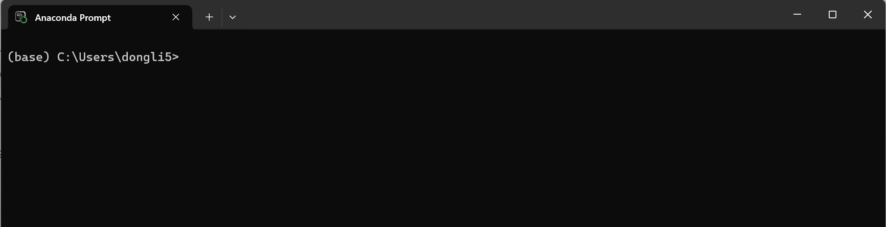
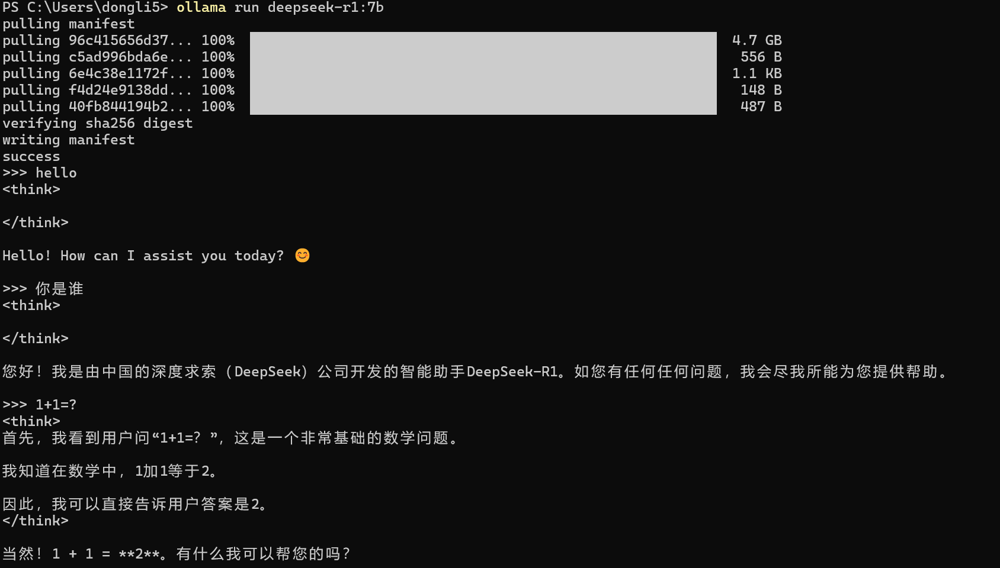

## 一、Python环境搭建
### 1.1 Anaconda
> Anaconda = Python 的“发行版 + 管理器 + 全家桶生态”。你可以把它理解为“Python 界的 Node.js + nvm + npm + yarn + virtualenv 的合体But更强”。这里安装Anaconda主要是为了做好python版本管理。
- **python官网：** https://www.python.org/
- **conda官网：** https://github.com/conda/conda
- **anaconda官网：** https://www.anaconda.com/

### 1.2 conda指令
Anaconda安装完成后，在搜索框搜索【Anaconda prompt】，就会进行如下界面：


```sh
// 查看版本号
(base) C:\Users\dongli5>conda --version
conda 25.5.1

// 查看目前存在的环境，* 表示当前激活的环境
(base) C:\Users\dongli5>conda env list

            C:\Users\dongli5\.codegeex\mamba\envs\codegeex-agent
base      * D:\Anaconda
python11    D:\Anaconda\envs\python11

// 激活环境
(base) C:\Users\dongli5>conda activate python11
(python11) C:\Users\dongli5>

// 创建新的python环境
conda create -n python13 python=3.13
```
> 这里conda切换python版本，就比较类似于nvm切换node版本，而且给某一个python版本安装依赖包的时候，比较类似于npm安装全局依赖。

## 二、uv环境
### 2.1 uv是什么？
> uv 是一个超快的 Python 包管理与构建工具，由 Astral（前 Rust 工具作者团队）开发。
简单说：它是 pip、pipx、virtualenv、venv、Poetry 的“极速替代品”。它是用 Rust 语言 写的，比传统 Python 工具快几十倍甚至上百倍。

### 2.2 uv安装
```sh
pip install uv
```
### 2.3 uv指令
**(1)初始化项目**
```shell
uv init myproject
```
**(2)创建虚拟环境**
```shell
cd myproject
uv venv
```
**(3)激活环境**
```shell
cd myproject
.venv\Scripts\activate
```
**(4)安装 Python包**
```shell
uv add requests
```
**(5)运行脚本**
```shell
uv run request.py
```
### 2.4 pyproject.toml
> uv 的核心配置文件，类似于 npm 的 package.json。它支持 Python 的 PEP 517/518 标准，可以指定 Python 版本、依赖包、构建工具等。也可以指定安装源
```toml
[tool.uv]
python = "3.11"
packages = [
    "requests",
    "uvicorn",
]

// 指定安装源
[tool.uv.source]
url = "https://mirrors.aliyun.com/pypi/simple"
default = true
```

## 三、大模型调用方法
### 3.1 Ollama本地调用
> Ollama 是一个开源的本地化大语言模型(LLM)运行和管理工具，旨在简化大型语言模型的部署和使用。它支持在本地设备上高效运行多种开源模型(如 Llama、DeepSeek、Qwen 等)，无需依赖云端服务，保障数据隐私。

- **Ollama官网地址** : https://ollama.com/

### 3.2 Ollama安装模型
Ollama 支持把模型放到其他盘符，尤其在 Windows 上，默认会把模型放在 C:\Users\<你>\.ollama\models，很容易把 C 盘撑爆。你可以通过 设置环境变量 OLLAMA_MODELS 来指定模型存储路径。可以使用系统环境变量的方式，将模型存放在其他盘符下。
- 1、打开：开始菜单 → 搜索「环境变量」 → 编辑系统环境变量
- 2、点击右下角的 环境变量
- 3、在「用户变量」或「系统变量」中新建：
```makefile
变量名：OLLAMA_MODELS
变量值：D:\ollama-models
```
- 4、保存后 重启 Ollama 服务 或重启电脑：
```makefile
ollama serve
```
- 5、查看模型列表：
```sh
ollama list

// 输出
NAME           	ID          	SIZE
llama3:8b      	sha256:xxx  	4.7 GB
qwen2.5:7b     	sha256:xxx  	4.1 GB
mistral:7b     	sha256:xxx  	4.2 GB
```
- 6、启动模型
```sh
ollama run deepseek-r1:7b
```
如果出现可以正常对话，则表示模型正常运行。


## 四、python调用本地模型
### 4.1 创建项目
```sh
// 初始化项目
uv init project1

cd project1

// 创建虚拟环境
uv venv
```

### 4.2 安装依赖
```sh
uv add langchain-ollama
```
- **langchain-ollama地址:** https://docs.langchain.com/oss/python/integrations/chat/ollama

### 4.3 执行脚本
```python
from langchain_ollama.chat_models import ChatOllama

if __name__ == "__main__":
    messages = [
        (
            "system",
            "You are a helpful assistant that translates English to French. Translate the user sentence.",
        ),
        ("human", "I love programming.")
    ]
    llm = ChatOllama(model="deepseek-r1:7b")
    resp = llm.invoke(messages)
    print(resp)
```
输出结果：
```shell
content='<think>\nOkay, so I need to translate "I love programming." from English to French. Let me think about how to approach this.\n\nFirst, breaking down the sentence: "I" is a subject pronoun 
```
这里一定要注意：**关掉代理，关掉梯子，关掉vpn.......**

## 五、流式输出
流式输出是将之前 **invoke** 改为 **stream** ,下面是一个例子：
```python
from langchain_ollama.chat_models import ChatOllama

if __name__ == "__main__":
    messages = [
        (
            "system",
            "我是一个故事小能手，喜欢讲睡前故事，你喜欢什么类型的故事呢？",
        ),
        ("human", "安童生童话")
    ]
    llm = ChatOllama(model="deepseek-r1:7b")
    resp = llm.stream(messages)

    for chunk in resp:
        print(chunk.content, end="")
```
输出结果：
```shell
<think>
嗯，用户说她是故事小能手，喜欢讲睡前故事，问喜欢什么类型的。然后回复是“安童生童话”。看起来用户可能是在找一个童话类的故事推荐或者品牌。

首先，“安童生”这个名字听起来像是童话系列的产品，可能是儿童教育用的玩具或书籍。所以，用户可能在寻找适合儿童的故事书，特别是童话类的。

接下来，用户提到喜欢睡前故事，通常这类故事比较柔和、有教育意义，容易入睡。安童生童话可能提供高质量的故事，涵盖各种主题，比如成长、友谊、冒险等，满足不同孩子的兴趣。

另外，用户可能是家长或者照顾孩子的成年人，希望给孩子讲故事的同时也能促进亲子互动。安童生童话可能包含故事书和配套的教具，增加互动性。

还有一点是品牌信任感，“安童生”可能是一个知名的教育类品牌，用户可能觉得可靠，适合孩子。因此，推荐这个系列可能是因为它的高质量和多样的内容。

综合来看，用户的需求是寻找高质量、适合儿童的童话故事，特别是睡前故事，可能需要有教育意义和互动性高的产品。
</think>

安童生童话是一个专门致力于儿童文学创作和出版的品牌，旨在为儿童提供丰富多样且富有教育意义的童话故事。他们的作品通常包含丰富的想象力和深刻的教育价值，适合各个年龄段的孩子。

如果你喜欢听童话故事，并希望给孩子讲睡前故事，那么安童生童话可能会是一个不错的选择。他们的故事不仅有趣，还能让孩子在轻松的氛围中学到知识和道理。

如果你对安童生童话感兴趣，可以尝试查找相关的书籍或儿童读物，享受其中的故事内容！
```

## 六、百炼平台模型调用
前面阐述的是本地部署模型调用，其实模型也可以调用远程，接下来以阿里云百炼平台为例。
- **阿里云百炼平台地址：** https://bailian.console.aliyun.com/
### 6.1 文本生成调用
- **获取API-key地址：** https://bailian.console.aliyun.com/?tab=globalset#/efm/api_key
```python
import os
from openai import OpenAI

client = OpenAI(
    api_key=os.getenv("DASHSCOPE_API_KEY"),
    base_url="https://dashscope.aliyuncs.com/compatible-mode/v1",
)

completion = client.chat.completions.create(
    # 模型列表：https://help.aliyun.com/zh/model-studio/getting-started/models
    model="qwen-plus",
    messages=[
        {"role": "system", "content": "You are a helpful assistant."},
        {"role": "user", "content": "你是谁？"},
    ]
)
print(completion.model_dump_json())
```
输出结果：
```shell
{"id":"chatcmpl-4aabb4d0-bea2-46d9-a2a4-dfded4df1416","choices":[{"finish_reason":"stop","index":0,"logprobs":null,"message":{"content":"我是通义千问，阿里巴巴集团旗下的超大规模语言模型。我能够回答问题、创作文字，如写故事、公文、邮件、剧本等，还能进行逻辑推理、编程，甚至表达观点和玩游戏。我支持多种语言，包括但不限于中文、英文、德语、法语、西班牙语等。如果你有任何问题或需要帮助，欢迎随时告诉我！","refusal":null,"role":"assistant","annotations":null,"audio":null,"function_call":null,"tool_calls":null}}],"created":1763574521,"model":"qwen-plus","object":"chat.completion","service_tier":null,"system_fingerprint":null,"usage":{"completion_tokens":79,"prompt_tokens":22,"total_tokens":101,"completion_tokens_details":null,"prompt_tokens_details":{"audio_tokens":null,"cached_tokens":0}}}
```
### 6.2 深度思考
```python
import os
from openai import OpenAI

client = OpenAI(
    # 若没有配置环境变量，请用百炼API Key将下行替换为：api_key="sk-xxx"
    api_key=os.getenv("DASHSCOPE_API_KEY"),
    base_url="https://dashscope.aliyuncs.com/compatible-mode/v1",
)

completion = client.chat.completions.create(
    # 模型列表：https://help.aliyun.com/zh/model-studio/getting-started/models
    model="qwen-plus",
    messages=[
        {"role": "system", "content": "You are a helpful assistant."},
        {"role": "user", "content": "你是谁？"},
    ]
)
print(completion.model_dump_json())
```