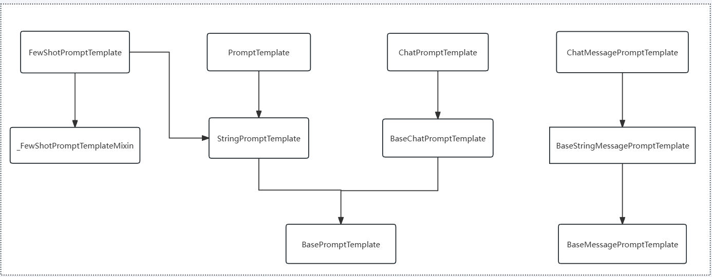

## 一、使用LangChain调用通义千问
### 1.1 实例化大模型
```python
from langchain_openai import ChatOpenAI

llm = ChatOpenAI(
    model="qwen-plus",
    base_url="https://dashscope.aliyuncs.com/compatible-mode/v1",
    api_key="sk-xxx",
    streaming=True
)
```
> 注意 api_key 会提示：Expected type 'SecretStr | None', got 'str' instead 错误
- **解决方案**
使用SecretStr类型对api_key进行加密。

**安装 pydantic：**
```shell
uv add pydantic
```
> Pydantic 是一个基于 Python 类型注解（type hints）的数据验证与解析库，广泛用于数据模型定义、数据验证、序列化和反序列化。它通过定义类（继承自 BaseModel）和类型注解，自动验证输入数据的结构和类型，确保数据符合预期格式，并提供清晰的错误信息。官网：https://docs.pydantic.dev/

可以使用 SecretStr 进行优化：
```python
from langchain_openai import ChatOpenAI
from pydantic import SecretStr

llm = ChatOpenAI(
    model="qwen-plus",
    base_url="https://dashscope.aliyuncs.com/compatible-mode/v1",
    api_key=SecretStr("sk-xxxx"),
    streaming=True
)
```
此时api_key 将被安全地存储和传输，而不会以明文形式暴露。llm对象打印的效果：
```shell
client=<openai.resources.chat.completions.completions.Completions object at 0x000001FF70885400> async_client=<openai.resources.chat.completions.completions.AsyncCompletions object at 0x000001FF70885E80> root_client=<openai.OpenAI object at 0x000001FF702EEA50> root_async_client=<openai.AsyncOpenAI object at 0x000001FF70885BE0> model_name='qwen-plus' model_kwargs={} openai_api_key=SecretStr('**********') openai_api_base='https://dashscope.aliyuncs.com/compatible-mode/v1' streaming=True
```

## 二、初始化提示词模板
### 2.1 PromptTemplate: (字符串提示词模板)

**适用场景：**
- 用于**文本补全模型** ，输入是纯文本（单字符串）。
- 适用于简单的任务，例如生成一段文本、回答问题或执行指令。 

**特点：**
- **输入变量插值：** 使用 `{}` 插入变量。
- **模板格式：** 支持`f-string`。
- **格式输出：** 生成一个完整的字符串作为模型输入。

**示例:**
```python
from langchain_core.prompts import PromptTemplate

template_prompt = PromptTemplate.from_template("今天{someting}真不错。")
print(template_prompt)
prompt = template_prompt.format(something="天气")
print(prompt)

# input_variables=['someting'] input_types={} partial_variables={} template='今天{someting}真不错。'
# 今天天气真不错。
```

### 2.2 ChatPromptTemplate (聊天提示模板)
**适用场景：**
- 用于**聊天模型**（如 ChatGPT / 通义千问等），输入是多轮对话的消息列表（SystemMessage、HumanMessage、AIMessage 等）。
- 适用于需要模拟多轮对话或角色扮演的场景。

**特点：**
- **多消息类型支持：** 可以组合系统指令、用户输入和助手回复。
- **消息格式化：** 生成结构化的消息列表，供聊天模型处理。
- **灵活性：** 支持动态替换变量（如 SystemMessage 中的占位符）。

**示例：**
```python
from langchain_core.prompts import ChatPromptTemplate

system_message = "你是一位{role}专家，擅长回答{domain}领域的问题。"
human_message = "{question}"

chat_template = ChatPromptTemplate(
    [
        ("system", system_message),
        ("human", human_message)
    ]
)

formated_template = chat_template.format(role="技术", domain="web开发", question="如何基于Vue创建一个前端项目")
print(formated_template)

# System: 你是一位技术专家，擅长回答web开发领域的问题。
# Human: 如何基于Vue创建一个前端项目
```
**python基础知识扩充：**
```shell
这里的 ("system", system_message)是 python 的 tuple 类型。
Tuple（元组）：
    - 有序：元素按顺序排列，支持索引和切片操作。
    - 不可变：创建后无法修改（不能增删改元素）。
    - 定义方式：使用圆括号 () 或直接逗号分隔元素。
Array（数组）：相当于 JS 中的 Array
    - 可变：可以动态添加、删除或修改元素。
    - 有序：元素按顺序排列，支持索引和切片。
Dict（字典）：相当于 JS 中的 Object
    - 无序：元素（键值对）没有固定顺序。
    - 可变：可以动态添加、删除或修改键值对。
    - 定义方式：使用花括号 {}，键值对用冒号 : 分隔。
```
### 2.3 ChatMessagePromptTemplate (聊天消息提示模板)
> ChatMessagePromptTemplate可以结合 ChatPromptTemplate使用，同时对提示词模板和消息体进行抽象和复用：
```python
from langchain_core.prompts import ChatMessagePromptTemplate, ChatPromptTemplate
system_template = ChatMessagePromptTemplate.from_template(
    template="你是一位{role}专家，擅长回答{domain}领域的问题。",
    role="system"
)
human_message = ChatMessagePromptTemplate.from_template(
    template="{question}",
    role="human"
)
chat_template = ChatPromptTemplate.from_messages([
    system_template,
    human_message
])
messages = chat_template.format_messages(role="技术", domain="web前端", question="如何基于Vue创建一个前端项目？")
print(messages)


# [ChatMessage(content='你是一位技术专家，擅长回答web前端领域的问题。', 
# additional_kwargs={}, response_metadata={}, role='system'), 
# ChatMessage(content='如何基于Vue创建一个前端项目？', additional_kwargs={}, 
# response_metadata={}, role='human')]
```

### 2.4 FewShotPromptTemplate (少样本提示模板)
**适用场景：**
- 用于**少样本学习**（Few-Shot Learning），在提示中包含示例（Examples），帮助模型理解任务。
- 适用于复杂任务（如翻译、分类、推理），需要通过示例引导模型行为。

**特点：**
- **示例嵌入：** 通过 `examples` 参数提供示例输入和输出。
- **动态示例选择：** 支持 `ExampleSelector` 动态选择最相关的示例。
- **模板格式：** 通常包含前缀（Prefix）、示例（Examples）和后缀（Suffix）。

**示例：**
```python
from langchain_core.prompts import FewShotPromptTemplate, PromptTemplate
# 定义示例模板
example_template = "输入: {input}\n输出: {output}"
# 示例
examples = [
    {"input": "将'Hello'翻译成中文", "output": "你好"},
    {"input": "将'Goodbye'翻译成中文", "output": "再见"}
]
few_shot_prompt_template = FewShotPromptTemplate(
    examples=examples,
    example_prompt=PromptTemplate.from_template(example_template),
    prefix="请将以下英文翻译成中文：",
    suffix="输入: {text}\n输出:",
    input_variables=["text"]
)
few_shot_prompt = few_shot_prompt_template.format(text="thank you")
print(few_shot_prompt)

# 请将以下英文翻译成中文：

# 输入: 将'Hello'翻译成中文
# 输出: 你好

# 输入: 将'Goodbye'翻译成中文
# 输出: 再见

# 输入: thank you
# 输出:
```

### 2.5 总结对比
**常用模板类特性和使用场景对比**
|子类|适用模板类型|输入类型|主要用途|
|-----|-----|-----|-----|
|`PromptTemplate`| 文本补全模型 |单字符串| 生成单轮文本任务的提示 |
|`ChatPromptTemplate`| 聊天模型 | 多消息列表 | 模拟多轮对话或角色扮演 |
|`FewShotPromptTemplate`| 所有模型 |包含示例的模板  | 通过示例引导模型完成复杂任务 |

**常用提示词模板类的继承关系**


## 三、链式调用大模型
```python
from langchain_openai import ChatOpenAI
from langchain_core.prompts import ChatPromptTemplate
from pydantic import SecretStr

prompt_template = ChatPromptTemplate.from_messages([
    ("system", "你是一个计算专家，帮我解决如下问题："),
    ("human", "{question}")
])

llm = ChatOpenAI(
    model="qwen-plus",
    base_url="https://dashscope.aliyuncs.com/compatible-mode/v1",
    api_key=SecretStr("sk-xxxx"),
    streaming=True
)

chain = prompt_template | llm

resp = chain.stream(input={ "question" : "100+100=?"})

for chunk in resp:
    print(chunk.content, end="")

# 100 + 100 = **200**。
```

## 四、绑定自定义工具
### 4.1 开发工具函数
```python
def add(a, b):
    return a + b
```
### 4.2 将工具函数转为LangChain Tool对象
LangChain中的工具（Tool）是一个封装了特定功能的类，它包含四个核心组成部分：
- **名称（name）：** 名称是工具在工具集合中的**唯一标识符**，必须确保在同一工具集中不重复。
- **描述（description）：** 描述用于说明工具的功能，为LLM或代理提供上下文信息，**帮助模型理解何时以及如何调用该工具**。
- **参数模式（args_schema）：** 是使用Pydantic BaseModel定义的输入参数结构，用于验证和解析工具调用的参数。
- **是否直接返回（return_direct）：** 布尔值属性，当设置为True时，智能体会在调用工具后立即返回结果给用户，而不继续调用其他工具。

```python
from langchain_core.tools import tool
from pydantic import BaseModel, Field

class AddInputArgs(BaseModel):
    a: int = Field(description="first number"),
    b: int = Field(description="second number")

@tool(
    description="add two numbers",
    args_schema=AddInputArgs,
    return_direct=True
)
def add(a, b):
    return a + b
```

**方法一：使用Tool.from_function生成**
```python
add_tools = Tool.from_function(
    func=add,
    name="add",
    description="计算两个数相加"
)
```
**方法2：使用@tool装饰器生成**
```python
@tool
def add(a, b):
    """add two numbers"""
    return a + b
```

### 4.3 将工具绑定到模型上
```python
llm_with_tools = llm.bind_tools([add_tools])
```

### 4.4 调用模型
```python
from langchain_core.tools import tool
from pydantic import BaseModel, Field
from langchain_openai import ChatOpenAI
from pydantic import SecretStr
from langchain_core.prompts import ChatPromptTemplate

class AddInputArgs(BaseModel):
    a: int = Field(description="first number")
    b: int = Field(description="second numb er")

@tool(
    description="add two numbers",
    args_schema=AddInputArgs,
    return_direct=True
)

def add(a, b):
    return a + b

llm = ChatOpenAI(
    model="qwen-plus",
    base_url="https://dashscope.aliyuncs.com/compatible-mode/v1",
    api_key=SecretStr("sk-f79659d832694e90b199f10026d3de67"),
    streaming=True
)

llm_with_tools = llm.bind_tools([add])

# 提示词
prompt_template = ChatPromptTemplate.from_messages([
    ("system", "你是一名资深的开发工程师，叫做Alice"),
    ("human", "{user_input}")
])

prompt = prompt_template.format(user_input="计算100+100=")

resp = llm_with_tools.invoke(prompt)

print(resp)

# 输出结果为：
#content='' additional_kwargs={} response_metadata={'finish_reason': 'tool_calls', 'model_name': 'qwen-plus',
#'model_provider': 'openai'} id='lc_run--8ee6f964-7372-4339-acbe-c040bdfa30fc' tool_calls=[{'name': 'add', 'args':
# {'a': 100, 'b': 100}, 'id': 'call_d5a95787cbac4c4fbeef8d', 'type': 'tool_call'}]

```
其中比较重要的是这段输出结果：
```shell
{'finish_reason': 'tool_calls', 'model_name': 'qwen-plus', 'model_provider': 'openai'} id='lc_run--8ee6f964-7372-4339-acbe-c040bdfa30fc' tool_calls=[{'name': 'add', 'args': {'a': 100, 'b': 100}, 'id': 'call_d5a95787cbac4c4fbeef8d', 'type': 'tool_call'}
```
这里模型会将接下来需要调用工具的名称和参数以一个数组的形式去返回给调用测。

### 4.5 调用工具
如下是完整的模型调用工具的代码：
```python
from langchain_core.tools import tool
from pydantic import BaseModel, Field
from langchain_openai import ChatOpenAI
from pydantic import SecretStr
from langchain_core.prompts import ChatPromptTemplate

class AddInputArgs(BaseModel):
    a: int = Field(description="first number")
    b: int = Field(description="second numb er")

@tool(
    description="add two numbers",
    args_schema=AddInputArgs,
    return_direct=True
)

def add(a, b):
    return a + b

llm = ChatOpenAI(
    model="qwen-plus",
    base_url="https://dashscope.aliyuncs.com/compatible-mode/v1",
    api_key=SecretStr("sk-f79659d832694e90b199f10026d3de67"),
    streaming=True
)

llm_with_tools = llm.bind_tools([add])

# 提示词
prompt_template = ChatPromptTemplate.from_messages([
    ("system", "你是一名资深的开发工程师，叫做Alice"),
    ("human", "{user_input}")
])
# 工具集合
tools_dict = {
    "add": add
}

prompt = prompt_template.format(user_input="计算100+100=")

resp = llm_with_tools.invoke(prompt)

for tool_calls in resp.tool_calls:
    print(tool_calls)
    args = tool_calls['args'] # 参数
    func_name = tool_calls['name'] # 调用方法名
    func = tools_dict[func_name]
    tool_content = func.invoke(args)
    print(tool_content)
```