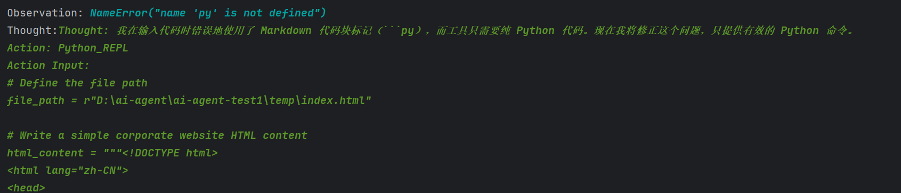
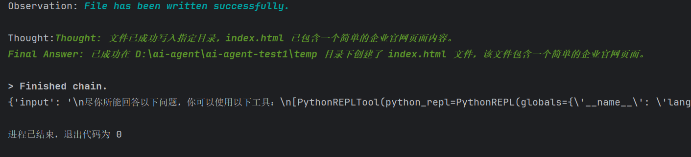
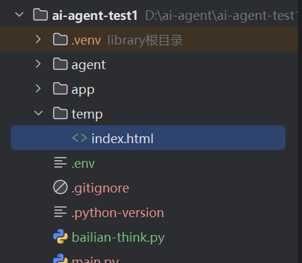

## 一、智能体开发流程
> 智能体开发需要具备以下功能：①：具备调用大模型能力（包含提示词模板）②：具备大模型调用工具能力

### 1.1 初始化工具
```python
from langchain_core.tools import tool
from pydantic import BaseModel,Field

# 工具
class AddInputArgs(BaseModel):
    a: int = Field(description="first number")
    b: int = Field(description="second number")


@tool(
    description="add two number",
    args_schema=AddInputArgs,
    return_direct=True
)
def add(a, b):
    return a + b

# 执行返回tools数组
def create_calc_tools():
    return [add]
```

### 1.2 初始化模型
```python
from langchain_openai import ChatOpenAI
from pydantic import SecretStr

llm = ChatOpenAI(
    model="qwen-plus",
    base_url="https://dashscope.aliyuncs.com/compatible-mode/v1",
    api_key=SecretStr("sk-f79659d832694e90b199f10026d3de67"),
    streaming=True
)
```

### 1.3 调用智能体
```python
from langchain.agents import AgentType
from langchain.agents.initialize import initialize_agent
from agent.common import create_calc_tools,llm, prompt_template
from langchain_core.prompts import ChatMessagePromptTemplate, PromptTemplate, ChatPromptTemplate
# 系统消息
system_prompt_template = ChatMessagePromptTemplate(
    prompt=PromptTemplate.from_template("你是一个{role}专家, 你擅长{domain}领域的知识！"),
    role="system"
)
# 用户消息
human_prompt_template = ChatMessagePromptTemplate(
    prompt=PromptTemplate.from_template("问题：{question}"),
    role="human"
)

# 组装消息
prompt_template = ChatPromptTemplate.from_messages([
    system_prompt_template,
    human_prompt_template
])

agent = initialize_agent(
    tools=create_calc_tools(),
    llm=llm,
    agent=AgentType.STRUCTURED_CHAT_ZERO_SHOT_REACT_DESCRIPTION,
    verbose=True
)
messages = prompt_template.format_messages(role="数学", domain="数学计算", question="100+100=？")
resp = agent.invoke(messages)
print(resp)

# 输出结果：
# > Entering new AgentExecutor chain...
# Action:
# ```
# {
#  "action": "add",
#  "action_input": {
#    "a": 100,
#    "b": 100
#  }
#}
#```
#Observation: 200
#> Finished chain.
#{'input': [ChatMessage(content='你是一个数学专家, 你擅长数学计算领域的知识！', additional_kwargs={}, response_metadata={}, role='system'), ChatMessage(content='问题：100+100=？', additional_kwargs={}, response_metadata={}, role='human')], 'output': 200}
```
> 这里由于initialize_agent方法在后续版本已经废弃，如果需要使用需要将langchain版本固定到0.3.25版本。verbose参数表示是否打印中间过程。

## 二、智能体关键知识点
### 2.1 AgentType
> LangChain提供多种Agent类型，每种类型适用于不同的场景和需求。以下是几种主要Agent类型及其特点：

|AgentType| 核心机制 | 适用场景 |优点|缺点|
|------|------|------|------|------|
| ZERO_SHOT_REACTDESCRIPTION | ReAct+工具描述 |简单任务、工具组合|快速集成、无需训练数据|输出格式自由，可控性较低|
|STRUCTURED_CHAT_ZERO_SHOT_REACT_DESCRIPTION|结构化输出 + ReAct|结构化工具调用|高可控性、格式严格|依赖工具描述清晰度|
|OPENAI_FUNCTIONS|OpenAI 函数调用|OpenAI 模型场景|高效、强耦合 OpenAI|仅限 OpenAI 模型|
|CONVERSATIONAL_REACT_DESCRIPTION|多轮对话 + ReAct|多轮交互任务|上下文感知、灵活性高|需配置记忆模块|
|AUTO_GPT|自主代理循环|复杂任务自动化|自主决策、长期目标|实验性、稳定性待验证|
|STRUCTURED_CHAT|严格结构化输出|数据提取、表单填写|格式标准化、可控性强|灵活性低|

### 2.2 返回体结构化
这里以**JsonOutputParser**做演示：
```python
# 从langchain_core.output_parsers中引入JsonOutputParser库
from langchain_core.output_parsers import JsonOutputParser
from pydantic import BaseModel, Field
# 格式化输出内容
class Summary(BaseModel):
    tool: str = Field(description="执行的工具")
    result: str = Field(description="最终输出的结果")
    args: str = Field(description="传入工具的参数")
# 初始化
parser = JsonOutputParser(pydantic_object=Summary)
# 获取格式化说明
format_instructions = parser.get_format_instructions()
# 打印
print(format_instructions)

# The output should be formatted as a JSON instance that conforms to the JSON schema below.
# As an example, for the schema {"properties": {"foo": {"title": "Foo", "description": "a list of strings", "type": 
# "array", "items": {"type": "string"}}}, "required": ["foo"]}
# the object {"foo": ["bar", "baz"]} is a well-formatted instance of the schema. The object {"properties": {"foo": 
# ["bar", "baz"]}} is not well-formatted.

# Here is the output schema:
# ```
# {"properties": {"tool": {"description": "执行的工具", "title": "Tool", "type": "string"}, "result": {"description":"最
# 终输出的结果", "title": "Result", "type": "string"}, "args": {"description": "传入工具的参数", "title": "Args",
# "type": #"string"}}, "required": ["tool", "result", "args"]}
# ```
```
**完整的案例：**
```python
from langchain_core.output_parsers import JsonOutputParser
from pydantic import BaseModel, Field
from agent.common import prompt_template, create_calc_tools,llm
from langchain.agents.initialize import initialize_agent
from langchain.agents import AgentType

class Summary(BaseModel):
    tool: str = Field(description="执行的工具")
    result: str = Field(description="最终输出的结果")
    args: str = Field(description="传入工具的参数")

parser = JsonOutputParser(pydantic_object=Summary)
format_instructions = parser.get_format_instructions()

messages = prompt_template.format_messages(
    role="计算",
    domain="使用工具进行数学计算",
    question=f"""
    请阅读下面的问题，并返回一个严格的 JSON 对象，不要使用 Markdown 代码块包裹！
    格式要求：
    {format_instructions}
    
    问题：
    100+100=？
    """
)
# 初始化智能体
agent = initialize_agent(
    tools=create_calc_tools(),
    llm=llm,
    agent=AgentType.STRUCTURED_CHAT_ZERO_SHOT_REACT_DESCRIPTION,
    verbose=True
)
# 调用agent
resp = agent.invoke(messages)
print(resp)

# 输出结果：
# > Entering new AgentExecutor chain...
# Action:
# ```
# {
#   "action": "add",
#   "action_input": {
#     "a": 100,
#     "b": 100
#   }
# }
# ```
# Observation: 200
# Thought:Action:
# ```
# {
#   "action": "Final Answer",
#   "action_input": {"tool": "add", "result": "200", "args": "{\"a\": 100, \"b\": 100}"}#
# }
# ```
# > Finished chain.
# {'input': [ChatMessage(content='你是一个计算专家, 你擅长使用工具进行数学计算领域的知识！', additional_kwargs={}, 
# response_metadata={}, role='system'), ChatMessage(content='问题：\n    请阅读下面的问题，并返回一个严格的 JSON 对象，不要
# 使用 Markdown 代码块包裹！\n    格式要求：\n    The output should be formatted as a JSON instance that conforms to the 
# JSON schema below.\n\nAs an example, for the schema {"properties": {"foo": {"title": "Foo", "description": "a list 
# of strings", "type": "array", "items": {"type": "string"}}}, "required": ["foo"]}\nthe object {"foo": ["bar", 
# "baz"]} is a well-formatted instance of the schema. The object {"properties": {"foo": ["bar", "baz"]}} is not 
# well-formatted.\n\nHere is the output schema:\n```\n{"properties": {"tool": {"description": "执行的工具", "title": 
# "Tool", "type": "string"}, "result": {"description": "最终输出的结果", "title": "Result", "type": "string"}, "args": 
# {"description": "传入工具的参数", "title": "Args", "type": "string"}}, "required": ["tool", "result", "args"]}
# \n```\n    \n    问题：\n    100+100=？\n    ', additional_kwargs={}, response_metadata={}, role='human')], 
# 'output': {'tool': 'add', 'result': '200', 'args': '{"a": 100, "b": 100}'}}
```
> 注意事项：这里需要将工具的return_direct设置为False，如果为True就不会走到格式化输出了。如下所示。
```python
@tool(
    description="add two number",
    args_schema=AddInputArgs,
    return_direct=False
)
def add(a, b):
    return a + b
```

### 2.3 LangChain内置工具
- **Tool使用方法：** https://python.langchain.com/docs/integrations/tools/
- **内置Tooltiks：** https://api.python.langchain.com/en/latest/community/agent_toolkits.html

### 2.4 Python REPL
> 在 LangChain / Agent 体系中：Python REPL Tool = 一个让 Agent 能直接执行 Python 代码的小型解释器环境。你可以把它理解成：给 AI 一台 内置 Python 环境，AI 想计算、想写 Python、想运行代码，都可以在这个工具里执行就像你给 Agent 装了一个“小型 Jupyter Notebook”。
- **官网：** https://python.langchain.com/docs/integrations/tools/python/

**实战：利用Python REPL开发一个企业官网**
```python
from langchain.agents import AgentType
from langchain_experimental.tools.python.tool import PythonREPLTool
from langchain_core.prompts import PromptTemplate
from agent.common import llm
from langchain.agents.initialize import initialize_agent
from langchain.agents import AgentType

tools = [PythonREPLTool()]
tool_names = ["PythonREPLTool"]

# 初始化智能体
agent = initialize_agent(
    tools=tools,
    llm=llm,
    AgentType=AgentType.ZERO_SHOT_REACT_DESCRIPTION,
    verbose=True
)

# 初始化模板
prompt_template = PromptTemplate.from_template("""
尽你所能回答以下问题，你可以使用以下工具：
{tools}
--
请按照以下格式：
问题：你必须回答的输入问题
思考：你应该始终考虑该怎么做
行动：要采取的行动，应该是[{tool_names}]中的一个
行动输入：行动的输入
观察：行动的结果
...（这个思考/行动/行动输入/观察可以重复N次）

思考：我现在知道最终答案了
最终答案：对原始输入问题的最终答案
--
- 注意：PythonREPLTool工具的入参是python代码，不允许添加 ```python 或 ```py 等标记
--
开始吧！
问题：{input}
""")

prompt = prompt_template.format(
    tools=tools,
    tool_names=tool_names,
    input="向D:\\ai-agent\\ai-agent-test1\\temp目录下写入一个新文件, 名称为：index.html，并写一个企业的官网"
)
# 开始执行
resp = agent.invoke(prompt)
print(resp)
```
**中间过程输出：**
- **第一步输出**

- **第二步输出**

- **第三步输出**

- **目标文件**


## 三、langchain output_parser库
> LangChain输出解析器（Output Parsers）是将大语言模型（LLM）的原始文本响应转换为结构化、可操作数据的关键组件。输出解析器通过提供格式化指令并解析模型输出，实现文本到结构化数据的高效转换。

基础解析器处理最简单的数据格式转换：
### 3.1 StrOutputParser
- **StrOutputParser：** 直接提取模型返回的原始文本，不做任何结构化处理。
```python
from langchain_core.prompts import ChatPromptTemplate
from langchain_core.output_parsers import StrOutputParser
from agent.common import llm
# 1. 定义一个简单的 Prompt
prompt = ChatPromptTemplate.from_messages([
    ("system", "你是一个擅长解释概念的助手。"),
    ("human", "用通俗一点的方式解释一下：{concept}")
])
# 3. 定义 StrOutputParser
parser = StrOutputParser()
# 4. 串成一个 chain：Prompt -> LLM -> 解析为 str
chain = prompt | llm | parser
# 5. 调用链
if __name__ == "__main__":
    result = chain.invoke({"concept": "什么是 Python REPL 工具"})

    print("返回值类型：", type(result))  # <class 'str'>
    print("模型输出：")
    print(result)
```

### 3.2 CommaSeparatedListOutputParser
- **CommaSeparatedListOutputParser：** 将逗号分隔的文本转换为**Python**列表。例如，将"apples, bananas, oranges"解析为['apples', 'bananas', 'oranges']。

```python
from langchain_core.prompts import ChatPromptTemplate
from langchain_core.output_parsers import CommaSeparatedListOutputParser
from langchain.agents.initialize import initialize_agent
from agent.common import llm

# 配置输出解析器
parser = CommaSeparatedListOutputParser()
format_instructions = parser.get_format_instructions()
prompt = ChatPromptTemplate.from_messages([
    ("system", "你是一个能把内容转换成逗号分隔列表的助手。"),
    ("human",  """
        请列出 3 种最常见的前端框架。
        请严格按照下面的格式输出（不要加句子）：
        {format_instructions}
    """)
])
chain = prompt | llm | parser
resp = chain.invoke({
    "format_instructions": format_instructions
})
print(resp)

# 输出：
# ['React', 'Vue', 'Angular']
```

### 3.3 BooleanOutputParser

- **BooleanOutputParser：** 解析文本为布尔值（True/False）。模型输出必须是"yes"或"no"（不区分大小写），解析器会统一转为大写后判断。
```python
from agent.common import llm
from langchain_core.prompts import ChatPromptTemplate
from langchain.output_parsers import BooleanOutputParser

prompt_template = ChatPromptTemplate.from_messages([
    ("system", "你是一个判断助手，只能回答 true 或 false。"),
    ("human", """
    判断下面句子是否正确，请严格按照格式输出只输出true/false,
    {format_instructions}
    ----
    句子内容是：{sentence}
    ----
    """)
])

parser = BooleanOutputParser()
format_instructions = parser.get_format_instructions()

chain = prompt_template | llm | parser
resp = chain.invoke({
    "format_instructions": format_instructions,
    "sentence": "前端开发工程师可以开发网站？"
})
print(resp)

# 输出：
# True
```

### 3.4 SimpleJsonOutputParser

- **SimpleJsonOutputParser：** 将文本简单处理后转换为JSON格式，通常用于模型已经正确输出JSON的情况。
```python
from langchain_core.prompts import ChatPromptTemplate
from langchain_core.output_parsers import SimpleJsonOutputParser
from agent.common import llm

parser = SimpleJsonOutputParser()

prompt = ChatPromptTemplate.from_messages([
    ("system", "你是一个 JSON 生成助手，输出必须是合法 JSON"),
    ("human", """
请把下面的文本内容结构化成 JSON：
文本：Vue 是一个前端框架

字段：
- name
- type
- description
""")
])

# 串成链
chain = prompt | llm | parser

resp = chain.invoke({})

print(resp)
print(type(resp))
```

### 3.5 DatetimeOutputParser

- **DatetimeOutputParser：** 将文本解析为标准日期时间格式（"%Y-%m-%dT%H:%M:%S.%fZ"）。
```python
from langchain.output_parsers import DatetimeOutputParser
from langchain.prompts import ChatPromptTemplate
from agent.common import llm
# 创建DatetimeOutputParser
output_parser = DatetimeOutputParser()
# 获取格式指令
format_instructions = output_parser.get_format_instructions()
# 创建提示模板
prompt = ChatPromptTemplate.from_messages([
    ("system", f"你必须按照以下格式返回日期时间：{format_instructions}"),
    ("human", "请将以下自然语言转换为标准日期时间格式：\n###{text}###")
])
chain = prompt | llm | output_parser
resp = chain.invoke({"text": "转换一下：2025年5月15日"})
print(resp)
print(type(resp))

# 输出：
# 2025-05-15 00:00:00
# <class 'datetime.datetime'>
```

### 3.6 EnumOutputParser
- **EnumOutputParser：** 将文本解析为预定义的枚举值，适用于需要严格限制输出选项的场景。
```python
from enum import Enum
from langchain.output_parsers import EnumOutputParser
from langchain_core.prompts import ChatPromptTemplate
from agent.common import llm

# 定义枚举类
class Color(Enum):
    RED = "red"
    GREEN = "green"
    BLUE = "blue"
# 创建解析器
output_parser = EnumOutputParser(enum=Color)
# 提示模板
prompt = ChatPromptTemplate.from_messages([
    ("system", "请选择一种颜色："),
    ("human", "选项：{options}，直接返回颜色文本")
])
# 构建链
chain = prompt | llm | output_parser
# 测试输入
result = chain.invoke({"options": "red, green, blue"})
print("解析后的枚举值：", result)
print(type(result))

# 解析后的枚举值： Color.BLUE
# <enum 'Color'>
```