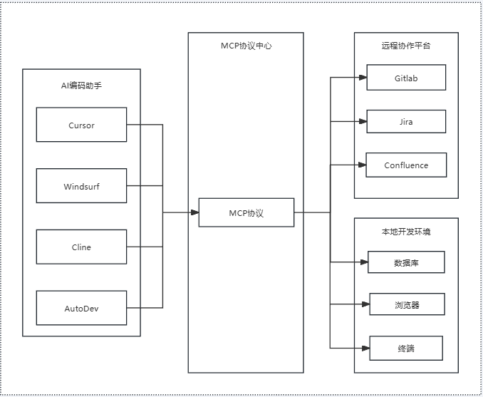
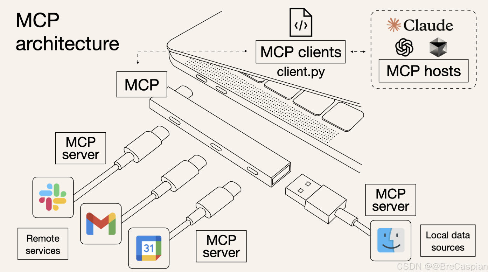
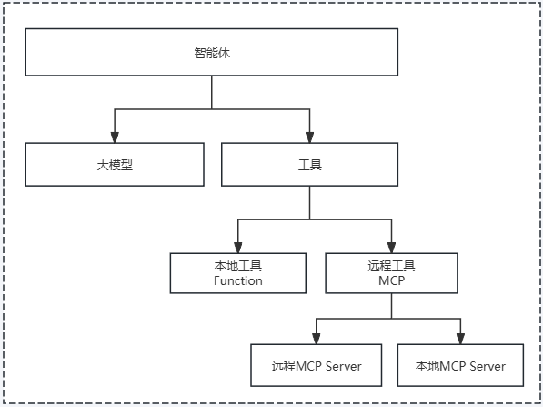
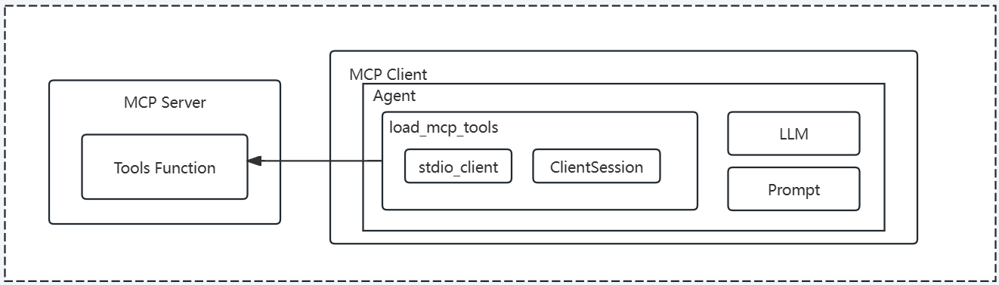

## 一、MCP介绍
### 1.1 MCP是什么
> 模型上下文协议(MCP ModelContextProtocol)正迅速成为AI领域的核心基础设施标准，它通过标准化大语言模型与外部工具的交互方式，解决了AI应用开发中的关键瓶颈，推动了智能体从实验室走向商业化的进程。这一由Anthropic于2024年11月开源的协议，已被OpenAI、阿里云、腾讯、字节跳动等全球科技巨头广泛采纳，形成了一场静默的AI革命。MCP的流行不仅源于其技术创新，更在于它满足了AI产业从单体智能向互联网络转变的迫切需求，为AI应用的规模化落地提供了关键支撑。

### 1.2 MCP的原理
MCP的核心原理：


与上一张图异曲同工：


MCP 的核心原理是将互联网服务（高德、谷歌）或本地操作系统 API（文件系统、数据库、终端）封装成 AI 智能体能够理解和使用的 Tools 工具，让 AI 智能体能够自由地调用这些 Tools 工具实现复杂的业务逻辑和功能。

### 1.3 MCP为什么这么火？
**解决了智能体开发过程中的关键效率问题**
> MCP之所以迅速火爆，首先在于它解决了AI应用开发中的关键痛点。传统模式下，大模型与外部工具的集成需要为每个工具单独开发接口，形成了"M个智能体×N个工具"的复杂度。MCP通过标准化交互规则，将复杂的"M×N"集成简化为"M+N"模式，使开发者只需遵循协议标准，就能实现AI模型与各类工具的即插即用。这种标准化不仅降低了开发门槛，还提高了系统的可扩展性和互操作性。

### 1.4 MCP为什么普及得这么快？
**巨头+开源社区的积极推动**
> MCP的迅速普及得益于多方面的市场与生态因素。首先是行业巨头的积极推动，这使得MCP获得了强大的技术背书和资源支持。OpenAI于2025年3月27日宣布Agent SDK支持MCP，5月17日进一步测试ChatGPT接入，标志着这一全球AI领导者对MCP的认可。Anthropic CEO Mike Krieger对OpenAI的加入表示欢迎，称MCP已成为"蓬勃发展的开放标准"。其他巨头如阿里云、腾讯、字节跳动等也纷纷支持或接入MCP，形成行业共识。

> 开源社区的活跃参与是MCP生态繁荣的另一关键因素。GitHub上MCP相关项目呈现爆发式增长，如awesome-mcp-servers（https://github.com/punkpeye/awesome-mcp-servers）获近5W Star，覆盖数据库、云存储、旅游等20+垂直领域。代表性项目包括Supabase MCP服务器(连接数据库)、AWS-S3 MCP服务器(云存储访问)、Airbnb MCP服务器(旅行规划)等，这些项目为开发者提供了丰富的工具选择，形成了强大的网络效应。

### 1.5 基于MCP的智能体架构


## 二、高德MCP服务接入
### 2.1 MCP客户端开发
过程分为三个小步骤：
#### 2.1.1 安装依赖
```shell
uv add langchain_mcp_adapters
```

#### 2.1.2 获取高德应用key
https://lbs.amap.com/api/mcp-server/create-project-and-key

#### 2.1.3 开发高德mcp客户端
```python
import asyncio
import os
from langchain_mcp_adapters.client import MultiServerMCPClient
from dotenv import load_dotenv
load_dotenv()

async def create_mcp_client():
    amap_key = os.environ.get("AMAP_KEY")
    client = MultiServerMCPClient({
        "amap": {
            "url": f"https://mcp.amap.com/sse?key={amap_key}",
            "transport": "sse",
        }
    })
    tools = await client.get_tools()
    print(tools)
asyncio.run(create_mcp_client())
```
**输出结果:**
```shell
[StructuredTool(name='maps_direction_bicycling', description='骑行路径规划用于规划骑行通勤方案，规划时会考虑天桥、单行线、封路等情况。最大支持 500km 的骑行路线规划', args_schema={'type': 'object', 'properties': {'origin': {'type': 'string', 'description': '出发点经纬度，坐标格式为：经度，纬度'}, 'destination': {'type': 'string', 'description': '目的地经纬度，坐标格式为：经度，纬度'}}, 'required': ['origin', 'destination']}, response_format='content_and_artifact', coroutine=<function convert_mcp_tool_to_langchain_tool.<locals>.call_tool at 0x00000274C9F52700>), StructuredTool(name='maps_direction_driving', description='驾车路径规划 API 可以根据用户起终点经纬度坐标规划以小客车、轿车通勤出行的方案，并且返回通勤方案的数据。', args_schema={'type': 'object', 'properties': {'origin': {'type': 'string', 'description': '出发点经纬度，坐标格式为：经度，纬度'}, 'destination': {'type': 'string', 'description': '目的地经纬度，坐标格式为：经度，纬度'}}, 'required': ['origin', 'destination']}, response_format='content_and_artifact', coroutine=<function convert_mcp_tool_to_langchain_tool.<locals>.call_tool at 0x00000274C9F52520>), StructuredTool(name='maps_direction_transit_integrated', description='根据用户起终点经纬度坐标规划综合各类公共（火车、公交、地铁）交通方式的通勤方案，并且返回通勤方案的数据，跨城场景下必须传起点城市与终点城市', args_schema={'type': 'object', 'properties': {'origin': {'type': 'string', 'description': '出发点经纬度，坐标格式为：经度，纬度'}, 'destination': {'type': 'string', 'description': '目的地经纬度，坐标格式为：经度，纬度'}, 'city': {'type': 'string', 'description': '公共交通规划起点城市'}, 'cityd': {'type': 'string', 'description': '公共交通规划终点城市'}}, 'required': ['origin', 'destination', 'city', 'cityd']}, response_format='content_and_artifact', coroutine=<function convert_mcp_tool_to_langchain_tool.<locals>.call_tool at 0x00000274C9F52A20>), StructuredTool(name='maps_direction_walking', description='根据输入起点终点经纬度坐标规划100km 以内的步行通勤方案，并且返回通勤方案的数据', args_schema={'type': 'object', 'properties': {'origin': {'type': 'string', 'description': '出发点经度，纬度，坐标格式为：经度，纬度'}, 'destination': {'type': 'string', 'description': '目的地经度，纬度，坐标格式为：经度，纬度'}}, 'required': ['origin', 'destination']}, response_format='content_and_artifact', coroutine=<function convert_mcp_tool_to_langchain_tool.<locals>.call_tool at 0x00000274C9F525C0>), StructuredTool(name='maps_distance', description='测量两个经纬度坐标之间的距离,支持驾车、步行以及球面距离测量', args_schema={'type': 'object', 'properties': {'origins': {'type': 'string', 'description': '起点经度，纬度，可以传多个坐标，使用竖线隔离，比如120,30|120,31，坐标格式为：经度，纬度'}, 'destination': {'type': 'string', 'description': '终点经度，纬度，坐标格式为：经度，纬度'}, 'type': {'type': 'string', 'description': '距离测量类型,1代表驾车距离测量，0代表直线距离测量，3步行距离测量'}}, 'required': ['origins', 'destination']}, response_format='content_and_artifact', coroutine=<function convert_mcp_tool_to_langchain_tool.<locals>.call_tool at 0x00000274C9F52660>), StructuredTool(name='maps_geo', description='将详细的结构化地址转换为经纬度坐标。支持对地标性名胜景区、建筑物名称解析为经纬度坐标', args_schema={'type': 'object', 'properties': {'address': {'type': 'string', 'description': '待解析的结构化地址信息'}, 'city': {'type': 'string', 'description': '指定查询的城市'}}, 'required': ['address']}, response_format='content_and_artifact', coroutine=<function convert_mcp_tool_to_langchain_tool.<locals>.call_tool at 0x00000274C9F52FC0>), StructuredTool(name='maps_regeocode', description='将一个高德经纬度坐标转换为行政区划地址信息', args_schema={'type': 'object', 'properties': {'location': {'type': 'string', 'description': '经纬度'}}, 'required': ['location']}, response_format='content_and_artifact', coroutine=<function convert_mcp_tool_to_langchain_tool.<locals>.call_tool at 0x00000274C9F53240>), StructuredTool(name='maps_ip_location', description='IP 定位根据用户输入的 IP 地址，定位 IP 的所在位置', args_schema={'type': 'object', 'properties': {'ip': {'type': 'string', 'description': 'IP地址'}}, 'required': ['ip']}, response_format='content_and_artifact', coroutine=<function convert_mcp_tool_to_langchain_tool.<locals>.call_tool at 0x00000274C9F52C00>), StructuredTool(name='maps_schema_personal_map', description='用于行程规划结果在高德地图展示。将行程规划位置点按照行程顺序填入lineList，返回结果为高德地图打开的URI链接，该结果不需总结，直接返回！', args_schema={'type': 'object', 'properties': {'orgName': {'type': 'string', 'description': '行程规划地图小程序名称'}, 'lineList': {'type': 'array', 'description': '行程列表', 'items': {'type': 'object', 'properties': {'title': {'type': 'string', 'description': '行程名称描述（按行程顺序）'}, 'pointInfoList': {'type': 'array', 'description': '行程目标位置点描述', 'items': {'type': 'object', 'properties': {'name': {'type': 'string', 'description': '行程目标位置点名称'}, 'lon': {'type': 'number', 'description': '行程目标位置点经度'}, 'lat': {'type': 'number', 'description': '行程目标位置点纬度'}, 'poiId': {'type': 'string', 'description': '行程目标位置点POIID'}}, 'required': ['name', 'lon', 'lat', 'poiId']}}}, 'required': ['title', 'pointInfoList']}}}, 'required': ['orgName', 'lineList']}, response_format='content_and_artifact', coroutine=<function convert_mcp_tool_to_langchain_tool.<locals>.call_tool at 0x00000274C9F532E0>), StructuredTool(name='maps_around_search', description='周边搜，根据用户传入关键词以及坐标location，搜索出radius半径范围的POI', args_schema={'type': 'object', 'properties': {'keywords': {'type': 'string', 'description': '搜索关键词'}, 'location': {'type': 'string', 'description': '中心点经度纬度'}, 'radius': {'type': 'string', 'description': '搜索半径'}}, 'required': ['keywords', 'location']}, response_format='content_and_artifact', coroutine=<function convert_mcp_tool_to_langchain_tool.<locals>.call_tool at 0x00000274C9F52F20>), StructuredTool(name='maps_search_detail', description='查询关键词搜或者周边搜获取到的POI ID的详细信息', args_schema={'type': 'object', 'properties': {'id': {'type': 'string', 'description': '关键词搜或者周边搜获取到的POI ID'}}, 'required': ['id']}, response_format='content_and_artifact', coroutine=<function convert_mcp_tool_to_langchain_tool.<locals>.call_tool at 0x00000274C9F52D40>), StructuredTool(name='maps_text_search', description='关键字搜索 API 根据用户输入的关键字进行 POI 搜索，并返回相关的信息', args_schema={'type': 'object', 'properties': {'keywords': {'type': 'string', 'description': '查询关键字'}, 'city': {'type': 'string', 'description': '查询城市'}, 'citylimit': {'type': 'boolean', 'default': False, 'description': '是否限制城市范围内搜索，默认不限制'}}, 'required': ['keywords']}, response_format='content_and_artifact', coroutine=<function convert_mcp_tool_to_langchain_tool.<locals>.call_tool at 0x00000274C9F531A0>), StructuredTool(name='maps_schema_navi', description=' Schema唤醒客户端-导航页面，用于根据用户输入终点信息，返回一个拼装好的客户端唤醒URI，用户点击该URI即可唤起对应的客户端APP。唤起客户端后，会自动跳转到导航页面。', args_schema={'type': 'object', 'properties': {'lon': {'type': 'string', 'description': '终点经度'}, 'lat': {'type': 'string', 'description': '终点纬度'}}, 'required': ['lon', 'lat']}, response_format='content_and_artifact', coroutine=<function convert_mcp_tool_to_langchain_tool.<locals>.call_tool at 0x00000274C9F52DE0>), StructuredTool(name='maps_schema_take_taxi', description='根据用户输入的起点和终点信息，返回一个拼装好的客户端唤醒URI，直接唤起高德地图进行打车。直接展示生成的链接，不需要总结', args_schema={'type': 'object', 'properties': {'slon': {'type': 'string', 'description': '起点经度'}, 'slat': {'type': 'string', 'description': '起点纬度'}, 'sname': {'type': 'string', 'description': '起点名称'}, 'dlon': {'type': 'string', 'description': '终点经度'}, 'dlat': {'type': 'string', 'description': '终点纬度'}, 'dname': {'type': 'string', 'description': '终点名称'}}, 'required': ['dlon', 'dlat', 'dname']}, response_format='content_and_artifact', coroutine=<function convert_mcp_tool_to_langchain_tool.<locals>.call_tool at 0x00000274C9F53600>), StructuredTool(name='maps_weather', description='根据城市名称或者标准adcode查询指定城市的天气', args_schema={'type': 'object', 'properties': {'city': {'type': 'string', 'description': '城市名称或者adcode'}}, 'required': ['city']}, response_format='content_and_artifact', coroutine=<function convert_mcp_tool_to_langchain_tool.<locals>.call_tool at 0x00000274C9F536A0>)]
```

### 2.2 创建智能体，集成MCP工具
过程分为四个小步骤：

#### 2.2.1 创建MCP Client并获取tools
```python
from langchain_mcp_adapters.client import MultiServerMCPClient

async def create_mcp_client():
    amap_key = os.environ.get("AMAP_KEY")
    if not amap_key:
        raise RuntimeError("环境变量 AMAP_KEY 未配置")

    client = MultiServerMCPClient({
        "amap": {
            "url": f"https://mcp.amap.com/sse?key={amap_key}",
            "transport": "sse",
        }
    })

    tools = await client.get_tools()
    return tools
```

#### 2.2.2 创建智能体
```python
from langchain.agents import AgentType, initialize_agent
async def setup_agent():
    tools = await create_mcp_client()
    print(tools)
    agent = initialize_agent(
        tools=tools,
        llm=llm,
        agent=AgentType.STRUCTURED_CHAT_ZERO_SHOT_REACT_DESCRIPTION,
        verbose=True,
        max_iterations=6,
        early_stopping_method="generate",
    )
    return agent
```

#### 2.2.3 创建提示词
```python
from langchain_core.prompts import PromptTemplate

prompt_template = PromptTemplate.from_template("""
你是一个智能旅行规划助手，可以调用高德地图 MCP 工具（天气、地点搜索、酒店搜索等）。

请注意：
1. 工具调用次数要尽量少，同一个工具不要重复调用超过 2 次。
2. 当你已经获取到足够的信息后，必须停止调用工具，整理结果并输出。
3. 最终回答请只输出给用户看的旅行攻略（行程安排、路线、天气建议等），不要再输出 Thought/Action/Observation 之类的内容。

下面是我的需求：
{input}
""")

prompt = prompt_template.format(input="""
- 我五月底端午节计划去杭州游玩4天。
- 帮制作旅行攻略，考虑出行时间和路线，以及天气状况路线规划。
- 制作网页地图自定义绘制旅游路线和位置。
    - 网页使用简约美观页面风格，景区图片以卡片展示。
- 同一天行程景区之间我想打车前往。
- 最后输出结果为一个网页内容
""")
```

#### 2.2.4 运行智能体
```python
import asyncio

async def main():
    agent = await setup_agent()

    # 对于 Agent 推荐这样调用，这里是异步调用，所以需要 await
    resp = await agent.ainvoke({"input": prompt})
    print("res:", resp)


if __name__ == "__main__":
    asyncio.run(main())
```

#### 2.2.5 完整代码
```python
import os
import asyncio
from dotenv import load_dotenv

from langchain.agents import AgentType, initialize_agent
from langchain_mcp_adapters.client import MultiServerMCPClient
from langchain_core.prompts import PromptTemplate

from agent.common import llm

load_dotenv()


async def create_mcp_client():
    amap_key = os.environ.get("AMAP_KEY")
    if not amap_key:
        raise RuntimeError("环境变量 AMAP_KEY 未配置")

    client = MultiServerMCPClient({
        "amap": {
            "url": f"https://mcp.amap.com/sse?key={amap_key}",
            "transport": "sse",
        }
    })

    tools = await client.get_tools()
    return tools


async def setup_agent():
    tools = await create_mcp_client()
    print(tools)
    agent = initialize_agent(
        tools=tools,
        llm=llm,
        agent=AgentType.STRUCTURED_CHAT_ZERO_SHOT_REACT_DESCRIPTION,
        verbose=True,
        max_iterations=6,
        early_stopping_method="generate",
    )

    # 这里顺便把 client 一起返回，后面你想复用或关闭都行
    return agent


prompt_template = PromptTemplate.from_template("""
你是一个智能旅行规划助手，可以调用高德地图 MCP 工具（天气、地点搜索、酒店搜索等）。

请注意：
1. 工具调用次数要尽量少，同一个工具不要重复调用超过 2 次。
2. 当你已经获取到足够的信息后，必须停止调用工具，整理结果并输出。
3. 最终回答请只输出给用户看的旅行攻略（行程安排、路线、天气建议等），不要再输出 Thought/Action/Observation 之类的内容。

下面是我的需求：
{input}
""")

prompt = prompt_template.format(input="""
- 我五月底端午节计划去杭州游玩4天。
- 帮制作旅行攻略，考虑出行时间和路线，以及天气状况路线规划。
- 制作网页地图自定义绘制旅游路线和位置。
    - 网页使用简约美观页面风格，景区图片以卡片展示。
- 同一天行程景区之间我想打车前往。
- 最后输出结果为一个网页内容
""")


async def main():
    agent = await setup_agent()

    # 对于 Agent 推荐这样调用
    resp = await agent.ainvoke({"input": prompt})
    print("res:", resp)


if __name__ == "__main__":
    asyncio.run(main())
```

#### 2.2.6 运行结果
```html
<!DOCTYPE html>
<html lang="zh">

<head>
  <meta charset="UTF-8" />
  <meta name="viewport" content="width=device-width, initial-scale=1.0" />
  <title>杭州4天旅行攻略</title>
  <style>
    body {
      font-family: \'Segoe UI\', Tahoma, Geneva, Verdana, sans-serif;
      background-color: #f9f9f9;
      color: #333;
      margin: 0;
      padding: 0;
    }

    header {
      background: linear-gradient(to right, #4facfe, #00f2fe);
      color: white;
      text-align: center;
      padding: 60px 20px;
      box-shadow: 0 4px 10px rgba(0, 0, 0, 0.1);
    }

    h1 {
      margin: 0;
      font-size: 2.5em;
    }

    .container {
      max-width: 1000px;
      margin: 30px auto;
      padding: 20px;
    }

    .intro {
      text-align: center;
      margin-bottom: 40px;
      line-height: 1.7;
      font-size: 1.1em;
    }

    .day {
      background: white;
      border-radius: 12px;
      padding: 25px;
      margin-bottom: 30px;
      box-shadow: 0 6px 15px rgba(0, 0, 0, 0.05);
      transition: transform 0.3s ease;
    }

    .day:hover {
      transform: translateY(-5px);
    }

    .day h2 {
      color: #4facfe;
      border-bottom: 2px solid #eaeaea;
      padding-bottom: 10px;
      margin-bottom: 15px;
    }

    .card-container {
      display: flex;
      overflow-x: auto;
      gap: 15px;
      padding: 10px 0;
    }

    .card {
      min-width: 250px;
      border: none;
      border-radius: 10px;
      overflow: hidden;
      box-shadow: 0 4px 10px rgba(0, 0, 0, 0.1);
      background: #fff;
      flex-shrink: 0;
    }

    .card img {
      width: 100%;
      height: 160px;
      object-fit: cover;
    }

    .card-body {
      padding: 15px;
    }

    .card-body h3 {
      margin: 0 0 10px;
      font-size: 1.2em;
      color: #333;
    }

    .card-body p {
      margin: 0;
      font-size: 0.95em;
      color: #666;
    }

    .weather {
      background: #e3f2fd;
      padding: 15px;
      border-radius: 10px;
      margin-top: 20px;
      text-align: center;
      font-size: 1em;
      color: #1976d2;
    }

    footer {
      text-align: center;
      padding: 20px;
      background: #eee;
      color: #666;
      font-size: 0.9em;
    }
  </style>
</head>

<body>
  <header>
    <h1>杭州4天端午节旅行攻略</h1>
    <p>西湖烟雨，江南韵味，一次说走就走的诗意之旅</p>
  </header>
  <div class="container">
    <div class="intro">
      <p>端午节将至，来一场轻松惬意的杭州之旅吧！本攻略精心规划了4天行程，涵盖西湖经典景点、历史街区与现代都市夜景。白天漫步湖光山色，夜晚感受钱江新城的璀璨灯光。全程推荐打车出行，节省时间，提升体验。</p>
    </div> <!-- Day 1 -->
    <div class="day">
      <h2>📅 第一天：西湖经典环游</h2>
      <div class="card-container">
        <div class="card"> 
          <div class="card-body">
            <h3>杭州西湖风景名胜区</h3>
            <p>中国十大名胜之一，湖光山色，美不胜收。</p>
          </div>
        </div>
        <div class="card"> 
          <div class="card-body">
            <h3>断桥残雪</h3>
            <p>白娘子传说起源地，西湖十景之首。</p>
          </div>
        </div>
        <div class="card"> 
          <div class="card-body">
            <h3>雷峰塔景区</h3>
            <p>登塔远眺西湖全景，重温白蛇传传奇。</p>
          </div>
        </div>
      </div>
      <div class="weather"> 🌤️ 天气提示：多云转晴，气温18-25℃，适宜户外活动，请携带防晒用品。 </div>
    </div> <!-- Day 2 -->
    <div class="day">
      <h2>📅 第二天：老城文化漫步</h2>
      <div class="card-container">
        <div class="card"> 
          <div class="card-body">
            <h3>清河坊历史文化街区</h3>
            <p>南宋古街，汇聚传统小吃与手工艺品。</p>
          </div>
        </div>
        <div class="card"> 
          <div class="card-body">
            <h3>胡雪岩故居</h3>
            <p>晚清首富宅邸，江南园林建筑典范。</p>
          </div>
        </div>
        <div class="card"> 
          <div class="card-body">
            <h3>吴山广场</h3>
            <p>登高望远，俯瞰老城区，感受市井气息。</p>
          </div>
        </div>
      </div>
      <div class="weather"> ☀️ 天气提示：晴，气温20-26℃，空气清新，适合步行探索老城巷弄。 </div>
    </div> <!-- Day 3 -->
    <div class="day">
      <h2>📅 第三天：自然与生态探秘</h2>
      <div class="card-container">
        <div class="card"> 
          <div class="card-body">
            <h3>浴鹄湾景区</h3>
            <p>静谧湖湾，杨公堤畔的隐世美景。</p>
          </div>
        </div>
        <div class="card"> 
          <div class="card-body">
            <h3>杨公堤</h3>
            <p>六桥烟柳，骑行与散步的绝佳选择。</p>
          </div>
        </div>
        <div class="card"> 
          <div class="card-body">
            <h3>江洋畈生态公园</h3>
            <p>原生湿地，野趣盎然，人少景美。</p>
          </div>
        </div>
      </div>
      <div class="weather"> 🌿 天气提示：晴转多云，气温19-24℃，微风拂面，非常适合亲近自然。 </div>
    </div> <!-- Day 4 -->
    <div class="day">
      <h2>📅 第四天：都市夜景与返程</h2>
      <div class="card-container">
        <div class="card"> 
          <div class="card-body">
            <h3>钱江新城灯光秀</h3>
            <p>城市地标夜景，震撼视觉盛宴。</p>
          </div>
        </div>
        <div class="card"> 
          <div class="card-body">
            <h3>城市阳台</h3>
            <p>观钱塘江景，感受现代杭州的活力。</p>
          </div>
        </div>
        <div class="card"> 
          <div class="card-body">
            <h3>西湖文化广场</h3>
            <p>文艺打卡地，博物馆与艺术展览齐聚。</p>
          </div>
        </div>
      </div>
      <div class="weather"> 🌆 天气提示：晴，夜间气温约18℃，建议携带薄外套，欣赏夜景更舒适。 </div>
    </div>
    <footer> &copy; 2025 杭州旅行攻略 | 数据来源：高德地图 | 祝您旅途愉快！ </footer>
  </div>
</body>

</html>
```

### 2.3 能力扩展和优化
> 目前的智能体只是可以执行高德的一些tools以及可以生成对应的html代码，但是无法将其保存到文件中，也就是说并没有文件处理操作，因此我们需要扩展智能体的能力，使其能够将生成的html代码保存到文件中，同时我们还需要对智能体进行优化，使其能够更好地处理各种情况，例如当智能体无法理解用户输入时，它应该能够给出友好的提示，而不是直接退出程序。

#### 2.3.1 增加文件工具
安装 **langchain_community：**
```shell
uv add langchain_community
```

#### 2.3.2 获取文件工具：
```python
from langchain_community.agent_toolkits import FileManagementToolkit
file_toolkit = FileManagementToolkit(root_dir="D:\\ai-agent\\ai-agent-test1")
file_tools = file_toolkit.get_tools()
print(file_tools)
```
**输出结果：**
```python
[   
    CopyFileTool(root_dir='D:\\ai-agent\\ai-agent-test1'), 
    DeleteFileTool(root_dir='D:\\ai-agent\\ai-agent-test1'), 
    FileSearchTool(root_dir='D:\\ai-agent\\ai-agent-test1'), 
    MoveFileTool(root_dir='D:\\ai-agent\\ai-agent-test1'), 
    ReadFileTool(root_dir='D:\\ai-agent\\ai-agent-test1'), 
    WriteFileTool(root_dir='D:\\ai-agent\\ai-agent-test1'), 
    ListDirectoryTool(root_dir='D:\\ai-agent\\ai-agent-test1')
]
```

#### 2.3.3 扩展智能体工具
```python
agent = initialize_agent(
    tools=tools + file_tools,
    llm=llm,
    agent=AgentType.STRUCTURED_CHAT_ZERO_SHOT_REACT_DESCRIPTION,
    verbose=True,
)
```

#### 2.3.4 优化提示词
```python
prompt = prompt_template.format(input="""
- 我五月底端午节计划去杭州游玩4天。
- 帮制作旅行攻略，考虑出行时间和路线，以及天气状况路线规划。
- 制作网页地图自定义绘制旅游路线和位置。
    - 网页使用简约美观页面风格，景区图片以卡片展示。
- 同一天行程景区之间我想打车前往。
- 最后输出一个html文件，在D:\\ai-agent\\ai-agent-test1\\test.html
""")
```
这里出现一个小插曲，不知道是模型的问题，还是提示词的原因，总是生成不了文件。下面是经过优化后的代码，可以正常输出文件：
```python
import os
import asyncio
from dotenv import load_dotenv

from langchain.agents import AgentType, initialize_agent
from langchain_mcp_adapters.client import MultiServerMCPClient
from langchain_core.prompts import PromptTemplate
from langchain_community.agent_toolkits import FileManagementToolkit
from agent.common import llm  # 你原来的 llm

load_dotenv()


async def create_mcp_client():
    amap_key = os.environ.get("AMAP_KEY")
    if not amap_key:
        raise RuntimeError("环境变量 AMAP_KEY 未配置")

    # 高德 MCP
    client = MultiServerMCPClient({
        "amap": {
            "url": f"https://mcp.amap.com/sse?key={amap_key}",
            "transport": "sse",
        }
    })

    # 文件工具，沙箱目录：D:\ai-agent\ai-agent-test1
    file_toolkit = FileManagementToolkit(
        root_dir=r"D:\ai-agent\ai-agent-test1"
    )

    mcp_tools = await client.get_tools()
    file_tools = file_toolkit.get_tools()

    # 这里可以看一眼名字，确认有 write_file
    # for t in file_tools:
    #     print("file tool:", t.name)

    tools = mcp_tools + file_tools
    return tools


async def setup_agent():
    tools = await create_mcp_client()

    agent = initialize_agent(
        tools=tools,
        llm=llm,
        agent=AgentType.STRUCTURED_CHAT_ZERO_SHOT_REACT_DESCRIPTION,
        verbose=True,        # 开启日志，方便你调试看工具调用
        max_iterations=8,
        early_stopping_method="generate",
    )
    return agent


# 🔴 关键 Prompt：明确告诉模型“必须调用 write_file，file_path=travel.html，text 为完整 HTML”
prompt_template = PromptTemplate.from_template("""
你是一个智能旅行规划助手，可以调用：
- 高德地图 MCP 工具（天气、地点搜索、路线、周边景点等）；
- 文件管理工具（其中有一个工具：`write_file`，用于在本地写入文件，根目录为 D:\\ai-agent\\ai-agent-test1）。

严格要求（非常重要）：

1. 工具调用次数要尽量少，同一个工具不要重复调用超过 2 次。
2. 先使用地图相关工具（如天气、搜索、路线）获取必要的信息（天气、景点位置、简单路线）。
3. 拿到足够信息后，你需要生成一个完整的网页 HTML 内容，包含：
   - 简约美观的页面风格（CSS 可以写在 <style> 里）；
   - 按“天”展示行程（Day 1 / Day 2 / …），每个景点用卡片展示：名称、简介、建议游玩时长、交通方式等；
   - 可以预留“地图链接”或“图片占位”的位置（例如使用占位图 URL）。
4. **最后一步必须调用文件管理工具中的 `write_file` 工具：**
   - 参数名为 `file_path` 和 `text`；
   - `file_path` 必须是 `"travel.html"`（注意：相对路径，不要写绝对路径，不要带盘符）；
   - `text` 必须是完整的 HTML 字符串（从 `<html>` 开始到 `</html>` 结束）。
5. 成功调用 `write_file` 后，结束推理。
   - 最终回复给用户时，只需要用自然语言简单确认，例如：
     “已经在 D:\\ai-agent\\ai-agent-test1\\travel.html 生成旅行攻略网页。”
   - 不要再输出 HTML 内容，不要再出现 Thought/Action/Observation 这些调试内容。

下面是我的具体需求：
{input}
""")


# 你可以根据需要随时换 input 内容
user_need = """
- 我五月底端午节计划去杭州游玩4天。
- 帮我制作详细的旅行攻略，考虑出行时间、打车路线、以及天气状况（大致气候即可）。
- 需要一个网页形式的旅行攻略页：
    - 页面简约、美观，中文界面；
    - 每天的行程按卡片展示（包含景点名称、简介、建议游玩时长、交通/打车建议）；
    - 可以预留地图链接位置。
- 模型最终要在项目根目录生成 travel.html 文件。
"""

prompt = prompt_template.format(input=user_need)


async def main():
    agent = await setup_agent()

    # 交给 Agent：它会自己决定什么时候调用高德工具、什么时候调用 write_file
    resp = await agent.ainvoke({"input": prompt})

    # 这里只打印一下最终输出，让你确认
    print("最终 Agent 输出：", resp.get("output") if isinstance(resp, dict) else resp)
    print("请在 D:\\ai-agent\\ai-agent-test1\\travel.html 检查生成的文件。")


if __name__ == "__main__":
    asyncio.run(main())
```

## 三、深入MCP通信方式
MCP（Model Context Protocol）协议目前支持**三种主要通信方式**，分别是：

### 3.1 stdio（标准输入输出）
- **工作原理：**
通过本地进程的标准输入（stdin）和标准输出（stdout）进行通信。客户端以子进程的形式启动MCP服务器，双方通过管道交换JSON-RPC格式的消息，消息以换行符分隔。
- **适用场景：**
（1）本地进程间通信（如命令行工具、文件系统操作）。  
（2）简单的批处理任务或工具调用。
- **优点：**
（1）实现简单，低延迟。
（2）无需网络配置，适合本地开发。
- **限制：**
（1）仅限本地使用，不支持分布式部署。
（2）服务端不能输出控制台日志（会污染协议流）。

#### 3.1.1 实现基于stdio的mcp服务
stdio模式mcp服务架构：


### 3.2 SSE（Server-Sent Events）
- **工作原理：**
基于HTTP长连接实现服务器到客户端的单向消息推送。客户端通过GET /sse建立长连接，服务器通过SSE流发送JSON-RPC消息；客户端通过POST /message发送请求或响应。
- **适用场景：**
（1）远程服务调用（如云服务、多客户端监控）。
（2）需要实时数据推送的场景（如对话式AI的流式输出）。
- **优点：**
（1）支持实时单向推送，适合流式交互。
- **限制：**
（1）已逐步被弃用（2025年3月后被Streamable HTTP取代）。
（2）连接中断后无法恢复，需重新建立。
（3）服务器需维持长连接，资源消耗较高。


### 3.3 Streamable HTTP（流式HTTP）
- **工作原理：**
2025年3月引入的新传输方式，替代了SSE。通过统一的/message端点实现双向通信，支持以下特性：
（1）客户端通过HTTP POST发送请求（如工具调用）。
（2）服务器可将响应升级为SSE流式传输（当需要时）。
（3）支持无状态模式（Stateless Server），无需维持长连接。
- **适用场景：**
（1）高并发远程服务调用。
（2）需要灵活流式响应的场景（如AI助手的动态输出）。
- **优点：**
（1）解决SSE的缺陷：支持连接恢复（无需重新开始）。无需服务器维持长连接，降低资源压力。统一端点（/message），简化接口设计。
（2）兼容基础设施（如中间件、负载均衡）。

> 推荐使用：当前MCP官方推荐的传输方式，尤其适合生产环境和云服务。