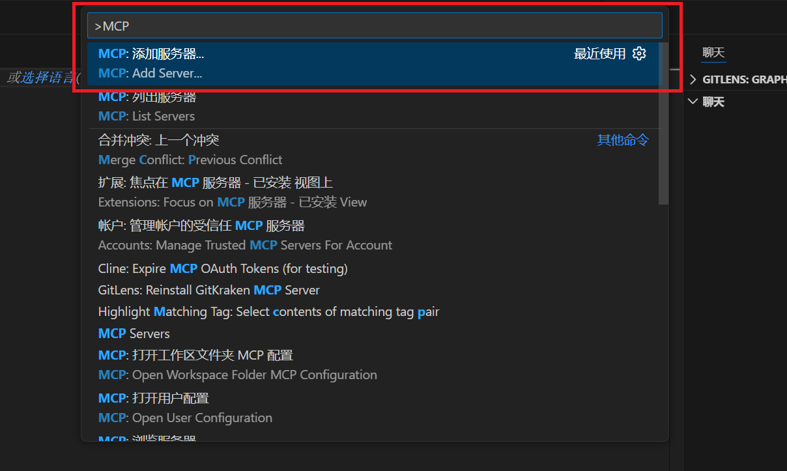
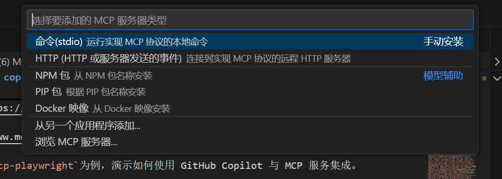
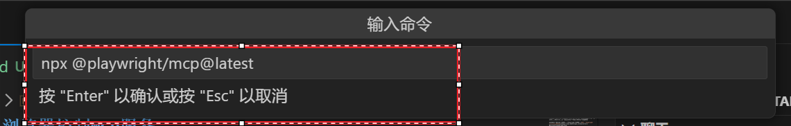
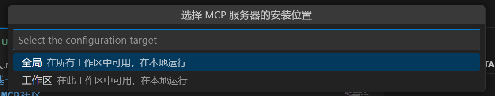
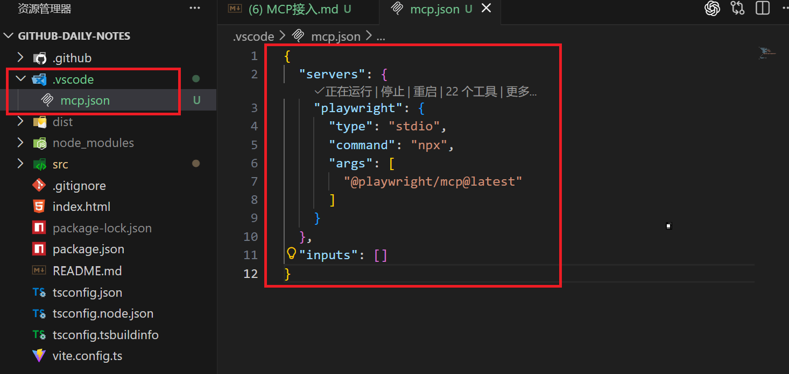
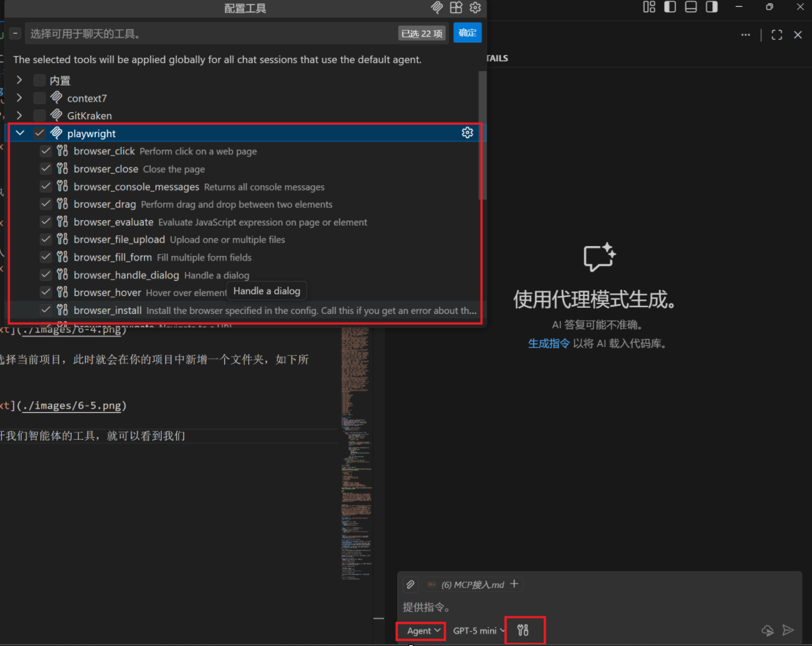

## 一、浏览器控制MCP服务-胡
> 一个使用 Playwright 提供浏览器自动化功能的 Model Context Protocol (MCP) 服务器。该服务器使 LLM 能够通过结构化的无障碍快照与网页进行交互，从而绕过了对屏幕截图或视觉调优模型的需求。

具体可以参考魔搭社区MCP广场Playwright MCP服务:[MCP - Playwright浏览器自动化工具](https://www.modelscope.cn/mcp/servers/@microsoft/playwright-mcp)

### 1.1 获取全部的tools
```python
import asyncio
from mcp import ClientSession, StdioServerParameters
from mcp.client.stdio import stdio_client
from langchain_mcp_adapters.tools import load_mcp_tools

async def main():
    server_params = StdioServerParameters(
        command="npx",
        args=["@playwright/mcp@latest"]
    )
    try:
        async with stdio_client(server_params) as (read, write):
            async with ClientSession(read, write) as session:
                await session.initialize()
                tools = await load_mcp_tools(session)
                print("tools:", tools)
                print("✅ tools count:", len(tools))
                for t in tools:
                    print("-", t.name)
        print("✅ context exit done")
    except Exception as e:
        # 临时 workaround：忽略退出时的 JSON 解析错误
        if "Shutdown signal received" in str(e):
            print("⚠ MCP server 退出时输出了非 JSON 日志，已忽略：", e)
        else:
            raise

asyncio.run(main())
```
**输出结果：**
```shell
tools: [StructuredTool(name='browser_close', description='Close the page', args_schema={'type': 'object', 'properties': {}, 'additionalProperties': False, '$schema': 'http://json-schema.org/draft-07/schema#'}, metadata={'title': 'Close browser', 'readOnlyHint': False, 'destructiveHint': True, 'idempotentHint': None, 'openWorldHint': True}, response_format='content_and_artifact', coroutine=<function convert_mcp_tool_to_langchain_tool.<locals>.call_tool at 0x00000264156D20C0>), StructuredTool(name='browser_resize', description='Resize the browser window', args_schema={'type': 'object', 'properties': {'width': {'type': 'number', 'description': 'Width of the browser window'}, 'height': {'type': 'number', 'description': 'Height of the browser window'}}, 'required': ['width', 'height'], 'additionalProperties': False, '$schema': 'http://json-schema.org/draft-07/schema#'}, metadata={'title': 'Resize browser window', 'readOnlyHint': False, 'destructiveHint': True, 'idempotentHint': None, 'openWorldHint': True}, response_format='content_and_artifact', coroutine=<function convert_mcp_tool_to_langchain_tool.<locals>.call_tool at 0x0000026415734D60>), StructuredTool(name='browser_console_messages', description='Returns all console messages', args_schema={'type': 'object', 'properties': {'onlyErrors': {'type': 'boolean', 'description': 'Only return error messages'}}, 'additionalProperties': False, '$schema': 'http://json-schema.org/draft-07/schema#'}, metadata={'title': 'Get console messages', 'readOnlyHint': True, 'destructiveHint': False, 'idempotentHint': None, 'openWorldHint': True}, response_format='content_and_artifact', coroutine=<function convert_mcp_tool_to_langchain_tool.<locals>.call_tool at 0x0000026415734EA0>), StructuredTool(name='browser_handle_dialog', description='Handle a dialog', args_schema={'type': 'object', 'properties': {'accept': {'type': 'boolean', 'description': 'Whether to accept the dialog.'}, 'promptText': {'type': 'string', 'description': 'The text of the prompt in case of a prompt dialog.'}}, 'required': ['accept'], 'additionalProperties': False, '$schema': 'http://json-schema.org/draft-07/schema#'}, metadata={'title': 'Handle a dialog', 'readOnlyHint': False, 'destructiveHint': True, 'idempotentHint': None, 'openWorldHint': True}, response_format='content_and_artifact', coroutine=<function convert_mcp_tool_to_langchain_tool.<locals>.call_tool at 0x0000026415734F40>), StructuredTool(name='browser_evaluate', description='Evaluate JavaScript expression on page or element', args_schema={'type': 'object', 'properties': {'function': {'type': 'string', 'description': '() => { /* code */ } or (element) => { /* code */ } when element is provided'}, 'element': {'type': 'string', 'description': 'Human-readable element description used to obtain permission to interact with the element'}, 'ref': {'type': 'string', 'description': 'Exact target element reference from the page snapshot'}}, 'required': ['function'], 'additionalProperties': False, '$schema': 'http://json-schema.org/draft-07/schema#'}, metadata={'title': 'Evaluate JavaScript', 'readOnlyHint': False, 'destructiveHint': True, 'idempotentHint': None, 'openWorldHint': True}, response_format='content_and_artifact', coroutine=<function convert_mcp_tool_to_langchain_tool.<locals>.call_tool at 0x0000026415734FE0>), StructuredTool(name='browser_file_upload', description='Upload one or multiple files', args_schema={'type': 'object', 'properties': {'paths': {'type': 'array', 'items': {'type': 'string'}, 'description': 'The absolute paths to the files to upload. Can be single file or multiple files. If omitted, file chooser is cancelled.'}}, 'additionalProperties': False, '$schema': 'http://json-schema.org/draft-07/schema#'}, metadata={'title': 'Upload files', 'readOnlyHint': False, 'destructiveHint': True, 'idempotentHint': None, 'openWorldHint': True}, response_format='content_and_artifact', coroutine=<function convert_mcp_tool_to_langchain_tool.<locals>.call_tool at 0x0000026415735080>), StructuredTool(name='browser_fill_form', description='Fill multiple form fields', args_schema={'type': 'object', 'properties': {'fields': {'type': 'array', 'items': {'type': 'object', 'properties': {'name': {'type': 'string', 'description': 'Human-readable field name'}, 'type': {'type': 'string', 'enum': ['textbox', 'checkbox', 'radio', 'combobox', 'slider'], 'description': 'Type of the field'}, 'ref': {'type': 'string', 'description': 'Exact target field reference from the page snapshot'}, 'value': {'type': 'string', 'description': 'Value to fill in the field. If the field is a checkbox, the value should be `true` or `false`. If the field is a combobox, the value should be the text of the option.'}}, 'required': ['name', 'type', 'ref', 'value'], 'additionalProperties': False}, 'description': 'Fields to fill in'}}, 'required': ['fields'], 'additionalProperties': False, '$schema': 'http://json-schema.org/draft-07/schema#'}, metadata={'title': 'Fill form', 'readOnlyHint': False, 'destructiveHint': True, 'idempotentHint': None, 'openWorldHint': True}, response_format='content_and_artifact', coroutine=<function convert_mcp_tool_to_langchain_tool.<locals>.call_tool at 0x0000026415735120>), StructuredTool(name='browser_install', description='Install the browser specified in the config. Call this if you get an error about the browser not being installed.', args_schema={'type': 'object', 'properties': {}, 'additionalProperties': False, '$schema': 'http://json-schema.org/draft-07/schema#'}, metadata={'title': 'Install the browser specified in the config', 'readOnlyHint': False, 'destructiveHint': True, 'idempotentHint': None, 'openWorldHint': True}, response_format='content_and_artifact', coroutine=<function convert_mcp_tool_to_langchain_tool.<locals>.call_tool at 0x00000264157351C0>), StructuredTool(name='browser_press_key', description='Press a key on the keyboard', args_schema={'type': 'object', 'properties': {'key': {'type': 'string', 'description': 'Name of the key to press or a character to generate, such as `ArrowLeft` or `a`'}}, 'required': ['key'], 'additionalProperties': False, '$schema': 'http://json-schema.org/draft-07/schema#'}, metadata={'title': 'Press a key', 'readOnlyHint': False, 'destructiveHint': True, 'idempotentHint': None, 'openWorldHint': True}, response_format='content_and_artifact', coroutine=<function convert_mcp_tool_to_langchain_tool.<locals>.call_tool at 0x0000026415735260>), StructuredTool(name='browser_type', description='Type text into editable element', args_schema={'type': 'object', 'properties': {'element': {'type': 'string', 'description': 'Human-readable element description used to obtain permission to interact with the element'}, 'ref': {'type': 'string', 'description': 'Exact target element reference from the page snapshot'}, 'text': {'type': 'string', 'description': 'Text to type into the element'}, 'submit': {'type': 'boolean', 'description': 'Whether to submit entered text (press Enter after)'}, 'slowly': {'type': 'boolean', 'description': 'Whether to type one character at a time. Useful for triggering key handlers in the page. By default entire text is filled in at once.'}}, 'required': ['element', 'ref', 'text'], 'additionalProperties': False, '$schema': 'http://json-schema.org/draft-07/schema#'}, metadata={'title': 'Type text', 'readOnlyHint': False, 'destructiveHint': True, 'idempotentHint': None, 'openWorldHint': True}, response_format='content_and_artifact', coroutine=<function convert_mcp_tool_to_langchain_tool.<locals>.call_tool at 0x0000026415735300>), StructuredTool(name='browser_navigate', description='Navigate to a URL', args_schema={'type': 'object', 'properties': {'url': {'type': 'string', 'description': 'The URL to navigate to'}}, 'required': ['url'], 'additionalProperties': False, '$schema': 'http://json-schema.org/draft-07/schema#'}, metadata={'title': 'Navigate to a URL', 'readOnlyHint': False, 'destructiveHint': True, 'idempotentHint': None, 'openWorldHint': True}, response_format='content_and_artifact', coroutine=<function convert_mcp_tool_to_langchain_tool.<locals>.call_tool at 0x00000264157353A0>), StructuredTool(name='browser_navigate_back', description='Go back to the previous page', args_schema={'type': 'object', 'properties': {}, 'additionalProperties': False, '$schema': 'http://json-schema.org/draft-07/schema#'}, metadata={'title': 'Go back', 'readOnlyHint': False, 'destructiveHint': True, 'idempotentHint': None, 'openWorldHint': True}, response_format='content_and_artifact', coroutine=<function convert_mcp_tool_to_langchain_tool.<locals>.call_tool at 0x0000026415735440>), StructuredTool(name='browser_network_requests', description='Returns all network requests since loading the page', args_schema={'type': 'object', 'properties': {}, 'additionalProperties': False, '$schema': 'http://json-schema.org/draft-07/schema#'}, metadata={'title': 'List network requests', 'readOnlyHint': True, 'destructiveHint': False, 'idempotentHint': None, 'openWorldHint': True}, response_format='content_and_artifact', coroutine=<function convert_mcp_tool_to_langchain_tool.<locals>.call_tool at 0x00000264157354E0>), StructuredTool(name='browser_run_code', description='Run Playwright code snippet', args_schema={'type': 'object', 'properties': {'code': {'type': 'string', 'description': "Playwright code snippet to run. The snippet should access the `page` object to interact with the page. Can make multiple statements. For example: `await page.getByRole('button', { name: 'Submit' }).click();`"}}, 'required': ['code'], 'additionalProperties': False, '$schema': 'http://json-schema.org/draft-07/schema#'}, metadata={'title': 'Run Playwright code', 'readOnlyHint': False, 'destructiveHint': True, 'idempotentHint': None, 'openWorldHint': True}, response_format='content_and_artifact', coroutine=<function convert_mcp_tool_to_langchain_tool.<locals>.call_tool at 0x0000026415735580>), StructuredTool(name='browser_take_screenshot', description="Take a screenshot of the current page. You can't perform actions based on the screenshot, use browser_snapshot for actions.", args_schema={'type': 'object', 'properties': {'type': {'type': 'string', 'enum': ['png', 'jpeg'], 'default': 'png', 'description': 'Image format for the screenshot. Default is png.'}, 'filename': {'type': 'string', 'description': 'File name to save the screenshot to. Defaults to `page-{timestamp}.{png|jpeg}` if not specified. Prefer relative file names to stay within the output directory.'}, 'element': {'type': 'string', 'description': 'Human-readable element description used to obtain permission to screenshot the element. If not provided, the screenshot will be taken of viewport. If element is provided, ref must be provided too.'}, 'ref': {'type': 'string', 'description': 'Exact target element reference from the page snapshot. If not provided, the screenshot will be taken of viewport. If ref is provided, element must be provided too.'}, 'fullPage': {'type': 'boolean', 'description': 'When true, takes a screenshot of the full scrollable page, instead of the currently visible viewport. Cannot be used with element screenshots.'}}, 'additionalProperties': False, '$schema': 'http://json-schema.org/draft-07/schema#'}, metadata={'title': 'Take a screenshot', 'readOnlyHint': True, 'destructiveHint': False, 'idempotentHint': None, 'openWorldHint': True}, response_format='content_and_artifact', coroutine=<function convert_mcp_tool_to_langchain_tool.<locals>.call_tool at 0x0000026415735620>), StructuredTool(name='browser_snapshot', description='Capture accessibility snapshot of the current page, this is better than screenshot', args_schema={'type': 'object', 'properties': {}, 'additionalProperties': False, '$schema': 'http://json-schema.org/draft-07/schema#'}, metadata={'title': 'Page snapshot', 'readOnlyHint': True, 'destructiveHint': False, 'idempotentHint': None, 'openWorldHint': True}, response_format='content_and_artifact', coroutine=<function convert_mcp_tool_to_langchain_tool.<locals>.call_tool at 0x00000264157356C0>), StructuredTool(name='browser_click', description='Perform click on a web page', args_schema={'type': 'object', 'properties': {'element': {'type': 'string', 'description': 'Human-readable element description used to obtain permission to interact with the element'}, 'ref': {'type': 'string', 'description': 'Exact target element reference from the page snapshot'}, 'doubleClick': {'type': 'boolean', 'description': 'Whether to perform a double click instead of a single click'}, 'button': {'type': 'string', 'enum': ['left', 'right', 'middle'], 'description': 'Button to click, defaults to left'}, 'modifiers': {'type': 'array', 'items': {'type': 'string', 'enum': ['Alt', 'Control', 'ControlOrMeta', 'Meta', 'Shift']}, 'description': 'Modifier keys to press'}}, 'required': ['element', 'ref'], 'additionalProperties': False, '$schema': 'http://json-schema.org/draft-07/schema#'}, metadata={'title': 'Click', 'readOnlyHint': False, 'destructiveHint': True, 'idempotentHint': None, 'openWorldHint': True}, response_format='content_and_artifact', coroutine=<function convert_mcp_tool_to_langchain_tool.<locals>.call_tool at 0x0000026415735760>), StructuredTool(name='browser_drag', description='Perform drag and drop between two elements', args_schema={'type': 'object', 'properties': {'startElement': {'type': 'string', 'description': 'Human-readable source element description used to obtain the permission to interact with the element'}, 'startRef': {'type': 'string', 'description': 'Exact source element reference from the page snapshot'}, 'endElement': {'type': 'string', 'description': 'Human-readable target element description used to obtain the permission to interact with the element'}, 'endRef': {'type': 'string', 'description': 'Exact target element reference from the page snapshot'}}, 'required': ['startElement', 'startRef', 'endElement', 'endRef'], 'additionalProperties': False, '$schema': 'http://json-schema.org/draft-07/schema#'}, metadata={'title': 'Drag mouse', 'readOnlyHint': False, 'destructiveHint': True, 'idempotentHint': None, 'openWorldHint': True}, response_format='content_and_artifact', coroutine=<function convert_mcp_tool_to_langchain_tool.<locals>.call_tool at 0x0000026415735800>), StructuredTool(name='browser_hover', description='Hover over element on page', args_schema={'type': 'object', 'properties': {'element': {'type': 'string', 'description': 'Human-readable element description used to obtain permission to interact with the element'}, 'ref': {'type': 'string', 'description': 'Exact target element reference from the page snapshot'}}, 'required': ['element', 'ref'], 'additionalProperties': False, '$schema': 'http://json-schema.org/draft-07/schema#'}, metadata={'title': 'Hover mouse', 'readOnlyHint': False, 'destructiveHint': True, 'idempotentHint': None, 'openWorldHint': True}, response_format='content_and_artifact', coroutine=<function convert_mcp_tool_to_langchain_tool.<locals>.call_tool at 0x00000264157358A0>), StructuredTool(name='browser_select_option', description='Select an option in a dropdown', args_schema={'type': 'object', 'properties': {'element': {'type': 'string', 'description': 'Human-readable element description used to obtain permission to interact with the element'}, 'ref': {'type': 'string', 'description': 'Exact target element reference from the page snapshot'}, 'values': {'type': 'array', 'items': {'type': 'string'}, 'description': 'Array of values to select in the dropdown. This can be a single value or multiple values.'}}, 'required': ['element', 'ref', 'values'], 'additionalProperties': False, '$schema': 'http://json-schema.org/draft-07/schema#'}, metadata={'title': 'Select option', 'readOnlyHint': False, 'destructiveHint': True, 'idempotentHint': None, 'openWorldHint': True}, response_format='content_and_artifact', coroutine=<function convert_mcp_tool_to_langchain_tool.<locals>.call_tool at 0x0000026415735940>), StructuredTool(name='browser_tabs', description='List, create, close, or select a browser tab.', args_schema={'type': 'object', 'properties': {'action': {'type': 'string', 'enum': ['list', 'new', 'close', 'select'], 'description': 'Operation to perform'}, 'index': {'type': 'number', 'description': 'Tab index, used for close/select. If omitted for close, current tab is closed.'}}, 'required': ['action'], 'additionalProperties': False, '$schema': 'http://json-schema.org/draft-07/schema#'}, metadata={'title': 'Manage tabs', 'readOnlyHint': False, 'destructiveHint': True, 'idempotentHint': None, 'openWorldHint': True}, response_format='content_and_artifact', coroutine=<function convert_mcp_tool_to_langchain_tool.<locals>.call_tool at 0x00000264157359E0>), StructuredTool(name='browser_wait_for', description='Wait for text to appear or disappear or a specified time to pass', args_schema={'type': 'object', 'properties': {'time': {'type': 'number', 'description': 'The time to wait in seconds'}, 'text': {'type': 'string', 'description': 'The text to wait for'}, 'textGone': {'type': 'string', 'description': 'The text to wait for to disappear'}}, 'additionalProperties': False, '$schema': 'http://json-schema.org/draft-07/schema#'}, metadata={'title': 'Wait for', 'readOnlyHint': True, 'destructiveHint': False, 'idempotentHint': None, 'openWorldHint': True}, response_format='content_and_artifact', coroutine=<function convert_mcp_tool_to_langchain_tool.<locals>.call_tool at 0x0000026415735A80>)]
✅ tools count: 22
- browser_close
- browser_resize
- browser_console_messages
- browser_handle_dialog
- browser_evaluate
- browser_file_upload
- browser_fill_form
- browser_install
- browser_press_key
- browser_type
- browser_navigate
- browser_navigate_back
- browser_network_requests
- browser_run_code
- browser_take_screenshot
- browser_snapshot
- browser_click
- browser_drag
- browser_hover
- browser_select_option
- browser_tabs
- browser_wait_for
✅ context exit done

进程已结束，退出代码为 0
```

### 1.1.2 创建智能体
```python
import asyncio
from mcp import ClientSession, StdioServerParameters
from mcp.client.stdio import stdio_client
from langchain_mcp_adapters.tools import load_mcp_tools
from langchain.agents.initialize import initialize_agent
from agent.common import llm
from langchain_core.prompts import PromptTemplate
from langchain.agents import AgentType

async def main():
    server_params = StdioServerParameters(
        command="npx",
        args=["@playwright/mcp@latest"]
    )
    try:
        async with stdio_client(server_params) as (read, write):
            async with ClientSession(read, write) as session:
                await session.initialize()
                tools = await load_mcp_tools(session)
                print("tools:", tools)
                print("✅ tools count:", len(tools))
                for t in tools:
                    print("-", t.name)

                # 创建提示词
                prompt_template = PromptTemplate.from_template("""你是一个浏览器操作助手，可以帮助用户完成浏览器相关操作，如下是用户的需求：
                {question}
                """)

                prompt = prompt_template.format(question="帮我查询北京天气情况")
                agent = initialize_agent(
                    tools=tools,
                    llm=llm,
                    agent=AgentType.STRUCTURED_CHAT_ZERO_SHOT_REACT_DESCRIPTION,
                    verbose=True
                )
                resp = await agent.ainvoke(prompt)
                print(resp)
        print("✅ context exit done")
    except Exception as e:
        # 临时 workaround：忽略退出时的 JSON 解析错误
        if "Shutdown signal received" in str(e):
            print("⚠ MCP server 退出时输出了非 JSON 日志，已忽略：", e)
        else:
            raise
asyncio.run(main())
```
结果是最后一步Thought和最终结果：
```shell
Thought:我已经成功切换到北京天气预报页面，并获取了详细的天气信息。根据页面内容，北京当前的天气情况如下：

- **当前实况**（14:50）：
  - 温度：6.4℃
  - 相对湿度：20%
  - 风向风力：西南风3级

- **今日天气**（27日）：
  - 白天：晴，最高气温7℃，西南风<3级
  - 夜间：多云，最低气温-2℃，南风<3级
  - 日出时间：07:12
  - 日落时间：16:51

- **生活指数**：
  - 感冒指数：易发（昼夜温差大，易感冒）
  - 穿衣指数：建议着厚外套加毛衣等服装
  - 洗车指数：适宜（天气较好，适合擦洗汽车）
  - 紫外线指数：中等（涂擦SPF大于15、PA+防晒护肤品）
  - 运动指数：较适宜（气温较低，户外运动请注意增减衣物）

此外，页面还显示未来几小时的逐小时预报，以及周边地区的天气情况。我可以将这些信息整理后提供给用户。

Action:
json
{
  "action": "Final Answer",
  "action_input": "根据中国天气网的数据，北京当前的天气情况如下：\n\n**当前实况**（14:50）：\n- 温度：6.4℃\n- 相对湿度：20%\n- 风向风力：西南风3级\n\n**今日天气**（27日）：\n- 白天：晴，最高气温7℃，西南风<3级\n- 夜间：多云，最低气温-2℃，南风<3级\n- 日出时间：07:12\n- 日落时间：16:51\n\n**生活指数**：\n- 感冒指数：易发（昼夜温差大，易感冒）\n- 穿衣指数：建议着厚外套加毛衣等服装\n- 洗车指数：适宜（天气较好，适合擦洗汽车）\n- 紫外线指数：中等（涂擦SPF大于15、PA+防晒护肤品）\n- 运动指数：较适宜（气温较低，户外运动请注意增减衣物）"
}


Finished chain.
{'input': '你是一个浏览器操作助手，可以帮助用户完成浏览器相关操作，如下是用户的需求：\n                帮我查询北京天气情况\n                ', 'output': '根据中国天气网的数据，北京当前的天气情况如下：\n\n**当前实况**（14:50）：\n- 温度：6.4℃\n- 相对湿度：20%\n- 风向风力：西南风3级\n\n**今日天气**（27日）：\n- 白天：晴，最高气温7℃，西南风<3级\n- 夜间：多云，最低气温-2℃，南风<3级\n- 日出时间：07:12\n- 日落时间：16:51\n\n**生活指数**：\n- 感冒指数：易发（昼夜温差大，易感冒）\n- 穿衣指数：建议着厚外套加毛衣等服装\n- 洗车指数：适宜（天气较好，适合擦洗汽车）\n- 紫外线指数：中等（涂擦SPF大于15、PA+防晒护肤品）\n- 运动指数：较适宜（气温较低，户外运动请注意增减衣物）'}
✅ context exit done
```
**输出结果录屏**
<video controls src="./videos/6-1.mp4" title="Title"></video>

### 1.1.3 参数改写
在官网中推荐我们使用`npx` 命令。
```python
server_params = StdioServerParameters(
    command="npx",
    args=["@playwright/mcp@latest"]
)
```
也可以使用`node`去执行`js`入口文件，如下所示：
```python
server_params = StdioServerParameters(
    command="node",
    args=["C:/Program Files/nodejs/node_modules/@playwright/mcp/cli.js"]
)
```
**步骤：**
- （1）使用`npm install @playwright/mcp@latest -g`全局安装。
- （2）找到`node_modules/@playwright/mcp/cli.js`文件路径。
- （3）将路径复制到`args`中。

## 二、基于vscode+github copilot集成MCP服务
### 2.1 前提条件
- **安装 VSCode：** 确保已安装最新版本的 VSCode（建议使用 1.99 或以上版本，支持 MCP）。
- **安装 GitHub Copilot 扩展：** MCP 通常与 GitHub Copilot 的代理模式（Agent Mode）结合使用，确保已安装并登录 GitHub Copilot。
- **启用 MCP 支持：** 在 VSCode 设置中，确保 chat.mcp.enabled 已启用（默认启用）。
- **安装必要工具：** 根据 MCP Server 的运行需求，可能需要安装 Node.js、Python 或 Docker 等工具。

### 2.2 MCP社区
> 可以通过如下连接地址去查找你所需要的MCP服务，然后接入vscode中。

[github MCP社区地址](https://github.com/mcp)

[魔搭 MCP地址](https://www.modelscope.cn/mcp)

接下来将以`mcp`社区中的`mcp-playwright`为例，演示如何使用 GitHub Copilot 与 MCP 服务集成。

### 2.3 github Copilot接入MCP
- 快捷点`Ctrl` + `shift` + `P`，打开命令面板。
- 键入MCP，找到【添加MCP服务】



- 紧接着，让我们选择MCP的服务类型，这里由于我们是将服务拉取到本地，然后本地执行，此时应该选择stdio服务。



- 然后输入mcp执行指令


- 接下来，选择作用域**全局**还是**当前项目**



- 此时我选择当前项目，此时就会在你的项目中新增一个文件夹，如下所示：



- 此时打开我们智能体的工具，就可以看到我们配置的`playwright`了。



- 下面让我们一起尝试下。

<video controls src="./videos/6-2.mp4" title="Title"></video>