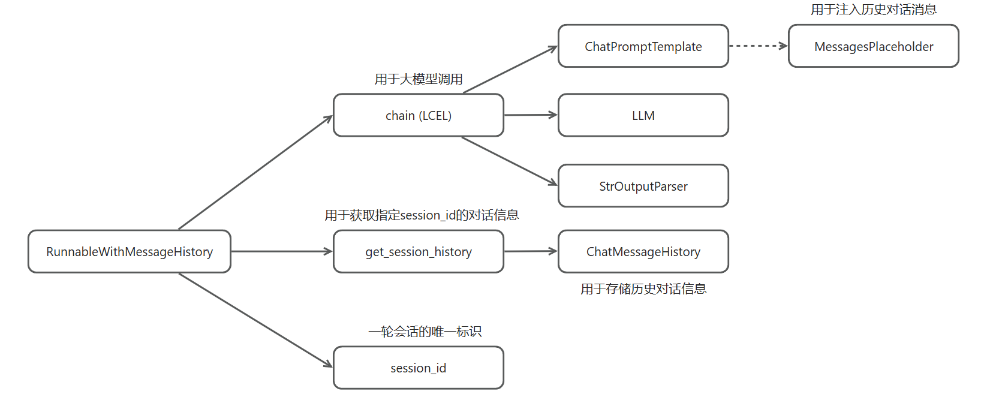
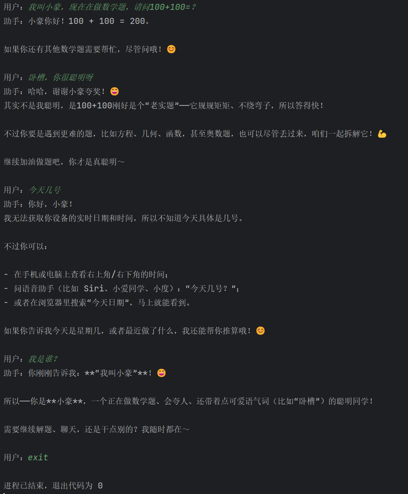

## 一、为什么需要多轮对话能力？
多轮对话能力的核心目的：让模型“记住你刚才说过什么”。

为什么要做这件事？
- **✅ 1. 一轮对话无法解决复杂任务**
  - 比如：写代码 / 写一个复杂文档 / 写小说，你肯定要不停追问、修改、补充。

- **✅ 2. 大模型有上下文长度限制**
  - 一次性塞进去所有历史，是不现实的。

- **✅ 3. 用户体验必须“能记住”**
  - 你希望像 `ChatGPT` 那样：你问：“再优化刚才的快排。”，模型知道“刚才”是什么。

**因此，我们需要：Session 级别的对话上下文管理。**

## 二、LCEL：LangChain Expression Language
一句话解释：`LCEL` = `LangChain` 的“管道语法”，像前端里的 `Pipe` / `Middleware` / `Pipeline`。就是“输出 `A`→ 作为 `B` 的输入 → 输出 `C` → 作为 `D` 的输入”。
**比如：**
```python
chain = prompt | llm | StrOutputParser()
```
**好处：** 你可以把 prompt、模型、输出解析组成一个“可复用的函数”。这就是现代 AI 开发的最佳实践。

## 三、构建session级别的多轮对话能力
整个流程分`6`步：
```shell
用户问题
   ↓
ChatPromptTemplate（注入 system + history + 用户问题）
   ↓
LLM（模型生成回答）
   ↓
输出解析器（转成字符串或结构化数据）
   ↓
RunnableWithMessageHistory（读写对话历史）
   ↓
持久化（可选：内存 / 文件 / Redis / DB）
```


### 3.1 构建提示词模板
这里在对话中注入了`MessagesPlaceholder`，用于注入对话历史：
```python
from langchain_core.prompts import ChatPromptTemplate, MessagesPlaceholder

chat_prompt_template = ChatPromptTemplate.from_messages([
    ("system", "你是一个技术专家，擅长解决各种Web开发中的技术问题"),
    MessagesPlaceholder(variable_name="chat_history"),
    ("human", "{question}")
])
```
**ChatPromptTemplate + MessagesPlaceholder**
> MessagesPlaceholder 是 LangChain Prompt 模板中的“动态消息占位符”，用于插入一组历史消息（多个 HumanMessage / AIMessage），通常用于多轮对话。可以类比于前端的插槽。
```vue
<template>
  <system />
  <slot name="history" />
  <user />
</template>
```

### 3.2 创建大模型实例
```python
from langchain_openai import ChatOpenAI
from pydantic import SecretStr

llm = ChatOpenAI(
    model="qwen3-max",
    base_url="https://dashscope.aliyuncs.com/compatible-mode/v1",
    api_key=SecretStr("sk-xxxx"),
    streaming=True
)
```

### 3.3 构建链式调用
将提示词模板、大模型、输出结构化结合在一起使用：
```python
chain = chat_prompt_template | llm | StrOutputParser()
```

### 3.4 构建基于历史消息的Runnable实例
又分为三小步：
#### 3.4.1 创建session存储对象
```python
store = {}
```

#### 3.4.2 创建获取session的函数
根据 session_id 获取 session 内容，如果 session_id 不存在时进行创建：
```python
from langchain_community.chat_message_histories import ChatMessageHistory

def get_session_history(session_id: str):
  if session_id not in store:
    store[session_id] = []
  return store[session_id]
```

#### 3.4.3 创建RunnableWithMessageHistory实例
```python
from langchain_core.runnables.history import RunnableWithMessageHistory

chain_with_history = RunnableWithMessageHistory(
    runnable=chain,
    get_session_history=get_session_history,
    input_messages_key="question",
    history_messages_key="chat_history"
)
```
**RunnableWithMessageHistory：** 是给任意链（Runnable）外挂“多轮对话历史管理”。
你原来的链：
```python
chain = prompt | llm | parser
```
链本身是“无记忆”的，每次调用都是一次性任务。但是如果你想要多轮对话（ChatGPT 的功能），你就必须给链加上：
- 历史消息读取
- 本轮消息保存
- Session 区分
- 多用户对话隔离
- 与 prompt 中的 MessagesPlaceholder 对接
这些复杂逻辑不能你每次都手动写，于是就有了：
```python
chain_with_history = RunnableWithMessageHistory(...)
```
它做的事情就是：

✔（1）自动读取历史消息
```python
history = get_session_history(session_id)
```
✔（2）Prompt 的 MessagesPlaceholder
```python
MessagesPlaceholder("chat_history")
```
✔（3）执行 LLM 生成回答
```python
llm.invoke(prompt)
```
✔（4）自动把（用户提问 + 模型回答）写回历史
✔（5）区分不同 session

**RunnableWithMessageHistory核心参数:**
| 参数                                    | 含义                               |
| ------------------------------------- | -------------------------------- |
| `runnable=chain`                      | 你想增强“拥有记忆”的目标链                   |
| `get_session_history`                 | 给定 session_id，返回对应历史（内存 or 文件）   |
| `input_messages_key="question"`       | 你的输入字典里，哪个字段是“用户提问”              |
| `history_messages_key="chat_history"` | Prompt 中 MessagesPlaceholder 的名字 |

**RunnableWithMessageHistory 如何工作？**
给你一个“伪代码”，让你彻底懂：
```python
class RunnableWithMessageHistory:
  def invoke(self, input, config):
    # 1. 获取 session_id
    session_id = config["configurable"]["session_id"]
    # 2. 加载历史消息（chat_history）
    history = get_session_history(session_id).messages
    # 3. 把 history 注入到链的输入里
    input["chat_history"] = history
    # 4. 调用原链
    output = runnable.invoke(input)
    # 5. 把用户输入写入历史
    history.append(HumanMessage(input[input_key]))
    # 6. 把模型回答写入历史
    history.append(AIMessage(output))
    # 7. 保存历史（文件 / Redis / DB）
    get_session_history(session_id).save()
    return output
```

#### 3.4.4 完整的多轮对话案例
```python
from langchain_core.output_parsers import StrOutputParser
from dialogue.common import chat_prompt_template, llm
from langchain_community.chat_message_histories import ChatMessageHistory
from langchain_core.runnables.history import RunnableWithMessageHistory
import uuid

store = {}

def get_session_history(session_id: str):
    if session_id not in store:
        store[session_id] = ChatMessageHistory()
    return store[session_id]

chain = chat_prompt_template | llm | StrOutputParser()

chain_with_history = RunnableWithMessageHistory(
    runnable=chain,
    get_session_history=get_session_history,
    input_messages_key="question",
    history_messages_key="chat_history"
)

session_id = uuid.uuid4()
while True:
    user_input = input("用户：")
    if user_input.lower() == 'exit':
        break
    resp = chain_with_history.stream(
        {"question": user_input},
        config={"configurable": {"session_id": session_id}}
    )
    print("助手：", end="")
    for chunk in resp:
        print(chunk, end="")
    print("\n")
```
运行结果：
