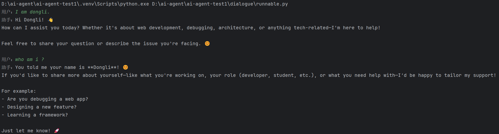

## 一、为什么需要多轮对话能力？
多轮对话能力的核心目的：让模型“记住你刚才说过什么”。

为什么要做这件事？
- **✅ 1. 一轮对话无法解决复杂任务**
  - 比如：写代码 / 写一个复杂文档 / 写小说，你肯定要不停追问、修改、补充。

- **✅ 2. 大模型有上下文长度限制**
  - 一次性塞进去所有历史，是不现实的。

- **✅ 3. 用户体验必须“能记住”**
  - 你希望像 `ChatGPT` 那样：你问：“再优化刚才的快排。”，模型知道“刚才”是什么。

**因此，我们需要：Session 级别的对话上下文管理。**

## 二、LCEL：LangChain Expression Language
一句话解释：`LCEL` = `LangChain` 的“管道语法”，像前端里的 `Pipe` / `Middleware` / `Pipeline`。就是“输出 `A`→ 作为 `B` 的输入 → 输出 `C` → 作为 `D` 的输入”。
**比如：**
```python
chain = prompt | llm | StrOutputParser()
```
**好处：** 你可以把 prompt、模型、输出解析组成一个“可复用的函数”。这就是现代 AI 开发的最佳实践。

## 三、构建session级别的多轮对话能力
整个流程分`6`步：
```shell
用户问题
   ↓
ChatPromptTemplate（注入 system + history + 用户问题）
   ↓
LLM（模型生成回答）
   ↓
输出解析器（转成字符串或结构化数据）
   ↓
RunnableWithMessageHistory（读写对话历史）
   ↓
持久化（可选：内存 / 文件 / Redis / DB）
```


### 3.1 构建提示词模板
这里在对话中注入了`MessagesPlaceholder`，用于注入对话历史：
```python
from langchain_core.prompts import ChatPromptTemplate, MessagesPlaceholder

chat_prompt_template = ChatPromptTemplate.from_messages([
    ("system", "你是一个技术专家，擅长解决各种Web开发中的技术问题"),
    MessagesPlaceholder(variable_name="chat_history"),
    ("human", "{question}")
])
```
**ChatPromptTemplate + MessagesPlaceholder**
> MessagesPlaceholder 是 LangChain Prompt 模板中的“动态消息占位符”，用于插入一组历史消息（多个 HumanMessage / AIMessage），通常用于多轮对话。可以类比于前端的插槽。
```vue
<template>
  <system />
  <slot name="history" />
  <user />
</template>
```

### 3.2 创建大模型实例
```python
from langchain_openai import ChatOpenAI
from pydantic import SecretStr

llm = ChatOpenAI(
    model="qwen3-max",
    base_url="https://dashscope.aliyuncs.com/compatible-mode/v1",
    api_key=SecretStr("sk-xxxx"),
    streaming=True
)
```

### 3.3 构建链式调用
将提示词模板、大模型、输出结构化结合在一起使用：
```python
chain = chat_prompt_template | llm | StrOutputParser()
```

### 3.4 构建基于历史消息的Runnable实例
又分为三小步：
#### 3.4.1 创建session存储对象
```python
store = {}
```

#### 3.4.2 创建获取session的函数
根据 session_id 获取 session 内容，如果 session_id 不存在时进行创建：
```python
from langchain_community.chat_message_histories import ChatMessageHistory

def get_session_history(session_id: str):
  if session_id not in store:
    store[session_id] = []
  return store[session_id]
```

#### 3.4.3 创建RunnableWithMessageHistory实例
```python
from langchain_core.runnables.history import RunnableWithMessageHistory

chain_with_history = RunnableWithMessageHistory(
    runnable=chain,
    get_session_history=get_session_history,
    input_messages_key="question",
    history_messages_key="chat_history"
)
```
**RunnableWithMessageHistory：** 是给任意链（Runnable）外挂“多轮对话历史管理”。
你原来的链：
```python
chain = prompt | llm | parser
```
链本身是“无记忆”的，每次调用都是一次性任务。但是如果你想要多轮对话（ChatGPT 的功能），你就必须给链加上：
- 历史消息读取
- 本轮消息保存
- Session 区分
- 多用户对话隔离
- 与 prompt 中的 MessagesPlaceholder 对接
这些复杂逻辑不能你每次都手动写，于是就有了：
```python
chain_with_history = RunnableWithMessageHistory(...)
```
它做的事情就是：

✔（1）自动读取历史消息
```python
history = get_session_history(session_id)
```
✔（2）Prompt 的 MessagesPlaceholder
```python
MessagesPlaceholder("chat_history")
```
✔（3）执行 LLM 生成回答
```python
llm.invoke(prompt)
```
✔（4）自动把（用户提问 + 模型回答）写回历史
✔（5）区分不同 session

**RunnableWithMessageHistory核心参数:**
| 参数                                    | 含义                               |
| ------------------------------------- | -------------------------------- |
| `runnable=chain`                      | 你想增强“拥有记忆”的目标链                   |
| `get_session_history`                 | 给定 session_id，返回对应历史（内存 or 文件）   |
| `input_messages_key="question"`       | 你的输入字典里，哪个字段是“用户提问”              |
| `history_messages_key="chat_history"` | Prompt 中 MessagesPlaceholder 的名字 |

**RunnableWithMessageHistory 如何工作？**
给你一个“伪代码”，让你彻底懂：
```python
class RunnableWithMessageHistory:
  def invoke(self, input, config):
    # 1. 获取 session_id
    session_id = config["configurable"]["session_id"]
    # 2. 加载历史消息（chat_history）
    history = get_session_history(session_id).messages
    # 3. 把 history 注入到链的输入里
    input["chat_history"] = history
    # 4. 调用原链
    output = runnable.invoke(input)
    # 5. 把用户输入写入历史
    history.append(HumanMessage(input[input_key]))
    # 6. 把模型回答写入历史
    history.append(AIMessage(output))
    # 7. 保存历史（文件 / Redis / DB）
    get_session_history(session_id).save()
    return output
```

#### 3.4.4 完整的多轮对话案例
```python
from langchain_core.output_parsers import StrOutputParser
from dialogue.common import chat_prompt_template, llm
from langchain_community.chat_message_histories import ChatMessageHistory
from langchain_core.runnables.history import RunnableWithMessageHistory
import uuid

store = {}

def get_session_history(session_id: str):
    if session_id not in store:
        store[session_id] = ChatMessageHistory()
    return store[session_id]

chain = chat_prompt_template | llm | StrOutputParser()

chain_with_history = RunnableWithMessageHistory(
    runnable=chain,
    get_session_history=get_session_history,
    input_messages_key="question",
    history_messages_key="chat_history"
)

session_id = uuid.uuid4()
while True:
    user_input = input("用户：")
    if user_input.lower() == 'exit':
        break
    resp = chain_with_history.stream(
        {"question": user_input},
        config={"configurable": {"session_id": session_id}}
    )
    print("助手：", end="")
    for chunk in resp:
        print(chunk, end="")
    print("\n")
```
运行结果：


### 3.5 历史消息以文件形式保存 —— `FileChatMessageHistory`
> **FileChatMessageHistory**：把历史消息保存到文件里，下次加载时从文件里读取。这个库是从 `langchain_community` 中的 `chat_message_histories` 中提供的一个工具类。在 `chat_message_histories` 中也提供了很多其他保存历史消息的工具类，比如 `PostgresChatMessageHistory`、`MongoDBChatMessageHistory`、`SQLChatMessageHistory` 等。

#### 3.5.1 创建文件存储对象
```python
from langchain_community.chat_message_histories import FileChatMessageHistory

def get_session_history(session_id: str):
    return FileChatMessageHistory(f"{session_id}.txt")
```

#### 3.5.2 创建 `RunnableWithMessageHistory` 实例
```python
from langchain_core.runnables.history import RunnableWithMessageHistory

chain = chat_prompt_template | llm | StrOutputParser()

chain_with_history = RunnableWithMessageHistory(
    runnable=chain,
    get_session_history=get_session_history,
    input_messages_key="question",
    history_messages_key="chat_history"
)
```

#### 3.5.3 完整的多轮对话案例
```python
session_id = uuid.uuid4()
while True:
    user_input = input("用户：")
    if user_input.lower() == 'exit':
        break
    resp = chain_with_history.stream(
        {"question": user_input},
        config={"configurable": {"session_id": session_id}}
    )
    print("助手：", end="")
    for chunk in resp:
        print(chunk, end="")
    print("\n")
```
运行结果：


最终完成对话后，会在当前目录下生成一个文件，文件名是 `session_id`，文件内容是历史消息：


## 四、`Langchain Runnables` 核心库介绍
大模型管道操作符，到底输出的是什么对象？
```python
from langchain_core.prompts import ChatPromptTemplate, MessagesPlaceholder, StringPromptTemplate
from langchain_openai import ChatOpenAI
from pydantic import SecretStr

chat_prompt_template = ChatPromptTemplate.from_messages([
    ("system", "你是一个技术专家，擅长解决各种Web开发中的技术问题"),
    MessagesPlaceholder(variable_name="chat_history"),
    ("human", "{question}")
])

llm = ChatOpenAI(
    model="qwen3-max",
    base_url="https://dashscope.aliyuncs.com/compatible-mode/v1",
    api_key=SecretStr("sk-f79659d832694e90b199f10026d3de67"),
    streaming=True
)

chain = chat_prompt_template | llm | StringPromptTemplate
print(type(chain))
```
输出结果：
```python
<class 'langchain_core.runnables.base.RunnableSequence'>
```

查看继承关系：
```python
print(isinstance(chat_prompt_template, Runnable))
print(isinstance(llm, Runnable))
print(isinstance(StrOutputParser(), Runnable))
```
输出结果：
```python
True
True
True
```
 
**说明：** `chat_prompt_template`、`llm`、`StrOutputParser` 都是 `Runnable` 的子类。

### 4.1 什么是 Runnables？
- `Runnables` 是 `LangChain` 0.3 版本引入的核心抽象，代表“可运行的链式组件”。
- 它统一了各种链（`Chain`）、工具（`Tool`）、模型（`LLM/ChatModel`）、`Prompt` 等的调用方式，使得它们都可以像函数一样被组合、调用、异步执行、流式输出等。
**简单理解：**
- 以前 `LangChain` 里有 `Chain`、`Tool`、`LLM` 等不同的接口和调用方式。
- 以前 `LangChain` 里有 `Chain、Tool、LLM` 等不同的接口和调用方式。

### 4.2 `Runnables` 怎么用？
#### 4.2.1 串行 `RunnableSequence`
官网地址：https://reference.langchain.com/python/langchain_core/runnables/
- 功能：按照顺序执行多个 `Runnables`，前一个作为后一个的输入。
- 表示：通过管道符 `|` 或者 `RunableSequence()` 创建。
- 示例一：通过管道符 `|`

```python
from dialogue.common import chat_prompt_template, llm
from langchain_core.output_parsers import StrOutputParser

chain = chat_prompt_template | llm | StrOutputParser()
resp = chain.stream({"question": "what your name?"})
for chunk in resp:
    print(chunk, end="")
```
- 示例二：通过 `RunnableSequence()` 创建
```python
from dialogue.common import llm, chat_prompt_template
from langchain_core.output_parsers import StrOutputParser
from langchain_core.runnables import RunnableSequence

chain = RunnableSequence(
    first=chat_prompt_template,
    middle=[llm],
    last=StrOutputParser()
)

resp = chain.stream({"question": "what your name ?"})

for chunk in resp:
    print(chunk, end="")
```

#### 4.2.2 并行 `RunnableParallel`
- 功能：并行执行多个 Runnables，将结果组合为字典。
- 表示：使用字典定义并行任务。
- 示例：
```python
from dialogue.common import llm
from langchain_core.prompts import ChatPromptTemplate
from langchain_core.runnables import RunnableParallel

pome_chain = ChatPromptTemplate.from_template("给我写一首{topic}主题的七言绝句") | llm
joke_chain = ChatPromptTemplate.from_template("给我讲一个关于{topic}的故事") | llm

new_chain = RunnableParallel(pome=pome_chain, joke=joke_chain)
resp = new_chain.invoke({"topic": "AI"})
print(resp)
```
输出结果：
```shell
{'pome': AIMessage(content='《咏AI》\n硅基灵智破鸿蒙，\n万卷云章一瞬通。\n莫道无心非造化，\n人机共绘大同风。\n\n注：诗中"
硅基"喻指AI的物理载体，"鸿蒙"象征混沌初开的智能觉醒。后两句以"无心"呼应AI无情感特质，却通过"共绘大同"展现人机协作的未来图景。
平仄依七绝正格，押平水韵上平一东韵。', additional_kwargs={}, response_metadata={'finish_reason': 'stop', 
'model_name': 'qwen3-max'}, id='run--bcb604a4-ac9f-4595-a50b-e95289e419ab-0'), 'joke': AIMessage(content='## 画框里
的春天\n\n老画家失明后，AI助手默默学习他毕生画作。某日，它用机械臂在空白画布上挥洒色彩——竟复现了老人记忆里故乡的春日：柳枝拂
过青瓦，溪水映着纸鸢。老人颤抖的手抚过湿润油彩，忽然泪流满面：“这光……和七十年前一模一样。”', additional_kwargs={}, 
response_metadata={'finish_reason': 'stop', 'model_name': 'qwen3-max'}, 
id='run--899e1a8b-3159-4342-8ee5-cfdebc861ae0-0')}
```

#### 4.2.3 函数 `RunnableLambda`
- 功能：将任意 `Python` 函数封装为 `Runnable`。
- 场景：插入自定义逻辑（如数据清洗、格式转换）。
- 示例：
```python
from langchain_core.runnables import RunnableLambda
uppercase_lambda = RunnableLambda(lambda x: x.upper())
resp = uppercase_lambda.invoke("hello world")
print(resp)

# 输出结果：
HELLO WORLD
```

#### 4.2.4 透传 `RunnablePassthrough`
- 功能：直接传递，不做任何修改。
- 试用场景：在并行链中保持原始输入不变。
- 示例：
```python
from dialogue.common import llm
from langchain_core.prompts import ChatPromptTemplate
from langchain_core.output_parsers import StrOutputParser
from langchain_core.runnables import RunnableParallel, RunnablePassthrough, RunnableLambda

chain = (ChatPromptTemplate.from_template("{question}") | llm |
         StrOutputParser() |
         RunnableParallel(origin=RunnablePassthrough(), modify=RunnableLambda(lambda x: x.upper())))

resp = chain.invoke({"question": "who are you ?"})
print(resp)
```

#### 4.2.5 分支 `RunnableBranch`
- 功能：根据条件选择执行不同的分支。
- 适用场景：动态路由（如根据输入类型选择不同处理路径）。
- 示例：
```python
from langchain_core.prompts import ChatPromptTemplate
from dialogue.common import llm
from langchain_core.output_parsers import StrOutputParser
from langchain_core.runnables import RunnableBranch

question_template_prompt = ChatPromptTemplate.from_template("{question}")
command_template_prompt = ChatPromptTemplate.from_template("{command}")

question_chain = question_template_prompt | llm | StrOutputParser()
command_chain = command_template_prompt | llm | StrOutputParser()

chain = RunnableBranch(
    (lambda x: "question" in x, question_chain),
    (lambda x: "command" in x, command_chain),
    question_chain
)

resp = chain.invoke({"question": "你是谁？"})

print(resp)
```

#### 4.2.6 多轮对话 `RunnableWithMessageHistory`
- 功能：为链添加对话历史管理。
- 适用场景：聊天机器人、多轮对话。
- 参考上面文档说明。

## 五、补充内容
#### 5.1 `Runnable Configurable`
`configurable` 是 `LangChain` 中用于在运行时传递和修改配置的核心机制，它不仅限于 `RunnableWithMessageHistory`，而是广泛应用于各种 `Runnable` 组件中。
- `configurable` 的作用：通过 `configurable` 字段，开发者可以在运行时动态调整 `Runnable` 的行为（如修改参数、切换组件实例等）。
- 实现方式：需要在 `Runnable` 的 `invoke` 或 `ainvoke` 方法中显式接收 `config` 参数，并在内部逻辑中解析和应用配置。

```python
from langchain_core.runnables import RunnableConfig
from langchain_core.tools import tool

@tool
def get_temperature(city: str, config: RunnableConfig):
    """get temperature of the city"""
    temperature = config.get("configurable", {}).get("temperature", "unknown")
    return f"{city}的温度是：{temperature}℃"

resp = get_temperature.invoke(input={
    "city": "天津"
}, config=RunnableConfig(configurable={"temperature": 30}))

print(resp)
```

动态设置 temperature 属性：

```python
from langchain_core.output_parsers import StrOutputParser
from langchain_core.runnables import RunnableLambda, ConfigurableField

from dialogue.common import llm

llm_with_config = llm.configurable_fields(
    temperature=ConfigurableField(
        id="temperature",
        name="大模型温度参数",
        description="用于调整大模型生成内容的随机性"
    ),
)

chain = RunnableLambda(lambda x: x["query"]) | llm | StrOutputParser()

response = chain.invoke(
    {"query": "What is AI?"},
    config={"configurable": {"temperature": 0.8}}
)
print(response)
```

#### 5.2 `Runnables` 可视化工具
安装指令
```python
uv add grandalf
```
打印 ASCII 流程图：
```python
from langchain_core.prompts import ChatPromptTemplate
from dialogue.common import llm
from langchain_core.output_parsers import StrOutputParser
from langchain_core.runnables import RunnableBranch

question_template_prompt = ChatPromptTemplate.from_template("{question}")
command_template_prompt = ChatPromptTemplate.from_template("{command}")

question_chain = question_template_prompt | llm | StrOutputParser()
command_chain = command_template_prompt | llm | StrOutputParser()

chain = RunnableBranch(
    (lambda x: "question" in x, question_chain),
    (lambda x: "command" in x, command_chain),
    question_chain
)
print(chain.get_graph().print_ascii())
resp = chain.invoke({"question": "你是谁？"})
```
输出结果：
```shell
+-------------+  
| PromptInput |  
+-------------+  
        *        
        *        
        *        
   +--------+    
   | Branch |    
   +--------+    
        *        
        *        
        *        
+--------------+ 
| BranchOutput | 
+--------------+ 
```