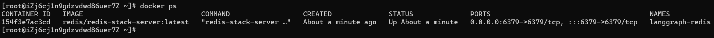
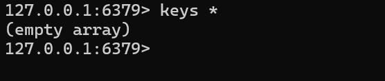
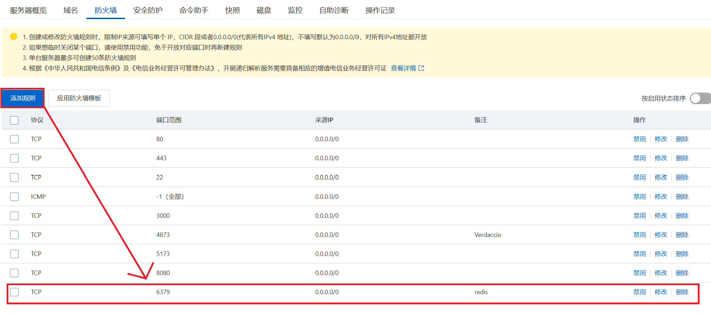
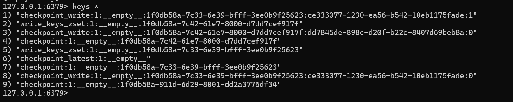
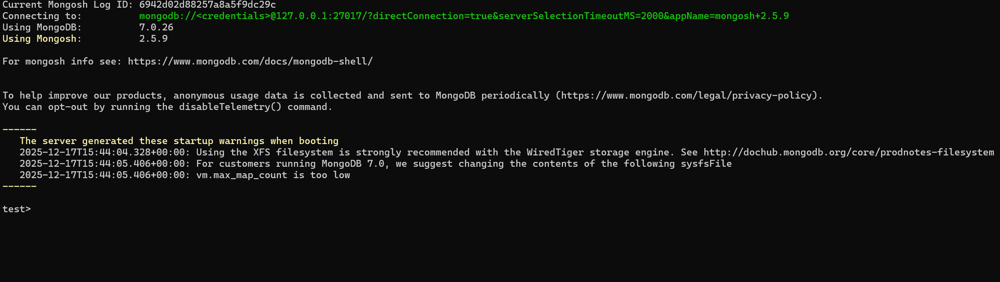
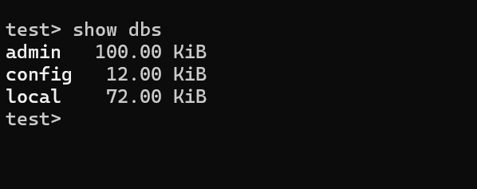
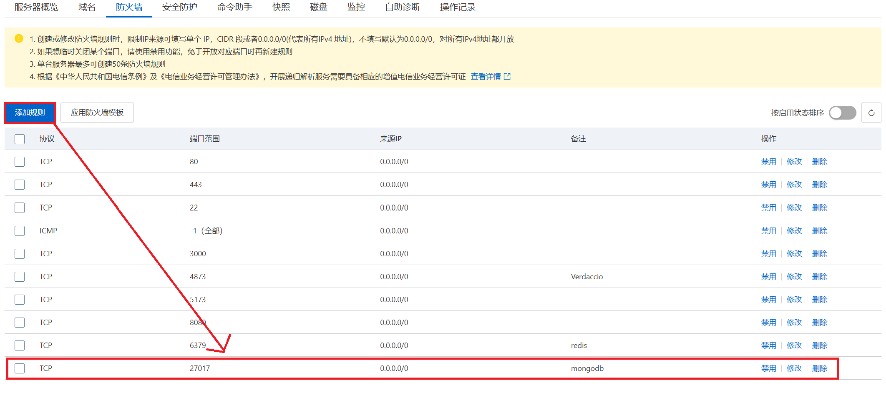
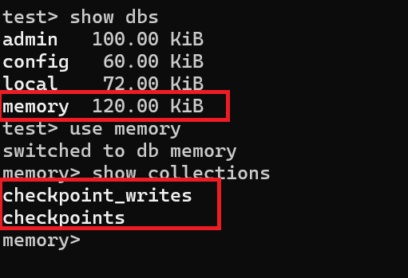
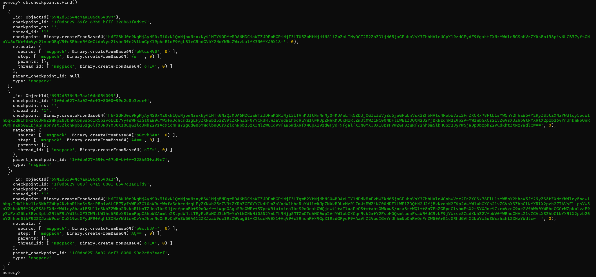

## 一、LangGraph Agent 记忆能力是什么？
在 `LangGraph` 里，“记忆（`Memory`）”不是一个神秘模块，本质是 把 `Agent` 的“状态（`state`）”持久化，并在后续交互中继续使用。官方把记忆分成两类：
- **短期记忆（Short-term memory）**：Agent 在一次交互中，把交互过程中的信息记录下来，以便后续交互使用。
- **长期记忆（Long-term memory）**：Agent 在多次交互中，把交互过程中的信息记录下来，以便后续交互使用。

你可以用一个前端类比快速理解：
- **短期记忆：** `React/Vue` 的 `component state`，在组件生命周期内有效，组件销毁后，`state` 就没了。
- **长期记忆：** 数据库，把数据持久化存储，不管组件销毁与否，数据都在。

下面将从短期记忆、长期记忆两个方面详细讲解，并介绍 `LangGraph Agent` 的记忆能力。

## 二、短期记忆 —— Memory
这里的短期记忆，可以理解为当前运行的进程中的内存存储，当进程关闭，内存也会被释放掉，所以我们也可以叫它内存记忆。在介绍 `Mermory` 之前，先看下在没有内存记忆的时候，是怎么样的。

### 2.1 没有记忆能力的 `Agent`
```python
from langgraph.prebuilt import create_react_agent
from common import llm, file_tools

agent = create_react_agent(
    model=llm,
    tools=file_tools
)

res1 = agent.invoke(input={"messages": [("user", "我是dongli")]})
print("第一次回答：========")
print(res1["messages"][-1])

print("第二次回答：========")
res2 = agent.invoke(input={"messages": [("user", "我是谁？")]})
print(res2["messages"][-1])
```
运行结果：
```python
第一次回答：========
content='你好，dongli！有什么我可以帮你的吗？' additional_kwargs={} response_metadata={'finish_reason': 'stop', 'model_name': 'qwen3-max'} id='run--51afed25-c9f9-47c5-bbb0-5c2330b9a974-0'
第二次回答：========
content='我不知道你是谁。你可以告诉我你的名字或者你想做什么！' additional_kwargs={} response_metadata={'finish_reason': 'stop', 'model_name': 'qwen3-max'} id='run--f75ffd2a-16cb-4ef8-b6cc-5ea8c51cf7af-0'
```
可以看到，两次回答都是独立的，没有关联性，因为 `Agent` 没有记忆能力，每次交互都是独立的。

### 2.2 有记忆能力的 `Agent`
在 `langgraph.checkpointer.memory` 模块中，提供了 `Memory` 类，用于存储 `Agent` 的状态，下面是使用 `Memory` 的例子：
```python
from langgraph.prebuilt import create_react_agent
from common import llm, file_tools
from langgraph.checkpoint.memory import MemorySaver
from langchain_core.runnables import RunnableConfig

memory = MemorySaver()
agent = create_react_agent(
    model=llm,
    tools=file_tools,
    checkpointer=memory,
    # debug=True,
)

config = RunnableConfig(configurable={"thread_id": "1"})

res1 = agent.invoke(input={"messages": [("user", "我是dongli")]}, config=config)
print("第一次回答：========")
print(res1["messages"][-1])

print("第二次回答：========")
res2 = agent.invoke(input={"messages": [("user", "我是谁？")]}, config=config)
print(res2["messages"][-1])
```
运行结果：
```python
第一次回答：========
content='你好，dongli！有什么我可以帮你的吗？' additional_kwargs={} response_metadata={'finish_reason': 'stop', 'model_name': 'qwen3-max'} id='run--ff06f20a-40b1-4688-a167-eb9a3d7caf99-0'
第二次回答：========
content='你是 dongli！' additional_kwargs={} response_metadata={'finish_reason': 'stop', 'model_name': 'qwen3-max'} id='run--35e7ab10-02af-48b9-bc65-5b2c486b7ac3-0'
```
此时就可以看到 `Agent` 就具备了记忆能力，可以结合之前的交互信息，进行回答。
这里需要说明一点：我们这里传递的 `config` 中的 `configurable` 参数，是 `RunnableConfig` 类的 `configurable` 属性，用于标识当前 `Agent` 的运行环境，比如 `thread_id`，`user_id` 等，这些信息会记录到 `Memory` 中，以便后续交互使用。

接下来我们将 `debug` 改为 `True` 来看下打印的日志信息。
```python
[values] {'messages': [HumanMessage(content='我是dongli', additional_kwargs={}, response_metadata={}, id='aee24890-1b97-437c-98c9-89b08d9d0761')]}

[updates] {'agent': {'messages': [AIMessage(content='你好，dongli！有什么我可以帮你的吗？', additional_kwargs={}, response_metadata={'finish_reason': 
'stop', 'model_name': 'qwen3-max'}, id='run--c3825921-b193-46eb-80d4-c407f6c4054c-0')]}}

[values] {'messages': [HumanMessage(content='我是dongli', additional_kwargs={}, response_metadata={}, id='aee24890-1b97-437c-98c9-89b08d9d0761'), 
AIMessage(content='你好，dongli！有什么我可以帮你的吗？', additional_kwargs={}, response_metadata={'finish_reason': 'stop', 'model_name': 'qwen3-max'}, 
id='run--c3825921-b193-46eb-80d4-c407f6c4054c-0')]}

第一次回答：========

content='你好，dongli！有什么我可以帮你的吗？' additional_kwargs={} response_metadata={'finish_reason': 'stop', 'model_name': 'qwen3-max'} 
id='run--c3825921-b193-46eb-80d4-c407f6c4054c-0'

第二次回答：========

[values] {'messages': [HumanMessage(content='我是dongli', additional_kwargs={}, response_metadata={}, id='aee24890-1b97-437c-98c9-89b08d9d0761'), 
AIMessage(content='你好，dongli！有什么我可以帮你的吗？', additional_kwargs={}, response_metadata={'finish_reason': 'stop', 'model_name': 'qwen3-max'}, 
id='run--c3825921-b193-46eb-80d4-c407f6c4054c-0'), HumanMessage(content='我是谁？', additional_kwargs={}, response_metadata={}, 
id='c0eb65f7-bebe-43e4-a256-c268ac50f3ff')]}

[updates] {'agent': {'messages': [AIMessage(content='你是 dongli！', additional_kwargs={}, response_metadata={'finish_reason': 'stop', 'model_name': 
'qwen3-max'}, id='run--ec328e1a-db8c-44aa-ad21-75a91bcb1439-0')]}}

[values] {'messages': [HumanMessage(content='我是dongli', additional_kwargs={}, response_metadata={}, id='aee24890-1b97-437c-98c9-89b08d9d0761'), 
AIMessage(content='你好，dongli！有什么我可以帮你的吗？', additional_kwargs={}, response_metadata={'finish_reason': 'stop', 'model_name': 'qwen3-max'}, 
id='run--c3825921-b193-46eb-80d4-c407f6c4054c-0'), HumanMessage(content='我是谁？', additional_kwargs={}, response_metadata={}, 
id='c0eb65f7-bebe-43e4-a256-c268ac50f3ff'), AIMessage(content='你是 dongli！', additional_kwargs={}, response_metadata={'finish_reason': 'stop', 
'model_name': 'qwen3-max'}, id='run--ec328e1a-db8c-44aa-ad21-75a91bcb1439-0')]}

content='你是 dongli！' additional_kwargs={} response_metadata={'finish_reason': 'stop', 'model_name': 'qwen3-max'} 
id='run--ec328e1a-db8c-44aa-ad21-75a91bcb1439-0'
```

### 2.3 详细解释
上面输出如下这种形式：
- `[values] {...}`
- `[updates] {...}`
这两个词是 `LangGraph` 的 `streaming` 模式里的概念：
- `values: ` 每一步执行完成后完整的 `state`，可以理解为 `state` 变化后都会进行一次全部状态的 “快照”。
- `updates：` 每一步里面的某一个节点返回的 `增量更新`。
#### 2.3.1 逐行解释：

**第一次输入**
```python
res1 = agent.invoke(input={"messages": [("user", "我是dongli")]}, config=config)
```

**输出1：`[values]`（输入合并后，得到当前 state）**
```txt
[values] {'messages': [HumanMessage(content='我是dongli', ...)]}
```
这里表示：
- `LangGraph` 把 `input` 先转化为 `HumanMessage`，然后写入 `state` 的 `messages` 中，此时就会存在一条信息。

**输出2：`[updates]`（某一个节点产生的增量更新）**
```txt
[updates] {'agent': {'messages': [AIMessage(content='你好，dongli！...')]} }
```
这表示：
- 这个节点调用了你的 `llm`，生成了一个 `AIMessage(...)`，节点返回的增量更新是：`{"messages": [AIMessage(...)]}`

**输出3: `[values]（这一 `super-step` 完成后的全量 `state`）**
```txt
[values] {'messages': [HumanMessage(...), AIMessage(...)]}
```
此时一轮已经结束了，`messages` 中的消息为：
```txt
[HumanMessage("我是xxxx"), AIMessage("你好，xxxx！...")]
```

**第二次输入**
```python
res2 = agent.invoke(input={"messages": [("user", "我是谁？")]}, config=config)
```
**输出4：`[values]`（输入合并后，得到当前 state）**
```txt
[values] {'messages': [HumanMessage(...), AIMessage(...), HumanMessage(...)]}
```
此时 `messages` 中的消息为：
```txt
[HumanMessage("我是xxxx"), AIMessage("你好，xxxx！..."), HumanMessage("我是谁？")]
```
这行就是“记忆生效”的铁证：
- 如果没有 `checkpointer` 或者 `thread_id`，此时应该只看到 `HumanMessage("我是谁？")`
- 但是有了 `checkpointer` 和 `thread_id`，`LangGraph` 会自动把之前的 `state` 恢复回来，所以会看到 `HumanMessage("我是xxxx")` 和 `AIMessage("你好，xxxx！..."`
接着就继续按照之前的步骤执行：`[values]` -> `[updates]` -> `[values]` .... 一直循环到结束。

## 三、缓存持久化 `redisSaver`
这里由于我本地 `windows` 电脑无法安装 `redis`，现在我使用一个远程服务器，启动一个 `redis` 容器，让本地将数据保存在远端。具体步骤如下：

### 3.1 在服务器上集成 `redis` 容器
**1、创建 `redis` 容器在宿主机的目录**

因为每一次容器的启动，数据都会被清空，所以我们需要把数据保存在宿主机上，这样即使容器关闭，数据也不会丢失。
```shell
# 保存 redis 容器中产生的数据
mkdir -p /opt/langgraph-redis/data
# 保存 redis 容器的配置文件
mkdir -p /opt/langgraph-redis/conf
```

**2、创建配置文件**
```shell
touch redis-stack.conf
```

**3、编辑配置文件**
```shell
vi redis-stack.conf
```
在文件中添加以下内容：
```shell
bind 0.0.0.0
protected-mode yes

# 密码
requirepass xxxxxxxx

# 持久化（AOF + RDB）
appendonly yes
save 60 1

# 数据目录（容器内）
dir /data
```

**4、拉取 `redis` 镜像并创建 `redis` 容器**
```shell
docker run -d --name langgraph-redis   --restart unless-stopped   -p 6379:6379   -v /opt/langgraph-redis/data:/data   -v /opt/langgraph-redis/conf/redis-stack.conf:/redis-stack.conf   redis/redis-stack-server:latest   redis-stack-server /redis-stack.conf
```
在这里指定了 `redis` 的配置文件路径为 `/redis-stack.conf`，所以容器启动后，会自动读取该配置文件，并且将 `6379` 端口号映射到宿主机的 `6379` 端口，保证外部可以访问。

**5、检查 `redis` 容器状态**

如上图所示，表示容器已经启动完成。

**6、进入 `redis` 容器**
```shell
docker exec -it langgraph-redis redis-cli -a "xxxxxxx"
```
上面表达式中的 `-a  xxxxx` 表示进入 `redis` 容器后，需要输入密码 `xxxxxx` 才能进入。

**7、检查 `redis` 容器中是否有数据**
```shell
keys *
```

如上图所示，表示 `redis` 容器中没有任何数据。

**8、在防火墙设置 `6379` 端口**
在`linux` 服务器上，需要设置防火墙，保证外部可以访问 `6379` 端口，由于我在服务器上并没有开启防火墙，但是在阿里云上开启了防火墙，所以需要设置一下。


如上图所示，表示已经设置成功。

### 3.2 在本地代码中集成 `redisSaver`
**1、安装 `langgraph-checkpoint-redis` 库**
```shell
uv add langgraph-checkpoint-redis
```

**2、编写代码**
```python
from langgraph.prebuilt import create_react_agent
from langgraph.checkpoint.redis import RedisSaver
from langchain_core.runnables.config import RunnableConfig

from common import llm, file_tools

def create_agent():
    with RedisSaver.from_conn_string("redis://:password@ip:6379") as memory:
        memory.setup()
        agent = create_react_agent(
            model=llm,
            tools=file_tools,
            checkpointer=memory,
            debug=True,
        )
        config = RunnableConfig(configurable={"thread_id": "1"})

        res = agent.invoke(input={"messages": [("user", "我是dongli，你是谁？")]}, config=config)
        print("="*60)
        print(res)
        print("="*60)

if __name__ == "__main__":
    create_agent()
```
输出结果：
```txt
[values] {'messages': [HumanMessage(content='我是dongli，你是谁？', additional_kwargs={}, response_metadata={}, id='247c7b75-616e-4d46-a35f-14f4817062ef')]}
22:57:07 httpx INFO   HTTP Request: POST https://dashscope.aliyuncs.com/compatible-mode/v1/chat/completions "HTTP/1.1 200 OK"

[updates] {'agent': {'messages': [AIMessage(content='你好，dongli！我是你的AI助手，可以帮助你完成各种任务，比如文件操作（复制、移动、删除、搜索等）、读写文件、列出
目录内容等。有什么我可以帮你的吗？', additional_kwargs={}, response_metadata={'finish_reason': 'stop', 'model_name': 'qwen3-max'}, 
id='run--93f02bb1-9537-4d76-b200-4b792c317af4-0')]}}

[values] {'messages': [HumanMessage(content='我是dongli，你是谁？', additional_kwargs={}, response_metadata={}, id='247c7b75-616e-4d46-a35f-14f4817062ef'), 
AIMessage(content='你好，dongli！我是你的AI助手，可以帮助你完成各种任务，比如文件操作（复制、移动、删除、搜索等）、读写文件、列出目录内容等。有什么我可以帮你的吗？', 
additional_kwargs={}, response_metadata={'finish_reason': 'stop', 'model_name': 'qwen3-max'}, id='run--93f02bb1-9537-4d76-b200-4b792c317af4-0')]}

============================================================
{'messages': [HumanMessage(content='我是dongli，你是谁？', additional_kwargs={}, response_metadata={}, id='247c7b75-616e-4d46-a35f-14f4817062ef'), AIMessage
(content='你好，dongli！我是你的AI助手，可以帮助你完成各种任务，比如文件操作（复制、移动、删除、搜索等）、读写文件、列出目录内容等。有什么我可以帮你的吗？', 
additional_kwargs={}, response_metadata={'finish_reason': 'stop', 'model_name': 'qwen3-max'}, id='run--93f02bb1-9537-4d76-b200-4b792c317af4-0')]}
============================================================
```
这样就可以看出，`redis` 容器中已经保存了数据。

**3、查看 `redis` 容器中是否有数据**


**4、查看智能体是否可以记住历史消息**
此时可以将上述智能体代码改为：
```python
from langgraph.prebuilt import create_react_agent
from langgraph.checkpoint.redis import RedisSaver
from langchain_core.runnables.config import RunnableConfig

from common import llm, file_tools

def create_agent():

    with RedisSaver.from_conn_string("redis://:123456@47.239.180.0:6379") as memory:
        memory.setup()
        agent = create_react_agent(
            model=llm,
            tools=file_tools,
            checkpointer=memory,
            debug=True,
        )
        config = RunnableConfig(configurable={"thread_id": "1"})
        res = agent.invoke(input={"messages": [("user", "我是谁？")]}, config=config)
        print("="*60)
        print(res)
        print("="*60)
if __name__ == "__main__":
    create_agent()
```

输出结果：
```txt
[values] {'messages': [HumanMessage(content='我是dongli，你是谁？', additional_kwargs={}, response_metadata={}, id='247c7b75-616e-4d46-a35f-14f4817062ef'), 
AIMessage(content='你好，dongli！我是你的AI助手，可以帮助你完成各种任务，比如文件操作（复制、移动、删除、搜索等）、读写文件、列出目录内容等。有什么我可以帮你的吗？', 
additional_kwargs={}, response_metadata={'finish_reason': 'stop', 'model_name': 'qwen3-max'}, id='run--93f02bb1-9537-4d76-b200-4b792c317af4-0'), 
HumanMessage(content='我是谁？', additional_kwargs={}, response_metadata={}, id='372c8f53-0e21-4f0b-9573-92372b605b25')]}

23:02:00 httpx INFO   HTTP Request: POST https://dashscope.aliyuncs.com/compatible-mode/v1/chat/completions "HTTP/1.1 200 OK"

[updates] {'agent': {'messages': [AIMessage(content='你是dongli！', additional_kwargs={}, response_metadata={'finish_reason': 'stop', 'model_name': 
'qwen3-max'}, id='run--ef957211-6649-4ad4-ae75-83f80763f6a5-0')]}}

[values] {'messages': [HumanMessage(content='我是dongli，你是谁？', additional_kwargs={}, response_metadata={}, id='247c7b75-616e-4d46-a35f-14f4817062ef'), 
AIMessage(content='你好，dongli！我是你的AI助手，可以帮助你完成各种任务，比如文件操作（复制、移动、删除、搜索等）、读写文件、列出目录内容等。有什么我可以帮你的吗？', 
additional_kwargs={}, response_metadata={'finish_reason': 'stop', 'model_name': 'qwen3-max'}, id='run--93f02bb1-9537-4d76-b200-4b792c317af4-0'), 
HumanMessage(content='我是谁？', additional_kwargs={}, response_metadata={}, id='372c8f53-0e21-4f0b-9573-92372b605b25'), AIMessage(content='你是dongli！', 
additional_kwargs={}, response_metadata={'finish_reason': 'stop', 'model_name': 'qwen3-max'}, id='run--ef957211-6649-4ad4-ae75-83f80763f6a5-0')]}

============================================================
{'messages': [HumanMessage(content='我是dongli，你是谁？', additional_kwargs={}, response_metadata={}, id='247c7b75-616e-4d46-a35f-14f4817062ef'), AIMessage
(content='你好，dongli！我是你的AI助手，可以帮助你完成各种任务，比如文件操作（复制、移动、删除、搜索等）、读写文件、列出目录内容等。有什么我可以帮你的吗？', 
additional_kwargs={}, response_metadata={'finish_reason': 'stop', 'model_name': 'qwen3-max'}, id='run--93f02bb1-9537-4d76-b200-4b792c317af4-0'), 
HumanMessage(content='我是谁？', additional_kwargs={}, response_metadata={}, id='372c8f53-0e21-4f0b-9573-92372b605b25'), AIMessage(content='你是dongli！', 
additional_kwargs={}, response_metadata={'finish_reason': 'stop', 'model_name': 'qwen3-max'}, id='run--ef957211-6649-4ad4-ae75-83f80763f6a5-0')]}
============================================================
```
```txt
你好，dongli！我是你的AI助手，可以帮助你完成各种任务，比如文件操作（复制、移动、删除、搜索等）、读写文件、列出目录内容等。有什么我可以帮你的吗？
```
通过上面的回答其实已经可以看出，智能体已经记住了历史消息。

## 四、数据库持久化 `Mongdb`
前面总结了 `redis` 的持久化，下面总结一下 `Mongodb` 的持久化。我不太想在本地安装 `mongdb`，所以直接在远程服务器上使用 `docker` 启动一个 `mongdb` 容器。

### 4.1 在服务器上集成 `mongodb` 容器
**1、创建 `mongodb` 在宿主机的目录**

```shell
mkdir -p /opt/mongodb/data
```
将数据保存在宿主机上，防止容器删除后数据丢失。

**2、拉取 `mongodb` 镜像并启动容器**
```shell
docker run -d --name mongo --restart unless-stopped -p 27017:27017 -v /opt/mongodb/data:/data/db -e MONGO_INITDB_ROOT_USERNAME=root -e MONGO_INITDB_ROOT_PASSWORD=YOURSELF_PASSWORD mongo:7
```
在这里使用 `-e` 参数设置了 `mongodb` 的用户名和密码，`YOURSELF_PASSWORD` 替换为你的密码。

**3、查看 `mongodb` 容器是否启动成功**
```shell
[root@iZj6cj1n9gdzvdwd86uer7Z ~]# docker ps
CONTAINER ID   IMAGE     COMMAND                  CREATED         STATUS         PORTS                                           NAMES
8654f90c6218   mongo:7   "docker-entrypoint.s…"   5 seconds ago   Up 4 seconds   0.0.0.0:27017->27017/tcp, :::27017->27017/tcp   mongo
```
可以看到 `mongodb` 已经启动成功了。

**4、进入 `mongodb` 容器中查看**
```shell
docker exec -it mongo mongosh -u root -p YOURSELF_PASSWORD
```

如下图所示，表示已经进入了 `mongodb` 容器中。


**5、查看数据库**
```shell
show dbs
```


**6、在阿里云上增加防火墙规则**


至此我们的远端 `mongodb` 已经搭建好了，接下来就是如何在 `python` 中使用 `mongodb`。

### 4.2 在本地代码中集成 `MongoDBSaver`
**1、编写代码**

```python
from langgraph.prebuilt import create_react_agent
from langchain_community.agent_toolkits.file_management import FileManagementToolkit
from langchain_core.runnables.config import RunnableConfig
from langgraph.checkpoint.mongodb import MongoDBSaver

from common import llm

def create_agent():
    file_tools = FileManagementToolkit(root_dir="D:/ai-agent/ai-agent-test1/temp").get_tools()

    MONGODB_URI = "mongodb://root:YOURSELF_PASSWORD@IP:27017"
    DB_NAME = "memory"

    with MongoDBSaver.from_conn_string(MONGODB_URI, DB_NAME) as memory:
        agent = create_react_agent(
            model=llm,
            tools=file_tools,
            checkpointer=memory,
            debug=True,
        )
        config = RunnableConfig(configurable={"thread_id": "1"})

        res = agent.invoke(input={"messages": [("user", "我是dongli，你是谁？")]}, config=config)
        print("="*60)
        print(res)
        print("="*60)

        memory.close()
if __name__ == "__main__":
    create_agent()
```
输出结果：
```shell
[values] {'messages': [HumanMessage(content='我是谁？', additional_kwargs={}, response_metadata={}, 
id='05134efe-1fb4-401e-a5d4-7e6b0d77f7a8')]}

[updates] {'agent': {'messages': [AIMessage(content='我不知道你是谁。你可以告诉我你的名字或提供更多信息吗？', 
additional_kwargs={}, response_metadata={'finish_reason': 'stop', 'model_name': 'qwen3-max'}, 
id='run--123100e7-c0bf-4cd2-97f0-9868916f97a0-0')]}}

[values] {'messages': [HumanMessage(content='我是谁？', additional_kwargs={}, response_metadata={}, 
id='05134efe-1fb4-401e-a5d4-7e6b0d77f7a8'), AIMessage(content='我不知道你是谁。你可以告诉我你的名字或提供更多信息吗？', 
additional_kwargs={}, response_metadata={'finish_reason': 'stop', 'model_name': 'qwen3-max'}, 
id='run--123100e7-c0bf-4cd2-97f0-9868916f97a0-0')]}

============================================================
{'messages': [HumanMessage(content='我是谁？', additional_kwargs={}, response_metadata={}, 
id='05134efe-1fb4-401e-a5d4-7e6b0d77f7a8'), AIMessage(content='我不知道你是谁。你可以告诉我你的名字或提供更多信息吗？', 
additional_kwargs={}, response_metadata={'finish_reason': 'stop', 'model_name': 'qwen3-max'}, 
id='run--123100e7-c0bf-4cd2-97f0-9868916f97a0-0')]}
============================================================
```
此时进入到 `mongodb` 容器中查看数据库：

可以看到在 `mogodb` 中已经存在 `memory` 数据库了，并且数据中存在 `checkpoint_writes` 和 `checkpoint`两个数据表。

查看其中的数据为：


**2、再次询问**
增加如下代码：
```python
res = agent.invoke(input={"messages": [("user", "我是谁？")]}, config=config)
```

输出结果：
```shell
AIMessage(content='你是 dongli！'....)
```
至此数据库持久化已经完成。

## 五、文件持久化 `FileSaver` —— 进阶
