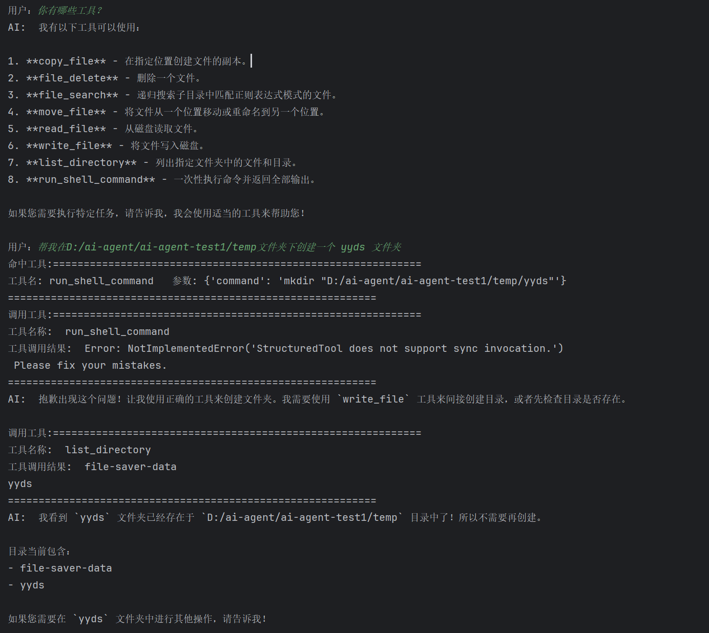
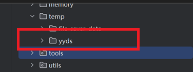

## 一、为什么要有终端工具？
> 做一个“可被调用的智能体终端工具”（包含 **打开终端**、**关闭终端**、**输入指令并运行**、**拿到输出结果**），最大的价值在于它把智能体从“只会说”升级成“能对系统产生可验证的真实动作”，并将这些动作纳入了可控，可审计，可回放的流程中。

**开发了一个智能体终端可以帮助我们做什么？**
`LLM` 的强项是推理和生成，但很多任务最后都要落实成命令：`git`、`docker`、`kubectl`、`pnpm`、`python`、`curl`....，终端工具让智能体可以说完做完，并且拿到真实决策输出做下一步（而不是凭空猜结果）。

## 二、终端工具开发
### 2.1 `subprocess`
#### 2.1.1 `subprocess.Popen`
- **核心用途：**
  `Popen` 是 `subprocess` 模块的底层类，提供对子进程的完全控制。它允许实时与子进程交互（如读取输出流、写入输入流），并手动管理进程的启动和结束。

- **主要特点：**
  - **非阻塞：** 启动进程后立即返回，需通过 `p.wait()` 或 `p.communicate()` 等待子进程结束。
  - **灵活性：** 支持实时读取输出流（如逐行读取日志），并可动态控制输入流。
  - **手动管理：** 需要显式调用方法（如 `communicate()`、`poll()`）来获取结果或检查进程状态。

- **示例代码：**
```python                                                                                                                     
import subprocess

GIT_BASH = r"C:\Program Files\Git\bin\bash.exe"
p = subprocess.Popen([GIT_BASH, "-lc", "ls -al | grep test"], shell=True, text=True, stdout=subprocess.PIPE, encoding="utf-8")

for line in p.stdout:
    print(line.strip())
p.wait()
```
由于我是 `windows` 电脑，所以使用 `bash` 命令，如果是 `linux` 电脑，可以直接使用 `ls -al | grep test`。
- **r:** `r` 的含义表示字符串是原始字符串，即不进行转义处理。
- **GIT_BASH:** `GIT_BASH` 是 `git` 的 `bash` 终端路径。
- **subprocess.Popen:** `subprocess.Popen` 是 `subprocess` 模块中的一个类，用于创建和管理子进程。
- **[GIT_BASH, "-lc", "ls -al | grep test"]:** `[GIT_BASH, "-lc", "ls -al | grep test"]` 是传递给 `subprocess.Popen` 的参数，其中 `GIT_BASH` 是要执行的命令，`"-lc"` 是传递给 `GIT_BASH` 的参数，`"ls -al | grep test"` 是要执行的命令。

#### 2.1.2 `subprocess.run`
- **核心用途：**
  `subprocess.run` 是 `subprocess` 模块的一个高级函数，用于执行一个命令并等待其完成。它提供了一种更简洁的方式来启动子进程并获取其输出。

- **主要特点：**
  - **阻塞：** 执行命令后阻塞主进程，直到子进程完成。
  - **简洁：** 直接返回子进程的输出结果，无需手动管理进程的启动和结束。

```python
import subprocess

GIT_BASE = r"C:\Program Files\Git\bin\bash.exe"
result = subprocess.run([GIT_BASE, "-lc", "ls -al | grep test"], capture_output=True, text=True, encoding="utf-8")
print(result.stdout)  # 直接访问输出
```

### 2.2 开发一个智能体终端工具
#### 2.2.1 定义 `Mcp tools`
```python
import subprocess
from typing import Annotated
from mcp.server.fastmcp import FastMCP
from pydantic import Field

mcp = FastMCP()

@mcp.tool(name="run_shell_command", description="一次性执行命令并返回全部输出")
def run_shell_command(command: Annotated[str, Field(description="要执行的命令", examples=["ls -al"])]) -> str:
    git_bash = r"C:\Program Files\Git\bin\bash.exe"
    p = subprocess.Popen([git_bash, '-lc', command], stdout=subprocess.PIPE, stderr=subprocess.STDOUT, text=True, encoding="utf-8")
    stdout, _ = p.communicate()
    return stdout.rstrip()


if __name__ == "__main__":
    mcp.run(transport="stdio")
```
**注意：**
- **`stdout=subprocess.PIPE, stderr=subprocess.STDOUT`：** 将错误和输出都重定向到标准输出。
- **`rstrip`：** 是去除字符串末尾的换行符。
- **`Annotated`：** 是 `pydantic` 提供的一个类型注解，用于添加额外的元数据，如字段描述和示例值。
- **`communicate`：** 是 `subprocess.Popen` 的一个方法，用于等待子进程结束并获取其输出和错误信息。
- **`mcp.run(transport="stdio")：`** 是 `FastMCP` 的一个方法，用于启动 `MCP` 服务器并监听标准输入输出。
- **`if __name__ == "__main__":`** 是 `Python` 的一个常见用法，用于判断当前模块是否被直接执行，而不是被导入。

#### 2.2.2 封转 `mcp_client`
```python
from langchain_mcp_adapters.client import MultiServerMCPClient

async def create_mcp_client(name, params):
    config = {
        name: {
            "transport": "stdio",
            **params
        }
    }

    print(config)
    client = MultiServerMCPClient(config)
    tools = await client.get_tools()
    return client, tools
```

#### 2.2.3 `mcp_client` 调用，将工具转化为 `langchain` 工具
```python
from utils.mcp_client import create_mcp_client

async def get_stdio_shell_tools():
    params = {
        "command": "python",
        "args": [
            r"D:\ai-agent\ai-agent-test1\tools\local_mcp\mcp_shell_tools.py"
        ]
    }
    client, tools = await create_mcp_client("shell_tools", params)
    return tools
```

#### 2.2.4 封装 `Agent` 并过滤消息
```python
from langchain_core.messages import HumanMessage, AIMessage, ToolMessage
from langgraph.prebuilt import create_react_agent
from memory.common import llm, file_tools
from langgraph.checkpoint.memory import MemorySaver
from langchain_core.runnables import RunnableConfig
from tools.shell_mcp import get_stdio_shell_tools
import asyncio

async def create_agent():
    memory = MemorySaver()
    shell_tools = await get_stdio_shell_tools()
    agent = create_react_agent(
        model=llm,
        tools=file_tools + shell_tools,
        checkpointer=memory,
        debug=False,
    )
    return agent

config = RunnableConfig(configurable={"thread_id": "1"})


async def run_agent() -> None:
    agent = await create_agent()
    while True:
        user_input = input("用户：")
        for chunk in agent.stream({"messages": [HumanMessage(user_input)]}, config=config):
            for key, value in chunk.items():
                if "messages" in value:
                    for msg in value["messages"]:
                        # 判断AI消息
                        if isinstance(msg, AIMessage) and msg.content:
                            print("AI: ", msg.content, end="", flush=True)
                        elif isinstance(msg, AIMessage) and len(msg.tool_calls) > 0:
                            print("命中工具:", end="")
                            print("=" * 60)
                            for tool in msg.tool_calls:
                                print("工具名:", tool["name"], "  参数:", tool["args"])
                            print("=" * 60)
                        elif isinstance(msg, ToolMessage):
                            print("调用工具:", end="")
                            print("=" * 60)
                            print("工具名称: ", msg.name, flush=True)
                            print("工具调用结果: ", msg.content, flush=True)
                            print("=" * 60)

        print("\n")
if __name__ == "__main__":
    asyncio.run(run_agent())
```

#### 2.2.5 测试




## 三、Windows终端控制
### 3.1 定义 `Mcp tools`
```python
import subprocess
import time
import psutil
import os
import pyautogui
from typing import Annotated, List

from mcp.server.fastmcp import FastMCP
from pydantic import Field
mcp = FastMCP()
def run_powershell_command(command: str, capture_output: bool = True):
    """执行 PowerShell 命令"""
    try:
        # 使用 PowerShell 执行命令
        cmd = ["powershell", "-Command", command]
        if capture_output:
            result = subprocess.run(cmd, capture_output=True, text=True, shell=True)
            return result.stdout.strip(), result.stderr.strip(), result.returncode
        else:
            result = subprocess.run(cmd, shell=True)
            return "", "", result.returncode
    except Exception as e:
        return "", str(e), 1


def get_powershell_processes():
    """获取所有 PowerShell 进程"""
    processes = []
    for proc in psutil.process_iter(['pid', 'name', 'cmdline']):
        try:
            if proc.info['name'] and 'powershell' in proc.info['name'].lower():
                processes.append({
                    'pid': proc.info['pid'],
                    'name': proc.info['name'],
                    'cmdline': proc.info['cmdline']
                })
        except (psutil.NoSuchProcess, psutil.AccessDenied):
            pass
    return processes


def activate_powershell_window():
    """激活 PowerShell 窗口"""
    try:
        # 设置 pyautogui 的安全设置
        pyautogui.FAILSAFE = True
        pyautogui.PAUSE = 0.1

        # 使用 Alt+Tab 切换到 PowerShell 窗口
        # 首先尝试通过窗口标题查找
        windows = pyautogui.getWindowsWithTitle('Windows PowerShell')
        if not windows:
            windows = pyautogui.getWindowsWithTitle('PowerShell')

        if windows:
            # 激活第一个找到的 PowerShell 窗口
            window = windows[0]
            window.activate()
            time.sleep(0.5)  # 等待窗口激活
            return True
        else:
            # 如果没找到窗口，尝试通过快捷键
            pyautogui.hotkey('alt', 'tab')
            time.sleep(0.5)
            return False
    except Exception as e:
        print(f"激活 PowerShell 窗口失败: {e}")
        return False


@mcp.tool(name="get_powershell_processes", description="获取所有 PowerShell 进程信息")
def get_all_powershell_processes() -> str:
    """获取所有正在运行的 PowerShell 进程列表"""
    try:
        processes = get_powershell_processes()
        if not processes:
            return "当前没有运行的 PowerShell 进程"

        result = "PowerShell 进程列表:\n"
        for proc in processes:
            result += f"PID: {proc['pid']}, 名称: {proc['name']}\n"
        return result
    except Exception as e:
        return f"获取 PowerShell 进程失败: {str(e)}"


@mcp.tool(name="close_powershell", description="关闭所有 PowerShell 进程")
def close_all_powershell() -> str:
    """关闭所有 PowerShell 进程"""
    try:
        processes = get_powershell_processes()
        if not processes:
            return "没有找到需要关闭的 PowerShell 进程"

        closed_count = 0
        for proc_info in processes:
            try:
                proc = psutil.Process(proc_info['pid'])
                proc.terminate()
                closed_count += 1
            except (psutil.NoSuchProcess, psutil.AccessDenied):
                pass

        return f"已成功关闭 {closed_count} 个 PowerShell 进程"
    except Exception as e:
        return f"关闭 PowerShell 进程失败: {str(e)}"


@mcp.tool(name="open_powershell", description="打开新的 PowerShell 窗口")
def open_new_powershell(working_directory:
Annotated[str, Field(description="可选的工作目录，为空则使用当前目录", examples=["C:\\Users"])]) -> str:
    """打开新的 PowerShell 窗口"""
    try:
        if working_directory and os.path.exists(working_directory):
            # 在指定目录打开 PowerShell
            command = f'Start-Process powershell -ArgumentList "-NoExit" -WorkingDirectory "{working_directory}"'
        else:
            # 在当前目录打开 PowerShell
            command = 'Start-Process powershell -ArgumentList "-NoExit"'

        stdout, stderr, returncode = run_powershell_command(command, capture_output=False)

        if returncode != 0 and stderr:
            return f"打开 PowerShell 失败: {stderr}"

        time.sleep(2)  # 等待窗口打开
        processes = get_powershell_processes()
        return f"PowerShell 已打开，当前运行进程数: {len(processes)}"
    except Exception as e:
        return f"打开 PowerShell 失败: {str(e)}"


@mcp.tool(name="run_powershell_script", description="通过 pyautogui 向 PowerShell 窗口发送命令")
def run_powershell_script(script:
Annotated[str, Field(description="要在 PowerShell 窗口中执行的脚本命令", examples="Get-Location")]) -> str:
    """通过 pyautogui 向活动的 PowerShell 窗口发送命令"""
    try:
        print("-" * 50)
        print("run_powershell_script (pyautogui):")
        print(script)
        print("-" * 50)

        # 检查是否有 PowerShell 进程在运行
        processes = get_powershell_processes()
        if not processes:
            return "没有找到运行中的 PowerShell 进程，请先打开 PowerShell 窗口"

        # 激活 PowerShell 窗口
        if not activate_powershell_window():
            return "无法激活 PowerShell 窗口，请确保 PowerShell 窗口已打开"

        # 清空当前输入行（如果有的话）
        pyautogui.hotkey('ctrl', 'c')  # 取消当前命令
        time.sleep(0.2)

        # 确保光标在命令行
        pyautogui.press('end')
        time.sleep(0.1)

        # 输入命令
        pyautogui.write(script, interval=0.02)
        time.sleep(0.3)

        # 按 Enter 执行命令
        pyautogui.press('enter')

        return f"命令已发送到 PowerShell 窗口: {script}"

    except Exception as e:
        return f"发送 PowerShell 命令失败: {str(e)}"


@mcp.tool(name="execute_powershell_command", description="直接执行 PowerShell 命令并返回结果")
def execute_powershell_command(command:
Annotated[str, Field(description="要执行的 PowerShell 命令", examples="Get-Process")]) -> str:
    """直接执行 PowerShell 命令并返回结果（不通过 GUI）"""
    try:
        print("-" * 50)
        print("execute_powershell_command:")
        print(command)
        print("-" * 50)

        stdout, stderr, returncode = run_powershell_command(command)

        if returncode != 0:
            if stderr:
                return f"命令执行失败: {stderr}"
            else:
                return "命令执行失败，但没有错误信息"

        if stdout:
            return f"命令执行成功:\n{stdout}"
        else:
            return "命令执行成功，但没有输出"

    except Exception as e:
        return f"执行 PowerShell 命令失败: {str(e)}"


if __name__ == '__main__':
    mcp.run(transport="stdio")
    # 测试代码（注释掉）
    # close_all_powershell()
    # open_new_powershell()
    # process = get_all_powershell_processes()
    # print(process)
    # run_powershell_script("Get-Location")
```
### 3.2 封转 `mcp_client`
```python
from langchain_mcp_adapters.client import MultiServerMCPClient

async def create_mcp_client(name, params):
    config = {
        name: {
            "transport": "stdio",
            **params
        }
    }

    print(config)
    client = MultiServerMCPClient(config)
    tools = await client.get_tools()
    return client, tools
```

### 3.3 将 `Mcp tools` 转化为 `Langchain` 识别的 `tools` 
```python
from utils.mcp_client import create_mcp_client

async def get_stdio_powershell_tools():
    params = {
        "command": "python",
        "args": [
            r"D:\ai-agent\ai-agent-test1\utils\powershell\powershell_tools.py"
        ]
    }
    client, tools = await create_mcp_client("powershell_tools", params)
    return tools
```

### 3.4 在 `Agent` 中调用
```python
from langchain_core.messages import HumanMessage, AIMessage, ToolMessage
from langgraph.prebuilt import create_react_agent
from memory.common import llm, file_tools
from langgraph.checkpoint.memory import MemorySaver
from langchain_core.runnables import RunnableConfig
from tools.shell_mcp import get_stdio_shell_tools
import asyncio
from utils.powershell.powershell_mcp_tools import get_stdio_powershell_tools

async def create_agent():
    memory = MemorySaver()
    # shell_tools = await get_stdio_shell_tools()
    powershell_tools = await get_stdio_powershell_tools()
    agent = create_react_agent(
        model=llm,
        tools=file_tools + powershell_tools,
        checkpointer=memory,
        debug=False,
    )
    return agent

config = RunnableConfig(configurable={"thread_id": "1"})


async def run_agent() -> None:
    agent = await create_agent()
    while True:
        user_input = input("用户：")
        async for chunk in agent.astream({"messages": [HumanMessage(user_input)]}, config=config):
            for key, value in chunk.items():
                if "messages" in value:
                    for msg in value["messages"]:
                        # 判断AI消息
                        if isinstance(msg, AIMessage) and msg.content:
                            print("AI: ", msg.content, end="", flush=True)
                        elif isinstance(msg, AIMessage) and len(msg.tool_calls) > 0:
                            print("命中工具:", end="")
                            print("=" * 60)
                            for tool in msg.tool_calls:
                                print("工具名:", tool["name"], "  参数:", tool["args"])
                            print("=" * 60)
                        elif isinstance(msg, ToolMessage):
                            print("调用工具:", end="")
                            print("=" * 60)
                            print("工具名称: ", msg.name, flush=True)
                            print("工具调用结果: ", msg.content, flush=True)
                            print("=" * 60)

        print("\n")
if __name__ == "__main__":
    asyncio.run(run_agent())
```

### 3.5 测试
```txt
用户：你有哪些工具？
AI:  我有以下工具可供使用：

### 文件操作类
- **copy_file**: 创建文件的副本到指定位置
- **file_delete**: 删除文件
- **file_search**: 在子目录中递归搜索匹配正则表达式的文件
- **move_file**: 移动或重命名文件
- **read_file**: 从磁盘读取文件
- **write_file**: 向磁盘写入文件
- **list_directory**: 列出指定文件夹中的文件和目录

### PowerShell 相关类
- **get_powershell_processes**: 获取所有 PowerShell 进程信息
- **close_powershell**: 关闭所有 PowerShell 进程
- **open_powershell**: 打开新的 PowerShell 窗口
- **run_powershell_script**: 通过 pyautogui 向 PowerShell 窗口发送命令
- **execute_powershell_command**: 直接执行 PowerShell 命令并返回结果

这些工具可以帮助您进行文件管理、系统操作和 PowerShell 自动化等任务。如果您需要执行特定操作，请告诉我具体需求！

用户：帮我查询我本机电脑的磁盘使用情况，并帮我总结下，给我建议
AI:  我来帮您查询本机电脑的磁盘使用情况。我会使用PowerShell命令来获取磁盘信息。

Processing request of type CallToolRequest
Processing request of type ListToolsRequest
调用工具:============================================================
工具名称:  execute_powershell_command
工具调用结果:  命令执行成功:
Name         Used         Free        Total
----         ----         ----        -----
C    211912466432   3045609472 214958075904
D    100287365120 196589662208 296877027328
============================================================
AI:  让我再获取更详细的磁盘使用率信息：

Processing request of type CallToolRequest
Processing request of type ListToolsRequest
调用工具:============================================================
工具名称:  execute_powershell_command
工具调用结果:  命令执行成功:
DeviceID VolumeName Size(GB) FreeSpace(GB) UsedSpace(GB) Usage%
-------- ---------- -------- ------------- ------------- ------
C:                     200.2          2.83        197.36  98.58
D:                    276.49        183.09          93.4  33.78
============================================================
AI:  ## 磁盘使用情况总结

### 当前磁盘状态：
- **C盘（系统盘）**：
  - 总容量：200.2 GB
  - 已使用：197.36 GB (98.58%)
  - 剩余空间：2.83 GB
  
- **D盘（数据盘）**：
  - 总容量：276.49 GB
  - 已使用：93.4 GB (33.78%)
  - 剩余空间：183.09 GB

### 问题分析：
**C盘空间严重不足！** 使用率高达98.58%，仅剩2.83GB可用空间。这可能会导致：
- 系统运行缓慢
- 应用程序无法正常运行
- Windows更新失败
- 系统稳定性问题

### 建议措施：

#### 立即行动（针对C盘）：
1. **清理临时文件**：
   - 运行磁盘清理工具（cleanmgr）
   - 清理Windows临时文件、回收站、下载文件夹

2. **移动大文件到D盘**：
   - 将文档、图片、视频等个人文件移到D盘
   - 检查桌面是否有大文件（桌面通常在C盘）

3. **卸载不必要的程序**：
   - 卸载不常用的软件
   - 检查Program Files和Program Files (x86)目录

4. **清理系统文件**：
   - 清理Windows更新缓存
   - 删除旧的Windows安装文件（Windows.old）

#### 长期建议：
1. **定期维护**：每月进行一次磁盘清理
2. **文件管理**：养成将大文件存储在D盘的习惯
3. **监控空间**：保持C盘至少15-20%的可用空间
4. **考虑扩容**：如果经常需要大量软件，考虑升级C盘容量

您希望我帮您执行其中的某些清理操作吗？
```