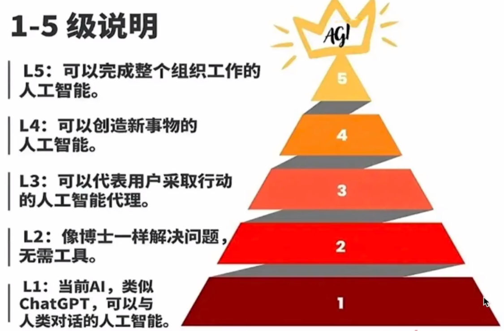
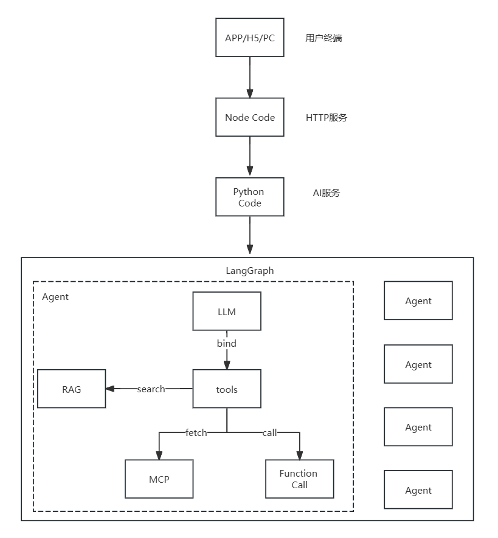

## 一、AI智能体介绍
### 1.1 什么是AI智能体?
> 智能体（AI Agents或Agents）是指能够自主感知环境、做出决策并执行行动的系统或程序。根据IBM的定义，智能体是“能够通过设计其工作流和利用可用工具，代表用户或其他系统自主执行任务的系统或程序”，英伟达则将智能体描述为“A1 智能体是先进的 A1 系统，旨在根据高级目标自主进行推理，制定计划并执行复杂任务。”，代表了“从简单自动化向能够管理复杂工作流的自主系统过渡”的演进方向。

| 公司 | 智能体产品 |
|---|---|
| OpenAI | https://openai.com/index/introducing-deep-research/ |
| Manus | https://manus.im/ |
| 沉思 | https://chatglm.cn/main/alltoolsdetail?lang=zh |

在更专业的学术定义中，百度百科指出:“智能体是指能够感知环境并自主采取行动以实现特定目标的实体。这一概念最早由“人工智能之父”马文·明斯基提出，他认为某些问题可经由社会中的一些个体经过协商后解决，这些个体就是智能体。”
智能体具有以下基本特征：
- **自主性**：智能体能够在没有人类或其他实体的直接干预下运行，并对其行动和内部状态具有某种9程度的控制。
- **反应性**：智能体能够感知其环境，并对环境变化做出实时响应。
- **交互性/社交性**: 智能体能够与其他智能体或人类进行交互和协作。
- **适应性/主动性**: 智能体能够根据环境变化主动调整其行为策略，适应新的情况。
- **学习能力**: 许多智能体具有通过经验或数据学习和改进的能力。

### 1.2 智能体和模型、大模型的区别
| 名词 | 核心概念 |
|---|---|
|  AI  | 人工智能(AI)是计算机科学的一个分支学科 |
|  模型  | 1、AI系统的核心算法组件，通过从数据中学习规律和模式来实现特定功能。2、常见模型如:预测模型(分类、回归)，生成模型(文本、图像生成)等。3、模型是无实体的工具，不具有自主性 |
|  大模型 |  1、模型的特殊形态，以参数规模巨大(达到百亿、千亿甚至万亿)为显著特征。2、主要用来处理复杂任务和复杂推理，对人类指令有很强的遵循能力 |
|  智能体 | 1、能够感知环境、自主决策并执行行动以实现特定目标的实体或系统。2、智能体是AI技术落地的系统级应用形式。3、能够形成完整的“感知 决策 行动”闭环  |

### 1.3 智能体的类型
- **自主智能体：** 自主智能体是一种能够在没有人类干预的情况下，自主执行任务、做出决策和与环境互动的智能系统。它们具有高度的自主性，能够独立地感知环境、做出决策并执行行动，而不需要外部的控制和干预。
- **反应智能体：** 反应智能体主要关注对环境变化的实时响应。使用简单反射模型，根据当前感知做出决策，而不需要复杂的内部状 自态或长期规划。

## 二、智能体的发展阶段
> OpenAI根据自身技术研发与产品开发提出了通往AGI的五级量表，将A1Agent分为五个阶段，每个阶段代表更高级的能力水平:
- **第1级:聊天机器人** - 具有对话语言技能
- **第2级:实用工具** - 能够执行具体任务
- **第3级:专家助手** - 具有特定领域的专业知识
- **第4级:团队合作者** - 能够与人类团队协作
- **第5级:通用人工智能(AGI)** - 具有与人类相当或超越人类的通用智能

## 三、智能体的应用
> 工业自动化: 在工业领域，智能体被用于:(1)自动化生产线监控和优化  (2)仓储和物流自动化  (3)质量控制和检测

> 服务业: 在服务业，智能体的应用包括：(1)智能客服和客户支持  (2)个性化推荐系统  (3)智能健康管理  (4)智能金融分析和风险管理

> 医疗健康: 在医疗健康领域，智能体被用于: (1)医学影像辅助诊断  (2) 病人监测和远程医疗  (3)药物研发和临床试验优化  (4)个性化治疗方案设计

> 教育: 在教育领域，智能体的应用包括: (1) 个性化学习推荐系统  (2) 智能教学助手  (3) 学习评估和反馈系统 (4)虚拟教育助手

> 娱乐与创意: 在娱乐与创意领域，智能体被用于: (1) 智能内容创作和推荐  (2) 游戏Al和虎拟对手  (3) 数字助手和创意辅助工具  (4) 虚拟主播和内容生成

## 四、智能体的技术架构
