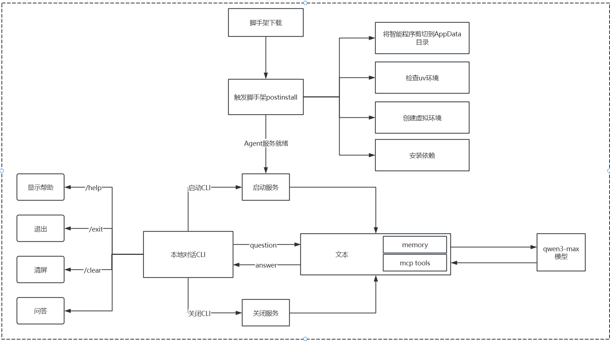

## 一、我为什么要做 `CLI Agent`
**前端工作天然围绕 `CLI`**
你每天都在用：
- `pnpm`/`npm`/`yarn`
- `git`
- `eslint`/`stylelint`
- `vite`/`webpack`
....
这些工具本质上都在命令行里。
`Agent` 放在 `CLI` 里，离“真实工作入口”最近，能直接调工具、拿结果、再下一步。

**只有 CLI 才能形成可执行闭环**
网页对话再聪明，很多时候也只能“给建议”。
而 `CLI Agent` 可以：
- 读你当前目录的文件/配置。
- 运行命令得到真实输出。
- 生成补丁。
- 复跑命令验证。
建议 -> 执行 -> 验证 -> 交付

## 二、命令行 `Agent` 的工程化实践（完整的历程）
### 2.1 本地推理（`CLI` ↔ 本地 `LLM` 服务）
**阶段一的架构图**

这张图描述的第一阶段最小闭环架构，核心点可以这样简述：
- 入口是本地对话 `CLI`，用户在命令行里输入内容。
- `CLI` 支持几类内置指令，不走模型：
  - `/help` 显示帮助
  - `/exit` 退出程序
  - `/clear` 清屏
  - 其他普通输入走“问答”
- 问答主链路：
  - 1、用户输入问题（`question`）
  - 2、`CLI`把问题请求发给本地服务。
  - 3、本地服务再调起 `qwen3-max 模型` （推理/生成）
  - 4、模型返回结果给本地服务
  - 5、本地服务把答案（`answer`）回传给 `CLI`
  - 6、`CLI` 展示给用户（通常支持流式打印）

一句话总结：**CLI 负责交互与展示，本地服务负责转发与编排，模型负责生成答案；所有能力都在本机闭环，不涉及远端部署与本地工具执行。**

**弊端：**
- **不可分发 / 不易交付**：
  - 你的 CLI 脚手架即使发布出去了，用户机器上还得“额外”自己把本地 LLM 服务跑起来（甚至还要装模型/依赖）。
  - 结果就是：**CLI 可装 ≠ 能用** 一换机器/换同事就很容易卡在环境上。
- **能力边界：更像“本地聊天”，难以工程化成平台**:
  - 第一阶段的定位更像“本地问答工具”，还没进入“统一治理、统一观测、统一权限”的平台化形态。

因此自然演进到第二阶段：**把 `LLM` 服务上云/远端化**。

### 2.2 `CLI` + 远程 `LLM` 服务（工程化发布）
**阶段二的架构图**

这张图描述的是 **第二阶段（CLI + 远程 LLM 服务）** 的架构，核心链路可以这样简述：
- 本地对话 `CLI` 仍然是入口：用户在命令行输入问题；`/help`、`/exit`、`/clear` 这类指令依旧由 `CLI` 本地处理，不走模型。
- 问答主链路从“本地服务”变成“远程服务”：
  - 1、`CLI` 将用户的 `question` 请求发到 远程 `LLM` 服务
  - 2、远程服务再去调用 `qwen3-max` 模型 完成推理生成
  - 3、模型返回结果给远程服务
  - 4、远程服务将 `answer` 回传给 `CLI`，`CLI` 负责展示（可流式）
- 新增 `CI/CD` 部署链路（工程化关键）：
  - 本地代码 `git push` → 触发 `GitHub Actions` → 自动部署/更新 远程 `LLM` 服务（确保服务端版本可持续迭代、稳定交付）。

一句话总结：**第二阶段把“LLM 服务”集中到远端统一部署与升级，CLI 负责交互，远程服务负责调用模型并返回答案，同时用 GitHub Actions 实现自动化交付。**

**弊端：**
- 远端服务“看不到你的本地环境”，做不了真正的工程动作
  - 远端 `LLM` 服务拿不到你本机的：
    - 代码仓库文件、`git` 状态、分支差异
    - 本地依赖环境（`node/python` 版本、`pnpm` 缓存）
    - 终端命令执行能力（`npm install`、`lint`、`build`、`test`）
  - 所以它最多是“给建议/生成代码片段”，很难闭环（无法执行 → 无法验证 → 无法迭代修复）。
- 工具调用能力受限：远端不适合直接执行高权限操作
  - 你可以在远端做工具，但会遇到：
    - 权限与安全风险（远端执行 rm、读写文件、访问内网）
    - 环境不一致（远端执行结果不等于本地）
    - 成本高（为每个用户准备隔离环境/容器很重）
  - 结论：远端更适合“大脑”，不适合当“手脚”。
- 强依赖于网络
  - 一旦服务端挂了，所有 CLI 用户都不可用。
- “记忆/会话”变成后端工程问题

**阶段二解决了分发与部署，但因为推理在远端、执行在本地，导致“远端无法使用本地工具与上下文”，系统仍停留在“远程问答”，离“能干活的 `Agent`”还有关键一步——把“工具执行”下沉到本地，进入阶段三：`CLI` + 本地智能体服务 + `MCP`。**

### 2.3 `CLI` + 本地智能体服务 + `MCP Server`
**阶段三的架构图**

这张图描述的是 **阶段三：CLI + 本地智能体服务 + MCP Server** 的架构，核心链路可以这样简述：
- 安装（让本地 `Agent` 可用）
  - 用户下载脚手架后，会触发 `postinstall`：
    - 把智能体程序剪切/落盘到 `AppData` 目录（做成常驻的本地运行时）
    - 检查 `uv` 环境
    - 创建 `Python` 虚拟环境
    - 安装依赖
  - 最终结果：`Agent` 服务就绪（本地具备可运行的智能体运行时）
- 运行时链路（`CLI` 驾驶舱 ↔ 本地 `Agent`）
  - 用户启动 `CLI`：
    - `CLI` 仍支持 `/help`、`/exit`、`/clear` 等本地命令
    - 另外在你的图里：启动 `CLI` 会触发“启动服务”（确保本地 `Agent` 在跑）
  - 问答时：
    - `CLI` 把 `question` 发给本地 `Agent` 服务
    - `Agent` 内部不再只是“转发模型”，而是具备：
      - `memory`（记忆/会话状态）
      - `mcp tools`（工具系统，通过 `MCP Server` 暴露）
    - `Agent` 在需要时调用 `qwen3-max` 做推理，同时可以调用 `MCP` 工具完成“行动”，最后把 `answer` 返回给 `CLI`
- 关闭链路（资源与进程治理）
  - 关闭 CLI 时，会走“关闭服务”（或至少触发服务退出/清理策略），避免后台残留、端口占用、进程泄露。

一句话总结：**阶段三把“推理”和“执行”从远端拉回本机：CLI 负责交互，本地 Agent 负责记忆与工具编排，MCP Server 提供标准化工具能力，模型负责规划与生成——最终实现了“能做事”的闭环智能体。**