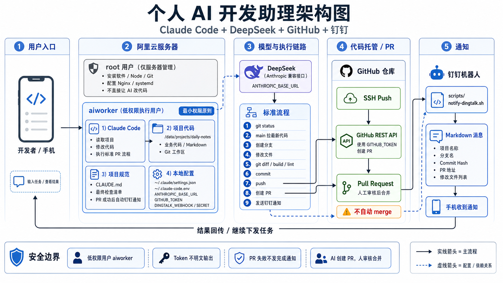

> 从 0 到跑通完整闭环的实战记录：让 Claude Code 在阿里云服务器上帮我完成个人项目开发，并在创建 PR 后自动通过钉钉通知我。

## 一、为什么要做这个项目？

最近我一直在思考一个问题：

> 能不能让一台阿里云服务器 24 小时替我工作？

我只需要下发需求，AI 自动修改代码、提交代码、创建 PR，最后把结果发到我手机上。

一开始这个想法看起来很简单：服务器上安装 `Claude Code`，连接 `DeepSeek` 模型，然后让它帮我写代码就行。
但真正落地后会发现，事情没有这么简单。
因为这里涉及的不只是“AI 能不能写代码”，而是一个完整工程闭环：

```txt
输入需求
  ↓
Claude Code 读取项目
  ↓
修改代码 / 文档
  ↓
commit
  ↓
push 到 GitHub
  ↓
通过 GitHub API 创建 PR
  ↓
钉钉机器人通知手机
  ↓
人工审核 PR 后合并
```

这套流程的目标不是让 `AI` 直接替我上线，而是让 `AI` 在一个安全、可审计、可回滚的边界内工作。

我最终跑通的架构如下：



这套方案的核心原则有四个：

- `AI` 不直接使用 `root` 用户。
- `AI` 只在项目目录内工作。
- `AI` 可以创建 `PR`，但不自动 `merge`。
- 任务完成后必须通知到手机。

## 二、整体架构说明

最终架构可以拆成五层：

```txt
用户入口
  ↓
阿里云服务器
  ↓
Claude Code + DeepSeek
  ↓
GitHub PR 流程
  ↓
钉钉通知
```

### 1. 用户入口

目前第一阶段还不是通过手机直接发任务，而是在服务器终端里使用 `Claude Code`。
后续可以演进成：

```txt
手机 / 钉钉 / OpenClaw / Web 页面
  ↓
任务服务
  ↓
Claude Code 自动执行
```

但这一篇先不做复杂入口，先把最小闭环跑通。

### 2. 阿里云服务器

服务器上有两个角色：

- `root` 用户：只负责服务器管理
- `aiworker` 用户：专门给 `AI` 执行任务

`root` 负责：

- 安装 `Node / Git`
- 配置环境
- 管理服务器

`aiworker` 负责：

- 运行 `Claude Code`
- 读取项目
- 修改代码
- 执行 `Git` 流程
- 触发钉钉通知

**这一步非常关键。不要让 Claude Code 长期用 root 用户工作。**

### 3. Claude Code + DeepSeek

`Claude Code` 负责读项目、改代码、执行命令。
`DeepSeek` 通过 `Anthropic` 兼容接口接入 `Claude Code`。

环境变量类似：

```bash
ANTHROPIC_BASE_URL="https://api.deepseek.com/anthropic"
ANTHROPIC_AUTH_TOKEN="你的 DeepSeek Key"
```

注意：真实 `key` 不要写进项目代码，也不要提交到 `Git`。

### 4. GitHub PR 流程

`GitHub` 分成两条链路：

- 代码推送：`SSH Push`
- 创建 `PR`：`GitHub REST API` + `GITHUB_TOKEN`

**为什么不直接用 gh CLI？**

因为服务器访问 `GitHub` 经常不稳定，安装 `gh CLI` 也可能卡住。更稳定的方式是：`git push` 走 `SSH`，创建 `PR` 走 `GitHub API`。

### 5. 钉钉通知

`PR` 创建成功后，调用：

```bash
scripts/notify-dingtalk.sh
```

通知内容包括：

- 项目名称
- 分支名
- `Commit Hash`
- `Push` 状态
- `PR` 地址
- 修改文件列表

这样手机上就能收到完整结果。

## 三、第一步：创建低权限用户 aiworker

**最开始我有一个疑问：既然服务器是我自己的，那能不能直接用 root 用户让 Claude Code 操作？**

答案是：不应该。

`AI` 后续会执行命令、修改文件、安装依赖。如果它拿的是 `root` 权限，一旦误操作，影响范围就是整台服务器。

比如：

- `rm -rf /*`
- `chmod -R 777 /`
- 修改 `/etc/nginx`
- 覆盖 `systemd` 配置
- 读取 `root` 私钥

这些风险没必要暴露给 AI。正确做法是创建一个专门的低权限用户。

```bash
useradd aiworker
passwd aiworker
```

然后创建统一项目目录：

```bash
mkdir -p /data/projects
chown -R aiworker:aiworker /data/projects
```

以后项目都放在：

```bash
/data/projects
```

切换用户：

```bash
su - aiworker
```

确认当前用户：

```bash
whoami
```

应该输出：

```bash
aiworker
```

这一节的核心边界是：

- `root` 负责管服务器
- `aiworker` 负责让 `AI` 干活

这一步不是形式主义，而是整个系统的安全基础。

## 四、第二步：配置 Claude Code 权限边界

`Claude Code` 有权限管理机制。

常见权限可以理解为：

- `Allow`：自动允许
- `Ask`：每次询问
- `Deny`：禁止

一开始我想让 `Claude Code` 自动执行，不想每一步都确认。但这里不能无脑放权。

正确思路是：

- 低风险操作放 `Allow`
- 中风险操作放 `Ask`
- 高风险操作放 `Deny`

推荐配置如下：

#### Allow

适合自动放行：

```bash
Read
Edit
Glob
Grep
LS
Bash(git status:*)
Bash(git branch:*)
Bash(git diff:*)
Bash(git log:*)
Bash(git checkout -b:*)
Bash(git switch -c:*)
Bash(npm run build:*)
Bash(npm run lint:*)
Bash(npm test:*)
```

这些属于读文件、改项目文件、查看 Git 状态、执行检查命令。

#### Ask

需要人工确认：

```bash
Bash(git commit:*)
Bash(git push:*)
Bash(npm install:*)
Bash(pnpm install:*)
Bash(docker:*)
```

这些操作会改变仓库状态、安装依赖或影响环境，建议先保留确认。

#### Deny

必须禁止：

```bash
Bash(sudo:*)
Bash(rm -rf:*)
Bash(chmod:*)
Bash(chown:*)
Bash(systemctl:*)
Bash(git reset:*)
Bash(git clean:*)
```

尤其不要加：

```bash
Bash(*)
```

这等于让 `Claude Code` 什么命令都能自动执行，风险太高。

这一节的核心不是“怎么让 AI 权限最大”，而是：

> 怎么让 AI 在清晰边界内自动工作。

## 五、第三步：将权限规则写入 Claude 配置文件

只在界面里点权限还不够，因为每次新会话都可能重新确认。更好的方式是写入 `Claude Code` 配置文件。

在 `aiworker` 用户下创建：

```bash
mkdir -p ~/.claude
vim ~/.claude/settings.json
```

示例配置：

```json
{
    "permissions": {
        "defaultMode": "acceptEdits",
        "allow": [
            "Read",
            "Edit",
            "Glob",
            "Grep",
            "LS",
            "Bash(git status:*)",
            "Bash(git branch:*)",
            "Bash(git diff:*)",
            "Bash(git log:*)",
            "Bash(git checkout -b:*)",
            "Bash(git switch -c:*)",
            "Bash(npm run build:*)",
            "Bash(npm run lint:*)",
            "Bash(npm test:*)"
        ],
        "ask": [
            "Bash(git commit:*)",
            "Bash(git push:*)",
            "Bash(npm install:*)",
            "Bash(pnpm install:*)",
            "Bash(docker:*)"
        ],
        "deny": [
            "Bash(sudo:*)",
            "Bash(rm -rf:*)",
            "Bash(chmod:*)",
            "Bash(chown:*)",
            "Bash(systemctl:*)",
            "Bash(git reset:*)",
            "Bash(git clean:*)"
        ]
    }
}
```

这里有一个重要点：

- 权限规则可以写进 `settings.json`
- 密钥不要写进 `settings.json`
- 密钥应该放到环境变量或独立 `env` 文件里。

## 六、第四步：打通服务器与 GitHub

`Claude Code` 修改代码后，必须能把代码推送到 `GitHub`。
一开始我使用 `HTTPS`，结果经常遇到：

```bash
Failed to connect to github.com port 443
```

或者：

```bash
RPC failed early EOF fetch-pack: invalid index-pack output
```

这类问题本质是服务器访问 `GitHub` 不稳定。
最终更稳定的方案是：使用 `SSH`。

### 1. 生成 SSH Key

在 `aiworker` 用户下执行：

```bash
ssh-keygen -t ed25519 -C "donglisuccess@users.noreply.github.com" -f ~/.ssh/id_ed25519 -N ""
```

查看公钥：

```bash
cat ~/.ssh/id_ed25519.pub
```

然后把公钥添加到 `GitHub`：

```bash
GitHub → Settings → SSH and GPG keys → New SSH key
```

### 2. 切换 remote 为 SSH

```bash
git remote set-url origin git@github.com:donglisuccess/daily-notes.git
```

验证：

```bash
git remote -v
```

应该看到：

```bash
origin git@github.com:donglisuccess/daily-notes.git (fetch)
origin git@github.com:donglisuccess/daily-notes.git (push)
```

### 3. 测试 SSH

```bash
ssh -T git@github.com
```

如果出现类似：

```bash
Hi donglisuccess! You've successfully authenticated
```

说明 `SSH` 链路已经打通。

最终这个阶段完成的是：

```txt
阿里云服务器 aiworker
  ↓
GitHub SSH
  ↓
git push 成功
```

## 七、第五步：GitHub Token 创建 PR

`push` 成功后，还需要自动创建 `PR`。

这里有两种方式：

```txt
gh CLI
GitHub REST API
```

我没有选择 `gh CLI`，而是使用:

```txt
GITHUB_TOKEN + GitHub REST API
```

原因是：

- 服务器上安装 gh CLI 可能失败
- gh auth login 也多一步
- API 更直接、更容易固化进流程

#### 推荐 Token 类型

```txt
不要使用 classic token 的 repo 全权限作为默认方案。
```

推荐使用：

```txt
Fine-grained personal access token
```

只授权当前仓库：

```txt
Repository access：Only select repositories
Selected repositories：daily-notes
```

权限只给：

```txt
Contents：Read and write
Pull requests：Read and write
Metadata：Read-only
```

#### 创建 PR 的 API

```bash
curl -s -X POST "https://api.github.com/repos/donglisuccess/daily-notes/pulls" \
  -H "Accept: application/vnd.github+json" \
  -H "Authorization: Bearer $GITHUB_TOKEN" \
  -H "X-GitHub-Api-Version: 2022-11-28" \
  -d '{
    "title": "docs: update Claude Code assistant workflow",
    "head": "docs/update-claude-workflow",
    "base": "main",
    "body": "## Summary\n\n- 更新 Claude Code 工作流规范\n\n## Check\n\n- 已查看 git diff\n- 已 push 到 GitHub"
  }'
```

如果返回 PR 地址，就说明 PR 创建成功。

**需要注意：**

- `GITHUB_TOKEN` 不要打印
- 不要写进项目文件
- 不要写进 `Markdown`
- 不要写进 `PR body`
- 不要发到聊天对话中

## 八、第六步：安全加固：重建泄露 Token 与统一 env 文件

我在实操过程中踩了一个坑：把 `GitHub Token` 明文发了出来。这时应该怎么处理？

> 答案是：立即视为泄露。

正确动作：

- 删除旧 `token`
- 重新创建 `Fine-grained Token`
- 替换服务器环境变量

不要侥幸继续使用旧 `token`。

#### 统一 env 文件

刚开始我把变量散落在 `~/.bashrc` 中，后面会越来越乱。
更好的做法是创建统一 `env` 文件：

```bash
vim ~/.claude-code.env
```

内容示例：

```bash
GITHUB_TOKEN="你的 GitHub Token"
DINGTALK_WEBHOOK="你的钉钉 Webhook"
DINGTALK_SECRET="你的钉钉 Secret"
ANTHROPIC_BASE_URL="https://api.deepseek.com/anthropic"
ANTHROPIC_AUTH_TOKEN="你的 DeepSeek Key"
```

设置权限：

```bash
chmod 600 ~/.claude-code.env
```

然后在 `~/.bashrc` 里加载：

```bash
if [ -f ~/.claude-code.env ]; then
    set -a
    source ~/.claude-code.env
    set +a
fi
```

生效：

```bash
source ~/.bashrc
```

验证变量是否存在，不要使用：

```bash
echo $GITHUB_TOKEN
```

应该使用：

```bash
test -n "$GITHUB_TOKEN" && echo "GITHUB_TOKEN exists"
```

这里我还踩了一个小坑，我直接在终端输入了：

```bash
$GITHUB_TOKEN
```

Shell 会把变量展开成 token，然后尝试把 token 当命令执行，于是报：

```bash
command not found
```

这不是变量没生效，而是用法错了。正确理解是：

```bash
$GITHUB_TOKEN 是变量引用，不是命令。
```

## 九、第七步：用 CLAUDE.md 固化项目工作流

一开始我每次都要对 `Claude Code` 说很长一段：

```txt
从 main 分支上重新新建一个分支
然后删除某篇文章
然后提交代码到 GitHub 上
然后创建 PR
最后通知我。
```

这很冗余。
解决方式是：把固定流程沉淀到项目根目录的 `CLAUDE.md`。

#### CLAUDE.md 是什么？

它不是临时提示词，而是项目级长期规则文件。
它的作用是告诉 Claude Code：

```txt
在这个项目里，你默认应该怎么工作。
```

#### CLAUDE.md 应包含的内容

```txt
- 默认工作流
- 分支命名规范
- commit message 规范
- GitHub PR
- 创建规范
- 钉钉通知规范
- 最终检查清单
- 安全边界
```

比如默认工作流：

```txt
git status
git checkout main
git pull origin main
git checkout -b docs/xxx
```

完成修改：

```txt
git diff
commit
push
使用 GITHUB_TOKEN 创建 PR
PR 成功后发送钉钉通知
输出最终总结
```

#### 标准 PR 流程

```txt
修改文件
 ↓
git status / git diff
 ↓
commit
 ↓
push
 ↓
GitHub API 创建 PR
 ↓
钉钉通知
```

#### 安全边界

`CLAUDE.md` 里必须写清楚：

```txt
禁止 sudo
禁止 rm -rf
禁止 git reset
禁止 git clean
禁止 push --force
禁止输出 token
禁止修改系统目录
```

这一步的核心价值是：

> 不要每次重复提示词，而是把重复流程变成项目规则。

## 十、第八步：接入钉钉机器人通知

当 `PR` 创建成功后，我希望手机能收到消息
一开始我考虑企业微信机器人，后来换成了钉钉机器人。
最终流程是：

```txt
PR 创建成功
  ↓
调用 scripts/notify-dingtalk.sh
  ↓
钉钉机器人发送 Markdown 消息
  ↓
手机收到通知
```

### 1. 钉钉环境变量

在 `~/.claude-code.env` 中配置：

```bash
DINGTALK_WEBHOOK="你的钉钉机器人 Webhook"
DINGTALK_SECRET="你的钉钉机器人加签 Secret"
```

注意：

> `DINGTALK_SECRET` 是 `SEC` 开头的加签密钥，不是 webhook 里的 `access_token`

### 2. 通知脚本

```bash
scripts/notify-dingtalk.sh
```

脚本内容：

```bash
#!/usr/bin/env bash
set -euo pipefail

TITLE="${1:-Claude Code 任务通知}"
PROJECT="${2:-daily-notes}"
BRANCH="${3:-unknown}"
COMMIT_HASH="${4:-unknown}"
PUSH_STATUS="${5:-成功}"
PR_URL="${6:-}"
FILES="${7:-未提供修改文件列表}"

if [ -z "${DINGTALK_WEBHOOK:-}" ]; then
  echo "DINGTALK_WEBHOOK missing"
  exit 1
fi

if [ -z "${DINGTALK_SECRET:-}" ]; then
  echo "DINGTALK_SECRET missing"
  exit 1
fi

TIMESTAMP="$(date +%s%3N)"
export TIMESTAMP

SIGN="$(python3 - <<'PY'
import hmac
import hashlib
import base64
import urllib.parse
import os

timestamp = os.environ["TIMESTAMP"]
secret = os.environ["DINGTALK_SECRET"]

string_to_sign = f"{timestamp}\n{secret}"
hmac_code = hmac.new(
    secret.encode("utf-8"),
    string_to_sign.encode("utf-8"),
    digestmod=hashlib.sha256
).digest()

sign = urllib.parse.quote_plus(base64.b64encode(hmac_code).decode("utf-8"))
print(sign)
PY
)"

URL="${DINGTALK_WEBHOOK}&timestamp=${TIMESTAMP}&sign=${SIGN}"

if [ -n "$PR_URL" ]; then
  PR_LINE="[点击查看 PR](${PR_URL})"
else
  PR_LINE="未提供 PR 地址"
fi

MARKDOWN_CONTENT="## ✅ ${TITLE}

---

**项目：** ${PROJECT}
**分支：** \`${BRANCH}\`
**Commit：** \`${COMMIT_HASH}\`
**Push：** ✅ ${PUSH_STATUS}

**PR：** ${PR_LINE}

### 修改文件

${FILES}

---

> Claude Code 自动通知"

python3 - <<PY | curl -s "$URL" -H 'Content-Type: application/json' -d @-
import json

payload = {
    "msgtype": "markdown",
    "markdown": {
        "title": "${TITLE}",
        "text": """${MARKDOWN_CONTENT}"""
    }
}

print(json.dumps(payload, ensure_ascii=False))
PY

echo
```

脚本的核心流程：

```txt
读取参数
  ↓
检查 DINGTALK_WEBHOOK 和 DINGTALK_SECRET
  ↓
生成 timestamp
  ↓
用 secret 计算钉钉签名
  ↓
拼接钉钉机器人 URL
  ↓
组装 Markdown 消息
  ↓
curl 发送到钉钉群
```

## 十一、第九步：让 PR 成功后自动触发钉钉通知

最后一步，是把通知触发条件写进 `CLAUDE.md`：

```txt
只有 PR 创建成功后，才发送钉钉任务完成通知。
```

触发条件必须明确：

```txt
commit 成功
push 成功
PR 创建成功
拿到真实 PR URL
scripts/notify-dingtalk.sh 存在
DINGTALK_WEBHOOK 存在
DINGTALK_SECRET 存在
```

如果 PR 创建失败：

```txt
不发送“任务完成”通知
```

如果钉钉通知失败：

```txt
不影响 commit、push、PR 主流程 只在最终总结中标记：钉钉通知失败
```

## 十二、最终检查清单

为了防止 Claude Code 做完后只说“完成了”，我又在 CLAUDE.md 中补了一个最终检查清单。
每次任务完成后，必须输出：

- 是否只修改了任务相关文件
- 是否执行了 `git status`
- 是否执行了 `git diff`
- 是否执行了 `build / lint / test`
- 是否 `commit` 成功
- 是否 `push` 成功
- 是否创建 `PR` 成功
- 是否发送钉钉通知成功
- 是否存在需要人工确认的风险点

输出格式类似：

| 检查项 | 状态 | 说明 |
| --- | --- | --- |
| 只修改相关文件 | ✅ | 只修改了 CLAUDE.md |
| git status | ✅ | 已检查 |
| git diff | ✅ | 已检查 |
| build/lint/test | 未执行 | 文档修改，无需执行 |
| commit | ✅ | 已提交 |
| push | ✅ | 已推送 |
| PR | ✅ | 已创建 |
| 钉钉通知 | ✅ | 已发送 |
| 风险点 | 无 | 无需额外处理 |

这个清单非常重要。

因为你不能只相信 AI 说“完成了”，你要让它告诉你：

- 完成了什么
- 检查了什么
- 哪里没做
- 哪里需要人工确认
