## 一、 Matplotlib 是什么？
`Matplotlib` 是 `Python` 最经典的画图库，常用于：
- 折线图
- 柱状图
- 散点图
- 饼图
- 直方图
- 多图组合
- 图片保存
- 数据分析可视化
你作为前端，可以这样类比：

| 前端世界                 | `Python Matplotlib`  |
| -------------------- | ------------------ |
| `DOM` 容器               | `Figure`             |
| `canvas` / `svg` 区域      | `Axes`               |
| `ECharts option`       | `plt` 的各种配置          |
| `series` 数据            | `x、y` 数据             |
| `tooltip`/`legend`/`title` | `legend`/`title`/`label` |

`Matplotlib` 里最重要的两个概念：
```python
Figure：整张画布
Axes：画布里的一个图表区域
```
注意，`Axes` 不是 `x` 轴和 `y` 轴，而是一整个坐标系区域。
## 二、Jupyter 里先这样导入
安装：
```python
!pip install matplotlib
```
导入：
```python
import matplotlib.pyplot as plt
```

## 三、第一个图：折线图
```python
import matplotlib.pyplot as plt

x = [1, 2, 3, 4, 5]
y = [2, 4, 6, 8, 10]

plt.plot(x, y)
plt.show()
```
你可以理解成前端里：
```javascript
series: [
  {
    type: 'line',
    data: [2, 4, 6, 8, 10]
  }
]
```
区别是 `Matplotlib` 更直接：你把 `x` 和 `y` 传进去，它就画。
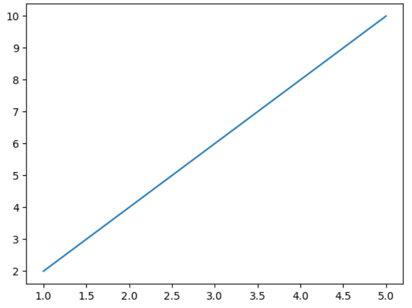
## 四、给图加标题、坐标轴名称
```python
x = [1, 2, 3, 4, 5]
y = [2, 4, 6, 8, 10]

plt.plot(x, y)

plt.title("Simple Line Chart")
plt.xlabel("X Axis")
plt.ylabel("Y Axis")

plt.show()
```
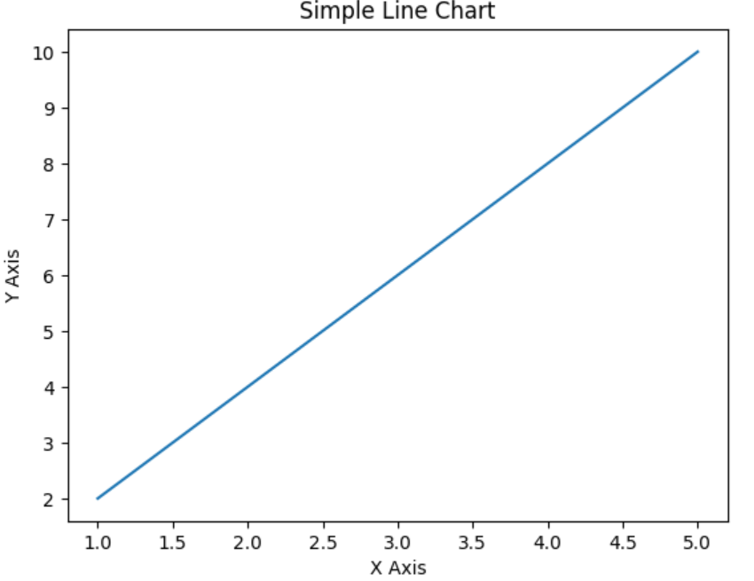
这几个非常常用：
```python
plt.title()
plt.xlabel()
plt.ylabel()
```
## 五、改线条样式：颜色、线型、点
```python
x = [1, 2, 3, 4, 5]
y = [2, 5, 3, 8, 7]

plt.plot(
    x,
    y,
    color="red",
    linestyle="--",
    marker="o"
)

plt.title("Line Style Demo")
plt.show()
```
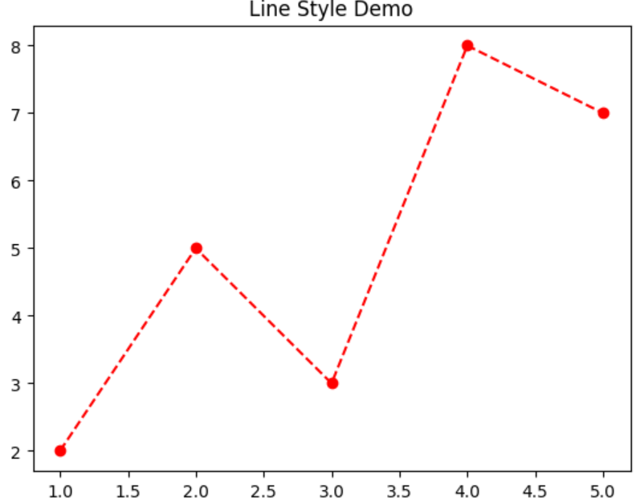
解释一下：
```python
color="red"        # 线条颜色
linestyle="--"     # 虚线
marker="o"         # 每个点显示圆点
```
常见 `marker`：
```python
"o"  # 圆点
"s"  # 方块
"^"  # 三角形
"x"  # 叉号
```
常见 `linestyle`：
```python
"-"   # 实线
"--"  # 虚线
":"   # 点线
"-."  # 点划线
```
这个阶段你要记住一句话：
`Matplotlib` 很多配置都不是难，是名字比较零散。你不用背，先会查、会改、会看效果。
## 六、画多条线：对比数据
```python
days = [1, 2, 3, 4, 5]

product_a = [100, 120, 150, 130, 170]
product_b = [80, 90, 110, 160, 200]

plt.plot(days, product_a, marker="o", label="Product A")
plt.plot(days, product_b, marker="s", label="Product B")

plt.title("Product Visit Trend")
plt.xlabel("Day")
plt.ylabel("Visits")

plt.legend()
plt.show()
```
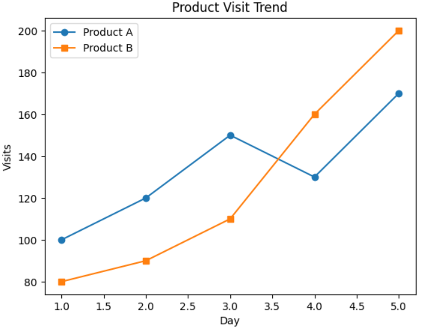
`label` 只是给线起名字，`plt.legend()` 才是把图例显示出来。
## 七、柱状图：适合对比分类数据
```python
names = ["Vue", "React", "Angular"]
values = [80, 120, 40]

plt.bar(names, values)

plt.title("Frontend Framework Popularity")
plt.xlabel("Framework")
plt.ylabel("Count")

plt.show()
```
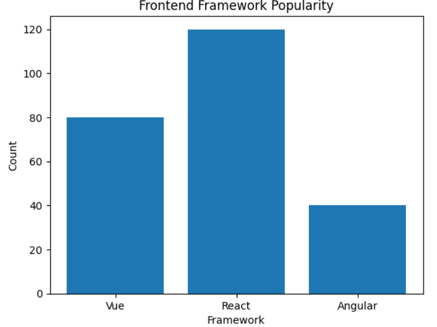
柱状图适合这种场景：
- 不同产品销量对比
- 不同城市用户数对比
- 不同框架使用量对比
- 不同月份收入对比
如果你用折线图画分类数据，也不是不行，但表达上没柱状图直接。
## 八、横向柱状图：标签太长时很好用
```python
frameworks = ["React", "Vue", "Angular", "Svelte"]
users = [120, 100, 50, 30]

plt.barh(frameworks, users)

plt.title("Framework Users")
plt.xlabel("Users")

plt.show()
```
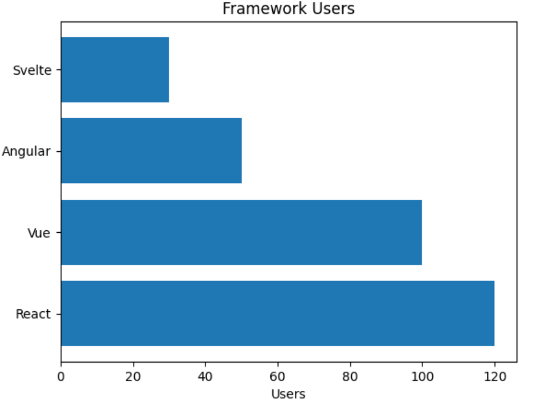
`barh` 里的 `h` 是 `horizontal`，横向。
当你的分类名称很长，比如：
```python
["AI Agent Platform", "Micro Frontend System", "Data Dashboard"]
```
用横向柱状图会更清晰。
## 九、散点图：看两个变量之间有没有关系
```python
study_hours = [1, 2, 3, 4, 5, 6, 7]
scores = [50, 55, 65, 70, 75, 85, 90]

plt.scatter(study_hours, scores)

plt.title("Study Hours vs Scores")
plt.xlabel("Study Hours")
plt.ylabel("Scores")

plt.show()
```
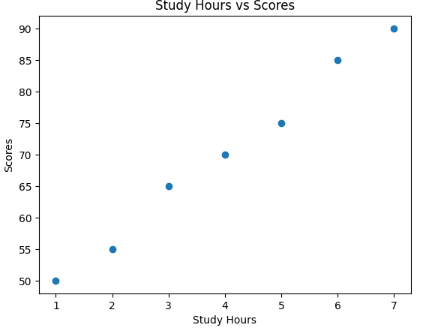
散点图适合看：
- 学习时间和成绩有没有关系。
- 广告投入和销售额有没有关系。
- 页面加载时间和转化率有没有关系。
- 用户停留时长和下单金额有没有关系。
你要形成一个判断：
> 折线图看趋势，柱状图看分类对比，散点图看关系。
这个比会背 `API` 重要得多。
## 十、直方图：看数据分布
比如一组用户年龄：
```python
ages = [18, 19, 20, 21, 21, 22, 23, 25, 25, 26, 28, 30, 31, 35, 40]

plt.hist(ages, bins=5)

plt.title("Age Distribution")
plt.xlabel("Age")
plt.ylabel("Count")

plt.show()
```
`bins=5` 的意思是把数据分成 `5` 个区间。
直方图和柱状图很容易混：
| 图表       | 用途     |
| -------- | ------ |
| 柱状图 bar  | 分类对比   |
| 直方图 hist | 连续数据分布 |
比如：
```python
["React", "Vue", "Angular"]
```
这是分类，用柱状图。
```python
[18, 19, 20, 21, 22, 25, 30]
```
这是连续数值，用直方图。
## 十一、饼图：能用，但别滥用
```python
labels = ["React", "Vue", "Angular"]
sizes = [50, 35, 15]

plt.pie(
    sizes,
    labels=labels,
    autopct="%1.1f%%"
)

plt.title("Framework Share")
plt.show()
```
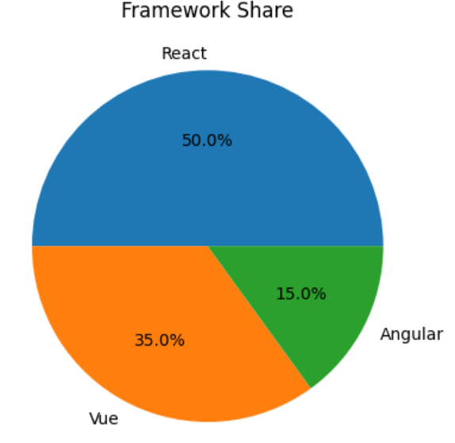
`autopct="%1.1f%%"` 表示显示百分比，保留一位小数。
但是我提醒你一句：饼图不要滥用。
如果分类超过 `5` 个，饼图会非常难看。很多时候柱状图比饼图更清晰。
## 十二、推荐你以后多用这种写法：面向对象写法
```python
plt.plot()
plt.title()
plt.show()
```
这叫 `pyplot` 写法，简单，但项目复杂后容易乱。
```python
import matplotlib.pyplot as plt

x = [1, 2, 3, 4, 5]
y = [2, 4, 6, 8, 10]

fig, ax = plt.subplots()

ax.plot(x, y)
ax.set_title("Line Chart")
ax.set_xlabel("X Axis")
ax.set_ylabel("Y Axis")

plt.show()
```
这里：
```python
fig, ax = plt.subplots()
```
可以理解为：
```javascript
const chart = echarts.init(dom)
```
`fig` 是整张画布，`ax` 是图表区域。
## 十三、多个子图：一张画布放多个图表
```python
fig, axes = plt.subplots(1, 2, figsize=(10, 4))

x = [1, 2, 3, 4, 5]
y1 = [2, 4, 6, 8, 10]
y2 = [10, 8, 6, 4, 2]

axes[0].plot(x, y1)
axes[0].set_title("Increasing")

axes[1].plot(x, y2)
axes[1].set_title("Decreasing")

plt.show()
```
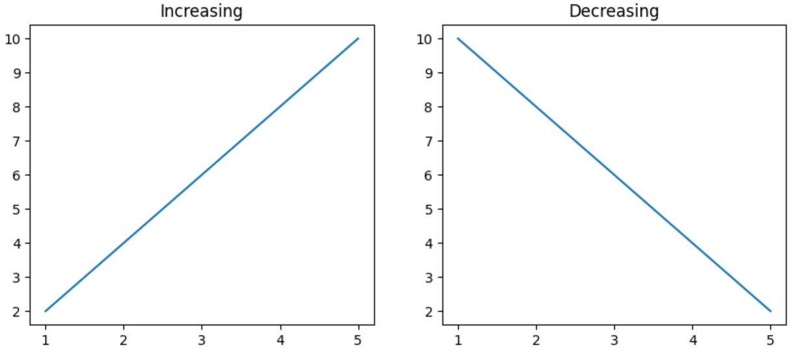
这句：
```python
plt.subplots(1, 2)
```
意思是：
```shell
1 行 2 列
```
如果写：
```python
plt.subplots(2, 2)
```
就是：
```shell
2 行 2 列
```
类比前端布局：
```css
display: grid;
grid-template-columns: repeat(2, 1fr);
```
## 十四、保存图片
```python
fig, ax = plt.subplots()

x = [1, 2, 3, 4, 5]
y = [3, 5, 7, 9, 11]

ax.plot(x, y)
ax.set_title("Save Figure Demo")

plt.savefig("chart.png", dpi=300, bbox_inches="tight")
plt.show()
```
常用参数：
```python
dpi=300              # 图片清晰度
bbox_inches="tight"  # 去掉多余白边
```
## 十五、一个接近真实业务的例子：用户增长趋势
```python
import matplotlib.pyplot as plt

days = ["Mon", "Tue", "Wed", "Thu", "Fri", "Sat", "Sun"]
new_users = [120, 150, 180, 170, 220, 300, 280]
active_users = [500, 520, 560, 540, 600, 680, 650]

fig, ax = plt.subplots(figsize=(8, 4))

ax.plot(days, new_users, marker="o", label="New Users")
ax.plot(days, active_users, marker="s", label="Active Users")

ax.set_title("Weekly User Growth")
ax.set_xlabel("Day")
ax.set_ylabel("Users")

ax.legend()

plt.show()
```
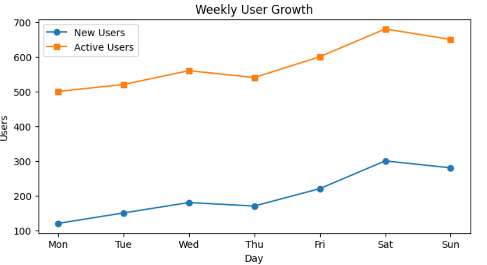
`New Users` 表示每日新增用户，`Active Users` 表示每日活跃用户。通过折线图可以快速看出周末用户活跃度明显提升。
## 十六、一个小项目：销售数据可视化
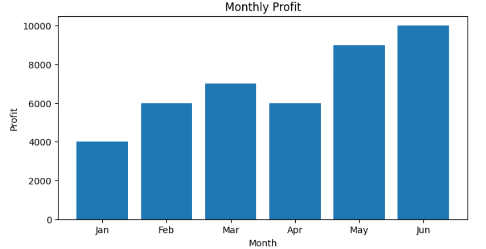
这段代码你要重点理解：
```python
profits.append(sales[i] - costs[i])
```
它不是 `Matplotlib` 的内容，而是 `Python` 基础逻辑：用销售额减成本，得到利润。
然后把利润交给 `Matplotlib` 画出来。
这是数据可视化的核心流程：
> 准备数据 -> 处理数据 -> 选择图表 -> 配置样式 -> 展示/保存
## 十七、你必须掌握的最小 API 集合
先别贪多，`Matplotlib` 你第一阶段只需要掌握这些：
```python
plt.plot()       # 折线图
plt.bar()        # 柱状图
plt.barh()       # 横向柱状图
plt.scatter()    # 散点图
plt.hist()       # 直方图
plt.pie()        # 饼图

plt.title()      # 标题
plt.xlabel()     # x 轴名称
plt.ylabel()     # y 轴名称
plt.legend()     # 图例
plt.show()       # 显示图表
plt.savefig()    # 保存图片
```
进阶一点就掌握：
```python
fig, ax = plt.subplots()
ax.plot()
ax.bar()
ax.set_title()
ax.set_xlabel()
ax.set_ylabel()
```
你的目标不是“背完 `Matplotlib`”，而是先具备这个能力，再慢慢深入。