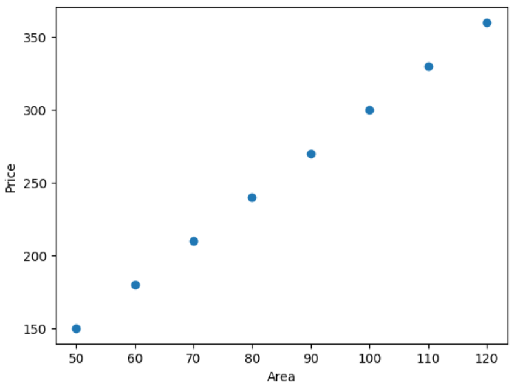
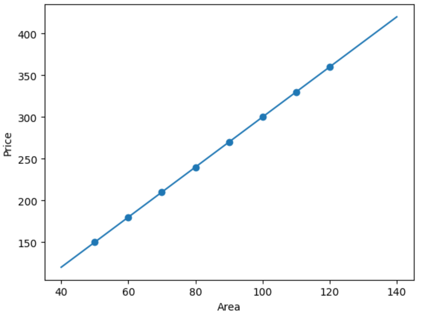
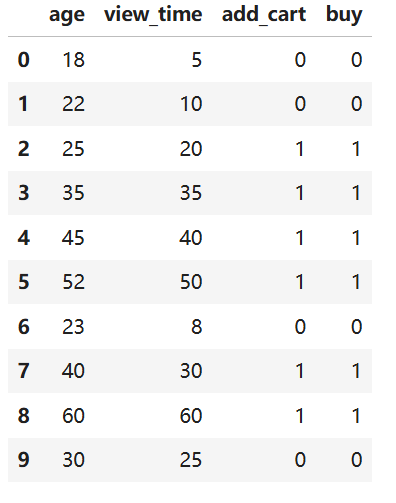

## 一、scikit-learn 到底是什么
你可以把 `scikit-learn` 理解成：
> 前端里的组件库 + 工具库，但它不是用来写页面，而是用来训练机器学习模型。

前端里你可能会这样想:
```javascript
const data = await fetchData()
const result = renderComponent(data)
```
机器学习里大概是这样：
```python
model.fit(X_train, y_train)
result = model.predict(X_test)
```
这里有三个关键词：
| 概念          | 前端类比          | 机器学习含义       |
| ----------- | ------------- | ------------ |
| `X`         | props / input | 输入特征         |
| `y`         | 目标结果          | 你希望模型学会预测的答案 |
| `model`     | 组件/函数         | 学习规律的模型      |
| `fit()`     | 初始化/训练        | 让模型学习        |
| `predict()` | 渲染/输出         | 让模型预测        |

`scikit-learn` 最常用的导入名不是 `scikit-learn`，而是：
```python
import sklearn
```
安装：
```shell
pip install scikit-learn
```
在 `Jupyter` 里可以这样测试：
```python
import sklearn

print(sklearn.__version__)
```
## 二、机器学习最小闭环
别急着学一堆术语。你先记住这条主线：
```shell
准备数据
  ↓
拆分训练集和测试集
  ↓
选择模型
  ↓
训练模型 fit
  ↓
预测 predict
  ↓
评估模型
```
这就是 `scikit-learn` 核心套路。

## 三、第一个例子：预测鸢尾花类型
`scikit-learn` 自带一些小数据集，非常适合入门。官方入门文档也强调它提供统一的 API 和常见机器学习流程。
我们先做一个分类任务：根据花瓣、花萼的长度和宽度，预测是哪一种鸢尾花。
### 1、加载数据
```python
from sklearn.datasets import load_iris

iris = load_iris()

X = iris.data
y = iris.target

print(X[:5])
print(y[:5])
print(iris.feature_names)
print(iris.target_names)
```
输出：
```shell
[[5.1 3.5 1.4 0.2]
 [4.9 3.  1.4 0.2]
 [4.7 3.2 1.3 0.2]
 [4.6 3.1 1.5 0.2]
 [5.  3.6 1.4 0.2]]
[0 0 0 0 0]
['sepal length (cm)', 'sepal width (cm)', 'petal length (cm)', 'petal width (cm)']
['setosa' 'versicolor' 'virginica']
```
你会看到：
```python
X = 特征数据
y = 标签结果
```
前端类比：
```javascript
const X = [
  { sepalLength: 5.1, sepalWidth: 3.5, petalLength: 1.4, petalWidth: 0.2 },
  ...
]

const y = ['setosa', 'versicolor', 'virginica']
```
只不过机器学习里，通常把数据转成数字矩阵。
### 2、拆分训练集和测试集
训练模型不能只看一份数据。否则就像你背答案，考试时换一道题就不会了。
```python
from sklearn.model_selection import train_test_split

X_train, X_test, y_train, y_test = train_test_split(
    X, 
    y, 
    test_size=0.2, 
    random_state=42
)

print(X_train.shape)
print(X_test.shape)
```
这段代码的作用是将你刚刚加载的鸢尾花数据集，按比例切分成“训练集”和“测试集”，并打印出切分后数据的形状（样本数量）。

在机器学习中，我们通常会把数据分成两部分：一部分用来让模型学习（训练集），另一部分用来考试，看看模型学得怎么样（测试集）。

#### 1. 导入切分工具
```python
from sklearn.model_selection import train_test_split
```
从 `scikit-learn` 库中导入专门用来切分数据集的函数 `train_test_split`。
#### 2. 执行切分操作
```python
X_train, X_test, y_train, y_test = train_test_split(X, y, test_size=0.2, random_state=42)
```
这是最核心的一步，它把原来的特征 `X` 和标签 `y` 同时打乱并切分，返回了4个新的数据：
- `X, y`：你传入的原始特征数据和标签数据。
- `test_size=0.2`：指定测试集占 20%，剩下的 80% 自动作为训练集。
- `random_state=42`： 随机数种子。因为切分数据是随机打乱的，设置一个固定的数字（比如42），可以保证你每次运行代码时，切分出来的结果都是完全一样的，方便复现。

返回的4个变量分别是：
- `X_train`：训练集的特征（用来教模型的数据）。
- `X_test`：测试集的特征（用来考模型的数据）。
- `y_train`：训练集的标签（训练数据对应的标准答案）。
- `y_test`：测试集的标签（测试数据对应的标准答案）。
#### 3. 打印数据形状
`print(X_train.shape)` 和 `print(X_test.shape)`
`.shape` 会返回数据的维度（行数，列数）。
结合你之前的鸢尾花数据（总共 150 个样本），因为设置了 `test_size=0.2`（即 20% 测试，80% 训练），所以打印出来的结果会是：
- `X_train.shape`：输出：`(120, 4)`代表训练集有 120 个样本，每个样本有 4 个特征。
- `X_test.shape`：输出：`(30, 4)`代表测试集有 30 个样本，每个样本有 4 个特征。
### 3、选择模型：KNN
`KNN` 的思想很朴素：
- 看离我最近的几个样本，它们大多数是什么类别，我就预测成什么类别。
```python
from sklearn.neighbors import KNeighborsClassifier

model = KNeighborsClassifier(n_neighbors=3)
```
#### 1、KNN 的核心思想：物以类聚，人以群分
`KNN` 的全称是 `K-Nearest Neighbors`，中文叫 K-近邻算法。它的思想非常朴素直观，完全符合我们日常的生活逻辑：
- 看邻居：当来了一个未知类别的新样本时，算法会去训练集中找离它“距离最近”的那几个样本（也就是它的邻居）。
- 少数服从多数：看看这几个邻居大多数属于什么类别，就认为这个新样本也属于什么类别。
#### 2、代码逐行拆解
```python
from sklearn.neighbors import KNeighborsClassifier
```
- 这行代码是从 `scikit-learn（sklearn）`机器学习库的 `neighbors`（邻居）模块中，导入专门用于分类任务的 `KNN` 类。
```python
model = KNeighborsClassifier(n_neighbors=3)
```
- 这行代码是实例化一个 `KNN` 分类器对象，并把它赋值给变量 `model`。
- `n_neighbors=3`:这是 `KNN` 算法中最重要的超参数，也就是我们常说的 `K`值。
    - 它指定了算法在做决策时，要参考最近的 3 个邻居。
    - 为什么要设成 3（通常是奇数）？这是为了避免“平票”的情况。比如 K=2 时，如果一个邻居是 A 类，一个是 B 类，算法就不知道该选谁了；而 K=3 就能通过“少数服从多数”得出结果。
### 4、训练模型
```python
model.fit(X_train, y_train)
```
这一步就是让模型学习。
你可以粗暴地理解：
```python
fit = 让模型看训练数据，记住数据规律
```
### 5、预测
```python
y_pred = model.predict(X_test)

print(y_pred)
print(y_test)
```
`y_pred` 是模型预测的结果。
`y_test` 是真实答案。
### 6、评估准确率
```python
from sklearn.metrics import accuracy_score

acc = accuracy_score(y_test, y_pred)

print(acc)
```
如果输出：
```shell
1.0
```
表示准确率 `100%`。但你别太激动。鸢尾花数据集很干净、很经典，真实业务数据不会这么舒服。

## 四、scikit-learn 的核心 API：fit / predict / score
你真正要记住的是这三个：
```python
model.fit(X_train, y_train)
model.predict(X_test)
model.score(X_test, y_test)
```
大多数 `scikit-learn` 模型都遵守这个接口。

## 五、分类和回归：别混淆
机器学习里最常见两类任务：
分类 `Classification` 预测一个类别。
例如：
```shell
是否垃圾邮件
用户是否流失
图片是猫还是狗
订单是否异常
```
输出是离散值：
```shell
是 / 否
A / B / C
0 / 1 / 2
```
回归 `Regression`
预测一个连续数值。
例如：
```shell
预测房价
预测销售额
预测用户停留时长
预测明天温度
```
输出是数字：
```shell
100.5
2980.7
876000
```
你必须先判断问题类型。很多小白一上来就乱用模型，这是非常糟糕的习惯。
## 六、回归例子：预测房价
我们用一个简单模拟数据。
```python
import numpy as np
import matplotlib.pyplot as plt

# 房屋面积
X = np.array([[50], [60], [70], [80], [90], [100], [110], [120]])

# 房价，单位假设为万元
y = np.array([150, 180, 210, 240, 270, 300, 330, 360])
```
画图看看：
```python
plt.scatter(X, y)
plt.xlabel("Area")
plt.ylabel("Price")
plt.show()
```

训练线性回归模型：
```python
from sklearn.linear_model import LinearRegression

model = LinearRegression()
model.fit(X, y)
```
预测 130 平米房子的价格：
```python
pred = model.predict([[130]])

print(pred)
```
可视化预测线：
```python
plt.scatter(X, y)

x_line = np.array([[40], [140]])
y_line = model.predict(x_line)

plt.plot(x_line, y_line)
plt.xlabel("Area")
plt.ylabel("Price")
plt.show()
```

这个模型学到的是：
```shell
面积越大，房价越高
```
但现实房价不可能只由面积决定。地段、楼层、年份、学区、装修都会影响结果。
所以你要有一个意识:
模型不是魔法，数据质量和特征质量决定了上限。
## 七、数据标准化：为什么需要 StandardScaler？
有些模型对数据尺度很敏感。
```python
年龄：18 ~ 60
收入：3000 ~ 50000
浏览次数：0 ~ 100000
```
如果不处理，数值大的特征可能会“声音更大”。
前端类比：
```shell
width: 100000px;
font-size: 14px;
```
如果都放在一个布局系统里，不做归一化，肯定乱。
`scikit-learn` 里常用：
```python
from sklearn.preprocessing import StandardScaler
scaler = StandardScaler()

X_train_scaled = scaler.fit_transform(X_train)
X_test_scaled = scaler.transform(X_test)
```
注意这里有一个小坑：
```python
scaler.fit_transform(X_train)
scaler.transform(X_test)
```
不是：
```python
scaler.fit_transform(X_test)
```
### 1、fit_transform 和 transform 的区别
- `fit_transform(X_train) = fit + transform`
    - `fit`（学习/计算）：它会先扫描你的训练集 `X_train`，计算出这组数据的均值和标准差，并把这两个数值“记在小本本上”（保存在 scaler 对象里）。
    - `transform`（应用/转换）：紧接着，它会立刻用刚刚算出来的均值和标准差，把训练集 `X_train` 转换成标准化的数据。
- `transform(X_test) = 仅 transform`
    - `transform`（应用/转换）：它不会重新计算测试集 `X_test` 的均值和标准差。它会直接拿出之前在训练集上“记在小本本上”的那套均值和标准差，强行套用在测试集上，把测试集转换成标准化的数据。
    - 总结：它只负责“按已有的标准处理数据”。
## 八、Pipeline：把流程串起来
如果你每次都手动：
```python
标准化
训练
预测
```
代码会很散。
`scikit-learn` 提供 `Pipeline`，可以把多个步骤串起来。
```python
from sklearn.pipeline import Pipeline
from sklearn.preprocessing import StandardScaler
from sklearn.neighbors import KNeighborsClassifier

pipe = Pipeline([
    ("scaler", StandardScaler()),
    ("model", KNeighborsClassifier(n_neighbors=3))
])

pipe.fit(X_train, y_train)

score = pipe.score(X_test, y_test)

print(score)
```
前端类比：
```shell
const result = pipe(
  normalizeData,
  trainModel,
  predictResult
)
```
或者像 `Vite` / `Webpack` 的 `loader` 链：
```shell
原始数据 → 标准化 → 模型训练 → 输出结果
```
`Pipeline` 是你从小白走向工程化的关键一步。
## 九、模型评估：不要只看准确率
分类任务经常用准确率：
```python
from sklearn.metrics import accuracy_score
```
但准确率有时候会骗你。
比如一个疾病检测模型：
```shell
1000 人里 990 人没病，10 人有病
```
模型永远预测“没病”，准确率也是 `99%`。
但这个模型毫无价值。
你现在不用背公式，先知道：准确率不是唯一标准。
## 十、一个完整小项目：用户是否购买商品
下面我们模拟一个业务场景：
> 根据用户年龄、浏览时长、是否加入购物车，预测用户是否购买。
### 1、准备数据
```python
import pandas as pd

data = pd.DataFrame({
    "age": [18, 22, 25, 35, 45, 52, 23, 40, 60, 30],
    "view_time": [5, 10, 20, 35, 40, 50, 8, 30, 60, 25],
    "add_cart": [0, 0, 1, 1, 1, 1, 0, 1, 1, 0],
    "buy": [0, 0, 1, 1, 1, 1, 0, 1, 1, 0]
})

data
```

### 2、拆分 X 和 y
```python
X = data[["age", "view_time", "add_cart"]]
y = data["buy"]
```
### 3、训练模型
```python
from sklearn.model_selection import train_test_split
from sklearn.ensemble import RandomForestClassifier

X_train, X_test, y_train, y_test = train_test_split(
    X, 
    y, 
    test_size=0.3, 
    random_state=42
)

model = RandomForestClassifier(random_state=42)
model.fit(X_train, y_train)
```
### 4、预测新用户
```python
new_user = pd.DataFrame({
    "age": [28],
    "view_time": [32],
    "add_cart": [1]
})

pred = model.predict(new_user)

print(pred)
```
如果输出：
```python
[1]
```
表示模型认为这个用户可能购买。
### 5、查看购买概率
```python
proba = model.predict_proba(new_user)

print(proba)
```
输出类似：
```python
[[0.2, 0.8]]
```
表示：
```shell
不购买概率：20%
购买概率：80%
```
这就接近真实业务了。
你可以用它做：
```shell
用户购买预测
流失预测
内容推荐粗筛
营销人群分层
异常订单识别
```