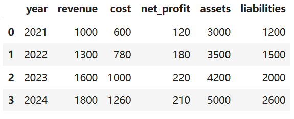
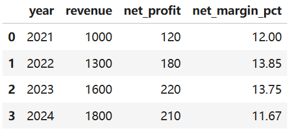
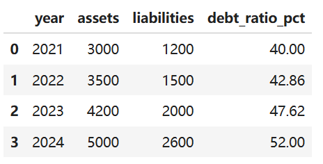

## 一、最终目标是什么？

我们最终要实现一个简单的财务分析器：

```shell
读取财务数据
   ↓
用 Python 计算关键指标
   ↓
整理成结构化摘要
   ↓
调用 DeepSeek / GPT
   ↓
生成财务分析报告
```

类比前端：

```shell
接口返回原始数据
   ↓
前端 JS 做数据格式化
   ↓
组件渲染图表
   ↓
用户看到可读结论
```

## 二、阶段 1：先打通 DeepSeek / GPT API

官方上，`oenAI` 现在推荐用 `Responses API`；`DeepSeek API` 兼容 `OpenAI` 的 `Chat Completions` 调用风格，也就是说你可以用类似的 `SDK` 思路去调它。

### 1、安装依赖

在 `Jupyter` 里执行：

```python
!pip install openai pandas
```

### 2、第一次调用 DeepSeek

`DeepSeek` 当前 `API` 地址可以使用:

```python
https://api.deepseek.com
```

官方 `V4` 预览说明里提到，可以保持 `base_url` 不变，只更新模型名为 `deepseek-v4-pro` 或 `deepseek-v4-flash`。
我们先用便宜、速度快的：

```shell
deepseek-v4-flash
```

适合学习、测试、普通分析。

```python
from openai import OpenAI
import os

deepseek_client = OpenAI(
    api_key=os.getenv("DEEPSEEK_API_KEY"),
    base_url="https://api.deepseek.com"
)

response = deepseek_client.chat.completions.create(
    model="deepseek-v4-flash",
    messages=[
        {
            "role": "system",
            "content": "你是一个严谨的财务分析师。"
        },
        {
            "role": "user",
            "content": "请用一句话解释什么是毛利率。"
        }
    ]
)

print(response.choices[0].message.content)
```

你可以把这段理解成前端里的：

```javascript
const res = await fetch('https://api.deepseek.com/chat/completions', {
  method: 'POST',
  headers: {
    Authorization: `Bearer ${apiKey}`,
    'Content-Type': 'application/json'
  },
  body: JSON.stringify({
    model: 'deepseek-v4-flash',
    messages: [
      { role: 'system', content: '你是一个财务分析师' },
      { role: 'user', content: '解释毛利率' }
    ]
  })
})
```

## 三、先造一份财务数据

我们先不用真实 `Excel`，先用一份模拟数据。

```python
import pandas as pd

data = {
    "year": [2021, 2022, 2023, 2024],
    "revenue": [1000, 1300, 1600, 1800],      # 营业收入
    "cost": [600, 780, 1000, 1260],           # 营业成本
    "net_profit": [120, 180, 220, 210],       # 净利润
    "assets": [3000, 3500, 4200, 5000],       # 总资产
    "liabilities": [1200, 1500, 2000, 2600]   # 总负债
}

df = pd.DataFrame(data)

df
```



这就像前端拿到接口返回：

```javascript
[
  { year: 2021, revenue: 1000, cost: 600, net_profit: 120 },
  { year: 2022, revenue: 1300, cost: 780, net_profit: 180 }
]
```

`Pandas` 的 `DataFrame` 可以简单理解成 `Python` 里的“表格版数组”。

## 六、用 Python 计算财务指标

记住一句话：

> 财务指标必须用 Python 算，不要交给 DeepSeek 猜。

### 1、计算毛利率

毛利率：

```python
毛利率 = (营业收入 - 营业成本) / 营业收入
```

```python
df["gross_profit"] = df["revenue"] - df["cost"]

df["gross_margin_pct"] = (
    df["gross_profit"] / df["revenue"] * 100
).round(2)

df[["year", "revenue", "cost", "gross_profit", "gross_margin_pct"]]
```

你会看到类似结果：

| year | revenue | cost | gross_profit | gross_margin_pct |
| ---: | ------: | ---: | -----------: | ---------------: |
| 2021 |    1000 |  600 |          400 |            40.00 |
| 2022 |    1300 |  780 |          520 |            40.00 |
| 2023 |    1600 | 1000 |          600 |            37.50 |
| 2024 |    1800 | 1260 |          540 |            30.00 |

这里已经出现一个重要信号：

> 营收在增长，但毛利率在下降。

这就是财务分析的入口。

### 2、计算净利率

净利率：

```shell
净利率 = 净利润 / 营业收入
```

```python
df["net_margin_pct"] = (
    df["net_profit"] / df["revenue"] * 100
).round(2)

df[["year", "revenue", "net_profit", "net_margin_pct"]]
```



### 3、计算资产负债率

资产负债率：

```shell
资产负债率 = 总负债 / 总资产
```

```python
df["debt_ratio_pct"] = (
    df["liabilities"] / df["assets"] * 100
).round(2)

df[["year", "assets", "liabilities", "debt_ratio_pct"]]
```



### 4、计算营收增长率

增长率：

```shell
今年营收增长率 = (今年营收 - 去年营收) / 去年营收
```

`Pandas` 里可以用 `pct_change()`：

```python
df["revenue_growth_pct"] = (
    df["revenue"].pct_change() * 100
).round(2)

df[["year", "revenue", "revenue_growth_pct"]]
```

### 5、计算净利润增长率

```python
df["net_profit_growth_pct"] = (
    df["net_profit"].pct_change() * 100
).round(2)

df[["year", "net_profit", "net_profit_growth_pct"]]
```

如果你看到 2024 年净利润增长率为负，就要敏感：

```shell
营收增长，但净利润下降。
```

这不是小问题。
这说明公司可能存在：

```shell
成本上升
费用增加
毛利率下滑
经营效率下降
负债压力变大
```

这才叫分析，不是简单说“营收增长，表现良好”。

## 七、把结果整理成 DeepSeek 能读懂的格式

DeepSeek 不适合直接吃一堆乱数据。
我们要整理成 Markdown 表格。
你的 `Python` 环境中必须已经安装了 `tabulate` 库。因为 `Pandas` 的 `to_markdown()` 方法是基于这个第三方库实现的，如果没有安装，运行时会直接报错。

```shell
pip install tabulate
```

```python
analysis_df = df[[
    "year",
    "revenue",
    "cost",
    "net_profit",
    "gross_margin_pct",
    "net_margin_pct",
    "debt_ratio_pct",
    "revenue_growth_pct",
    "net_profit_growth_pct"
]]

summary = analysis_df.to_markdown(index=False)

print(summary)
```

这一步非常重要。
你不是在“随便写 `prompt`”，你是在给 DeepSeek 准备一份结构化上下文。

## 八、设计一个严谨的 Prompt

小白常犯的错误是这样问：

```shell
帮我分析一下这家公司财务情况。
```

这个太粗糙。
更好的写法：

```python
prompt = f"""
你是一名严谨的财务分析师。

下面是某公司 2021-2024 年的财务指标数据：

{summary}

请基于以上数据，生成一份财务分析报告。

报告要求：
1. 总结整体经营趋势
2. 分析营业收入变化
3. 分析毛利率变化
4. 分析净利率变化
5. 分析资产负债率风险
6. 找出最核心的财务问题
7. 给出 3 条经营建议

严格限制：
- 只能基于表格中的数据分析
- 不要编造行业背景
- 不要虚构公司信息
- 不要编造表格里没有的数字
- 如果数据不足，请明确说明
- 语言要适合财务小白阅读
"""
```

这里的重点是最后几条限制。
你要学会约束模型。
大模型不是员工，它更像一个能力很强但容易自由发挥的实习生。你不给边界，它就可能乱发挥。

## 九、调用 DeepSeek 生成财务报告

```python
response = deepseek_client.chat.completions.create(
    model="deepseek-v4-flash",
    messages=[
        {
            "role": "system",
            "content": "你是一名严谨的财务分析师，只能基于用户提供的数据分析，不能编造数据。"
        },
        {
            "role": "user",
            "content": prompt
        }
    ]
)

report = response.choices[0].message.content

print(report)
```

输出结果：

```shell
以下是根据您提供的2021-2024年财务数据生成的财务分析报告，旨在以通俗语言说明公司经营状况。

---

### 一、整体经营趋势

2021年至2024年，公司的营业收入连续增长，但增速逐年放缓（从30%降至12.5%）。净利润在2021-2023年持续上升，但在2024年出现下滑（-4.55%）。与此同时，毛利率和净利率在2023-2024年明显下降，而资产负债率持续攀升。整体呈现“收入还在增长，但盈利能力减弱、财务风险加大”的趋势。

---

### 二、营业收入变化

- 营业收入从2021年的1000万元增至2024年的1800万元，四年累计增长80%。
- 但增速逐年下降：2022年增长30%，2023年增长23.08%，2024年仅增长12.5%。说明公司已进入增长放缓阶段，可能面临市场饱和或竞争加剧。

---

### 三、毛利率变化

- 毛利率从2021年的40%降至2024年的30%，下降10个百分点。其中2022年维持在40%，2023年降至37.5%，2024年大幅下滑至30%。
- 毛利率下降幅度在2024年最为明显，说明每单位收入对应的成本在快速上升，可能是原材料涨价、产品降价或生产效率下降所致。

---

### 四、净利率变化

- 净利率在2022年曾小幅上升至13.85%，但2023年微降至13.75%，2024年进一步降至11.67%，创四年新低。
- 2024年净利润绝对值出现下降（210万元，低于2023年的220万元），表明费用控制或非经营因素（如利息支出增加）可能侵蚀了利润。结合毛利率下降，说明盈利空间正在收窄。

---

### 五、资产负债率风险

- 资产负债率从2021年的40%持续上升至2024年的52%，四年增加12个百分点。
- 52%的负债率虽未达到警戒线（通常70%以上需警惕），但连续上升的趋势值得关注。若盈利能力下滑，公司偿债压力将加大，财务风险升高。

---

### 六、最核心的财务问题

**核心问题是：盈利能力持续恶化，而债务却在扩张。**  
具体表现为：
- 毛利率与净利率双双下滑，2024年净利润甚至负增长（-4.55%）；
- 同时负债率仍在上升，说明公司可能依赖举债来支持增长，但增长带来的利润却不足以覆盖成本上升和利息负担。

如果这一趋势持续，公司可能面临“增收不增利、利润不够还债”的困境。

---

### 七、经营建议（基于数据）

1. **控制成本，提升毛利率**  
   重点审查2024年成本大幅上升的原因（成本占收入比例从60%升至70%），可通过优化采购、提高生产效率或调整产品结构来恢复毛利率至35%以上。

2. **降低负债率，减少利息压力**  
   暂停新增债务，优先使用内部利润偿还部分借款；同时重新评估投资项目的回报率，避免为低回报项目继续举债。

3. **调整增长策略，从“规模扩张”转向“质量增长”**  
   营收增速已明显放缓，不应再盲目追求收入增长。建议聚焦高毛利产品、提升客户复购率，或削减低利润业务，以恢复净利润增长。

---

**数据不足之处说明**：表格中未提供费用明细（销售、管理、财务费用）、现金流、资产构成等数据，因此无法进一步分析净利率下降的具体费用来源，也无法判断负债结构（如短期借款占比）。建议结合更详细的财报进行深入分析。
```

到这里，你已经完成了第一个版本：

```shell
Pandas 计算财务指标 + DeepSeek 生成分析报告
```

这就是一个最小可用财务分析助手。

## 十、把代码封装成函数

前端里你不会把所有逻辑堆在一个组件里。
Python 也一样。

### 1、封装指标计算函数

```python
def calculate_financial_metrics(df):
    df = df.copy()

    df["gross_profit"] = df["revenue"] - df["cost"]

    df["gross_margin_pct"] = (
        df["gross_profit"] / df["revenue"] * 100
    ).round(2)

    df["net_margin_pct"] = (
        df["net_profit"] / df["revenue"] * 100
    ).round(2)

    df["debt_ratio_pct"] = (
        df["liabilities"] / df["assets"] * 100
    ).round(2)

    df["revenue_growth_pct"] = (
        df["revenue"].pct_change() * 100
    ).round(2)

    df["net_profit_growth_pct"] = (
        df["net_profit"].pct_change() * 100
    ).round(2)

    return df
```

### 2、封装 Prompt 构造函数

```python
def build_financial_prompt(df):
    analysis_df = df[[
        "year",
        "revenue",
        "cost",
        "net_profit",
        "gross_margin_pct",
        "net_margin_pct",
        "debt_ratio_pct",
        "revenue_growth_pct",
        "net_profit_growth_pct"
    ]]

    summary = analysis_df.to_markdown(index=False)

    prompt = f"""
你是一名严谨的财务分析师。

下面是某公司近几年的财务指标数据：

{summary}

请生成一份财务分析报告。

报告要求：
1. 总结整体经营趋势
2. 分析营业收入变化
3. 分析毛利率变化
4. 分析净利率变化
5. 分析资产负债率风险
6. 找出最核心的财务问题
7. 给出 3 条经营建议

严格限制：
- 只能基于表格中的数据分析
- 不要编造行业背景
- 不要虚构公司信息
- 不要编造表格里没有的数字
- 如果数据不足，请明确说明
- 语言要适合财务小白阅读
"""

    return prompt
```

### 3、封装 DeepSeek 调用函数

```python
def generate_report_with_deepseek(prompt, model="deepseek-v4-flash"):
    response = deepseek_client.chat.completions.create(
        model=model,
        messages=[
            {
                "role": "system",
                "content": "你是一名严谨的财务分析师，只能基于用户提供的数据分析，不能编造数据。"
            },
            {
                "role": "user",
                "content": prompt
            }
        ]
    )

    return response.choices[0].message.content
```

## 十一、完整可运行版本

下面是一份完整代码，你可以直接复制到 Jupyter。

```python
import os
import pandas as pd
from dotenv import load_dotenv
from openai import OpenAI

# 1. 读取环境变量
load_dotenv()

# 2. 创建 DeepSeek 客户端
deepseek_client = OpenAI(
    api_key=os.getenv("DEEPSEEK_API_KEY"),
    base_url="https://api.deepseek.com"
)


def calculate_financial_metrics(df):
    """
    计算常用财务指标
    """
    df = df.copy()

    df["gross_profit"] = df["revenue"] - df["cost"]

    df["gross_margin_pct"] = (
        df["gross_profit"] / df["revenue"] * 100
    ).round(2)

    df["net_margin_pct"] = (
        df["net_profit"] / df["revenue"] * 100
    ).round(2)

    df["debt_ratio_pct"] = (
        df["liabilities"] / df["assets"] * 100
    ).round(2)

    df["revenue_growth_pct"] = (
        df["revenue"].pct_change() * 100
    ).round(2)

    df["net_profit_growth_pct"] = (
        df["net_profit"].pct_change() * 100
    ).round(2)

    return df


def build_financial_prompt(df):
    """
    构造给 DeepSeek 的提示词
    """
    analysis_df = df[[
        "year",
        "revenue",
        "cost",
        "net_profit",
        "gross_margin_pct",
        "net_margin_pct",
        "debt_ratio_pct",
        "revenue_growth_pct",
        "net_profit_growth_pct"
    ]]

    summary = analysis_df.to_markdown(index=False)

    return f"""
你是一名严谨的财务分析师。

下面是某公司近几年的财务指标数据：

{summary}

请生成一份财务分析报告。

报告要求：
1. 总结整体经营趋势
2. 分析营业收入变化
3. 分析毛利率变化
4. 分析净利率变化
5. 分析资产负债率风险
6. 找出最核心的财务问题
7. 给出 3 条经营建议

严格限制：
- 只能基于表格中的数据分析
- 不要编造行业背景
- 不要虚构公司信息
- 不要编造表格里没有的数字
- 如果数据不足，请明确说明
- 语言要适合财务小白阅读
"""


def generate_report_with_deepseek(prompt, model="deepseek-v4-flash"):
    """
    调用 DeepSeek 生成财务分析报告
    """
    response = deepseek_client.chat.completions.create(
        model=model,
        messages=[
            {
                "role": "system",
                "content": "你是一名严谨的财务分析师，只能基于用户提供的数据分析，不能编造数据。"
            },
            {
                "role": "user",
                "content": prompt
            }
        ]
    )

    return response.choices[0].message.content


# 4. 模拟财务数据
data = {
    "year": [2021, 2022, 2023, 2024],
    "revenue": [1000, 1300, 1600, 1800],
    "cost": [600, 780, 1000, 1260],
    "net_profit": [120, 180, 220, 210],
    "assets": [3000, 3500, 4200, 5000],
    "liabilities": [1200, 1500, 2000, 2600]
}

df = pd.DataFrame(data)

# 5. 计算财务指标
result_df = calculate_financial_metrics(df)

# 6. 构造 Prompt
prompt = build_financial_prompt(result_df)

# 7. 调用 DeepSeek 生成报告
report = generate_report_with_deepseek(prompt)

print(report)
```

## 十二、你应该怎么理解这个项目？

不要把它理解成：

```shell
我用 DeepSeek 做了一个财务分析工具
```

这个说法太虚。
你应该理解成：

```shell
我用 Python 完成财务数据计算，
再把计算结果交给 DeepSeek 生成自然语言分析报告。
```

这句话更专业，也更真实。

## 十三、这个项目的真正架构

```shell
财务原始数据
    ↓
Pandas DataFrame
    ↓
计算指标
    ↓
Markdown 表格
    ↓
DeepSeek Prompt
    ↓
财务分析报告
```

你以后扩展功能，也是在这条链路上加东西。
比如：

```shell
Excel 文件读取
PDF 财报解析
自动生成图表
多公司对比
行业均值对比
生成 Word 报告
生成网页仪表盘
```

但现在不要贪多。
你是 Python 小白，第一阶段只要把这条链路跑通。
