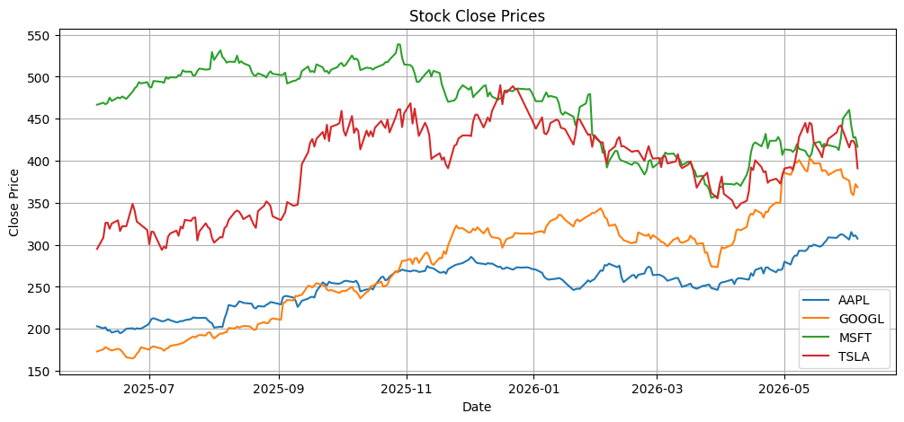
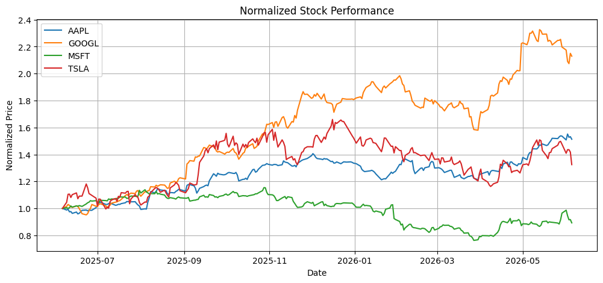
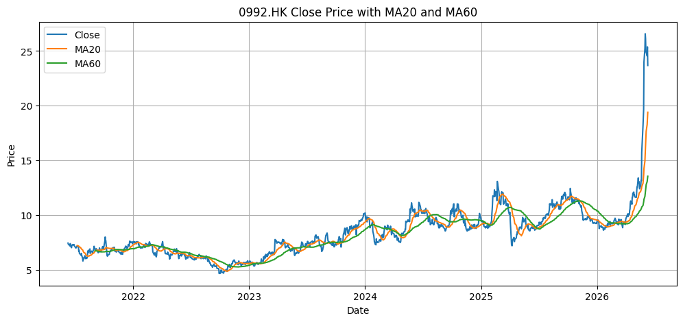
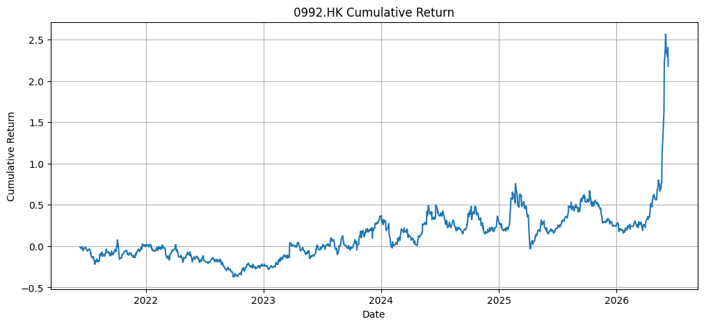
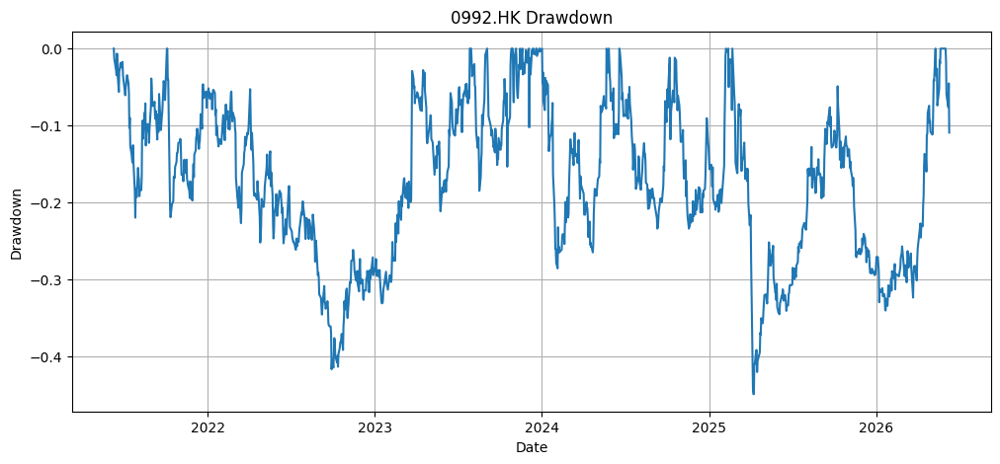
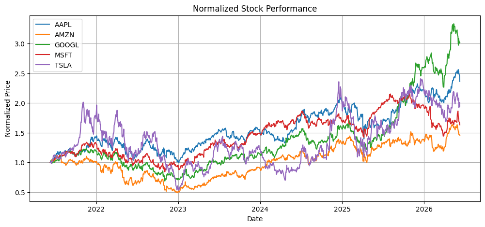

> `yfinance` 是 Python 里非常常用的金融数据获取库。它可以帮你从 Yahoo Finance 拉取股票、ETF、指数、加密货币等数据，再配合 `pandas` 和 `matplotlib` 做基础分析。
>
> 这篇文章不追求复杂量化模型，而是先把“拿数据、看字段、画走势、算收益、看风险”这条最小闭环跑通。

## 一、yfinance 是什么

你可以把 `yfinance` 理解成一个已经封装好的金融数据请求工具：

> 前端请求后端接口拿 JSON 数据，`yfinance` 就是帮你封装好了“请求 Yahoo Finance 数据接口”的 Python 工具。

它能拿到的数据主要包括：

| 数据类型 | 例子 |
| :--- | :--- |
| 历史行情 | 开盘价、最高价、最低价、收盘价、成交量 |
| 分红数据 | `dividend` |
| 拆股数据 | `stock split` |
| 公司信息 | 市值、行业、PE 等基础信息 |
| 财务报表 | 利润表、资产负债表、现金流量表 |
| 多只股票数据 | `AAPL`、`MSFT`、`TSLA` 一次性下载 |
| 指数 / ETF / 加密货币 | `^GSPC`、`QQQ`、`BTC-USD` |

`yfinance` 官方文档也说明，它提供了访问 Yahoo Finance 数据的方式，可以下载历史市场数据、访问 `ticker` 信息、管理缓存等。

## 二、安装 yfinance

在 `Jupyter` 里可以直接运行：

```python
!pip install yfinance
```

如果你已经安装过，但是遇到问题，可以升级：

```python
!pip install -U yfinance
```

导入常用库：

```python
import yfinance as yf
import pandas as pd
import matplotlib.pyplot as plt
```

查看版本：

```python
import yfinance as yf

yf.__version__
```

## 三、踩坑：浏览器能访问，Python 请求却被 Yahoo 拒绝

在使用 `yfinance` 或直接请求 Yahoo Finance 接口时，我遇到过一个典型问题：

> 浏览器里可以正常打开 Yahoo Finance，但是在 Python 中使用 `requests` 或 `curl_cffi` 请求时，却返回了 403，页面内容是 Yahoo 的错误页。

一开始我以为是 `yfinance` 版本问题，或者是 `curl_cffi` 没有配置好。后来排查后发现，真正的问题是：浏览器请求走了本机代理，但是 Python 请求默认没有走代理。

我的浏览器能够正常访问，是因为浏览器或系统代理使用的是本机代理端口：

```text
127.0.0.1:33210
```

但是 Python 脚本默认并不会自动使用浏览器代理，所以它是直接请求 Yahoo Finance。直连请求可能会被 Yahoo 拒绝，最终导致 403、429 或 `YFRateLimitError` 等问题。

可以在脚本里显式指定代理：

```python
import os

os.environ["HTTP_PROXY"] = "http://127.0.0.1:33210"
os.environ["HTTPS_PROXY"] = "http://127.0.0.1:33210"
```

## 四、第一个例子：获取苹果股票历史数据

我们先拿苹果公司的股票数据。

```python
import yfinance as yf

aapl = yf.Ticker("AAPL")
data = aapl.history(period="1y")

data
```

输出示例：


你会看到类似这样的表格结构：

| Date | Open | High | Low | Close | Volume | Dividends | Stock Splits |
| :--- | ---: | ---: | ---: | ---: | ---: | ---: | ---: |

几个核心字段你必须懂，详细解释可以看：[看懂开盘价、收盘价、成交量与分红拆股](#/notes/理财与投资/基础认知与模拟实战期/看懂开盘价、收盘价、成交量与分红拆股)。

| 字段 | 含义 |
| :--- | :--- |
| `Open` | 开盘价 |
| `High` | 当天最高价 |
| `Low` | 当天最低价 |
| `Close` | 收盘价 |
| `Volume` | 成交量 |
| `Dividends` | 分红 |
| `Stock Splits` | 拆股 |

## 五、period 和 interval 怎么用

`history()` 里面最常用的两个参数是 `period` 和 `interval`。

```python
import yfinance as yf

aapl = yf.Ticker("AAPL")
data = aapl.history(period="1y", interval="1mo")

data
```

`period` 表示时间范围：

| 参数 | 含义 |
| :--- | :--- |
| `"1d"` | 1 天 |
| `"5d"` | 5 天 |
| `"1mo"` | 1 个月 |
| `"6mo"` | 6 个月 |
| `"1y"` | 1 年 |
| `"5y"` | 5 年 |
| `"max"` | 尽可能长的历史数据 |

`interval` 表示数据频率：

| 参数 | 含义 |
| :--- | :--- |
| `"1m"` | 1 分钟 |
| `"5m"` | 5 分钟 |
| `"1h"` | 1 小时 |
| `"1d"` | 1 天 |
| `"1wk"` | 1 周 |
| `"1mo"` | 1 月 |

> `period` 决定你看多长时间，`interval` 决定你看多细。

做长期投资分析，一般用：

```python
period="5y", interval="1d"
```

做短线观察，可以用：

```python
period="1mo", interval="1h"
```

## 六、画出股价走势图

这是股票分析里最常见的第一张图：收盘价走势。

```python
import matplotlib.pyplot as plt

data = yf.Ticker("AAPL").history(period="1y")

plt.figure(figsize=(12, 5))
plt.plot(data.index, data["Close"])
plt.title("AAPL Close Price - 1 Year")
plt.xlabel("Date")
plt.ylabel("Close Price")
plt.grid(True)
plt.show()
```

图为：


这张图表示苹果过去一年收盘价走势。

> 单独看价格走势没什么技术含量。真正分析要看收益率、均线、波动率和成交量。

## 七、计算每日收益率

收益率比价格更重要。价格告诉你“股票多少钱”，收益率告诉你“涨跌幅是多少”。

```python
data["daily_return"] = data["Close"].pct_change()

data[["Close", "daily_return"]].head()
```

`pct_change()` 的意思是计算百分比变化。

例如：昨天收盘价 100，今天收盘价 105，收益率就是：

```text
(105 - 100) / 100 = 0.05
```

也就是 5%。

画出每日收益率：

```python
plt.figure(figsize=(12, 5))
plt.plot(data.index, data["daily_return"])
plt.title("AAPL Daily Return")
plt.xlabel("Date")
plt.ylabel("Daily Return")
plt.grid(True)
plt.show()
```

展示图为：


这个图通常会比股价图更“乱”，因为每天涨跌本来就很随机。

## 八、计算累计收益率

累计收益率可以看出：如果一年前买入，现在一共赚了多少。

```python
data["cumulative_return"] = (1 + data["daily_return"]).cumprod() - 1

data[["Close", "daily_return", "cumulative_return"]].tail()
```

画图：

```python
plt.figure(figsize=(12, 5))
plt.plot(data.index, data["cumulative_return"])
plt.title("AAPL Cumulative Return")
plt.xlabel("Date")
plt.ylabel("Cumulative Return")
plt.grid(True)
plt.show()
```


> 如果 `cumulative_return` 是 0.25，说明累计收益率是 25%。如果是 -0.1，说明累计亏损 10%。

## 九、计算移动平均线 MA

移动平均线是最适合小白入门的技术指标之一。

```python
data["MA20"] = data["Close"].rolling(window=20).mean()
data["MA60"] = data["Close"].rolling(window=60).mean()
```

含义：

| 指标 | 含义 |
| :--- | :--- |
| `MA20` | 最近 20 个交易日平均价格 |
| `MA60` | 最近 60 个交易日平均价格 |

画图：

```python
plt.figure(figsize=(12, 5))
plt.plot(data.index, data["Close"], label="Close")
plt.plot(data.index, data["MA20"], label="MA20")
plt.plot(data.index, data["MA60"], label="MA60")
plt.title("AAPL Close Price with Moving Averages")
plt.xlabel("Date")
plt.ylabel("Price")
plt.legend()
plt.grid(True)
plt.show()
```


这就是非常经典的均线分析：

| 指标 | 可以怎么理解 |
| :--- | :--- |
| `Close` | 每天真实价格 |
| `MA20` | 短期趋势 |
| `MA60` | 中期趋势 |

> 如果价格长期在 `MA60` 上方，说明中期趋势偏强。但均线不是预测神器，它只是把过去的价格平滑了一下。

## 十、分析成交量 Volume

成交量代表市场交易活跃度。

```python
plt.figure(figsize=(12, 5))
plt.bar(data.index, data["Volume"])
plt.title("AAPL Trading Volume")
plt.xlabel("Date")
plt.ylabel("Volume")
plt.grid(True)
plt.show()
```


你可以先掌握这几个基础判断：

| 情况 | 通俗理解 |
| :--- | :--- |
| 价格上涨 + 成交量放大 | 上涨可能更有力量 |
| 价格上涨 + 成交量萎缩 | 上涨可能不够扎实 |
| 价格下跌 + 成交量放大 | 抛压可能较大 |

> 成交量是辅助判断，不是单独决策的万能答案。

## 十一、一次下载多只股票

这是 `yfinance` 很实用的地方。

```python
stocks = ["AAPL", "MSFT", "GOOGL", "TSLA"]
data = yf.download(stocks, period="1y", interval="1d")

data.head()
```

这时返回的数据通常是多层列结构。我们先只取收盘价：

```python
close_data = data["Close"]

close_data.head()
```

画多只股票价格走势：

```python
plt.figure(figsize=(12, 5))

for stock in close_data.columns:
    plt.plot(close_data.index, close_data[stock], label=stock)

plt.title("Stock Close Prices")
plt.xlabel("Date")
plt.ylabel("Close Price")
plt.legend()
plt.grid(True)
plt.show()
```

如图所示：



这里有一个问题：苹果 200 美元左右，微软几百美元，特斯拉又是另一个价格区间。直接比较价格不公平。

所以我们应该比较“归一化收益”。

## 十二、多只股票收益对比

把每只股票第一天的价格都当成 1。

```python
normalized = close_data / close_data.iloc[0]

normalized.head()
```

```python
plt.figure(figsize=(12, 5))

for stock in normalized.columns:
    plt.plot(normalized.index, normalized[stock], label=stock)

plt.title("Normalized Stock Performance")
plt.xlabel("Date")
plt.ylabel("Normalized Price")
plt.legend()
plt.grid(True)
plt.show()
```



| 结果 | 含义 |
| :--- | :--- |
| `AAPL` 从 1 变成 1.2 | 涨了 20% |
| `TSLA` 从 1 变成 0.8 | 跌了 20% |

## 十三、计算最大回撤

最大回撤是非常重要的风险指标。它回答的是：

> 如果你在最高点买入，后面最惨的时候亏了多少？

```python
close = yf.Ticker("AAPL").history(period="5y")["Close"]

cummax = close.cummax()
drawdown = close / cummax - 1

max_drawdown = drawdown.min()

max_drawdown
```

画图：

```python
plt.figure(figsize=(12, 5))
plt.plot(drawdown.index, drawdown)
plt.title("AAPL Drawdown")
plt.xlabel("Date")
plt.ylabel("Drawdown")
plt.grid(True)
plt.show()
```

如果最大回撤是 `-0.35`，意思是历史最大跌幅曾经达到 `35%`。

> 收益决定你想不想买，回撤决定你拿不拿得住。很多人只看收益，不看回撤，这是新手最常见的错误。

## 十四、获取公司基本信息

```python
ticker = yf.Ticker("AAPL")

info = ticker.info

info.keys()
```

常用字段：

```python
info["longName"]
info["sector"]
info["industry"]
info["marketCap"]
info["trailingPE"]
info["forwardPE"]
```

可以整理成表格：

```python
basic_info = {
    "公司名称": info.get("longName"),
    "行业": info.get("industry"),
    "板块": info.get("sector"),
    "市值": info.get("marketCap"),
    "PE": info.get("trailingPE"),
    "Forward PE": info.get("forwardPE"),
}

pd.DataFrame([basic_info])
```

## 十五、获取财务报表

```python
ticker = yf.Ticker("AAPL")

income_stmt = ticker.income_stmt
balance_sheet = ticker.balance_sheet
cashflow = ticker.cashflow
```

查看利润表：

```python
income_stmt.head()
```

查看资产负债表：

```python
balance_sheet.head()
```

查看现金流量表：

```python
cashflow.head()
```

这部分对小白来说先不要深入。你先知道：

| 表 | 作用 |
| :--- | :--- |
| `income_stmt` | 看公司赚不赚钱 |
| `balance_sheet` | 看公司资产、负债情况 |
| `cashflow` | 看公司现金流健康不健康 |

后面你真正做股票分析时，要把它们和股价结合起来。

## 十六、完整小项目：分析一只股票

下面这段代码已经能完成一个最基础的单只股票分析。

```python
import yfinance as yf
import pandas as pd
import matplotlib.pyplot as plt

symbol = "0992.HK"

data = yf.Ticker(symbol).history(period="5y")

data["daily_return"] = data["Close"].pct_change()
data["cumulative_return"] = (1 + data["daily_return"]).cumprod() - 1

data["MA20"] = data["Close"].rolling(20).mean()
data["MA60"] = data["Close"].rolling(60).mean()

cummax = data["Close"].cummax()
data["drawdown"] = data["Close"] / cummax - 1

annual_return = data["daily_return"].mean() * 252
annual_volatility = data["daily_return"].std() * (252 ** 0.5)
max_drawdown = data["drawdown"].min()

print("股票代码:", symbol)
print("年化收益率:", annual_return)
print("年化波动率:", annual_volatility)
print("最大回撤:", max_drawdown)

plt.figure(figsize=(12, 5))
plt.plot(data.index, data["Close"], label="Close")
plt.plot(data.index, data["MA20"], label="MA20")
plt.plot(data.index, data["MA60"], label="MA60")
plt.title(f"{symbol} Close Price with MA20 and MA60")
plt.xlabel("Date")
plt.ylabel("Price")
plt.legend()
plt.grid(True)
plt.show()

plt.figure(figsize=(12, 5))
plt.plot(data.index, data["cumulative_return"])
plt.title(f"{symbol} Cumulative Return")
plt.xlabel("Date")
plt.ylabel("Cumulative Return")
plt.grid(True)
plt.show()

plt.figure(figsize=(12, 5))
plt.plot(data.index, data["drawdown"])
plt.title(f"{symbol} Drawdown")
plt.xlabel("Date")
plt.ylabel("Drawdown")
plt.grid(True)
plt.show()
```

这段代码覆盖了这些分析维度：

| 分析维度 | 是否完成 |
| :--- | :--- |
| 股价走势 | 完成 |
| 均线趋势 | 完成 |
| 每日收益率 | 完成 |
| 累计收益率 | 完成 |
| 年化收益率 | 完成 |
| 年化波动率 | 完成 |
| 最大回撤 | 完成 |

输出图：







## 十七、再做一个多股票对比分析

```python
import yfinance as yf
import pandas as pd
import matplotlib.pyplot as plt

symbols = ["AAPL", "MSFT", "GOOGL", "AMZN", "TSLA"]

data = yf.download(symbols, period="5y", interval="1d")

close = data["Close"]

returns = close.pct_change().dropna()

annual_return = returns.mean() * 252
annual_volatility = returns.std() * (252 ** 0.5)

summary = pd.DataFrame({
    "annual_return": annual_return,
    "annual_volatility": annual_volatility
})

summary["return_risk_ratio"] = summary["annual_return"] / summary["annual_volatility"]

summary.sort_values("return_risk_ratio", ascending=False)

normalized = close / close.iloc[0]

plt.figure(figsize=(12, 5))

for symbol in normalized.columns:
    plt.plot(normalized.index, normalized[symbol], label=symbol)

plt.title("Normalized Stock Performance")
plt.xlabel("Date")
plt.ylabel("Normalized Price")
plt.legend()
plt.grid(True)
plt.show()
```



这个例子做了三件事：

| 步骤 | 含义 |
| :--- | :--- |
| 计算 `annual_return` | 看每只股票的年化收益 |
| 计算 `annual_volatility` | 看每只股票的年化波动 |
| 计算 `return_risk_ratio` | 用收益和风险做一个粗略对比 |

## 十八、API 小词典

### 1、cumprod

`cumprod()` 是 `cumulative product` 的缩写，意思是：累计连乘。

这行代码：

```python
data["cumulative_return"] = (1 + data["daily_return"]).cumprod() - 1
```

是在计算 **累计收益率**。

假设有一列数据：

```python
[1.01, 1.02, 0.99, 1.03]
```

执行：

```python
cumprod()
```

结果是：

```python
[
    1.01,
    1.01 * 1.02,
    1.01 * 1.02 * 0.99,
    1.01 * 1.02 * 0.99 * 1.03
]
```

也就是：

```python
[1.01, 1.0302, 1.019898, 1.05049494]
```

它不是普通求和，而是 **前面所有数不断相乘**。

### 2、cummax

`cummax()` 代表的是累积最大值，也就是 `Cumulative Maximum`。

它会遍历整个股票收盘价序列，计算并记录从开始到当前为止的历史最高价：

- 如果当天的收盘价创下新高，`cummax` 的值就会更新为这个新价格。
- 如果当天的收盘价下跌，`cummax` 的值会保持不变，继续保留之前的历史最高价。

在最大回撤计算中，它的作用是：

| 代码 | 作用 |
| :--- | :--- |
| `cummax = close.cummax()` | 生成一条“历史最高点”的基准线 |
| `drawdown = close / cummax - 1` | 计算当前价格距离历史最高价下跌了多少 |
| `max_drawdown = drawdown.min()` | 找出这段时间内回撤最严重的那个点 |

假设 `AAPL` 过去几天的收盘价是：

```python
[100, 110, 105, 120, 115]
```

对应的 `cummax` 会是：

```python
[100, 110, 110, 120, 120]
```

当价格从 110 跌到 105 时，`cummax` 依然是 110，此时计算出的回撤就是：

```text
(105 / 110) - 1
```

简单来说，`cummax()` 就是帮你记录“迄今为止见过的最高价”，再用它作为衡量后续跌幅的参照物。

## 最后总结

用 `yfinance` 做基础股票分析，可以先记住这条路径：

```text
下载行情数据
  -> 看懂 Open / High / Low / Close / Volume
  -> 画收盘价走势
  -> 计算每日收益率和累计收益率
  -> 加入均线、成交量、最大回撤
  -> 再扩展到多股票对比
```

先把这条链路跑顺，再去学更复杂的财务指标、估值方法和量化策略，会稳很多。
