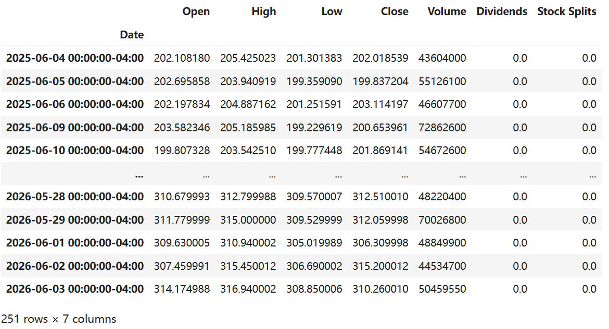
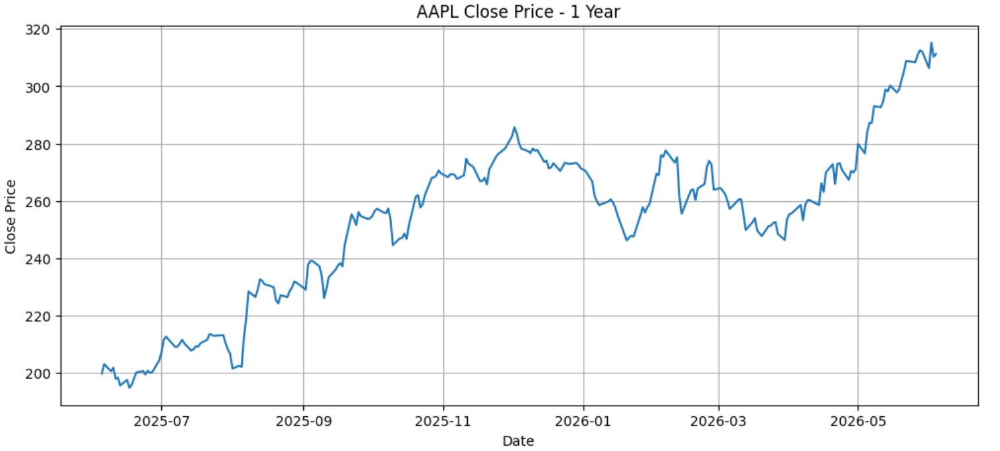
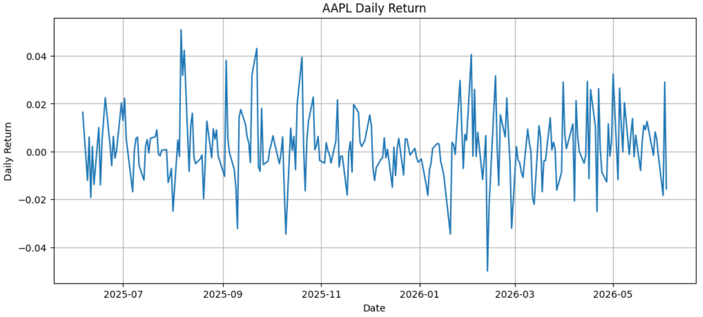
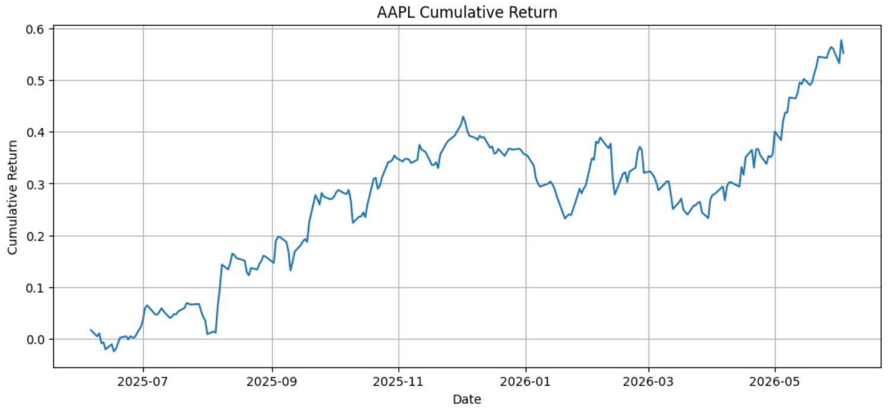
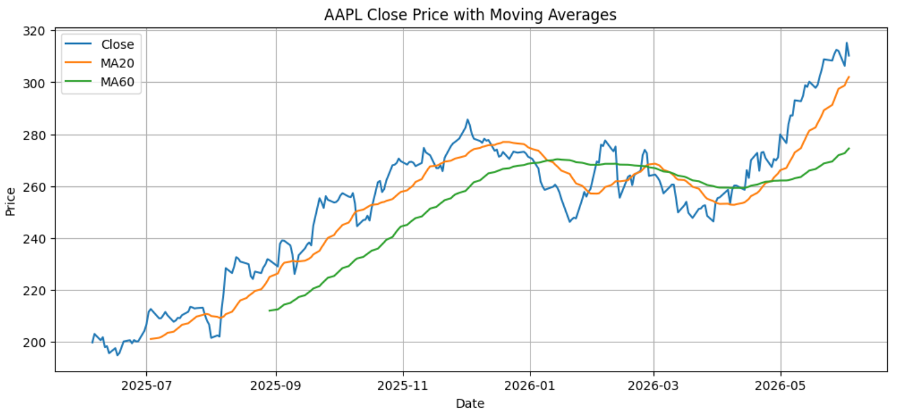
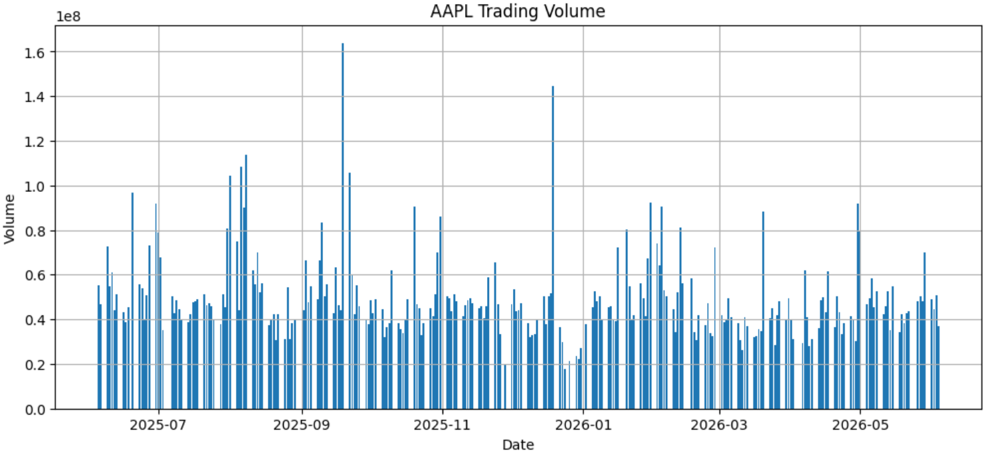

## 一、yfinance 是什么？
`yfinance` 是 `Python` 里一个非常常用的金融数据获取库。
它的核心作用是：**帮你从 Yahoo Finance 获取股票、ETF、指数、加密货币等金融数据。**
你可以把它理解成：
> 前端请求后端接口拿 JSON 数据，yfinance 就是帮你封装好了“请求 Yahoo Finance 数据接口”的 Python 工具。

它能拿到的数据主要包括：
| 数据类型        | 例子                      |
| ----------- | ----------------------- |
| 历史行情        | 开盘价、最高价、最低价、收盘价、成交量     |
| 分红数据        | dividend                |
| 拆股数据        | stock split             |
| 公司信息        | 市值、行业、PE 等部分基础信息        |
| 财务报表        | 利润表、资产负债表、现金流量表         |
| 多只股票数据      | AAPL、MSFT、TSLA 一次性下载    |
| 指数/ETF/加密货币 | `^GSPC`、`QQQ`、`BTC-USD` |

`yfinance` 官方文档也说明，它提供了访问 `Yahoo Finance API` 的方式，可以下载历史市场数据、访问 `ticker` 信息、缓存管理等。

## 二、安装 yfinance
在 `Jupyter` 里可以直接运行：
```python
!pip install yfinance
```
如果你已经安装过，但是遇到问题，可以升级：
```python
!pip install -U yfinance
```
导入：
```python
import yfinance as yf
import pandas as pd
import matplotlib.pyplot as plt
```
查看版本：
```python
import yfinance as yf
yf.__version__
```

## 三、踩坑：浏览器能访问，Python 请求却被 Yahoo 拒绝
在使用 `yfinance` 或直接请求 `Yahoo Finance` 接口时，我遇到了一个比较典型的问题：
浏览器中可以正常打开 `Yahoo Finance` 的接口，但是在 `Python` 中使用 `requests` 或 `curl_cffi` 请求时，却返回了 403，页面内容是 `Yahoo` 的错误页。
一开始我以为是 `yfinance` 版本问题，或者是 `curl_cffi` 没有配置好。后来排查后发现，真正的问题是：
浏览器请求走了本机代理，但是 `Python` 请求默认没有走代理。
我的浏览器能够正常访问，是因为浏览器或系统代理使用的是本机代理端口：
`127.0.0.1:33210`
但是 `Python` 脚本默认并不会自动使用浏览器代理，所以它是直接请求 `Yahoo Finance`。直连请求可能会被 `Yahoo` 拒绝，最终导致 403、429 或 `YFRateLimitError` 等问题
```python
import os

os.environ["HTTP_PROXY"] = "http://127.0.0.1:33210"
os.environ["HTTPS_PROXY"] = "http://127.0.0.1:33210"
```

## 四、第一个例子：获取苹果股票历史数据
我们先拿苹果公司的股票数据。
```python
import yfinance as yf
aapl = yf.Ticker("AAPL")
data = aapl.history(period="1y")
data
```
输出：

你会看到类似这样的表格：
| Date | Open | High | Low | Close | Volume | Dividends | Stock Splits |
| ---- | ---: | ---: | --: | ----: | -----: | --------: | -----------: |

几个核心字段你必须懂，详细解释可以看：[看懂开盘价、收盘价、成交量与分红拆股](#/notes/理财与投资/基础认知与模拟实战期/看懂开盘价、收盘价、成交量与分红拆股)。

| 字段           | 含义    |
| ------------ | ----- |
| Open         | 开盘价   |
| High         | 当天最高价 |
| Low          | 当天最低价 |
| Close        | 收盘价   |
| Volume       | 成交量   |
| Dividends    | 分红    |
| Stock Splits | 拆股    |

## 五、period 和 interval 怎么用？
`history()` 里面最常用的两个参数是：
```python
import yfinance as yf
aapl = yf.Ticker("AAPL")
data = aapl.history(period="1y", interval="1mo")
data
```
`period` 表示时间范围：
```txt
"1d"    # 1天
"5d"    # 5天
"1mo"   # 1个月
"6mo"   # 6个月
"1y"    # 1年
"5y"    # 5年
"max"   # 尽可能长的历史数据
```
`interval` 表示数据频率：
```txt
"1m"    # 1分钟
"5m"    # 5分钟
"1h"    # 1小时
"1d"    # 1天
"1wk"   # 1周
"1mo"   # 1月
```
> period 决定你看多长时间，interval 决定你看多细。

做长期投资分析，一般用：
```python
period="5y", interval="1d"
```
做短线观察，可以用：
```python
period="1mo", interval="1h"
```

## 六、画出股价走势图
这是你写博客必须放的第一个实战图。
```python
import matplotlib.pyplot as plt

data = yf.Ticker("AAPL").history(period="1y")

plt.figure(figsize=(12, 5))
plt.plot(data.index, data["Close"])
plt.title("AAPL Close Price - 1 Year")
plt.xlabel("Date")
plt.ylabel("Close Price")
plt.grid(True)
plt.show()
```
图为：

这张图表示苹果过去一年收盘价走势。
但你要记住：**单独看价格走势没什么技术含量。真正分析要看收益率、均线、波动率、成交量**

## 七、计算每日收益率
收益率比价格更重要。
价格告诉你“股票多少钱”，收益率告诉你“涨跌幅是多少”。
```python
data["daily_return"] = data["Close"].pct_change()

data[["Close", "daily_return"]].head()
```
`pct_change()` 的意思是计算百分比变化。

例如：
昨天收盘价 100，今天收盘价 105。
收益率就是：
```txt
(105 - 100) / 100 = 0.05
```
也就是 5%。
画出每日收益率：
```python
plt.figure(figsize=(12, 5))
plt.plot(data.index, data["daily_return"])
plt.title("AAPL Daily Return")
plt.xlabel("Date")
plt.ylabel("Daily Return")
plt.grid(True)
plt.show()
```
展示图为：

这个图通常会比股价图更“乱”，因为每天涨跌本来就很随机。

## 八、计算累计收益率
累计收益率可以看出：如果一年前买入，现在一共赚了多少。
```python
data["cumulative_return"] = (1 + data["daily_return"]).cumprod() - 1

data[["Close", "daily_return", "cumulative_return"]].tail()
```
画图：
```python
plt.figure(figsize=(12, 5))
plt.plot(data.index, data["cumulative_return"])
plt.title("AAPL Cumulative Return")
plt.xlabel("Date")
plt.ylabel("Cumulative Return")
plt.grid(True)
plt.show()
```

> 如果 cumulative_return 是 0.25，说明累计收益率是 25%。如果是 -0.1，说明累计亏损 10%。

## 九、计算移动平均线 MA
移动平均线是最适合小白入门的技术指标。
例如：
```python
data["MA20"] = data["Close"].rolling(window=20).mean()
data["MA60"] = data["Close"].rolling(window=60).mean()
```
含义：
| 指标   | 含义             |
| ---- | -------------- |
| MA20 | 最近 20 个交易日平均价格 |
| MA60 | 最近 60 个交易日平均价格 |

画图：
```python
plt.figure(figsize=(12, 5))
plt.plot(data.index, data["Close"], label="Close")
plt.plot(data.index, data["MA20"], label="MA20")
plt.plot(data.index, data["MA60"], label="MA60")
plt.title("AAPL Close Price with Moving Averages")
plt.xlabel("Date")
plt.ylabel("Price")
plt.legend()
plt.grid(True)
plt.show()
```

这就是非常经典的均线分析。
你可以这样理解：
> Close 是每天真实价格。MA20 是短期趋势。MA60 是中期趋势。如果价格长期在 MA60 上方，说明中期趋势偏强。

但别犯小白错误：**均线不是预测神器，它只是把过去的价格平滑一下**。

## 十、分析成交量 Volume
成交量代表市场交易活跃度。
```python
plt.figure(figsize=(12, 5))
plt.bar(data.index, data["Volume"])
plt.title("AAPL Trading Volume")
plt.xlabel("Date")
plt.ylabel("Volume")
plt.grid(True)
plt.show()
```

你要学会一个基本判断：
> 价格上涨 + 成交量放大，说明上涨可能更有力量。
价格上涨 + 成交量萎缩，说明上涨可能不够扎实。
价格下跌 + 成交量放大，说明抛压可能较大。

## 十一、一次下载多只股票
这是 `yfinance` 很实用的地方。


## API详解：
### 一、cumprod
`cumprod`() 是 `cumulative product` 的缩写，意思是：累计连乘。
这行代码：
```python
data["cumulative_return"] = (1 + data["daily_return"]).cumprod() - 1
```
是在计算 **累计收益率**。

假设有一列数据：
```python
[1.01, 1.02, 0.99, 1.03]
```
执行：
```python
cumprod()
```
结果是：
```python
[
  1.01,
  1.01 * 1.02,
  1.01 * 1.02 * 0.99,
  1.01 * 1.02 * 0.99 * 1.03
]
```
也就是：
```python
[1.01, 1.0302, 1.019898, 1.05049494]
```
它不是普通求和，而是 **前面所有数不断相乘**。