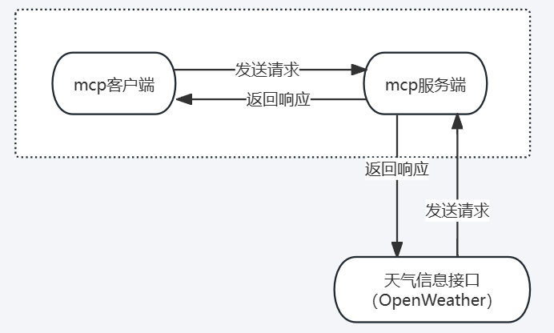

## 1、MCP基础知识
### 1.1 uv基础介绍
> uv入门基础只是MCP开发要求借助uv进行虚拟环境创建和依赖管理，uv是一个python依赖管理工具，类似于pip和conda，但是它更快，更高效，并且可以更好的管理Python虚拟环境和依赖项，它的核心目标是替代pip、venv和pip-tools，提供更好的性能和更低的管理开销。

* uv的特点
1、速度更快：相比于pip、uv采用Rust编写，性能更优。
2、支持PEP 582: 无需virtualenv,可以直接使用pypackages进行管理。
3、兼容pip：支持 requirements.txt和 pyproject.tom 依赖管理。
4、替代 venv ：提供 uv venv 进行虚拟环境管理，比 venv 更轻量。
5、跨平台：支持 Windows、macOS 和 Linux。

* 为什么MCP推荐使用uv进行环境管理？
MCP 依赖的 Python 环境可能包含多个模块，uv 通过 pyproject.toml 提供更高效的管理方式，并且可以避免 pip 的一些依赖冲突问题。此外，uv 的包管理速度远超 pip，这对于 MCP这样频繁管理依赖的项目来说是一个很大的优势。

### 1.2 uv场景命令
```shell
// 1、安装uv
pip install uv

// 2、安装python依赖
uv pip install requests

// 3、创建虚拟环境
uv venv myenv

// 4、激活虚拟环境
./myenv/bin/activate
// 如下日志表示进入创建的环境变量中
// PS D:\日常学习\mcp-project> .\mcp\Scripts\activate
// (mcp) PS D:\日常学习\mcp-project> 

// 5、安装requirements.txt依赖
uv pip install -r requirements.txt

// 6、运行python项目
uv run python myscript.py

// uv创建项目详细流程：
1、使用uv init project_name: 创建项目
2、使用uv venv: 创建虚拟环境
3、./.venv/Scripts/activate: 激活虚拟环境
4、uv add mcp: 安装依赖包
```
### 1.3 创建客户端
```python
import asyncio # 支持异步操作
from mcp import ClientSession  # MCP client会话管理
from contextlib import AsyncExitStack # 资源管理

class MCPClient:
  def __init__(self):
    """初始化MCP client"""
    self.session = None
    self.exit_stack = AsyncExitStack()

  async def content_to_mock_server(self):
    """模拟MCP服务器的连接（暂不连接真实服务器）"""
    print("MCP Client已初始化，但未连接到服务器")
  
  async def chat_loop(self):
    """运行交互式聊天循环"""
    print("\n MCP client已启动！输入'quit' 退出")
    while True:
      try:
        query = input("\nPrompt:").strip()
        if query.lower() == 'quit':
          break
        print(f"发送消息: {query}")
      except Exception as e:
        print(f"发生错误: {e}")

  async def cleanup(self):
    """清理资源"""
    await self.exit_stack.aclose()

async def main():
  client = MCPClient()
  try:
    await client.content_to_mock_server()
    await client.chat_loop()
  finally:
    await client.cleanup()

if __name__ == "__main__":
  asyncio.run(main())
```
## 2、MCP Client接入大模型
### 2.1 添加依赖
```shell
## 需要到一些大模型客户端的依赖：deepseek qwen ollama gpt等
uv add mcp openai python-dotenv
```
### 2.2 创建隐藏文件.env 添加配置信息
```shell
BASE_URL="代理地址"
MODEL=gpt-4o
OPENAI_API_KEY="openai的key"
```
### 2.3 Client代码设计如下
```python
import asyncio
import os
from openai import OpenAI
from dotenv import load_dotenv
from contextlib import AsyncExitStack
// 加载隐藏文件，确保API key 受到保护
load_dotenv('.env')

class MCPClient:
  def __init__(self):
    """初始化MCP client"""
    self.exit_stack = AsyncExitStack()
    self.openai_api_key = os.getenv("OPENAI_API_KEY")
    self.model = os.getenv("MODEL")

    if not self.openai_api_key:
      raise ValueError("请在.env文件中设置OPENAI_API_KEY")
    self.client = OpenAI(api_key=self.openai_api_key)

  async def process_query(self, query: str) -> str:
    """调用 OpenAI API处理用户查询"""
    messages = [
      {
        "role":"system",
        "content": "你是一个智能助手，帮助用户回答问题"
      },
      {
        "role": "user",
        "content": query
      }
    ]

    try:
      # 调用大模型API
      response = await asyncio.get_event_loop().run_in_executor(
        None,
        lambda: self.client.chat.completions.create(
          model=self.model,
          messages=messages
        )
      )
      return response.choices[0].message.content
    except Exception as e:
      return f"调用OpenAI API时出错: {e}"
    
  async def chat_loop(self):
    """运行交互式聊天循环"""
    print("\n MCP client已启动！输入'quit' 退出")
    while True:
      try:
        query = input("\nPrompt:").strip()
        if query.lower() == 'quit':
          break
        print(f"发送消息: {query}")
        response = await self.process_query(query)
        print(f"模型回复: {response}")
      except Exception as e:
        print(f"发生错误: {e}")
          
  async def cleanup(self):
    """清理资源"""
    await self.exit_stack.aclose()

async def main():
  client = MCPClient()
  try:
    await client.chat_loop()
  finally:
    await client.cleanup()
    
if __name__ == "__main__":
  asyncio.run(main())
```
## 3、MCP Server端设计
### 3.1 MCP Server概念介绍
> 根据MCP协议定义，Server可以提供三种类型的标准能力，Resources、Tools、Prompts，每个Server可同时提供者三种类型能力或其中一种。
* Resources: 资源，类似于文件数据读取，可以是文件资源或是API响应返回的内容。
* Tools: 工具，第三方服务、功能函数，通过此可控制LLM可调用哪些函数。
* Prompts: 提示词，为用户预先定义好的完成特定任务的模板。

### 3.2 MCP Server的通讯机制
> Model Context Protocol（MCP）由Anthropic开源，用于将大型语言模型直接连接数据源。它支持标准输入输出（stdio）和 基于HTTP的服务器推送事件（SSE）两种传输方式。Stdio模式  适用于本地通信，通过启动服务器作为子进程实现高效低延迟的数据交换，适合快速响应的本地应用。而基于HTTP和SSE的方式则适用于分布式或远程场景，实现客户端与服务器间实时数据推送。
* 1、本地通讯：使用了stdio传输数据，具体流程client启动server程序作为子进程，其消息通讯是通过stdin/stdout进行的，消息格式为JSON-RPC2.0。
* 2、远程通讯: c1ient与Server可以部署在任何地方, Client使用SSE与Server进行通讯，消息的格式为ISON-RPC 2.0，Server定义了/see与/messages接口用于推送与接收数据。

### 3.3 MCP实践之MCP代码实践

### 3.4 MCP Server案例——天气查询
```python
import json
import httpx
from typing import Any
from mcp.server.fastmcp import FastMCP

// 初始化MCP服务器
mcp = FastMCP("WeatherServer")
// OpenWeather API配置
OPENWEATHER_API_BASE = "https://api.openweathermap.org/data/2.5/weather"
API_KEY = "5c939a7cc59eb8696f4cd77bf75c5a9a"
USER_AGENT = "weather-app/1.0"
async def fetch_weather(city: str) -> dict[str, Any] | None:
  """
  从 OpenWeather API获取天气信息
  :param city: 城市名称（需使用英文，如beijing）
  :return: 天气数据字典：若出错返回包含 error 信息的字典
  """
  # https://openweathermap.org/current
  params = {
    "q": city,
    "appid": API_KEY,
    "units": "metric",
    "lang": "zh_cn"
  }
  headers = {
    "User-Agent":USER_AGENT
  }
  
  async with httpx.AsyncClient() as client:
    try:
      response = await client.get(OPENWEATHER_API_BASE, params=params, headers=headers, timeout=30.0)
      response.raise_for_status()
      data = response.json()
      return data
    except httpx.HTTPStatusError as e:
      return {"error": f"HTTP error occurred: {str(e)}"}
    except Exception as e:
      return {"error": f"An error occurred: {str(e)}"}

def format_weather(data: dict[str, Any] | str) -> str:
  """"将天气数据格式化为易读文本
  :param data: 天气数据（可以是字典或字符串）
  return: 格式化后的天气信息字符串
  """ 
  # 如果传入的是字符串，则先转化为字典
  if isinstance(data, str):
    try:
      data = json.loads(data)
    except Exception as e:
      return f"无法解析天气数据: {e}"
  # 如果数据中包含错误信息，则直接返回错误提示
  if "error" in data:
    return f"获取天气信息时出错: {data['error']}"
  # 获取数据时容错处理
  city = data.get("name", "未知城市")
  country = data.get("sys", {}).get("country", "未知")
  temp = data.get("main", {}).get("temp", "未知")
  humidity = data.get("main", {}).get("humidity", "未知")
  wind_speed = data.get("wind", {}).get("speed", "未知")
  # weather 可能是一个列表
  weather_list = data.get("weather", [{}])
  description = weather_list[0].get("description", "未知")

  return (
    f"城市{city}, 国家{country}\n"
    f"温度: {temp}°C\n"
    f"湿度: {humidity}%\n"
    f"风速: {wind_speed}m/s\n"      
    f"天气状况: {description}"
  )

@mcp.tool()
async def query_weather(city: str) -> str:
  """
  输入指定城市的英文名称，返回今日天气查询结果。
  :param city: 城市名称（需使用英文）
  :return: 格式化后的天气信息
  """
  data = await fetch_weather(city)
  return format_weather(data)

if __name__ == "__main__":
  mcp.run(transport="stdio")
```