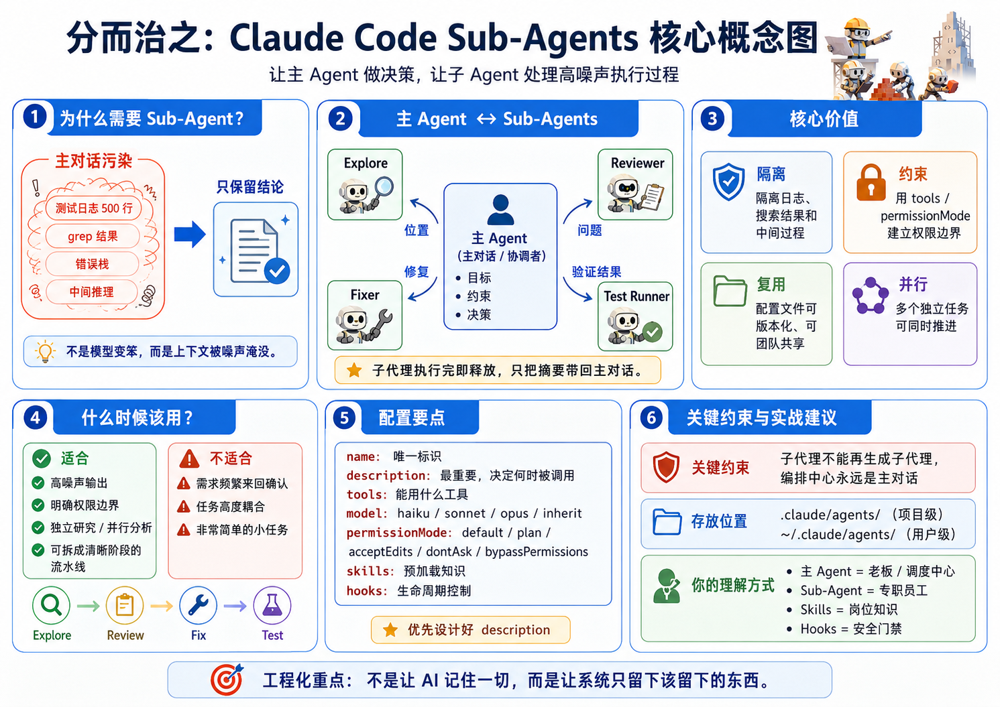

## 一、Sub-Agent 到底解决什么问题？

**Sub-Agent 解决的不是“模型不够聪明”，而是“上下文被污染”。**

你现在用 Claude Code 或 Codex 时，经常会这样：

- 你让它查项目结构，它输出一堆目录。
- 你让它 grep 代码，它输出一堆匹配结果。
- 你让它跑测试，它输出几百行日志。
- 你让它分析 bug，它又塞进去一堆中间推理。

最后主对话里堆满了这些东西。问题来了：

这些信息对“当时执行任务”有用，但对“后续继续决策”没什么价值。

比如测试日志 500 行，真正有价值的可能只有：

```txt
失败用例：xxx
失败原因：接口字段缺失
影响文件：src/views/order/index.vue
建议修复：补充空值判断
```

但是如果这 500 行日志都进了主对话，Claude 后面继续工作时，就会在一堆噪声里找重点。它不是“变笨了”，而是上下文被污染了。

所以 Sub-Agent 的第一价值是：

> 把执行过程隔离出去，只把结论带回来。

这就是文章里反复强调的“执行完即丢弃”。主 Agent 不要记住所有过程，只保留结构化结论。

## 二、主 Agent 和 Sub-Agent 是什么关系？

你可以这样理解：

**主 Agent = 项目负责人 / 调度中心**

**Sub-Agent = 专职员工 / 外包小组 / 临时调查员**

主 Agent 负责：

```txt
我要做什么？
目标是什么？
优先级是什么？
哪些事情要先做？
最后是否采纳结果？
```

Sub-Agent 负责：

```txt
去查认证逻辑在哪里。
去跑测试。
去审查代码。
去分析日志。
去总结影响范围。
```

重点是：**Sub-Agent 不是主 Agent 的替代品，它是主 Agent 派出去干活的执行单元。**

这点很关键。你不能把 Sub-Agent 理解成“更强的 Claude”。它不是更强，它只是职责更窄、上下文更干净、权限更明确。

你做前端开发，可以类比成：

```txt
主 Agent = Tech Lead
Sub-Agent = 代码审查员 / 测试员 / 日志分析员 / Bug 修复员
Skill = 员工手册 / 规范文档 / SOP
Hook = 流程检查器 / 门禁 / CI 校验
Command = 一键触发流程的按钮
Memory = 项目长期知识库
```



## 三、Sub-Agent 的三个核心价值：隔离、约束、复用

### 1. 隔离：防止上下文污染

这是最重要的。

就以 Sentry AI Fix Bot 为例，假设一个线上异常来了，完整链路可能是：

```txt
读取 Sentry Issue
↓
拉取事件详情
↓
分析 sourcemap
↓
查找源码
↓
定位相关组件
↓
分析提交历史
↓
生成修复建议
↓
修改代码
↓
跑 lint / test
↓
提交 MR
```

如果所有步骤都在主对话里跑，主对话会爆炸。

更合理的是：

```txt
主 Agent：我要修复 Sentry Issue 30078

log-analyzer 子代理：
分析 Sentry 日志，只返回错误原因和关键栈

source-locator 子代理：
定位源码，只返回相关文件和函数

fixer 子代理：
根据结论修改代码

test-runner 子代理：
跑测试，只返回是否通过和失败摘要

主 Agent：
汇总结果，决定是否提交 MR
```

这才是工程化 Agent。

### 2. 约束：把“你别乱动”变成“你动不了”

你不能只靠提示词说：

```txt
请你不要修改代码，只审查。
```

这不够可靠。

因为模型可能会“好心办坏事”，看到问题顺手改了。

Sub-Agent 的好处是可以限制工具权限：

```yaml
tools: Read, Grep, Glob
```

这意味着它只能读，不能写。

所以一个 code-reviewer 子代理，应该是：

```yaml
tools: Read, Grep, Glob
```

而不是：

```yaml
tools: Read, Write, Edit, Bash
```

你要建立一个意识：

> 只要这个角色不需要写代码，就不要给它写权限。

这就是最小权限原则。你以后做自动修复系统，如果不遵守这个原则，很容易变成“AI 自动改坏代码系统”。

### 3. 复用：把一次经验沉淀成工程资产

普通提示词是一次性的。今天写得好，明天可能找不到了。

Sub-Agent 配置文件可以放在：

```txt
.claude/agents/
```

然后进 Git 管理。

这意味着它变成团队资产。

比如前端团队可以沉淀：

```txt
.claude/agents/
├── vue-code-reviewer.md
├── react-code-reviewer.md
├── sentry-log-analyzer.md
├── bug-fixer.md
├── test-runner.md
├── mr-description-writer.md
└── frontend-architecture-reviewer.md
```

这就不是“我会用 AI”了，而是：

```txt
你把 AI 使用方式产品化、流程化、团队化了。
```

这对你现在的职业发展很关键。普通前端只是用 AI 写代码；更高级的前端会把 AI 变成团队工程系统。

## 四、什么时候该用 Sub-Agent？

你不要一上来什么都做 Sub-Agent。那是过度工程。

我给你一个判断标准：

> 如果执行过程很吵，但最终只需要一个结论，就适合 Sub-Agent。

适合用 Sub-Agent 的场景：

1. 搜索整个项目
2. 跑测试 / lint / build
3. 分析日志 / 错误栈
4. 审查代码
5. 分析影响范围
6. 生成 MR 描述
7. 对比多个技术方案
8. 分析一个复杂模块
9. 做安全扫描
10. 做前端性能问题定位

不适合用 Sub-Agent 的场景：

1. 需求还没想清楚，需要频繁讨论
2. 你只是改一个很小的样式
3. 你需要边聊边调整方案
4. 任务高度依赖主对话里的细节
5. 你自己都没定义清楚输入和输出

尤其最后一点很重要：Sub-Agent 不是用来替你想清楚任务的。它适合执行边界清晰的任务。

你现在经常会犯的一个问题是：想直接把一个模糊目标交给 Agent，比如“帮我优化项目”。这不适合直接派 Sub-Agent。

更好的方式是拆成：

```txt
先让 architecture-reviewer 分析项目结构
再让 performance-analyzer 分析性能风险
再让 code-reviewer 审查代码质量
最后主 Agent 汇总成优化计划
```

## 五、Sub-Agent 不能再调用 Sub-Agent，这点非常关键

子代理不能再生成子代理。

这意味着什么？

你不能设计成：

```txt
主 Agent
  ↓
code-reviewer 子代理
  ↓
security-reviewer 子代理
  ↓
test-runner 子代理
```

不行。

正确方式是：

```txt
主 Agent
  ├── 调用 code-reviewer
  ├── 调用 security-reviewer
  ├── 调用 test-runner
  └── 汇总结果
```

也就是说，编排中心永远是主对话。

这对你后面设计 Sentry AI Fix Bot 很重要。你的主流程应该是 orchestrator：

```txt
主流程：
1. 获取 Sentry Issue
2. 调用 log-analyzer
3. 调用 source-locator
4. 调用 fix-planner
5. 调用 bug-fixer
6. 调用 test-runner
7. 调用 mr-writer
8. 创建 MR
```

不要让某个子代理自己无限派活。否则系统会失控，也很难调试。

## 六、description 字段为什么最重要？

description 是最重要字段。

因为 Claude 是否自动调用某个 Sub-Agent，很大程度看 description。

差的写法：

```yaml
description: A code reviewer
```

这太模糊了。它只说“是什么”，没说“什么时候用”。

好的写法：

```yaml
description: Review Vue and React code changes for quality, maintainability, security risks, and frontend best practices. Use proactively after code is modified or when the user asks for code review.
```

它说清楚了两件事：

```txt
做什么：审查前端代码质量、安全风险、最佳实践
什么时候用：代码修改后，或用户要求 code review 时
```

你以后写 Sub-Agent，description 必须包含：

```txt
能力范围 + 触发时机 + 输出目标
```

比如 Sentry 日志分析 Agent：

分析 Sentry 的问题详情、堆栈跟踪、版本信息和事件上下文，以确定前端可能的根本原因。在修改代码前，用于调查 Sentry 中的生产环境错误。

这就比 “Analyze Sentry logs” 强很多。

## 七、tools、permissionMode、skills、hooks 怎么理解？

这几个字段你可以这样记。

### 1. tools：这个员工能用什么工具

```yaml
tools: Read, Grep, Glob
```

意思是：只能读文件、搜索文件、匹配路径。

适合 code-reviewer、log-analyzer、source-locator。

```yaml
tools: Read, Write, Edit, Bash, Grep, Glob
```

意思是：可以读、写、改、执行命令。

适合 bug-fixer、test-runner，但风险更高。

### 2. permissionMode：这个员工做事要不要请示

常见理解：

```txt
default：标准模式，需要确认就弹窗
plan：只读规划，适合分析和审查
acceptEdits：自动接受编辑，适合可信修复任务
dontAsk：不弹权限确认，但仍受已允许工具限制
bypassPermissions：跳过所有权限检查，慎用
```

你现在做自动修复系统，千万不要一开始就用：

```yaml
permissionMode: bypassPermissions
```

这很危险。

```yaml
permissionMode: default
```

或者修复类子代理：

```yaml
permissionMode: acceptEdits
```

但必须配合：

```yaml
tools: Read, Edit, Grep, Glob
```

先不要随便给 Bash，尤其不要让它随便执行删除、提交、推送之类命令。

### 3. skills：给员工提前加载专业手册

Sub-Agent 不会自动继承主对话里的所有 Skill。

所以如果你希望某个子代理懂你们项目规范，就要显式写：

```yaml
skills:
  - frontend-conventions
  - error-handling
  - sentry-debugging
```

```txt
Sub-Agent = 员工
Skill = 入职培训材料
CLAUDE.md = 公司总规章
Command = 标准操作按钮
Hook = 流程门禁
```

比如你做 sentry-bug-fixer，就可以给它加载：

```yaml
skills:
  - sentry-error-analysis
  - vue-error-boundary
  - frontend-fix-conventions
```

这样它不是凭空修，而是按你的团队规范修。

### 4. hooks：给员工装一个安全检查器

Hook 的价值是：不仅限制“能用什么工具”，还限制“工具能怎么用”。

比如你允许 db-reader 用 Bash，但只允许执行 SELECT：

```yaml
hooks:
  PreToolUse:
    - matcher: "Bash"
      hooks:
        - type: command
          command: "./scripts/validate-readonly-query.sh"
```

这比单纯说“不要写数据库”靠谱得多。

你以后做自动修复流程，也可以用 Hook 做这些事:

1. 修改前自动 git diff 检查
2. 禁止修改 package-lock / pnpm-lock，除非明确允许
3. 禁止修改 node_modules
4. 禁止删除 src 目录
5. 提交前必须跑 lint
6. MR 前必须生成变更摘要

这就是从“AI 写代码”进化到“AI 在工程护栏内写代码”。

## 八、项目级和用户级 Sub-Agent 怎么选？

文章里讲了几个存放位置。

你实际用的时候就按这个原则：

**项目级：放当前项目专用 Agent**

路径：

```txt
your-project/.claude/agents/
```

适合：

1. 项目特定架构
2. 团队共享
3. 要进 Git
4. 和业务强相关
5. 每个项目规则不同

比如：

```txt
baiying-intelligent-web/.claude/agents/
├── sentry-issue-analyzer.md
├── vue-page-reviewer.md
├── api-impact-analyzer.md
└── mr-description-writer.md
```

你的 Sentry AI Fix Bot 相关 Agent，应该优先放项目级。因为它们要理解你当前项目结构、团队规范、Sentry 规则。

**用户级：放个人通用 Agent**

路径：

```txt
~/.claude/agents/
```

适合：

1. 个人所有项目都能用
2. 和具体业务无关
3. 通用代码审查
4. 通用日志分析
5. 通用博客整理

比如：

```txt
~/.claude/agents/
├── blog-writer.md
├── generic-code-reviewer.md
├── git-helper.md
└── learning-coach.md
```

你不要把所有 Agent 都放用户级。那会变成一堆泛化垃圾。真正有价值的工程 Agent，大多数应该跟项目走。

## 九、从你的角度，Sub-Agent 最该怎么用？

你不要只是学会 `/agents` 怎么点。你应该直接围绕真实项目设计一套 Sub-Agent 工作流。

比如你的 Sentry AI Fix Bot，可以这样设计：

```txt
主 Agent：sentry-fix-orchestrator

1. sentry-context-analyzer
   读取 Sentry Issue、事件、堆栈、release，只输出错误摘要。

2. source-locator
   根据 sourcemap / stack trace / 文件名定位源码位置，只读。

3. impact-analyzer
   分析这个文件改动会影响哪些页面、组件、接口、状态管理。

4. fix-planner
   只生成修复方案，不改代码。

5. bug-fixer
   按方案改代码，只允许改相关文件。

6. test-runner
   跑 lint、typecheck、test，只返回结论和失败摘要。

7. mr-writer
   生成 MR 标题、描述、风险说明、验证结果。
```

这里需要注意权限：

```txt
sentry-context-analyzer：只读
source-locator：只读
impact-analyzer：只读
fix-planner：只读
bug-fixer：可 Edit，但限制范围
test-runner：可 Bash，但最好通过 Hook 限制命令
mr-writer：只读 + 写文本
```

这就非常像企业级 Agent 系统了。
