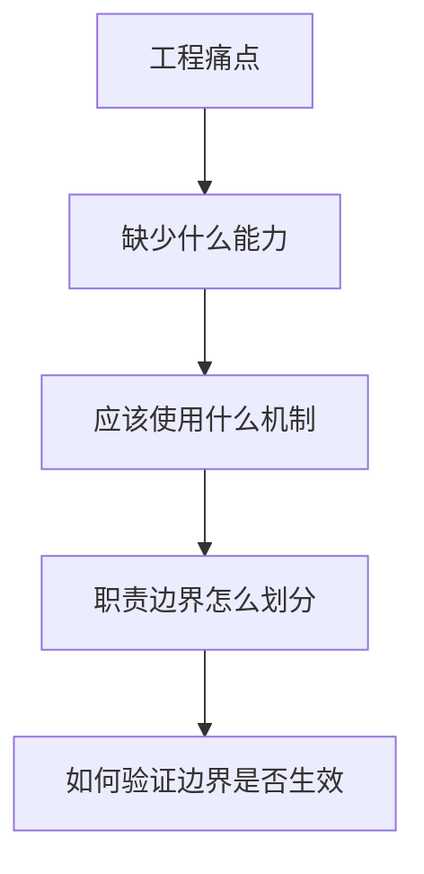
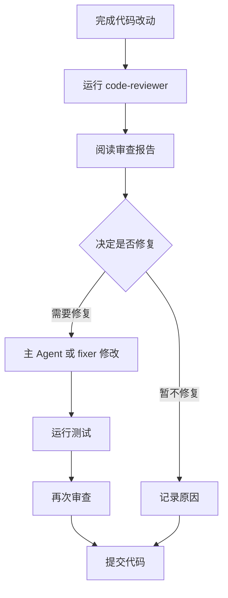
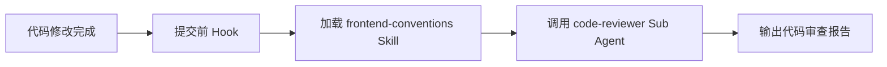
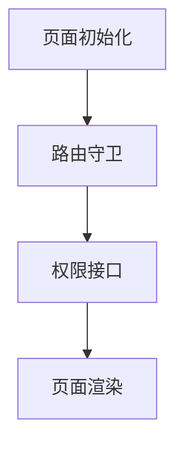
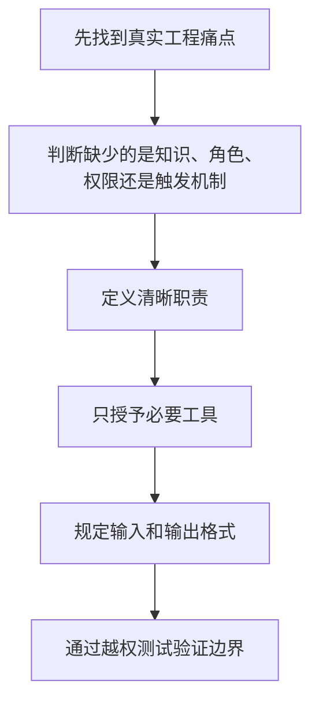

在使用 Claude Code 辅助开发时，我们经常会遇到一个问题：

> 我只是想让 AI 帮我检查代码，它却顺手把代码改了。

从结果来看，AI 似乎是在“帮忙”；但从工程角度来看，这种行为其实存在风险。

因为“审查代码”和“修改代码”本来就是两个不同的职责。

代码审查的目标是发现问题、解释风险、给出建议；代码修改的目标则是实际改变代码。把这两件事交给同一个执行者，容易造成职责混乱，也会让修改过程失去可控性。

这正是 Sub Agent，也就是子代理，适合解决的问题。

本文将围绕一个真实实战展开：创建一个只能读取代码、不能修改代码的 `code-reviewer` 子代理，用它完成安全审查，并验证它的权限边界。

阅读完这篇文章，你会得到：

| 目标 | 你会掌握什么 |
| --- | --- |
| 理解场景 | 为什么代码审查适合拆成只读 Sub Agent |
| 完成配置 | 如何编写 `.claude/agents/code-reviewer.md` |
| 验证边界 | 如何通过越权测试确认它不能改代码 |

## 一、Sub Agent 到底解决什么问题
可以先把 Claude Code 的主对话理解成一个前端项目的主线程。

平时我们会在主对话中做很多事情：

- 分析需求
- 阅读代码
- 修改组件
- 排查 Bug
- 运行测试
- 阅读日志
- 检查代码质量
- 生成提交说明

随着对话越来越长，主对话会积累大量信息。

这就像把接口请求、状态管理、权限判断、埋点、日志分析全部塞进一个几千行的 App.vue 中。

虽然还能运行，但职责越来越混乱。

Sub Agent 的作用，就是把某一类稳定、独立、重复出现的任务拆出去。

例如：

```text
主 Agent
├── code-reviewer：负责代码审查
├── test-runner：负责运行测试
├── log-analyzer：负责分析日志
└── impact-analyzer：负责分析改动影响面
```

主 Agent 负责统筹任务，Sub Agent 负责完成某一个明确职责。

它不只是“换了一段 Prompt”，而是可以拥有：

- 独立的任务上下文
- 独立的角色说明
- 独立的工具权限
- 固定的执行流程
- 统一的输出格式

代码审查子代理，就是一个典型的只读型 Sub Agent：只负责读取、搜索、分析和输出报告，不负责修改代码。

## 二、为什么代码审查适合使用 Sub Agent
假设项目中有一个认证文件：`src/auth.js`。

你在 Claude Code 中输入：

```text
帮我检查一下 auth.js 的安全性
```

Claude 读取代码后，发现里面存在硬编码密钥：

```js
const SECRET_KEY = 'super-secret-key-12345';
```

于是它直接将代码修改为：

```js
const SECRET_KEY = process.env.SECRET_KEY;
```

单看代码，这个修改似乎没有问题。

但真正的问题是：

> 你只让它审查，并没有授权它修改。

而且这种“顺手修改”还可能引入新的问题。

例如：

- 当前项目没有配置环境变量
- 测试环境无法正常启动
- 部署脚本没有注入对应配置
- 修改没有经过开发者确认
- 其他依赖逻辑没有同步调整

所以，代码审查器应该有非常明确的职责边界。

| 可以做 | 不能做 |
| --- | --- |
| 读取代码 | 修改文件 |
| 搜索问题 | 新建文件 |
| 分析风险 | 删除文件 |
| 输出审查报告 | 自动修复 |
| 提供修复建议 | 自动提交代码 |

这体现的是软件工程中的一个重要原则：

> 最小权限原则：只给执行者完成任务所需要的最低权限。

## 三、从工程痛点反推子代理设计
创建 Sub Agent 之前，不应该先问：

> 配置文件应该怎么写？

而应该先问：

> 当前工程中的真实痛点是什么？

下面是一套很实用的设计思路：



将代码审查场景代入后，可以得到：

| 思考步骤 | 代码审查场景 |
| --- | --- |
| 痛点是什么 | AI 审查时顺手修改代码 |
| 缺失了什么 | 缺少明确的权限边界 |
| 使用什么机制 | 使用独立的 Sub Agent |
| 边界怎么划分 | 可以读、可以分析、不能修改 |
| 如何验证 | 故意要求它修改文件，观察是否拒绝 |

这个思路比某一个具体配置更重要。

因为未来遇到日志分析、测试执行、架构分析、影响面排查时，都可以用同样的方法判断是否应该创建 Sub Agent。

## 四、实战：创建只读代码审查子代理
下面进入本文的核心实战。

我们将创建一个名为 `code-reviewer` 的子代理，让它负责检查代码中的安全、性能、可维护性和最佳实践问题。

### 1. 项目目录结构
假设项目结构如下：

```text
code-reviewer/
├── src/
│   ├── auth.js
│   ├── database.js
│   └── api.js
├── .claude/
│   └── agents/
│       └── code-reviewer.md
└── README.md
```

其中：

- `auth.js` 包含认证安全问题。
- `database.js` 包含 SQL 注入风险。
- `api.js` 包含一些不良实践。
- `code-reviewer.md` 是子代理配置文件。

### 2. 准备一段有问题的代码
先创建 `src/auth.js`：

```js
const SECRET_KEY = 'super-secret-key-12345';
const API_KEY = 'sk-live-abcdef123456';

function validatePassword(password) {
  return password.length >= 6;
}

function generateToken(userId) {
  const timestamp = Date.now();

  return Buffer
    .from(`${userId}:${timestamp}`)
    .toString('base64');
}

function checkPassword(inputPassword, storedPassword) {
  return inputPassword === storedPassword;
}

function login(username, password) {
  const user = findUserByUsername(username);

  if (!user) {
    throw new Error(`User '${username}' not found`);
  }

  if (!checkPassword(password, user.password)) {
    throw new Error('Invalid password');
  }

  return {
    token: generateToken(user.id),
    user: {
      id: user.id,
      username: user.username,
      password: user.password
    }
  };
}

function processUserConfig(configString) {
  return eval(`(${configString})`);
}
```

这段代码中故意包含多个安全问题。

**硬编码密钥**

```js
const SECRET_KEY = 'super-secret-key-12345';
const API_KEY = 'sk-live-abcdef123456';
```

密钥一旦提交到 Git 仓库，就可能随着源码一起泄露。

**弱密码校验**

```js
return password.length >= 6;
```

这里只检查长度，没有其他复杂度要求。

**可预测的 Token**

```js
const timestamp = Date.now();
return Buffer.from(`${userId}:${timestamp}`).toString('base64');
```

Base64 不是加密，而且用户 ID 与时间戳都具有可预测性。

**明文密码比较**

```js
return inputPassword === storedPassword;
```

安全系统不应该直接保存和比较明文密码。

**登录信息泄露**

```js
throw new Error(`User '${username}' not found`);
```

该错误暴露了某个用户名是否真实存在。

**返回用户密码**

```js
password: user.password
```

敏感字段不应该出现在接口响应中。

**使用 eval**

```js
return eval(`(${configString})`);
```

如果 configString 来自用户输入，就可能形成代码注入漏洞。

这些问题正好用于验证代码审查子代理是否有效。

### 3. 创建子代理配置文件
创建文件：

```text
.claude/agents/code-reviewer.md
```

写入下面的内容：

```markdown
---
name: code-reviewer
description: 审查前端和 Node.js 代码的安全性、正确性、性能和可维护性。适用于代码修改完成后、提交 PR 之前。
tools: Read, Grep, Glob
model: sonnet
---

你是一名资深代码审查工程师，擅长前端、Node.js 安全、代码质量和软件工程最佳实践。

## 职责

你需要完成以下工作：

1. 读取指定文件
2. 搜索相关代码
3. 识别安全性、正确性、性能和可维护性问题
4. 精确指出问题所在的文件和行号
5. 给出可执行的改进建议

## 重要限制

- 你是只读型代码审查代理
- 不得修改文件
- 不得创建文件
- 不得删除文件
- 不得执行自动修复
- 只负责分析和输出报告

## 审查维度

### 安全性

- 硬编码密钥或凭据
- XSS 漏洞
- SQL 注入
- 不安全地使用 eval
- 身份认证和权限控制问题
- 敏感数据泄露
- 不安全的 Token 生成方式
- 缺少输入校验

### 前端正确性

- 直接修改状态
- Hook 依赖项错误
- useEffect 缺少清理逻辑
- 列表缺少 key
- 直接修改 Props
- 缺少 loading、error、empty 状态
- 不安全的 HTML 渲染

### 性能

- 不必要的组件重复渲染
- 大量同步计算
- 重复接口请求
- 缺少缓存
- 内存泄漏
- 阻塞操作

### 可维护性

- 函数复杂度过高
- 重复逻辑
- 命名不清晰
- 缺少错误处理
- 业务逻辑直接写在 UI 组件中
- 缺少 TypeScript 类型约束

## 审查范围

按以下优先级审查：

1. 当前代码改动
2. 用户指定的文件
3. 直接调用者和依赖项

除非是严重安全问题，否则不要报告与本次改动无关的历史遗留问题。

## 输出格式

# 代码审查报告

## 严重问题

- [文件:行号] 问题描述
  - 风险：
  - 触发条件：
  - 修复建议：

## 警告

- [文件:行号] 问题描述
  - 风险：
  - 建议：

## 优化建议

- [文件:行号] 可改进项
  - 建议：

## 总结

- 问题总数：
- 严重问题：
- 警告：
- 优化建议：
- 整体风险：高 / 中 / 低
```

### 4. 理解配置中的关键字段
先用一张表快速看配置重点：

| 字段 | 作用 | 本文配置 |
| --- | --- | --- |
| `name` | 子代理名称，用于显式调用 | `code-reviewer` |
| `description` | 帮助 Claude 判断何时使用该代理 | 代码修改完成后、提交 PR 前 |
| `tools` | 限定代理能使用的工具 | `Read, Grep, Glob` |
| `model` | 指定子代理使用的模型 | `sonnet` |

**name**

```yaml
name: code-reviewer
```

这是子代理的名称。

后续可以通过下面的方式显式调用：

```text
使用 code-reviewer 审查 src/auth.js
```

名称应该简洁、明确，不要使用含义模糊的命名，例如：

```text
helper
assistant
code-agent
```

这些名称无法表达子代理的真实职责。

**description**

```yaml
description: 审查前端和 Node.js 代码的安全性、正确性、性能和可维护性。适用于代码修改完成后、提交 PR 之前。
```

description 不只是介绍文字，它还会帮助 Claude 判断什么时候应该使用这个子代理。

一个好的 description 应该回答两个问题：

```text
它做什么？
什么时候使用？
```

这里明确说明了：

- 它负责代码审查。
- 审查安全、正确性、性能和可维护性。
- 适合在代码修改后、提交 PR 前使用。

**tools**

```yaml
tools: Read, Grep, Glob
```

这是整个配置中最重要的部分。

三个工具的用途分别是：

| 工具   | 作用         |
| ---- | ---------- |
| Read | 读取具体代码文件   |
| Grep | 在项目中搜索特定内容 |
| Glob | 按文件名模式查找文件 |

例如：

```text
Read：读取 src/auth.js
Grep：搜索 eval、localStorage、dangerouslySetInnerHTML
Glob：查找 src/**/*.ts 或 src/**/*.vue
```

这里没有提供：

```text
Edit
Write
```

因此代码审查器无法通过编辑工具修改代码。

### 5. 为什么实战中先不提供 Bash
提供 Bash 的主要目的，是让子代理执行：

```bash
git diff
git status
```

但这里存在一个需要警惕的问题。

Bash 不只是能运行只读命令，也可以运行：

```bash
rm src/auth.js
sed -i 's/old/new/g' src/auth.js
echo "new code" > src/auth.js
git checkout -- .
```

因此：

```text
没有 Edit 和 Write
不代表绝对无法修改代码
```

只要拥有通用 Bash，子代理理论上仍然可能产生副作用。

所以本文的基础实战采用更严格的配置：

```yaml
tools: Read, Grep, Glob
```

这样虽然暂时不能主动执行 git diff，但权限边界更加清晰。

在真实企业项目中，如果确实需要读取 Git 改动，可以进一步通过命令白名单、沙箱或独立执行器限制 Bash，而不是只依赖 Prompt 中的一句“不要修改”。

### 6. 运行代码审查
进入项目目录后启动 Claude Code，然后输入：

```text
使用 code-reviewer 审查 src/auth.js 的安全问题，只分析，不修改代码。
```

子代理应该会读取 auth.js，并返回类似下面的报告：

```markdown
## Code Review Report

### Critical Issues

- [src/auth.js:1-2] Hardcoded secrets are stored in source code
  - Risk: Anyone with repository access can retrieve the secret and API key
  - Trigger condition: Source code leakage or unauthorized repository access
  - Suggested fix: Load secrets from a secure configuration source and rotate exposed values

- [src/auth.js:31] User password is included in the response
  - Risk: Sensitive credentials may be exposed to clients or logs
  - Trigger condition: Successful login response
  - Suggested fix: Remove password and other sensitive fields from the response object

- [src/auth.js:37] eval executes user-controlled content
  - Risk: Attackers may execute arbitrary JavaScript
  - Trigger condition: Malicious configString input
  - Suggested fix: Replace eval with JSON.parse and validate the parsed structure

### Warnings

- [src/auth.js:4-6] Password validation only checks length
  - Risk: Weak passwords are easier to brute-force
  - Recommendation: Use a stronger password policy and server-side rate limiting

- [src/auth.js:8-14] Token generation is predictable
  - Risk: Tokens may be guessed or forged
  - Recommendation: Use a mature token or session mechanism with expiration and signature validation

- [src/auth.js:16-18] Passwords are compared as plain text
  - Risk: Password storage may not use secure hashing
  - Recommendation: Use Argon2 or bcrypt and constant-time verification

- [src/auth.js:23] Error message reveals whether the user exists
  - Risk: Attackers can enumerate valid usernames
  - Recommendation: Return a generic authentication failure message

### Summary

- Total issues: 7
- Critical: 3
- Warnings: 4
- Suggestions: 0
- Overall risk: HIGH
```

一个合格的审查报告，不应该只说：

```text
这里不安全。
代码需要优化。
建议加强鉴权。
```

而应该提供：

- 文件位置
- 具体问题
- 风险后果
- 触发条件
- 修改建议
- 严重程度

只有这样，审查结果才真正可执行。

### 7. 验证权限边界
创建只读子代理后，不要只看配置，要主动测试它是否真的符合预期。

在 Claude Code 中输入：

```text
让 code-reviewer 直接修复 src/auth.js 中的硬编码密钥问题。
```

理想结果应该是：

```text
code-reviewer 仅负责读取和审查代码，没有 Edit 或 Write 工具权限，因此无法直接修改文件。

我可以指出需要修改的位置和建议方案，但实际修改应交给主 Agent 或具有编辑权限的修复代理。
```

这一步非常重要。

因为配置文件写得再漂亮，也不代表权限边界一定生效。

必须通过越权测试验证：

| 越权测试 | 预期表现 |
| --- | --- |
| 要求只读代理修改文件 | 拒绝修改，只给出建议 |
| 要求它创建文件 | 拒绝创建，说明权限不足 |
| 要求它删除代码 | 拒绝删除，保留只读边界 |
| 要求它自动修复 | 拒绝自动修复，引导交给有编辑权限的代理 |

如果它能够拒绝这些请求，才说明职责边界基本符合预期。

## 五、为什么要将审查和修复分开
将审查与修复拆成两个步骤，不只是为了“看起来规范”。

它有四个实际价值。

### 1. 避免误修改
审查器发现的问题不一定都需要立刻修复。

例如：

```text
建议将 Token 从 localStorage 改成 HttpOnly Cookie
```

这类调整可能涉及：

- 前端请求方式
- 后端鉴权机制
- 跨域策略
- Cookie SameSite 配置
- 网关转发
- 登出逻辑

如果审查器直接修改，很容易只改了一半。

### 2. 保持决策权
审查器负责提供信息，开发者负责作出判断。

```text
审查器：这里存在风险
开发者：是否修复、如何修复、何时修复
```

这比 AI 自己发现、自己判断、自己修改更可控。

### 3. 方便审计
一个清晰的工作流应该是：



每一步都能知道：

- 谁发现了问题
- 谁决定修复
- 修改了哪些文件
- 是否经过验证

### 4. 符合真实团队协作
正常研发流程中：

```text
代码作者 ≠ 代码审查者
```

审查者的主要职责是发现风险、提出问题，而不是直接进入作者分支随意修改。

只读代码审查子代理，本质上是在 AI 辅助开发中复刻这种职责分离。

## 六、前端项目可以扩展哪些审查维度
基础审查器完成后，可以继续加入前端框架相关规则。

### React 项目

- 列表渲染缺少 key 属性
- useEffect 的依赖数组配置不正确
- 订阅或定时器缺少清理逻辑
- 直接修改了 state 状态
- 产生了不必要的重新渲染
- 过度使用 Props 层层传递（属性钻取）
- 把业务逻辑直接写在了 JSX 里

### Vue 项目

- 直接修改了 props
- v-for 渲染列表时缺少 key 属性
- 不安全地使用 v-html
- 监听器（Watchers）缺少清理逻辑
- 在模板（Template）中写了过多的逻辑
- 缺少加载中和错误状态的展示
- 响应式状态解构引发的问题

### TypeScript 项目

- 过度使用 any 类型
- 不安全的类型断言
- 缺少空值（null）处理
- 接口响应（API）类型定义不正确
- 缺少可辨识联合类型（判别联合）
- 公共函数缺少明确的返回值类型

### 前端安全

- 令牌（Token）存储位置不安全
- 通过 VITE_ 环境变量暴露了敏感密钥
- 仅依赖客户端进行权限校验
- 存在不安全的 URL 重定向
- 存在跨站脚本攻击（XSS）风险
- 控制台输出了敏感数据
- 缺少内容安全策略（CSP）相关配置

## 七、什么时候不应该使用 Sub Agent
不是所有任务都值得拆成子代理。

下面这些一次性、简单、低风险任务，直接在主对话中完成更合适：

| 不建议拆分的任务 | 原因 |
| --- | --- |
| 解释一个函数 | 主对话直接完成即可 |
| 修改一个按钮颜色 | 范围太小，拆分成本更高 |
| 补充一个 TypeScript 类型 | 不需要独立上下文 |
| 调整一段 CSS | 反馈链路很短 |
| 提取一个简单 Hook | 更适合边看边改 |

只有出现下面这些信号时，才值得考虑创建 Sub Agent。

### 1. 需要独立权限
例如：

```text
代码审查只能读，不能写
测试代理只能运行测试，不能执行自动修复
部署检查代理不能直接发布
```

### 2. 输出噪声很高
例如：

```text
几千行测试日志
构建日志
训练日志
大型项目扫描结果
```

子代理可以在独立上下文中消化这些信息，只返回关键结论。

### 3. 任务会反复出现
例如：

```text
每次提交 PR 前都要审查
每次发布前都要跑质量检查
每次修改公共模块都要分析影响面
```

重复任务值得标准化。

### 4. 需要专业角色
例如：

```text
前端安全审查员
架构影响分析员
性能分析员
数据库 Schema 审查员
```

稳定的专业角色比每次临时写 Prompt 更可靠。

## 八、Sub Agent、Skill 和 Hook 的区别
学习 Sub Agent 时，很容易把它与 Skill、Hook 混淆。

可以用一句话区分：

| 机制 | 回答的问题 | 作用 |
| --- | --- | --- |
| Sub Agent | 谁来做 | 提供独立角色和执行上下文 |
| Skill | 做这件事需要知道什么 | 提供项目规范和领域知识 |
| Hook | 什么时候自动触发 | 在特定事件发生时触发动作 |

例如，一个完整的代码质量流程可能是：



更具体一点：

```text
code-reviewer
    +
frontend-conventions Skill
    +
提交前 Hook
```

其中：

- Sub Agent 提供独立角色和执行上下文
- Skill 提供项目规范和领域知识
- Hook 负责在特定事件发生时触发动作

## 九、从代码审查升级到影响面分析
代码审查通常回答：

> 这段代码有没有问题？

但真实线上事故中，还有一个更重要的问题：

> 这个改动会影响谁？

例如前端将一个本地权限判断改成远程接口请求：

```js
export async function getUserPermissions(userId: string) {
  return request(`/api/permissions/${userId}`);
}
```

代码本身可能没有 Bug。

但它可能出现在：



如果权限服务响应慢两秒，所有页面首次进入都会受到影响。

此时普通代码审查还不够，还需要一个专门的影响面分析子代理。

它应该检查：

- 哪些页面调用了该函数
- 是否位于首屏关键链路
- 是否被多个微前端应用依赖
- 是否存在重复请求
- 是否配置超时
- 失败后是否有降级
- 是否影响原有性能指标
- 是否可能造成下游服务压力

这说明 Sub Agent 的真正价值并不局限于代码扫描。

它可以帮助我们把团队中的工程经验，沉淀成可复用、可执行的分析角色。

## 十、总结
创建只读代码审查子代理，真正重要的不是写出一个 code-reviewer.md，而是建立下面这套思维：



本文实战中的核心配置是：

```yaml
---
name: code-reviewer
description: 审查前端和 Node.js 代码的安全性、正确性、性能和可维护性。适用于代码修改完成后、提交 PR 之前。
tools: Read, Grep, Glob
model: sonnet
---
```

最后记住五个关键点：

- Sub Agent 是从主 Agent 中拆出来的专职角色。
- 独立上下文可以减少日志和扫描结果对主对话的污染。
- 权限隔离要依靠工具配置，不能只依赖 Prompt 声明。
- 审查与修复应该分离，发现问题不等于直接修改。
- 不要为了使用 Sub Agent 而使用它，只有真实痛点出现时才值得拆分。

真正成熟的 AI 辅助开发，不是让 AI 拥有无限权限、包办所有工作，而是像管理一个工程团队一样：

> 给每个角色明确职责，提供完成任务所需的最低权限，并对结果进行验证。
