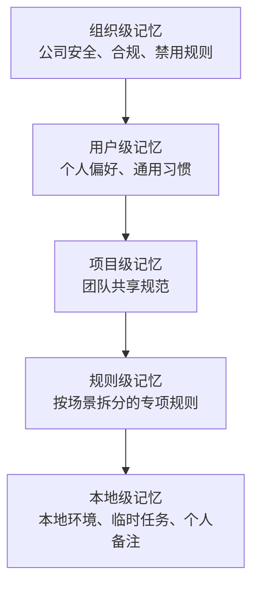

> 最近我在继续梳理 Claude Code 的工程化能力，发现 `Memory` 这一块特别容易被低估。很多人以为它只是“让 AI 记住一些话”，但真正用到项目里之后会发现，记忆系统本质上是在解决一个更工程化的问题：如何让 AI 每次进入项目时，都不再像刚入职的新人。

如果说普通聊天式 AI 的问题是“每次都要重新解释背景”，那么 Claude Code 的记忆系统要解决的就是：

```txt
把重复沟通的项目共识，沉淀成长期有效的默认规则。
```

这篇文章不只是介绍 `CLAUDE.md` 怎么写，而是结合我自己的理解，把 Claude Code 的记忆系统拆成几个层次来看：它解决什么问题、加载哪些文件、每一层适合放什么、怎么写才真的有效，以及在真实工程项目里应该怎么落地。

## 一、为什么 Claude Code 需要记忆系统？

在使用 Claude Code 的过程中，我发现一个非常真实的问题：

> AI 很聪明，但如果没有长期上下文，它每次都像一个新来的同事。

比如第一次让它写接口时，它可能默认使用 `Express + JavaScript`；但你的项目实际是 `Fastify + TypeScript`。

你提醒它之后，它能改。但下一次新会话，它可能又忘了。

再比如你反复提醒它：

```txt
我们项目使用 pnpm，不使用 npm。
这个项目是 TypeScript 项目。
不要修改无关文件。
不要为了消除报错删除业务逻辑。
修复完成后要跑 type-check 和 build。
不要硬编码 token、cookie、密钥。
```

如果只是写一个小 demo，这些重复沟通还可以接受。但一旦进入真实工程项目，比如前端业务系统、Sentry 自动修复工具、AI Agent 工程、GitLab MR 流程，这种重复交代背景的成本会越来越高。

`CLAUDE.md` 的价值就在这里。

一句话理解：

> `CLAUDE.md` 是给 Claude Code 的项目入职手册。

它让 Claude Code 每次进入项目时，先读取项目规则，再开始工作。这样它就不是在空白上下文里自由发挥，而是在项目约束、团队规范和交付流程内行动。

## 二、CLAUDE.md 不是 README，而是 AI 工作协议

很多人第一次接触 `CLAUDE.md`，容易把它当成 README。

但它们的定位不一样。

`README.md` 主要是给人看的，它回答的是：

```txt
这个项目是什么？
怎么安装？
怎么启动？
怎么部署？
怎么参与贡献？
```

`CLAUDE.md` 是给 Claude Code 看的，它更关心：

```txt
这个项目用什么技术栈？
代码应该怎么组织？
哪些文件不能乱动？
修改代码之前要先做什么？
常用检查命令是什么？
什么情况可以直接修，什么情况只能先分析？
```

所以 `CLAUDE.md` 的核心价值不是“记录信息”，而是“约束工作方式”。

比如下面这种内容，对 Claude Code 是有用的：

```md
# 项目规则

## 技术栈
- Vue 3 + TypeScript + Vite
- 包管理器使用 pnpm
- UI 组件优先使用项目已有组件，不随意引入新依赖

## 修改规则
- 不要重写无关代码
- 保持现有 API 行为，除非用户明确要求变更
- UI 修改要延续现有布局和风格
- 修复 bug 时优先做最小必要修改

## 检查命令
- pnpm type-check
- pnpm build
```

相比之下，下面这种写法就比较弱：

```md
请写高质量代码。
请保持代码整洁。
请遵循最佳实践。
```

这些话没有错，但对 AI 帮助不大。

因为 Claude 本来就知道“要写高质量代码”。真正有价值的是告诉它：

> 在这个项目里，什么才叫高质量代码？

## 三、记忆系统是如何工作的？

Claude Code 启动后，大致会经历这样一个过程：


可以把它理解成：

```txt
Claude 先读项目手册，再开始干活。
```

常见会被加载或使用的记忆入口包括：

```txt
用户级记忆：~/.claude/CLAUDE.md
项目级记忆：./CLAUDE.md 或 ./.claude/CLAUDE.md
本地级记忆：./CLAUDE.local.md
规则级记忆：.claude/rules/*.md
自动记忆：~/.claude/projects/<project>/memory/
```

这里要注意一个边界：

> `CLAUDE.md` 是指导模型工作的上下文，不是强制拦截机制。

也就是说，你可以在 `CLAUDE.md` 里写“不要修改 `.env.production`”，这会显著提高 Claude 遵守规则的概率。但如果你要做工程级强制拦截，还是应该结合 `Hooks`、权限配置、CI 检查或者代码审查。

这个区别很重要。

`Memory` 负责告诉 AI 应该怎么做；`Hooks` 和 CI 才负责在关键节点兜底。

## 四、Claude Code 里几种上下文机制的区别

Claude Code 不只有 `CLAUDE.md` 一种上下文方式。结合我前面学到的 Command、Skill、SubAgent、Hooks，可以这样区分：

| 机制 | 加载方式 | 适合内容 | 我的理解 |
| --- | --- | --- | --- |
| `CLAUDE.md` | 会话启动或进入项目时读取 | 长期稳定的项目规则 | 项目手册 |
| `.claude/rules/*.md` | 按规则和场景补充 | 某类文件、某类任务的专项规范 | 条件规则 |
| `Skills` | 任务匹配时按需加载 | 专业领域方法论 | 专家能力 |
| `Commands` | 用户手动输入 `/command` 触发 | 固定操作流程 | 标准作业流程 |
| `Hooks` | 特定事件自动触发 | 强制检查、安全红线 | 工程兜底 |
| `@` 引用 | 用户手动引用文件或目录 | 临时参考资料 | 临时上下文 |
| Auto Memory | Claude 自动沉淀 | 项目实践中学到的经验 | 经验缓存 |

这里最容易搞混的是 `CLAUDE.md`、`Commands` 和 `Skills`。

我的理解是：

```txt
CLAUDE.md 管长期共识。
Command 管固定流程。
Skill 管专业能力。
Hooks 管强制边界。
```

比如一个前端项目：

`CLAUDE.md` 适合写：

```txt
项目技术栈
目录结构
组件规范
代码风格
分支规范
PR 规范
常用命令
禁止事项
```

`Command` 适合封装：

```txt
/fix-and-pr
/create-mr
/review-code
/generate-release-note
```

`Skill` 适合沉淀：

```txt
如何分析 Sentry issue
如何写高质量 MR 描述
如何做前端性能优化
如何排查 sourcemap 问题
如何评估 UI 修改风险
```

这样 Claude Code 就不再只是一个聊天工具，而是逐渐变成一套可复用的工程协作系统。

## 五、我理解的五层记忆架构

Claude Code 的记忆可以按作用范围分层。越高层越通用，越低层越贴近具体项目和本地环境。



可以用下面这张表快速理解：

| 层级 | 位置示例 | 适合放什么 |
| --- | --- | --- |
| 组织级 | Linux: `/etc/claude-code/CLAUDE.md`，Windows: `C:\Program Files\ClaudeCode\CLAUDE.md` | 安全、合规、禁用项 |
| 用户级 | `~/.claude/CLAUDE.md` | 个人沟通偏好、通用代码习惯 |
| 项目级 | `./CLAUDE.md` 或 `./.claude/CLAUDE.md` | 团队共享的项目规则 |
| 规则级 | `.claude/rules/*.md` | 按文件类型或任务类型拆分的规则 |
| 本地级 | `./CLAUDE.local.md` | 本地环境、临时任务、个人备注 |

这几层不是为了复杂而复杂，而是为了避免把所有东西都塞进一个文件里。

如果所有规则都写进 `CLAUDE.md`，它很快会变成一个巨大的上下文包。每次会话都加载，token 成本高，重点也会被稀释。

### 1. 组织级记忆：公司统一要求

组织级记忆通常由公司 IT、DevOps 或平台团队统一配置。

它适合放：

```txt
安全要求
合规要求
禁用依赖
日志脱敏规则
生产环境访问限制
密钥管理规范
```

比如：

```md
## 安全要求
- 禁止在代码中硬编码密钥
- 禁止直接访问生产数据库
- 日志中不得输出用户隐私信息
- 不得把 token、cookie、密钥写入提交记录
```

如果是个人开发者或小团队，这一层可以先不用管。

### 2. 用户级记忆：个人通用偏好

位置：

```txt
~/.claude/CLAUDE.md
```

这一层是跨项目生效的。

比如你可以放：

```md
# 我的通用偏好

## 沟通方式
- 默认使用中文回复
- 技术问题先给结论，再给步骤
- 对风险点要直接指出
- 不要长篇铺垫

## 代码习惯
- TypeScript 项目优先保持类型安全
- 不要随意引入新依赖
- 修改前先说明影响范围
- 优先小步修改，不做无关重构

## 常用环境
- Windows + PowerShell
- 前端项目优先使用 pnpm
- Git 平台主要使用 GitHub / GitLab
```

这一层对同时做多个项目的人很有用。

因为无论是前端项目、AI Agent 工程、Sentry 自动修复工具，还是脚手架工具，你都会有一些稳定偏好。这些偏好没有必要在每个项目里重复写。

### 3. 项目级记忆：团队共享规范

位置：

```txt
./CLAUDE.md
```

这是最常用、也最重要的一层。

它应该提交到 Git，让团队成员共享。

比如一个前端项目可以这样写：

```md
# 项目：业务前端系统

## 技术栈
- Vue 3
- TypeScript
- Vite
- pnpm
- Element Plus

## 目录结构
- src/components：通用组件
- src/views：页面
- src/api：接口请求
- src/composables：复用逻辑
- src/utils：工具函数
- src/types：类型定义

## 编码规则
- 页面组件不要直接写复杂业务逻辑
- 可复用逻辑优先抽到 composables
- API 请求统一放在 src/api
- 类型定义统一放到 src/types
- 不允许通过 as any 绕过类型错误

## 修改规则
- 不要重写无关代码
- 保持现有 API 行为
- UI 修改要保持现有布局和风格
- 异步请求必须处理 loading、error、empty 状态

## 常用命令
- pnpm dev
- pnpm type-check
- pnpm build
```

这个文件的作用是让 Claude Code 不再自由发挥，而是在项目规则内工作。

### 4. 规则级记忆：按场景拆分专项规范

位置：

```txt
.claude/rules/*.md
```

当项目变大以后，不建议把所有规范都写进 `CLAUDE.md`。

比如你可以拆成：

```txt
.claude/rules/typescript.md
.claude/rules/testing.md
.claude/rules/security.md
.claude/rules/api.md
.claude/rules/frontend-ui.md
```

测试规则可以这样写：

```md
---
paths:
  - "src/**/*.test.ts"
  - "src/**/*.spec.ts"
---

# 测试规范

- 使用 Vitest
- 优先测试用户行为，不测试实现细节
- 测试文件放在同目录
- 修复测试失败时先解释失败原因，再做最小修改
```

这样做的好处是：

```txt
不是每次对话都需要测试规范。
不是每次修改都涉及 API 设计。
不是每次任务都需要完整安全清单。
```

规则拆出来之后，`CLAUDE.md` 可以保持轻量，只承担“项目导航”和“核心边界”的作用。

### 5. 本地级记忆：自己的临时工作空间

位置：

```txt
./CLAUDE.local.md
```

这个文件通常不应该提交到 Git。

它适合放：

```txt
本地环境
测试账号
临时 URL
当前任务
个人调试备注
阶段性决策
```

比如：

```md
# 本地开发笔记

## 当前环境
- 本地 API: http://localhost:3000
- Redis: localhost:6379
- 当前分支：fix/sentry-30078

## 当前任务
- 正在修复 Sentry issue 30078
- 修复完成后需要创建 GitLab MR
- 当前阶段只做最小可验证修复

## 注意事项
- 当前 MVP 暂不做接口鉴权
- 当前 MVP 暂不做并发控制
- 当前 MVP 暂不做数据库持久化
```

这里一定要注意：

```bash
echo "CLAUDE.local.md" >> .gitignore
```

原因很简单：本地记忆里可能包含测试账号、内网地址、个人路径、临时 token 说明。不加 `.gitignore`，迟早会出问题。

## 六、如何写一份真正有效的 CLAUDE.md？

我认为核心原则有四个。

### 原则一：Less is More

`CLAUDE.md` 不是越多越好。

它会被放进上下文，所以每多一段，都是长期成本。

应该放：

```txt
技术栈
目录结构
核心规范
禁止事项
常用命令
标准流程
关键边界
```

不应该放：

```txt
完整 API 文档
数据库全部表结构
长篇业务背景
部署详细教程
历史会议记录
一次性任务说明
```

你可以问自己一个问题：

> 这段内容是不是 Claude 每次工作都必须知道？

如果不是，就不要放进 `CLAUDE.md`。

### 原则二：具体优于泛泛

不要写这种：

```md
请写高质量代码。
请保持代码整洁。
请遵循最佳实践。
```

要写这种：

```md
## TypeScript 规则
- 禁止使用 any，必要时使用 unknown + 类型守卫
- API 响应类型必须显式定义
- 不允许通过 as any 绕过类型错误
- 函数参数超过 3 个时，优先使用对象参数
```

前者是口号，后者是规则。

Claude Code 需要的是可执行规则，而不是抽象愿望。

### 原则三：写清楚 WHY / WHAT / HOW

一份好的 `CLAUDE.md`，不只是告诉 Claude “用什么”，还要告诉它：

```txt
WHY：为什么这样做？
WHAT：具体做什么，不做什么？
HOW：按什么步骤做？
```

比如：

```md
## API 请求规范

### WHY
- 页面组件只负责 UI 和交互
- 请求逻辑集中管理，方便统一处理 token、错误和重试
- 避免多个页面重复写请求逻辑

### WHAT
- 所有接口函数放到 src/api
- 请求参数和响应类型放到 src/types
- 页面不得直接写 fetch 或 axios

### HOW
1. 在 src/api/xxx.ts 添加接口函数
2. 在 src/types/xxx.ts 添加类型
3. 页面通过 composables 调用接口
4. 补充 loading、error、empty 状态
```

这样 Claude 才不只是照抄规则，而是理解背后的工程决策。

### 原则四：渐进式披露

`CLAUDE.md` 不应该承载全部知识。

它应该像一个导航页：

```md
## 详细参考
- API 规范：@docs/api.md
- 数据库设计：@docs/database.md
- 部署流程：@docs/deploy.md
- Sentry 修复流程：@docs/sentry-fix-flow.md
- MR 描述模板：@docs/mr-template.md
```

核心规则放 `CLAUDE.md`。

详细资料放 `docs`。

只有需要时，再让 Claude 按需读取。

这样既能保持记忆文件轻量，又不会丢失重要文档。

## 七、CLAUDE.md 瘦身三步法

当你的 `CLAUDE.md` 越写越长，比如已经超过 300 行、500 行，就要开始瘦身。

可以按三步走：

```txt
精简 -> 拆分 -> 条件规则
```

### 第一步：精简

保留每次都需要的信息：

```txt
技术栈
目录结构
编码规范
常用命令
禁止事项
标准流程
```

删除或迁移：

```txt
详细 API 文档
数据库字段说明
部署教程
历史问题记录
临时任务笔记
```

### 第二步：拆分

把详细内容移动到独立文件：

```txt
docs/api.md
docs/deploy.md
docs/database.md
docs/sentry-fix-flow.md
docs/mr-template.md
```

然后在 `CLAUDE.md` 里只保留引用：

```md
## 详细参考
- API 文档：@docs/api.md
- 部署流程：@docs/deploy.md
- Sentry 修复流程：@docs/sentry-fix-flow.md
```

### 第三步：条件规则

如果某些规范只对特定文件或特定场景有效，就放到：

```txt
.claude/rules/
```

比如：

```txt
.claude/rules/testing.md
.claude/rules/security.md
.claude/rules/frontend.md
```

这样 Claude Code 只在相关场景加载相关规则，不会每次都背一大堆无关内容。

## 八、结合真实工程项目，应该怎么用？

我现在学习 Claude Code，不是单纯为了让它帮我写代码，而是希望把它接入真实工程流程。

比如我之前实践过的自动 PR 流程：

```txt
检查当前分支状态
拉取 main 最新代码
创建修复分支
修改代码
提交 commit
push 代码
创建 PR
发送钉钉通知
```

这种场景下，`CLAUDE.md` 的意义会更大。

因为我要约束 Claude Code：

```txt
不能乱改无关代码
不能为了消除报错删除业务逻辑
不能用 try-catch 吞掉异常假装修复
不能硬编码 token
不能绕过类型检查
高风险问题只能生成报告，不能自动修复
```

以一个 `Sentry AI Fix Bot` 项目为例，`CLAUDE.md` 可以这样设计：

```md
# Sentry AI Fix Bot

## 项目目标
根据 Sentry issue 自动生成分析上下文，辅助 AI 修复代码，并创建 GitLab Merge Request。

## 技术栈
- Node.js + TypeScript
- CLI 工具
- Sentry API
- GitLab API
- pnpm

## 核心目录
- src/cli.ts：命令入口
- src/sentry/：Sentry issue 获取与分析
- src/analyzer/：上下文生成与风险判断
- src/git/：分支、commit、push
- src/gitlab/：MR 创建
- src/quality/：lint、typecheck、test

## 修复流程
1. 获取 Sentry issue detail
2. 生成 issue context
3. 判断是否适合自动修复
4. 创建 fix/sentry-<issueId> 分支
5. 修改最小必要代码
6. 执行质量检查
7. commit + push
8. 创建 GitLab MR

## 风险控制
- 只做最小必要修改
- 修改前必须说明影响文件和风险
- 不确定时先生成分析报告，不直接改代码
- 不允许删除业务逻辑来消除报错
- 不允许通过 try-catch 吞掉异常来伪装修复
- 不允许通过 as any 绕过类型错误
- 高风险 issue 只生成报告，不自动修复
```

这里的重点不是让 Claude “记住越多越好”，而是让它在明确边界内工作。

真正有价值的不是：

```txt
Claude 帮我写代码。
```

而是：

```txt
Claude 在工程规则、风险边界和交付流程内稳定工作。
```

## 九、常用命令和操作

Claude Code 里和记忆相关的常用操作有这些。

查看当前加载的记忆：

```txt
/memory
```

编辑项目级记忆：

```txt
/memory edit
```

编辑用户级记忆：

```txt
/memory edit user
```

编辑本地级记忆：

```txt
/memory edit local
```

首次进入一个新项目，也可以用：

```txt
/init
```

让 Claude Code 帮你生成一个初始版 `CLAUDE.md`。

除了命令，也可以用自然语言让 Claude 帮你更新记忆：

```txt
请记住，我们项目使用 pnpm，不使用 npm。
```

但我更建议把重要规则主动写清楚，而不是完全依赖自动总结。

因为工程规则需要可审阅、可维护、可提交，不应该只靠一次对话里的临时记忆。

## 十、Auto Memory：Claude 自己沉淀的经验

除了人工维护的 `CLAUDE.md`，Claude Code 还有 Auto Memory。

它会在类似下面的目录里沉淀项目经验：

```txt
~/.claude/projects/<project>/memory/
```

我的理解是：

```txt
CLAUDE.md：人为告诉 Claude 的长期规则。
Auto Memory：Claude 在实践中自动学到的经验。
```

换句话说：

> `CLAUDE.md` 决定“系统被告知什么”，Auto Memory 决定“系统在实践中学到了什么”。

这两者结合起来，才让 Claude Code 比普通聊天式 AI 更适合工程项目。

但这里也要保持清醒：

```txt
人工记忆适合放稳定规则。
自动记忆适合沉淀实践经验。
临时任务不要随便沉淀成长期规则。
敏感信息不要写进任何记忆文件。
```

记忆不是越多越好。

记忆越多，上下文越重；规则越散，维护越难；内容越虚，执行越差。

## 十一、我的总结

这次梳理 Claude Code 记忆系统，我最大的认知是：

> Claude Code 的核心价值，不只是模型能力，而是它可以被工程化管理。

`CLAUDE.md` 就是这种工程化管理的第一步。

它让我们可以把项目共识固化下来，把重复沟通变成默认规则，把个人经验变成团队资产。

但同时也要警惕：

```txt
写得太少，Claude 不知道项目边界。
写得太多，Claude 上下文变重，重点被稀释。
写得太虚，Claude 无法执行。
写得太散，后期维护困难。
```

所以一份真正有效的 `CLAUDE.md` 应该是：

```txt
简洁
具体
可执行
有边界
能长期维护
```

对我来说，下一步不是继续停留在概念层面，而是应该给自己的真实项目补齐一份高质量 `CLAUDE.md`。

尤其是像 Sentry AI Fix Bot 这种自动化修复项目，更需要明确：

```txt
什么时候可以自动修？
什么时候只能生成报告？
修复后必须跑哪些检查？
MR 描述必须包含什么？
哪些危险行为绝对禁止？
```

这才是从“会用 Claude Code”到“能工程化使用 Claude Code”的关键一步。

## 一句话结论

> `CLAUDE.md` 不是简单的记忆文件，而是 Claude Code 的工程协作协议。写得好，Claude 像熟悉项目的同事；写得差，Claude 每次都像刚入职的新人。

参考资料：

- Claude Code 官方记忆文档：https://docs.anthropic.com/en/docs/claude-code/memory
