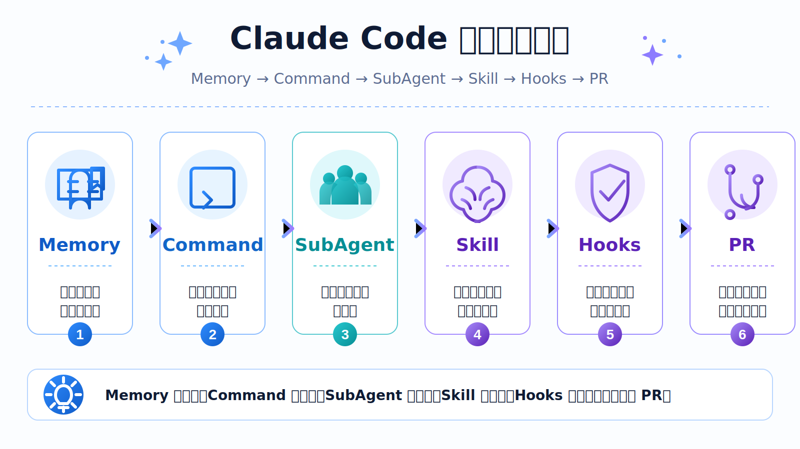

> 最近我开始系统学习 Claude Code 工程化相关内容。刚开始我对 Claude Code 的理解很简单：它不就是一个命令行里的 AI 编程助手吗？可以读代码、改代码、提交代码，比普通 ChatGPT 更懂工程。但学完第一讲之后，我发现这个理解太浅了。

> Claude Code 真正有价值的地方，不只是“让 AI 帮我写代码”，而是它背后提供了一套可以被配置、扩展、组合的 Agent 工程化体系。换句话说，它不只是一个工具，更像是一个可以搭建 AI 工作流的平台。

这篇文章不是单纯复述课程内容，而是结合我自己的理解，尤其是结合我最近实践的“让 Claude Code 自动创建分支、修改代码、提交 commit、push 代码、创建 PR、发送钉钉通知”这一套流程，整理一下我对 Claude Code 底层组件的理解。

## 一、Claude Code 不只是 AI Coder，而是 Agent 工程平台

很多人第一次接触 Claude Code，可能会把它理解成下面这些东西：

- 一个能读懂代码的 AI 助手
- 命令行里的 ChatGPT
- 帮我写代码的工具
- 比 GitHub Copilot 更强大的 AI 编程工具

这些理解都对，但都不完整。

如果只是让它帮我解释代码、写函数、修 Bug，那我其实只是把 Claude Code 当成一个“更强的 AI 助手”。这种用法当然有价值，但还没有真正发挥 Claude Code 的工程化能力。

我现在更愿意这样理解 Claude Code：

> Claude Code 是一个面向软件工程场景的 AI Agent 框架。

这个框架里不仅有对话能力，还有 Memory、Command、Skill、SubAgent、Hooks、MCP、Headless、Agent SDK 等一整套组件。它们共同解决的问题是：如何让 AI 不只是回答问题，而是进入真实工程流程，参与分析、修改、检查、提交、协作和自动化。

这也是我这次学习最大的认知转变：

> 学 Claude Code，不应该只学“怎么问 AI”，而应该学“怎么设计 AI 工作流”。

## 二、从“被动使用”到“主动驾驭”

以前我使用 AI 编程工具，更多是这种方式：

```txt
我提出问题
AI 给出答案 
我复制、修改、验证
```

比如：

```txt
帮我解释这个函数 
帮我写一个 Vue 组件 
帮我修复这个 TypeScript 报错
```

这种方式叫“被动使用”。AI 很强，但它仍然只是一个响应式工具。我问一句，它答一句。

但 Claude Code 真正值得学习的地方，是它支持另一种模式：

```txt
我设计流程
AI 按流程执行
中间自动调用不同能力
最后完成一个工程任务
```

比如我最近实践的一套自动化流程：

```txt
检查当前分支状态
拉取 main 最新代码
创建新分支
修改代码
提交 commit
push 代码
创建 PR
发送钉钉通知
```

这已经不只是“让 AI 写代码”了，而是让 AI 参与一条完整的工程交付链路。

这就是从“使用者”到“驾驭者”的区别。

使用者关心：

```txt
AI 能不能帮我写代码？
```

驾驭者关心：

```txt
AI 能不能按照我的工程规则，稳定、可控、可审计地完成一条任务流？
```

## 三、Claude Code 的底层组件地图

要理解 Claude Code，不能只盯着命令行里的对话框，而要理解它的组件体系。

我目前把它理解成四层：

```txt
基础层：Memory
扩展层：Command / Skill / SubAgent / Hooks 
集成层：Headless / MCP 
编程接口层：Agent SDK
```

其中，我现阶段最需要吃透的是前五个：

`Memory`、`Command`、`Skill`、`SubAgent`、`Hooks`

因为这五个组件，基本决定了我能不能把 Claude Code 从“聊天工具”升级成“工程流程”。



## 四、Memory：项目手册，不是任务流程

Memory 的核心作用是让 Claude Code 记住项目背景和长期规则。

最典型的文件就是：

```txt
CLAUDE.md
```

我一开始容易把所有东西都写进 CLAUDE.md，包括具体流程。比如我昨天把“提交 PR 的完整步骤”也写进了 CLAUDE.md：

```txt
检查分支状态
拉取 main
创建新分支
提交 commit
push 
创建 PR 
钉钉通知
```

后来我才意识到，这样虽然能跑通，但设计上不够好。

因为 CLAUDE.md 更适合放长期稳定的项目规则，而不是每次任务都要执行的具体流程。

更合理的方式是：

```txt
CLAUDE.md 放长期规则
Command 放固定流程 
Skill 放专家能力 
SubAgent 放角色分工 
Hooks 放强制检查
```

也就是说，CLAUDE.md 更像“新员工手册”，它应该告诉 Claude：

```txt
这个项目是什么 
技术栈是什么 
分支规范是什么 
commit 规范是什么 
PR 必须包含哪些内容 
哪些文件不能动 
哪些操作禁止执行 
测试命令是什么
```

比如：

```md
# Project Rules

## Tech Stack

Vue 3 + TypeScript + Vite + pnpm

## Branch Rules

禁止直接在 main/master 分支修改代码。
线上异常修复分支统一使用：fix/sentry-{issueId}

## Commit Rules

commit message 使用：fix(sentry): resolve issue {issueId}

## PR Rules

PR 描述必须包含：

1. 问题背景
2. 根因分析
3. 修复方案
4. 测试结果
5. 风险说明
6. 回滚方式

## 禁止事项

- 不允许大范围重构
- 不允许修改无关文件
- 不允许新增依赖，除非明确确认
- 不允许泄露 token、cookie、密钥
```

Memory 的价值不是“让 Claude 记住所有流程”，而是让它理解项目的长期上下文和边界。

一句话总结：

```txt
Memory 是项目手册，负责告诉 AI：这个项目的规则是什么。
```

## 五、Command：用户手动触发的固定流程

我之前有一个疑问：我昨天串起来的自动 PR 流程，到底算什么？

现在我的理解很明确：它就是一个 Command 的典型场景。

因为它满足几个特征：

- 固定流程
- 人工触发
- 步骤明确
- 可重复执行
- 结果可审计

比如：

- 检查分支状态
- 拉取 main
- 创建新分支
- 修改代码
- 提交 commit
- push 代码
- 创建 PR
- 发送钉钉通知

这个流程整体可以封装成一个 Command，例如：

```txt
/sentry-auto-fix
```

或者：

```txt
/fix-and-pr
```

Command 的特点是：它更像一个标准作业流程。你什么时候触发，它就按照预定义步骤执行。

比如：

```txt
# /fix-and-pr

当用户执行该命令时，按照以下流程完成代码修改和 PR 创建：

1. 检查当前 git 工作区状态
2. 确认当前不在 main/master 分支直接修改
3. 拉取 main 最新代码
4. 创建修复分支
5. 根据用户需求修改代码
6. 查看 git diff
7. 生成 commit message
8. 提交 commit
9. push 到远程分支
10. 创建 PR
11. 发送钉钉通知
```

这里有一个很关键的点：

> Command 负责串流程，但不一定负责每一步的专业判断。

比如“生成 PR 描述”这一步，虽然属于 Command 流程中的一环，但它本身需要结合 diff、commit、需求背景、测试结果来判断怎么写，这就更适合交给 Skill。

一句话总结：

> Command 是作业流程，负责告诉 AI：这件事按什么顺序执行。

## 六、Skill：专家能力，不是固定命令

我一开始也容易把 Skill 和 Command 混在一起。后来通过几个例子，我才逐渐分清楚。

Command 是用户明确触发的固定流程。

Skill 则是 Claude 根据上下文自动判断是否启用的专家能力。

比如：

```txt
gitlab-mr-writing-skill
```

它不是一个固定命令，而是一套“如何写好 MR 描述”的专家能力。

它可能包含：

```txt
如何根据 diff 总结变更
如何描述根因 
如何说明修复方案 
如何整理测试结果 
如何写风险说明 
如何补充回滚方案
```

再比如：

```txt
vue-runtime-error-fix-skill
```

它不是固定执行 1、2、3、4，而是帮助 Claude 在遇到 Vue 运行时报错时，按前端专家的方式分析问题。

例如 Sentry 报错：

```txt
Cannot read properties of undefined
```

这个报错背后可能有很多原因：

- 接口字段为空
- 异步数据未加载
- props 缺少默认值
- 数组越界
- 模板中缺少 v-if 保护

每种原因的修复方式都不一样。

如果是接口字段为空，可能要加：

```txt
user?.profile?.name ?? ''
```

如果是异步数据未加载，可能要加：

```txt
<div v-if="userInfo"> {{ userInfo.name }} </div>
```

如果是 props 缺少默认值，可能要用：

```txt
withDefaults(defineProps<Props>(), { list: () => [] })
```

所以 Skill 不是没有流程，而是它的流程不是死的。更准确地说：

> Skill = 固定能力边界 + 不固定判断路径

它解决的是：

- 什么时候该用这种能力？ 
- 应该从哪些角度判断？ 
- 不同上下文下应该采取什么策略？ 
- 输出结果应该达到什么标准？

一句话总结：

> Skill 是专家方法，负责告诉 AI：遇到这类问题应该怎么专业地判断和处理。

## 七、SubAgent：专职角色，不是技能本身

学到这里，我又遇到一个更容易混淆的问题：

> Skill 和 SubAgent 到底有什么区别？

后来我用一句话记住了：

- Skill = 专家能力 
- SubAgent = 专职角色

再说直白一点：

- Skill 是“怎么做事的方法论” 
- SubAgent 是“谁来做这件事”

举个例子：

```txt
gitlab-mr-writing-skill
```

这是一个 Skill，表示“如何写好 MR 描述”。

而：

```txt
mr-agent
```

这是一个 SubAgent，表示“专门负责生成 MR 标题和描述的角色”。

这个 mr-agent 可以使用 gitlab-mr-writing-skill 来完成任务。

同理：

```txt
frontend-risk-review-skill
```

表示“如何做前端风险审查”。

而：

```txt
review-agent
```

表示“专门负责审查代码风险的角色”，并且可以限制它只能读 diff，不能修改代码。

这就是 SubAgent 的核心价值：职责分离、上下文隔离、权限隔离。

比如在一个自动修复流程中，可以拆成：

```txt
diagnosis-agent：只分析根因，不能改代码
fix-agent：只做最小代码修改，不能提交 
review-agent：只审查 diff，不能改代码 
test-agent：只跑测试并总结结果 
mr-agent：只生成 MR 描述 
notify-agent：只负责通知
```

这和真实团队很像。

团队里不会让一个人同时做所有事情：分析问题、改代码、审查自己的代码、跑测试、写 PR、发通知。AI Agent 也一样，如果所有事情都让一个主 Agent 做，很容易上下文混乱、职责混乱、甚至出现“自己改完自己审核自己”的问题。

一句话总结：

> SubAgent 是岗位角色，负责告诉 AI：这件事由谁来干、权限边界是什么、最终要汇报什么。

## 八、Hooks：强制检查，不靠 AI 自觉

如果说 Command 是流程，Skill 是能力，SubAgent 是角色，那么 Hooks 就是安全红线。

Hooks 的作用是在特定事件发生时自动执行检查。

比如：

```txt
Claude 准备修改代码前
Claude 准备提交 commit 前
Claude 准备执行 shell 命令前
Claude 创建 PR 后
```

这些关键节点都可以挂 Hook。

比如在提交前强制执行：

```txt
pnpm lint 
pnpm typecheck 
pnpm test
```

或者在修改代码前检查是否要修改敏感文件：

```txt
.env *.pem *.key secret token CI 配置
```

Hooks 的价值在于：它不依赖 AI 自觉。

不能只靠提示词告诉 Claude：

```txt
请你不要修改敏感文件
请你提交前记得跑测试
```

因为真实工程里，光靠“提醒”是不够的。生产级流程必须有强制兜底。

所以 Hooks 更像 CI/CD 里的检查点，也像自动化流程里的安全阀。

一句话总结：

> Hooks 是安全红线，负责告诉系统：不管谁执行，哪些检查必须发生，哪些行为必须拦截。

## 九、五个组件放在一起怎么理解？

经过这次学习，我觉得可以用下面这几句话记住它们的区别：

- Memory：项目手册
- Command：作业流程
- Skill：专家方法
- SubAgent：岗位角色
- Hooks：安全红线

再换一种更工程化的说法：

- Memory 定规则
- Command 串流程
- Skill 给能力
- SubAgent 分角色
- Hooks 做兜底

如果放到我的自动 PR 流程里，它们的关系大概是这样：

```txt
用户输入 /sentry-auto-fix 30078
    ↓
Memory：读取项目规则、分支规范、PR 规范
    ↓
Command：执行自动修复和 PR 创建流程
    ↓
SubAgents： 
    diagnosis-agent 分析根因
    fix-agent 修改代码 
    review-agent 审查风险 
    test-agent 跑测试 
    mr-agent 生成 MR 描述
    ↓
Skills： 
    sentry-issue-analysis-skill
    vue-runtime-error-fix-skill
    frontend-risk-review-skill 
    gitlab-mr-writing-skill
    ↓
Hooks： 
    修改前检查敏感文件 
    提交前跑 lint/typecheck/test 
    PR 创建后发送钉钉通知
```

这时整个流程就不再是“我让 Claude 帮我做点事”，而是一套真正的 AI 工程协作系统。

## 十、结合我的实践：昨天的流程应该怎么重构？

昨天我把一套自动化流程写进了 CLAUDE.md，并且在提示词里告诉 Claude：

```txt
编写完成后，走 PR 流程
```

这个做法能跑通，但现在看，它其实是把 Command 的内容塞进了 Memory。

更合理的重构方式应该是：

### 1. CLAUDE.md 只保留长期规则

```txt
禁止直接修改 main
分支命名规范 
commit message 规范 
PR 描述规范 
测试命令 
敏感文件限制
```

### 2. 创建一个 Command：/pr-flow

```txt
检查分支状态 
拉取 main 
创建新分支 
查看 diff 
提交 commit 
push 
创建 PR 
钉钉通知
```

### 3. 创建 Skill：gitlab-mr-writing-skill

用于生成高质量 PR 描述。

它不只是套模板，而是结合上下文判断：

```txt
改了哪些文件 
为什么要改 
影响范围是什么 
测试是否通过 
有没有风险
如何回滚
```

### 4. 创建 SubAgent：mr-agent

它专门负责读取 diff、commit、测试结果，然后使用 gitlab-mr-writing-skill 生成 MR 标题和描述。

### 5. 创建 Hooks

例如：

- pre-edit：禁止修改敏感文件
- pre-commit：强制跑 lint/typecheck/test
- post-mr：PR 创建成功后发送钉钉通知

这样拆完之后，整个流程更清晰，也更容易维护。

## 十一、我对 Claude Code 学习方式的理解

学 Claude Code，不能只学命令。

如果只是记住：

```txt
claude 
/review 
/commit
```

那还是停留在使用者阶段。

真正应该学习的是组件选型思维：

```txt
- 这是长期规则吗？如果是，用 Memory。
- 这是固定流程吗？如果是，用 Command。 
- 这是专家判断吗？如果是，用 Skill。 
- 这是独立角色吗？如果是，用 SubAgent。
- 这是强制检查吗？如果是，用 Hooks。 
- 这是外部系统连接吗？如果是，用 MCP。 
- 这是自动化运行吗？如果是，用 Headless。
```

这个思维比记住某个工具命令更重要。

因为工具会变，模型会变，CLI 会变，但工程化思想不会变。

## 十二、最后总结

这篇课程给我最大的收获，不是知道 Claude Code 怎么安装，也不是知道它支持哪些命令，而是让我重新理解了 AI Coding 工具的定位。

Claude Code 不只是帮我写代码的工具，而是可以被组织、被扩展、被约束、被接入工程流程的 Agent 平台。

我现在对几个核心组件的理解是：

- Memory 是项目手册，用来保存长期规则和上下文。
- Command 是作业流程，用来封装用户手动触发的固定步骤。
- Skill 是专家方法，用来沉淀可复用的领域判断能力。
- SubAgent 是岗位角色，用来做职责拆分、上下文隔离和权限控制。
- Hooks 是安全红线，用来在关键节点做强制检查和兜底。

如果把这些组件组合起来，就可以从“让 AI 帮我写代码”，升级为“让 AI 参与完整工程交付”。

这也是我接下来想重点实践的方向：把 Claude Code 的这些工程化能力，落地到我自己的 Sentry AI Fix Bot 项目里，形成从线上异常发现、根因分析、代码修复、测试检查、创建 PR 到钉钉通知的完整闭环。

真正有价值的不是“我会用 Claude Code”，而是：

> 我能不能用 Claude Code 设计出一套稳定、可控、可复用的 AI 工程工作流kong