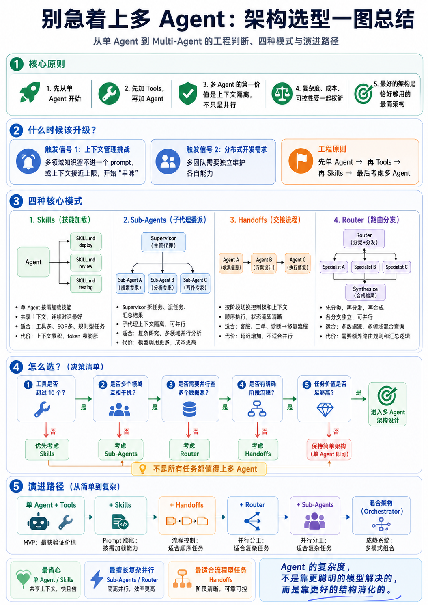

> 多 Agent 不是 AI Agent 系统的默认起点，而是复杂度被证明之后的升级结果。
>
> 真正的工程判断不是“能不能拆成多个 Agent”，而是“现在的任务边界、上下文压力、调试成本和交付价值，是否已经值得拆”。

这篇文章想解决一个很常见的问题：做 AI Agent 架构时，到底什么时候该用单 Agent、什么时候加 `Tools`、什么时候沉淀 `Skills`，又什么时候才真的需要 `Sub-Agents`、`Handoffs` 或 `Router`。

先给结论：

> **优先选择最简单但能稳定交付的架构。**

如果一个 `Agent + Tools` 就能完成任务，就不要急着上多 Agent；如果问题只是规则太多，优先考虑 `Skills`；如果流程有明确阶段，再考虑 `Handoffs`；如果问题天然要分流到多个领域，再考虑 `Router`；只有当上下文隔离、并行调查、权限边界真的成为问题时，才值得上 `Sub-Agents`。

## 一、先建立一个大脑模型

你可以把 Agent 系统理解成一家公司：不同架构不是谁更高级，而是谁更适合当前规模。

| AI 架构 | 像公司里的什么 | 适合场景 | 主要风险 |
| --- | --- | --- | --- |
| 单 Agent + Tools | 一个全能员工配一堆工具 | 简单任务、MVP 验证 | Prompt 变长，职责变杂 |
| Skills | 员工手册、SOP、专业说明书 | 规则多，但还没复杂到分人 | 仍共享上下文，容易累积噪声 |
| Sub-Agents | 一个主管调度多个专家 | 多领域调查、上下文隔离、并行分析 | 成本更高，调试链路更长 |
| Handoffs | 前台交给技术支持，再交给高级工程师 | 有明确阶段的顺序流程 | 延迟增加，状态交接要设计清楚 |
| Router | 分诊台，把问题分给不同专家 | 多领域分发、多数据源查询 | 路由规则和汇总逻辑会变复杂 |
| 混合架构 | 成熟公司组织架构 | 企业级复杂系统 | 架构治理成本明显上升 |

这就是整篇文章的主线：**从简单到复杂，一层一层加，不要一开始就把系统设计成组织架构图。**

下面这张图可以作为整篇文章的快速索引。先看全局，再回到每一层的工程判断。



图里的关键结论只有一句：

> **Agent 的复杂度，不是靠更聪明的模型解决，而是靠更好的结构消化。**

## 二、第一层：单 Agent + Tools，先验证价值

**先从单 Agent 开始，先加 Tools，再考虑加 Agent。**

比如现在要做一个 `Sentry AI Fix Bot`，最初根本不需要多 `Agent`。你只需要一个主 Agent 能调用这些工具：

```txt
getSentryIssue()
getStackTrace()
getSourceCode()
createBranch()
editCode()
runTest()
createMR()
```

这时候系统可以非常朴素：

```txt
Agent
├── Tool A：查 Sentry
├── Tool B：读源码
├── Tool C：改代码
└── Tool D：创建 MR
```

这个阶段最简单、成本最低、调试也最容易。它的目标不是设计出完美架构，而是尽快验证三件事：

1. AI 是否能拿到足够的信息；
2. 工具调用是否稳定；
3. 最终交付是否真的有价值。

如果现在直接拆成“诊断 Agent、修复 Agent、测试 Agent、MR Agent”，很可能是过度设计。因为当前项目的 MVP 还没真正遇到单 Agent 的边界。

### 什么时候先停在这一层？

如果满足下面这些条件，继续用单 Agent 就够了：

- 任务链路不长；
- 工具数量不多；
- 上下文还没有明显混乱；
- 失败后容易复现和排查；
- 主要目标是验证业务价值，而不是追求架构完整。

一句话：

> **MVP 阶段最重要的是跑通闭环，不是提前模拟一个完整团队。**

## 三、第二层：Skills，不是 Agent，是按需加载的说明书

**Skill 不是独立 Agent，而是一份可复用的指令文件。**

它像这样：

```txt
Agent
├── Skill A：部署说明书
├── Skill B：代码审查说明书
└── Skill C：测试说明书
```

它的核心价值是：**不要把所有规则一开始都塞进 Prompt，而是需要什么技能，再加载什么技能。**

比如在 Claude Code 里可以这样设计：

```txt
.claude/skills/
├── sentry-fix/
│   └── SKILL.md
├── pr-review/
│   └── SKILL.md
└── release-check/
    └── SKILL.md
```

一个 `sentry-fix/SKILL.md` 可以写成：

```md
---
name: sentry-fix
description: "Analyze Sentry issues and generate minimal safe frontend fixes"
allowed-tools: ["Read", "Grep", "Glob", "Bash", "Edit"]
---

# Sentry Fix Skill

## 工作步骤

1. 读取 Sentry issue 信息
2. 找到异常堆栈中的源码位置
3. 判断是否是前端可修复问题
4. 只修改最小必要代码
5. 不改无关文件
6. 修改后运行：
   - pnpm typecheck
   - pnpm lint
   - pnpm test
7. 输出：
   - 根因
   - 修改文件
   - 风险
   - 验证方式
```

你要注意：**Skill 适合“方法和规则多”，不适合“上下文需要隔离”的任务。**

| 适合 Skill | 不适合 Skill |
| --- | --- |
| PR 审查规范 | 同时查日志、代码、监控、文档 |
| 部署检查流程 | 每个领域都有大量中间信息 |
| 代码规范检查 | 多个任务需要互不干扰 |
| Sentry 修复 SOP | 需要严格隔离权限和上下文 |
| 小程序上线检查 | 需要并行产出多个独立结论 |

原因很简单：Skill 只是“给同一个 Agent 加载说明书”，它不会天然创建新的上下文。聊久了，主对话还是会累积噪声。

一句话：

> **规则膨胀时先加 Skill，上下文污染时再考虑 Sub-Agent。**

## 四、第三层：Sub-Agents，核心不是并行，而是上下文隔离

很多人理解 Sub-Agent 都错了，以为它主要是为了“并行加速”。

这只说对了一半。

Sub-Agent 的第一价值是**上下文隔离**，第二价值才是**并行执行**。

```txt
Supervisor 主 Agent
├── Sub-Agent A：搜索专家
├── Sub-Agent B：分析专家
└── Sub-Agent C：写作专家
```

你可以把它理解成：

```txt
老板不亲自干所有活。

老板负责：
- 拆任务
- 派任务
- 收结果
- 做最终决策

专家负责：
- 只干自己那一块
- 过程信息留在自己的上下文里
- 最后只把结论带回来
```

比如一个复杂研究任务，不适合让主 Agent 把所有搜索过程、网页内容、引用候选、分析中间稿都塞进同一个上下文。更合理的是：

```txt
LeadResearcher
├── Search Agent 1：搜索 A 方向
├── Search Agent 2：搜索 B 方向
├── Search Agent 3：搜索 C 方向
├── Citation Agent：整理引用
└── Aggregation：汇总成报告
```

这个模式特别适合这些场景：

- 复杂研究文章生成；
- Sentry 复杂故障分析；
- 企业内部技术助手；
- 代码影响面分析；
- AI Agent 项目架构评审。

但是别上头。Sub-Agent 会增加：

- 更多模型调用；
- 更多 token 成本；
- 更多调试链路；
- 更多失败点；
- 更多结果合并逻辑。

所以不要因为“听起来高级”就拆 Agent。你真正要问的是：

> **这个任务的执行过程是否很吵，但最终只需要一个干净结论？**

如果答案是“是”，Sub-Agent 才开始有价值。

## 五、第四层：Handoffs，是流程交接，不是并行

Handoff 可以直接理解成：**把接力棒交给下一个 Agent。**

```txt
Agent A：收集信息
  ↓ handoff()
Agent B：方案设计
  ↓ handoff()
Agent C：执行修复
```

它不是并行，而是顺序流程。

客服工单是最典型的例子：

```txt
前台接待 Agent
  负责收集用户信息、判断问题类型
        ↓
技术支持 Agent
  负责排查问题、尝试解决
        ↓
高级工程师 Agent
  负责深度诊断、生成报告
```

放到 `Sentry AI Fix Bot` 里，可以这样拆：

```txt
阶段 1：Intake 信息收集
- 收集 issue id
- 收集 release
- 收集 stack trace
- 收集 source map 状态

阶段 2：Diagnosis 问题诊断
- 判断错误类型
- 判断是否前端可修复
- 判断影响范围

阶段 3：Resolution 执行修复
- 新建分支
- 修改代码
- 跑检查
- 创建 MR
```

重点是：**Handoff 在 Claude Code 里不一定是一个真实 API，它也可以通过 Prompt + 状态文件模拟出来。**

比如你可以写一个状态文件：

```txt
.agent-state.md
```

内容：

```txt
current_stage: intake

stages:
  - intake
  - diagnosis
  - resolution
  - mr
```

然后让 Claude Code 按阶段工作：

```txt
你当前处于 intake 阶段。

规则：
1. 只能收集信息
2. 不允许修改代码
3. 不允许给最终修复方案
4. 当信息完整时，输出：
   进入 diagnosis 阶段
```

当它输出：

```txt
信息完整，进入 diagnosis 阶段。
```

你再给下一段：

```txt
你当前处于 diagnosis 阶段。

规则：
1. 分析根因
2. 判断是否适合 AI 自动修复
3. 输出修复策略
4. 不允许直接修改代码
```

这就是 Handoff 的工程含义：**阶段清晰，责任切换清晰，状态可追踪。**

它适合做稳定、可控、可审计的自动化流程。

## 六、第五层：Router，是分诊台

Router 的职责不是干活，而是判断问题该交给谁。

```txt
用户问题：
“这个接口改动，会影响哪些系统？上线风险如何？”

Router 拆解：
├── 代码影响分析 → Code Agent
├── 文档规范查询 → Docs Agent
├── 日志/监控分析 → Ops Agent
└── 汇总结果 → Synthesize
```

Router 最适合这种问题：

- 一个问题里混了多个领域；
- 一个问题需要查多个数据源；
- 每个领域可以独立执行；
- 最后需要统一汇总。

比如企业内部技术助手：

```txt
用户问：
“订单接口最近报错变多，是代码问题、数据库问题，还是依赖服务问题？”

Router 应该拆成：

1. Sentry Agent：查前端/服务端异常
2. Log Agent：查日志
3. Metrics Agent：查监控指标
4. Code Agent：查最近代码变更
5. Report Agent：汇总判断
```

这个就是成熟系统会用到的结构。

但 Router 也有自己的成本：你必须设计清楚“怎么分流、分错了怎么办、多个结果怎么合并、冲突结论怎么处理”。否则 Router 只是把一个问题变成多个问题。

一句话：

> **Router 适合分发问题，不适合替你理解问题。**

## 七、什么时候真的该升级架构？

不要问“我能不能上多 Agent”，要问“我现在遇到的问题是哪一种复杂度”。

| 你遇到的问题 | 优先考虑 |
| --- | --- |
| 工具不够用 | 给单 Agent 加 Tools |
| 规则越来越多 | 抽成 Skills |
| Prompt 越来越长 | 拆长期规则、短期任务和技能说明 |
| 执行过程很吵 | 用 Sub-Agent 隔离上下文 |
| 有明确阶段流转 | 用 Handoffs |
| 问题需要分发给多个领域 | 用 Router |
| 多种模式同时出现 | 再考虑混合架构 |

可以按这个顺序演进：

```txt
单 Agent
  ↓
单 Agent + Tools
  ↓
单 Agent + Tools + Skills
  ↓
Handoffs / Router / Sub-Agents
  ↓
混合架构（Orchestrator + 多角色 + 多工具 + 多护栏）
```

注意，不是每个系统都要走到最后一层。

很多任务停在 `Agent + Tools + Skills` 就已经很好。架构不是越复杂越专业，而是越贴近问题越专业。

## 八、用 Sentry AI Fix Bot 做一次选型判断

假设你正在设计 `Sentry AI Fix Bot`，可以这样做工程判断。

### 阶段 1：先用单 Agent 跑通闭环

目标是验证它能不能完成最小任务：

```txt
读取 Sentry issue
↓
定位相关源码
↓
生成修复方案
↓
修改最小必要代码
↓
运行检查
↓
创建 MR
```

这个阶段不要急着拆角色。因为你还不知道真实失败点在哪里。

### 阶段 2：把稳定经验沉淀成 Skills

当你发现一些规则反复出现，比如：

- 如何分析 Sentry issue；
- 如何判断是否前端可修复；
- 如何写 MR 描述；
- 如何控制修改范围；
- 如何输出风险和验证方式。

这时应该先抽成 Skill，而不是立刻拆 Agent。

### 阶段 3：当上下文开始污染，再拆 Sub-Agent

如果你发现主对话里塞满了日志、堆栈、源码搜索结果、测试输出，导致后续决策越来越不清楚，这时再考虑：

```txt
主 Agent：sentry-fix-orchestrator
├── sentry-context-analyzer：只读 Sentry 上下文，只输出错误摘要
├── source-locator：定位源码，只输出文件和函数
├── impact-analyzer：分析影响范围，只输出风险点
├── fix-planner：生成修复方案，不改代码
├── bug-fixer：按方案改代码
├── test-runner：运行检查，只返回结论
└── mr-writer：生成 MR 标题和描述
```

这个拆法才是有依据的：不是为了“多 Agent”，而是为了隔离上下文、收窄权限、提高可调试性。

### 阶段 4：有阶段审批，再加 Handoffs

如果你希望流程更可控，可以把它拆成：

```txt
intake → diagnosis → planning → fixing → testing → mr
```

每个阶段只做自己的事。比如 `diagnosis` 阶段不能改代码，`planning` 阶段只能给方案，`fixing` 阶段只能按方案做最小修改。

这比“让一个 Agent 从头冲到尾”更适合生产级自动化。

## 九、最终决策清单

如果你只想记一张表，就记这张：

| 判断问题 | 如果答案是“是” | 推荐选择 |
| --- | --- | --- |
| 只是缺少外部能力吗？ | 需要查数据、改代码、跑命令 | Tools |
| 只是规则太多吗？ | SOP、规范、输出格式反复出现 | Skills |
| 过程信息很吵吗？ | 日志、搜索、测试输出污染主上下文 | Sub-Agents |
| 流程阶段很明确吗？ | 先收集、再诊断、再修复、再提交 | Handoffs |
| 问题天然要分领域吗？ | 代码、日志、监控、文档都要查 | Router |
| 多种复杂度同时存在吗？ | 已经是企业级协作系统 | 混合架构 |

再浓缩成一句话：

> **先让一个 Agent 把事情做成，再让 Tools 变强，再让 Skills 变稳，最后才让多个 Agent 分工。**

## 十、最后总结

很多人做 AI Agent 系统时，一开始就想设计一个“多 Agent 协作平台”。这很正常，因为它听起来更像未来，也更像架构。

但真实工程里，更可靠的路径通常是：

```txt
先简单
再复用
再隔离
再分发
再编排
```

单 Agent 不是低级，多 Agent 也不是高级。它们只是解决不同阶段问题的工具。

真正高级的判断是：**知道什么时候不该升级架构。**

如果一个简单架构能稳定交付，那它就是好架构；如果系统已经被上下文污染、权限混乱、流程不可控拖住了，那就应该升级。

所以，别急着上多 Agent。

先问自己：

> **我现在是在解决真实复杂度，还是在提前消费架构复杂度？**

这个问题，比“用几个 Agent”重要得多。
