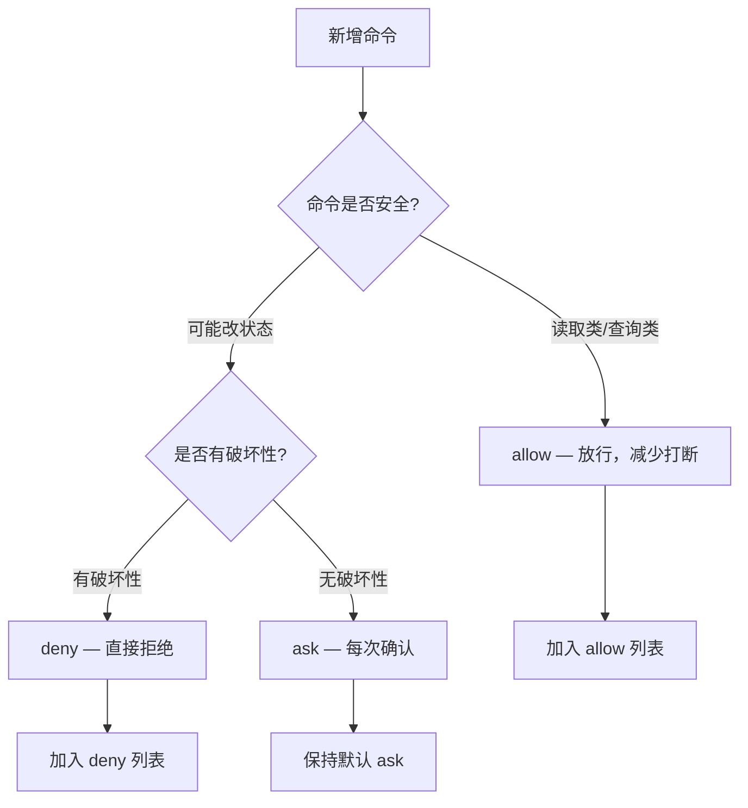

# Claude Code 开发助理搭建

## 一、前置准备

### 1、环境要求

在开始之前，先确认你的开发环境满足以下条件：

| 依赖项 | 最低版本 | 说明 |
| ------ | -------- | ---- |
| Node.js | 18+ | `claude --version` 检查 |
| Git | 2.x+ | 版本管理 |
| 终端 | - | Windows PowerShell / macOS Terminal / Linux Shell |
| 网络 | - | 首次登录需要联网认证 |

### 2、账号准备

`Claude Code` 通过以下任一方式访问：

- Claude Pro / Max / Team / Enterprise 订阅
- Claude Console 账号
- 支持的云提供方

如果你已经有 Claude 网页版账号，可以直接用同一个账号登录。没有的话，先去 [claude.ai](https://claude.ai) 注册。

> **注意**：Claude Code 是独立计费的。具体计费方式请以官方最新文档为准。

## 二、安装与初始化

### 1、Windows 安装

PowerShell 中执行官方安装脚本：

```powershell
irm https://claude.ai/install.ps1 | iex
```

### 2、macOS / Linux 安装

```bash
# macOS
brew install claude-code

# 或通过 npm（所有平台通用）
npm install -g @anthropic-ai/claude-code
```

### 3、验证安装

安装完成后，运行以下命令确认一切正常：

```bash
claude --version
```

官方还提供了一个诊断命令：

```bash
claude doctor
```

`claude doctor` 会检查安装类型、版本、Node.js 环境和认证状态，出问题时优先跑这个。

### 4、首次认证

在项目根目录启动 Claude Code：

```bash
cd your-project
claude
```

首次启动会弹出浏览器要求登录授权，按照页面提示完成即可。认证信息会缓存在本地，后续启动无需重复登录。

## 三、项目配置体系

Claude Code 的配置分为三个层级，优先级从高到低：

```
项目本地设置 (.claude/settings.local.json)
    ↓ 覆盖
项目设置 (.claude/settings.json)
    ↓ 覆盖
用户全局设置 (~/.claude/settings.json)
```

### 1、全局设置

全局配置文件位于 `~/.claude/settings.json`，对所有项目生效。

典型用途：

- 设置默认模型
- 配置全局权限规则
- 设置环境变量

示例：

```json
{
  "model": "claude-sonnet-4-6",
  "permissions": {
    "allow": [
      "Bash(git status:*)",
      "Bash(git diff:*)",
      "Bash(ls:*)",
      "Bash(cat:*)",
      "Read",
      "Edit"
    ]
  }
}
```

### 2、项目设置

项目级配置文件位于项目根目录 `.claude/settings.json`，只对当前项目生效。

典型用途：

- 项目特定的权限规则
- 项目特定的环境变量
- 覆盖全局模型选择

### 3、本地设置（不提交 Git）

`.claude/settings.local.json` 优先级最高，且**不应提交到版本控制**。适合存放：

- 个人 API key
- 个人偏好
- 本地开发环境特有配置

> **建议**：在 `.gitignore` 中添加 `.claude/settings.local.json`，避免把个人密钥提交到仓库。

### 4、配置层级实战

一个典型的前端项目配置流程：

```txt
步骤 1：全局配置
→ ~/.claude/settings.json
→ 设置默认模型、全局放行 git 和文件读取命令

步骤 2：项目配置
→ 项目/.claude/settings.json
→ 放行 pnpm dev / pnpm build / pnpm type-check

步骤 3：本地配置
→ 项目/.claude/settings.local.json
→ 个人 API key、本地特殊偏好
```

## 四、CLAUDE.md — 项目的"入职手册"

### 1、CLAUDE.md 是什么？

`CLAUDE.md` 是放在项目根目录的一份 Markdown 文件，Claude Code 每次进入项目都会先读它。

你可以把它理解成：

> 写给 AI 协作者的"项目入职文档"——告诉它这个项目用什么技术栈、有哪些开发规范、什么能做、什么绝对不能做。

### 2、初始化 CLAUDE.md

在 Claude Code 会话中输入：

```bash
/init
```

它会扫描项目结构，自动生成一份 starter `CLAUDE.md`。但自动生成的只是骨架，你要根据项目实际情况补充规则。

### 3、CLAUDE.md 应该写什么？

```markdown
# CLAUDE.md

## 项目概述
一句话说清楚这个项目是做什么的。

## 技术栈
| 类别     | 技术              |
| -------- | ----------------- |
| 框架     | Vue 3.5           |
| 构建     | Vite 5            |
| UI 库    | Element Plus 2    |
| 包管理器 | pnpm              |

## 常用命令
pnpm dev        # 启动开发服务器
pnpm build      # 构建
pnpm type-check # 类型检查

## 开发规范
- 修改代码前必须先说明影响范围
- 不要重写无关代码
- UI 修改保持现有风格
- 每次修改后运行 pnpm type-check
- 不允许修改 .env.production
```

### 4、规则怎么写才有效

**不好的规则**（太模糊）：

```markdown
- 写好代码
- 注意性能
- 保持整洁
```

**好的规则**（具体、可执行）：

```markdown
- 修改代码前先向用户说明：涉及哪些文件、会影响哪些功能、是否破坏向后兼容
- 不要趁机重构无关模块，如果发现其他问题另起任务
- 每次代码修改后必须运行 pnpm type-check，确认无类型错误
- 不允许引入新的 UI 库，除非用户明确同意
- 不允许修改 .env.production 和 .env.local
```

规则的关键原则：**Claude Code 不是你肚子里的蛔虫，规则越具体，它执行得越准确。**

## 五、权限管理

### 1、权限模型

Claude Code 的权限分为三级：

| 权限级别 | 含义 | 示例 |
| -------- | ---- | ---- |
| `allow` | 自动放行，不弹确认框 | `Bash(git status:*)` |
| `ask` | 每次都需要用户确认 | `Bash(git push:*)` |
| `deny` | 直接拒绝 | `Bash(rm -rf:*)` |

### 2、配置权限规则

在设置文件中通过 `permissions` 字段配置：

```json
{
  "permissions": {
    "allow": [
      "Bash(git status:*)",
      "Bash(git diff:*)",
      "Bash(git log:*)",
      "Bash(ls:*)",
      "Bash(cat:*)",
      "Bash(pnpm dev:*)",
      "Bash(pnpm build:*)",
      "Bash(pnpm type-check:*)",
      "Read",
      "Edit"
    ],
    "deny": [
      "Bash(rm -rf:*)",
      "Bash(git push --force:*)",
      "Bash(curl:*)"
    ]
  }
}
```

### 3、权限最佳实践



几条经验：

- **读操作直接放行**：`Read`、`Grep`、`Glob`、`LS`、`git status`、`git diff`、`git log`、`ls`、`cat` 这类只读操作，放心放行
- **项目常用命令放行**：`pnpm dev`、`pnpm build`、`pnpm type-check` 这些你每天要跑几十次的命令，放行能极大减少打断
- **破坏性命令拒绝**：`rm -rf`、`git push --force`、`curl` 这类命令加入 deny，避免意外执行
- **网络操作谨慎**：`curl`、`wget`、`npm publish` 等涉及外部网络的操作，保持 ask 或 deny

### 4、在会话中动态管理权限

你也可以在 Claude Code 会话中直接使用命令：

```bash
/permissions    # 打开权限管理界面
```

每当你遇到频繁弹出的确认框，就考虑把对应的命令加入 allow 列表，提高协作效率。

## 六、理想的项目结构

搭建完成后，你的项目根目录应该长这样：

```
your-project/
├── src/                         # 源代码
├── package.json
├── tsconfig.json
├── vite.config.ts               # (或 next.config / webpack 等)
├── CLAUDE.md                    # ← AI 协作者入职手册
├── .gitignore                   # ← 已添加 .claude/settings.local.json
└── .claude/
    ├── settings.json            # ← 项目级权限与配置
    └── settings.local.json     # ← 个人本地配置（不提交 Git）
```

## 七、验证搭建是否成功

完成以上步骤后，跑一遍验证流程：

### 验证清单

| 序号 | 检查项 | 验证命令 | 预期结果 |
| ---- | ------ | -------- | -------- |
| 1 | 安装成功 | `claude --version` | 输出版本号 |
| 2 | 诊断通过 | `claude doctor` | 全部绿色打勾 |
| 3 | 能正常启动 | `claude` | 进入交互会话 |
| 4 | CLAUDE.md 存在 | `ls CLAUDE.md` | 文件存在 |
| 5 | 配置文件存在 | `ls .claude/settings.json` | 文件存在 |
| 6 | 权限生效 | 启动后运行 `git status` | 不弹确认框，直接执行 |

### 首次任务测试

启动 Claude Code，输入：

```txt
请先阅读当前项目结构，不要修改任何文件。
重点查看 package.json、README、CLAUDE.md、src 入口、路由、状态管理。
输出一份项目理解报告。
```

如果 Claude Code 能：

1. 读取 `CLAUDE.md` 并引用其中的规则
2. 正确分析项目结构
3. 不弹权限确认框（前提是你已放行 Read 等操作）

那就说明搭建成功了。

## 八、常见问题与排查

### 1、`claude` 命令找不到

```bash
# 检查 npm 全局安装路径
npm list -g --depth=0 | grep claude

# 确认 npm 全局 bin 目录在 PATH 中
npm bin -g
```

### 2、认证失败

```bash
# 重新登录
claude logout
claude
# 按提示重新认证
```

### 3、权限弹框太多

```bash
/permissions
# 在界面中把频繁使用的安全命令加入 allow
```

记住口诀：**读完文件改代码前，先确认范围；改完代码查 diff 后，再跑类型检查。**

### 4、Claude Code 改错了代码怎么办

```bash
# 查看它改了什么
git diff

# 回滚单个文件
git restore path/to/file

# 回滚全部
git restore .
```

然后把问题反馈给它：

```txt
你刚才修改的 XX 文件有问题。原因是什么，请分析后给最小修复方案。
```

## 九、下一步

完成搭建后，建议按以下路线继续学习：


每阶段只练一个能力，熟透了再往下走。别第一天就让 AI 全项目重构——那是给自己找 bug。
