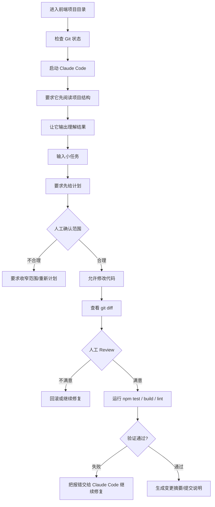

## 一、Claude Code 核心认知
### 1、Claude Code 到底是什么？
你可以把 `Claude Code` 理解成：
> 一个跑在你项目终端里的 AI 初级搭档，它能看你的项目文件、提出修改方案、编辑代码、执行命令、读报错，并继续迭代。

对前端工程师来说，它不像网页聊天那样只能“帮你想代码片段”。它更接近一个可以进项目的协作者：
| 能力      | 普通网页聊天             | Claude Code                         |
| ------- | ------------------ | ----------------------------------- |
| 看项目文件   | 需要你复制粘贴            | 可以在项目目录里读取文件                        |
| 修改代码    | 给你代码片段             | 可以直接改文件                             |
| 跑命令     | 只能告诉你命令            | 可以请求执行 `npm test`、`npm run build` 等 |
| 根据报错修复  | 你要复制报错             | 可以读取终端输出继续处理                        |
| Git 工作流 | 只能写 commit message | 可以看 diff、总结变更、辅助 PR 描述              |

但你别误解：**能改文件不等于能放心让它乱改。**
你作为前端工程师，仍然要负责：
- 需求是否拆对；
- 文件范围是否控制住；
- 代码风格是否符合项目；
- 类型是否过关；
- 功能是否真的可用；
- `diff` 是否可接受。

### 2、和 ChatGPT / Claude 网页聊天最大的区别
网页聊天更像“远程顾问”：
```txt
你：我有个 Vue 问题
AI：你可以这样写……
你：复制代码到项目
你：自己调试
```
`Claude Code` 更像“项目内协作开发”：
```txt
你：进入项目目录
你：启动 Claude Code
你：让它先阅读 src/router、src/pages、package.json
Claude Code：分析结构
你：让它给修改计划
Claude Code：列出会改哪些文件
你：确认范围
Claude Code：修改代码
你：看 git diff
你：跑测试 / 构建
你：人工 review
```
真正的 AI Coding，不是“你少写代码”，而是你把自己从低价值重复劳动里解放出来，把精力放在**需求拆解**、**架构判断**、**验收质量**上。

## 二、工作流图解

记住这个流程。你以后每次用 `Claude Code`，都要在脑子里过一遍。不看 diff 就合并，是初学者最危险的坏习惯。

## 三、实战场景
今天我们用一个非常真实的前端场景：
```txt
你接手一个陌生的 React / Vue 项目，想让 Claude Code 帮你快速理解项目结构，但不允许它修改任何代码。
```
这是第 1 天最应该练的能力。
别一上来就说：
```txt
帮我优化这个项目
```
这是烂提示词。范围太大，没有目标，没有边界，没有验收标准。`Claude Code` 可能给你一堆看似合理但没法落地的建议。
正确做法是：
```txt
请先只阅读项目，不要修改任何文件。
重点分析：
1. 项目技术栈；
2. 启动、构建、测试命令；
3. src 目录结构；
4. 路由入口；
5. 状态管理方式；
6. 接口请求封装位置；
7. 组件组织方式；
8. 你认为新人接手时最应该先看的 5 个文件。

最后请输出一份“项目理解报告”。
```
这才叫工程化使用 `AI`。

## 四、Claude Code 提示词模板
### 1、新手直接用版本
```txt
请先帮我阅读当前前端项目，不要修改任何文件。

请你重点分析：
1. 这个项目使用了什么技术栈；
2. package.json 里有哪些重要命令；
3. src 目录大概是怎么组织的；
4. 项目的入口文件在哪里；
5. 路由在哪里；
6. 接口请求在哪里封装；
7. 哪些文件是新人最应该先看的。

最后请用简洁中文输出一份项目理解报告。
```
### 2、专业工程师版本
```txt
你现在是我的前端项目协作开发助手。

任务：阅读当前项目结构，输出项目理解报告。

约束：
1. 只读文件，不允许修改任何文件；
2. 不要执行 install、build、test 等耗时或会改变环境的命令；
3. 优先阅读 package.json、README、src 入口、路由、状态管理、接口请求封装、构建配置；
4. 如果项目是 Vue，请重点关注 main.ts、router、store/pinia、views、components；
5. 如果项目是 React，请重点关注 main.tsx、App.tsx、routes、store、services、components；
6. 如果信息不足，请明确说明“不确定”，不要猜。

输出格式：
1. 技术栈判断；
2. 目录结构说明；
3. 核心入口文件；
4. 关键业务模块；
5. 常用开发命令；
6. 潜在风险点；
7. 新人接手建议；
8. 下一步推荐学习路径。
```
### 3、严格交付版本
```txt
请按照“先分析、再计划、再确认、不修改”的方式工作。

阶段 1：项目扫描
- 阅读 package.json、README、vite.config、tsconfig、src 入口文件；
- 阅读路由、状态管理、接口请求封装相关文件；
- 不要修改任何文件；
- 不要执行会改变项目状态的命令。

阶段 2：输出分析
请输出：
1. 你读取了哪些文件；
2. 你从每个文件中得到了什么信息；
3. 项目的技术栈；
4. 项目的运行命令；
5. 项目的核心目录结构；
6. 项目中最重要的 5 个文件；
7. 你对项目的 3 个疑问；
8. 你建议我下一步让你做什么。

阶段 3：等待我确认
在我明确说“可以继续”之前，不要修改任何代码。
```
## 五、命令与操作步骤
下面按 `Windows` + 前端项目来讲。你平时用 `VS Code`、`Node`、`Git`，这套适合你。
### 1、先检查 Git 状态
```bash
git status
```
如果当前有未提交代码，先别急着让 `AI` 改。你至少要知道现在工作区干不干净。
建议第一天创建一个实验分支：
```bash
git checkout -b learn/claude-code-day-1
```
### 2、安装 Claude Code
官方当前推荐 `Native Install`，也支持 `npm` 安装。`Windows PowerShell` 可用官方安装命令；`npm` 安装方式要求 `Node.js 18+`。
```powershell
irm https://claude.ai/install.ps1 | iex
```
如果你用 `npm`：
```powershell
npm install -g @anthropic-ai/claude-code
```
检查是否安装成功：
```bash
claude --version
```
或
```bash
claude doctor
```
官方 `setup` 文档也建议安装后运行 `claude doctor` 检查安装类型和版本。

### 3、启动 Claude code
在项目根目录执行：
```bash
claude
```
第一次会要求登录或配置账号。官方说明中，`Claude Code` 可通过 `Claude Pro` / `Max` / `Team` / `Enterprise`、`Claude Console` 账号或支持的云提供方访问。

### 4、让它先看项目
进入 `Claude Code` 后，输入：
```txt
请先阅读当前项目结构，不要修改任何文件。请重点查看 package.json、README、src 入口、路由、状态管理、接口请求封装、构建配置，并输出项目理解报告。
```

### 5、初始化 CLAUDE.md
首次进入仓库，可以在 `Claude Code` 会话中输入：
```bash
/init
```
它会帮助生成一个 `starter CLAUDE.md`。这个文件后面非常重要，用来记录项目规则，比如：
- 使用 `TypeScript`
- 不允许引入新的 `UI` 库
- 修改前必须先说明计划
- 每次改动后必须运行 `npm run type-check`
- 不允许修改 `.env.production`
今天你只需要知道它的作用：让 `Claude Code` 每次进入项目都能先读项目规则。

### 6、查看变更
如果 `Claude Code` 修改了文件，立刻看 `diff`：
```bash
git diff
```
```bash
git diff src/components/UserCard.tsx
```

### 7、回滚不满意的修改
回滚单个文件：
```bash
git restore src/components/UserCard.tsx
```

### 8、让它继续修复
如果构建失败：
```bash
npm run build
```
把错误交给 `Claude Code`：
```txt
刚才 npm run build 失败了。请你阅读终端报错，先解释失败原因，再给出最小修改方案。不要扩大修改范围。
```
如果类型检查失败：
```txt
npm run type-check
```
提示词：
```txt
请根据 type-check 报错修复问题。要求只修改必要文件，不要重构无关代码。修复后请说明改了什么、为什么这样改、如何验证。
```
## 六、实战案例完整演示
需求
你有一个 `React` + `TypeScript` + `Vite` 项目，想让 `Claude Code` 帮你完成第一步接手：
```txt
阅读项目结构，生成项目理解报告，不修改任何代码。
```
### 推荐提示词
```txt
请你作为前端工程协作助手，帮我阅读当前项目。

要求：
1. 不要修改任何文件；
2. 不要执行 npm install；
3. 优先阅读 package.json、README、vite.config.ts、tsconfig.json、src/main.tsx、src/App.tsx、src/router 或 routes、src/services 或 api；
4. 如果是 Vue 项目，请改为阅读 main.ts、router、pinia/store、views、components；
5. 输出项目理解报告。

报告必须包含：
1. 技术栈；
2. 启动/构建/测试命令；
3. 目录结构；
4. 入口文件；
5. 路由位置；
6. 接口请求封装；
7. 状态管理；
8. 新人接手建议；
9. 你不确定的地方。
```