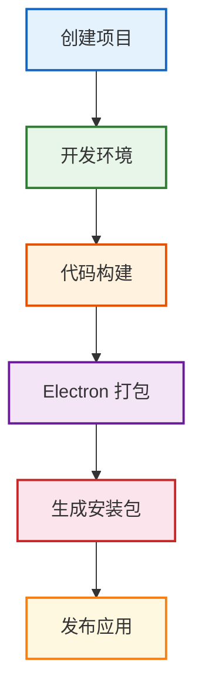
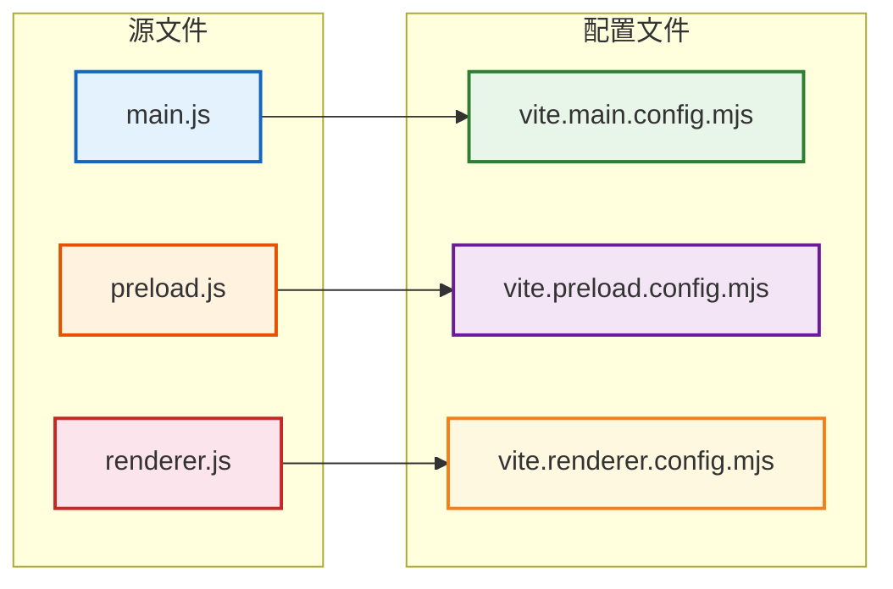
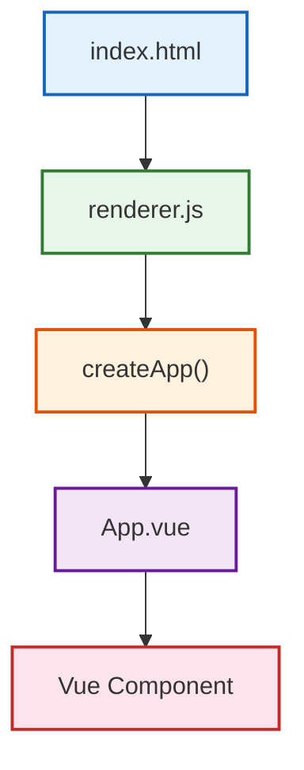

## 一、Electron Forge：从 Demo 进入真正的 Electron 工程

Electron 本身主要提供桌面运行时以及 Main、Renderer、IPC、BrowserWindow 等核心能力。

但真正开发一个桌面软件，还涉及：



如果所有事情都自己配置，工程成本会非常高。

所以 Electron 官方生态提供了：

**Electron Forge**

Electron Forge 可以理解成 Electron 项目的工程化工具链，它负责把开发、构建、打包、Maker、Publisher 等能力统一起来。官方也推荐通过 `create-electron-app`初始化现代 Electron 项目。

我们这一章使用：`Electron Forge + Vite`

创建项目：

```PowerShell
npx create-electron-app@latest electron-forge-demo --template=vite
```

进入目录：

```PowerShell
cd electron-forge-demo
```

启动：

```PowerShell
npm start
```

Electron Forge 当前提供 Vite 模板，使用 `--template=vite` 即可初始化，创建完成后通过 `npm start` 启动。

**报错提示：**

在执行`npm start`的时候，可能报如下错误：

> Downloading Electron binary...
> TypeError: fetch failed

原因在于：

> Electron 的二进制文件没有下载成功。

还有一个报错信息：

> Electron failed to install correctly.
> Please delete `node_modules/electron`

这个的主要原因是：·

> 当前 `node_modules/electron` 是一个“不完整安装”。

解决方案：

1、先删除 Electron：

```PowerShell
Remove-Item -Recurse -Force node_modules\electron
```

2、在 Windows 国内网络环境下，可以给 Electron 配置镜像：

```PowerShell
$env:ELECTRON_MIRROR="https://npmmirror.com/mirrors/electron/"
```

3、再执行：

```PowerShell
npm install electron --save-dev
```

4、然后：

```PowerShell
npm start
```

**核心目录**

```
electron-forge-demo                    # 项目根目录
│
├── src                                # 源代码目录
│   ├── index.html                     # 渲染进程入口 HTML
│   ├── index.css                      # 渲染进程样式
│   ├── main.js                        # 主进程入口
│   ├── preload.js                     # 预加载脚本
│   └── renderer.js                    # 渲染进程入口
│
├── forge.config.js                    # Electron Forge 配置文件
│
├── vite.main.config.mjs               # Vite 主进程构建配置
├── vite.preload.config.mjs            # Vite 预加载脚本构建配置
├── vite.renderer.config.mjs           # Vite 渲染进程构建配置
│
├── package.json                       # 项目依赖和脚本
├── package-lock.json                  # 依赖锁定文件
└── node_modules                       # 依赖包目录
```

**为什么会出现三个 Vite 配置？**

因为 Electron 不是一个普通网页。

它至少存在三个不同运行环境：

```
Main
Preload
Renderer
```

所以它们不能完全按照同一套构建环境处理。

可以建立这样的映射：



还有一个非常容易混淆的问题：

```
Electron Forge 和 Vite 是不是同一个东西？
```

不是。

可以这样理解：

```
Vite
负责代码构建

Electron Forge
负责 Electron 工程生命周期
```

完整关系：

```
Vue / JS / CSS
      ↓
     Vite
      ↓
Electron Renderer

      ↓

Electron Forge

      ↓

Electron App

      ↓

exe / dmg / deb
```

所以：

> Forge 管工程，Vite 管代码构建。

## 二、在 Electron Forge 中集成 Vue 3 和 Tailwind CSS

### 1、集成vue

Electron Renderer 本质上就是 Web 页面，因此完全可以使用 Vue。

而且一定要明确：

> Vue 运行在 Renderer，而不是 Main Process。

安装 Vue：

```PowerShell
npm install vue
```

安装 Vue 的 Vite Plugin：

```PowerShell
npm install -D @vitejs/plugin-vue
```

修改`vite.renderer.config.mjs`

```JavaScript
import { defineConfig } from 'vite' 
import vue from '@vitejs/plugin-vue' 
  
export default defineConfig({ 
  plugins: [ vue() ] 
})
```

注意，我们为什么没有修改：`vite.main.config.mjs`

因为 Main 不负责页面。

也没有修改：`vite.preload.config.mjs`

因为 Preload 也不负责 UI。

Vue 属于：`Renderer`

所以：

```
Vue Plugin
    ↓
vite.renderer.config.mjs
```

创建：

```
src/App.vue
```

<script setup>
const title = 'Electron + Vue 3'
</script>

<template>
  <main>
    <h1>{{ title }}</h1>
  </main>
</template>

修改 `renderer.js`

```JavaScript
import { createApp } from 'vue'
import App from './App.vue'

createApp(App).mount('#app')
```

然后 index.html 中准备 Vue 挂载节点：

现在整个 Renderer 的启动链路就是：



### 2、集成Tailwind CSS

**Tailwind** 是一种 **Utility First CSS Framework。**

以前写 CSS：

```CSS
.button { 
  padding: 8px 16px; 
  background: blue; 
  color: white; 
  border-radius: 8px; 
}
```

Tailwind：

```HTML
<button class="px-4 py-2 bg-blue-500 text-white rounded-lg">保存</button>
```

它最大的价值不只是“少写 CSS”，而是：

- 快速开发
- 统一设计规范
- 减少CSS命名成本
- 非常适合组件化
- 状态样式简单
- 响应式简单

**安装**

```PowerShell
npm install tailwindcss @tailwindcss/vite
```

**修改 `vite.renderer.config.mjs`**

```JavaScript
import { defineConfig } from 'vite';
import vue from '@vitejs/plugin-vue'
import tailwindcss from '@tailwindcss/vite'

export default defineConfig({
  plugins: [vue(), tailwindcss()]
});
```

**修改 `src/index.css`**

```CSS
@import "tailwindcss"
```

在 `Renderer`中引入：

```JavaScript
import { createApp } from 'vue'
import App from './App.vue'
import './index.css'

createApp(App).mount('#app')
```

**测试**

```HTML
<template>
  <h1 class="text-4xl font-bold text-blue-500" > 
  	Electron + Vue 
  </h1> 
</template>
```

### 3、Tailwind CSS IntelliSense 使用

在 VS Code 中开发 Tailwind CSS 时，推荐安装官方插件：`Tailwind CSS IntelliSense`

它的主要作用有：

- Tailwind 类名自动补全
- 鼠标悬停查看对应 CSS
- Tailwind 类名错误检查
- 颜色预览
- 提升 Vue / HTML 中编写 Tailwind 的效率

例如在 Vue 中输入：

```Vue
<div class="flex items-">
```

正常情况下，插件会自动提示：

```
items-center
items-start
items-end
items-stretch
...
```

如果没有自动弹出，也可以使用：

```
Ctrl + Space
```

手动触发补全。

鼠标悬停在：

```
flex
```

上时，可以看到类似：

```
display: flex;
```

也就是说，这个插件不仅是“补全工具”，还可以帮助我们理解：

```
Tailwind Class
↓
实际 CSS
```

对于学习 Tailwind 很有帮助。

---
