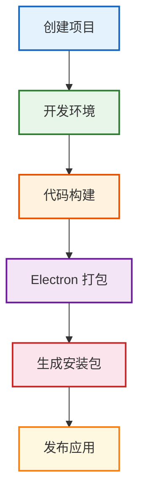
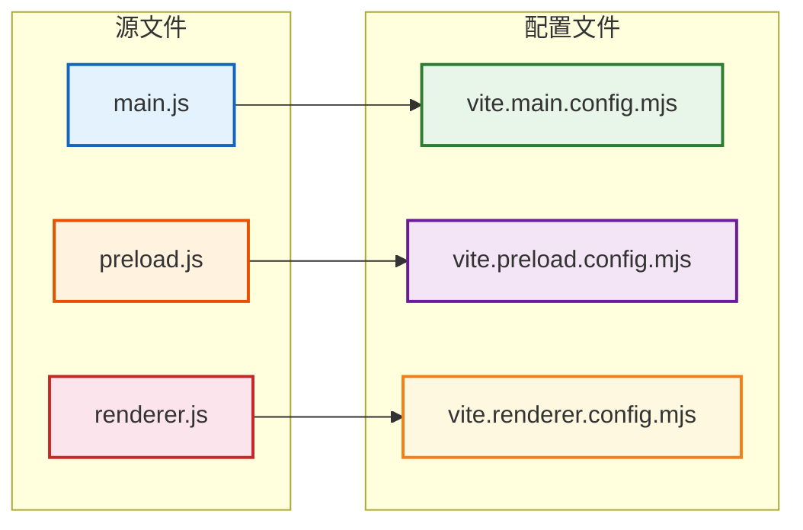
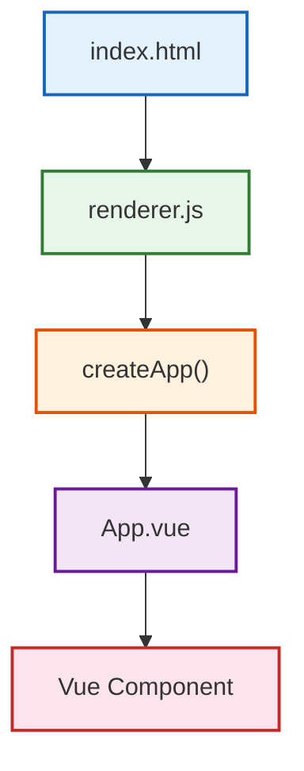

## 一、Electron Forge：从 Demo 进入真正的 Electron 工程

Electron 本身主要提供桌面运行时以及 Main、Renderer、IPC、BrowserWindow 等核心能力。

但真正开发一个桌面软件，还涉及：



如果所有事情都自己配置，工程成本会非常高。

所以 Electron 官方生态提供了：

**Electron Forge**

Electron Forge 可以理解成 Electron 项目的工程化工具链，它负责把开发、构建、打包、Maker、Publisher 等能力统一起来。官方也推荐通过 `create-electron-app` 初始化现代 Electron 项目。

我们这一章使用：`Electron Forge + Vite`

创建项目：

```powershell
npx create-electron-app@latest electron-forge-demo --template=vite
```

进入目录：

```powershell
cd electron-forge-demo
```

启动：

```powershell
npm start
```

Electron Forge 当前提供 Vite 模板，使用 `--template=vite` 即可初始化，创建完成后通过 `npm start` 启动。

**报错提示：**

在执行 `npm start` 的时候，可能报如下错误：

> Downloading Electron binary...
> TypeError: fetch failed

原因在于：

> Electron 的二进制文件没有下载成功。

还有一个报错信息：

> Electron failed to install correctly.
> Please delete `node_modules/electron`

这个的主要原因是：

> 当前 `node_modules/electron` 是一个"不完整安装"。

解决方案：

1、先删除 Electron：

```powershell
Remove-Item -Recurse -Force node_modules\electron
```

2、在 Windows 国内网络环境下，可以给 Electron 配置镜像：

```powershell
$env:ELECTRON_MIRROR="https://npmmirror.com/mirrors/electron/"
```

3、再执行：

```powershell
npm install electron --save-dev
```

4、然后：

```powershell
npm start
```

**核心目录**

```text
electron-forge-demo                    # 项目根目录
│
├── src                                # 源代码目录
│   ├── index.html                     # 渲染进程入口 HTML
│   ├── index.css                      # 渲染进程样式
│   ├── main.js                        # 主进程入口
│   ├── preload.js                     # 预加载脚本
│   └── renderer.js                    # 渲染进程入口
│
├── forge.config.js                    # Electron Forge 配置文件
│
├── vite.main.config.mjs               # Vite 主进程构建配置
├── vite.preload.config.mjs            # Vite 预加载脚本构建配置
├── vite.renderer.config.mjs           # Vite 渲染进程构建配置
│
├── package.json                       # 项目依赖和脚本
├── package-lock.json                  # 依赖锁定文件
└── node_modules                       # 依赖包目录
```

**为什么会出现三个 Vite 配置？**

因为 Electron 不是一个普通网页。

它至少存在三个不同运行环境：

```text
Main
Preload
Renderer
```

所以它们不能完全按照同一套构建环境处理。

可以建立这样的映射：



还有一个非常容易混淆的问题：

```text
Electron Forge 和 Vite 是不是同一个东西？
```

不是。

可以这样理解：

```text
Vite
负责代码构建

Electron Forge
负责 Electron 工程生命周期
```

完整关系：

```text
Vue / JS / CSS
      ↓
     Vite
      ↓
Electron Renderer

      ↓

Electron Forge

      ↓

Electron App

      ↓

exe / dmg / deb
```

所以：

> Forge 管工程，Vite 管代码构建。

## 二、在 Electron Forge 中集成 Vue 3 和 Tailwind CSS

### 1、集成 Vue

Electron Renderer 本质上就是 Web 页面，因此完全可以使用 Vue。

而且一定要明确：

> Vue 运行在 Renderer，而不是 Main Process。

安装 Vue：

```powershell
npm install vue
```

安装 Vue 的 Vite Plugin：

```powershell
npm install -D @vitejs/plugin-vue
```

修改 `vite.renderer.config.mjs`：

```javascript
import { defineConfig } from 'vite'
import vue from '@vitejs/plugin-vue'

export default defineConfig({
  plugins: [vue()]
})
```

注意，我们为什么没有修改：`vite.main.config.mjs`

因为 Main 不负责页面。

也没有修改：`vite.preload.config.mjs`

因为 Preload 也不负责 UI。

Vue 属于：`Renderer`

所以：

```text
Vue Plugin
    ↓
vite.renderer.config.mjs
```

创建 `src/App.vue`：

```vue
<script setup>
const title = 'Electron + Vue 3'
</script>

<template>
  <main>
    <h1>{{ title }}</h1>
  </main>
</template>
```

修改 `renderer.js`：

```javascript
import { createApp } from 'vue'
import App from './App.vue'

createApp(App).mount('#app')
```

然后在 index.html 中准备 Vue 挂载节点。

现在整个 Renderer 的启动链路就是：



### 2、集成 Tailwind CSS

**Tailwind** 是一种 **Utility First CSS Framework**。

以前写 CSS：

```css
.button {
  padding: 8px 16px;
  background: blue;
  color: white;
  border-radius: 8px;
}
```

Tailwind：

```html
<button class="px-4 py-2 bg-blue-500 text-white rounded-lg">保存</button>
```

它最大的价值不只是"少写 CSS"，而是：

- 快速开发
- 统一设计规范
- 减少 CSS 命名成本
- 非常适合组件化
- 状态样式简单
- 响应式简单

**安装**

```powershell
npm install tailwindcss @tailwindcss/vite
```

**修改 `vite.renderer.config.mjs`**

```javascript
import { defineConfig } from 'vite';
import vue from '@vitejs/plugin-vue'
import tailwindcss from '@tailwindcss/vite'

export default defineConfig({
  plugins: [vue(), tailwindcss()]
});
```

**修改 `src/index.css`**

```css
@import "tailwindcss"
```

在 `Renderer` 中引入：

```javascript
import { createApp } from 'vue'
import App from './App.vue'
import './index.css'

createApp(App).mount('#app')
```

**测试**

```html
<template>
  <h1 class="text-4xl font-bold text-blue-500">
    Electron + Vue
  </h1>
</template>
```

### 3、Tailwind CSS IntelliSense 使用

在 VS Code 中开发 Tailwind CSS 时，推荐安装官方插件：`Tailwind CSS IntelliSense`

它的主要作用有：

- Tailwind 类名自动补全
- 鼠标悬停查看对应 CSS
- Tailwind 类名错误检查
- 颜色预览
- 提升 Vue / HTML 中编写 Tailwind 的效率

例如在 Vue 中输入：

```vue
<div class="flex items-">
```

正常情况下，插件会自动提示：

```text
items-center
items-start
items-end
items-stretch
...
```

如果没有自动弹出，也可以使用：

```text
Ctrl + Space
```

手动触发补全。

鼠标悬停在：

```text
flex
```

上时，可以看到类似：

```text
display: flex;
```

也就是说，这个插件不仅是"补全工具"，还可以帮助我们理解：

```text
Tailwind Class
↓
实际 CSS
```

对于学习 Tailwind 很有帮助。

## 三、Tailwind CSS 基础与三栏布局实战

文档不需要刻意记住，遇到不太明白的内容，直接查阅官方文档即可：[www.tailwindcss.cn](https://www.tailwindcss.cn/)

基于文档，手动完成经典的桌面软件的三栏布局。

```text
┌──────────┬────────────────────┬──────────────┐
│          │                    │              │
│ Sidebar  │   Main Content     │ Right Panel  │
│          │                    │              │
│          │                    │              │
└──────────┴────────────────────┴──────────────┘
```

Vue 的样式代码为：

```vue
<template>
<div class="flex w-screen h-screen overflow-hidden">
  <!-- Sidebar -->
  <aside class="w-64 shrink-0 bg-gray-100 h-full overflow-y-auto">
    Sidebar
  </aside>

  <!-- Main Content -->
  <main class="flex-1 min-w-0 bg-white h-full overflow-y-auto">
    Main Content
  </main>

  <!-- Right Panel -->
  <aside class="w-72 shrink-0 bg-gray-50 h-full overflow-y-auto">
    Right Panel
  </aside>
</div>
</template>
```

## 四、Iconify、Reka UI 与无障碍

一个成熟桌面应用几乎一定需要大量图标：

```text
首页 搜索 设置 关闭 用户 文件 菜单 删除 编辑 刷新
```

如果每一种图标库都单独安装：

```text
Material Icons
Lucide
Tabler
FontAwesome
Heroicons
```

管理成本会越来越高。

Iconify 提供了一套统一的图标接口，可以使用大量不同图标集。

安装 Vue 组件：

```powershell
npm install @iconify/vue
```

使用：

```vue
<script setup>

import { Icon } from '@iconify/vue'

</script>

<template>

  <Icon
    icon="lucide:settings"
    class="text-xl"
  />

</template>
```

Iconify 的命名方式非常容易理解：`图标库:图标名称`

例如：

- `lucide:settings`
- `mdi:home`
- `material-symbols:search`

Iconify 官方提供大量图标集合，并统一以 SVG 方式使用。

接下来是 UI 组件库。

这里要纠正一个名称：

以前叫 **Radix Vue**，现在已经更名为 **Reka UI**。

Reka UI 官方明确说明它是 Radix Vue v2 演进后的新名称，新项目应该直接使用 `reka-ui`。

安装：

```powershell
npm install reka-ui
```

官方安装方式同样是直接添加 `reka-ui`。

Reka UI 和 Element Plus 最大的区别是：

**Element Plus** 提供的是：

样式 + 行为 + 组件

而 **Reka UI** 更接近：

行为 + 状态 + 键盘操作 + Focus + ARIA

至于长什么样，交给 Tailwind。

这种库通常称为：**Headless UI**

因此：

- **Reka UI** 负责交互和行为
- **Tailwind** 负责视觉

这也是为什么：

**Reka UI + Tailwind** 非常适合构建自己的桌面 UI 系统。

更重要的是 Reka UI 强调 Accessibility，也就是无障碍。

无障碍并不能简单理解成"专门给残障用户使用"，更准确的是：

> 让使用不同输入设备、辅助工具以及存在不同身体能力的用户，都可以正常操作软件。

例如：

```html
<div @click="save">
  保存
</div>
```

鼠标可以点击。

但需要继续问：

- Tab 能选中吗？
- Enter 可以执行吗？
- Space 可以执行吗？
- 屏幕阅读器知道它是按钮吗？

未必。

而：

```html
<button @click="save">
  保存
</button>
```

天然拥有更好的语义。

Web 无障碍至少要关注四个方面：

- Semantic HTML（语义化 HTML）
- Keyboard Navigation（键盘导航）
- Focus Management（焦点管理）
- ARIA（无障碍语义）

例如一个 Dialog，用户点击"打开设置"之后，合理行为应该是：

```text
打开 Dialog
↓
Focus 进入 Dialog
↓
Tab 只能合理地在 Dialog 中移动
↓
Escape 关闭
↓
关闭后 Focus 返回原来的按钮
```

如果全部自己实现，会涉及大量细节。

Reka UI 会帮助开发者处理 WAI-ARIA、Focus Management、键盘导航等问题。

例如实现一个设置 Dialog：

```vue
<script setup>

import {
  DialogRoot,
  DialogTrigger,
  DialogPortal,
  DialogOverlay,
  DialogContent,
  DialogTitle,
  DialogDescription,
  DialogClose
} from 'reka-ui'

import { Icon } from '@iconify/vue'

</script>


<template>

  <DialogRoot>

    <DialogTrigger
      class="
        inline-flex
        items-center
        gap-2
        rounded-lg
        bg-blue-500
        px-4
        py-2
        text-white
        hover:bg-blue-600
        focus:outline-none
        focus:ring-2
      "
    >

      <Icon icon="lucide:settings" />

      设置

    </DialogTrigger>


    <DialogPortal>

      <DialogOverlay
        class="
          fixed
          inset-0
          bg-black/40
        "
      />


      <DialogContent
        class="
          fixed
          left-1/2
          top-1/2
          w-96
          -translate-x-1/2
          -translate-y-1/2
          rounded-xl
          bg-white
          p-6
          shadow-xl
        "
      >

        <DialogTitle
          class="text-xl font-semibold"
        >
          应用设置
        </DialogTitle>


        <DialogDescription
          class="mt-2 text-sm text-gray-500"
        >
          修改应用相关配置。
        </DialogDescription>


        <DialogClose
          class="
            mt-6
            inline-flex
            items-center
            gap-2
            rounded-lg
            bg-gray-100
            px-4
            py-2
            hover:bg-gray-200
            focus:ring-2
          "
        >

          <Icon icon="lucide:x" />

          关闭

        </DialogClose>

      </DialogContent>

    </DialogPortal>

  </DialogRoot>

</template>
```

这里四套技术各自承担不同职责：

- **Vue** 负责组件和状态
- **Tailwind** 负责样式
- **Iconify** 负责图标
- **Reka UI** 负责 Dialog 行为与 Accessibility

验证这个组件不能只用鼠标点一下，还应该测试：

- Tab
- Shift + Tab
- Enter
- Space
- Escape
- Focus

这才叫真正验证无障碍。

## 五、综合实战：实现一个 Electron Command Palette

最后我们不要再做简单 Card 或 Button，而是实现一个更接近真正桌面软件的组件：Command Palette。

它类似 VS Code 中 `Ctrl + Shift + P` 打开的命令面板。

最终效果：

```text
┌─────────────────────────────────────┐
│ 🔍 搜索命令...                       │
├─────────────────────────────────────┤
│ 🏠 返回首页                          │
│ 📁 打开文件                          │
│ ⚙️ 打开设置                          │
│ 🌙 切换主题                          │
│ 🔄 检查更新                          │
└─────────────────────────────────────┘
```

首先安装全部依赖：

```powershell
npm install vue
npm install @iconify/vue
npm install reka-ui
npm install -D @vitejs/plugin-vue
npm install tailwindcss @tailwindcss/vite
```

创建 `src/components/CommandPalette.vue`，实现：

```vue
<script setup>

import { ref, computed } from 'vue'
import { Icon } from '@iconify/vue'

import {
  DialogRoot,
  DialogPortal,
  DialogOverlay,
  DialogContent,
  DialogTitle
} from 'reka-ui'


const open = ref(false)

const keyword = ref('')


const commands = [

  {
    name: '返回首页',
    icon: 'lucide:house'
  },

  {
    name: '打开文件',
    icon: 'lucide:folder-open'
  },

  {
    name: '打开设置',
    icon: 'lucide:settings'
  },

  {
    name: '切换主题',
    icon: 'lucide:moon'
  },

  {
    name: '检查更新',
    icon: 'lucide:refresh-cw'
  }

]


const filteredCommands = computed(() => {

  return commands.filter(command =>
    command.name
      .toLowerCase()
      .includes(keyword.value.toLowerCase())
  )

})


function executeCommand(command) {

  console.log(
    'execute:',
    command.name
  )

  open.value = false

}

</script>


<template>

  <div>

    <button
      class="
        inline-flex
        items-center
        gap-2
        rounded-lg
        border
        border-gray-200
        bg-white
        px-4
        py-2
        text-sm
        shadow-sm
        hover:bg-gray-50
        focus:ring-2
      "
      @click="open = true"
    >

      <Icon
        icon="lucide:command"
      />

      打开命令面板

    </button>


    <DialogRoot v-model:open="open">

      <DialogPortal>

        <DialogOverlay
          class="
            fixed
            inset-0
            bg-black/40
            backdrop-blur-sm
          "
        />


        <DialogContent
          class="
            fixed
            left-1/2
            top-[20%]
            w-[520px]
            max-w-[90vw]
            -translate-x-1/2
            overflow-hidden
            rounded-xl
            border
            border-gray-200
            bg-white
            shadow-2xl
          "
        >

          <DialogTitle
            class="sr-only"
          >
            命令面板
          </DialogTitle>


          <div
            class="
              flex
              items-center
              gap-3
              border-b
              border-gray-200
              px-4
            "
          >

            <Icon
              icon="lucide:search"
              class="text-xl text-gray-400"
            />


            <input
              v-model="keyword"
              type="text"
              aria-label="搜索命令"
              placeholder="搜索命令..."
              class="
                h-14
                flex-1
                border-none
                bg-transparent
                outline-none
              "
            >

          </div>


          <div
            class="
              max-h-80
              overflow-y-auto
              p-2
            "
          >

            <button
              v-for="command in filteredCommands"
              :key="command.name"
              class="
                flex
                w-full
                items-center
                gap-3
                rounded-lg
                px-3
                py-3
                text-left
                hover:bg-gray-100
                focus:bg-gray-100
                focus:outline-none
              "
              @click="executeCommand(command)"
            >

              <Icon
                :icon="command.icon"
                class="
                  text-lg
                  text-gray-500
                "
              />

              <span>
                {{ command.name }}
              </span>

            </button>


            <div
              v-if="filteredCommands.length === 0"
              class="
                py-8
                text-center
                text-sm
                text-gray-400
              "
            >
              没有找到命令
            </div>

          </div>

        </DialogContent>

      </DialogPortal>

    </DialogRoot>

  </div>

</template>
```

然后在 `App.vue` 中使用：

```vue
<script setup>

import CommandPalette
  from './components/CommandPalette.vue'

</script>


<template>

  <div
    class="
      flex
      h-screen
      items-center
      justify-center
      bg-gray-100
    "
  >

    <CommandPalette />

  </div>

</template>
```

此时这个组件已经同时涉及：

- Electron Forge
- Vue 3
- Tailwind CSS
- Iconify
- Reka UI
- Accessibility

但这个版本还只是第一版。

真正做成类似 VS Code 的 Command Palette，我们下一步还应该增加：

- `Ctrl + Shift + P` 快捷键
- ↑ ↓ 方向键选择
- Enter 执行
- 当前选中状态
- 命令分组
- 键盘快捷键展示
- Transition 动画
- Dark Mode

这些内容非常适合作为后续组件实战继续完善。
