Electron 是桌面端开发中非常有代表性的技术方案。它允许我们使用 HTML、CSS、JavaScript 开发 Windows、macOS 和 Linux 桌面应用。

但学习 Electron 最容易犯的错误，就是一上来使用 Electron Forge、Vue、React、Vite 等工具。

这样虽然能够快速启动项目，却很容易变成：

> 项目跑起来了，但不知道 Electron 到底干了什么。

因此本文第一阶段不使用任何 Electron 脚手架，也不使用 Vue、React。

我们直接从零开始搭建一个 Electron 项目，重点理解：

- Electron 是什么
- BrowserWindow 是什么
- 主进程和渲染进程是什么
- Preload 为什么存在
- Renderer 和 Main 如何通信
- `send/on` 和 `invoke/handle` 的区别
- Main 如何主动向 Renderer 发送消息
- sandbox、contextIsolation、nodeIntegration 的关系
- remote 为什么逐渐被淘汰

最终我们会完成一个简单的 Electron 桌面工具箱。

## 一、从零运行第一个 Electron 程序

Electron 可以简单理解成：

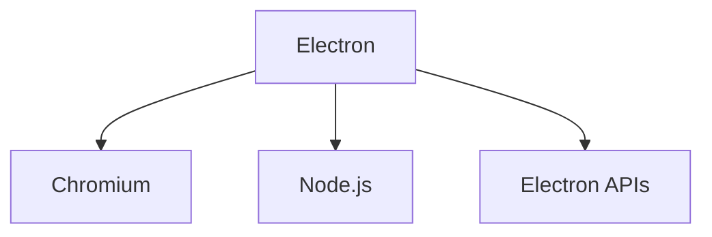

**Chromium 负责：**

- HTML
- CSS
- JavaScript
- DOM
- 页面渲染

**Node.js 和 Electron API 则提供：**

- 文件系统
- 操作系统
- 窗口管理
- 菜单
- 通知
- 剪贴板
- 进程
- 本地程序调用

因此 Electron 最大的特点就是：

> 使用 Web 技术开发具有操作系统能力的桌面应用。

普通浏览器中的 JavaScript 默认不能：

```JavaScript
const fs = require('fs')
```

然后直接读取电脑文件。

但 Electron 可以通过 Main Process、Preload 和 IPC 安全地完成这些事情。

### 1、创建项目

先新建目录：

```PowerShell
mkdir electron-basic

cd electron-basic
```

初始化：

```PowerShell
npm init -y
```

直接安装 Electron：

```PowerShell
npm install electron --save-dev
```

这里我们故意不使用：

- electron-forge
- electron-builder
- vite
- webpack
- vue
- react

因为当前目标不是工程化，而是理解 Electron。

Electron 官方依然支持直接安装 Electron 进行开发。

### 2、创建项目结构

创建：

```
electron-basic/ 
│ 
├── package.json 
├── main.js 
├── preload.js 
├── index.html 
├── renderer.js 
├── child.html 
└── child.js
```

现在先创建：

```
main.js + index.html
```

**main.js：**

```JavaScript
const { app, BrowserWindow } = require('electron');

function createWindow() {
    const win = new BrowserWindow({
        width: 1000,
        height: 700
    });

    win.loadFile('index.html');
}

app.whenReady().then(() => {
    createWindow();
});
```

**index.html：**

```HTML
<!DOCTYPE html>
<html lang="zh-CN">

<head>
  <meta charset="UTF-8">
  <title>Electron Demo</title>
</head>

<body>
  <h1>Hello Electron</h1>
  <p>我的第一个 Electron 应用</p>
</body>

</html>
```

运行：

```PowerShell
npm start
```

如果正常，你会看到一个真正的桌面窗口。

这里最重要的不是窗口出现了，而是理解发生了什么：

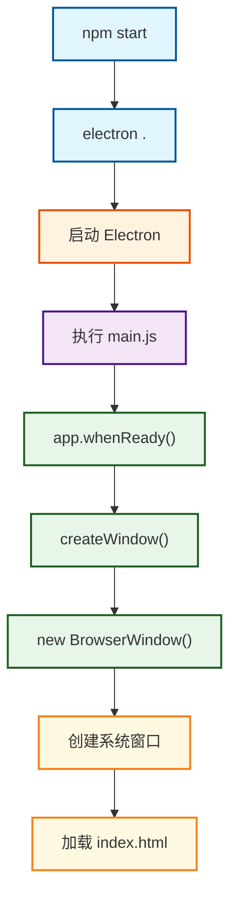

### 3、BrowserWindow 到底是什么

BrowserWindow 创建的是：

> 一个操作系统级别的窗口。

大致结构为：

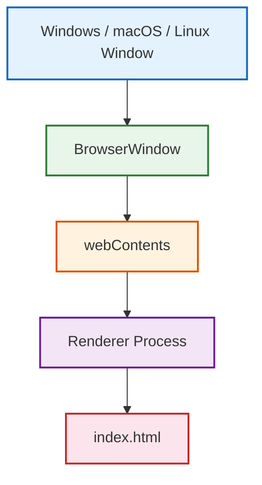

其中：

BrowserWindow负责窗口本身。

例如：

- 尺寸
- 位置
- 最大化
- 最小化
- 关闭
- 标题
- 窗口图标

而：

webContents负责窗口中的网页内容。

例如：

- 加载网页
- 执行 JavaScript
- 发送 IPC
- 打开 DevTools
- 监听页面加载

> Electron 官方将 `webContents` 定义为用于渲染和控制网页内容的对象。

### 4、使用 nodemon 自动重启 Electron

在开发过程中不能每一次都改都需要重新启动`npm start`

因此安装 nodemon：

```PowerShell
npm install nodemon --save-dev
```

修改package.json：

```JSON
{ 
  "scripts": { 
    "start": "electron .", 
    "dev": "nodemon --exec electron ." 
  } 
}
```

运行：

```PowerShell
npm run dev
```

然后修改：

```
width: 1200
```

保存。

你会看到 Electron 自动重新启动。

不过这里必须理解：

> nodemon 并不是 Electron 的热更新。

它实际上是：

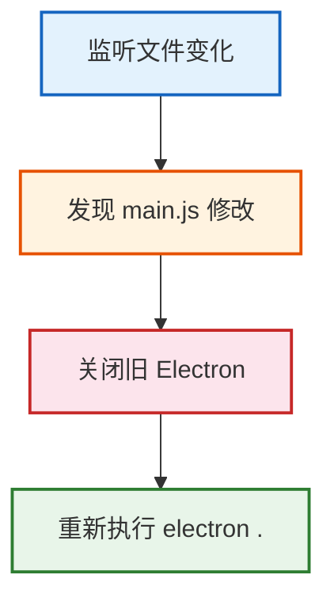

> 因此准确来说它是自动重启。而不是前端开发中真正的 HMR。

### 5、实战：创建第二个窗口

修改 `main.js`：

```JavaScript
const { app, BrowserWindow } = require("electron");


let mainWindow;

function createMainWindow() {
  mainWindow = new BrowserWindow({
    width: 1000,
    height: 700
  })
  mainWindow.loadFile("index.html")
}

function createChildWindow() {
  const childWindow = new BrowserWindow({
    width: 500,
    height: 300,
    parent: mainWindow,
    title: '子窗口'
  })
  childWindow.loadFile("child.html")
}

app.whenReady().then(() => {
  createMainWindow();

  setTimeout(() => {
    createChildWindow()
  }, 2000)
})
```

创建`child.html`

```HTML
<!DOCTYPE html>
<html lang="en">
<head>
  <meta charset="UTF-8">
  <meta name="viewport" content="width=device-width, initial-scale=1.0">
  <title>Document</title>
</head>
<body>
  <h1>子窗口</h1>
</body>
</html>
```

运行：

```
npm run dev
```

两秒后会出现第二个窗口。

现在应用结构已经变成：

```
Main Process 
│ 
├── BrowserWindow 
│   └── index.html 
│   
└── BrowserWindow 
     └── child.html
```

而这正好引出了 Electron 最重要的设计：

> 多进程架构。

## 二、Electron 的进程架构

学习 IPC 之前必须先搞明白一个问题：

> 为什么 Renderer 不能直接调用 Main 中的东西？

因为它们根本不是同一个进程。

### 1、什么是进程

可以简单理解：

> 一个正在运行的程序实例。

例如：

```
Chrome.exe
Code.exe 
WeChat.exe 
electron.exe
```

操作系统会给不同进程提供相对独立的：

- 内存
- 资源
- 执行环境
- 地址空间

可以粗略理解：

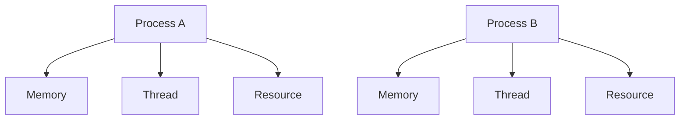

Process A 不能直接随意读取 Process B 的内存。

因此不同进程之间想交换数据，就需要：

`IPC`

全称：

`Inter-Process Communication`

也就是：

> 进程间通信。

### 2、什么是线程

线程则是：

> 进程内部真正执行任务的执行单元。

例如：

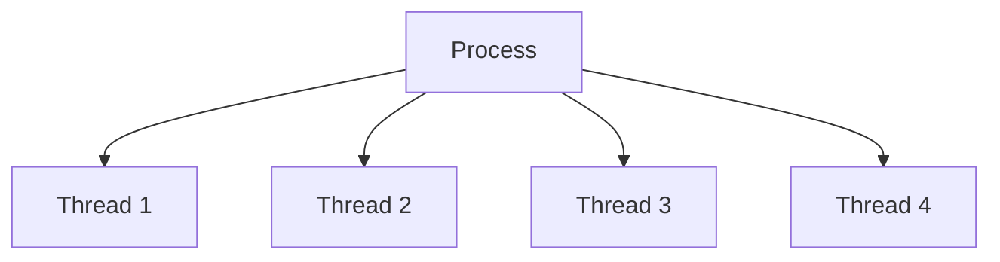

可以粗略记忆：

```
进程 
负责资源隔离 

线程 
负责执行任务
```

多个线程通常共享所属进程中的部分资源，因此线程通信成本一般比跨进程通信低。

但是线程也会产生：

- 竞争
- 锁
- 线程安全
- 死锁

等问题。

### 3、Electron 的核心进程

Electron 最重要的是：

```
graph TD
    A["Electron App"] --> B["Main Process"]
    A --> C["Renderer Process"]
```

**Main Process负责：**

- 应用生命周期
- 窗口管理
- 文件系统
- 系统 API
- 菜单
- 托盘
- 通知
- dialog
- IPC 管理

例如：

```JavaScript
const { app, BrowserWindow, ipcMain } = require('electron');
```

这些代码主要运行在 Main Process。

**Renderer Process负责：**

- HTML
- CSS
- JavaScript
- DOM
- 页面交互
- UI

例如：

```JavaScript
document.querySelector('#button')
    .addEventListener('click', () => {
        console.log('click');
    });
```

就是 Renderer 的代码。

因此以后应该记住一句话：

```
Main 管系统 
Renderer 管页面
```

### 4、Electron 为什么这么设计

Electron 底层使用 Chromium。

而 Chromium 本身就是多进程架构。

所以：

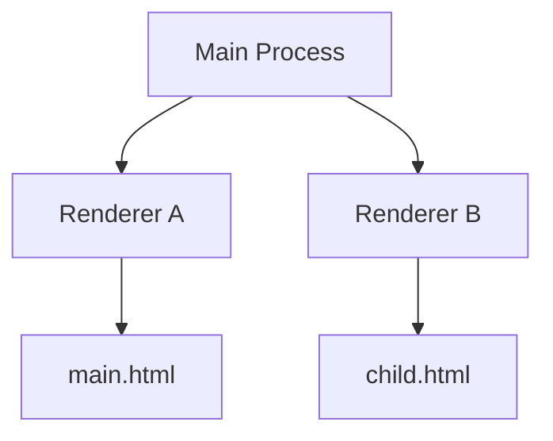

不同窗口之间可以相对隔离。

其中一个 Renderer 出问题，并不意味着 Main Process 一定一起崩溃。

这种架构带来的核心价值就是：

- 隔离
- 安全
- 稳定
- 权限控制

但是代价是：

> 不同进程不能随便直接调用彼此代码。

于是就需要 IPC。

## 三、Preload 与三种 IPC 通信实战

### 1、为什么需要 Preload

假设页面有一个按钮：

> 读取文件

Renderer 里面直接：

```JavaScript
const fs = require('fs')
```

理论上很方便。

但这意味着页面代码拥有非常高的系统权限。

如果页面出现 XSS：

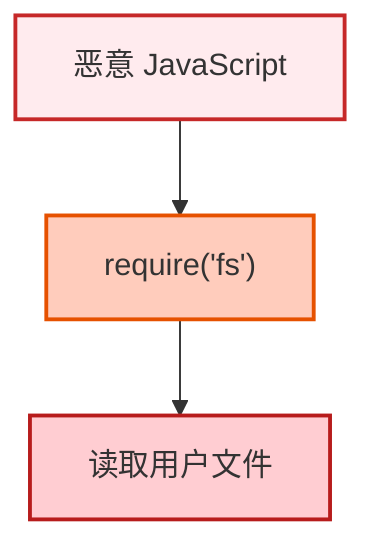

问题就从：

> 网页安全漏洞

升级成：

> 桌面程序安全漏洞

甚至可能演变成：

> 命令执行。

所以现代 Electron 的核心思想是：

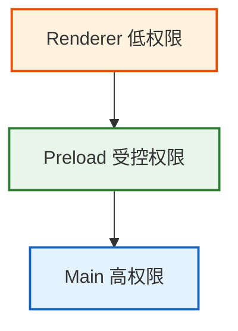

Preload 可以理解成：

> Renderer 和 Main 之间的安全权限网关。

Electron 官方建议通过 preload + `contextBridge` 暴露有限 API，而不是直接把整个 `ipcRenderer` 暴露给页面。

### 2、配置 Preload

修改`main.js`

```JavaScript
const path = require('node:path');

const win = new BrowserWindow({
    width: 1000,
    height: 700,
    webPreferences: { // 网页功能扩展
        preload: path.join(__dirname, 'preload.js'), // 加载预加载脚本
        contextIsolation: true, // 和预加载脚本隔离环境
        nodeIntegration: false // 禁用渲染进程直接使用 Node.js 能力。
    }
});
```

创建`preload.js`

```JavaScript
const { contextBridge } = require('electron');

contextBridge.exposeInMainWorld(
    'electronAPI',
    {
        hello() {
            return 'Hello Electron';
        }
    }
);
```

修改`Renderer`

```JavaScript
console.log( window.electronAPI.hello())
```

调用链：

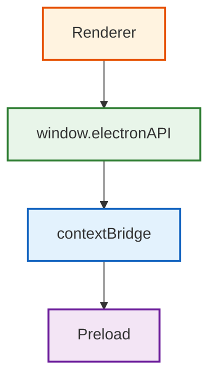

这时候页面并没有得到完整 Node.js 权限。

> 这就是所谓：最小权限原则。

### 3、实战一：Renderer → Main 修改窗口标题

需求：

```
输入标题 
	↓ 
点击按钮 
    ↓ 
Renderer 
    ↓ 
  Main 
    ↓ 
修改 BrowserWindow 标题
```

`index.html`

```HTML
<!DOCTYPE html>
<html lang="zh-CN">
<head>
    <meta charset="UTF-8">
    <title>Electron Demo</title>
</head>
<body>
    <h1>Electron IPC Demo</h1>
    <input id="title" placeholder="请输入窗口标题" />
    <button id="set-title">修改标题</button>
    <script src="./renderer.js"></script>
</body>
</html>
```

`renderer.js`

```JavaScript
const button = document.querySelector('#set-title');
const input = document.querySelector('#title');

button.addEventListener('click', () => {
    const title = input.value;
    window.electronAPI.setTitle(title);
});
```

`preload.js`

```JavaScript
const { contextBridge, ipcRenderer } = require('electron');

contextBridge.exposeInMainWorld(
    'electronAPI',
    {
        setTitle(title) {
            ipcRenderer.send('set-title', title);
        }
    }
);
```

`main.js`

```JavaScript
const { app, BrowserWindow, ipcMain } = require('electron');

ipcMain.on('set-title', (event, title) => {
    const win = BrowserWindow.fromWebContents(event.sender);
    win.setTitle(title);
});
```

完整通信过程：

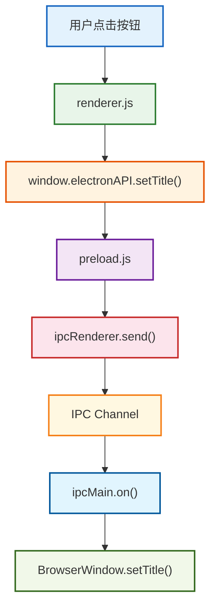

这里：

`ipcRenderer.send()`

代表：

> Renderer 发送消息。

而：`ipcMain.on()`

> Main 监听消息。

所以可以记成：

```
send 
 ↓
on
```

适合：

```
发送命令
通知事件 
不需要返回值
```

### 4、实战二：Renderer ↔ Main 双向通信

现在增加一个功能：

> Renderer 查询当前 Node.js 版本。

这里 Renderer 不仅要发送请求，还需要 Main 返回数据。

最合适的 API：

```JavaScript
ipcRenderer.invoke() 

ipcMain.handle()
```

**Main：**

```JavaScript
ipcMain.handle('get-system-info', () => {
    return {
        node: process.versions.node,
        chrome: process.versions.chrome,
        electron: process.versions.electron,
        platform: process.platform
    };
});
```

**Preload：**

```JavaScript
contextBridge.exposeInMainWorld(
    'electronAPI',
    {
        setTitle(title) {
            ipcRenderer.send('set-title', title);
        },
        getSystemInfo() {
            return ipcRenderer.invoke('get-system-info');
        }
    }
);
```

**HTML:**

```HTML
<button id="system-info"> 获取系统信息 </button> 
<pre id="result"></pre>
```

**renerder**

```JavaScript
const systemButton = document.querySelector('#system-info');
const result = document.querySelector('#result');

systemButton.addEventListener('click', async () => {
    const info = await window.electronAPI.getSystemInfo();
    result.textContent = JSON.stringify(info, null, 2);
});
```

通信过程：

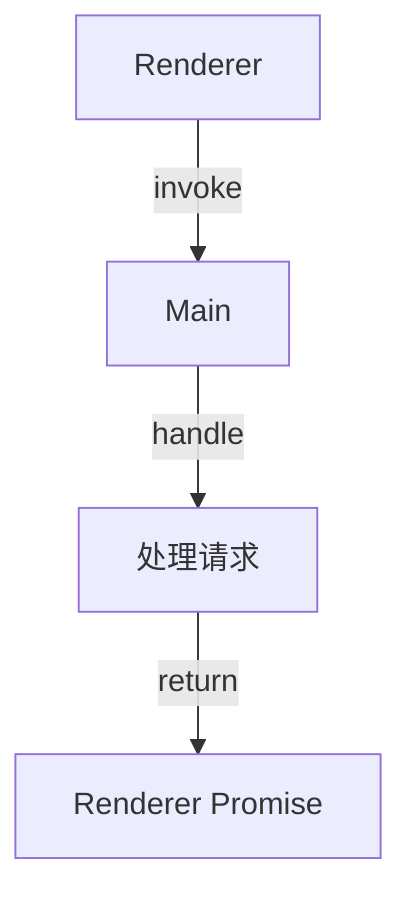

可以把它理解成：

Renderer:

> 我要一个结果

Main:

> 好的，这是结果

特别适合：

```
读取文件
查询数据库
获取系统信息
弹出文件选择框
请求业务数据
```

### 5、send/on 和 invoke/handle 如何选择

记一个非常简单的判断：

不需要：

```
send
+
on
```

例如：

- 设置标题
- 关闭窗口
- 打印日志
- 执行操作

需要：

```
invoke
+
handle
```

例如：

- 读取文件
- 查询系统信息
- 查询数据库
- 获取配置

可以总结：

```
命令型操作
       ↓
send / on

请求型操作
       ↓
invoke / handle
```

### 6、实战三：Main → Renderer 主动通知

第三种场景：

Main Process 主动告诉 Renderer：

> 某件事情发生了。

模拟一个后台任务：

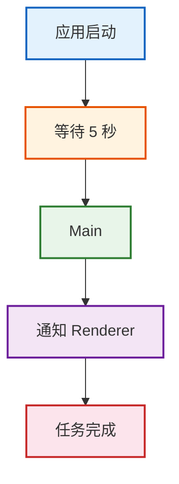

`Main`

```JavaScript
setTimeout(() => {
    mainWindow.webContents.send('task-complete', {
        message: '后台任务执行完成'
    });
}, 5000);
```

`Preload`

```JavaScript
contextBridge.exposeInMainWorld(
    'electronAPI',
    {
        onTaskComplete(callback) {
            ipcRenderer.on('task-complete', (_event, data) => {
                callback(data);
            });
        }
    }
);
```

`HTML`

```HTML
<h3>后台状态</h3>
<div id="task-status"> 等待 Main Process 消息... </div>
```

`Renderer`

```JavaScript
const taskStatus = document.querySelector('#task-status');

window.electronAPI.onTaskComplete(data => {
    taskStatus.textContent = data.message;
});
```

运行程序。

五秒之后：

```
等待 Main Process 消息...
```

变成：

```
后台任务执行完成
```

这里使用：

```
Main:

webContents.send()


Renderer:

ipcRenderer.on()
```

完整链路：

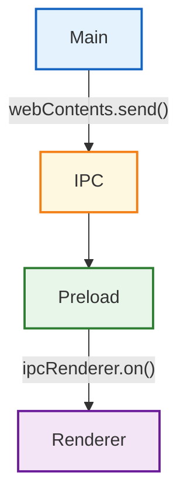

所以 Electron 第一阶段真正需要记住的 IPC 只有三组：

```
Renderer → Main 
send / on

Renderer ↔ Main
invoke / handle

Main → Renderer
webContents.send / ipcRenderer.on
```

## 四、沙盒、安全模型

IPC 学完之后必须解决一个问题：

> 为什么 Electron 要设计得这么麻烦？

为什么不让 Renderer：

```
require('fs')
```

想怎么调就怎么调？

答案就是：

> 安全。

### 1、Sandbox 是什么

Sandbox 可以理解成：

> 将 Renderer 限制在权限较低的执行环境中。

例如 Renderer 中可能运行：

```
网页代码
第三方库
用户输入
富文本
远程资源
```

如果其中发生 XSS：

```
恶意 JavaScript
```

正常浏览器环境下已经很危险。

但如果同时拥有：

```
require('fs')
require('child_process')
```

攻击者就可能进一步：

```
读取文件
删除文件
执行命令
启动程序
上传数据
```

因此现代 Electron 的正确结构应该是：

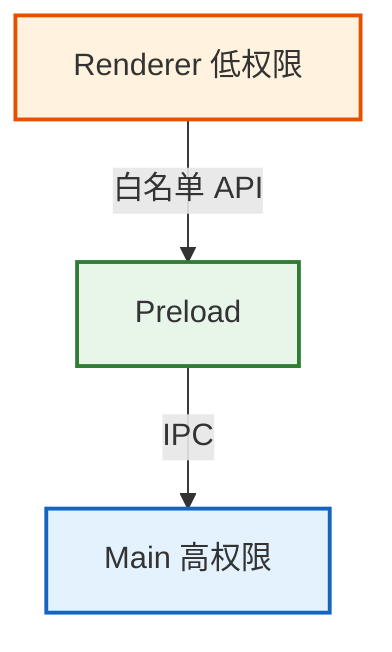

### 2、contextIsolation 是什么

`contextIsolation` 和 sandbox 不是一个东西。

它解决的问题是：

> Preload 和网页 JavaScript 不应该运行在完全相同的 JavaScript 上下文里。

可以理解：

```
Preload World
     │
     │ contextBridge
     ▼
Renderer World
```

而不是：

```
Preload
Renderer

全部共享 window
```

Electron 当前：

```
contextIsolation: true
```

默认开启。

Electron 官方说明，Context Isolation 从 Electron 12 开始默认开启，并推荐所有应用保持开启。

真实项目一般保持：

```JavaScript
webPreferences: {

  preload:
    path.join(
      __dirname,
      'preload.js'
    ),

  contextIsolation: true,

  nodeIntegration: false,

  sandbox: true

}
```

### 3、nodeIntegration 到底是什么

开启：

```JavaScript
nodeIntegration: true
```

意味着 Renderer 可以获得 Node.js 能力。

比如：

```JavaScript
const fs = require('fs')
```

因此我们可以做一个实验。

临时修改：

```JavaScript
webPreferences: {

  nodeIntegration: true,

  contextIsolation: false

}
```

Renderer：

```JavaScript
const fs =
  require('fs')

console.log(
  fs.readdirSync('.')
)
```

你会发现 Renderer 可以直接访问文件系统。

这看起来爽：

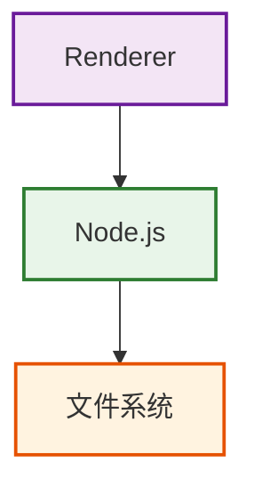

完全不需要：

```
Preload
IPC
Main
```

但是也意味着：

> Renderer 页面一旦被攻击，Node 权限也可能一起暴露。

实验完成后立即改回来：

```
nodeIntegration: false
contextIsolation: true
```

而且需要特别注意：

> `nodeIntegration` 和 `sandbox` 不是同一个概念。

但是给 Renderer 开启 Node integration 会破坏正常的 sandbox 安全模型，因此生产应用不应该为了省代码而随意打开。

## 五、学完这一章，你应该真正掌握什么

Electron 第一阶段真正需要掌握的是这条完整逻辑

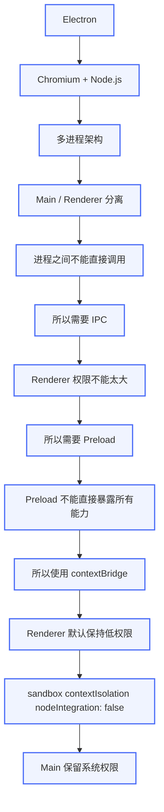
