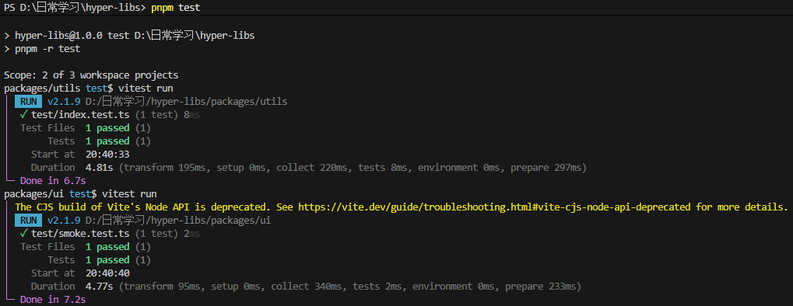
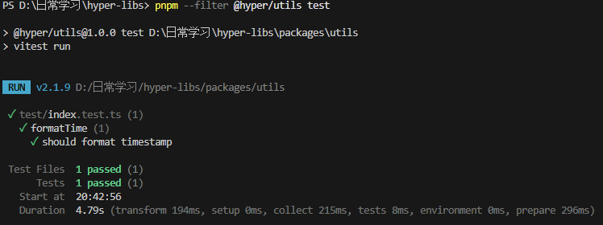
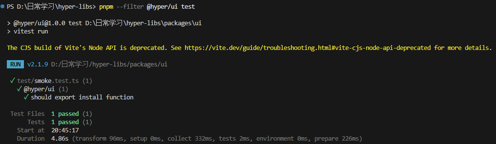

## 一、为什么要用 `Monorepo` 管理内部 `npm` 包？
先把概念说清楚：
- `Multi-repo`：每个 `npm` 包单独一个 `Git` 仓库
  - `htper-utils` 仓库
  - `htper-ui` 仓库
  - `htper-mcp-*` 仓库

- `Monorepo`: 一个 `npm` 仓库放多个 `npm` 包
  - 根目录 `htper-libs`
  - 下面有：
    - `packages/utils` → `@htper-utils`
    - `packages/ui` → `@htper-ui`
    - `packages/hooks` → `@htper-hooks` 
    - ......
  
对前端团队来说，Monorepo 的优势非常明显：
- 公共依赖统一管理，（一次`pnpm install`搞定）
- 包之间的本地联调非常轻松（`workspace` 链接）【扩展】
- 一条命令构建 / 发布所有包（`pnpm -r build`、`pnpm -r publish`）
- 一个 commit 就可以同时修改多个包并保证版本一致。【扩展】

## 二、项目搭建：用 `pnpm` 初始化 `Monorepo` 项目
### 2.1 创建仓库目录
```shell
mkdir htper-libs
cd htper-libs

git init
pnpm init
```

更改根目录的 `package.json`：
```json
{
  "name": "htper-libs",
  "version": "1.0.0",
  "description": "",
  "main": "index.js",
  "private": true,
  "scripts": {
    "build": "pnpm -r run build",
    "test": "pnpm -r test",
    "publish:all": "pnpm -r publish --access public"
  },
  "keywords": [],
  "author": "",
  "license": "ISC",
  "packageManager": "pnpm@10.24.0"
}
```
这里有几个点：
- `private：true`：明确告诉 npm：根仓库永远不会被当成包发布（我们只发`packages/*`里面的包）。
- `build`：`pnpm -r run build`，`-r` / `--recursive` 表示对所有 `workspace` 包执行 `build` 脚本。
- `publish:all`：`pnpm -r publish --access public`，一条命令发布所有子包。

### 2.2 声明工作目录：`pnpm-workspace.yaml`
在根目录创建：`pnpm-workspace.yaml`
```yaml
packages:
  - "packages/*"
  - "playground"
```
- **packages/*:** 所有 `npm` 包都放在 `packages` 目录下
- **playground:** 后面我们会建一个 `demo` 项目用于调试组件库

这一步就是告诉 `pnpm`：“这些子目录都是 `workspace` 的一部分，里面的包需要一起管理”。

### 2.3 开发第一个包: 工具库 `@htper/utils`
#### 2.3.1 创建目录 + 初始化
```shell
mkdir -p packages/utils/src
cd packages/utils
pnpm init
```

#### 2.3.2 配置 package.json
`packages/utils/package.json:`
```json
{
  "name": "@htper/utils",
  "version": "1.0.0",
  "main": "dist/index.cjs",
  "module": "dist/index.mjs",
  "types": "dist/index.d.ts",
  "scripts": {
    "build": "tsup src/index.ts --format cjs,esm --dts",
    "test": "vitest run"
  },
  "files": ["dist"],
  "devDependencies": {
    "tsup": "^8.0.0",
    "typescript": "^5.5.0",
    "vitest": "^2.0.0"
  }
}
```
解释几个关键字段：
- `"name": "@htper/utils"`: 真正发布到 npm 的包名（带 `scope`, 属于`@htper`组织）
- `main | module | types`: `CJS` 入口 / `ESM` 入口 / 类型定义入口
- `"files": ["dist"]`: `npm` 打包时只把所有依赖都打进`dist`，避免把源码、测试、配置等一堆杂物发到 npm。
- `scripts.build`: 用 `tsup` 打包 `TypeScript`，支持 `CJS` + `ESM` + `d.ts`

#### 2.3.3 写一点工具函数
```js
// 示例：时间格式化工具
export function formatTime(timestamp: number): string {
  const date = new Date(timestamp);
  const pad = (n: number) => n.toString().padStart(2, "0");

  const Y = date.getFullYear();
  const M = pad(date.getMonth() + 1);
  const D = pad(date.getDate());
  const h = pad(date.getHours());
  const m = pad(date.getMinutes());
  const s = pad(date.getSeconds());

  return `${Y}-${M}-${D} ${h}:${m}:${s}`;
}
```

### 2.4 开发第二个包：组件库 @htper/ui
#### 2.4.1 初始化包
```shell
cd ../../   # 回到 htper-libs
mkdir -p packages/ui/src/components
cd packages/ui
pnpm init -y
```

#### 2.4.2 配置 package.json
`packages/ui/packages.json`:
```json
{
  "name": "@htper/ui",
  "version": "1.0.0",
  "main": "dist/index.cjs",
  "module": "dist/index.mjs",
  "types": "dist/types/index.d.ts",
  "scripts": {
    "build": "vite build && vue-tsc -p tsconfig.json",
    "test": "vitest run"
  },
  "files": ["dist"],
  "peerDependencies": {
    "vue": "^3.4.0"
  },
  "dependencies": {
    "@htper/utils": "workspace:*"
  },
  "devDependencies": {
    "vue": "^3.4.0",
    "vite": "^5.0.0",
    "@vitejs/plugin-vue": "^5.0.0",
    "vue-tsc": "^2.0.0",
    "typescript": "^5.5.0",
    "vitest": "^2.0.0"
  }
}
```
解释一下：
- `peerDependencies.vue`: 表示组件库依赖宿主项目提供 vue，不会把 vue 打包进来，避免多个 vue 冲突。
- `@htper/ui: workspace:*`: 告诉 `pnpm：@htper/ui` 依赖 `@htper/utils`，并且优先用工作区里的版本
- `build`：脚本分为两步，`vite build`：打包 `.vue` 组件为 `js`，`vue-tsc`：生成类型定义（`.d.ts`）。

#### 2.4.3 安装依赖
回到仓库根目录：
```shell
cd D:\日常学习\htper-libs   # 替换成你自己的路径

pnpm install
```
作用：
- 安装根目录和所有 `packages` 下声明的依赖。
- 建立 `workspace` 软连接（`@htper/ui` 可以本地引用 `@htper/utils`）

#### 2.4.4 Vite 打包配置
`packages/ui/vite.config.ts`:
```ts
import { defineConfig } from "vite";
import vue from "@vitejs/plugin-vue";
import { resolve } from "path";

export default defineConfig({
  plugins: [vue()],
  build: {
    lib: {
      entry: resolve(__dirname, "src/index.ts"),
      name: "htperUI",
      fileName: "index",
      formats: ["es", "cjs"]
    },
    rollupOptions: {
      external: ["vue", "@htper/utils"],
      output: {
        globals: {
          vue: "Vue"
        }
      }
    }
  }
});
```
- `lib.entry`: 组件库的入口文件。
- `external`: 这些依赖不会被打包进 `bundle`

#### 2.4.5 TS 配置 + .vue 类型声明
`packages/tsconfig.json`:
```json
{
  "compilerOptions": {
    "target": "ESNext",
    "module": "ESNext",
    "moduleResolution": "Node",
    "strict": true,
    "jsx": "preserve",
    "skipLibCheck": true,
    "allowSyntheticDefaultImports": true,
    "esModuleInterop": true,
    "declaration": true,
    "declarationDir": "dist/types",
    "baseUrl": "."
  },
  "include": ["src/**/*", "env.d.ts"]
}
```
`packages/ui/env.d.ts`: 
```ts
declare module "*.vue" {
  import type { DefineComponent } from "vue";
  const component: DefineComponent<{}, {}, any>;
  export default component;
}
```
- `tsconfig.json` 是 TypeScript 项目的配置文件，用于告诉 TypeScript 编译器（tsc）如何处理和编译你的 .ts（或 .tsx）源代码。
- `env.d.ts` 告诉 TypeScript：当你看到 import xxx from './xxx.vue' 时，不要懵逼，这个东西是一个 Vue 组件。

#### 2.4.6 写一个简单组件 + 入口
`packages/ui/src/components/Hello.vue`:
```vue
<script setup lang="ts">
import { computed } from "vue";

const props = defineProps<{
  name?: string;
}>();

const displayName = computed(() => props.name ?? "百应同学");
</script>

<template>
  <div class="by-hello">
    你好，{{ displayName }}，欢迎使用 @htper/ui！
  </div>
</template>
```
`packages/ui/src/index.ts`
```ts
import type { App } from "vue";
import Hello from "./components/Hello.vue";

export { Hello };

export default {
  install(app: App) {
    app.component("ByHello", Hello);
  }
};
```

#### 2.4.7 `.gitignore`
```.gitignore
# node
node_modules/


# build output
dist/
packages/*/dist/
```

### 2.5 单元测试
#### 2.5.1 `utils`包测试
`packages/utils/test/index.test.ts`
```ts
import { describe, it, expect } from "vitest";
import { formatTime } from "../src";

describe("formatTime", () => {
  it("should format timestamp", () => {
    const result = formatTime(1700000000000);
    expect(result).toMatch(/^\d{4}-\d{2}-\d{2}/);
  });
});
```
`ui` 包一个简单的`smoke test`
`packages/ui/test/smoke.test.ts`
```ts
import { describe, it, expect } from "vitest";
import UI from "../src";

describe("@htper/ui", () => {
  it("should export install function", () => {
    expect(typeof UI.install).toBe("function");
  });
});
```
在根目录运行：
```shell
pnpm test
```
运行结果：

```shell
# 运行@htper/utils
pnpm --filter @htper/utils test
```
运行结果：

```shell
# 运行@htper/ui
pnpm --filter @htper/ui test
```


这里的 `--filter` 用来限定要操作的 `workspace` 包，非常适合 `Monorepo`, 需要注意 `--filter`是这针对于`pnpm`的，并非`test`的，所以`test`一定要放在最后。

### 2.6 `Playground`: 在浏览器中直接调试组件库
仅靠单测不够，UI 最终还是要“看效果”。
**思路：** 在同一个 `Monorepo` 下再建一个小 `app（Vite + Vue）`，依赖 @htper/ui: "workspace:*"，实际渲染出来调试。

#### 2.6.1 创建 playground
```shell
mkdir -p playground/src
cd playground
pnpm init -y
pnpm add vue @vitejs/plugin-vue vite
```
`playground/package.json`:
```json
{
  "name": "htper-ui-playground",
  "version": "1.0.0",
  "private": true,
  "scripts": {
    "dev": "vite",
    "build": "vite build",
    "preview": "vite preview"
  },
  "dependencies": {
    "vue": "^3.4.0",
    "@htper/ui": "workspace:*"
  },
  "devDependencies": {
    "@vitejs/plugin-vue": "^5.0.0",
    "vite": "^5.0.0"
  }
}
```
这里的 `"@baiying/ui"`: `"workspace:*"` 的含义是：在当前 `Monorepo` 里优先用本地的 `packages/ui`，而不是去 `npm` 下载。
`playground/vite.config.ts`:
```ts
import { defineConfig } from "vite";
import vue from "@vitejs/plugin-vue";

export default defineConfig({
  plugins: [vue()]
});
```
`playground/index.html`:
```html
<!DOCTYPE html>
<html lang="zh-CN">
  <head>
    <meta charset="UTF-8" />
    <title>@baiying/ui Playground</title>
  </head>
  <body>
    <div id="app"></div>
    <script type="module" src="/src/main.ts"></script>
  </body>
</html>
```
`playground/src/main.ts`:
```ts
import { createApp } from "vue";
import App from "./App.vue";

import BaiyingUI from "@baiying/ui";

const app = createApp(App);
app.use(BaiyingUI);
app.mount("#app");
```
`playground/src/App.vue`:
```vue
<template>
  <div style="padding: 24px">
    <h1>@baiying/ui Playground</h1>
    <ByHello name="冒泡的同学" />
  </div>
</template>

<script setup lang="ts"></script>
```
在根目录运行：
```shell
pnpm --filter baiying-ui-playground dev
```
此时运行你会发现存在报错，原因是在去查找`@htper/ui`的时候，会出现找不到的情况，因为`@htper/ui` 的`package.json`文件，`main`和`module`表示入口文件，入口文件都是打包之后的（`dist`目录下）所以此时找不到。
**解决方案：**
在`vite.config.ts`中增加`alis`，当遇到`@htper/ui`的时候，直接去指定文件夹目录下查找。
```ts
import { defineConfig } from "vite";
import vue from "@vitejs/plugin-vue";
import { resolve } from "path";

export default defineConfig({
  plugins: [vue()],
  resolve: {
    alias: {
      // 当在 playground 中 import "@htper/ui" 时，
      // 实际指向的是本地源码，而不是 npm 包 entry
      "@htper/ui": resolve(__dirname, "../packages/ui/src")
    }
  }
});
```

### 2.7 构建: 打包所有包
在根目录：
```shell
pnpm build
```
因为我们在根目录 `package.json` 里写了：
```json
"scripts": {
  "build": "pnpm -r run build"
}
```
所以这条命令等价于：
```shell
pnpm -r run build
```
它会依次执行：
- `packages/utils`的`build` 脚本 （`tsup`打包）
- `packages/ui`的`build` 脚本（`vite` + `vue-tsc`）

构建完成后：我们可以发现，`playground` 其实也进行打包操作了，那是因为在`pnpm-workspace.yaml`中存在`playground`配置，并且在`playground`中也存在`build`指令，所以`pnpm`就自然而然的执行`build`操作了。其实我们是不希望`playground`文件夹中的文件进行打包的，此时可以更改根目录下的打包指令：
```shell
"build": "pnpm -r --filer packages/** run build"
"build:all": "pnpm -r run build"
```
这样我们在执行`pnpm run build`的时候，就只打`packages`文件夹下的包了。

### 2.8 打包发布：从 Monorepo 发布到 npm
#### 2.8.1 `npm` 组织 & `scope`
你发布的是：
- `@htper/utils`
- `@htper/ui`
前面的 `@htper` 就是 `npm` 的 组织`（org）scope`，所以你需要在`npm`官网创建名为`htper`的组织，并将账号设置为`owner`。

#### 2.8.2 .npmrc 和 registry
如果你发到 官方 npm，项目根目录 `.npmrc` 可以很简单
```ini
registry=https://registry.npmjs.org/
```

#### 2.8.3 登录 npm
```shell
npm login --registry=https://registry.npmjs.org/
```
会跳浏览器，让你确认账号，登录成功后，`npm whoami` 能看到用户名：
```shell
npm whoami --registry=https://registry.npmjs.org/
# 输出类似：dlfordmc
```

#### 2.8.4 提交commit
在发布之前需要提交改动代码，如果不提交，会报错，因为`pnpm`怕将你的垃圾代码提交到`npm`上。

#### 2.8.5 发布
根目录执行：
```shell
pnpm publish:all
```
等价于：
```shell
pnpm -r publish --access public
```
解释下参数：
- `-r / --recursive`：对所有 `workspace` 包（`packages/*`）逐一执行 `publish`
- `--access public`：对 `scoped` 包（`@baiying/*`）必须声明 `access` 为 `public`，`npm` 才允许这样就会依次发布：
  - `@baiying/utils@1.x.x`
  - `@baiying/ui@1.x.x`

如果发布的时候报错：
```shell
npm error 403 403 Forbidden - PUT https://registry.npmjs.org/@htper%2futils - You cannot publish over the previously published versions: 1.0.0.
```
意思是：你已经在 `npm` 上发过 `@htper/utils@1.0.0` 了，现在又想再用 同一个版本号 `1.0.0` 发一次，`npm`：不行，我不允许你覆盖已经发布的版本。

**这是 npm 的硬性规则：**
同一个包的同一个版本号，只能发布一次，不能覆盖。

**解决方案：**
```shell
# 升级版本
pnpm --filter @htper/utils version minor
```
此时就可以在`npm`仓库中查看到：


### 2.9 在其他项目中引用：如何在业务项目里使用？
假设你有一个 Vue3 业务项目:
#### 2.9.1 安装包
```shell
pnpm install @htper/utils

pnpm install @htper/ui
```
#### 2.9.2 在 Vue 项目中使用组件库
```vue
<template>
  <div>
    {{ now }}
  </div>
</template>

<script setup>
import { formatTime } from '@htper/utils';
let now = formatTime(new Date());
</script>
```
`@htper/utils` 的使用：
```ts
import { createApp } from 'vue';
import ElementPlus from 'element-plus';
import zhCn from 'element-plus/dist/locale/zh-cn.mjs';
import App from './App.vue';
import HtperUI from '@htper/ui';


import 'element-plus/dist/index.css';
import './assets/main.css';

const app = createApp(App);

app.use(ElementPlus, { locale: zhCn });
app.use(HtperUI);
app.mount('#app');
```
`@htper/ui` 的使用：
```vue
<template>
  <div>
    <ByHello name="冒泡同学"> </ByHello>
  </div>
</template>

<script setup>
import { formatTime } from '@htper/utils';
let now = formatTime(new Date());
</script>
```


## 扩展
### 一、workspace

### 二、一个 commit 就可以同时修改多个包并保证版本一致。

### 三、pnpm


### 四、tsup

### 五、peerDependencies

### 六、tsconfig.json

### 七、版本问题