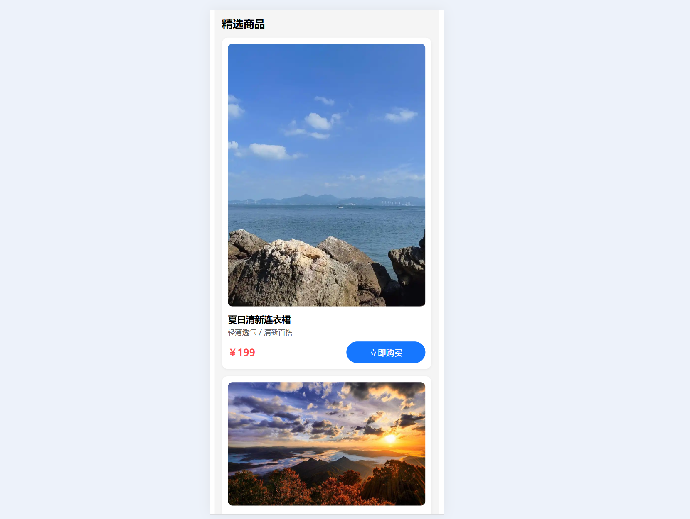
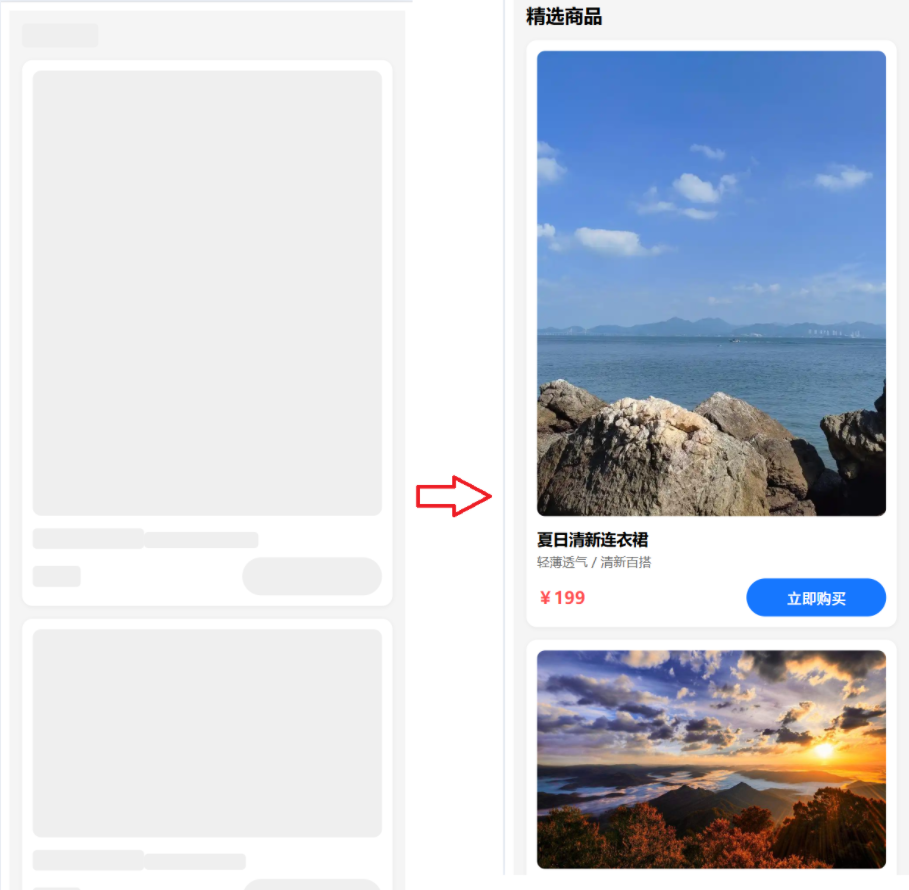
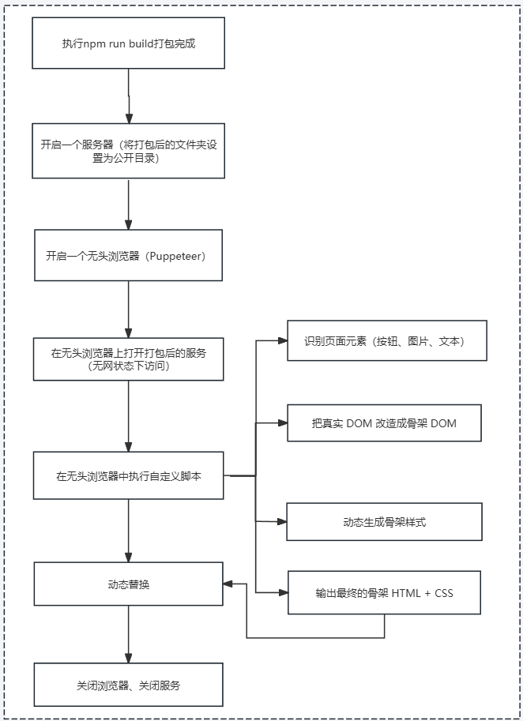
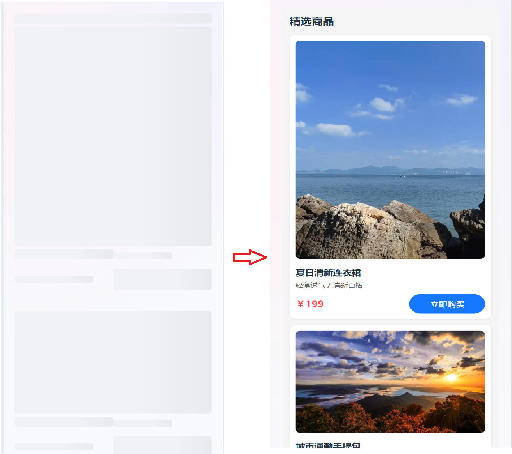

## 一、什么是骨架屏？它解决了什么问题？
> 骨架屏（Skeleton Screen）就是在真实数据还没回来时，用一个“假页面”先把大致的布局撑起来，让用户感觉页面是“在加载内容”，而不是“啥都没反应”。

### 1.1 常见对比：

- ❌ 传统：转圈圈 loading、空白页。
- ✅ 骨架屏：灰色的头像框、标题条、内容条在那闪一闪，几乎跟真实页面布局一样。

### 1.2 解决的问题：

- **感知性能优化：** 真实接口可能 800ms–2s 才回来，但骨架屏能在几十毫秒内渲染，让用户主观感觉“好快”。
- **避免布局跳动：** 没有骨架时，内容突然出现会闪动布局，体验很差；骨架屏先占好位，真实内容替换时就很平滑。
- **降低焦虑：** 空白和转圈是“未知状态”，骨架屏是“已知在加载中”。

## 二、骨架屏实现原理
> 在实际工程中，有一种常见的 首屏骨架屏自动生成方案：
在前端代码打包完成后，通过无头浏览器（如 Puppeteer）打开构建后的页面路由，渲染出页面的骨架结构，提取对应的 HTML 和 CSS，然后在构建阶段把这段骨架代码插入到入口文件的占位符位置中。这样，在 JS 还没有加载、应用尚未真正挂载之前，浏览器就可以直接渲染出首屏的骨架界面，用骨架 DOM + 样式先“占住布局”，提升首屏体验。

**骨架屏的实现原理，本质上是：在真实数据和 JS 逻辑还没准备好之前，用一套“占位布局 + 弱化样式”先把页面的结构撑起来。**
**具体做法分两步：**
- **提前渲染占位元素：** 根据真实页面的布局，画出由灰块、灰条、圆形头像等组成的“骨架 DOM”，并通过 CSS 设置统一的骨架样式（背景色、圆角、shimmer 动画等），让用户一眼能看出“这里将来会有内容”。
- **在合适的时机切换为真实内容：** 当 JS 加载完成、数据请求返回后，用真实组件和数据替换掉这些占位元素（例如通过 v-if / v-show 切换，或通过构建期插入的骨架 HTML 在运行时移除），从而实现从“骨架状态”到“真实页面”的平滑过渡。

## 三、从实际工程中解析骨架屏实现方案

### 3.1 创建一个项目&安装react依赖包

```shell
# 初始化项目
npm init -y
```

```json
// package.json配置
{
  "name": "zhufengskeletons",
  "version": "1.0.0",
  "description": "",
  "main": "index.js",
  "scripts": {
    "build": "webpack",
    "dev":"webpack-dev-server"
  },
  "keywords": [],
  "author": "",
  "license": "ISC",
  "devDependencies": {
    "@babel/core": "^7.10.5",
    "@babel/preset-env": "^7.10.4",
    "@babel/preset-react": "^7.10.4",
    "babel-loader": "^8.1.0",
    "cross-env": "^7.0.2",
    "css-tree": "^1.0.0-alpha.39",
    "fs-extra": "^9.0.1",
    "html-webpack-plugin": "^4.3.0",
    "puppeteer": "^5.2.0",
    "webpack": "^4.43.0",
    "webpack-cli": "^3.3.12",
    "webpack-dev-server": "^3.11.0"
  },
  "dependencies": {
    "react": "^16.13.1",
    "react-dom": "^16.13.1"
  }
}
```
```shell
# 安装依赖
npm install
```

### 3.2 配置webpack
```js
const {resolve} = require('path');
const HtmlWebpackPlugin = require('html-webpack-plugin');

module.exports = {
  mode: 'development',
  devtool: false,
  entry: './src/index.js',
  output: {
    path: resolve(__dirname, 'dist'),
    filename: 'main.js',
  },
  module: {
    rules: [
      {
        test: /\.js$/,
        use: [
          {
            loader: 'babel-loader',
            options: {
              presets: ["@babel/preset-env","@babel/preset-react"]
            }
          }
        ],
        exclude: /node_modules/
      }
    ]
  },
  devServer: {
    contentBase: resolve(__dirname, 'dist'),
  },
  plugins: [
    new HtmlWebpackPlugin({
      template: './public/index.html'
    })
  ]
}
```

### 3.3 创建react组件
**文件结构如下：**
```shell
|
|
|---src
|   |---index.js
|   |---index.html
```
```html
<!DOCTYPE html>
<html lang="en">
<head>
    <meta charset="UTF-8">
    <meta name="viewport" content="width=device-width, initial-scale=1.0">
    <title>骨架屏</title>
</head>
<body>
    <div id="root"><!-- shell--></div>
</body>
</html>
```
```js
import React from 'react';
import ReactDOM from 'react-dom';

const products = [
  {
    id: 1,
    name: '夏日清新连衣裙',
    desc: '轻薄透气 / 清新百搭',
    price: 199,
    img: 'https://img1.baidu.com/it/u=2081323478,258416009&fm=253&fmt=auto?w=800&h=1067'
  },
  {
    id: 2,
    name: '城市通勤手提包',
    desc: '大容量 / 通勤必备',
    price: 299,
    img: 'https://img2.baidu.com/it/u=1494163501,3385442683&fm=253&app=138&f=JPEG?w=800&h=500'
  },
  {
    id: 3,
    name: '简约百搭运动鞋',
    desc: '舒适减震 / 日常出行',
    price: 399,
    img: 'https://img2.baidu.com/it/u=1494163501,3385442683&fm=253&app=138&f=JPEG?w=800&h=500'
  }
];

// 整体容器：移动端全宽 + 浅色背景
const appStyle = {
  maxWidth: '480px',              // 给个上限，模拟常见手机宽度
  margin: '0 auto',
  padding: '12px 12px 24px',
  fontFamily:
    'system-ui, -apple-system, BlinkMacSystemFont, "Segoe UI", sans-serif',
  backgroundColor: '#f5f5f5',
  minHeight: '100vh',
  boxSizing: 'border-box'
};

const headerStyle = {
  fontSize: '18px',
  fontWeight: 'bold',
  marginBottom: '12px'
};

const listStyle = {
  display: 'flex',
  flexDirection: 'column',
  gap: '12px'
};

// 卡片：单列铺满屏幕
const cardStyle = {
  backgroundColor: '#fff',
  borderRadius: '10px',
  padding: '10px',
  boxSizing: 'border-box',
  boxShadow: '0 1px 4px rgba(0,0,0,0.06)'
};

const imgStyle = {
  width: '100%',
  borderRadius: '8px',
  objectFit: 'cover'
};

const titleStyle = {
  fontSize: '15px',
  fontWeight: 600,
  marginTop: '8px'
};

const descStyle = {
  fontSize: '12px',
  color: '#666',
  marginTop: '4px'
};

const priceRowStyle = {
  display: 'flex',
  justifyContent: 'space-between',
  alignItems: 'center',
  marginTop: '8px'
};

const priceStyle = {
  fontSize: '16px',
  color: '#ff4d4f',
  fontWeight: 600
};

const buttonStyle = {
  padding: '8px 0',
  borderRadius: '20px',
  border: 'none',
  backgroundColor: '#1677ff',
  color: '#fff',
  fontSize: '14px',
  fontWeight: 500,
  width: '40%',
  textAlign: 'center',
  cursor: 'pointer'
};

function App() {
  return (
    <div style={appStyle}>
      <div style={headerStyle}>精选商品</div>
      <div style={listStyle}>
        {products.map((p) => (
          <div key={p.id} style={cardStyle}>
            
            <div style={titleStyle}>{p.name}</div>
            <div style={descStyle}>{p.desc}</div>
            <div style={priceRowStyle}>
              <span style={priceStyle}>￥{p.price}</span>
              <button style={buttonStyle}>立即购买</button>
            </div>
          </div>
        ))}
      </div>
    </div>
  );
}

ReactDOM.render(<App />, document.getElementById('root'));
```
**界面：**


至此，我们的react项目已经搭建完成，接下来我们开始编写骨架屏。

### 3.4 编写骨架屏

#### 3.4.1 以终为始
**思考：现在思考的内容是从什么入手？**

我们最终打包的代码是一个`index.html`文件和一个`main.js`，骨架屏就是在`main.js`未加载的时候，展示默认内容。我们都知道在`SPA`项目中都会存在一个挂载`DOM`，会存在`index.html`中，等真正的逻辑代码（`main.js`）加载完成后，会对挂载`DOM`进行替换，所以骨架屏的`DOM`结构应该和挂载`DOM`结构保持一致。所以只需要将生成的骨架屏代码放到挂载`DOM`中即可。

```html
<div id="root"><!-- shell--></div>
```

**思考：如何可以获取整个界面股价的代码？**

可以在打包后，渲染下打包后的文件，然后保存其DOM和样式，其中每一个具体标签的样式，我们可以自定义。所以我们需要自定义一个webpack plugin，监听打包完成后，将生成的DOM结构保存下来。

#### 3.4.2 自定义webpack plugin
```js
// webpack.config.js
const { SkeletonPlugin } = require('./skeleton/index.js');

module.exports = {
  plugins: [
    new SkeletonPlugin({
      staticDir: resolve(__dirname, 'dist'),
      port:8000,
      origin:'http://localhost:8000',
      device:'iPhone 6',
      defer:5000,
      button:{
        color:'#efefef'
      },
      image:{
        color:'#efefef'
      }
    })
  ]
}
```

```js
// skeleton/SkeletonPlugin.js
class SkeletonPlugin {
  constructor(options) {
    this.options = options;
  }
  apply(compiler) {
    //compiler身上会有很多的钩子，我们可以通过tap来注册这些钩子函数的监听
    //当这个钩子出发的时候，会调用我们的监听函数
    //done整个编译流程都走完了，dist目录下的文件都生成了就可以出发done的回调执行了
    compiler.hooks.done.tap('SkeletonPlugin', async () => {
      console.log('SkeletonPlugin is working!');
    });
  }
};

module.exports = SkeletonPlugin;
```

基于以上的思考和分析，我们在webpack plugin中增加了如下参数：
- `staticDir`: 静态资源目录，用于存放骨架屏文件。
- `port`: 静态资源服务端口。
- `origin`: 静态资源服务地址。
- `device`: 骨架屏设备类型，默认为`iPhone 6`。
- `defer`: 骨架屏延迟时间，默认为`5000`毫秒。
- `button`: 按钮样式，默认为灰色。
- `image`: 图片样式，默认为灰色。

#### 3.4.3 开启服务
这里使用express框架，启动一个静态资源服务，用于展示骨架屏。
```js
let express = require('express');
let http = require('http');

class Server {
  constructor(options) {
    this.options = options;
  }
  async listen() {
    const app = this.app = express();
    //使用一个静态文件中间件 用来让客户端可以访问staticDir里的文件
    app.use(express.static(this.options.staticDir));
    this.httpServer = http.createServer(app);
    return new Promise((resolve) => {
      this.httpServer.listen(this.options.port, () => {
        console.log(`Server is listening on port ${this.options.port}`);
        resolve();
      })
    })
  }

  async close() {
    return new Promise((resolve, reject) => {
      this.httpServer.close(() => {
        console.log('Server is closed');
        resolve();
      })
    })
  }
}

module.exports = Server;
```

#### 3.4.4 生成骨架屏
```js
async generateSkeleton() {
  // 1、打开一个新页面
  const page = await this.newPage();
  // 2、访问目标页面
  let response = await page.goto(this.options.origin, { waitUntil: 'networkidle2' });
  // 3、不成功则报错
  if (response && !response.ok()) {
    throw new Error(`${response.status} on ${url}`);
  }
  // 4、读取脚本内容，在无头浏览器中执行脚本
  const { defer = 5000 } = this.options;
  //  4.1 先读取内容
  const scriptContent = readFileSync(resolve(__dirname, 'skeletonScripts.js'), 'utf-8');
  // 4.2 插入脚本
  await page.addScriptTag({ content: scriptContent });
  // 4.3 等待一段时间，让脚本有机会加载完毕
  await new Promise((resolve) => setTimeout(resolve, defer));
  // 4.4 执行脚本，生成骨架屏代码
  await page.evaluate((options) => {
    Skeleton.genSkeleton(options);
  }, this.options);

  const { html, styles } = await page.evaluate(() => Skeleton.getHtmlAndStyle());
  let result = `
          <style>${styles.join('\n')}</style>
          ${html}
      `;
  return result;
}
```
**执行插入到无头浏览器的js代码：**
```js
window.Skeleton = (function () {
  const SMALLEST_BASE64 =
    'data:image/gif;base64,R0lGODlhAQABAIAAAAAAAP///yH5BAEAAAAALAAAAAABAAEAAAIBRAA7';
  const CLASS_NAME_PREFIX = 'sk-';
  const $$ = document.querySelectorAll.bind(document);
  const REMOVE_TAGS = ['title', 'meta', 'style', 'script'];
  const styleCache = new Map();

  function buttonHandler(element, options = {}) {
    const className = CLASS_NAME_PREFIX + 'button'; // sk-button
    const color = options.color || '#eee';
    const rule = `{
      color:${color} !important;
      background:${color} !important;
      border:none !important;
      box-shadow:none !important;
    }`;
    addStyle(`.${className}`, rule);
    element.classList.add(className);
  }

  function imageHandler(element, options = {}) {
    const { width, height } = element.getBoundingClientRect();
    const attrs = {
      width,
      height,
      src: SMALLEST_BASE64
    };
    setAttributes(element, attrs);
    const className = CLASS_NAME_PREFIX + 'image'; // sk-image
    const color = options.color || '#eee';
    const rule = `{
      background:${color} !important;
      background-size: cover !important;
    }`;
    addStyle(`.${className}`, rule);
    element.classList.add(className);
  }

  // ✅ 新增：文字骨架处理
  function textHandler(element, options = {}) {
    const className = CLASS_NAME_PREFIX + 'text'; // sk-text
    const color = options.color || '#eee';
    const rule = `{
      color: transparent !important;         /* 隐藏文字本身 */
      background:${color} !important;        /* 灰色背景作为骨架条 */
      border-radius: 4px !important;
      /* inline 元素可能需要变成 inline-block 才能撑出背景 */
      display: inline-block !important;
    }`;
    addStyle(`.${className}`, rule);
    element.classList.add(className);
  }

  function setAttributes(element, attrs) {
    Object.keys(attrs).forEach((key) => element.setAttribute(key, attrs[key]));
  }

  function addStyle(selector, rule) {
    // 一个 selector 只生成一次
    if (!styleCache.has(selector)) {
      styleCache.set(selector, rule);
    }
  }

  // 转换原始元素为骨架 DOM 元素
  function genSkeleton(options = {}) {
    const rootElement = document.documentElement;

    (function traverse(opts) {
      const { button = {}, image = {}, text = {} } = opts;
      const buttons = [];
      const images = [];
      const texts = []; // ✅ 新增：所有的“文字元素”

      (function preTraverse(element) {
        // 先遍历子节点
        if (element.children && element.children.length > 0) {
          Array.from(element.children).forEach((child) => preTraverse(child));
        }

        const tag = element.tagName;

        if (tag === 'BUTTON') {
          buttons.push(element);
        } else if (tag === 'IMG') {
          images.push(element);
        } else {
          // ✅ 文本处理逻辑：
          // 只处理“叶子元素里有纯文本”的情况，避免给大容器加 skeleton
          const hasElementChildren =
            element.children && element.children.length > 0;

          // 是否存在非空文本节点
          const hasTextNode = Array.from(element.childNodes || []).some(
            (node) =>
              node.nodeType === Node.TEXT_NODE &&
              node.textContent &&
              node.textContent.trim() !== ''
          );

          if (!hasElementChildren && hasTextNode) {
            texts.push(element);
          }
        }
      })(rootElement);

      // 分别处理
      buttons.forEach((item) => buttonHandler(item, button));
      images.forEach((item) => imageHandler(item, image));
      texts.forEach((item) => textHandler(item, text));
    })(options);

    // 生成 style 内容
    let rules = '';
    for (const [selector, rule] of styleCache) {
      // .sk-image { ... }
      // .sk-button { ... }
      // .sk-text { ... }
      rules += `${selector} ${rule}\n`;
    }

    const styleElement = document.createElement('style');
    styleElement.innerHTML = rules;
    document.head.appendChild(styleElement);
  }

  // 获得骨架 DOM 元素的 HTML 字符串和样式 style
  function getHtmlAndStyle() {
    const styles = Array.from($$('style')).map(
      (style) => style.innerHTML || style.innerText
    );
    Array.from($$(REMOVE_TAGS.join(','))).forEach((element) =>
      element.parentNode.removeChild(element)
    );
    const html = document.body.innerHTML;
    return { html, styles };
  }

  return { genSkeleton, getHtmlAndStyle };
})();
```
#### 3.4.5 使用
```shel
npm run build
```

#### 3.4.6 骨架屏展示


## 三、实际工程中实现骨架屏总结



## 四、在vue中的最佳实践
在vue中存在很多的骨架屏技术方案，这里以 `vue3` + `element-plus`为例，实现一个简单的骨架屏。
在`element-plus`中其实是支持`Skeleton`组件的。下面直接给出骨架屏示例：

```vue
<template>
  <el-skeleton style="width: 100%" :loading="products.length === 0" animated>
    <template #template>
      <el-skeleton-item variant="h1" style="width: 100%" />
      <div>
        <el-skeleton-item variant="h3" style="width: 100%; height: 408px;" />
        <el-skeleton-item variant="h3" style="width: 50%;" />
        <el-skeleton-item variant="text" style="width: 30%" />
        <div style="display: flex; justify-content: space-between; align-items: center; margin-top: 12px;">
          <el-skeleton-item variant="text" style="width: 40%" />
          <el-skeleton-item variant="button" style="width: 50%" />
        </div>
      </div>
      <div style="margin-top: 40px;">
        <el-skeleton-item variant="h3" style="width: 100%; height: 191px;" />
        <el-skeleton-item variant="h3" style="width: 50%;" />
        <el-skeleton-item variant="text" style="width: 30%" />
        <div style="display: flex; justify-content: space-between; align-items: center; margin-top: 12px;">
          <el-skeleton-item variant="text" style="width: 40%" />
          <el-skeleton-item variant="button" style="width: 50%" />
        </div>
      </div>
    </template>
    <template #default>
      <div :style="appStyle">
        <div :style="headerStyle">精选商品</div>
        <div :style="listStyle">
          <div v-for="product in products" :key="product.id" :style="cardStyle">
            
            <div :style="titleStyle">{{ product.name }}</div>
            <div :style="descStyle">{{ product.desc }}</div>
            <div :style="priceRowStyle">
              <span :style="priceStyle">￥{{ product.price }}</span>
              <button :style="buttonStyle">立即购买</button>
            </div>
          </div>
        </div>
      </div>
    </template>
  </el-skeleton>
</template>

<script setup>
import { ref } from 'vue';
let products = ref([]);
setTimeout(() => {
  products.value = [
    {
      id: 1,
      name: '夏日清新连衣裙',
      desc: '轻薄透气 / 清新百搭',
      price: 199,
      img: 'https://img1.baidu.com/it/u=2081323478,258416009&fm=253&fmt=auto?w=800&h=1067'
    },
    {
      id: 2,
      name: '城市通勤手提包',
      desc: '大容量 / 通勤必备',
      price: 299,
      img: 'https://img2.baidu.com/it/u=1494163501,3385442683&fm=253&app=138&f=JPEG?w=800&h=500'
    },
    {
      id: 3,
      name: '简约百搭运动鞋',
      desc: '舒适减震 / 日常出行',
      price: 399,
      img: 'https://img2.baidu.com/it/u=1494163501,3385442683&fm=253&app=138&f=JPEG?w=800&h=500'
    }
  ];
}, 5000)

const appStyle = {
  maxWidth: '480px',
  margin: '0 auto',
  padding: '12px 12px 24px',
  fontFamily:
    'system-ui, -apple-system, BlinkMacSystemFont, "Segoe UI", sans-serif',
  backgroundColor: '#f5f5f5',
  minHeight: '100vh',
  boxSizing: 'border-box'
};

const headerStyle = {
  fontSize: '18px',
  fontWeight: 'bold',
  marginBottom: '12px'
};

const listStyle = {
  display: 'flex',
  flexDirection: 'column',
  gap: '12px'
};

const cardStyle = {
  backgroundColor: '#fff',
  borderRadius: '10px',
  padding: '10px',
  boxSizing: 'border-box',
  boxShadow: '0 1px 4px rgba(0, 0, 0, 0.06)'
};

const imgStyle = {
  width: '100%',
  borderRadius: '8px',
  objectFit: 'cover'
};

const titleStyle = {
  fontSize: '15px',
  fontWeight: 600,
  marginTop: '8px'
};

const descStyle = {
  fontSize: '12px',
  color: '#666',
  marginTop: '4px'
};

const priceRowStyle = {
  display: 'flex',
  justifyContent: 'space-between',
  alignItems: 'center',
  marginTop: '8px'
};

const priceStyle = {
  fontSize: '16px',
  color: '#ff4d4f',
  fontWeight: 600
};

const buttonStyle = {
  padding: '8px 0',
  borderRadius: '20px',
  border: 'none',
  backgroundColor: '#1677ff',
  color: '#fff',
  fontSize: '14px',
  fontWeight: 500,
  width: '40%',
  textAlign: 'center',
  cursor: 'pointer'
};
</script>
```
**展示效果：**


**实现骨架屏代码：** https://github.com/donglisuccess/skeleton-dl