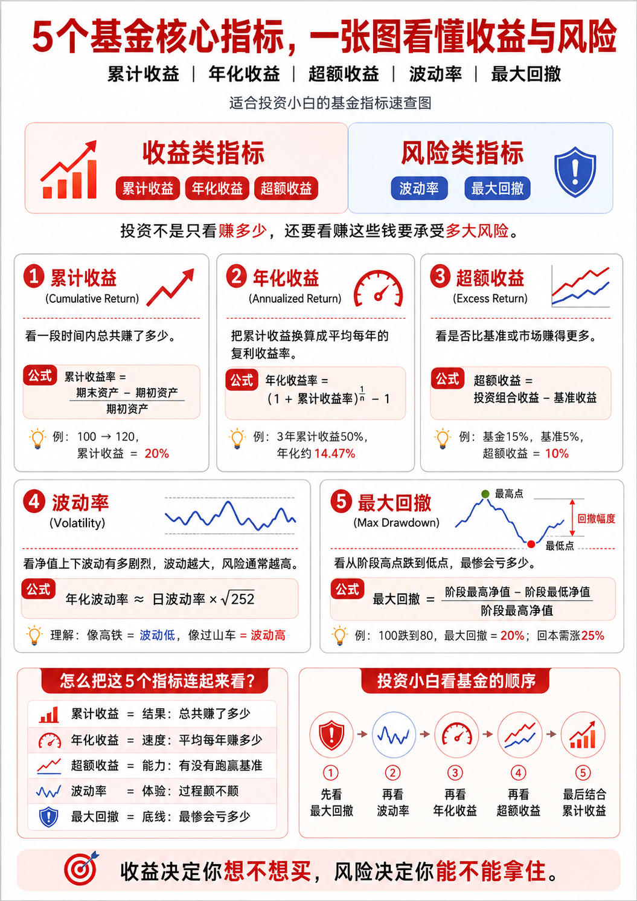

你现在要学的 5 个基金指标，实际上可以分成两大类：

- **收益类指标**：累计收益、年化收益、超额收益
- **风险类指标**：波动率、最大回撤

很多投资小白一开始只盯着收益看，比如“近一年涨了多少”“基金排行榜第几名”。这是非常危险的。因为收益只是结果，风险才是过程。你真正要判断的不是“这只基金赚不赚钱”，而是：

> 它赚这些钱，承担了多大的风险？这个风险我能不能承受？

这篇文章会围绕这 5 个指标，帮你回答三个问题：

- 收益到底应该怎么看？
- 风险到底怎么量化？
- 一只基金到底适不适合你？

## 一、先建立一个整体框架
先用这张图建立整体印象：



然后把这 5 个指标放在一张表里：

| 指标   | 类型  | 解决的问题      | 一句话理解  |
| ---- | --- | ---------- | ------ |
| 累计收益 | 收益类 | 这段时间总共赚了多少 | 看总成绩   |
| 年化收益 | 收益类 | 平均每年赚多少    | 看赚钱速度  |
| 超额收益 | 收益类 | 有没有跑赢市场/基准 | 看相对能力  |
| 波动率  | 风险类 | 价格上下晃动有多剧烈 | 看过程颠不颠 |
| 最大回撤 | 风险类 | 最惨时从高点跌了多少 | 看最坏情况  |

这 5 个指标不能孤立看。真正有价值的判断，是把它们组合起来看：
- 收益高不高？
- 收益持续不持续？
- 有没有跑赢基准？
- 过程波动大不大？
- 最惨会亏多少？

你作为投资小白，千万不要只问：“这只基金能不能赚钱？”

你应该问：
> 它怎么赚钱？赚得稳不稳？亏起来我扛不扛得住？

## 二、累计收益：这段时间总共赚了多少
### 1、什么是累计收益？
**累计收益率**，英文叫 `Cumulative Return`。

它表示：

> 在某一段时间内，你的投资总共涨了多少。

公式是：

```txt
累计收益率 =（期末资产 - 期初资产）/ 期初资产
```

举个例子。

你投入 10000 元买基金，一年后变成 12000 元。

那么：

```txt
累计收益率 =（12000 - 10000）/ 10000 = 20%
```

也就是说，这段时间你总共赚了 20%。

### 2、累计收益的核心作用
累计收益回答的是：
> 我这笔投资到现在一共赚了多少钱？

比如：
|  初始金额 |  当前金额 | 累计收益 |
| ----: | ----: | ---: |
| 10000 | 11000 |  10% |
| 10000 | 13000 |  30% |
| 10000 | 15000 |  50% |

这个指标非常直观，小白最容易理解。但它也最容易让人误判。

### 3、累计收益最大的陷阱：不看时间
假设有三只基金：
| 基金  | 累计收益 |  用时 |
| --- | ---: | --: |
| A基金 |  50% |  1年 |
| B基金 |  50% |  3年 |
| C基金 |  50% | 10年 |

表面看，三只基金都赚了 50%。

但它们真的一样吗？

当然不一样。

- A基金一年赚 50%，速度很快。
- B基金三年赚 50%，还不错。
- C基金十年才赚 50%，就比较普通了。

所以累计收益只能告诉你“总共赚了多少”，不能告诉你“赚得快不快”。

这就引出第二个指标：**年化收益**。

## 三、年化收益：平均每年赚多少
### 1、什么是年化收益？
**年化收益率**，英文叫 `Annualized Return`。

它表示：

> 把一段时间的累计收益，换算成每年复利增长的平均收益率。

简单说：

**累计收益看总成绩，年化收益看平均速度。**

公式是：

```txt
年化收益率 =（1 + 累计收益率）^(1 / 年数) - 1
```

### 2、举个例子：三年赚 50%，年化是多少？
假设你买了一只基金，三年累计收益是 50%。

也就是说：
```txt
初始净值：100
三年后净值：150
累计收益：50%
```

那么年化收益率是：

```txt
年化收益率 = (1 + 50%)^(1 / 3) - 1
          ≈ 14.47%
```
这是什么意思？

意思是：

> 这只基金三年总共赚了 50%，等效成每年稳定复利增长，大约是每年 14.47%。

注意，这不是说它每年真的都涨 14.47%。

真实情况可能是：

| 年份  |   实际收益 |
| --- | -----: |
| 第一年 |   +30% |
| 第二年 |   -10% |
| 第三年 | +28.2% |

最后合起来大约累计 50%。

年化收益只是把复杂的过程换算成一个“平均速度”。

### 3、年化收益为什么重要？
因为不同基金的投资时间不一样，不能直接比较累计收益。
比如：

| 基金  | 累计收益 |  时间 |
| --- | ---: | --: |
| A基金 | 100% | 10年 |
| B基金 |  60% |  3年 |
| C基金 |  30% |  1年 |

如果只看累计收益，A基金最高。

但换成年化后：

| 基金  | 累计收益 |  时间 |  大致年化收益 |
| --- | ---: | --: | ------: |
| A基金 | 100% | 10年 |  约7.18% |
| B基金 |  60% |  3年 | 约16.96% |
| C基金 |  30% |  1年 |     30% |

你会发现，A基金虽然累计收益最高，但赚钱速度并不一定最快。

所以看基金时，不能只看：

```txt
成立以来收益
近几年累计收益
```

还要看：

```txt
这收益用了多久？
换成年化是多少？
这个年化能不能持续？
```

### 4、小白必须警惕：短期高年化
很多基金短期涨得很猛，比如一个月涨了 10%。

如果有人把它简单年化，你可能会看到一个非常夸张的数字。

但这没有太大意义。

因为一个月涨 10%，不代表它每个月都能涨 10%。

小白最容易犯的错误就是：

> 看到短期高收益，以为长期也能保持。

投资里，短期收益常常有运气成分。
真正有价值的是长期、稳定、可解释的收益。

## 四、超额收益：有没有跑赢基准
### 1、什么是超额收益？
**超额收益**，英文叫 `Excess Return`。

它表示：

> 你的投资收益减去基准收益之后，多出来的部分。

公式是：

> 超额收益 = 投资组合收益 - 基准收益

也可以写成：

> ER = Rp - Rb

其中：

```txt
Rp = Portfolio Return，投资组合收益
Rb = Benchmark Return，基准收益
```

### 2、什么是基准？
基准，英文叫 **Benchmark**。

你可以把它理解成：

> 用来比较的参照物。

| 基金类型   | 常见参考基准          |
| ------ | --------------- |
| 大盘蓝筹基金 | 沪深300           |
| 中小盘基金  | 中证500 / 中证1000  |
| 港股基金   | 恒生指数 / 恒生科技     |
| 美股基金   | 标普500 / 纳斯达克100 |
| 债券基金   | 中债指数            |
| 行业基金   | 对应行业指数          |

如果一只基金是沪深300增强基金，那它就应该和沪深300比较。

如果一只基金买的是新能源行业股票，那你拿它和货币基金比，就没有意义。

比较对象必须合理。

### 3、举个例子
假设你买了一只基金，一年赚了 15%。

同期沪深300涨了 5%。

那么：

```txt
超额收益 = 15% - 5% = 10%
```

这说明基金比基准多赚了 10%。

这 10%，才更能体现基金经理或投资策略的能力。

### 4、为什么超额收益比单纯收益更重要？
因为市场上涨时，很多基金都会赚钱。

比如牛市里，大盘涨了 30%，某基金涨了 25%。

小白可能会觉得：

> 这基金赚了 25%，不错啊。

但专业投资者会说：

> 它跑输了大盘 5%，其实表现不好。

看下面这张表：

| 基金  | 基金收益 | 基准收益 | 超额收益 | 怎么理解        |
| --- | ---: | ---: | ---: | ----------- |
| A基金 | +25% | +30% |  -5% | 赚钱但跑输了      |
| B基金 | +15% |  +5% | +10% | 赚钱且跑赢了      |
| C基金 |  -5% | -20% | +15% | 虽然亏钱，但比市场抗跌 |
| D基金 | -20% |  -5% | -15% | 亏钱且跑输了      |

你会发现：

**基金是否赚钱，不等于基金是否优秀。**

优秀与否，要看它有没有跑赢合适的基准。

### 5、超额收益的关键问题
看超额收益时，要问三个问题：

```txt
1. 它跑赢的是不是合理基准？
2. 它是长期跑赢，还是短期偶然跑赢？
3. 它跑赢基准时，承担了多大风险？
```

如果一只基金靠重仓某个热门行业短期跑赢，那未必说明能力强，可能只是踩中了风口。

真正有价值的是：

> 长期、多阶段、不同市场环境下都能产生正超额收益。

## 五、波动率：投资过程有多颠簸
### 1、什么是波动率？
波动率，英文叫 **Volatility**。

它表示：

> 投资资产价格上下波动的剧烈程度。

简单说：

**波动率越高，基金净值每天上上下下越剧烈。**

公式可以简单理解为：

> 波动率 = 收益率波动程度

更数学一点：

> 波动率 = 收益率方差的平方根

你不需要一开始就死磕公式，只要理解它的意义：

> 波动率衡量的是过程是否稳定。

### 2、举个例子：同样赚 10%，体验完全不同
假设两只基金最终都从 100 涨到 110，累计收益都是 10%。

A基金走势：
> 100 → 101 → 102 → 104 → 106 → 108 → 110

B基金走势：
> 100 → 90 → 115 → 85 → 120 → 95 → 110

两只基金最后收益一样。

但你实际持有时，感受完全不同。

A基金像高铁，稳稳前进。

B基金像过山车，中间大涨大跌。

很多人不是不能接受最终收益低，而是扛不住中间的大幅波动。

这就是波动率的意义。

### 3、波动率高一定不好吗？
不一定。

波动率高，只说明价格变化大，不代表一定亏钱。

有些成长型基金、科技基金、行业主题基金，波动率往往比较高，但长期收益也可能比较高。

问题不在于波动率高低本身，而在于：

> 这个波动是否匹配你的风险承受能力？

如果你看到亏 5% 就焦虑，亏 10% 就想卖，那你不适合高波动基金。

如果你投资周期长、现金流稳定、理解基金策略，也许可以承受一定波动。

所以波动率不是简单地“越低越好”，而是要看：

```txt
收益是否补偿了波动？
自己能不能拿得住？
波动背后是不是有合理逻辑？
```

### 4、年化波动率怎么理解？
很多基金平台会展示年化波动率。

年化波动率就是把日常波动换算成一年的波动水平。

公式常见写法是：

```txt
年化波动率 = 日波动率 × √252
```

这里的“日波动率”，通常指日收益率的标准差。

为什么是 252？

因为一年大约有 252 个交易日。

比如某基金每日波动率是 1%，那么年化波动率大约是：

```txt
1% × √252 ≈ 15.87%
```

这个数字的意义是：

> 让不同基金之间的波动水平可以放在同一把尺子上比较。

## 六、最大回撤：最惨时从高点跌了多少
### 1、什么是最大回撤？
最大回撤，英文叫 **Max Drawdown**。
它表示：

> 在一段时间里，基金净值从最高点跌到最低点的最大跌幅。

公式是：

```txt
最大回撤 =（最高点净值 - 最低点净值）/ 最高点净值
```

实际展示时，最大回撤通常写成正数，方便你直接理解“最多亏了多少”。

比如：

```txt
最高净值：100
最低净值：80
```

那么最大回撤是：

```txt
(100 - 80) / 100 = 20%
```

意思是：

> 如果你刚好买在阶段高点，最惨的时候账面会亏 20%。

### 2、最大回撤为什么重要？
因为它直接告诉你：
> 这只基金历史上最惨能让你亏到什么程度。

假设你投 10 万元：

| 最大回撤 | 最惨账面亏损 |
| ---: | -----: |
|   5% | 亏 5000 |
|  10% |  亏 1 万 |
|  20% |  亏 2 万 |
|  30% |  亏 3 万 |
|  50% |  亏 5 万 |

你不要轻飘飘地看“最大回撤 30%”。

你要换成钱来感受：
```txt
10 万变 7 万，我能不能接受？
50 万变 35 万，我还能不能睡得着？
100 万变 70 万，我会不会恐慌卖出？
```

投资里的风险不是图表上的数字，而是你账户里真实少掉的钱。

### 3、最大回撤最可怕的地方：亏损后回本更难
很多小白有一个错觉：

> 亏 20%，再涨 20% 不就回来了？

错。

如果你从 100 跌到 80，亏了 20%。

再涨 20%：

> 80 × 1.2 = 96

还没回本。

要从 80 回到 100，需要涨：

> (100 - 80) / 80 = 25%

我们看一张表：

| 亏损幅度 |  回本需要涨幅 |
| ---: | ------: |
| -10% |  +11.1% |
| -20% |    +25% |
| -30% |  +42.9% |
| -50% |   +100% |
| -70% | +233.3% |

亏得越深，回本越难。

这就是为什么专业投资者非常重视控制回撤。

**控制回撤不是为了让收益好看，而是为了让自己活下来。**

## 七、波动率和最大回撤的区别
这两个指标都属于风险类指标，但它们看的是不同角度。

| 指标   | 看什么       | 更像什么   |
| ---- | --------- | ------ |
| 波动率  | 平时上下波动有多大 | 一路有多颠  |
| 最大回撤 | 最惨从高点跌了多少 | 最深摔到哪里 |

举个例子。

A基金走势：
```txt
100 → 101 → 99 → 102 → 100 → 103
```

特点：
```txt
波动小，回撤小
```

B基金走势：
```txt
100 → 120 → 90 → 130 → 85 → 140
```

特点：
```txt
波动大，回撤也可能大
```

C基金走势：
```txt
100 → 101 → 102 → 103 → 70
```

特点：
```txt
平时看起来很稳，但突然大跌，最大回撤很大
```

所以你不能只看波动率，也不能只看最大回撤。

波动率告诉你日常体验。
最大回撤告诉你极端风险。

## 八、把 5 个指标融合起来看
现在重点来了。

单独理解每个指标不难，真正难的是组合判断。

我们来看一组例子。

假设有三只基金：

| 指标      |   A基金 |   B基金 |  C基金 |
| ------- | ----: | ----: | ---: |
| 近3年累计收益 |   45% |   80% |  30% |
| 年化收益    | 13.2% | 21.6% | 9.1% |
| 超额收益    |   +8% |   +5% | +10% |
| 年化波动率   |   12% |   35% |   8% |
| 最大回撤    |   15% |   50% |   6% |

如果你只看收益，B基金最诱人。

因为它三年赚了 80%，年化 21.6%。

但你必须继续看风险：

```txt
B基金年化波动率 35%
最大回撤 50%
```
也就是说，你可能要经历 10 万变 5 万的过程。

你真的能拿得住吗？

如果你拿不住，中途割肉，那 B基金的最终收益跟你没有关系。

**A基金怎么判断？**
A基金：
```txt
累计收益 45%
年化收益 13.2%
超额收益 +8%
波动率 12%
最大回撤 15%
```
它不是收益最高的，但风险明显比 B 小。

如果它长期稳定跑赢基准，并且回撤可控，那它可能比 B 更适合大多数普通投资者。

**C基金怎么判断？**
C基金：
```txt
累计收益 30%
年化收益 9.1%
超额收益 +10%
波动率 8%
最大回撤 6%
```
C基金收益不算高，但风险控制很好，而且超额收益高。

这类基金可能适合风险承受能力较低的人。

它不会让你暴富，但可能让你拿得住。

投资不是比谁短期赚得猛，而是比谁能长期活得稳。

## 九、一个完整的基金分析示例
假设你看到一只基金，数据如下：
```txt
近5年累计收益：120%
近5年年化收益：17.08%
同期基准收益：70%
超额收益：50%
年化波动率：28%
最大回撤：42%
```
我们一步一步分析。

### 1、第一步：看累计收益
近5年累计收益 120%，说明这只基金过去 5 年总共翻了一倍多。

这个结果不错。

但不能急着下结论。

因为累计收益只告诉你结果，不告诉你过程。

### 2、第二步：看年化收益
5年累计 120%，换算成年化大约 17.08%。

这个年化收益不低。

如果能长期维持，属于比较优秀的表现。

但越是高收益，越要继续问：

> 它承担了多少风险？

### 3、第三步：看超额收益
同期基准收益 70%，基金收益 120%。

超额收益：
> 120% - 70% = 50%

说明这只基金确实跑赢了基准。

这比单纯说“它涨了 120%”更有意义。

因为它不是只靠市场上涨，而是在市场基础上多赚了 50%。

### 4、第四步：看波动率
年化波动率 28%，说明这只基金波动不小。

账户体验可能会比较刺激。

你可能经常看到：
```txt
一天涨 2%
几天跌 5%
一个月回撤 10%
```

### 5、第五步：看最大回撤
最大回撤 42%，这是一个很关键的风险信号。

如果你投 10 万，最惨可能跌到 5.8 万。

这不是普通波动，这是很大的心理考验。

你要问自己：

- 我能不能接受浮亏 42% 还继续持有？
- 我是否理解它为什么跌？
- 我是否有足够长的投资周期等它恢复？

如果答案是否定的，那它过去收益再好，也不适合你重仓。

**最终判断**
这只基金的特点是：
```txt
收益高
超额收益明显
但波动大
最大回撤也大
```

它可能适合风险承受能力较强、投资周期较长、能理解基金策略的人。

但对于零基础小白来说，不适合一上来重仓。

这就是完整判断。

不是简单说“好”或“不好”，而是判断：

> 它适合谁，不适合谁。

## 十、用“汽车”理解这 5 个指标
为了更好理解，我们可以把基金比作一辆车。

| 投资指标 | 汽车类比        |
| ---- | ----------- |
| 累计收益 | 最终跑了多远      |
| 年化收益 | 平均速度有多快     |
| 超额收益 | 有没有比其他车跑得更好 |
| 波动率  | 一路有多颠       |
| 最大回撤 | 最严重的一次掉坑有多深 |

一辆车跑得很快，不代表适合你。

如果它一路狂飙、急刹、翻山越岭，你可能半路就受不了了。

投资也是一样。

你不是要找“最快的车”，而是要找：

> 能把你安全送到目的地，并且你能坚持坐完的车。

## 十一、普通投资者应该怎么使用这 5 个指标？
我建议你按这个顺序看基金：

### 第1步：先看最大回撤
先别看收益。

先问：
```txt
这只基金最惨跌过多少？
我能不能承受？
```

如果最大回撤超过你的心理承受能力，后面不用看了。

因为你大概率拿不住。

### 第2步：看波动率
再问：
```txt
它平时波动大不大？
我会不会天天因为涨跌影响心态？
```

如果一只基金让你每天都想打开账户看，那它可能不适合你。

### 第3步：看年化收益
风险能接受之后，再看赚钱速度。
```txt
长期年化收益如何？
是短期爆发，还是长期稳定？
```

注意，一年高收益不代表长期能力。

至少要看 **3** 年、**5** 年维度。

### 第4步：看超额收益
再看它有没有跑赢基准。
```txt
它赚的钱是市场给的，还是基金经理/策略多赚出来的？
```
长期超额收益稳定，才说明基金有一定竞争力。

### 第5步：结合累计收益
最后用累计收益看长期结果。
```txt
过去几年整体表现如何？
有没有长期向上？
不同阶段表现是否稳定？
```

累计收益不要单独看，要和前面的年化收益、超额收益、波动率、最大回撤一起看。

## 十二、一个小白常见错误：只看收益排名买基金
很多人买基金的路径是：
```txt
打开基金 App
点击排行榜
看近一年收益最高
直接买入
```
这个动作非常危险。

因为近一年收益高，可能意味着：

```txt
它刚好踩中了某个行业风口
它持仓非常集中
它波动非常大
它已经涨了很多
它后面可能开始回撤
```

你买进去的时候，很可能已经是别人赚钱之后的位置。

你看到的是过去的收益，承担的是未来的风险。

这句话很重要：

> 排行榜展示的是过去的胜利者，不保证它是未来的胜利者。

## 十三、收益和风险要配对看
你要形成一个基本判断模型：
```txt
高收益 + 低风险 = 很优秀，但很少见
高收益 + 高风险 = 可能优秀，也可能只是激进
低收益 + 低风险 = 稳健型，适合保守投资者
低收益 + 高风险 = 尽量远离
```

我们可以做一张表：

| 收益 | 风险 | 判断             |
| -- | -- | -------------- |
| 高  | 低  | 很稀缺，需要重点研究     |
| 高  | 高  | 不一定差，但要看你能不能承受 |
| 低  | 低  | 稳健，但别期待暴富      |
| 低  | 高  | 性价比差，谨慎        |

真正好的投资，不是单纯收益高，而是：

> 在可承受的风险下，获得尽可能合理的收益。

## 十四、再引入一个实用概念：收益回撤比
虽然你这次主要学 5 个指标，但我建议你顺手记一个非常实用的辅助指标：

> 收益回撤比 = 年化收益 / 最大回撤

举例：

A基金：
```txt
年化收益：12%
最大回撤：10%
收益回撤比 = 1.2
```

B基金：
```txt
年化收益：20%
最大回撤：50%
收益回撤比 = 0.4
```

只看年化收益，B 更高。

但看收益回撤比，A 更好。

因为 A 用较小的回撤换来了不错的收益。

这个指标可以帮你避免被高收益迷惑。

但也要注意，它只是辅助判断，不能单独决定买不买。

## 十五、最终总结：这 5 个指标应该怎么记？
你可以这样记：
```txt
累计收益：我总共赚了多少？
年化收益：我平均每年赚多少？
超额收益：我有没有比市场赚得更多？
波动率：我一路上晃得厉不厉害？
最大回撤：我最惨时可能亏多少？
```
更进一步：
```txt
累计收益 = 结果
年化收益 = 速度
超额收益 = 能力
波动率 = 体验
最大回撤 = 底线
```
真正成熟的基金分析，不是只看某一个指标，而是把它们组合起来：
> 收益看累计和年化，能力看超额，风险看波动和回撤。

对于投资小白来说，最重要的不是马上找到一只“能暴涨的基金”，而是先建立正确的分析框架。

- 你要知道自己买的是什么。
- 你要知道它可能怎么涨。
- 你更要知道它可能怎么跌。
- 你还要知道自己能不能扛住。

投资最怕的不是亏钱，而是：
> 在不知道风险的情况下重仓，在承受不了回撤的时候割肉。

最后送你一句话：
> 收益决定你想不想买，风险决定你能不能拿住，超额收益决定它值不值得长期关注。
