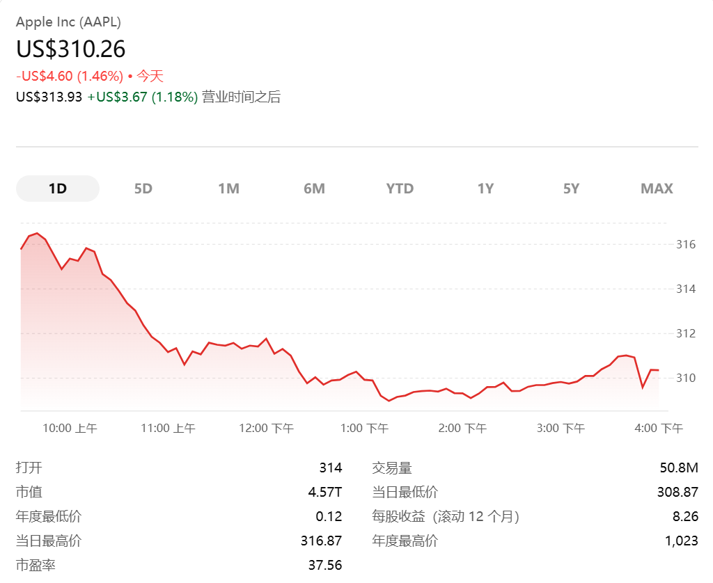

> 很多人第一次打开股票交易软件时，都会看到一堆数字：开盘、最高、最低、现价、昨收、成交量、分红、拆股……
>
> 这些词看起来很专业，但本质并不复杂。它们其实就是一只股票在一天交易过程中留下来的“价格轨迹”。
>
> 如果把股票想象成菜市场里的苹果，那么一天的交易就像苹果从早上开摊到晚上收摊的价格变化。



## 一、先看总览

| 字段 | 中文含义 | 一句话理解 |
| :--- | :--- | :--- |
| `Date` | 交易日期 | 这条记录是哪一天 |
| `Open` | 开盘价 | 当天开始交易时的价格 |
| `High` | 最高价 | 当天曾经到过的最高价格 |
| `Low` | 最低价 | 当天曾经到过的最低价格 |
| `Close` | 收盘价 | 当天交易结束时的价格 |
| `Volume` | 成交量 | 当天一共成交了多少股 |
| `Dividends` | 分红 | 公司把利润分给股东 |
| `Stock Splits` | 拆股 | 一股拆成多股，总价值不变 |

## 二、Date：交易日期

`Date` 表示这条数据是哪一天的交易记录。

比如：

| Date | Open | High | Low | Close |
| :--- | ---: | ---: | ---: | ---: |
| 2024-01-10 | 100 | 108 | 96 | 104 |

这表示：这条记录描述的是 **2024 年 1 月 10 日这一天** 的股票交易情况。

## 三、Open：开盘价

- 通俗解释：`Open` 是开盘价，也就是股票当天开始交易时的价格。
- 生活类比：早上菜市场刚开门，苹果摊老板第一口报价是 10 元一斤，这个 10 元就类似股票的开盘价。
- 软件里常见叫法：`今开：100`、`开盘：100`。

例如：

| 字段 | 数值 |
| :--- | ---: |
| Open | 100 |

意思是：这只股票今天一开始交易时，价格是 100 元。

## 四、High：当天最高价

- 通俗解释：`High` 是当天最高价，也就是股票当天交易过程中最高到过的价格。
- 生活类比：苹果早上 10 元一斤，后来买的人多，老板涨价到 12 元一斤。虽然晚上可能又降回 11 元，但今天最高卖到过 12 元。
- 软件里常见叫法：`最高：108`、`今日最高：108`。

例如：

| 字段 | 数值 |
| :--- | ---: |
| High | 108 |

意思是：这只股票今天最高涨到过 108 元。

> `High` 不代表最后收盘在 108，只代表今天曾经到过这个价格。

## 五、Low：当天最低价

- 通俗解释：`Low` 是当天最低价，也就是股票当天交易过程中最低到过的价格。
- 生活类比：苹果早上 10 元一斤，中午没人买，老板降到 8 元一斤。后来晚上又涨回 9 元，那么今天最低价就是 8 元。
- 软件里常见叫法：`最低：96`、`今日最低：96`。

例如：

| 字段 | 数值 |
| :--- | ---: |
| Low | 96 |

意思是：这只股票今天最低跌到过 96 元。

> `High` 和 `Low` 合起来，可以帮助我们判断当天波动大不大。  
> 如果最高 108，最低 96，说明当天价格上下波动了 12 元。

## 六、Close：收盘价

`Close` 是收盘价，也就是股票当天交易结束时的价格。

生活化理解：菜市场晚上收摊前，苹果最后稳定在 11 元一斤，那么这个 11 元就类似股票的收盘价。

例如：

| 字段 | 数值 |
| :--- | ---: |
| Close | 104 |

意思是：这只股票今天最后收在 104 元。

在证券交易平台上，如果当天还没有收盘，你看到的通常是 `现价`；如果当天已经收盘，这个现价基本就等于当天收盘价。

> 开盘价代表一天的开始，收盘价代表一天的结果。

## 七、Open、High、Low、Close 合起来怎么看

这四个字段合起来，就是股票最基础的价格信息。它们经常被简称为 `OHLC`。

| 英文字段 | 中文含义 |
| :--- | :--- |
| `Open` | 开盘价 |
| `High` | 最高价 |
| `Low` | 最低价 |
| `Close` | 收盘价 |

举个完整例子：

| 字段 | 数值 |
| :--- | ---: |
| Open | 100 |
| High | 108 |
| Low | 96 |
| Close | 104 |

这一天可以这样理解：

- 早上从 100 元开始交易。
- 盘中最高涨到 108 元。
- 盘中最低跌到 96 元。
- 最后收在 104 元。

因为收盘价 104 高于开盘价 100，所以这一天整体是上涨的。

## 八、在交易软件里如何看这些价格

打开任意一个证券交易软件，例如同花顺、东方财富、雪球、富途、老虎证券等，一般进入某只股票详情页后，都能看到这些信息：

- 股票名称、股票代码
- 当前价格
- 涨跌额、涨跌幅
- 今开、最高、最低、昨收
- 成交量、成交额
- 市值、市盈率

你可以重点找这几个词：

| yfinance 字段 | 交易软件里常见叫法 |
| :--- | :--- |
| `Open` | 今开、开盘 |
| `High` | 最高、今日最高 |
| `Low` | 最低、今日最低 |
| `Close` | 收盘、现价、最新价 |
| `Volume` | 成交量 |
| `Dividends` | 分红、派息 |
| `Stock Splits` | 拆股、拆分、送转 |

不同平台展示位置不完全一样，但核心含义一致。

## 九、Volume：成交量

`Volume` 是成交量，表示这只股票当天一共成交了多少股。

生活化理解：如果一个菜市场里，某个苹果摊一天卖出了 1000 斤苹果，说明这个摊今天交易很活跃。股票也是一样，如果某只股票一天成交了 5000 万股，说明这一天有大量买卖发生。

例如：

| 字段 | 数值 |
| :--- | ---: |
| Volume | 50,000,000 |

意思是：当天一共成交了 5000 万股。

在证券交易平台上，通常会看到 `成交量：5000万`，或者简称为 `量：5000万`。

成交量不是价格，但它能反映市场热度：

- 股价上涨，同时成交量明显放大，说明很多资金参与了这次上涨。
- 股价上涨，但成交量很小，说明虽然价格涨了，但参与的人不多，力量可能没有那么强。

> 成交量只是辅助判断，不是万能答案。

## 十、Dividends：分红

`Dividends` 是分红，表示公司把一部分利润分给股东。

生活化理解：你和朋友一起开了一家店，年底赚钱了，大家按股份比例分钱。这个分钱的动作，就类似上市公司给股东分红。

比如一家公司宣布：每股分红 0.5 元。

如果你持有 1000 股，那么理论上可以获得：

```text
1000 × 0.5 = 500 元
```

在 `yfinance` 里，如果某一天 `Dividends` 是 0.5，就表示那一天记录了每股分红 0.5 元。

大多数交易日这个字段都是 0，因为公司不是每天都分红。

## 十一、Stock Splits：拆股

`Stock Splits` 是拆股，表示公司把一股股票拆成多股。

生活化理解：你有一张 100 元纸币，换成了 10 张 10 元纸币。钱的总额没有变，但张数变多了。股票拆股也是类似。

拆股前：

| 持股数量 | 每股价格 | 总价值 |
| :--- | ---: | ---: |
| 1 股 | 400 元 | 400 元 |

1 拆 4 后：

| 持股数量 | 每股价格 | 总价值 |
| :--- | ---: | ---: |
| 4 股 | 100 元 | 400 元 |

你会发现，总价值还是 400 元。

> 拆股本身不会让你凭空赚钱。它主要是让单股价格变低，让更多投资者更容易买入。

## 十二、一张图理解 OHLC

你可以把一天的股票价格想象成这样：

```text
最高价 High
   |
   |        *
   |       / \
   |      /   \
开盘价 Open    \
   |            \
   |             * 收盘价 Close
   |
最低价 Low
```

更直观一点：

```text
100 开盘
  |
  | 上涨到 108    <- 最高价
  |
  | 回落到 96     <- 最低价
  |
  | 最后收在 104  <- 收盘价
```

这一整天的数据就可以被压缩成四个数字：

| 字段 | 数值 |
| :--- | ---: |
| Open | 100 |
| High | 108 |
| Low | 96 |
| Close | 104 |

这就是股票 K 线图的基础。

## 十三、K 线图怎么看

在证券交易平台里，最常见的图就是 K 线图。一根 K 线通常包含四个价格：

- 开盘价
- 最高价
- 最低价
- 收盘价

也就是 `Open`、`High`、`Low`、`Close`。

| 判断方式 | 通常含义 |
| :--- | :--- |
| 收盘价高于开盘价 | 当天上涨 |
| 收盘价低于开盘价 | 当天下跌 |
| 国内软件常见颜色 | 红色上涨，绿色下跌 |
| 海外软件常见颜色 | 颜色可能相反 |

所以看 K 线时，不要死记颜色，真正应该看的是：

> 收盘价和开盘价谁更高。

## 最后，用一句话记住

> `Open` 是开始，`Close` 是结果，`High` 和 `Low` 是当天的价格边界，`Volume` 是交易热度，`Dividends` 和 `Stock Splits` 是公司行为。
