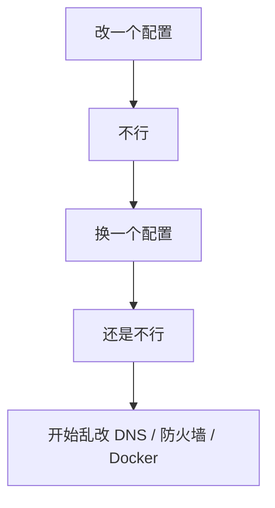
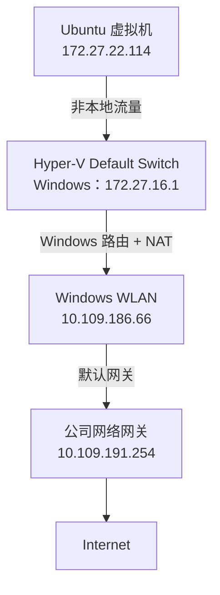
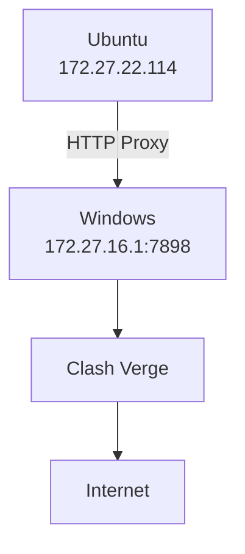
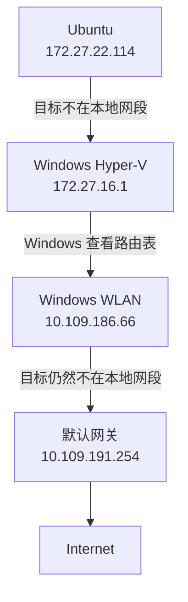

在 Windows 上使用 Hyper-V 安装 Ubuntu 虚拟机以后，一个很常见的问题是：

> Windows 本身已经开启了 Clash Verge 系统代理，但 Ubuntu 虚拟机为什么还是访问不了 Docker Hub、GitHub 等网站？

表面上看，这似乎只是"代理没配好"。

但实际排查时，会涉及：

- 虚拟机 IP
- 网卡
- 子网
- 默认网关
- Windows 路由
- Hyper-V Default Switch
- NAT
- HTTP Proxy
- Docker Daemon Proxy
- NO_PROXY
- Windows Firewall

如果这些概念没有串起来，很容易陷入这样的循环：



这篇文章不从"最终答案"开始，而是按照真实排查过程，从底层网络一路排到 Docker。

## 一、先理解完整网络链路

先看最终要实现的目标：



如果还要使用 Clash：



这里最重要的一点是：

> **Ubuntu 和 Windows 不是共用同一套网络栈。Windows 开启"系统代理"，并不意味着 Ubuntu 自动继承。**

## 二、排查第一步：Ubuntu 有没有正常拿到 IP？

第一条命令：

```bash
ip addr
```

实际输出中最关键的是：

```
2: eth0: <BROADCAST,MULTICAST,UP,LOWER_UP>

inet 172.27.22.114/20
```

这里分别代表：

| 输出 | 含义 |
| ---- | ---- |
| `eth0` | Ubuntu 的主要网络接口 |
| `UP` | 网卡已经启用 |
| `LOWER_UP` | 底层网络链路正常 |
| `172.27.22.114` | Ubuntu 当前 IPv4 地址 |
| `/20` | 子网掩码长度 |

所以当前可以确认：**Ubuntu 虚拟机 IP 是 `172.27.22.114`**。

### 什么是网卡？

网卡可以简单理解成：

> 一台机器连接某个网络的"接口"。

物理电脑可能有：

- Wi-Fi 网卡
- 有线网卡

而虚拟化环境里还会出现：

- eth0
- docker0
- Tailscale
- tun0

这些都是网络接口。

比如 Ubuntu 当前：

```
eth0
→ Ubuntu 与 Hyper-V 网络通信

docker0
→ Ubuntu 与 Docker 容器通信
```

所以看到 `docker0`（`172.18.0.1`）时，不要误认为这是 Ubuntu 对 Windows 的 IP。

## 三、排查第二步：Ubuntu 的默认网关是谁？

执行：

```bash
ip route
```

得到：

```
default via 172.27.16.1 dev eth0
```

这句话非常重要，意思是：

> Ubuntu 如果要访问一个不在自己局域网里的地址，就把数据交给 `172.27.16.1`。

所以当前的网络信息是：

- Ubuntu IP：`172.27.22.114`
- Ubuntu 默认网关：`172.27.16.1`

再看 Windows 的 `vEthernet (Default Switch)` 网卡：

- IPv4：`172.27.16.1`

这两个就对应上了。

所以网络结构是：

```
Ubuntu
172.27.22.114
        │
        │ 默认网关
        ▼
Windows
172.27.16.1
```

### 为什么 Windows IP 正好是 Ubuntu 的网关？

因为 Hyper-V 创建了一个虚拟网络。

- Windows 在这个网络中的地址：`172.27.16.1`
- Ubuntu 在这个网络中的地址：`172.27.22.114`

Ubuntu 想离开这个虚拟局域网，就需要经过 Windows。

所以可以这样记：

- `172.27.22.114` —— 我是谁
- `172.27.16.1` —— 我要出去先找谁

## 四、Windows 又是怎么继续访问公网的？

Windows 不是只有 `172.27.16.1` 这一个 IP。

Windows 的 `ipconfig` 中还有一块 WLAN 网卡：

- IP：`10.109.186.66`
- 默认网关：`10.109.191.254`

所以 Ubuntu 请求公网时，完整链路更像：



这里 Windows 还会涉及 NAT（网络地址转换）。

Ubuntu 发出的数据包源地址是 `172.27.22.114`，经过 Windows 转发后，对外就变成了 `10.109.186.66`。

所以外部网络并不需要认识 Ubuntu 的私网地址。

### 什么是网关？

可以简单理解为：

> 去另一个网络的出口。

要注意，网络里的 Gateway 和项目里的 API Gateway 不是一个东西：

| 概念 | 所在层次 | 例子 |
| ---- | ---- | ---- |
| 网络网关 | IP / 路由层 | `default via 172.27.16.1` |
| API Gateway | HTTP / 应用层 | `/api/user` → user-service |

它们只是都具有"流量入口/转发"的含义。

## 五、排查第三步：Ubuntu 能不能访问公网 IP？

执行：

```bash
ping -c 3 8.8.8.8
```

结果：

```
3 packets transmitted
3 received
0% packet loss
```

说明这条链路是通的：

```
Ubuntu
  ↓
默认网关
  ↓
Windows
  ↓
公网
```

**基础 IP 网络是通的。**

**为什么使用 8.8.8.8？**

`8.8.8.8` 是 Google Public DNS 的地址，经常被用于网络测试，因为：

- 地址固定
- 服务长期存在
- 大家熟悉

但它并不是"永远一定能访问"，公司网络、防火墙等都可能限制它。

真正重要的是：**直接访问 IP，可以绕开 DNS。**

所以 `ping 8.8.8.8` 主要是在验证：

- IP
- 路由
- 网关
- 公网

而不是 DNS。换成其他公网 IP（如 `1.1.1.1`、`8.8.4.4`）也可以，同样是在绕过域名解析。

## 六、排查第四步：DNS 和 HTTPS 是否正常？

继续执行：

```bash
curl -I --connect-timeout 5 https://www.baidu.com
```

得到：

```
HTTP/1.1 200 OK
```

这个结果比 ping 又多验证了一层。

因为访问域名需要经历：

```
www.baidu.com
  ↓
DNS 解析
  ↓
得到目标 IP
  ↓
TCP 建连
  ↓
TLS
  ↓
HTTP
```

所以这个请求成功可以说明：

- DNS ✅
- TCP ✅
- HTTPS ✅
- HTTP ✅

到这里就能判断：**Ubuntu 基础网络没问题。**

所以如果 Docker Hub 仍然访问失败，就不应该继续折腾：

- 网卡
- 默认网关
- 普通 DNS
- 基础公网

而应该往**代理层**查。

## 七、排查第五步：Windows Clash 是否真的监听端口？

Windows 使用 Clash Verge，查看设置发现：

- Allow LAN：开启
- Mixed Port：`7898`

接着在 Windows 执行：

```bash
netstat -ano | findstr 7898
```

得到：

```
TCP    0.0.0.0:7898    LISTENING
```

这句话非常关键：

- 如果是 `127.0.0.1:7898`，说明只有 Windows 自己能访问。
- 而 `0.0.0.0:7898` 表示 Clash 正在监听 Windows 的**所有 IPv4 网卡**。

所以 Ubuntu 理论上可以访问 `172.27.16.1:7898`。

### 为什么需要 Allow LAN？

如果 Clash 只允许 `127.0.0.1`，那么只有 Windows 本机应用可以使用代理。

Ubuntu 是另一台机器。即使它运行在同一台物理电脑里，从网络角度仍然是"另一台设备"，所以必须允许 LAN 连接。

## 八、排查第六步：Ubuntu 能不能连接 Clash 的 TCP 端口？

在 Ubuntu 执行：

```bash
nc -vz -w 5 172.27.16.1 7898
```

结果：

```
Connection to 172.27.16.1 7898 succeeded!
```

这个结果只证明一件事：

```
Ubuntu → Windows → TCP 7898 ✅
```

注意，它还**没有**证明代理一定能正常访问互联网。

这是一个很重要的排错思想：

> **一步只证明一件事。**

`nc` 成功只能证明 TCP 能连，不代表 Clash 一定能访问 Docker Hub，所以还要继续验证代理本身。

## 九、排查第七步：Clash 能不能真正代理外网请求？

执行：

```bash
curl -x http://172.27.16.1:7898 -I https://registry-1.docker.io/v2/
```

返回：

```
HTTP/1.1 200 Connection established

HTTP/2 401
```

这次其实是**成功**。

第一行 `200 Connection established` 说明：

```
Ubuntu → Clash → Docker Hub
```

HTTPS 隧道已经建立。

后面的 `401` 不是网络失败——Docker Registry 的 `/v2/` 接口在没有携带 Token 时，本来就会返回 `401 Unauthorized`。

所以这一层验证通过：

```
Ubuntu → Windows Clash → Docker Hub ✅
```

## 十、为什么 Windows 开了系统代理，Ubuntu 还要单独配置？

这是整个过程中最容易误解的地方之一。

Windows 开启 System Proxy，**不等于**"所有网络请求全部经过 Clash"。

它通常只影响"会读取 Windows 系统代理设置的 Windows 程序"，例如：

```
Windows 浏览器
  ↓
Windows 系统代理
  ↓
Clash
```

而 Ubuntu 有自己的：

- 网络栈
- 环境变量
- 代理配置
- 应用配置

所以 Ubuntu 的默认链路还是：

```
Ubuntu
  ↓
Hyper-V
  ↓
Windows NAT
  ↓
外网
```

而不是：

```
Ubuntu
  ↓
Windows 系统代理
```

只有显式指定 `curl -x http://172.27.16.1:7898`，才会走 Clash。

所以可以记：

> **Windows 和 Ubuntu 的网络路径后半段会重合，但代理配置不共享。**

## 十一、排查第八步：为什么 curl 能通，但 docker pull 还不行？

这是最终定位问题的关键一步。

执行：

```bash
sudo systemctl show --property=Environment docker
```

看到：

```
HTTP_PROXY=http://172.17.16.1:7898
HTTPS_PROXY=http://172.17.16.1:7898
```

但是当前 Ubuntu 的默认网关已经是 `172.27.16.1`。

也就是说：

- 旧的 Windows Hyper-V IP：`172.17.16.1`
- 当前的 Windows Hyper-V IP：`172.27.16.1`

Docker Daemon 还在访问 `172.17.16.1:7898`，当然会超时。

所以最终根因是：

> **Hyper-V Default Switch 的网段/IP 在重启后发生了变化，但 Docker Daemon 的代理地址仍然写死为之前的 Windows Hyper-V IP。**

这就是为什么：

| 命令 | 使用的地址 | 结果 |
| ---- | ---- | ---- |
| `curl -x http://172.27.16.1:7898 ...` | 新地址 `172.27.16.1` | ✅ 成功 |
| `docker pull` | 旧地址 `172.17.16.1` | ❌ 失败 |

## 十二、修复 Docker Daemon 代理

编辑 Docker 的 systemd 配置：

```bash
sudo nano /etc/systemd/system/docker.service.d/http-proxy.conf
```

改为：

```ini
[Service]
Environment="HTTP_PROXY=http://172.27.16.1:7898"
Environment="HTTPS_PROXY=http://172.27.16.1:7898"
Environment="NO_PROXY=localhost,127.0.0.1"
```

这里的 `NO_PROXY=localhost,127.0.0.1` 表示不代理本地地址。

然后重新加载 systemd 配置文件，并重启 Docker 进程：

```bash
sudo systemctl daemon-reload
sudo systemctl restart docker
```

验证配置是否生效：

```bash
sudo systemctl show --property=Environment docker
```

最后测试：

```bash
sudo docker pull hello-world
```

这样 Docker Daemon 才真正使用当前 Windows Clash 的地址。

## 十三、Docker 代理不等于 Ubuntu 全局代理

`/etc/systemd/system/docker.service.d/http-proxy.conf` 只会影响 `dockerd`，也就是：

- `docker pull`
- `docker push`
- `docker build` 中需要 daemon 访问网络的部分

它不会自动影响：

- 浏览器
- curl
- apt
- 其他应用

所以：

> **Docker Proxy ≠ Ubuntu Global Proxy**

如果想让 Ubuntu 的 Shell 默认走代理，可以配置 `/etc/environment`，例如：

```ini
http_proxy="http://172.27.16.1:7898"
https_proxy="http://172.27.16.1:7898"
HTTP_PROXY="http://172.27.16.1:7898"
HTTPS_PROXY="http://172.27.16.1:7898"
no_proxy="localhost,127.0.0.1"
NO_PROXY="localhost,127.0.0.1"
```

## 十四、NO_PROXY 是干什么的？

配置：

```
NO_PROXY=localhost,127.0.0.1
```

意思是：**访问这些地址时，不要走代理。**

例如 Ubuntu 自己启动了 `localhost:8080`，如果不设置 `NO_PROXY`，某些程序可能会把请求发成：

```
Ubuntu
  ↓
Windows Clash
  ↓
localhost:8080
```

这里就有问题。

因为代理服务器理解的 `localhost` 可能是代理机器自己（Windows），而不是 Ubuntu。

正常应该是：

```
Ubuntu
  ↓
Ubuntu localhost
```

直接访问。

所以：

- `HTTP_PROXY` —— 默认哪些请求走代理
- `NO_PROXY` —— 哪些地址必须绕过代理

这就是 `NO_PROXY` 的作用。

## 十五、防火墙为什么也是一个重要影响因素？

在之前一次排查中，还发现 Windows 中 `verge-mihomo.exe` 存在这样一组防火墙规则：

| Profile | Direction | Action |
| ------- | --------- | ------ |
| Private | Inbound | Allow |
| Public | Inbound | Block |

如果 `Public + Block` 规则启用，并且当前流量匹配它，那么：

```
Ubuntu
  ↓
Windows:7898
  ↓
Windows Firewall ✖
  ↓
Clash
```

请求会在到达 Clash 之前被拦截，表现可能就是 `Connection timeout`。

所以以后遇到这组现象：

- netstat 显示端口监听
- Windows 本机访问正常
- Ubuntu 访问超时

就要考虑 **Windows Firewall**。

防火墙规则是什么意思？比如：

- Direction: Inbound
- Action: Block
- Profile: Public

翻译成人话：

> 当外部设备连接 Windows 时，如果这个请求属于 Public 网络场景，就阻止这个程序的入站连接。

所以 Windows 防火墙一定是 `Ubuntu → Windows Clash` 这条链路里的重要排查点之一。

## 十六、最终排查顺序

以后再碰到类似问题，不要乱改，推荐固定按照下面顺序排查：

| 步骤 | 命令 | 回答的问题 |
| ---- | ---- | ---- |
| 1. 看 Ubuntu 网卡 | `ip addr` | 网卡正常吗？拿到 IP 了吗？ |
| 2. 看 Ubuntu 路由 | `ip route` | 默认网关是谁？ |
| 3. 测试公网 IP | `ping 8.8.8.8` | 基础 IP 网络能不能出去？ |
| 4. 测试域名与 HTTPS | `curl https://www.baidu.com` | DNS / HTTPS 是否正常？ |
| 5. 确认 Clash 监听（Windows 执行） | `netstat -ano \| findstr 7898` | Clash 到底有没有监听？ |
| 6. 测试 Ubuntu → Clash TCP | `nc -vz -w 5 172.27.16.1 7898` | Ubuntu 能不能连上 Windows Clash？ |
| 7. 测试 Clash 真实代理 | `curl -x http://172.27.16.1:7898 -I https://registry-1.docker.io/v2/` | 代理本身能不能访问目标网站？ |
| 8. 检查 Docker Daemon 代理 | `sudo systemctl show --property=Environment docker` | Docker 实际在用哪个代理？ |
| 9. 查 Windows 防火墙（端口异常时） | Windows 防火墙规则 | Windows 是否拦截了 Ubuntu → Clash？ |

## 最终总结

当前完整模型可以记成：

```
Ubuntu
172.27.22.114
        │
        │ 默认网关
        ▼
Windows Hyper-V
172.27.16.1
        │
        ├───────────────┐
        │               │
        │ 普通网络       │ Proxy
        ▼               ▼
Windows WLAN       Clash :7898
10.109.186.66           │
        │               │
        └───────┬───────┘
                ▼
           上游网关
        10.109.191.254
                │
                ▼
            Internet
```

Ubuntu 并不会自动继承 Windows 的系统代理。因此，如果希望 Ubuntu 使用 Windows Clash：

```
Ubuntu
  ↓
明确指定 Windows Hyper-V IP:Clash Port
  ↓
Clash
  ↓
Internet
```

而如果是 Docker：

```
Docker Daemon
  ↓
单独配置 HTTP_PROXY / HTTPS_PROXY
  ↓
Windows Clash
```

最后再记住最容易踩的坑：

> **Hyper-V Default Switch 的网段/IP 可能变化，因此任何写死 Windows Hyper-V IP 的代理配置，都可能在重启后失效。**

这次问题看似是 Docker Hub 无法访问，本质上却是一次非常完整的 Linux 网络、Hyper-V、代理、Docker 与 Windows 防火墙联合排错。
