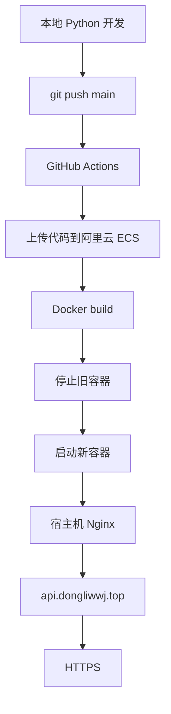
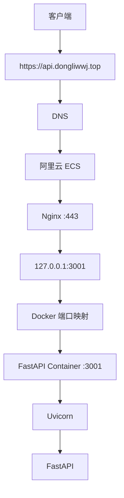
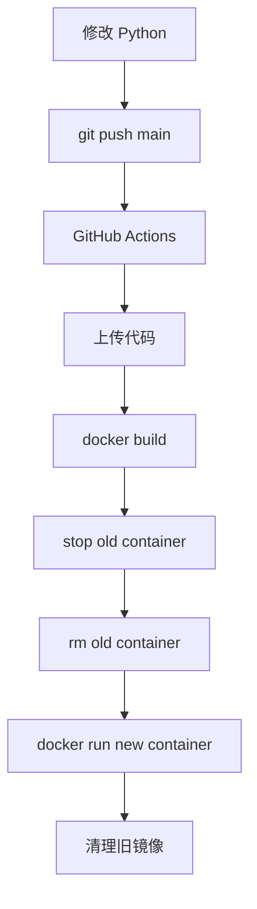
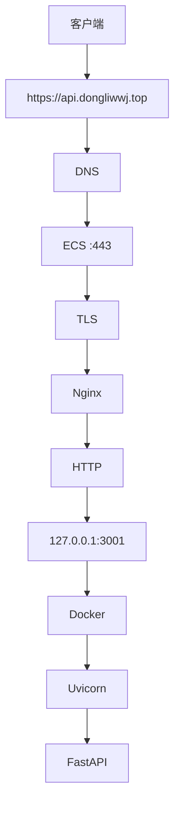
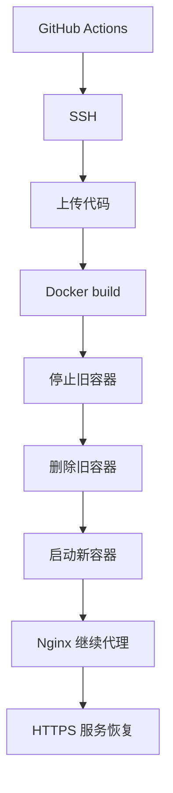

# FastAPI 后端从 0 到 HTTPS 自动部署实战

这篇文章记录一条完整后端链路：



最终目标：

- `GET https://api.dongliwwj.top/api/hello`
- `POST https://api.dongliwwj.top/api/echo`

## 一、先看最终架构

最终后端链路是：



这里最关键的一点是：**公网并不直接访问 Python 容器**，而是：

`公网 → Nginx → 127.0.0.1:3001 → Docker → FastAPI`

因此 Python 服务只需要绑定 `127.0.0.1:3001`，给宿主机 Nginx 使用，不需要把 3001 直接暴露公网。

## 二、本地创建 FastAPI 项目

项目结构：

```text
knowledge-review-backend/
├── app/
│   └── main.py
├── requirements.txt
├── Dockerfile
├── .gitignore
└── .github/
    └── workflows/
        └── deploy-backend.yml
```

`app/main.py`：

```python
from fastapi import FastAPI
from pydantic import BaseModel

app = FastAPI()


class EchoRequest(BaseModel):
    name: str


@app.get("/api/hello")
def hello():
    return {
        "code": 0,
        "message": "hello from python backend"
    }


@app.post("/api/echo")
def echo(request: EchoRequest):
    return {
        "code": 0,
        "data": {
            "name": request.name
        }
    }
```

这里定义了两个最基础接口：`GET /api/hello` 和 `POST /api/echo`。

`requirements.txt`：

```text
fastapi
uvicorn[standard]
```

## 三、本地启动 FastAPI

先创建 Python 虚拟环境：

```bash
python -m venv .venv
```

激活：

```powershell
.\.venv\Scripts\Activate.ps1
```

安装依赖：

```bash
pip install -r requirements.txt
```

启动：

```bash
uvicorn app.main:app \
  --host 127.0.0.1 \
  --port 3001 \
  --reload
```

这里 `app.main:app` 可以拆成：`app/main.py` 中的 `app = FastAPI()` 实例。

`--reload` 表示本地开发时，代码修改后自动重启。

验证 GET：

```bash
curl http://127.0.0.1:3001/api/hello
```

返回：

```json
{
  "code": 0,
  "message": "hello from python backend"
}
```

验证 POST：

```bash
curl -X POST http://127.0.0.1:3001/api/echo \
  -H "Content-Type: application/json" \
  -d '{"name":"dongli"}'
```

返回：

```json
{
  "code": 0,
  "data": {
    "name": "dongli"
  }
}
```

到这里证明 `本地 HTTP → Uvicorn → FastAPI → 接口` 已经正常。

## 四、编写 Dockerfile

本地虽然不安装 Docker，但仍然需要维护 Dockerfile。

```dockerfile
FROM python:3.12-slim

WORKDIR /app

COPY requirements.txt .

RUN pip install --no-cache-dir -r requirements.txt

COPY app ./app

EXPOSE 3001

CMD ["uvicorn", "app.main:app", "--host", "0.0.0.0", "--port", "3001"]
```

这里最值得理解的是：本地开发监听 `127.0.0.1`，Docker 容器内监听 `0.0.0.0`。

原因是 `127.0.0.1` 只监听容器自己的回环接口。如果 Uvicorn 在容器里监听 `127.0.0.1:3001`，Docker 外部流量无法正常进入。

所以容器内部使用 `0.0.0.0:3001`，表示监听容器自身所有网络接口。

> 注意：`0.0.0.0` 并不是某个真实 IP，而是"监听所有接口"的意思。

## 五、代码上传 GitHub

创建独立后端仓库 `knowledge-review-backend`。

`.gitignore`：

```text
.venv/
__pycache__/
*.pyc
```

初始化：

```bash
git init
git branch -M main
git add .
git commit -m "init fastapi backend"
```

关联仓库：

```bash
git remote add origin <GitHub仓库地址>
```

推送：

```bash
git push -u origin main
```

之后开发流程就统一变成：`修改代码 → git add → git commit → git push origin main`。

## 六、服务器准备目录

服务器目录规划：

```text
/root/fullstack/
├── frontend
└── backend
```

创建：

```bash
mkdir -p /root/fullstack/backend
```

检查 Docker：

```bash
docker --version
docker ps
```

后端代码最终会被 GitHub Actions 上传到 `/root/fullstack/backend`。

## 七、配置 GitHub SSH Secrets

后端仓库配置以下 Secrets：

- `SERVER_HOST`
- `SERVER_USER`
- `SERVER_PORT`
- `SERVER_SSH_KEY`

入口：`GitHub → Repository → Settings → Secrets and variables → Actions`。

它们的关系是：

`GitHub Actions → 私钥 → SSH → ECS → ~/.ssh/authorized_keys 中的公钥`

私钥不能写到代码里。

## 八、先验证 GitHub Actions 能 SSH

最开始不要直接做部署，先验证最基础链路：`GitHub Actions → SSH → ECS`。

例如：

```yaml
name: Deploy Backend

on:
  push:
    branches:
      - main

jobs:
  test-ssh:
    runs-on: ubuntu-latest

    steps:
      - name: Test SSH connection
        uses: appleboy/ssh-action@v1
        with:
          host: ${{ secrets.SERVER_HOST }}
          username: ${{ secrets.SERVER_USER }}
          port: ${{ secrets.SERVER_PORT }}
          key: ${{ secrets.SERVER_SSH_KEY }}
          script: |
            echo "SSH connection success"
            hostname
            whoami
            pwd
```

如果日志出现 `SSH connection success`，说明 `GitHub Actions → ECS` 已经打通。

## 九、GitHub Actions 上传代码

加入 Checkout：

```yaml
- name: Checkout code
  uses: actions/checkout@v4
```

意思是：`GitHub 仓库 → 拉到 GitHub Runner`。

然后上传：

```yaml
- name: Upload backend files
  uses: appleboy/scp-action@v1
  with:
    host: ${{ secrets.SERVER_HOST }}
    username: ${{ secrets.SERVER_USER }}
    port: ${{ secrets.SERVER_PORT }}
    key: ${{ secrets.SERVER_SSH_KEY }}
    source: "app,Dockerfile,requirements.txt"
    target: "/root/fullstack/backend"
```

此时链路：`GitHub Repository → GitHub Runner → SCP → /root/fullstack/backend`。

服务器可以检查：

```bash
find /root/fullstack/backend -maxdepth 2 -type f -print
```

应该看到：

```text
/root/fullstack/backend/Dockerfile
/root/fullstack/backend/requirements.txt
/root/fullstack/backend/app/main.py
```

## 十、服务器构建 Docker 镜像

进入：

```bash
cd /root/fullstack/backend
```

执行：

```bash
docker build \
  -t knowledge-review-backend:latest .
```

其中 `docker build` 负责构建镜像，`-t` 给镜像设置名称和 tag。`knowledge-review-backend:latest` 表示镜像名 `knowledge-review-backend`、tag `latest`。

检查：

```bash
docker images | grep knowledge-review-backend
```

## 十一、启动 Python 容器

启动：

```bash
docker run -d \
  --name knowledge-review-backend \
  -p 127.0.0.1:3001:3001 \
  --restart unless-stopped \
  knowledge-review-backend:latest
```

这里最重要的是 `-p 127.0.0.1:3001:3001`，格式为 `宿主机IP:宿主机端口:容器端口`。

所以：`宿主机 127.0.0.1:3001 → Docker → 容器 :3001`。

容器内部是 `Uvicorn → 0.0.0.0:3001`。

完整链路：

`宿主机 127.0.0.1:3001 → Docker Proxy / NAT → Container :3001 → Uvicorn 0.0.0.0:3001 → FastAPI`

验证：

```bash
curl http://127.0.0.1:3001/api/hello
```

返回：

```json
{
  "code": 0,
  "message": "hello from python backend"
}
```

这一步成功以后，说明 FastAPI ✅、Docker ✅、端口映射 ✅。

## 十二、自动停止旧容器并部署新版本

最终 GitHub Actions 可以写成：

```yaml
name: Deploy Backend

on:
  push:
    branches:
      - main

jobs:
  deploy:
    runs-on: ubuntu-latest

    steps:
      - name: Checkout code
        uses: actions/checkout@v4

      - name: Upload backend files
        uses: appleboy/scp-action@v1
        with:
          host: ${{ secrets.SERVER_HOST }}
          username: ${{ secrets.SERVER_USER }}
          port: ${{ secrets.SERVER_PORT }}
          key: ${{ secrets.SERVER_SSH_KEY }}
          source: "app,Dockerfile,requirements.txt"
          target: "/root/fullstack/backend"

      - name: Deploy backend container
        uses: appleboy/ssh-action@v1
        with:
          host: ${{ secrets.SERVER_HOST }}
          username: ${{ secrets.SERVER_USER }}
          port: ${{ secrets.SERVER_PORT }}
          key: ${{ secrets.SERVER_SSH_KEY }}
          script: |
            set -e

            cd /root/fullstack/backend

            echo "===== Build new image ====="
            docker build \
              -t knowledge-review-backend:latest .

            echo "===== Stop old container ====="
            docker stop knowledge-review-backend || true

            echo "===== Remove old container ====="
            docker rm knowledge-review-backend || true

            echo "===== Start new container ====="
            docker run -d \
              --name knowledge-review-backend \
              -p 127.0.0.1:3001:3001 \
              --restart unless-stopped \
              knowledge-review-backend:latest

            echo "===== Remove dangling images ====="
            docker image prune -f

            echo "===== Check container ====="
            docker ps \
              --filter name=knowledge-review-backend
```

现在整个自动部署过程：



这里 `docker stop knowledge-review-backend || true` 中的 `|| true` 表示：**即使旧容器不存在，也不要让整个部署任务失败**。

否则第一次部署时 `No such container` 就可能让 workflow 直接终止。

## 十三、Nginx 反向代理 Python 服务

此时 Python 服务只监听 `127.0.0.1:3001`，公网不能直接访问。我们让宿主机 Nginx 接管公网入口。

创建 `/etc/nginx/conf.d/backend.conf`：

```nginx
server {
    listen 80;

    server_name api.dongliwwj.top;

    location / {
        proxy_pass http://127.0.0.1:3001;

        proxy_set_header Host $host;
        proxy_set_header X-Real-IP $remote_addr;
        proxy_set_header X-Forwarded-For $proxy_add_x_forwarded_for;
        proxy_set_header X-Forwarded-Proto $scheme;
    }
}
```

核心是 `proxy_pass http://127.0.0.1:3001;`，表示 `Nginx → 127.0.0.1:3001 → Docker → FastAPI`。

检查并生效：

```bash
nginx -t
systemctl reload nginx
```

## 十四、为什么要先模拟 Host

DNS 还没配置时，可以直接测试：

```bash
curl \
  -H "Host: api.dongliwwj.top" \
  http://127.0.0.1/api/hello
```

这里访问的是 `127.0.0.1:80`，但人为设置 `Host: api.dongliwwj.top`，这样 Nginx 会匹配 `server_name api.dongliwwj.top;`。

如果返回 `{"code":0,"message":"hello from python backend"}`，说明 `Nginx → FastAPI` 已经打通。

这样排错时就能把 DNS 排除在外。

## 十五、配置 DNS

给 `api.dongliwwj.top` 添加 A 记录，例如：

| 记录类型 | 主机记录 | 记录值 |
| --- | --- | --- |
| A | api | `<ECS 公网 IP>` |

最终：`api.dongliwwj.top → ECS 公网 IP`。

验证：

```bash
nslookup api.dongliwwj.top
```

然后：

```bash
curl http://api.dongliwwj.top/api/hello
```

此时链路：`客户端 → DNS → ECS :80 → Nginx → 127.0.0.1:3001 → Docker → FastAPI`。

如果出现 `502 Bad Gateway`，不要一上来改 Nginx，应该先执行：

```bash
curl http://127.0.0.1:3001/api/hello
```

如果这里失败，问题在 FastAPI / Docker；如果这里成功，再排查 Nginx。

这就是最重要的排错原则：

> 从内向外排错。

## 十六、申请 HTTPS 证书

HTTP 正常后，再做 HTTPS。执行：

```bash
certbot --nginx \
  -d api.dongliwwj.top
```

Certbot 会通过 Let's Encrypt 做 HTTP-01 验证，验证路径类似 `http://api.dongliwwj.top/.well-known/acme-challenge/xxxx`。

Let's Encrypt 会：`访问 challenge → 确认你控制这个域名 → 签发证书`。

成功后 `/etc/letsencrypt/live/api.dongliwwj.top/` 会出现：

- `fullchain.pem`：服务器证书和证书链
- `privkey.pem`：服务器私钥，绝不能泄露

## 十七、Certbot 验证失败怎么排查

我们实际遇到过：

> Timeout during connect, likely firewall problem

这时应该一层层验证：

1. 先检查 DNS：

   ```bash
   nslookup api.dongliwwj.top
   ```

2. 再检查安全组，确认放行 `TCP 80`，来源 `0.0.0.0/0`。

3. 再检查系统防火墙：

   ```bash
   systemctl status firewalld
   ```

4. 再检查 Nginx 是否监听 80：

   ```bash
   ss -lntp | grep ':80'
   ```

   正常应看到 `0.0.0.0:80`。

5. 再手工验证 challenge。在 Nginx 配置中加入：

   ```nginx
   location /.well-known/acme-challenge/ {
       root /var/www/letsencrypt;
   }
   ```

   创建测试文件：

   ```bash
   mkdir -p /var/www/letsencrypt/.well-known/acme-challenge

   echo "acme-test-ok" \
     > /var/www/letsencrypt/.well-known/acme-challenge/test.txt
   ```

   公网访问：

   ```bash
   curl \
     http://api.dongliwwj.top/.well-known/acme-challenge/test.txt
   ```

   返回 `acme-test-ok` 即通。

6. 再检查 Nginx 日志：

   ```bash
   grep 'acme-challenge' \
     /var/log/nginx/access.log
   ```

   如果能看到 Let's Encrypt 验证服务器返回 `200`，说明至少部分验证节点已经成功访问服务器。

最终重新执行：

```bash
certbot --nginx \
  -d api.dongliwwj.top
```

成功。

## 十八、HTTPS 最终链路

证书配置完成后：



这里有个很关键的概念：`客户端 → Nginx` 使用 HTTPS，但 `Nginx → FastAPI` 仍然可以是 HTTP，因为它们就在同一台服务器。

这叫 **TLS Termination**：

> HTTPS 到 Nginx 为止，由 Nginx 负责解密，内部服务继续使用 HTTP。

## 十九、最终验证

GET：

```bash
curl \
  https://api.dongliwwj.top/api/hello
```

返回：

```json
{
  "code": 0,
  "message": "hello from python backend"
}
```

POST：

```bash
curl -X POST \
  https://api.dongliwwj.top/api/echo \
  -H "Content-Type: application/json" \
  -d '{"name":"dongli"}'
```

返回：

```json
{
  "code": 0,
  "data": {
    "name": "dongli"
  }
}
```

至此：

- FastAPI ✅
- GitHub ✅
- GitHub Actions ✅
- SSH ✅
- Docker ✅
- 自动部署 ✅
- Nginx ✅
- DNS ✅
- HTTP ✅
- HTTPS ✅

## 二十、最终开发体验

以后修改：

```python
@app.get("/api/hello")
def hello():
    ...
```

然后：

```bash
git add .
git commit -m "update backend"
git push origin main
```

后续全部自动完成：



开发者不再需要每次：登录服务器、手动 `git pull`、手动 `docker build`、手动 `docker stop`、手动 `docker run`。

这才是 CI/CD 真正带来的价值。
