## 一、背景

这次实践的目标是把一个 Vue3 前端项目从本地开发，一直部署到公网服务器，并最终实现：

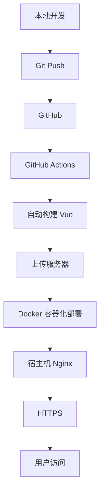

同时还要解决一个实际遇到的问题：

> 每次前端发版时，旧容器删除后到新容器真正启动之间，会出现几十秒甚至 1～2 分钟的 502。

因此整个实践最终从普通的：

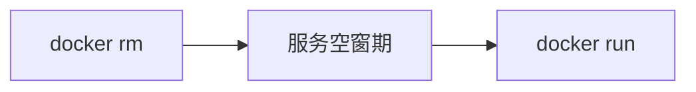

升级为了：


当前阶段只讨论前端，不涉及后端，也暂时没有使用 Docker Compose。

## 二、整体架构

最终前端访问架构如下：

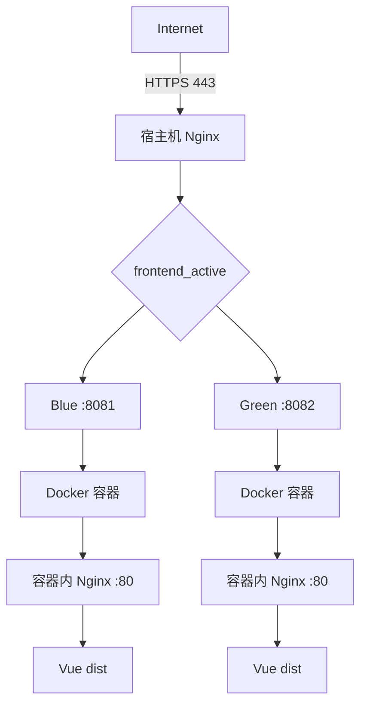

这里实际上存在两层 Nginx。

**第一层：宿主机 Nginx**，负责：

- HTTPS
- 反向代理
- 蓝绿发布

**第二层：Docker 容器内部 Nginx**，负责：

- 提供 Vue 打包后的静态文件

这是整个部署架构中非常重要的一个区分。

## 三、Vue 为什么需要构建

开发 Vue 项目时通常执行：

```bash
npm run dev
```

此时运行的是 Vite 开发服务器：


但生产环境不能依赖开发服务器，而是执行：

```bash
npm run build
```

生成：

```text
dist/
├── index.html
├── assets/
└── ...
```

整个过程：

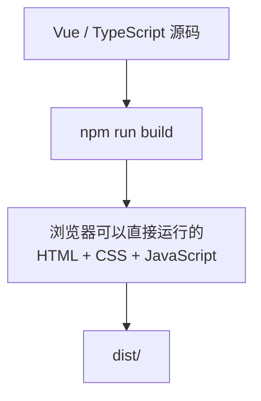

所以生产服务器真正需要运行的不是 Vue，而是：


## 四、前端 Docker 化

### 配置文件

在项目根目录创建 `Dockerfile`，内容如下：

```dockerfile
# 基于 nginx 镜像创建
FROM nginx:alpine

# 将 nginx 配置文件复制到镜像中
COPY nginx.conf /etc/nginx/conf.d/default.conf

# 将打包后的静态文件复制到镜像中
COPY dist /usr/share/nginx/html

# 暴露 80 端口
EXPOSE 80

# 前台启动 nginx
CMD ["nginx", "-g", "daemon off;"]
```

这里的核心逻辑是：

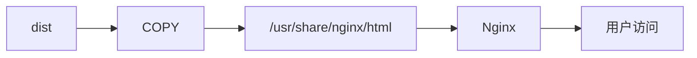

注意这里并没有使用 `npm install`、`npm run build`，这是因为我们将打包的任务交给 GitHub Actions 了，所以只需要将打包后的文件复制到镜像中即可。

## 五、容器内部 Nginx

容器内的 `nginx.conf` 配置：

```nginx
server {
    listen 80;

    server_name _;

    root /usr/share/nginx/html;

    index index.html;

    location / {
        try_files $uri $uri/ /index.html;
    }
}
```

其中最重要的是：

```nginx
try_files $uri $uri/ /index.html;
```

这是为了支持 Vue Router 的 History 模式。以访问 `/article/10` 为例，服务器上实际并不存在这个路径的文件：

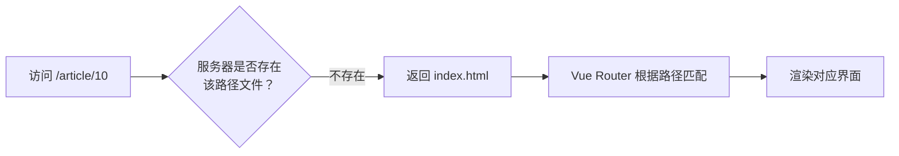

## 六、GitHub Actions 自动构建

前端项目是一个独立 GitHub 仓库，Workflow 文件位于：

```text
.github/
└── workflows/
    └── deploy-frontend.yml
```

当代码 `git push origin main` 之后自动触发：

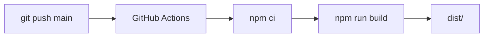

首先获取源码：

```yaml
- name: Checkout repository
  uses: actions/checkout@v4
```

然后准备 Node 环境：

```yaml
- name: Setup Node.js
  uses: actions/setup-node@v4
  with:
    node-version: 22
    cache: npm
```

安装依赖：

```yaml
- name: Install dependencies
  run: npm ci
```

然后构建：

```yaml
- name: Build frontend
  run: npm run build
```

一句话解释 `npm ci` 和 `npm install` 的区别：

> `npm install` 按 package.json 求解依赖并可能改写 lockfile；`npm ci` 严格按 lockfile 原样安装、绝不修改、且清空重装。

## 七、打包部署文件

构建完成后，需要上传：

```text
dist/
Dockerfile
nginx.conf
```

因此进行打包：

```bash
tar -czf frontend-release.tar.gz \
  dist \
  Dockerfile \
  nginx.conf
```

最终得到 `frontend-release.tar.gz`，然后通过 `scp` 上传到服务器。

## 八、SSH 自动部署

GitHub Actions 需要远程登录服务器，这里使用 SSH 公钥认证：


判断方法非常简单：

> 谁主动 SSH 登录，谁持有私钥；谁接受登录，谁保存公钥。

GitHub Secrets 中保存：

```text
SERVER_HOST
SERVER_USER
SERVER_PORT
SERVER_SSH_KEY
```

其中 `SERVER_SSH_KEY` 保存的是私钥，服务器的 `/root/.ssh/authorized_keys` 保存对应公钥。

因为当前部署目录是 `/root/fullstack/frontend`，所以当前 GitHub Actions 使用的是 root SSH 用户。

## 九、服务器部署目录

服务器上的前端部署目录统一为 `/root/fullstack/frontend`，结构：

```text
/root/fullstack/frontend/
├── Dockerfile
├── nginx.conf
└── dist/
```

GitHub Actions 上传完成后解压：

```bash
tar \
  -xzf /tmp/frontend-release.tar.gz \
  -C /root/fullstack/frontend
```

然后进入目录：

```bash
cd /root/fullstack/frontend
```

构建 Docker 镜像：

```bash
docker build \
  -t knowledge-review-frontend:latest \
  .
```

## 十、第一版部署方案

最开始采用的是最简单的先删后启：

```bash
docker rm \
  -f \
  knowledge-review-frontend \
  2>/dev/null || true
```

然后：

```bash
docker run \
  -d \
  --name knowledge-review-frontend \
  --restart unless-stopped \
  -p 8081:80 \
  knowledge-review-frontend:latest
```

各参数含义：

| 参数 | 含义 |
| ---- | ---- |
| `-d` | 后台运行 |
| `--name` | 容器名 |
| `--restart unless-stopped` | 崩溃 / 重启自动恢复，手动停止则不拉起 |
| `-p 8081:80` | 宿主机 8081 → 容器 80 |

结构：

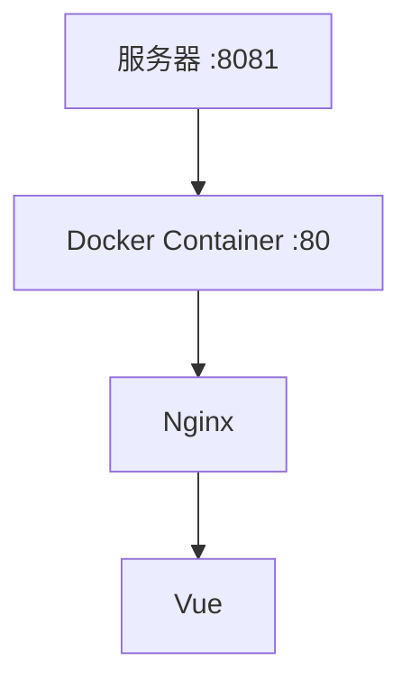

这种方式功能上没有问题，但它有一个严重缺陷。

## 十一、为什么发版会出现 502

原来的部署顺序：

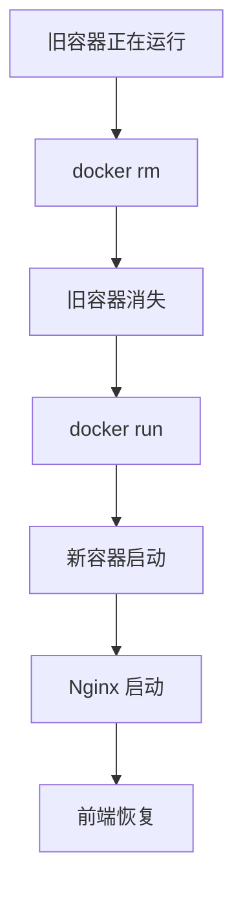

关键问题就在这一段：

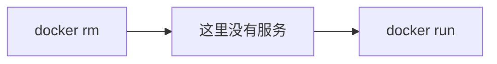

宿主机 Nginx 此时仍然尝试访问 `127.0.0.1:8081`，但 8081 暂时不存在服务，于是：

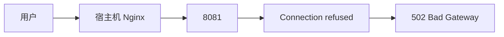

因此问题并不是 Vue 本身，真正的问题是：

> 发布过程中存在服务空窗期。

## 十二、引入蓝绿发布

为了避免这个空窗期，将前端拆成两个固定槽位：

| 槽位 | 容器名 | 端口 |
| ---- | ------ | ---- |
| Blue | `knowledge-review-frontend-blue` | 8081 |
| Green | `knowledge-review-frontend-green` | 8082 |

两个端口固定不变：

```text
Blue  = 8081
Green = 8082
```

真正变化的是：**哪个版本是 active**。

## 十三、蓝绿发布原理

假设当前 `Blue :8081` 上的版本 v1 正在提供服务，此时用户：

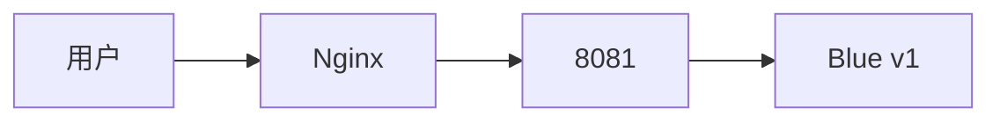

现在需要发布 v2，不能删除 Blue，而是启动 Green：

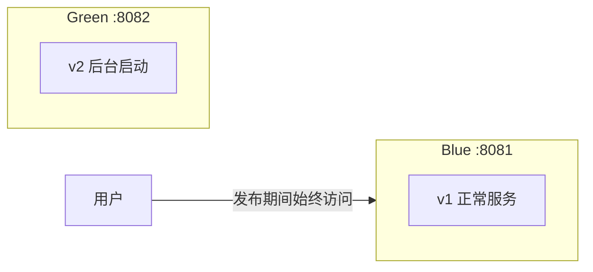

所以发布期间用户仍然访问 Blue v1，完全不受影响。

## 十四、启动备用环境

部署脚本首先判断当前 active。例如宿主机 Nginx：

```nginx
upstream frontend_active {
    server 127.0.0.1:8081;
}
```

说明 8081 是 active，那么新版本自动部署到 8082，即 Green。启动：

```bash
docker run \
  -d \
  --name knowledge-review-frontend-green \
  --restart unless-stopped \
  -p 127.0.0.1:8082:80 \
  knowledge-review-frontend:latest
```

这里相比之前有一个变化：

| 阶段 | 端口映射 | 效果 |
| ---- | -------- | ---- |
| 以前 | `-p 8081:80` | 监听服务器所有网卡 |
| 现在 | `-p 127.0.0.1:8082:80` | 8082 只监听服务器本地 |

公网用户不能直接访问 8082，只能通过宿主机 Nginx 反向代理到 `127.0.0.1:8082`：

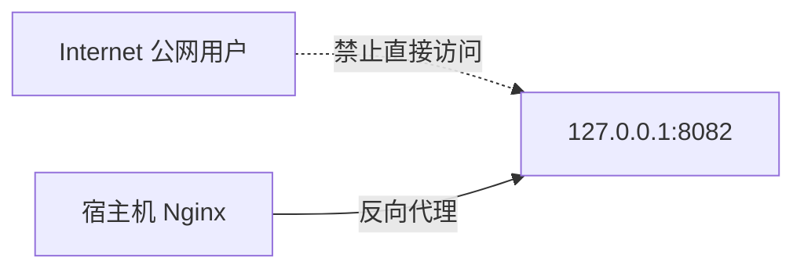

安全性更好。

## 十五、第一次健康检查

新容器启动成功，并不代表服务真正可用。因此切流之前执行：

```bash
curl \
  -fsS \
  --max-time 3 \
  http://127.0.0.1:8082/
```

检查的是这条链路：


必须成功后才能继续。整个逻辑：

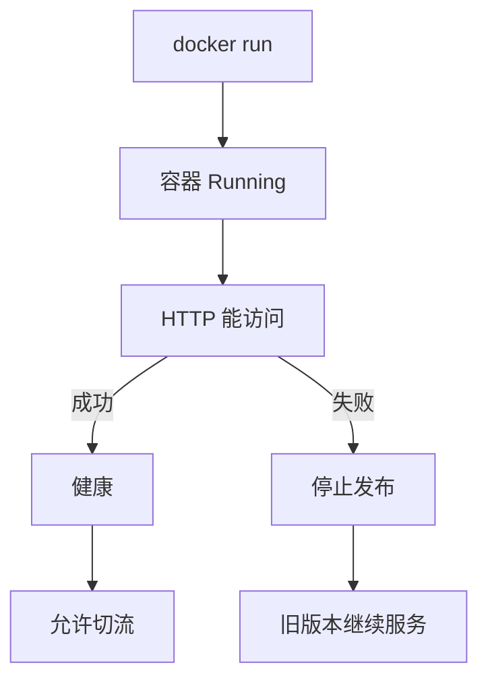

所以即使新版本坏了，用户依然访问旧版本，不会影响线上。

## 十六、宿主机 Nginx

宿主机主配置 `/etc/nginx/nginx.conf` 主要负责全局 Nginx 配置，具体前端业务放到 `/etc/nginx/conf.d/frontend.conf`，例如：

```nginx
upstream frontend_active {
    server 127.0.0.1:8082;
}
```

这里 `frontend_active` 相当于一个逻辑名称。业务层：

```nginx
location / {
    proxy_pass http://frontend_active;

    proxy_set_header Host $host;
    proxy_set_header X-Real-IP $remote_addr;
    proxy_set_header X-Forwarded-For $proxy_add_x_forwarded_for;
    proxy_set_header X-Forwarded-Proto $scheme;
}
```

所以真正的访问路径：

```mermaid
flowchart LR
    A["用户"] --> B["Nginx"] --> C["frontend_active"] --> D{"8081 或 8082"}
```

## 十七、自动切流

假设现在：

```text
8081 = active
8082 = new
```

新版本健康检查成功以后，将：

```nginx
server 127.0.0.1:8081;
```

自动修改为：

```nginx
server 127.0.0.1:8082;
```

然后先执行 `nginx -t` 验证配置，成功后执行：

```bash
nginx -s reload
```

注意这里是 `reload` 而不是 `restart`，因为 reload 可以让 Nginx 平滑重新加载配置。于是：

```mermaid
flowchart LR
    U["用户"] -->|"切换前"| A["Blue :8081"]
    U -->|"切换后"| B["Green :8082"]
```

## 十八、第二次健康检查

这里非常容易被忽略。前面已经验证了 `127.0.0.1:8082`，为什么切流后还需要再检查？

因为第一次检查只能证明**新容器正常**，不能证明 **Nginx → 新容器** 这整条链路正常。因此切流以后还要测试一次真实访问链路。

当前已经配置 HTTPS，所以使用：

```bash
curl \
  -fsS \
  --max-time 5 \
  --resolve dongliwwj.top:443:127.0.0.1 \
  https://dongliwwj.top/ \
  > /dev/null
```

这里 `https://dongliwwj.top` 保留真实域名和 HTTPS，但 `--resolve` 强制把 `dongliwwj.top` 解析到 `127.0.0.1`。因此请求链：

```mermaid
flowchart LR
    A["服务器本机"] -->|"https://dongliwwj.top"| B["127.0.0.1:443"]
    B --> C["宿主机 Nginx"]
    C --> D["frontend_active"]
    D --> E["新容器"]
```

这个测试验证的是：HTTPS + 证书 + Nginx + upstream + 新容器 + Vue 的完整链路。

## 十九、为什么 nginx -t 不够

一个容易产生的错误认识是：`nginx -t` 成功，就认为发布成功。

实际上 `nginx -t` 只能证明 **Nginx 配置语法正确**。例如 `server 127.0.0.1:8082;` 语法完全正确，但 8082 可能根本没有服务，此时 `nginx -t` 仍然成功，用户访问却会 502。

所以：

> 配置检查 ≠ 业务健康检查

正确的发布应该同时有：`nginx -t` + `curl`。

## 二十、自动回滚

切流之前，需要先备份配置：

```bash
cp \
  "$NGINX_CONF" \
  "${NGINX_CONF}.bak"
```

如果切流以后检查失败：

```mermaid
flowchart LR
    A["新版本"] --> B["Nginx 切流"] --> C["最终检查失败"] --> D["恢复 nginx.conf"] --> E["nginx -s reload"] --> F["切回 Blue v1"]
```

立即恢复：

```bash
cp \
  "${NGINX_CONF}.bak" \
  "$NGINX_CONF"
```

然后：

```bash
nginx -t
nginx -s reload
```

于是 Green v2 有问题时，Nginx 重新指向 Blue v1，用户重新回到旧版本。

## 二十一、为什么不立即删除旧容器

蓝绿发布成功以后，Green v2 是新版本，Blue v1 是旧版本。此时不要马上删除 Blue v1，因为它是当前最直接的回滚版本。

正确状态：

| 容器 | 版本 | 角色 |
| ---- | ---- | ---- |
| Green :8082 | v2 | ACTIVE |
| Blue :8081 | v1 | STANDBY |

下次发布 v3 时，再：

```mermaid
flowchart LR
    A["删除旧 Blue v1"] --> B["Blue 部署 v3"] --> C["健康检查"] --> D["Green → Blue 切流"]
```

得到 Blue v3（ACTIVE）、Green v2（STANDBY）；下一次 v4 发布后，Blue v3（STANDBY）、Green v4（ACTIVE）：

| 版本 | Blue :8081 | Green :8082 |
| ---- | ---------- | ----------- |
| v2 发布后 | v1（STANDBY） | v2（ACTIVE） |
| v3 发布后 | v3（ACTIVE） | v2（STANDBY） |
| v4 发布后 | v3（STANDBY） | v4（ACTIVE） |

因此 8081 与 8082 会不断自动交替：

```mermaid
flowchart LR
    A["Blue :8081"] <-->|"随版本发布<br>不断交替"| B["Green :8082"]
```

## 二十二、HTTPS

域名：

```text
dongliwwj.top
www.dongliwwj.top
```

最终用户不会访问 `http://IP:8081`，而是访问 `https://dongliwwj.top`。宿主机 Nginx：

```nginx
server {
    server_name dongliwwj.top www.dongliwwj.top;

    location / {
        proxy_pass http://frontend_active;
    }

    listen 443 ssl;

    ssl_certificate /etc/letsencrypt/live/www.dongliwwj.top/fullchain.pem;
    ssl_certificate_key /etc/letsencrypt/live/www.dongliwwj.top/privkey.pem;
}
```

请求变成：

```mermaid
flowchart TD
    A["Browser"] -->|"HTTPS :443"| B["宿主机 Nginx"]
    B --> C["frontend_active"]
    C -->|"8081 / 8082"| D["Docker"]
```

同时 80 端口负责 HTTP 到 HTTPS 的跳转：

```mermaid
flowchart LR
    A["HTTP :80"] -->|"301"| B["HTTPS :443"]
```

## 二十三、最终 CI/CD 流程

现在一次完整发版是：

```mermaid
flowchart TD
    subgraph CI["① ~ ⑧ 构建与上传"]
        A["① 本地开发"] --> B["② git push main"]
        B --> C["③ GitHub Actions"]
        C --> D["④ npm ci"]
        D --> E["⑤ npm run build"]
        E --> F["⑥ 生成 dist"]
        F --> G["⑦ 打包：dist + Dockerfile + nginx.conf"]
        G --> H["⑧ SCP 上传 ECS"]
    end

    subgraph Deploy["⑨ ~ ⑬ 服务器部署"]
        I["⑨ 解压到 /root/fullstack/frontend"] --> J["⑩ docker build"]
        J --> K["⑪ 判断当前 Active"]
        K --> L["⑫ 找到 Inactive"]
        L --> M["⑬ Inactive 启动新版本"]
    end

    subgraph Verify["⑭ ~ ⑲ 验证与切流"]
        N["⑭ 新容器健康检查"] --> O["⑮ 修改 Nginx upstream"]
        O --> P["⑯ nginx -t"]
        P --> Q["⑰ nginx reload"]
        Q --> R["⑱ HTTPS 完整链路检查"]
        R --> S["⑲ 发布成功"]
    end

    H --> I
    M --> N
```

如果 ⑭ 失败：

```mermaid
flowchart LR
    A["⑭ 健康检查失败"] --> B["不切流"] --> C["旧版本继续工作"]
```

如果 ⑱ 失败：

```mermaid
flowchart LR
    A["⑱ 链路检查失败"] --> B["恢复 nginx.conf"] --> C["reload 切回旧版本"]
```

所以真正的发布原则已经变成：

> 先部署、再验证、最后切流；切流失败立即回滚。

## 二十四、这套方案解决了什么

最开始：

```mermaid
flowchart LR
    A["docker rm"] --> B["服务消失"] --> C["docker run"] --> D["服务恢复"]
```

存在明显空窗期。现在：

```mermaid
flowchart LR
    A["旧版本一直工作"] --> B["新版本后台启动"] --> C["健康检查"] --> D["切流"]
```

正常情况下服务始终存在，从而解决了发版时出现几十秒甚至一分钟以上 `502 Bad Gateway` 的问题。

## 附录：完整的 deploy-frontend.yml

```yaml
name: Deploy Frontend

on:
  push:
    branches:
      - main

  workflow_dispatch:

permissions:
  contents: read

jobs:
  deploy:
    runs-on: ubuntu-latest

    steps:
      # 1. 拉取代码
      - name: Checkout repository
        uses: actions/checkout@v4

      # 2. 安装 Node.js
      - name: Setup Node.js
        uses: actions/setup-node@v4
        with:
          node-version: 22
          cache: npm
          cache-dependency-path: package-lock.json

      # 3. 安装依赖
      - name: Install dependencies
        run: npm ci

      # 4. 构建 Vue
      - name: Build frontend
        run: npm run build

      # 5. 检查 dist
      - name: Check build result
        run: |
          echo "===== dist ====="
          ls -lah dist

      # 6. 打包部署文件
      - name: Package deployment files
        run: |
          tar -czf frontend-release.tar.gz \
            dist \
            Dockerfile \
            nginx.conf

      # 7. 配置 SSH
      - name: Configure SSH
        env:
          SERVER_HOST: ${{ secrets.SERVER_HOST }}
          SERVER_PORT: ${{ secrets.SERVER_PORT }}
          SERVER_SSH_KEY: ${{ secrets.SERVER_SSH_KEY }}
        run: |
          mkdir -p ~/.ssh

          printf '%s\n' "$SERVER_SSH_KEY" > ~/.ssh/id_ed25519

          chmod 600 ~/.ssh/id_ed25519

          ssh-keyscan \
            -p "$SERVER_PORT" \
            -H "$SERVER_HOST" \
            >> ~/.ssh/known_hosts

      # 8. 上传部署文件
      - name: Upload deployment files
        env:
          SERVER_HOST: ${{ secrets.SERVER_HOST }}
          SERVER_USER: ${{ secrets.SERVER_USER }}
          SERVER_PORT: ${{ secrets.SERVER_PORT }}
        run: |
          scp \
            -P "$SERVER_PORT" \
            frontend-release.tar.gz \
            "$SERVER_USER@$SERVER_HOST:/tmp/frontend-release.tar.gz"

      # 9. 蓝绿部署
      - name: Blue Green Deploy
        env:
          SERVER_HOST: ${{ secrets.SERVER_HOST }}
          SERVER_USER: ${{ secrets.SERVER_USER }}
          SERVER_PORT: ${{ secrets.SERVER_PORT }}

        run: |
          ssh \
            -T \
            -p "$SERVER_PORT" \
            "$SERVER_USER@$SERVER_HOST" \
            "DEPLOY_SHA=$GITHUB_SHA bash -s" << 'EOF'

            set -e

            DEPLOY_DIR="/root/fullstack/frontend"

            NGINX_CONF="/etc/nginx/conf.d/frontend.conf"

            BLUE_PORT="8081"
            GREEN_PORT="8082"

            BLUE_CONTAINER="knowledge-review-frontend-blue"
            GREEN_CONTAINER="knowledge-review-frontend-green"


            echo "======================================"
            echo "1. Prepare deploy directory"
            echo "======================================"

            mkdir -p "$DEPLOY_DIR"


            echo "======================================"
            echo "2. Extract frontend files"
            echo "======================================"

            rm -rf "$DEPLOY_DIR/dist"

            tar \
              -xzf /tmp/frontend-release.tar.gz \
              -C "$DEPLOY_DIR"


            echo "======================================"
            echo "3. Check frontend files"
            echo "======================================"

            ls -lah "$DEPLOY_DIR"
            ls -lah "$DEPLOY_DIR/dist"


            echo "======================================"
            echo "4. Check current active port"
            echo "======================================"

            if [ ! -f "$NGINX_CONF" ]; then
              echo "ERROR: $NGINX_CONF does not exist"
              exit 1
            fi


            if grep -q "server 127.0.0.1:8081;" "$NGINX_CONF"; then

              ACTIVE_PORT="$BLUE_PORT"
              ACTIVE_CONTAINER="$BLUE_CONTAINER"

              NEW_PORT="$GREEN_PORT"
              NEW_CONTAINER="$GREEN_CONTAINER"

            elif grep -q "server 127.0.0.1:8082;" "$NGINX_CONF"; then

              ACTIVE_PORT="$GREEN_PORT"
              ACTIVE_CONTAINER="$GREEN_CONTAINER"

              NEW_PORT="$BLUE_PORT"
              NEW_CONTAINER="$BLUE_CONTAINER"

            else

              echo "ERROR: Cannot determine active frontend port"
              echo "Expected 8081 or 8082 in:"
              echo "$NGINX_CONF"

              exit 1
            fi


            echo "Current active:"
            echo "  container = $ACTIVE_CONTAINER"
            echo "  port      = $ACTIVE_PORT"

            echo "New deployment:"
            echo "  container = $NEW_CONTAINER"
            echo "  port      = $NEW_PORT"


            echo "======================================"
            echo "5. Build new Docker image"
            echo "======================================"

            cd "$DEPLOY_DIR"

            docker build \
              -t "knowledge-review-frontend:$DEPLOY_SHA" \
              -t knowledge-review-frontend:latest \
              .


            echo "======================================"
            echo "6. Remove old inactive container"
            echo "======================================"

            docker rm \
              -f \
              "$NEW_CONTAINER" \
              2>/dev/null || true


            echo "======================================"
            echo "7. Start new container"
            echo "======================================"

            docker run \
              -d \
              --name "$NEW_CONTAINER" \
              --restart unless-stopped \
              -p "127.0.0.1:$NEW_PORT:80" \
              "knowledge-review-frontend:$DEPLOY_SHA"


            echo "======================================"
            echo "8. Health check"
            echo "======================================"

            HEALTHY=false

            for i in $(seq 1 100)
            do

              echo "Health check $i/30..."

              if curl \
                -fsS \
                --max-time 3 \
                "http://127.0.0.1:$NEW_PORT/" \
                > /dev/null
              then

                HEALTHY=true

                echo "New container is healthy."

                break
              fi

              sleep 3

            done


            if [ "$HEALTHY" != "true" ]; then

              echo "ERROR: New container health check failed"

              echo "===== Container logs ====="

              docker logs "$NEW_CONTAINER" || true

              echo "===== Remove failed container ====="

              docker rm -f "$NEW_CONTAINER" || true

              exit 1

            fi


            echo "======================================"
            echo "9. Backup Nginx config"
            echo "======================================"

            cp \
              "$NGINX_CONF" \
              "${NGINX_CONF}.bak"


            echo "======================================"
            echo "10. Switch Nginx traffic"
            echo "======================================"

            sed \
              -i \
              "s/server 127.0.0.1:$ACTIVE_PORT;/server 127.0.0.1:$NEW_PORT;/" \
              "$NGINX_CONF"


            echo "New upstream:"

            grep "server 127.0.0.1:" "$NGINX_CONF"


            echo "======================================"
            echo "11. Check Nginx config"
            echo "======================================"

            if ! nginx -t
            then

              echo "ERROR: nginx configuration test failed"

              echo "Restore old configuration"

              cp \
                "${NGINX_CONF}.bak" \
                "$NGINX_CONF"

              docker rm -f "$NEW_CONTAINER" || true

              exit 1

            fi


            echo "======================================"
            echo "12. Reload Nginx"
            echo "======================================"

            nginx -s reload


            echo "======================================"
            echo "13. Verify switched service"
            echo "======================================"

            sleep 2

            if ! curl \
              -fsS \
              --max-time 5 \
              --resolve dongliwwj.top:443:127.0.0.1 \
              https://dongliwwj.top/ \
              > /dev/null
            then

              echo "ERROR: Service check failed after switch"

              echo "Rolling back Nginx..."

              cp \
                "${NGINX_CONF}.bak" \
                "$NGINX_CONF"

              nginx -t
              nginx -s reload

              echo "Traffic rolled back to port $ACTIVE_PORT"

              exit 1

            fi


            echo "======================================"
            echo "14. Deployment successful"
            echo "======================================"

            echo "Old active container:"
            echo "  $ACTIVE_CONTAINER : $ACTIVE_PORT"

            echo "New active container:"
            echo "  $NEW_CONTAINER : $NEW_PORT"


            echo "======================================"
            echo "15. Container status"
            echo "======================================"

            docker ps \
              --filter "name=knowledge-review-frontend"


            echo "======================================"
            echo "16. Cleanup"
            echo "======================================"

            rm -f /tmp/frontend-release.tar.gz

            rm -f "${NGINX_CONF}.bak"


            echo "======================================"
            echo "Deploy finished"
            echo "======================================"

          EOF
```
