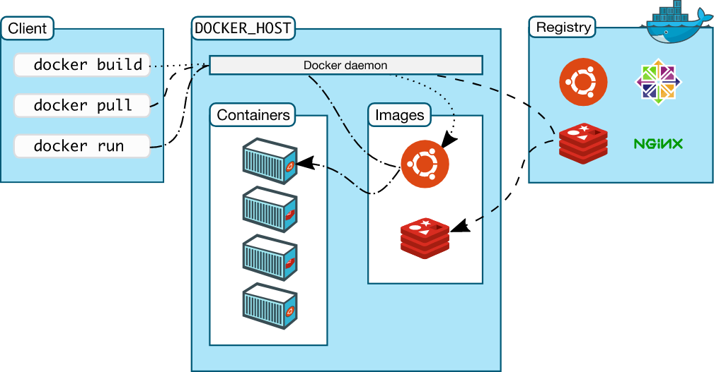
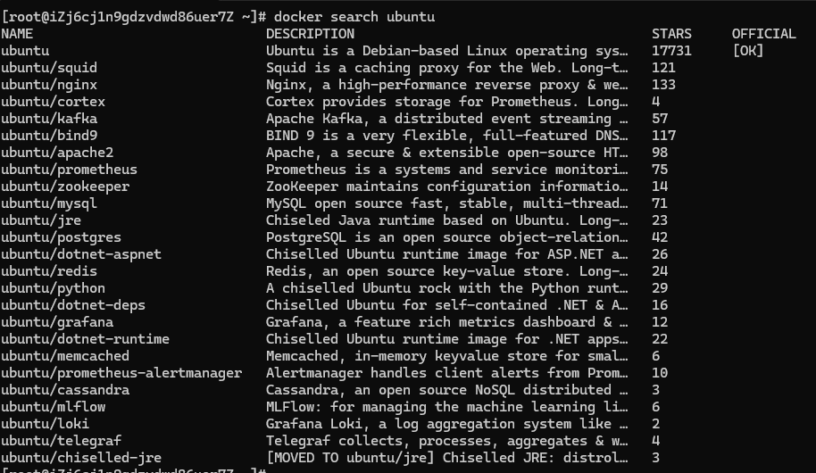
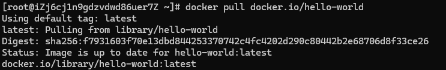
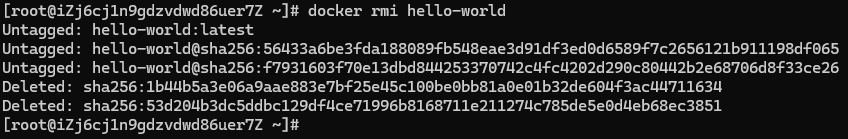

## 一、目前现状
### 1.1 部署软件的问题
- 如果想让软件运行起来要保证操作系统的设置，各种库和组件的安装都是正确的，这样软件才能运行起来，否则就会报错，导致部署失败。
- 热带鱼&冷水鱼 冷水鱼适应的水温在5-30度，而热带鱼只能适应22-30度水温，低于22度半小时就冻死了。

### 1.2 虚拟机
虚拟机(virtualmachine)就是带环境安装的一种解决方案。它可以在一种操作系统里面运行另一种操作系统。
**虚拟机缺点：**
1. 资源占用多 
2. 冗余步骤多 
3. 启动慢

### 1.3 Linux容器
- 由于虚拟机存在这些缺点，Linux 发展出了另一种虚拟化技术:Linux容器(LinuxContainers，缩写为 LXC)。
- Linux 容器不是模拟一个完整的操作系统，而是对进程进行隔离。或者说，在正常进程的外面套了一个保护层。对于容器里面的进程来说，它接触到的各种资源都是虚拟的，从而实现与底层系统的隔离。
**Linux容器：**
1. 启动快
2. 资源占用少
3. 体积小

### 1.4 Docker是什么
> Docker 属于 Linux 容器的一种封装，提供简单易用的容器使用接口。它是目前最流行的 Linux 容器解决方案。Docker 将应用程序与该程序的依赖，打包在一个文件里面。运行这个文件，就会生成一个虚拟容器。程序在这个虚拟容器里运行，就好像在真实的物理机上运行一样。

### 1.5 Docker和KVM
- **启动时间：**
1. Docker秒级启动。
2. KVM分钟级启动。

- **轻量级 容器镜像通常以M为单位，虚拟机以G为单位，容器资源占用小，要比虚拟要部署更快速**
1. 容器共享宿主机内核，系统级虚拟化，占用资源少，容器性能基本接近物理机。
2. 虚拟机需要虚拟化一些设备，具有完整的0S,虚拟机开销大，因而降低性能，没有容器性能好。

- **安全性：**
1. 由于共享宿主机内核，只是进程隔离，因此隔离性和稳定性不如虚拟机，容器具有一定权限访问宿主机内核，存在
一下安全隐患。

## 二、Docker应用场景
下面我将从一张思维导图来简述Docker的应用场景。
```shell
Docker 应用场景
│
├── 1. 单项目打包
│      ├── Node 项目 → 打包为 image → 在任何服务器运行
│      ├── Python Flask/Django → 打包后无需再 pip install
│      ├── Vue/React → 使用 Nginx 镜像托管静态资源
│      └── 示例：
│          "前端项目打包成镜像（镜像中包含环境依赖），只需 docker run 就能跑，不再需要安装 Node、Nginx"
│
├── 2. 整套项目打包（多容器组合）
│      ├── docker-compose 管理整套服务
│      ├── 示例组合：
│      │      ├── Nginx + Node + Redis + MySQL
│      │      ├── Sentry 全套
│      │      ├── GitLab + Runner
│      └── 示例：
│          "比如一个sentry服务，存在多个容器，如果单独起每一个容器就很麻烦，此时只需要一条命令 docker-compose up，让整套服务一起跑起来"
│
├── 3. 新开源技术实验环境
│      ├── 不污染主机环境
│      ├── 想试新 DB、新搜索引擎直接拉镜像
│      ├── 典型示例：
│      │      ├── MongoDB
│      │      ├── ElasticSearch
│      │      ├── ClickHouse
│      │      ├── RabbitMQ / Kafka
│      │      └── MinIO
│      └── 示例：
│          "不用安装 ES，直接 docker run elasticsearch 一次搞定"
│
├── 4. 环境一致性（Environment Consistency）
│      ├── 所有环境都统一为镜像：dev/test/uat/prod
│      ├── 不会出现 "我这能跑，你那不能"
│      ├── 解决的问题：
│      │      ├── Node 版本不一致
│      │      ├── Python 依赖不一致
│      │      ├── 系统版本不一致
│      └── 示例：
│          "团队所有人用同一个镜像，不会出现版本问题"
│
├── 5. 持续集成 CI/CD
│      ├── CI 环境里运行镜像，无需重新搭建依赖
│      ├── GitHub Actions / GitLab CI / Jenkins 常用方式：
│      │      ├── build 镜像
│      │      ├── push 到 registry
│      │      ├── 服务器拉取镜像
│      │      └── run 容器部署新版本
│      └── 示例：
│          "代码 push → 自动构建 docker image → 自动部署"
│
├── 6. 微服务
│      ├── 每个服务一个镜像：拆成多个 container
│      ├── 微服务组合常见：
│      │      ├── 用户服务
│      │      ├── 支付服务
│      │      ├── 文件服务
│      │      └── AI 模型服务
│      └── 示例：
│          "一个大项目拆成多个小容器，独立更新互不影响，这里就可以以sentry为例，拆分成多个服务"
│
└── 7. 弹性伸缩（Kubernetes）
       ├── Docker + K8s 自动扩容/缩容
       ├── 流量高 → 自动多开几个容器
       ├── 流量低 → 自动减少容器数量
       ├── 常见示例：
       │      ├── 电商大促
       │      ├── 高峰期秒杀
       │      └── 在线 AI 推理（LLM Service）
       └── 示例：
           "K8s 自动扩容 Node 服务，提高性能"
```

## 三、Docker架构

上图所示，三个流程可以概述完整的Docker执行流程：
- **docker build：** 构建镜像。
- **docker pull：** 拉取镜像。
- **docker run：** 运行容器。

## 四、Docker安装
### 4.1 安装Docker
```shell
# 安装 Docker
yum install -yyum-utils device-mapper-persistent-data lvm2
yum-config-manager --add-kepo https://download.docker.com/linux/centos/aocker-ce.repo
yum install docker-ce docker-ce-cli containerd.io -y
```

### 4.2 启动
```shell
systemctl start docker
```

### 4.3 查看docker版本
```shell
docker version
docker info
```

## 五、Docker镜像
> 下面我用前端开发者的视角，将告诉你镜像是什么、如何理解、它在前端项目中的典型使用场景。一句话总结：Docker 镜像 = 前端项目可运行环境 + 你的代码 + 所需依赖的“只读快照”。如果把 Docker 容器比作“正在运行的应用”，那么镜像就是它的“安装包模板”。

### 5.1 镜像的核心特性（前端视角理解）
#### 5.1.1 分层结构
每一个镜像由一层层叠加而成，每层只会存储变化部分，例如：
| 镜像层       | 内容举例（前端项目）                     |
| --------- | ------------------------------ |
| OS 基础层    | Linux、Alpine                   |
| Runtime 层 | Node 18 / Bun / PNPM           |
| 项目依赖层     | `node_modules`（通过 `npm ci` 编译） |
| 构建层       | `dist/`（通过 Vite 打包）            |
| 应用层       | 你的应用源代码                        |

📌 优势：复用性极强
比如多个前端项目都基于 Node 18，只需下载一次 Node 层即可。

#### 5.1.2 只读
镜像是不可修改的，运行起来后才变成容器。
这意味着：
- 你本地打包好的前端产物（dist）不会被改动。
- 发布时环境是固定不变的。
- 能保证 CI/CD、测试、预发、生产都是同一份环境

#### 5.1.3 可移植
镜像带着运行环境，因此：
- 不管是 Windows、Linux。
- 不管是阿里云、腾讯云、GitHub Actions、Lenovo 内网服务器。
- 不管你本地装不装 Node
只要能跑 Docker，都能跑相同的应用。

### 5.2 镜像的指令
#### 5.2.1 查看本地镜像
```shell
docker images ls
```
**输出结果：**

| 字段             | 含义                                | 类比前端                                                |
| -------------- | --------------------------------- | --------------------------------------------------- |
| **REPOSITORY** | 镜像所属的仓库名称，表示镜像“是什么”。              | 等同于 npm 包名，如 `vue`, `react`, `element-plus`         |
| **TAG**        | 镜像的版本标记，不同 TAG 代表同一仓库的不同版本。       | 类似 `npm` 包版本号，如 `vue@3.4.0`、`react@18.2.0`          |
| **IMAGE ID**   | 镜像经过内容 hash 后得到的唯一 ID，用于唯一标识镜像内容。 | 类似打包后文件的 hash，如 `app.8f3c2.js`，或 Git commit hash    |
| **CREATED**    | 镜像创建时间，说明该镜像是什么时候构建出来的。           | 类似构建产物的打包时间，或版本发布时间                                 |
| **SIZE**       | 镜像占用的磁盘大小。                        | 类似 dist 目录/打包输出体积，比如 `npm build` 后生成的 `bundle size` |

#### 5.2.2 查找镜像
```shell
docker search ubuntu
```
**输出结果：**

| 字段              | 含义                             | 类比前端                                           |
| --------------- | ------------------------------ | ---------------------------------------------- |
| **NAME**        | 镜像仓库名（包含命名空间）                  | 就像 npm 包名：比如 `element-plus`, `vue/cli-service` |
| **DESCRIPTION** | 该镜像的简介，告诉你镜像是干啥的               | 类似 npm 包的 README 简介                            |
| **STARS**       | 社区对该镜像的点赞数量，越多代表越受欢迎、越稳定       | 类似 npm 下载量 download counts（人气指标）               |
| **OFFICIAL**    | 是否为 Docker 官方维护的镜像，用 `[OK]` 表示 | 类似 npm 官方包，如 `@vue/*`、`@babel/*`               |

#### 5.2.3 拉取镜像
```shell
docker pull docker.io/hello-world
```
**输出结果：**

- `docker image pull`是抓取 `iamge` 文件的命令。
- `docker.io/hello-world`是 `image` 文件在仓库里面的位置，其中 `dockerio`是`image`的作者，`hello-world`是`image` 文件的名字。
- `Docker` 官方提供的 `image` 文件，都放在 `docker.io` 组里面，所以它的是默认组，可以省略为 `docker image pull hello-world`。

#### 5.2.4 删除镜像
```shell
docker rmi hello-world
```

`Docker` 无法删除镜像，因为当前有容器正在使用这个镜像。所以需要先删除使用该镜像的容器，才能删除镜像。

`Docker Hub` = `Docker` 生态的 `npmjs.com`。地址为：`https://hub.docker.com/`