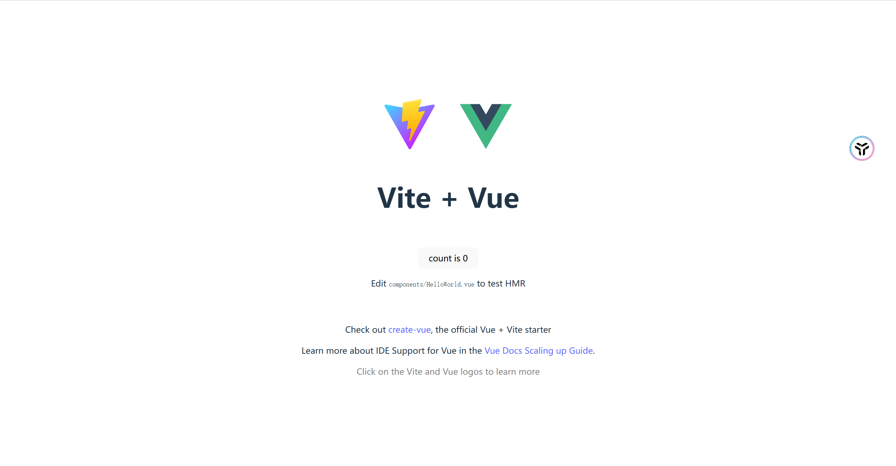
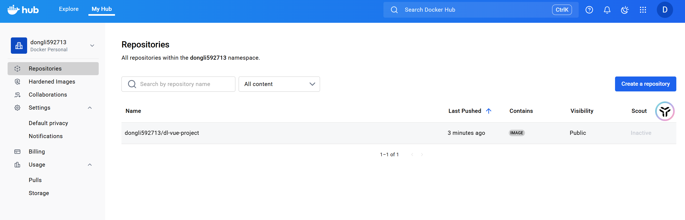

## 一、为什么前端也要学会自定义 Docker 镜像
从前端视角，一般会经历这样的阶段：
- **第一阶段：** 写页面、调接口，本地`npm run dev`就完事。
- **第二阶段：** 开始关心构建、打包、发布（CI/CD、环境变量）。
- **第三阶段：** 要把前端项目“装进一个盒子”，让运维一键部署 → 这个盒子就是 `Docker` 镜像。

### 1.1 Docker镜像对前端的意义
- ✅ 把构建好的前端静态资源 + `nginx` 环境一起打包。
- ✅ “到哪儿都能跑”，不用再解释：“要先装 `Node`，要 `npm install`，要改 `nginx.conf...`”。
- ✅ 一次打包，多环境复用：测试 / 预发布 / 生产，只要拉同一个镜像。

对前端来说，你可以把 **自定义镜像 + 推送远程** 理解为：
- `npm run build` ➜ 得到产物（`dist`）。
- `docker run build` ➜ 得到产物的“运行时盒子”（镜像）。
- `docker push` ➜ 把这个盒子推送到远程仓库。
- `docker pull` ➜ 拉取镜像，`docker run` 运行。

### 1.2 以一个前端项目为例，整体流程图为：
```shell
                   写项目源码
               (src/, App.vue, main.ts)
                         │
                         ▼
         ┌─────────────────────────────────┐
         │  写 Dockerfile                  │
         │  (像 vite/webpack 的构建配置)    │
         └─────────────────────────────────┘
         
                         │
                         ▼
     ┌─────────────────────────────────────────┐
     │ docker build                            │
     │ = 把项目打包成一个“可运行的盒子”          │
     │ (类似 npm run build 生成 dist/)         │
     └─────────────────────────────────────────┘
                         │
                         ▼
     ┌─────────────────────────────────────────┐
     │ docker run                              │
     │ = 本地预览部署效果 (类似本地预览 prod 版本) │
     └─────────────────────────────────────────┘
                         │
                         ▼
     ┌─────────────────────────────────────────┐
     │ docker tag                              │
     │ = 给镜像起一个远程仓库能识别的名字       │
     │   例: donglisuccess/app:1.0.0           │
     └─────────────────────────────────────────┘
                         │
                         ▼
     ┌─────────────────────────────────────────┐
     │ docker login → docker push              │
     │ = 推送到镜像仓库 (如同 npm publish)     │
     └─────────────────────────────────────────┘
                         │
                         ▼
     ┌─────────────────────────────────────────┐
     │ 服务器 docker pull → docker run         │
     │ = 项目上线 (一键运行，无需配置环境)      │
     └─────────────────────────────────────────┘

```

## 二、Dockerfile 主要指令总结
### 2.1 FROM —— 继承基础镜像
```dockerfile
FROM node:18-alpine
```
> 前端类比：相当于 “选择一个基础运行环境”，比如选择 Node18，并且是轻量级的 alpine 系统。Dockerfile 一定从 FROM 开始。

### 2.2 WORKDIR —— 设置工作目录
```dockerfile
WORKDIR /app
```
> 类比；进入项目根目录（cd /app）。后续所有命令都在 /app 下执行。

### 2.3 COPY —— 把本地文件复制进镜像
```dockerfile
COPY . .
COPY package*.json ./
```

### 2.4 RUN —— 构建时执行命令
```dockerfile
RUN npm install
RUN npm run build
```
> 在构建镜像过程中执行一次性的命令，就像在流水线上执行“安装依赖”“打包”等步骤。

### 2.5 EXPOSE —— 声明容器端口
```dockerfile
EXPOSE 3000
```
>告诉别人镜像里运行的应用监听哪个端口（例如 nginx 默认 80）。

### 2.6 CMD —— 容器启动时执行的命令
```dockerfile
CMD npm start
```
`CMD` 和 `RUN` 的区别？
| 指令  | 什么时候执行  | 类比                                 |
| --- | ------- | ---------------------------------- |
| RUN | 构建镜像时执行 | 构建阶段执行：npm install / npm run build |
| CMD | 容器运行时执行 | 运行阶段执行：启动 nginx、启动 node 服务         |

### 2.7 多阶段构建
最关键的一步：
```dockerfile
FROM node:18 AS build
# 构建dist

FROM nginx:alpine
COPY --from=build /app/dist /usr/share/nginx/html
```
> 构建和运行用不同镜像：构建阶段用 node，运行阶段用 nginx，最终镜像更小、更快、更安全。

## 三、自定义Docker镜像实战。
### 3.1 准备一个简单前端项目
这里以 Vite + Vue 为例（React、Nuxt、Next 换成自己的也没问题）：
```shell
# 创建项目
npm create vite@latest my-vue-app -- --template vue
cd my-vue-app

# 安装依赖
npm install

# 本地开发
npm run dev

# 构建产物
npm run build
# -> 默认生成 dist/ 目录
```
**这里存在一个问题：**
在服务器使用`npm run dev`的时候，会监听`5173`端口，但是可能我们在本地机器上访问不到这个服务。
可能的原因是**防火墙限制**，此时需要执行:
```shell
npm run dev -- --host 0.0.0.0 --port 5173
```
并且需要到阿里云服务器上增加一条**防火墙**的规则，保证`5173`端口是可以对外访问的。

**生产环境部署的本质：**
- 构建后得到 纯静态文件：`dist/index.html`, `dist/assets/...`。
- 只需要一个 静态文件服务器（`nginx` / `http-server`）就能跑。

我们要做的 `Docker` 镜像，其实就是：
内部自带一个 `nginx`， 并且把你的 `dist` 文件复制进去，在 `/usr/share/nginx/html` 下静态服务。

### 3.2 编写Dockerfile文件
> 这里需要注意：/app标识镜像中的目录，后面COPY第二个参数(./)都是基于/app这个目录进行的。
```dockerfile
# Dockerfile

########################
# 第一阶段：构建前端代码
########################
FROM node:node:20.19.6-slim AS build-stage

# 设置工作目录（类似 cd）
WORKDIR /app

# 先复制 package*.json，加快缓存利用
COPY package*.json ./

# 安装依赖
RUN npm install

# 再复制源代码
COPY . .

# 构建前端产物
RUN npm run build

########################
# 第二阶段：用 nginx 作为静态服务器
########################
FROM nginx:1.27-alpine AS production-stage

# 删除默认 nginx 静态资源
RUN rm -rf /usr/share/nginx/html/*

# 从上一阶段复制 dist 到 nginx 静态目录
COPY --from=build-stage /app/dist /usr/share/nginx/html

# 暴露 80 端口（给别人看：“我会在 80 端口监听”）
EXPOSE 80

# nginx 默认启动命令已经在基础镜像里写好了
# 所以这里可以不写 CMD，使用镜像默认的启动方式
```

### 3.3 新增 .dockerignore 文件
```shell
# .dockerignore

# 忽略 node_modules
node_modules

# 忽略 git 信息
.git

# 忽略构建产物
dist

# 忽略 Dockerfile
Dockerfile
```

### 3.4 构建镜像
```shell
# 构建镜像
docker build -t my-vue-app:1.0.0 .

# 查看镜像
docker images

# 查看镜像详情
REPOSITORY            TAG       IMAGE ID       CREATED          SIZE
dl-vue-project        1.0.0     fc6472705f35   11 minutes ago   48.3MB
nginx                 dev       60adc2e137e7   11 days ago      152MB
nginx                 latest    60adc2e137e7   11 days ago      152MB
verdaccio/verdaccio   latest    7eb7f4f0ff8e   2 months ago     200MB
```

### 3.5 运行镜像
```shell
# 运行镜像
docker run -p 8080:80 my-vue-app:1.0.0

# 访问 http://localhost:8080
# 访问输出日志：
[root@iZj6cj1n9gdzvdwd86uer7Z docker-hub]# curl http://localhost:8080
<!doctype html>
<html lang="en">
  <head>
    <meta charset="UTF-8" />
    <link rel="icon" type="image/svg+xml" href="/vite.svg" />
    <meta name="viewport" content="width=device-width, initial-scale=1.0" />
    <title>dl-vue-project</title>
    <script type="module" crossorigin src="/assets/index-ZApqOqr6.js"></script>
    <link rel="stylesheet" crossorigin href="/assets/index-CIkLTZfM.css">
  </head>
  <body>
    <div id="app"></div>
  </body>
</html>
```
并且此时在本地通过浏览器访问`ip:port`，也可以访问。


### 3.6 发布到 Docker Hub
登录 Docker Hub
```shell
# 登录 Docker Hub
docker login
```

打标签

```shell
# 第一个参数是本地源的镜像名称和版本号，第二个是Docker Hub的用户名/镜像名:版本号
docker tag my-vue-app:1.0.0 dl-vue-project/my-vue-app:1.0.0

# 查看镜像
[root@iZj6cj1n9gdzvdwd86uer7Z docker-hub]# docker images
REPOSITORY                    TAG       IMAGE ID       CREATED          SIZE
dongli592713/dl-vue-project   1.0.0     fc6472705f35   21 minutes ago   48.3MB
dl-vue-project                1.0.0     fc6472705f35   21 minutes ago   48.3MB
nginx                         dev       60adc2e137e7   11 days ago      152MB
nginx                         latest    60adc2e137e7   11 days ago      152MB
verdaccio/verdaccio           latest    7eb7f4f0ff8e   2 months ago     200MB
```

推送
```shell
docker push dl-vue-project/my-vue-app:1.0.0

# 输出日志
[root@iZj6cj1n9gdzvdwd86uer7Z docker-hub]# docker push dongli592713/dl-vue-project
Using default tag: latest
The push refers to repository [docker.io/dongli592713/dl-vue-project]
tag does not exist: dongli592713/dl-vue-project:latest
[root@iZj6cj1n9gdzvdwd86uer7Z docker-hub]# dongli592713/dl-vue-project:1.0.0
-bash: dongli592713/dl-vue-project:1.0.0: No such file or directory
[root@iZj6cj1n9gdzvdwd86uer7Z docker-hub]# docker push dongli592713/dl-vue-project:1.0.0
The push refers to repository [docker.io/dongli592713/dl-vue-project]
dfc2e7774e09: Pushed
4dfcfc3d5655: Pushed
0d853d50b128: Mounted from library/nginx
947e805a4ac7: Mounted from library/nginx
811a4dbbf4a5: Mounted from library/nginx
b8d7d1d22634: Mounted from library/nginx
e244aa659f61: Mounted from library/nginx
c56f134d3805: Mounted from library/nginx
d71eae0084c1: Mounted from library/nginx
08000c18d16d: Mounted from library/node
1.0.0: digest: sha256:66828c6d64ccbbce4d390e1c5f2c359c4a2c7cba0ca5b61449f5bcd8acd86ec2 size: 2405
```
此时在我们仓库的远程就会存在`dl-vue-project:1.0.0`这个镜像了。


### 3.7 远程部署
现在我把服务器上面的镜像删除了,然后重新拉取远程的镜像。

**查看目前镜像**

```shell
docker images

# 输出日志
REPOSITORY                    TAG       IMAGE ID       CREATED          SIZE
dongli592713/dl-vue-project   1.0.0     fc6472705f35   27 minutes ago   48.3MB
dl-vue-project                1.0.0     fc6472705f35   27 minutes ago   48.3MB
nginx                         dev       60adc2e137e7   11 days ago      152MB
nginx                         latest    60adc2e137e7   11 days ago      152MB
verdaccio/verdaccio           latest    7eb7f4f0ff8e   2 months ago     200MB
```

**查看当前运行容器**

```shell
docker ps

# 输出日志
CONTAINER ID   IMAGE                  COMMAND                  CREATED          STATUS          PORTS                                   NAMES
c0ed740ca2b0   dl-vue-project:1.0.0   "/docker-entrypoint.…"   19 minutes ago   Up 19 minutes   0.0.0.0:8080->80/tcp, :::8080->80/tcp   intelligent_joliot
```

**停止容器**
```shell
docker stop c0ed740ca2b0
```

**删除容器**
```shell
docker rm c0ed740ca2b0
```

**删除镜像**
```shell
docker rmi dl-vue-project:1.0.0 dongli592713/dl-vue-project:1.0.0

# 输出日志
Untagged: dl-vue-project:1.0.0
Untagged: dongli592713/dl-vue-project:1.0.0
Untagged: dongli592713/dl-vue-project@sha256:66828c6d64ccbbce4d390e1c5f2c359c4a2c7cba0ca5b61449f5bcd8acd86ec2
Deleted: sha256:fc6472705f351a56066c43eca36d78f3376b1f6318f023a6d513249106d4e989
```

**再次查看服务器上镜像**
```shell
docker images

# 输出日志
REPOSITORY            TAG       IMAGE ID       CREATED        SIZE
nginx                 dev       60adc2e137e7   11 days ago    152MB
nginx                 latest    60adc2e137e7   11 days ago    152MB
verdaccio/verdaccio   latest    7eb7f4f0ff8e   2 months ago   200MB
```

**自此,本地已经不存在我们构建的镜像了**

**远程拉取镜像**
```shell
docker pull dongli592713/dl-vue-project:1.0.0
```

**查看当前镜像**
```shell
docker images

# 输出日志
REPOSITORY                    TAG       IMAGE ID       CREATED          SIZE
dongli592713/dl-vue-project   1.0.0     fc6472705f35   35 minutes ago   48.3MB
nginx                         dev       60adc2e137e7   11 days ago      152MB
nginx                         latest    60adc2e137e7   11 days ago      152MB
verdaccio/verdaccio           latest    7eb7f4f0ff8e   2 months ago     200MB
```

**运行容器**
```shell
docker run -d -p 8080:80 dongli592713/dl-vue-project:1.0.0
```

**查看运行容器当前容器**
```shell
docker ps

# 输出日志
CONTAINER ID   IMAGE                               COMMAND                  CREATED         STATUS         PORTS                                   NAMES
17e75c934c23   dongli592713/dl-vue-project:1.0.0   "/docker-entrypoint.…"   8 seconds ago   Up 7 seconds   0.0.0.0:8080->80/tcp, :::8080->80/tcp   boring_ganguly
```