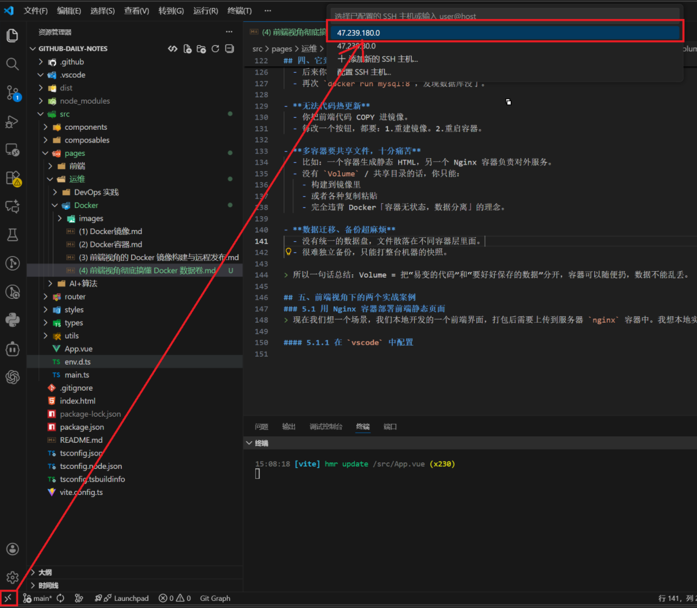
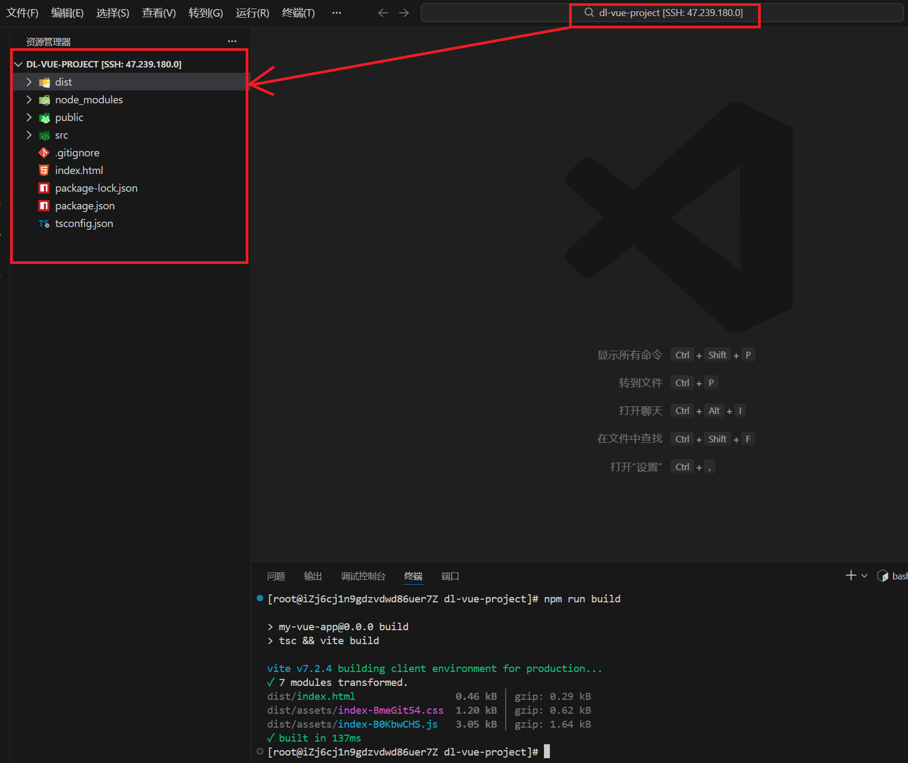

## 一、是什么？—— 先搞清楚 Docker 里「数据」到底放哪

### 1.1 容器里的文件系统长什么样？
Docker 容器的文件系统可以简单理解为：
- **镜像层（只读）：** 类似`node:18`、`nginx:latest` 这类镜像，本质是一堆只读的文件层。
- **容器层（可写）：** 当你 `docker run` 之后，会在镜像上再叠加一层【可写层】，容器里的一切修改默认都写在这里。

**重点：** 容器层是临时的，容器删了，这层就没了。

所以如果你在容器中执行如下操作
- 在容器中执行 `npm install`。
- 在容器中写日志。
- 在容器存用户上传文件。

只要没用 `Volume` 挂载目录，这些东西都会随着容器被删除而消失。

### 1.2 数据盘 / Volume 是什么？
从 `Docker` 角度，一般有两种盘。
- **Docker Volume（数据卷）：** 由 `Docker` 管理的一块持久化存储，有自己的名字，比如 `my-data`, 存在宿主机上（但路径交给 Docker 管理），可以被多个容器挂载。
- **Bind mount （挂载宿主机目录（你可以理解为“手动数据盘”）：** 直接把宿主机上的一个目录挂进容器，比如：`/root/project:/app` 。典型用途：开发环境，把本地代码目录挂进去容器内，`npm run dev` 热更新。

> 对前端开发来说：Volume 更像是「数据库 / 缓存 / 上传文件」的专用硬盘。Bind mount 更像是「把本地项目目录直接作为容器里的代码目录」。

## 二、有啥用？——为什么必须学会 Volume
从前端视角看，Docker 的 Volume 主要解决这些事：

- **持久化数据：** 
  - `MySQL / Redis / Mongo 数据`。
  - 应用日志、上传文件。
  - 一句话：容器删了，数据不能跟着陪葬。

- **多容器共享数据：**
  - 一个容器负责写日志 / 导出文件。
  - 另一个容器负责读取日志 / 导入文件。
  - 一句话：多个容器共享同一份数据。

- **开发环境的“热更新 + 隔离”**
  - 代码仍在本机（方便编辑）。
  - `Node` / `Nginx` 在容器里（隔离环境，避免“我电脑可以你电脑不行”）。
  - 通过挂载把本地代码映射进容器，做到一边写代码一边 `npm run dev`。

- **方便迁移和备份：**
  - Volume 可以很方便打包成 tar 压缩，迁移到另一台服务器。
  - 对生产环境来说：换服务器不等于清库跑路。

## 三、怎么操作？——— 常用指令速查
### 3.1 Volume 基本操作
**创建 Volume**
```shell
docker volume create my-data
```

**查看 Volume列表**
```shell
docker volume ls
```

**查看某个Volume详情**
```shell
docker volume inspect dl-data

# 详情
[
    {
        "CreatedAt": "2025-12-02T13:37:09+08:00",
        "Driver": "local",
        "Labels": null,
        "Mountpoint": "/var/lib/docker/volumes/dl-data/_data",
        "Name": "dl-data",
        "Options": null,
        "Scope": "local"
    }
]
```

**删除 Volume**
```shell
docker volume rm my-data
```
**小坑：正在被容器使用的 Volume 无法直接删，要先停掉并删除相关容器。**

### 3.2 在 `docker run` 中使用 `volume`
**使用 -v**
```shell
docker run -d --name my-mysql -v dl-data:/var/lib/mysql mysql:8
```
**解释：**
- `dl-data`：刚刚创建的 `Volume` 的名称。
- `/var/lib/mysql`：容器内的 `mysql` 数据存放目录。
- 结果：`mysql` 写的数据都会进到 `my-data` 这个 `Volume` 里。

所以此时执行完成后，如果将 `dl-data` 这个 `volume` 给删除了，就会报错，因为存在`my-mysql` 这个容器在使用这个`volume`。请看如下我的控制台**指令** 和 **日志**
```shell
[root@iZj6cj1n9gdzvdwd86uer7Z ~]# docker volume rm dl-data
Error response from daemon: remove dl-data: volume is in use - [485376decc45a6924bab06f75996bbebce94d55cdc09ed5cbe88e9e06afe1737]
[root@iZj6cj1n9gdzvdwd86uer7Z ~]# docker ps -a
CONTAINER ID   IMAGE                               COMMAND                  CREATED         STATUS                     PORTS                                   NAMES
485376decc45   mysql:8                             "docker-entrypoint.s…"   7 minutes ago   Exited (1) 6 minutes ago                                           my-mysql
```

**用 --mount（更啰嗦但更清晰）**
```shell
docker run -d --name my-mysql --mount source=my-data,target=/var/lib/mysql  mysql:8
```

### 3.3 挂载宿主机目录
**`-v` 宿主机路径:容器路径**
```shell
docker run -it -v /root/docker-volume/volume-test:/app -w /app node:18 /bin/bash
```

**解释：**
- `D:/projects/my-vue-app`: 你本地 Vue 项目目录
- `/app`: 容器里的工作目录
- `-w /app`: 进入容器时默认在 `/app` 目录下

**用 `--mount`**
```shell
docker run -it --mount type=bind,source=/root/docker-volume/volume-test,target=/app -w /app node:18 /bin/bash
```

## 四、它到底解决了什么问题？（从“没用 Volume”说起）
假设你不用 Volume / 挂载目录，会遇到一堆坑：
- **容器删了，数据全没：** 
  - 你跑了一个 `MySQL` 容器，里面建好了数据库。
  - 后来你 `docker rm -f mysql`
  - 再次 `docker run mysql:8`，发现数据库没了。

- **无法代码热更新**
  - 你把前端代码 COPY 进镜像。
  - 每改一个按钮，都要：1.重建镜像。2.重启容器。

- **多容器要共享文件，十分痛苦**
  - 比如：一个容器生成静态 HTML，另一个 Nginx 容器负责对外服务。
  - 没有 `Volume` / 共享目录的话，你只能：
    - 构建到镜像里
    - 或者各种复制粘贴
    - 完全违背 Docker「容器无状态，数据分离」的理念。
  
- **数据迁移、备份超麻烦**
  - 没有统一的数据盘，文件散落在不同容器层里面。
  - 很难独立备份，只能打整台机器的快照。

> 所以一句话总结：Volume = 把“易变的代码”和“要好好保存的数据”分开，容器可以随便扔，数据不能乱丢。

## 五、前端视角下的两个实战案例
### 5.1 用 Nginx 容器部署前端静态页面
> 现在我们想一个场景，我们本地开发的一个前端界面，打包后需要上传到服务器 `nginx` 容器中。我想本地实时打包，直接地址就可以立即更新。

#### 5.1.1 在 `vscode` 中配置

在`vscode`中直接连接远程目录。

#### 5.1.2 创建前端项目

如上图，所示我在`vscode`中打开我在服务器端创建的一个`vue` 项目。

#### 5.1.3 创建 `nginx` 容器
```shell
docker run -d --name vue-project-nginx -p 8000:80 --mount type=bind,source=/root/dl-vue-project/dist,target=/usr/share/nginx/html nginx:latest
```

#### 5.1.4 执行改动
```shell
npm run build
```

#### 5.1.5 访问域名
直接浏览器访问 `http://47.239.180.0:8080`。

### 5.2 MySQL + Volume：删除容器数据仍在
#### 5.2.1 创建 `Volume`
```shell
docker volume create mysql-data
```

### 5.2.2 启动 `MySQL`，挂载 `Volume`
```shell
docker run -d --name dev-mysql -e MYSQL_ROOT_PASSWORD=123456 -p 3306:3306 -v mysql-data:/var/lib/mysql mysql:

```

#### 5.2.3 进入 `dev-mysql` 容器中
```shell
docker exec -it dev-mysql /bin/bash
```

#### 5.2.4 进入 `mysql` 中
```shell
mysql -u root -p
```

#### 5.2.5 创建 `students` 表
```sql
CREATE TABLE students (
    id INT AUTO_INCREMENT PRIMARY KEY,
    name VARCHAR(50) NOT NULL,
    age INT CHECK (age >= 0 AND age <= 150),
    email VARCHAR(100) UNIQUE,
    enrollment_date DATE DEFAULT (CURRENT_DATE)
);
```

#### 5.2.6 向 `students` 表中增加数据
```sql
INSERT INTO students (name, age, email) VALUES
('张三', 20, 'zhangsan@example.com'),
('李四', 19, 'lisi@example.com'),
('王五', 21, 'wangwu@example.com'),
('赵六', 18, 'zhaoliu@example.com'),
('钱七', 22, 'qianqi@example.com');
```

#### 5.2.7 查询数据库
```shell
mysql> SELECT * FROM students;
+----+------+------+----------------------+-----------------+
| id | name | age  | email                | enrollment_date |
+----+------+------+----------------------+-----------------+
|  1 |      |   20 | zhangsan@example.com | 2025-12-02      |
|  2 |      |   19 | lisi@example.com     | 2025-12-02      |
|  3 |      |   21 | wangwu@example.com   | 2025-12-02      |
|  4 |      |   18 | zhaoliu@example.com  | 2025-12-02      |
|  5 |      |   22 | qianqi@example.com   | 2025-12-02      |
+----+------+------+----------------------+-----------------+
5 rows in set (0.00 sec)
```

#### 5.2.8 删除容器
```shell
[root@iZj6cj1n9gdzvdwd86uer7Z ~]# docker stop dev-mysql
dev-mysql
[root@iZj6cj1n9gdzvdwd86uer7Z ~]# docker rm dev-mysql
dev-mysql
```

#### 5.2.9 新建一个容器
```shell
docker run -d --name dev-mysql-2 -e MYSQL_ROOT_PASSWORD=123456 -p 3306:3306 -v mysql-data:/var/lib/mysql mysql:8
```

#### 5.2.10 进入容器，查询数据
```shell
docker exec -it dev-mysql-2 /bin/bash

# 登录mysql
mysql -u root -p

# mysql 中内容
mysql> USE school;
Reading table information for completion of table and column names
You can turn off this feature to get a quicker startup with -A

Database changed
mysql> SELECT * FROM students;
+----+------+------+----------------------+-----------------+
| id | name | age  | email                | enrollment_date |
+----+------+------+----------------------+-----------------+
|  1 |      |   20 | zhangsan@example.com | 2025-12-02      |
|  2 |      |   19 | lisi@example.com     | 2025-12-02      |
|  3 |      |   21 | wangwu@example.com   | 2025-12-02      |
|  4 |      |   18 | zhaoliu@example.com  | 2025-12-02      |
|  5 |      |   22 | qianqi@example.com   | 2025-12-02      |
+----+------+------+----------------------+-----------------+
5 rows in set (0.00 sec)
```