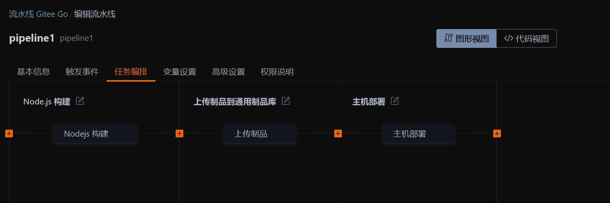
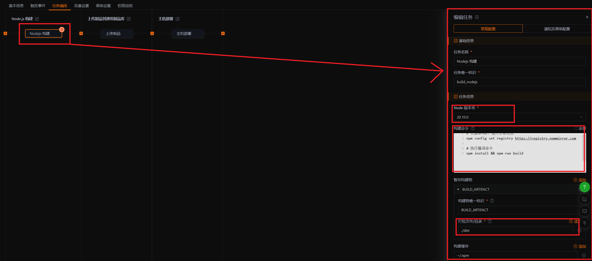
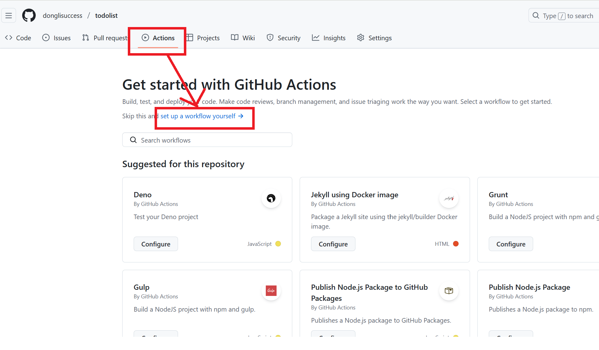

## 一、背景
> 在最初搭建个人博客时，我选择将仓库托管在 Gitee，并利用其提供的免费自动化部署功能来构建和更新博客内容。对于早期需求而言，Gitee 的自动化能力和国内访问速度都能够满足日常使用。但是，随着博客内容的增加和更新频率的提升，Gitee 提供的 200 分钟/月自动化构建限制 开始成为瓶颈。每当部署流程执行较多或更新较频繁时，构建分钟数往往会提前耗尽，从而影响正常更新。此外，我也尝试将博客部署到自己的阿里云服务器上，但长期以来服务器的成本相对较高，并不适合用于静态博客这样轻量级的项目。在综合评估成本、稳定性以及后续维护后，我决定将博客迁移到 GitHub。对于静态网站而言，GitHub Pages 不仅能够提供稳定、免费的托管服务，同时搭配 GitHub Actions 也可以实现完整的 CI/CD 流程，没有分钟数限制，对于个人博客来说非常适合。
因此，本次迁移的主要目的在于：
- 降低服务器成本
- 解决 Gitee 自动化部署受限的问题
- 利用 GitHub Pages 的免费托管能力
- 借助 GitHub Actions 提升部署的灵活性与可持续性
下面我将从在gitee上部署项目发布到私有服务器上，以及在github上部署项目发布到github pages上，进行对比分析。

## 二、gitee部署项目
### 2.1 创建项目仓库
如下图所示，daily-notes是我创建的一个纯前端的一个项目。

### 2.2 选择【流水线】并创建流水线

### 2.3 配置流水线
#### 2.3.1 基本信息
基本信息填写该流水线的名称即可。

#### 2.3.2 触发事件
触发事件表示当前流水线触发的条件。

上图表示只要向master分支push代码即可触发流水线。
#### 2.3.3 任务编排
简单项目任务编排分为三个步骤：

- 1. node构建

node构建主要关注Node的版本号，构建命令，打包文件/目录即可。
构建物唯一标识，只要和上传打包制品一致就可以。
- 2. 上传打包制品

- 3. 主机部署

主机部署需要关注，【执行主机组】和【部署脚本】两个选项。如果不存在主机，则
点击【添加】->【新建主机组】-> 【自主导入】-> 填写完主机组基本信息后，再点击【添加linux主机】，导入方式采用通过命令逐台添加。点击【下一步】即可。

此时点击下一步，将这段代码在服务器上运行即可。

部署的脚本如下所示：
```bash
// 创建部署目录
mkdir -p /home/admin/ui-copilot
// 清空旧文件
rm -rf /home/admin/ui-copilot/*
// 解压制品（Gitee Go 会自动将 output 制品打包为 output.tar.gz）
tar zxvf ~/gitee_go/deploy/output.tar.gz -C /home/admin/ui-copilot
// 可选：设置权限
chmod -R 755 /home/admin/ui-copilot
echo '✅ Deployment completed!'
```
配置完成后点击保存，流水线即为配置完成了。
### 2.4 更改服务器上nginx
更改服务器上的nginx的主要目的是，为了让用户访问http:ip:80/的时候，可以访问到我们部署的项目。
nginx配置如下：
```sh
server {
  listen       80;
  listen       [::]:80;
  server_name  _;
  root         /home/admin/daily-notes/dist;

  # Load configuration files for the default server block.
  include /etc/nginx/default.d/*.conf;

  location / {
    limit_req zone=req_zone burst=3;
    try_files $uri $uri/ /index.html;
  }
}
```
## 三、在github上部署项目
### 3.1 配置流水线

增加如下配置：
```sh
name: Deploy Blog
on:
  push:
    branches:
      - main
jobs:
  build:
    runs-on: ubuntu-latest
    steps:
      - name: Checkout
        uses: actions/checkout@v3
      - name: Setup Node.js
        uses: actions/setup-node@v3
        with:
          node-version: 18
      - name: Install dependencies
        run: npm install
      - name: Build
        run: npm run build
      - name: Deploy to GitHub Pages
        uses: peaceiris/actions-gh-pages@v3
        with:
          github_token: ${{ secrets.GITHUB_TOKEN }}
          publish_dir: ./dist
```
这段脚本表示：只要向main分支push代码，就会触发流水线，流水线主要分为五个步骤：
- Checkout：检出代码
- Setup Node.js：安装node
- Install dependencies：安装依赖
- Build：构建项目
- Deploy to GitHub Pages：部署到github pages
### 3.2 配置github pages

点击【Settings】->【Pages】->【Source】-> 【github Actions】即可。