## 一、为什么要学 Jenkins？

在没有 Jenkins 之前，一个项目发布往往依赖人工执行：

```bash
git pull
npm install
npm run test
npm run build
```

然后再手动把构建产物部署到服务器。

这种方式在小项目里能用，但团队规模一大，就会出现几个问题：

- 效率低
- 容易误操作
- 流程不统一
- 缺少构建记录
- 问题发现太晚

真正危险的不是"命令多"，而是：

> 发布流程依赖人的记忆和操作。

CI/CD 要解决的，就是把这些重复、机械、容易出错的流程逐步**自动化、标准化、可追踪化**。

## 二、CI/CD 到底是什么？

### 1. CI：持续集成

CI 全称 **Continuous Integration**，中文是**持续集成**。

它的核心并不是"自动构建"，而是：

> 频繁集成代码，并尽早发现集成问题。

假设三个人分别开发：

- A → 登录模块
- B → 商品模块
- C → 支付模块

如果大家很久以后才一起合代码，很容易出现：

- 大量冲突
- 接口不一致
- 公共代码被改坏
- 项目无法构建

更合理的方式是：

```text
不断提交 → 不断集成 → 不断自动验证
```

例如：

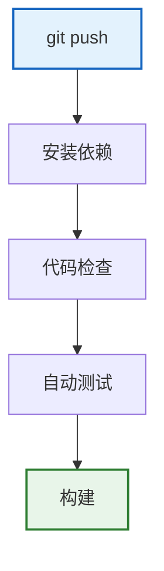

所以 CI 可以理解成：**频繁集成 + 自动验证**。

自动构建只是手段，尽早发现问题才是目标。

### 2. CD：持续交付与持续部署

CD 常见有两个含义。

**Continuous Delivery**，中文：**持续交付**。

表示代码经过自动构建、测试、打包后，始终处于"随时可以上线"的状态。

例如：

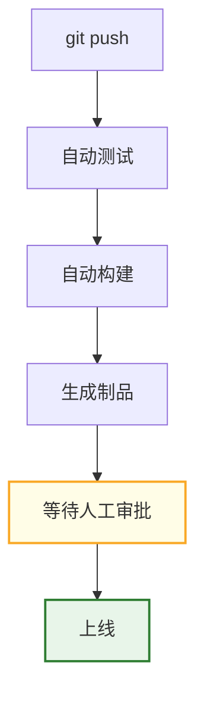

**Continuous Deployment**，中文：**持续部署**。

它比持续交付更进一步：

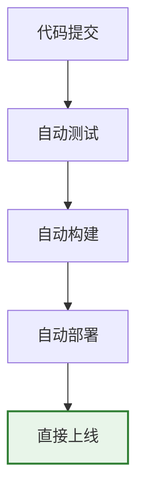

不再需要人工点击发布。

所以可以简单记：

| 概念                  | 一句话理解           |
| --------------------- | -------------------- |
| CI                    | 保证代码能安全集成   |
| Continuous Delivery   | 保证代码随时可以发布 |
| Continuous Deployment | 检查通过后自动上线   |

## 三、Jenkins 和 CI/CD 的关系

这里必须区分清楚：

```text
CI/CD ≠ Jenkins
```

CI/CD 是：**软件工程实践与流程思想**。

Jenkins 是：**实现 CI/CD 的自动化工具**。

Jenkins 本身可以帮我们完成：

- 拉代码
- 执行 Shell
- 测试
- 构建
- 打包
- 部署
- 记录日志
- 记录构建历史
- 管理凭据
- 触发任务

所以从底层看，Jenkins 很像：

> 一个能够自动调度和执行任务的平台。

但它不只是 Shell 脚本。

例如一个 `deploy.sh` 只能回答：

```text
具体怎么部署？
```

而 Jenkins 还能回答：

- 什么时候执行？
- 谁来执行？
- 在哪台机器执行？
- 失败怎么办？
- 执行记录在哪里？
- 谁有权限执行？
- 如何自动触发？

所以两者关系更像：

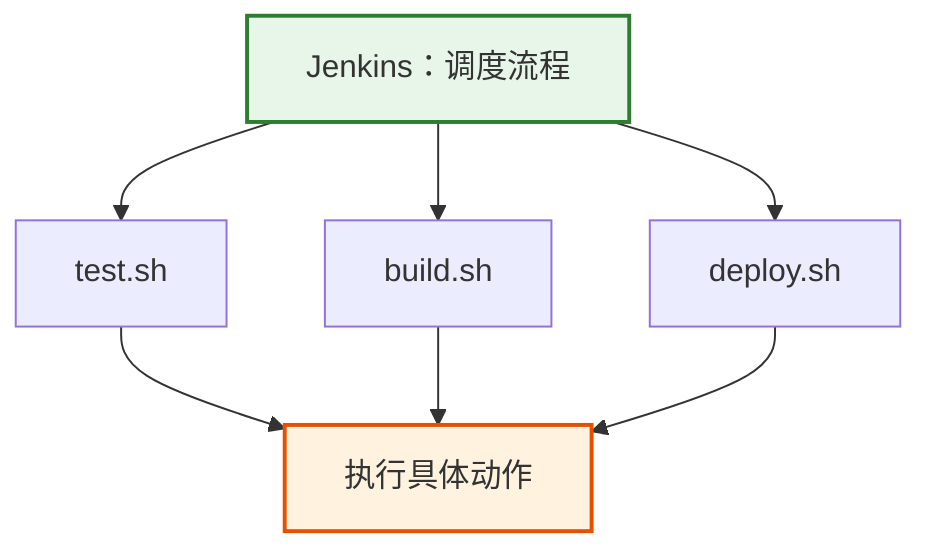

## 四、Jenkins 核心概念

这一章最重要的是把几个核心概念真正搞清楚。

### 1. Job

Job 可以理解成：**任务定义**。

例如 `frontend-build`，它里面可能定义：

```bash
npm install
npm run test
npm run build
```

这个整体就是一个 Job。

### 2. Build

Build 是：**Job 的一次具体执行**。

例如 `frontend-build` 这个 Job 会产生：

```text
Build #1
Build #2
Build #3
```

所以：

| 概念  | 含义         |
| ----- | ------------ |
| Job   | 任务模板     |
| Build | 一次执行记录 |

一个 Job 可以执行很多次 Build。

### 3. Workspace

Workspace 是：**Jenkins 执行 Job 时真正使用的工作目录**。

例如本次实战中：

```text
/var/jenkins_home/workspace/hello-jenkins
```

Jenkins 在这个目录里执行 `pwd`、`ls`、`echo`、`npm`、`git` 等命令。

以后如果出现 `package.json not found`，第一反应不应该直接认为 npm 坏了，而应该先检查：

```bash
pwd
ls -la
```

确认：

- 当前到底在哪？
- 代码有没有真的存在？

这也是 Jenkins 排错里非常重要的思路。

### 4. Queue

Queue 就是：**等待执行的 Build 队列**。

如果当前没有可用执行资源，Build 就会先进入 Queue。

### 5. Executor

Executor 可以理解成：**执行任务的并发槽位**。

例如某个 Agent 配置 `Executors = 2`，意味着最多同时执行 2 个 Build。

如果同时来了 5 个：

```text
2 个执行，3 个等待
```

### 6. Controller

Controller 是 Jenkins 的**管理和调度中心**。

它主要负责：

- 管理 Job
- 管理配置
- 创建 Build
- 管理 Queue
- 调度 Agent
- 提供 Web UI

可以理解成：**Jenkins 的大脑**。

### 7. Agent

Agent 是：**真正执行 Build 的节点**。

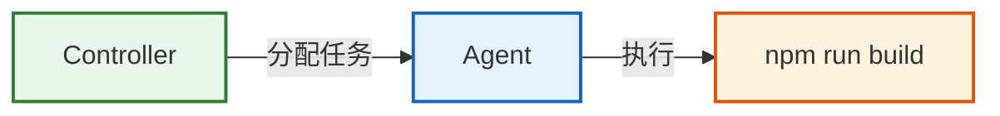

企业环境中可能有：

- Linux Agent
- Windows Agent
- Docker Agent

Agent 和 Executor 的区别：

| 概念     | 含义                     |
| -------- | ------------------------ |
| Agent    | 执行节点                 |
| Executor | 这个节点上的并发执行槽位 |

例如 Agent A 配置 `Executors = 2`，说明这台 Agent 最多同时执行两个 Build。

### 8. Plugin

Jenkins 很多功能都是通过插件扩展的。

可以理解成：

```text
Jenkins = 核心系统 + 插件生态
```

常见插件包括：

- Git
- Pipeline
- Credentials
- GitLab
- SSH Build Agents

但插件并不是越多越好。

插件越多，意味着：

- 升级风险更高
- 兼容问题更多
- 维护成本更高
- 安全风险更高

原则应该是：

> 需要什么，装什么。

## 五、一次 Build 的完整链路

当我们点击 `Build Now`，Jenkins 内部大致发生：

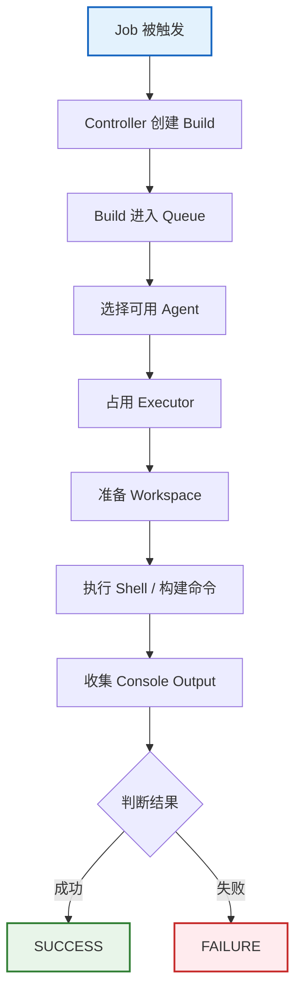

这一条链路必须真正理解：

```text
Controller → Queue → Agent → Executor → Workspace → Shell → Result
```

## 六、Jenkins 到底以谁的身份执行命令？

这是一个特别容易踩坑的问题。

我们在 Jenkins Job 中执行：

```bash
whoami
```

实际得到：

```text
jenkins
```

说明 Shell 命令是以 Linux 用户 `jenkins` 执行的。

而我们自己 SSH 登录 Ubuntu 时，可能是 `dongli`。

所以：

```text
你能执行成功 ≠ Jenkins 能执行成功
```

两边可能存在差异：

- PATH
- 权限
- HOME
- 环境变量
- Docker 权限
- SSH Key
- 文件权限

例如执行 `docker ps`，你自己执行成功，但 Jenkins 可能报：

```text
permission denied
```

本质原因很可能只是：

```text
dongli 有权限，jenkins 没权限
```

所以以后排 Jenkins 问题，建议先检查：

```bash
whoami
pwd
echo $HOME
echo $PATH
env
```

先搞清楚：

> 谁，在什么目录，用什么环境执行。

## 七、使用 Docker 安装 Jenkins

本次实战使用 Docker 部署 Jenkins。

首先拉镜像：

```bash
sudo docker pull jenkins/jenkins:lts-jdk21
```

这里 `jenkins/jenkins` 是 Jenkins 镜像。

而 `lts-jdk21` 表示 **Jenkins LTS + JDK 21**。

Jenkins 本身是 Java 应用，所以需要 Java 运行环境。

### 创建 Jenkins 数据目录

```bash
mkdir -p ~/jenkins-data
```

查看：

```bash
ls -ld ~/jenkins-data
```

这个目录用于保存 Jenkins 数据。

### 启动 Jenkins

```bash
sudo docker run -d \
  --name jenkins \
  -p 8080:8080 \
  -p 50000:50000 \
  -v ~/jenkins-data:/var/jenkins_home \
  --restart unless-stopped \
  jenkins/jenkins:lts-jdk21
```

这里最重要的是三个配置。

#### 端口 8080：访问 Jenkins Web UI

```text
Ubuntu:8080
↓
Jenkins Container:8080
```

用于访问 Jenkins Web UI。

#### 端口 50000：Controller 与 Agent 通信

主要用于：

```text
Jenkins Controller ↔ Jenkins Agent
```

的通信。

这一章暂时没有实际使用。

#### /var/jenkins_home：Jenkins 数据目录

这是 Jenkins 非常重要的数据目录。

我们做了：

```bash
-v ~/jenkins-data:/var/jenkins_home
```

意味着：

```text
宿主机：~/jenkins-data
↓ 映射到
容器：/var/jenkins_home
```

这里保存：

- Job
- Build History
- 用户
- 插件
- 配置
- Workspace
- Credentials

所以要理解：

| 部分         | 角色                 |
| ------------ | -------------------- |
| Container    | 运行环境             |
| Jenkins Data | 真正需要持久化的数据 |

容器可以重建，但数据不能随便删除。

## 八、Jenkins 初始化

第一次启动后，需要获取初始化密码：

```bash
sudo docker exec jenkins \
  cat /var/jenkins_home/secrets/initialAdminPassword
```

然后浏览器进入 Jenkins。

初始化过程中主要做了：

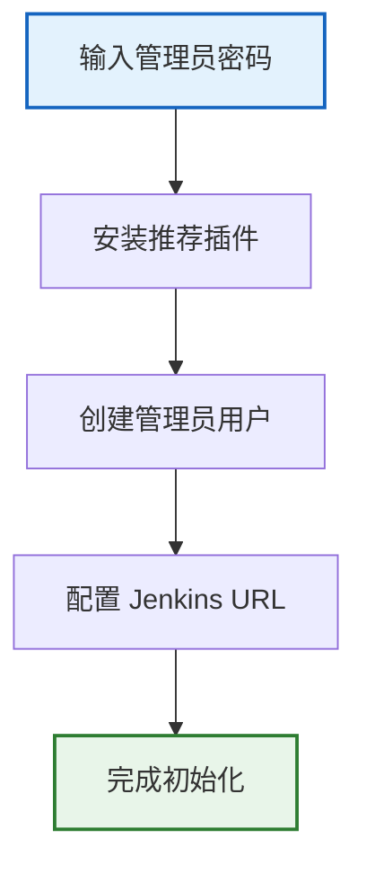

**输入管理员密码**

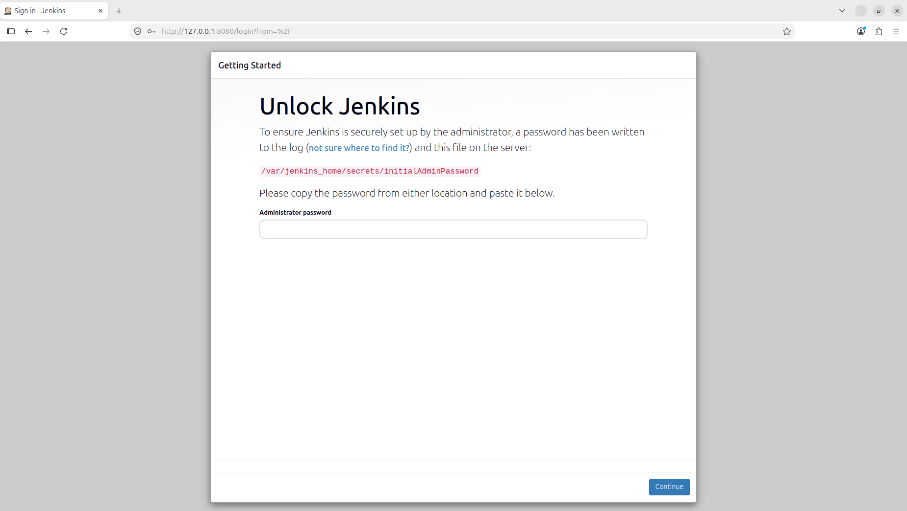

**安装推荐插件**

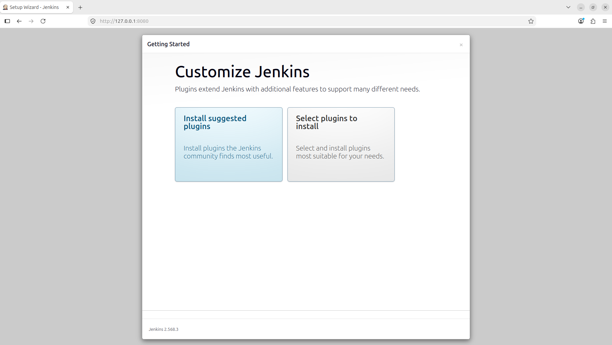

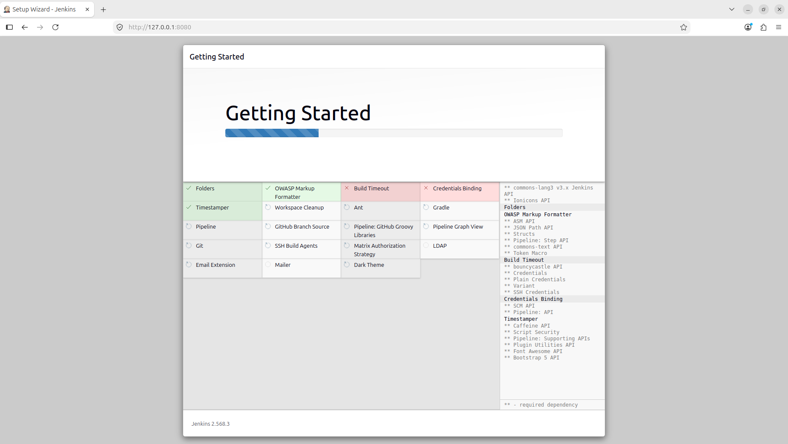

**创建管理员用户**

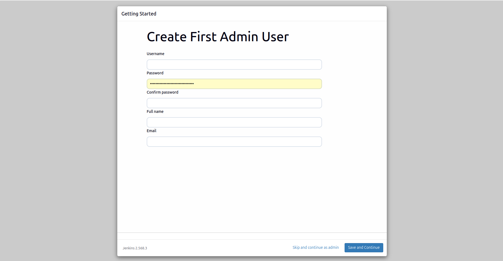

**配置 Jenkins URL**

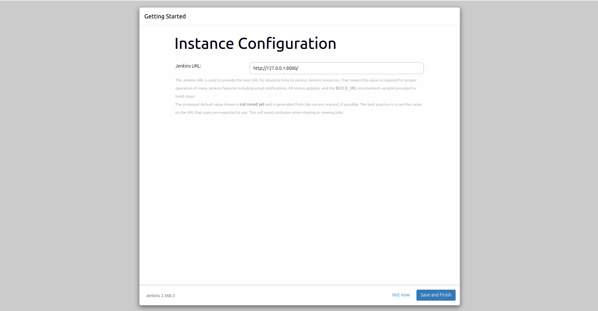

配置成功：

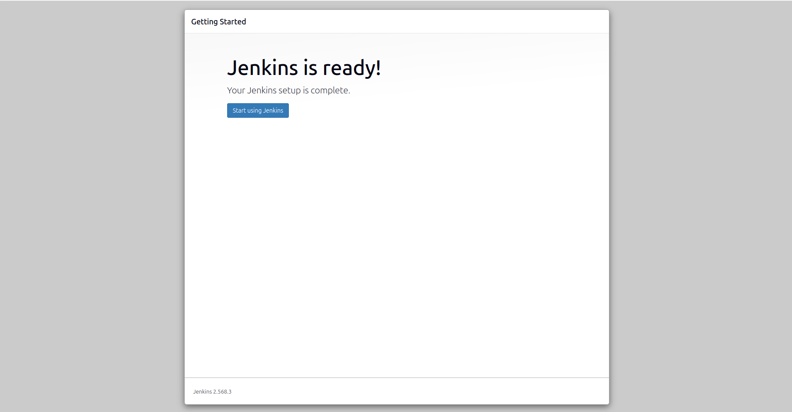

### Jenkins Web 用户和 Linux 用户不是一回事

例如：

- Jenkins 管理员用户：`dongli`
- Ubuntu 用户：`dongli`

即使名字一样，它们也是两套用户系统。

更不要和 Jenkins 执行 Shell 时使用的 `jenkins` 混淆。

所以这里实际有三层身份：

```text
Ubuntu 登录用户
Jenkins Web 用户
Jenkins Shell 执行用户
```

## 九、第一个 Freestyle Job

创建 Job：

- 名称：`hello-jenkins`
- 类型：`Freestyle project`
- 构建步骤：`Build Steps → Execute shell`

第一次执行：

```bash
echo "===== Jenkins Demo ====="

echo "Current User:"
whoami

echo "Current Directory:"
pwd

echo "Files:"
ls -la

echo "System:"
uname -a

echo "Date:"
date
```

构建完成后，通过：

```text
Build History → Build #1 → Console Output
```

查看日志。

实际得到：

```text
whoami → jenkins
```

以及：

```text
pwd → /var/jenkins_home/workspace/hello-jenkins
```

这两个结果非常重要，因为它们验证了：

| 验证点             | 结果                                      |
| ------------------ | ----------------------------------------- |
| Jenkins Shell 用户 | `jenkins`                                 |
| Job 工作目录       | `/var/jenkins_home/workspace/hello-jenkins` |

即前文所说的：Jenkins Shell 用户 = `jenkins`，Job 工作目录 = Workspace。

## 十、Workspace 实验

为了验证 Workspace，我们修改 Job：

```bash
echo "Hello Jenkins" > hello.txt

pwd

ls -la

cat hello.txt
```

Build 执行成功后，可以看到 `hello.txt` 真实存在于：

```text
/var/jenkins_home/workspace/hello-jenkins
```

进入容器：

```bash
sudo docker exec -it jenkins bash
```

然后：

```bash
cd /var/jenkins_home/workspace/hello-jenkins
ls -la
cat hello.txt
```

得到：

```text
Hello Jenkins
```

这真正证明了完整链路：

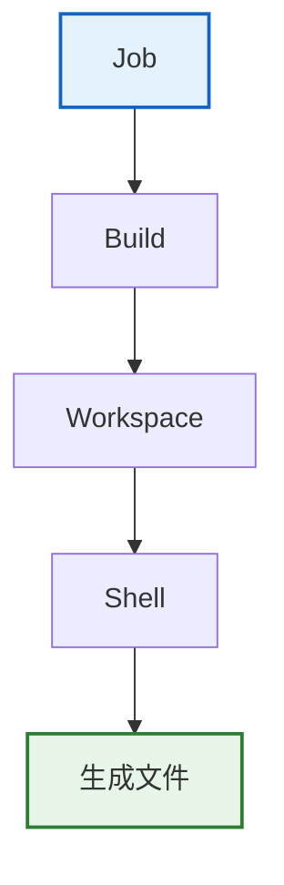

## 十一、Jenkins 如何判断失败

我们做了两个失败实验。

### 实验一：主动返回非 0

```bash
echo "start"

exit 1

echo "end"
```

结果：

```text
Finished: FAILURE
```

而 `echo "end"` 没有执行。

原因是：

```text
exit 0    → 成功
exit 非 0 → 失败
```

Jenkins 会根据 Shell 的执行结果判断这次 Build 是否失败。

### 实验二：执行不存在的命令

```bash
echo "start"

hello-jenkins-command

echo "end"
```

Console Output 出现：

```text
hello-jenkins-command: not found
```

最终：

```text
Finished: FAILURE
```

这时真正的根因是 `command not found`，而不是 `Finished: FAILURE`。

因为 `Finished: FAILURE` 只是最终结果。

## 十二、Jenkins 的日志怎么看？

这一章接触到了两种日志。

### Jenkins 服务日志

```bash
sudo docker logs jenkins
```

主要看：

- Jenkins 服务自身
- 启动
- 插件
- 系统错误

### Build 日志

Jenkins Web 中的：

```text
Console Output
```

主要看：

- Job 执行过程
- Shell 输出
- 测试日志
- 构建错误

所以以后排错不能混：

| 场景               | 看哪里                 |
| ------------------ | ---------------------- |
| Jenkins 服务起不来 | `docker logs jenkins`  |
| 某次 Build 失败    | `Console Output`       |

## 十三、验证数据持久化

最后我们做了一个非常重要的实验。

删除 Jenkins 容器：

```bash
sudo docker rm -f jenkins
```

此时 `Container` 已经不存在。

但执行：

```bash
ls -la ~/jenkins-data
```

发现 Jenkins 数据仍然存在。

然后重新创建容器：

```bash
sudo docker run -d \
  --name jenkins \
  -p 8080:8080 \
  -p 50000:50000 \
  -v ~/jenkins-data:/var/jenkins_home \
  --restart unless-stopped \
  jenkins/jenkins:lts-jdk21
```

重新进入 Jenkins 后：

```text
hello-jenkins Job
Build #1
Build #2
Build #3
Build #4
```

仍然存在。

这证明：

```text
删除 Container ≠ 删除 Jenkins 数据
```

因为真正的数据保存在 `~/jenkins-data`。

所以：

| 部分              | 结论             |
| ----------------- | ---------------- |
| Jenkins Container | 可以重新创建     |
| Jenkins Data      | 必须持久化保存   |

## 十四、这一章最重要的排错思路

这一章不只是学 Jenkins，还练习了一种非常重要的排错方法：

> 不猜，先确认当前处于哪一层。

例如 Build 一直停在 Queue：

```text
先查 Agent → 再查 Executor
```

而不是先查 Workspace。

如果 Build 已经开始执行，按顺序确认：

1. 先看 Console Output
2. 看第一条真实错误
3. 确认 `whoami`
4. 确认 `pwd`
5. 确认 `PATH`
6. 确认权限

例如 `package.json not found`，合理排查顺序：

1. `pwd`
2. `ls`
3. 确认 Workspace
4. 确认代码是否存在
5. 再判断 Git 是否拉取失败

而不是直接认定 `npm 坏了`。

这种分层排错思路，比记住某个 Jenkins 命令更重要。
