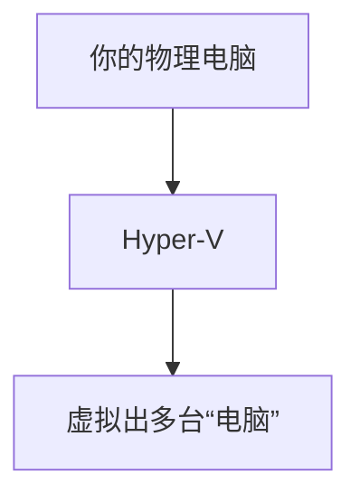
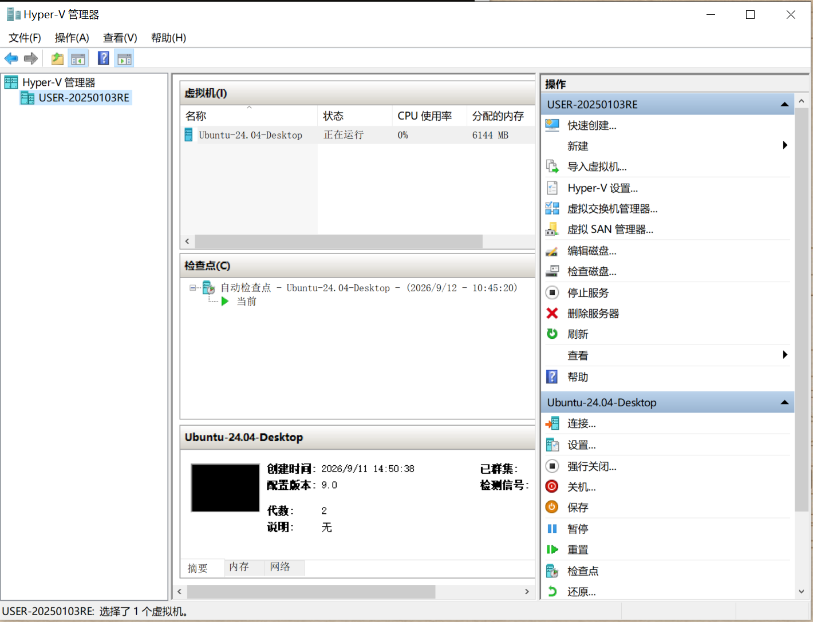
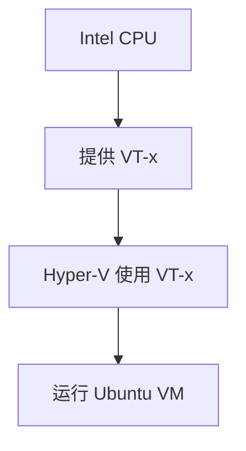
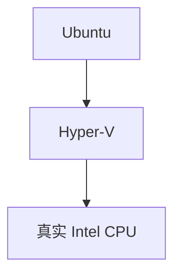
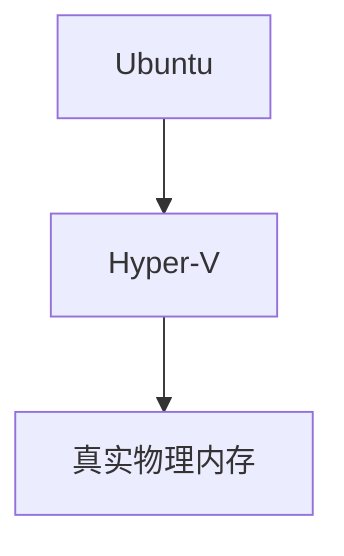
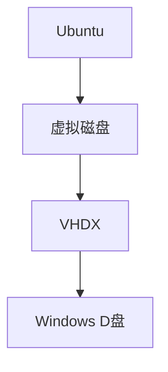
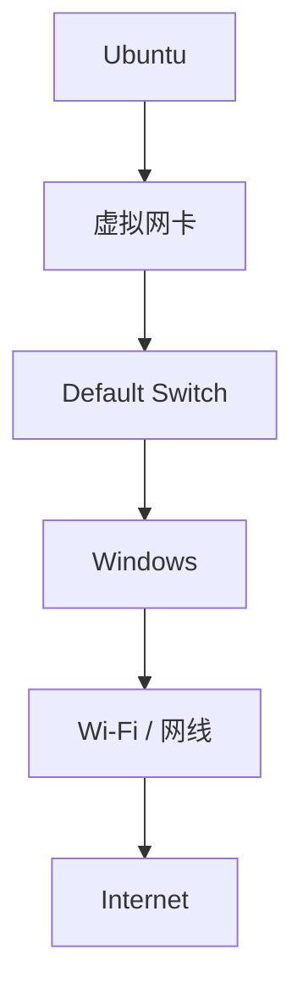
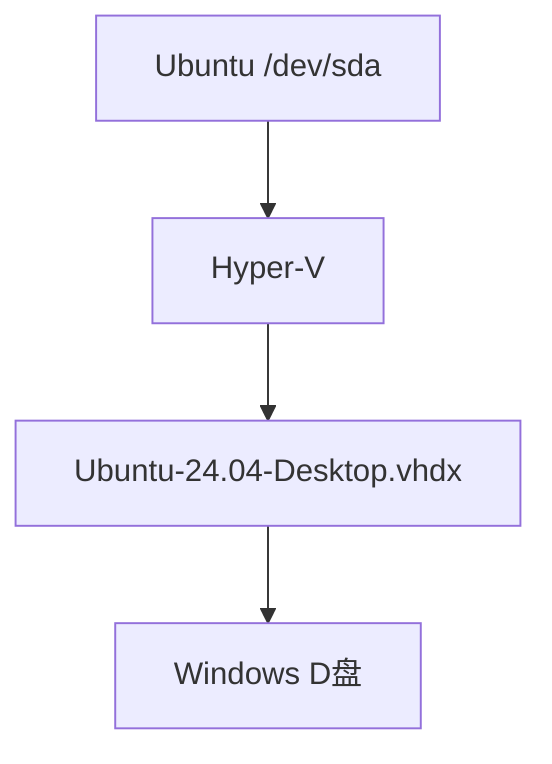

这篇文章不只记录“怎么安装”，而是把整个过程背后的原理一起讲清楚：**Hyper-V 是什么、VT-x 是什么、虚拟机架构为什么这样设计、如何查看电脑配置，以及 PowerShell 创建虚拟机脚本每一段到底做了什么。**

这次最终目标是：

> 在 Windows 10 专业版上，通过系统自带的 Hyper-V 创建一台 Ubuntu 24.04 图形化虚拟机，用于 Linux、Electron、Node.js、Nginx 等开发和测试。

## 一、先理解 Hyper-V 到底是什么

Hyper-V 是微软提供的**虚拟化平台**。

可以把它理解为：



例如你的物理机只有一台：

```text
ThinkPad
Windows 10
16GB 内存
Intel CPU
```

安装 Hyper-V 以后，可以在这台电脑里面再虚拟出：

- Ubuntu 24.04
- Windows 11
- CentOS
- 其他 Linux

这些系统彼此相对独立。

它们都有自己的：

```text
CPU
内存
硬盘
网卡
操作系统
```

只不过这些硬件不是真实硬件，而是 Hyper-V 提供的**虚拟硬件**。

所以 Hyper-V 的核心作用就是：

> 把一台物理计算机的硬件资源虚拟化，然后分配给多个虚拟机使用。

### 1、Hyper-V 位于哪里？

启用 Hyper-V 后，架构图为：

```text
物理硬件
│
├── CPU
├── 内存
├── 硬盘
└── 网卡
        ↓
Hyper-V Hypervisor
        ↓
┌──────────────┬──────────────┐
│ Windows 10   │ Ubuntu VM    │
│ 宿主环境     │ 虚拟机       │
└──────────────┴──────────────┘
```

Hypervisor 是虚拟化的核心层。

它负责控制：

```text
哪个 VM 使用多少 CPU
哪个 VM 使用多少内存
哪个 VM 使用哪块虚拟磁盘
虚拟网卡怎么通信
不同 VM 如何隔离
```

这就是为什么 `Ubuntu VM` 不会直接操作你的 Intel CPU、真实硬盘和真实网卡。它看到的是 Hyper-V 给它虚拟出来的设备。

## 二、如何查看 Hyper-V

首先可以在 Windows 搜索 `Hyper-V Manager`，中文通常叫 `Hyper-V 管理器`。

打开之后可以看到：

```text
你的电脑
└── Virtual Machines
    └── Ubuntu-24.04-Desktop
```

这里可以完成：

```text
启动虚拟机
停止虚拟机
连接虚拟机
修改 CPU
修改内存
修改硬盘
配置网络
```

你可以看到的界面如下所示：



查看所有虚拟机：

```powershell
Get-VM  # 需要使用管理员权限
```

例如：

```text
Name                 State   CPUUsage(%) MemoryAssigned(M) Uptime           Status   Version
----                 -----   ----------- ----------------- ------           ------   -------
Ubuntu-24.04-Desktop Running 1           6144              22:02:04.4020000 正常运行 9.0
```

查看 Hyper-V 管理服务：

```powershell
Get-Service vmms
```

如果正常：

```text
Status   Name
------   ----
Running  vmms
```

`vmms` 的全称是：

```text
Virtual Machine Management Service
```

即 Hyper-V 虚拟机管理服务。

查看 Hyper-V 网络交换机：

```powershell
Get-VMSwitch
```

例如：

```text
Name
----
Default Switch
```

## 三、整个架构到底表示什么

我们最终搭建的环境可以画成：

```text
Windows 10
│
├── Intel VT-x
│
└── Hyper-V
    │
    ├── Default Switch
    │
    └── Ubuntu 24.04 VM
        ├── 4 vCPU
        ├── 6GB RAM
        ├── 80GB VHDX
        ├── GNOME Desktop
        └── Linux 开发环境
```

不过严格来说，这张图是为了方便理解进行了简化。

更准确的结构是：

```text
物理电脑
│
├── Intel CPU
│   └── Intel VT-x
│
├── 16GB 物理内存
│
├── 物理硬盘
│
└── 物理网卡
        │
        ↓
Hyper-V Hypervisor
        │
        ├── Windows 10
        │
        └── Ubuntu VM
            ├── 4 vCPU
            ├── 6GB RAM
            ├── 80GB VHDX
            ├── 虚拟网卡
            │    ↓
            │ Default Switch
            │    ↓
            │ Windows 网络
            │
            └── Ubuntu 24.04
                 ├── Linux Kernel
                 ├── GNOME
                 └── 开发环境
```

下面逐个解释。

### 1、Intel VT-x

VT-x 是 Intel CPU 提供的**硬件虚拟化能力**。

没有 VT-x，CPU 原本只是在执行普通操作系统指令。

开启 VT-x 后，CPU 可以更高效、更安全地支持多个操作系统同时运行。

可以理解成：



所以：

> Hyper-V 是虚拟化平台，VT-x 是 CPU 给 Hyper-V 提供的底层能力。

### 2、Hyper-V

Hyper-V 负责真正管理虚拟机。

例如 Ubuntu 申请 CPU 时：



Ubuntu 申请内存：



Ubuntu 访问硬盘：



### 3、Default Switch

Ubuntu 需要联网。

但 Ubuntu VM 并不会直接操作你笔记本的：

```text
Intel Wi-Fi 6 AX201
```

Hyper-V 给 Ubuntu 创建了一张：

```text
虚拟网卡
```

虚拟网卡连接到：

```text
Default Switch
```

网络链路：



所以 Ubuntu 里面通常看到：

```text
Wired Connection
```

即使 Windows 实际使用的是 Wi-Fi。这是正常现象。

### 4、Ubuntu 24.04 VM

VM：

```text
Virtual Machine
```

就是虚拟机。

对于 Ubuntu 自己来说，它感觉自己运行在：

```text
CPU
内存
硬盘
网卡
UEFI
```

完整电脑上。

但是这些设备实际上都是 Hyper-V 提供的。

### 5、4 vCPU

我们给 Ubuntu 配置：

```text
4 vCPU
```

vCPU：

```text
Virtual CPU
```

即虚拟处理器。

你的 Intel i5-10210U：

```text
4 核 8 线程
```

但并不是因此应该给 Ubuntu 8 vCPU。

因为 Windows 本身也需要 CPU。

所以这里采用：

```text
Windows + Ubuntu
```

共享真实 CPU。

4 vCPU 对：

```text
Ubuntu Desktop
Electron
Node.js
VS Code
```

已经比较合适。

### 6、6GB RAM

Ubuntu 被分配：

```text
6GB 内存
```

这部分内存最终来自：

```text
物理机的 16GB RAM
```

结构是：

```text
16GB RAM
│
├── Windows 使用一部分
├── Chrome / IDE 使用一部分
└── Ubuntu VM 使用 6GB
```

这就是为什么不能把 16GB 全部给 Ubuntu。

否则 Windows 自己都没内存用了。

### 7、80GB VHDX

VHDX 是：

```text
Hyper-V Virtual Hard Disk
```

也就是 Hyper-V 的虚拟硬盘文件。

我们创建的是：

```text
D:\VMs\Ubuntu-24.04-Desktop\Virtual Hard Disks\Ubuntu-24.04-Desktop.vhdx
```

Ubuntu 会认为：

```text
我有一块 80GB 硬盘
```

但实际上：



这也是为什么 Ubuntu 安装器里面选择：

```text
Erase disk and install Ubuntu
```

不会把 Windows D 盘格式化。

它擦除的只是：

```text
VHDX 虚拟硬盘
```

### 8、GNOME Desktop

Ubuntu 分为很多形态。

Ubuntu Server 通常没有图形界面。

Ubuntu Desktop 默认使用：

```text
GNOME
```

因此：

```text
GNOME Desktop
```

就是我们看到的 Linux 图形桌面。

例如：

```text
桌面
文件管理器
设置
浏览器
窗口
应用程序菜单
```

都属于桌面环境的一部分。

### 9、Linux 开发环境

Ubuntu 安装完成以后，我们最终要在里面运行：

```text
Node.js
npm
Electron
Git
Nginx
systemd
Shell
Docker
```

因此 Ubuntu VM 本身只是基础。

真正的目标是建立：

> Linux 开发和测试环境

## 四、如何查看自己的电脑配置

在安装 VM 之前，至少要确认：

```text
CPU
内存
磁盘
Windows 版本
虚拟化
```

### 1、查看 Windows 版本

执行：

```powershell
winver
```

或者：

```powershell
systeminfo
```

### 2、查看 CPU

PowerShell：

```powershell
Get-CimInstance Win32_Processor |
  Select-Object Name, NumberOfCores, NumberOfLogicalProcessors
```

例如：

```text
Name:
Intel(R) Core(TM) i5-10210U

NumberOfCores:
4

NumberOfLogicalProcessors:
8
```

表示：

```text
4 核
8 线程
```

### 3、查看内存

执行：

```powershell
Get-CimInstance Win32_ComputerSystem |
  Select-Object TotalPhysicalMemory
```

或者最简单：

```text
任务管理器
→ 性能
→ 内存
```

本机是 `16GB`，因此 Ubuntu 分配 `6GB` 比较合理。

### 4、查看虚拟化状态

可以打开：

```text
任务管理器
→ 性能
→ CPU
```

右侧查看：

```text
虚拟化：已启用
```

## 五、为什么安装虚拟机要开“虚拟化”

这里要纠正一个很容易混淆的概念。

不是“必须设置虚拟内存才能安装虚拟机”。

我们前面真正设置的是：

```text
Intel Virtualization Technology
```

即 `VT-x`。

不是 Windows 的 `Virtual Memory`。

这两个名字很像，但完全不是一回事：

| 对比项 | 虚拟化 | 虚拟内存 |
| --- | --- | --- |
| 英文 | Virtualization | Virtual Memory |
| 本质 | CPU 功能 | Windows 内存管理机制 |
| 典型代表 | Intel VT-x | pagefile.sys |
| 作用 | 让 Hyper-V 能运行虚拟机 | 真实 RAM 不够时，把部分数据暂时写到硬盘 |
| 路径 | BIOS → Intel Virtualization Technology → Enabled | — |

虚拟内存的工作方式：

```text
RAM
↓
真实内存不够时，部分数据暂时写到硬盘
↓
pagefile.sys
```

例如这台 `16GB RAM` 的机器，Windows 还可能存在页面文件。

这跟“Hyper-V 能不能创建 VM”没有直接关系。

所以准确说法应该是：

> 安装 Hyper-V 虚拟机需要开启 CPU 硬件虚拟化 VT-x，而不是必须修改 Windows 虚拟内存。

## 六、BIOS 开启 Intel VT-x

ThinkPad 进入 BIOS 后：

```text
Security
→ Virtualization
```

找到 `Intel Virtualization Technology`，设置为 `On`。

同时 `Intel VT-d Feature` 也可以设置为 `On`。

然后：

```text
F10
→ Save and Exit
```

进入 Windows。

## 七、PowerShell 创建 Ubuntu VM

最终我们使用 PowerShell 创建，而不是完全依赖图形界面。

完整脚本：

```powershell
# requires -RunAsAdministrator

$ErrorActionPreference = "Stop"

$VMName = "Ubuntu-24.04-Desktop"

$VMRoot = "D:\VMs\Ubuntu-24.04-Desktop"

$VHDDir = "$VMRoot\Virtual Hard Disks"

$VHDPath =
"$VHDDir\Ubuntu-24.04-Desktop.vhdx"

$ISOPath =
"D:\ISOs\ubuntu-24.04.5-desktop-amd64.iso"

$SwitchName = "Default Switch"


if (-not (Test-Path $ISOPath)) {
    throw "ISO not found: $ISOPath"
}


$vmms =
Get-Service vmms -ErrorAction SilentlyContinue

if (-not $vmms) {
    throw "Hyper-V service was not found."
}

if ($vmms.Status -ne "Running") {
    Start-Service vmms
}


if (-not (
    Get-VMSwitch
    -Name $SwitchName
    -ErrorAction SilentlyContinue
)) {
    throw "Default Switch was not found."
}


if (
    Get-VM
    -Name $VMName
    -ErrorAction SilentlyContinue
) {
    throw "VM already exists."
}


if (Test-Path $VHDPath) {
    throw "VHDX already exists."
}


New-Item `
    -ItemType Directory `
    -Path $VHDDir `
    -Force |
    Out-Null


New-VHD `
    -Path $VHDPath `
    -SizeBytes 80GB `
    -Dynamic |
    Out-Null


New-VM `
    -Name $VMName `
    -Generation 2 `
    -MemoryStartupBytes 6GB `
    -VHDPath $VHDPath `
    -Path $VMRoot `
    -SwitchName $SwitchName |
    Out-Null


Set-VMProcessor `
    -VMName $VMName `
    -Count 4


Set-VMMemory `
    -VMName $VMName `
    -DynamicMemoryEnabled $false `
    -StartupBytes 6GB


Add-VMDvdDrive `
    -VMName $VMName `
    -Path $ISOPath


Set-VMFirmware `
    -VMName $VMName `
    -EnableSecureBoot On `
    -SecureBootTemplate `
    MicrosoftUEFICertificateAuthority


$DVD =
Get-VMDvdDrive -VMName $VMName


Set-VMFirmware `
    -VMName $VMName `
    -FirstBootDevice $DVD


Get-VM -Name $VMName
```

## 八、脚本逐段解释

### 要求管理员权限

```powershell
#requires -RunAsAdministrator
```

表示：这个脚本必须使用管理员 PowerShell 执行。

因为创建：

- VM
- VHDX
- Virtual Switch 配置
- Firmware 配置

都需要管理员权限。

### 遇到错误立即停止

```powershell
$ErrorActionPreference = "Stop"
```

如果不设置，某些 PowerShell 错误出现以后，脚本会继续往下执行。

这会出现很危险的情况：

```text
前面创建失败
↓
后面继续修改
↓
产生半成品 VM
```

所以这里要求：

```text
任何关键步骤出错
↓
立即停止
```

### VM 名字

```powershell
$VMName = "Ubuntu-24.04-Desktop"
```

以后所有 Hyper-V 命令都通过这个名字找到 VM。

例如：

```powershell
Start-VM "Ubuntu-24.04-Desktop"
```

### VM 文件存放位置

```powershell
$VMRoot = "D:\VMs\Ubuntu-24.04-Desktop"
```

告诉 Hyper-V：这台虚拟机的数据主要放在 D 盘，避免大量虚拟机文件占 C 盘。

### VHDX 路径

```powershell
$VHDDir = "$VMRoot\Virtual Hard Disks"
```

最终：

```text
D:\VMs\Ubuntu-24.04-Desktop\Virtual Hard Disks
```

然后：

```powershell
$VHDPath = "$VHDDir\Ubuntu-24.04-Desktop.vhdx"
```

得到具体虚拟硬盘文件。

### ISO 路径

```powershell
$ISOPath = "D:\ISOs\ubuntu-24.04.5-desktop-amd64.iso"
```

这个就是 Ubuntu 安装光盘。

### 虚拟交换机

```powershell
$SwitchName = "Default Switch"
```

告诉 VM：网卡连接到 Hyper-V 的 Default Switch，这样 Ubuntu 才能通过 Windows 联网。

### 检查 ISO

```powershell
if (-not (Test-Path $ISOPath)) {
    throw "ISO not found: $ISOPath"
}
```

`Test-Path`：检查文件是否存在。

如果不存在，立即报错、停止脚本。

否则如果继续创建，VM 最后没有安装介质，也启动不了 Ubuntu 安装程序。

### 检查 Hyper-V 服务

```powershell
$vmms = Get-Service vmms -ErrorAction SilentlyContinue
```

获取 Hyper-V Virtual Machine Management 服务。

然后：

```powershell
if ($vmms.Status -ne "Running") {
    Start-Service vmms
}
```

意思：

```text
如果 Hyper-V 服务没有运行
↓
启动它
```

### 检查 Default Switch

```powershell
Get-VMSwitch -Name "Default Switch"
```

确认 Hyper-V 默认虚拟交换机存在，否则 VM 创建以后没有网络。

### 防止重复创建 VM

```powershell
Get-VM -Name $VMName
```

如果已经存在 `Ubuntu-24.04-Desktop`，脚本停止。

这样做是为了防止：

```text
重复执行脚本
↓
创建冲突
↓
破坏已有环境
```

### 创建目录

```powershell
New-Item `
    -ItemType Directory `
    -Path $VHDDir `
    -Force
```

创建：

```text
D:\VMs\
Ubuntu-24.04-Desktop\
Virtual Hard Disks
```

`-Force` 表示：目录已经存在也不要报错。

### 创建虚拟硬盘

```powershell
New-VHD `
    -Path $VHDPath `
    -SizeBytes 80GB `
    -Dynamic
```

重点有两个：

- `80GB`：虚拟磁盘最大容量
- `Dynamic`：动态扩展，不是立即占用 80GB

### 创建 VM

```powershell
New-VM `
    -Name $VMName `
    -Generation 2 `
    -MemoryStartupBytes 6GB `
    -VHDPath $VHDPath `
    -Path $VMRoot `
    -SwitchName $SwitchName
```

这是整个脚本最核心的一条命令。

相当于一次定义：

- VM 名字
- Generation
- 内存
- 硬盘
- VM 路径
- 网络

即：

```text
Ubuntu-24.04-Desktop
│
├── Gen2
├── 6GB
├── 80GB VHDX
└── Default Switch
```

### 为什么 Generation 2

```powershell
-Generation 2
```

Gen2 使用：

- UEFI
- Secure Boot
- 现代虚拟硬件
- SCSI

Ubuntu 24.04 属于现代操作系统，所以直接使用 Gen2。

### 配置 4 vCPU

```powershell
Set-VMProcessor `
    -VMName $VMName `
    -Count 4
```

把虚拟处理器数量设成 `4`。

Ubuntu 里面执行：

```bash
nproc
```

应该看到 `4`。

### 设置 6GB 固定内存

```powershell
Set-VMMemory `
    -VMName $VMName `
    -DynamicMemoryEnabled $false `
    -StartupBytes 6GB
```

这里 `DynamicMemoryEnabled = $false` 表示关闭动态内存，即固定给 Ubuntu `6GB`。

注意：这才是“虚拟机 RAM”，和 Windows 的“虚拟内存 pagefile”仍然是两个概念。

### 挂载 Ubuntu ISO

```powershell
Add-VMDvdDrive `
    -VMName $VMName `
    -Path $ISOPath
```

相当于：

```text
给虚拟机装一个虚拟 DVD 光驱
↓
把 Ubuntu ISO 放进去
```

这就是为什么 VM 启动后可以进入 Ubuntu Installer。

### 配置 Secure Boot

```powershell
Set-VMFirmware `
    -EnableSecureBoot On `
    -SecureBootTemplate MicrosoftUEFICertificateAuthority
```

Generation 2 使用 UEFI。

Ubuntu 使用 `Microsoft UEFI Certificate Authority` 作为 Secure Boot 模板。

不要使用默认 Windows Secure Boot 模板。

### 获取 DVD

```powershell
$DVD = Get-VMDvdDrive -VMName $VMName
```

找到刚才创建的虚拟 DVD。

### 设置第一启动设备

```powershell
Set-VMFirmware `
    -VMName $VMName `
    -FirstBootDevice $DVD
```

启动顺序变成：

```text
DVD / Ubuntu ISO
↓
VHDX
```

因为虚拟硬盘一开始完全是空的。

如果不从 ISO 启动：

```text
VM
↓
空硬盘
↓
没有操作系统
↓
无法启动
```

## 九、启动 Ubuntu 安装程序

脚本完成后：

```powershell
Start-VM "Ubuntu-24.04-Desktop"
```

表示启动 VM。

然后：

```powershell
vmconnect.exe localhost "Ubuntu-24.04-Desktop"
```

表示：

```text
打开 Hyper-V VMConsole
连接 Ubuntu
```

它们不是同一个动作：

```text
Start-VM   → 开机
vmconnect  → 看屏幕、键盘鼠标操作
```

## 十、Ubuntu 安装过程

进入 GRUB：

```text
Try or Install Ubuntu
Ubuntu (safe graphics)
```

正常选择 `Try or Install Ubuntu`。

然后进入 Ubuntu 图形安装器。

配置如下：

| 配置项 | 选择 |
| --- | --- |
| Language | English |
| Accessibility | Default |
| Keyboard | English (US) |
| Network | Use wired connection |
| Install | Install Ubuntu |
| Installation type | Interactive installation |
| Applications | Default selection |

第三方软件全部不勾，对于 Hyper-V 开发 VM 足够。

## 十一、Ubuntu 网络为什么显示 Wired

Ubuntu 可能显示：

```text
No Wi-Fi devices detected
```

完全正常。

因为 VM 并没有直接拿到真实 Wi-Fi 网卡。

结构是：

```text
Intel Wi-Fi
    ↑
Windows
    ↑
Default Switch
    ↑
Hyper-V Virtual NIC
    ↑
Ubuntu
```

所以 Ubuntu 只认为：**自己连接了一根虚拟网线**。

## 十二、Ubuntu 磁盘安装

选择：

```text
Erase disk and install Ubuntu
```

这个 Disk 是 `80GB VHDX`，而不是：

- Windows C 盘
- Windows D 盘

结构：

```text
D盘
└── Ubuntu.vhdx
    └── Ubuntu /dev/sda
```

因此 Ubuntu 最终可能创建：

| 分区 | 文件系统 | 挂载点 |
| --- | --- | --- |
| /dev/sda1 | FAT32 | /boot/efi |
| /dev/sda2 | ext4 | / |

这是正常的 Gen2 + UEFI Linux 分区。

## 十三、创建 Ubuntu 用户

例如：

| 配置项 | 值 |
| --- | --- |
| Your name | dongli |
| Computer name | ubuntu-dev |
| Username | dongli |

密码自行设置。

保留 `Require my password to log in`。

不要选择 `Use Active Directory`。

开发机没必要加入 Windows 企业域。

以后终端就可能显示：

```text
dongli@ubuntu-dev:~$
```

## 十四、安装完成

确认 `Timezone` 为 `Asia/Shanghai`。

然后选择 `Install`，等待系统安装。

完成后选择 `Restart now`。

系统会：

```text
虚拟 UEFI
↓
VHDX
↓
GRUB
↓
Linux Kernel
↓
Ubuntu
↓
GNOME
```

最终进入 Ubuntu 图形桌面。

## 十五、Ubuntu 安装后的基础配置

打开 Terminal：

```bash
sudo apt update
```

意思是：更新软件源索引。

然后：

```bash
sudo apt full-upgrade -y
```

表示：升级当前系统软件。

最后：

```bash
sudo reboot
```

可以再安装：

```bash
sudo apt install -y \
  linux-tools-virtual \
  linux-cloud-tools-virtual
```

这些是针对虚拟环境的一些 Linux 工具包。

不过需要知道：现代 Ubuntu 的主要 Hyper-V 驱动已经集成在 Linux Kernel 中，并不是安装这些包之后才支持 Hyper-V。

查看：

```bash
lsmod | grep hv
```

可能看到：

```text
hv_netvsc
hv_storvsc
hv_utils
hv_balloon
```

分别和网络、存储、Hyper-V 工具、内存相关。

## 十六、验证 Ubuntu 网络

查看网卡：

```bash
ip addr
```

测试 Internet：

```bash
ping -c 4 1.1.1.1
```

如果成功，网络链路正常。

继续：

```bash
ping -c 4 ubuntu.com
```

如果成功，DNS 也正常。

如果 `1.1.1.1` 能通、`ubuntu.com` 不通，通常说明 DNS 异常。

## 十七、Ubuntu VM 怎么关机和启动

日常应该在 Ubuntu 内正常关机：

```bash
sudo poweroff
```

或者：

```text
Ubuntu 右上角
→ Power Off
```

正常关机会：

```text
停止应用
↓
写入磁盘
↓
卸载文件系统
↓
关闭 Kernel
↓
VM Off
```

Windows 可以检查：

```powershell
Get-VM "Ubuntu-24.04-Desktop"
```

以后启动：

```powershell
Start-VM "Ubuntu-24.04-Desktop"
```

连接：

```powershell
vmconnect.exe localhost "Ubuntu-24.04-Desktop"
```

所以最常用的只有：

```powershell
Start-VM "Ubuntu-24.04-Desktop"
vmconnect.exe localhost "Ubuntu-24.04-Desktop"
```

如果 Ubuntu 完全卡死，才使用：

```powershell
Stop-VM "Ubuntu-24.04-Desktop" -TurnOff
```

`-TurnOff` 相当于直接拔物理电脑电源。

所以不要作为正常关机方式。
