在很多内部管理系统、测试环境、Swagger、运维后台中，我们并不一定需要搭建一套完整的用户登录系统，但又不能让所有人直接访问。

这时可以在 Nginx 层增加一道简单的身份认证：

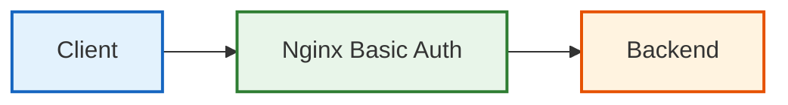

HTTP Basic Auth 配置简单，但真正要安全地使用它，需要理解几个问题：

- Basic Auth 到底认证什么？
- 为什么认证失败返回 401？
- 用户密码存在哪里？
- `Authorization` Header 中到底是什么？
- 为什么 Basic Auth 必须搭配 HTTPS？
- 它和 Backend 自己的登录认证有什么区别？

下面从原理到实战完整梳理。

## 一、Basic Auth 是什么

HTTP Basic Authentication 是一种 HTTP 标准认证机制。

当某个资源开启 Basic Auth 后，客户端必须提供 `username` 和 `password`，Nginx 验证成功后，请求才能继续进入后续处理流程。

例如：

```nginx
location /admin/ {
    auth_basic "Admin Area";
    auth_basic_user_file /etc/nginx/.htpasswd;

    proxy_pass http://backend:3000/;
}
```

此时请求链路变成：

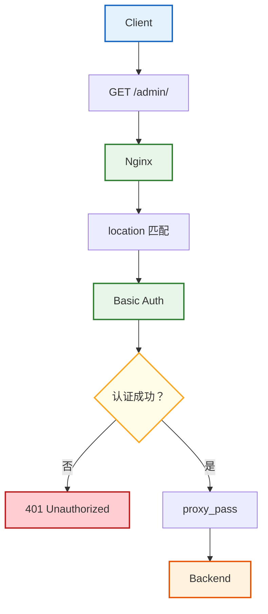

因此，如果 Basic Auth 认证失败：

```
Nginx access.log 有请求
Backend 没有请求
```

这是正常现象，因为请求已经在 Nginx 层被终止。

> 请求没有到达 Backend，并不代表配置出了问题，而是认证在 Nginx 层就被拦截了。

### Basic Auth 和 allow/deny 的区别

之前学习的：

```nginx
allow 10.0.0.0/8;
deny all;
```

判断的是：请求来自哪里？

而 Basic Auth 判断的是：请求者是否拥有正确凭证？

两者属于两个不同安全维度：

| 机制        | 判断依据      | 常见失败状态 |
| ----------- | ------------- | ------------ |
| `allow/deny` | IP 地址       | 403          |
| Basic Auth  | 用户名 + 密码 | 401          |

不要简单理解成 `401 = 没权限`、`403 = 禁止`，更准确应该理解为：

```
401 → Authentication 认证失败
403 → Access Control / Authorization 拒绝访问
```

401 更接近：

> “我无法确认你的身份，或者你的身份凭证错误。”

403 更接近：

> “这个请求不允许访问。”

## 二、auth_basic 与 .htpasswd

Basic Auth 主要涉及两个配置：

```nginx
auth_basic "Nginx Basic Auth Lab";
auth_basic_user_file /etc/nginx/.htpasswd;
```

### auth_basic

```nginx
auth_basic "Nginx Basic Auth Lab";
```

表示开启 Basic Auth。

后面的 `Nginx Basic Auth Lab` 称为 realm，可以理解为受保护区域名称。

当认证失败时，Nginx 会返回：

```
HTTP/1.1 401 Unauthorized
WWW-Authenticate: Basic realm="Nginx Basic Auth Lab"
```

浏览器看到这个 Header 后，通常会主动显示用户名密码输入框。

因此浏览器弹出的认证框，并不是 Nginx 返回的一张 HTML 登录页面，而是浏览器对 `WWW-Authenticate` 这个响应头的标准处理。

### auth_basic_user_file

```nginx
auth_basic_user_file /etc/nginx/.htpasswd;
```

表示告诉 Nginx：去哪个文件读取用户名和密码信息。

`.htpasswd` 内容类似：

```
admin:$apr1$xxxxx$xxxxxxxxxxxx
developer:$apr1$yyyyy$yyyyyyyy
```

基本格式：`username:password_hash`

注意这里保存的通常不是明文密码，而是密码哈希。

因此下面这种理解是错误的：`admin:123456`

正确状态应该类似：`admin:$apr1$...`

### 哈希不是加密

不要说：

> `.htpasswd` 把密码加密保存。

更准确应该说：

> `.htpasswd` 保存密码哈希。

加密通常意味着：

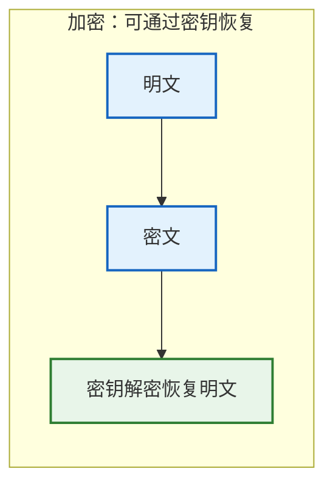

密码哈希则更接近：

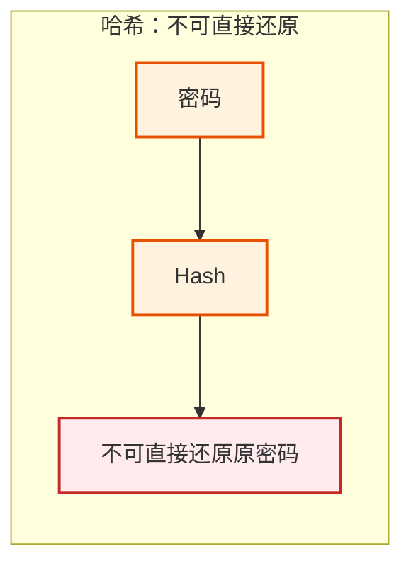

## 三、创建 Basic Auth 用户

常用工具是 `htpasswd`。

先检查：

```bash
which htpasswd
```

这里只需确保宿主机中存在 htpasswd 命令即可，因为 Nginx 容器内的 `/etc/nginx/.htpasswd` 已经通过 volume 映射到了宿主机。

参考如下配置：`docker-compose.yml` 文件

```yaml
services:
  nginx:
    image: nginx:1.28-alpine
    ports:
      - "8080:80"
    volumes:
      - ./nginx/conf.d:/etc/nginx/conf.d
      - ./nginx/.htpasswd:/etc/nginx/.htpasswd:ro
    depends_on:
      - backend

  backend:
    build:
      context: ./backend
```

如果检查发现 htpasswd 不存在，可以直接在宿主机中安装：

```bash
yum install -y httpd-tools
```

创建第一个用户：

```bash
htpasswd -c /etc/nginx/.htpasswd admin
```

根据提示输入密码：

```
New password:
Re-type new password:
```

创建完成后：

```bash
cat /etc/nginx/.htpasswd
```

可以看到类似：`admin:$apr1$xxxx...`

### 注意 `-c`

第一次：

```bash
htpasswd -c /etc/nginx/.htpasswd admin
```

其中 `-c = create`，表示创建密码文件。

如果需要新增第二个用户：

```bash
htpasswd /etc/nginx/.htpasswd developer
```

不要再使用 `-c`，否则可能重新创建文件，导致原有账号丢失。

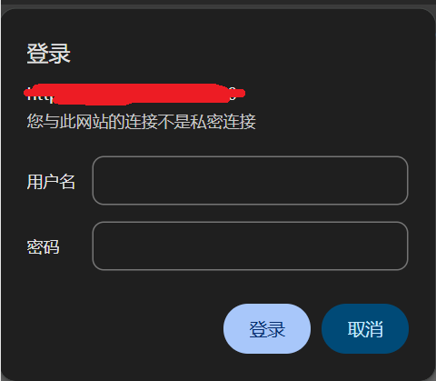

输入用户名密码后，浏览器的后续请求会自动携带 `Authorization: Basic xxx` 请求头。

## 四、Authorization Header 是怎么工作的

Basic Auth 并不是常见的「登录换 Token」模式：

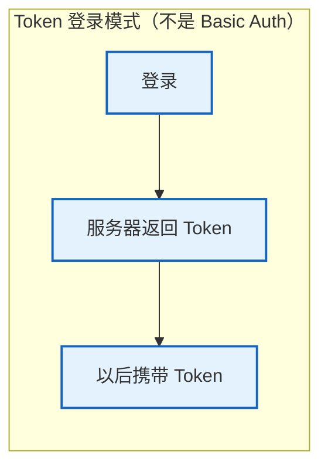

它的机制更直接：

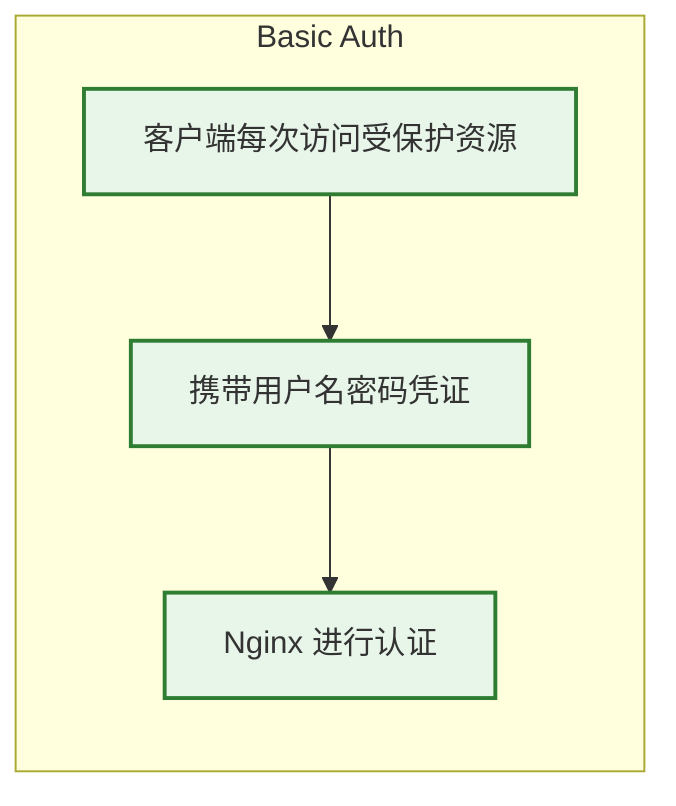

假设 `username = admin`、`password = 123456`。

首先拼接：

```
admin:123456
```

然后 Base64 编码：

```
admin:123456
↓
YWRtaW46MTIzNDU2
```

最终请求：

```
GET /basic-demo/ HTTP/1.1
Host: localhost:8080
Authorization: Basic YWRtaW46MTIzNDU2
```

### Base64 不是加密

执行：

```bash
echo -n 'admin:123456' | base64
```

得到：

```
YWRtaW46MTIzNDU2
```

再执行：

```bash
echo 'YWRtaW46MTIzNDU2' | base64 -d
```

马上恢复：

```
admin:123456
```

因此必须明确：`Base64 ≠ 加密`、`Base64 ≠ Hash`，它只是编码。

### curl 携带 Basic Auth

最方便：

```bash
curl -i -u admin:123456 \
  http://localhost:8080/basic-demo/
```

等价于：

```bash
curl -i --user admin:123456 \
  http://localhost:8080/basic-demo/
```

curl 会自动生成 `Authorization: Basic ...`。

可以通过：

```bash
curl -v -u admin:123456 \
  http://localhost:8080/basic-demo/
```

观察请求：

```
> GET /basic-demo/ HTTP/1.1
> Authorization: Basic YWRtaW46MTIzNDU2
```

也可以手动构造：

```bash
echo -n 'admin:123456' | base64
```

然后：

```bash
curl -i \
  -H 'Authorization: Basic YWRtaW46MTIzNDU2' \
  http://localhost:8080/basic-demo/
```

如果认证通过：

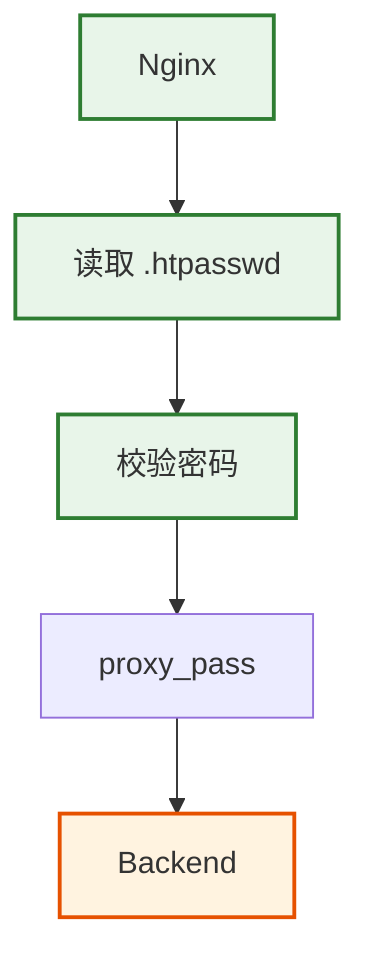

### 常见认证结果

不发送认证：

```bash
curl -i http://localhost:8080/basic-demo/
```

预期返回 `401 Unauthorized`。

错误密码：

```bash
curl -i -u admin:wrong-password \
  http://localhost:8080/basic-demo/
```

仍然返回 `401 Unauthorized`。

用户名不存在：

```bash
curl -i -u nobody:123456 \
  http://localhost:8080/basic-demo/
```

仍然返回 `401 Unauthorized`。

因为这些都属于 `Authentication Failed`，而不是 IP 访问控制失败。

## 五、为什么 Basic Auth 必须配 HTTPS

Basic Auth 最大的问题就在这里：用户名和密码没有被 Basic Auth 自己加密。

客户端发送：

```
Authorization: Basic YWRtaW46MTIzNDU2
```

拿到这个 Header 后，只需要 Base64 解码：

```
YWRtaW46MTIzNDU2
↓
admin:123456
```

因此如果使用 `HTTP + Basic Auth`，中间能够监听网络通信的一方就可能直接获取用户凭证。

生产环境更合理的是 `HTTPS + Basic Auth`。

### TLS 保护什么

HTTPS 可以理解成：

```
HTTP
↓
TLS
↓
TCP
```

Authorization 属于 HTTP Header：

```
Authorization: Basic ...
```

因此 HTTPS 下：

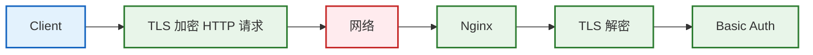

更准确的说法不是：HTTPS 把 Basic Auth 密码加密了。

而是：TLS 加密保护了承载 `Authorization` Header 的 HTTP 通信。

Basic Auth 本身依然只是：

```
username:password
↓
Base64
```

安全性来自 TLS。

### curl 验证

HTTPS 环境：

```bash
curl -vk -u admin:123456 \
  https://localhost:8443/basic-demo/
```

`curl -v` 中仍然可能看到：

```
Authorization: Basic ...
```

这并不代表 HTTPS 没生效。

curl 是客户端，它当然知道自己要发送什么。

真正经过网络的数据已经被 TLS 加密。

## 六、Basic Auth、Backend 登录与排障

Basic Auth 和 Backend 自己的登录系统不能混为一谈。

架构可能是：

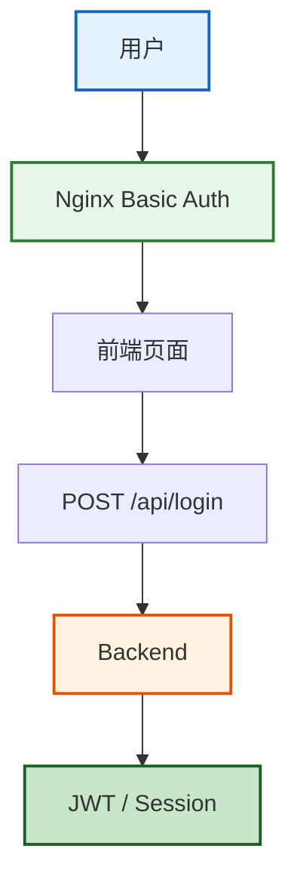

Basic Auth 回答的是：

```
你能不能进入这个站点？
```

Backend 登录回答的是：

```
你在业务系统中是谁？
你拥有哪些业务权限？
```

业务认证还可能处理：用户 ID、角色、权限、租户、Token、Session、MFA、登录状态、账号禁用、审计日志。

而 Basic Auth 通常只有 `username` 和 `password`。

因此 Basic Auth 更适合：

- 内部管理系统
- 测试环境
- Swagger
- 简单运维页面
- 临时保护页面

不应该简单替代复杂业务登录系统。

### Authorization 冲突

Basic Auth：

```
Authorization: Basic xxx
```

JWT：

```
Authorization: Bearer xxx
```

如果同一个 API 同时需要 `Basic Auth + Bearer Token`，就需要认真设计认证边界。

因为它们默认都占用 `Authorization` 这个 Header，不能简单认为客户端同时发送两个 Authorization Header 就一定可以正常工作。

### $remote_user

Basic Auth 成功后，Nginx 可以通过 `$remote_user` 获取认证用户名。

例如：

```nginx
add_header X-Authenticated-User $remote_user always;
```

请求：

```bash
curl -i -u admin:123456 \
  http://localhost:8080/basic-demo/
```

可能看到：

```
X-Authenticated-User: admin
```

也可以传给 Backend：

```nginx
proxy_set_header X-Authenticated-User $remote_user;
```

但 Backend 不能无条件信任这个 Header。

因为攻击者理论上也可以自己发送：

```
X-Authenticated-User: admin
```

真正应该信任的是：这个 Header 是否一定由可信 Nginx 写入。

这和 `X-Real-IP`、`X-Forwarded-For` 是完全相同的信任模型。

## 总结

HTTP Basic Auth 的配置并不复杂：

```nginx
location /admin/ {
    auth_basic "Admin Area";
    auth_basic_user_file /etc/nginx/.htpasswd;

    proxy_pass http://backend:3000/;
}
```

真正需要掌握的是它背后的安全边界：

| 层级           | 职责                 |
| -------------- | -------------------- |
| `allow / deny` | IP 访问控制          |
| Basic Auth     | Nginx 层用户认证     |
| HTTPS          | 保护 HTTP 数据传输   |
| Backend Auth   | 业务身份与权限控制   |

完整架构可以理解为：

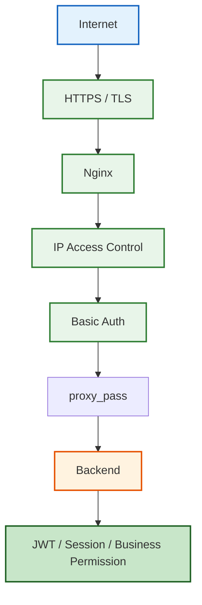

Basic Auth 并不是完整用户认证系统。

它真正适合的是：

> 在请求进入应用之前，为内部系统、测试环境和管理页面增加一道简单、低成本的访问保护。

而要让这道保护真正成立，还必须保证：

- 凭证通过 HTTPS 传输
- `.htpasswd` 安全保存
- Backend 不被随意绕过
- Nginx 配置真实加载
- 日志能够完整排障

只有做到这些，Basic Auth 才不仅仅是“会写两行 Nginx 配置”，而是真正成为系统安全边界的一部分。

## 拓展实战：
> 现在有一个管理系统，没有登录页面，只有通过 Basic Auth 认证后才能访问，如何通过 Nginx 实现这个需求？

### 1、创建用户密码文件
```bash
htpasswd -c /etc/nginx/.htpasswd admin
```

### 2、配置Nginx
```Nginx
server {
  listen 80;

  location /server-manage {
    auth_basic "Server Management";
    auth_basic_user_file /etc/nginx/.htpasswd;

    alias /usr/share/nginx/html;
    index server-manage.html;
  }
}
```
当访问/server-manage时，会触发Basic Auth认证，要求输入用户名+密码。

### 3、重启Nginx
```bash
nginx -s reload
```

### 4、访问
访问http://localhost/server-manage， 会弹出Basic Auth认证框，输入用户名和密码即可访问。

### 5、注意事项
- 用户密码文件`.htpasswd`需要安全保存，避免被非法获取。可以使用`htpasswd -c`命令创建新文件，如果文件已存在，可以使用`htpasswd -b`命令添加新用户。