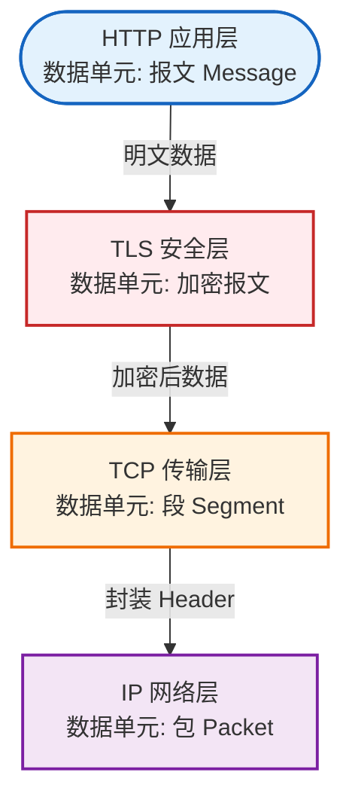
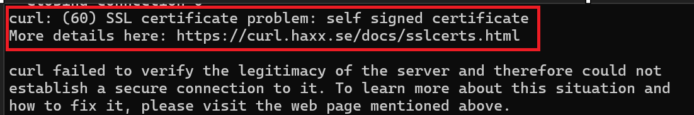
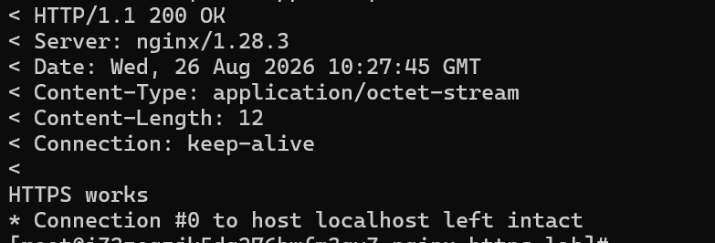
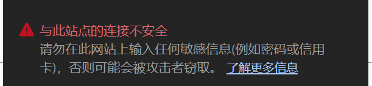
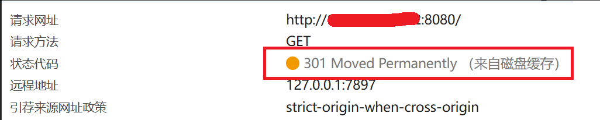
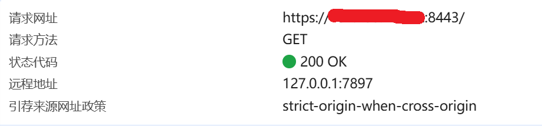
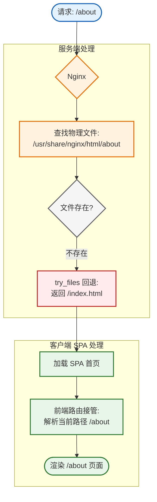

## 一、HTTP 和 HTTPS 的本质区别
HTTP 是应用层协议，负责规定：
- 请求方法，如 GET、POST
- 请求路径
- 请求头
- 请求体
- 响应状态码
- 响应内容

普通 HTTP 的链路可以简化为：

HTTP 内容默认是明文传输的。链路中的中间节点如果能够截获流量，就可能看到甚至修改请求内容。

HTTPS 并不是另一套完全不同的 HTTP，而是：

HTTPS 可以粗略理解为：
```
HTTPS = HTTP + TLS
```
TLS 插在 HTTP 与 TCP 之间，主要解决三个问题：
- **机密性**: 别人截获数据后看不懂。
- **完整性**：数据被修改后能够被发现。
- **身份认证**：客户端可以验证自己连接的是不是目标网站。
因此，HTTPS 并不改变 HTTP 的基本语义。

使用 HTTPS 后，依然存在：
```http
GET /api/users HTTP/1.1
Host: example.com
```
区别是这些 HTTP 内容会先经过 TLS 加密，再通过 TCP 传输。

## 二、完整的 HTTPS 请求链路
访问：
```
https://example.com/api/users?id=1
```
大致会经历：

```mermaid
graph TD
    %% ========== 阶段一：DNS 解析 ==========
    subgraph Phase1 [阶段一：DNS 解析]
        Start([客户端发起请求]) --> Step1{DNS 解析<br/>example.com}
        Step1 -->|解析成功| Step2[获得服务器 IP 地址]
    end

    %% ========== 阶段二：TCP 连接 ==========
    subgraph Phase2 [阶段二：TCP 三次握手]
        Step2 --> Step3[客户端与服务器<br/>建立 TCP 连接]
    end

    %% ========== 阶段三：TLS 握手 ==========
    subgraph Phase3 [阶段三：TLS 握手]
        Step3 --> Step4[客户端发起 TLS 握手]
        Step4 --> Step5[Nginx 返回证书<br/>含公钥]
        Step5 --> Step6{客户端验证证书}
        Step6 -->|验证通过| Step7[双方协商会话密钥]
        Step7 --> Step8[建立加密通道]
    end

    %% ========== 阶段四：HTTP 请求 ==========
    subgraph Phase4 [阶段四：HTTP 请求]
        Step8 --> Step9[客户端发送加密的<br/>HTTP 请求]
        Step9 --> Step10[Nginx 解密请求]
        Step10 --> Step11{请求进入<br/>server / location 匹配}
    end

    %% ========== 阶段五：请求处理 ==========
    subgraph Phase5 [阶段五：请求处理]
        Step11 --> Step12[Nginx 读取静态文件<br/>或 proxy_pass 转发给 Backend]
    end

    %% ========== 阶段六：响应 ==========
    subgraph Phase6 [阶段六：响应返回]
        Step12 --> Step13[Nginx 得到 HTTP 响应]
        Step13 --> Step14[TLS 加密响应]
        Step14 --> Step15[客户端解密并交给<br/>浏览器处理渲染]
    end

    %% ========== 样式定义 ==========
    classDef startend fill:#e3f2fd,stroke:#1565c0,stroke-width:2px;
    classDef process fill:#fff3e0,stroke:#ef6c00,stroke-width:2px;
    classDef decision fill:#f3e5f5,stroke:#7b1fa2,stroke-width:2px;
    classDef secure fill:#e8f5e9,stroke:#2e7d32,stroke-width:2px;
    classDef phase fill:#f5f5f5,stroke:#9e9e9e,stroke-width:1px,stroke-dasharray:5 5;

    classDef phase1 fill:#e3f2fd,stroke:#1565c0,stroke-width:1px;
    classDef phase2 fill:#fff3e0,stroke:#ef6c00,stroke-width:1px;
    classDef phase3 fill:#ffebee,stroke:#c62828,stroke-width:1px;
    classDef phase4 fill:#e8f5e9,stroke:#2e7d32,stroke-width:1px;
    classDef phase5 fill:#f3e5f5,stroke:#7b1fa2,stroke-width:1px;
    classDef phase6 fill:#e3f2fd,stroke:#1565c0,stroke-width:1px;

    class Start,Step15 startend
    class Step3,Step9,Step10,Step13,Step14 process
    class Step1,Step6,Step11 decision
    class Step4,Step5,Step7,Step8 secure

    class Phase1 phase1
    class Phase2 phase2
    class Phase3 phase3
    class Phase4 phase4
    class Phase5 phase5
    class Phase6 phase6
```

最容易忽略的一点是：
> TLS 握手发生在 HTTP 请求进入 server/location 处理之前。

也就是说，Nginx 必须先完成 TLS 握手并解密数据，才知道客户端具体请求了 /api/users 还是 /assets/app.js。

## 三、为什么同时需要对称加密和非对称加密
### 3.1 对称加密
对称加密使用同一个密钥完成加密和解密：
```
明文 + 会话密钥 → 密文
密文 + 会话密钥 → 明文
```
优点是速度快，适合加密大量 HTTP 数据。

问题是：
> 客户端第一次连接服务器时，如何安全地获得这个密钥？

如果直接通过网络发送密钥，攻击者截获密钥后就能解密后续数据。

### 3.2 非对称加密
非对称密码体系包含一对相关密钥：
```
公钥：可以公开
私钥：只能由持有者保存
```
它可用于密钥交换、身份认证和数字签名。

直观理解是：
- 公钥可以告诉所有人。
- 私钥必须保存在服务器上。
- 服务器可以通过私钥证明自己持有对应身份。
- 客户端可以通过证书获得服务器公钥。

非对称密码运算比对称加密慢，不适合直接加密大量业务数据。

### 3.3 TLS 为什么结合两者
TLS 的基本思想是：
```
非对称密码体系、密钥交换和证书
→ 完成身份验证并安全协商会话密钥

对称加密
→ 使用会话密钥加密后续 HTTP 数据
```
因此不能简单理解为：
> HTTPS 一直使用服务器公钥加密全部 HTTP 数据。

## 四、证书、CA 和证书链
### 4.1 证书是什么
证书可以理解为一份经过签名的电子身份证。
证书中通常包含：

- 证书持有者信息
- 域名信息
- 公钥
- 签发者
- 有效期
- 序列号
- 签名算法
- CA 的数字签名

证书公开并没有问题，因为证书里保存的是公钥，不是私钥。

### 4.2 CA 是什么
CA，即**证书颁发机构**，负责验证证书申请者对域名的控制权，然后签发证书。

常见的公开 CA 包括：

- Let's Encrypt
- DigiCert
- GlobalSign
- Sectigo

CA 使用自己的私钥对证书进行签名。

浏览器使用 CA 的公钥验证签名，从而判断证书是否可信。

### 4.3 证书链
操作系统或浏览器中预装了一批受信任的根证书。

信任关系通常是：
```
浏览器信任根 CA
↓
根 CA 签发中间 CA 证书
↓
中间 CA 签发网站证书
↓
浏览器验证整个证书链
```
这就是证书链。

服务器通常需要提供：
```
网站证书 + 中间 CA 证书
```
根证书通常已经存在于客户端信任库中，不需要服务器重复发送。

### 4.4 自签名证书为什么报警
自签名证书由自己的私钥给自己签名：
```
网站证书
↓
签发者还是自己
```
它依然可以完成 TLS 加密，但浏览器的信任库里没有这个自建 CA 或证书，因此无法建立可信链。

所以浏览器报警并不是说：
> 连接一定没有加密。

而是说：
> 连接可能已经加密，但浏览器无法确认服务器身份可信。

### 4.5 域名与证书的关系
证书需要声明自己适用于哪些域名，现代客户端主要检查 SAN：
```
Subject Alternative Name
```
例如：
```
DNS:localhost
DNS:example.com
DNS:*.example.com
IP:127.0.0.1
```
如果访问：
```
https://api.example.com
```
但证书只包含：
```
DNS:www.example.com
```
即使证书由可信 CA 签发，浏览器仍然会报域名不匹配。
通配符证书：
```
*.example.com
```
通常可以匹配：
```
api.example.com
www.example.com
```
但通常不能匹配：
```
example.com
a.b.example.com
```
## 五、SNI：一个 IP 为什么能部署多个 HTTPS 域名
同一个 IP 可以部署：
```
https://a.example.com
https://b.example.com
```
但 TLS 握手发生在 HTTP 请求之前。此时 Nginx 还没有读到 HTTP 的 Host 请求头，它怎么知道返回哪张证书？
```
答案是 SNI：Server Name Indication
```
客户端会在 TLS ClientHello 中提前告诉服务器目标域名：
```
server_name = a.example.com
```
Nginx根据：
```nginx
listen 443 ssl;
server_name a.example.com;
```
选择对应的 HTTPS server 和证书。
因此：
```
SNI 用于 TLS 握手阶段选择证书
Host 用于 HTTP 阶段表达目标主机
```
二者出现的阶段不同，不应该混为一谈。

## 六、生成自签名证书
执行：
```
openssl req \
  -x509 \
  -nodes \
  -newkey rsa:2048 \
  -keyout nginx/certs/localhost.key \
  -out nginx/certs/localhost.crt \
  -days 365 \
  -subj "/CN=localhost" \
  -addext "subjectAltName=DNS:localhost,IP:127.0.0.1"
```
参数含义：
| 参数                 | 作用                    |
| ------------------ | --------------------- |
| `req`              | 使用证书请求相关功能            |
| `-x509`            | 直接生成自签名证书，而不是只生成 CSR  |
| `-nodes`           | 私钥不设置口令，便于 Nginx 自动启动 |
| `-newkey rsa:2048` | 生成新的 2048 位 RSA 私钥    |
| `-keyout`          | 私钥输出路径                |
| `-out`             | 证书输出路径                |
| `-days 365`        | 有效期 365 天             |
| `-subj`            | 设置证书主题                |
| `-addext`          | 添加 SAN 域名和 IP         |
生成结果：
```
nginx/certs/localhost.crt
nginx/certs/localhost.key
```
其中：
```
localhost.crt → 可以公开的证书
localhost.key → 必须保护的私钥
```
生产环境必须限制私钥的读取权限，不能提交到 Git 仓库。

## 七、建立最小 HTTPS 服务
先不要配置跳转、SPA 和 API，只建立最小 HTTPS 服务。

创建 nginx/conf.d/default.conf：
```Nginx
server {
    listen 443 ssl;
    server_name localhost;

    ssl_certificate     /etc/nginx/certs/localhost.crt;
    ssl_certificate_key /etc/nginx/certs/localhost.key;

    location / {
        return 200 "HTTPS works\n";
    }
}
```
### 7.1 listen 443 ssl
```Nginx
listen 443 ssl;
```
含义：
- 监听容器内 TCP 443 端口。
- 此端口使用 TLS。
- 客户端需要先完成 TLS 握手。
- 握手成功后，Nginx 才处理其中的 HTTP 请求。

ssl 不是“把响应内容自动改成 HTTPS”，而是声明这个监听端口期望接收 TLS 流量。

### 7.2 ssl_certificate
```Nginx
ssl_certificate /etc/nginx/certs/localhost.crt;
```
告诉 Nginx：
- TLS 握手时向客户端发送哪张证书。
- 证书中包含服务器公钥和域名等信息。

真实 CA 环境中，这里通常使用包含站点证书和中间证书的完整证书链文件，例如 fullchain.pem。

### 7.3 ssl_certificate_key
```Nginx
ssl_certificate_key /etc/nginx/certs/localhost.key;
```
告诉 Nginx：
- 使用哪一个私钥完成 TLS 身份认证相关的密码学操作。
- 该私钥必须和证书中的公钥匹配。
私钥不会发送给客户端。

## 八、使用 Docker Compose 运行
创建 docker-compose.yml：
```yml
services:
  nginx:
    image: nginx:1.28-alpine
    container_name: nginx-https
    ports:
      - "8080:80"
      - "8443:443"
    volumes:
      - ./nginx/conf.d:/etc/nginx/conf.d:ro
      - ./nginx/certs:/etc/nginx/certs:ro
      - ./frontend:/usr/share/nginx/html:ro
```
启动：
```bash
docker compose up -d
```
检查：
```bash
docker compose ps
docker logs nginx-https
```
测试配置：
```bash
docker compose exec nginx nginx -t
```
查看最终生效配置：
```bash
docker compose exec nginx nginx -T
```

## 九、使用 curl 观察 HTTPS
直接访问：
```bash
curl -v https://localhost:8443/
```
通常会失败，出现类似：


原因不是 TLS 握手完全没有发生，而是 curl 无法把该证书连接到受信任根 CA。

使用：
```bash
curl -vk https://localhost:8443/
```
其中：
- -v：显示连接、TLS 和 HTTP 过程。
- -k：跳过证书可信性和主机身份验证。
成功后应看到：


警告：
> curl -k 只适合实验和排错，不代表证书已经可信，也不应成为生产环境的默认解决方案。


更合理的实验方式是明确告诉 curl 信任哪张证书：
```
curl -v \
  --cacert nginx/certs/localhost.crt \
  https://localhost:8443/
```
因为证书 SAN 中包含 localhost，域名检查也能通过。

此时通过浏览器访问就会出现如下问题：


## 十、HTTP 为什么不能直接交给 HTTPS server

执行：

```bash
curl -v http://localhost:8443/
```

注意这里故意在 HTTPS 端口使用了 `http://`。

Nginx 的 `443` 监听端口期待收到 TLS ClientHello，但客户端发送的是普通 HTTP 文本：

```http
GET / HTTP/1.1
```

协议不匹配，常见结果是：

```text
< HTTP/1.1 400 Bad Request
< Server: nginx/1.28.3
< Date: Thu, 27 Aug 2026 03:01:04 GMT
< Content-Type: text/html
< Content-Length: 255
< Connection: close
```

反过来执行：

```bash
curl -vk https://localhost:8080/
```

客户端向普通 HTTP 端口发送 TLS 握手数据，HTTP server 无法将其解析为合法 HTTP 请求，通常会报 TLS 连接失败或连接被重置。

## 十一、配置 HTTP 跳转 HTTPS

加入一个监听 `80` 的 server：

```nginx
server {
    listen 80;
    server_name localhost;

    return 301 https://$host:8443$request_uri;
}
```

实验环境使用宿主机 `8443`，所以跳转地址需要显式携带 `:8443`。

真实生产环境通常直接使用：

```nginx
return 301 https://$host$request_uri;
```

因为 HTTPS 默认端口就是 `443`。

重新加载配置：

```bash
docker compose exec nginx nginx -t
docker compose exec nginx nginx -s reload
```

访问：

```text
http://ip:8080/
```

浏览器网络面板中可以看到两步结果：





## 十二、为什么通常同时监听 80 和 443

只开放 `443` 并不能让访问：

```text
http://example.com
```

的用户自动转成 HTTPS。

如果 `80` 没有服务，浏览器只会连接失败，根本收不到跳转响应。

因此生产环境通常使用：

```text
80：接收 HTTP，返回重定向
443：完成 TLS，提供业务服务
```

## 十三、`$host` 和 `$request_uri`

### 13.1 `$host`

`$host` 是客户端请求的域名，例如：

```text
http://example.com
```

此时 `$host` 的值就是：

```text
example.com
```

### 13.2 `$request_uri`

`$request_uri` 是客户端请求的完整 URI，例如：

```text
http://example.com/foo/bar?baz=qux
```

此时 `$request_uri` 的值就是：

```text
/foo/bar?baz=qux
```

## 十四、301 与 308 的区别

两者都是永久重定向，但对请求方法的语义不同。

### 14.1 301

```nginx
return 301 https://$host$request_uri;
```

`301` 对于 `GET` 和 `HEAD` 很常见。

但某些客户端在处理非 `GET` 请求时，可能会把原来的 `POST` 改成 `GET`。

### 14.2 308

```nginx
return 308 https://$host$request_uri;
```

`308` 明确要求：

- 保留请求方法。
- 保留请求体。

例如：

```http
POST http://example.com/api/orders
```

经过 `308` 后仍应为：

```http
POST https://example.com/api/orders
```

不过必须认识一个现实问题：

> 即使使用 308，第一次 HTTP 请求的敏感请求体也已经通过明文网络发送到了 80 端口。

因此 API 客户端不应该依赖跳转来获得安全性，而应该从一开始就请求 HTTPS。

## 十五、加入 SPA 和静态资源

创建 `frontend/index.html`：

```html
<!doctype html>
<html lang="zh-CN">
<head>
  <meta charset="UTF-8">
  <meta name="viewport" content="width=device-width, initial-scale=1.0">
  <title>Nginx HTTPS Lab</title>
</head>
<body>
  <h1>Nginx HTTPS 与 TLS 实战</h1>
  <p id="status">正在加载……</p>
  <script src="/assets/app.js"></script>
</body>
</html>
```

创建 `frontend/assets/app.js`：

```javascript
document.querySelector('#status').textContent =
  `当前页面协议：${window.location.protocol}`;
```

在 HTTPS server 中配置：

```nginx
root /usr/share/nginx/html;
index index.html;

location /assets/ {
    try_files $uri =404;

    expires 7d;
    add_header Cache-Control "public";
}

location / {
    try_files $uri $uri/ /index.html;
}
```

请求 `/about` 时：



验证：

```bash
curl -kI https://localhost:8443/
curl -kI https://localhost:8443/about
curl -kI https://localhost:8443/assets/app.js
```

错误的静态资源不能回退到 SPA，否则 JS 资源请求可能得到 HTML：

```bash
curl -ki https://localhost:8443/assets/not-found.js
```

应该返回 `404`。
