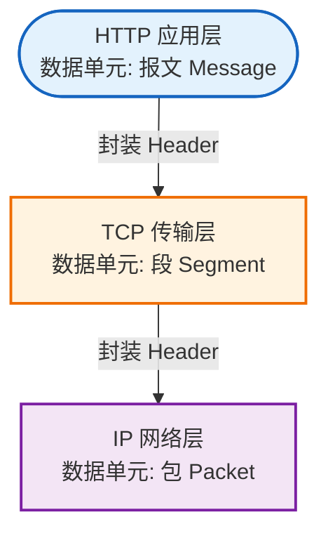

## 一、HTTP 和 HTTPS 的本质区别
HTTP 是应用层协议，负责规定：
- 请求方法，如 GET、POST
- 请求路径
- 请求头
- 请求体
- 响应状态码
- 响应内容

普通 HTTP 的链路可以简化为：

HTTP 内容默认是明文传输的。链路中的中间节点如果能够截获流量，就可能看到甚至修改请求内容。

HTTPS 并不是另一套完全不同的 HTTP，而是：

HTTPS 可以粗略理解为：
```
HTTPS = HTTP + TLS
```
TLS 插在 HTTP 与 TCP 之间，主要解决三个问题：
- **机密性**: 别人截获数据后看不懂。
- **完整性**：数据被修改后能够被发现。
- **身份认证**：客户端可以验证自己连接的是不是目标网站。
因此，HTTPS 并不改变 HTTP 的基本语义。

使用 HTTPS 后，依然存在：
```http
GET /api/users HTTP/1.1
Host: example.com
```
区别是这些 HTTP 内容会先经过 TLS 加密，再通过 TCP 传输。

## 二、完整的 HTTPS 请求链路
访问：
```
https://example.com/api/users?id=1
```
大致会经历：

最容易忽略的一点是：
> TLS 握手发生在 HTTP 请求进入 server/location 处理之前。

也就是说，Nginx 必须先完成 TLS 握手并解密数据，才知道客户端具体请求了 /api/users 还是 /assets/app.js。

## 三、为什么同时需要对称加密和非对称加密
### 3.1 对称加密
对称加密使用同一个密钥完成加密和解密：
```
明文 + 会话密钥 → 密文
密文 + 会话密钥 → 明文
```
优点是速度快，适合加密大量 HTTP 数据。

问题是：
> 客户端第一次连接服务器时，如何安全地获得这个密钥？

如果直接通过网络发送密钥，攻击者截获密钥后就能解密后续数据。

### 3.2 非对称加密
非对称密码体系包含一对相关密钥：
```
公钥：可以公开
私钥：只能由持有者保存
```
它可用于密钥交换、身份认证和数字签名。

直观理解是：
- 公钥可以告诉所有人。
- 私钥必须保存在服务器上。
- 服务器可以通过私钥证明自己持有对应身份。
- 客户端可以通过证书获得服务器公钥。

非对称密码运算比对称加密慢，不适合直接加密大量业务数据。

### 3.3 TLS 为什么结合两者
TLS 的基本思想是：
```
非对称密码体系、密钥交换和证书
→ 完成身份验证并安全协商会话密钥

对称加密
→ 使用会话密钥加密后续 HTTP 数据
```
因此不能简单理解为：
> HTTPS 一直使用服务器公钥加密全部 HTTP 数据。

## 四、证书、CA 和证书链
### 4.1 证书是什么
证书可以理解为一份经过签名的电子身份证。
证书中通常包含：

- 证书持有者信息
- 域名信息
- 公钥
- 签发者
- 有效期
- 序列号
- 签名算法
- CA 的数字签名

证书公开并没有问题，因为证书里保存的是公钥，不是私钥。

### 4.2 CA 是什么
CA，即**证书颁发机构**，负责验证证书申请者对域名的控制权，然后签发证书。

常见的公开 CA 包括：

- Let's Encrypt
- DigiCert
- GlobalSign
- Sectigo

CA 使用自己的私钥对证书进行签名。

浏览器使用 CA 的公钥验证签名，从而判断证书是否可信。

