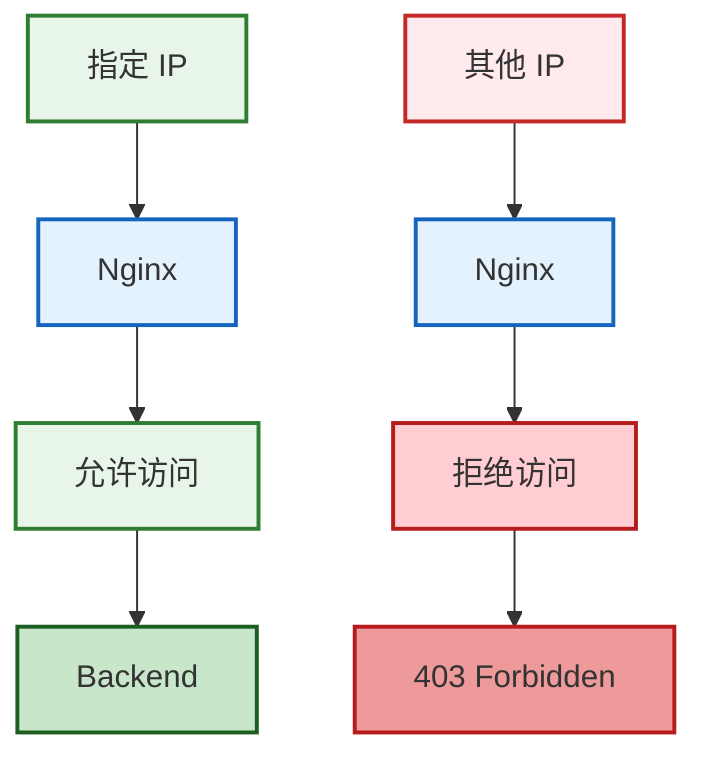
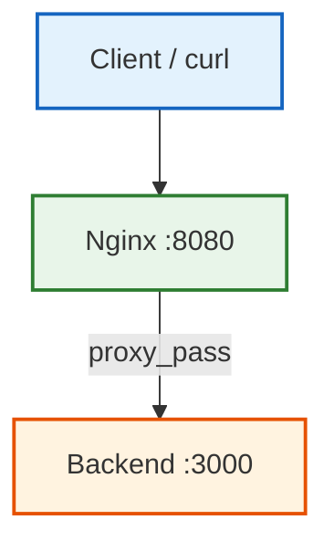
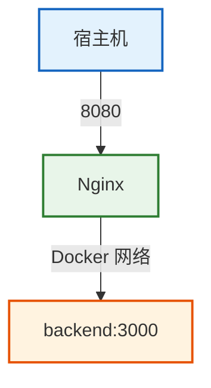

在生产环境中，Nginx 不只是反向代理服务器，它通常还是流量进入业务系统前的第一道安全防线。

这一章我们先从最基础的 IP 访问控制开始，理解 `allow`、`deny` 到底如何工作，并通过 Docker Compose 搭建实验环境，使用 `curl`、Nginx 日志、Backend 日志和 `nginx -T` 验证配置是否真正生效。

## 一、实验环境与目标

假设系统中存在一个后台接口：

```
/admin
```

我们的目标是：



最重要的一点是：

> 如果请求被 Nginx 拒绝，那么请求不应该继续进入 Backend。

本次实验架构如下：



项目目录：

```
nginx-security-lab/ 
│ 
├── docker-compose.yml 
│ 
├── nginx/ 
│ 		└── conf.d/ 
│ 			└── default.conf 
│ 
└── backend/ 
		├── Dockerfile 
        └── server.js
```

Backend 使用一个最简单的 Node.js HTTP 服务。

`backend/server.js`

```JavaScript
const http = require("http");

const server = http.createServer((req, res) => {
    console.log(
        `[backend] ${req.method} ${req.url} from ${req.socket.remoteAddress}`
    );

    res.writeHead(200, {
        "Content-Type": "application/json"
    });

    res.end(JSON.stringify({
        message: "backend ok",
        method: req.method,
        url: req.url,
        remoteAddress: req.socket.remoteAddress
    }));
});

server.listen(3000, "0.0.0.0", () => {
    console.log("Backend running on port 3000");
});
```

`backend/Dockerfile`

```Dockerfile
FROM node:22-alpine

WORKDIR /app

COPY server.js .

CMD ["node", "server.js"]
```

`docker-compose.yml`

```YAML
services:
  nginx:
    image: nginx:1.28-alpine
    ports:
      - "8080:80"
    volumes:
      - ./nginx/conf.d:/etc/nginx/conf.d
    depends_on:
      - backend

  backend:
    build:
      context: ./backend
```

这里 Backend 没有暴露宿主机端口。

因此访问链路是：



这样可以保证实验请求必须经过 Nginx。

初始 Nginx 配置：

```Nginx
server {

    listen 80;

    location / {
        proxy_pass http://backend:3000;
    }

    location /admin {
        proxy_pass http://backend:3000;
    }
}
```

启动：

```Shell
docker compose up -d --build
```

检查：

```Shell
docker compose ps
```

首先不要急着增加安全配置。

先建立一个基线：

```Shell
curl -i http://localhost:8080/admin
```

正常应该返回：

```Shell
HTTP/1.1 200 OK
```

再查看 Backend：

```Shell
docker compose logs backend
```

应该能够看到：

```Shell
[backend] GET /admin ...
```

这一步证明原始请求链路本身是正常的。

以后排查安全配置时，这个思路非常重要：

> 先证明原始链路正常，再增加安全规则。

否则出现 403、404 或 502 时，很容易判断错原因。
