在生产环境中，Nginx 不只是反向代理服务器，它通常还是流量进入业务系统前的第一道安全防线。

这一章我们先从最基础的 IP 访问控制开始，理解 `allow`、`deny` 到底如何工作，并通过 Docker Compose 搭建实验环境，使用 `curl`、Nginx 日志、Backend 日志和 `nginx -T` 验证配置是否真正生效。

## 一、实验环境与目标

假设系统中存在一个后台接口：

```
/admin
```

我们的目标是：

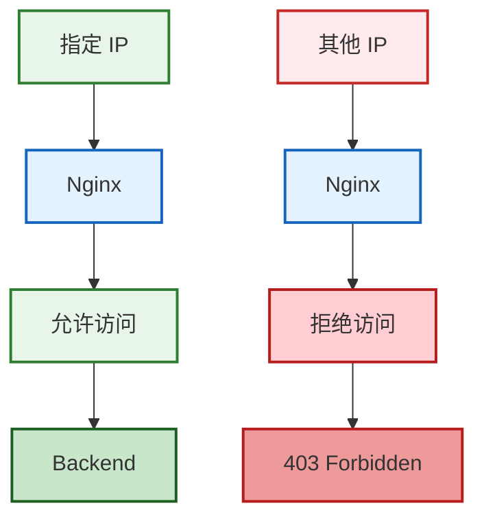

最重要的一点是：

> 如果请求被 Nginx 拒绝，那么请求不应该继续进入 Backend。

本次实验架构如下：

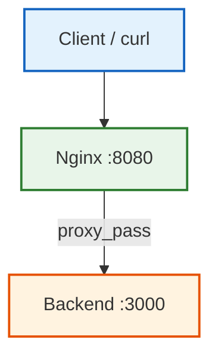

项目目录：

```
nginx-security-lab/
├── docker-compose.yml
├── nginx/
│   └── conf.d/
│       └── default.conf
└── backend/
    ├── Dockerfile
    └── server.js
```

Backend 使用一个最简单的 Node.js HTTP 服务。

`backend/server.js`

```javascript
const http = require("http");

const server = http.createServer((req, res) => {
    console.log(
        `[backend] ${req.method} ${req.url} from ${req.socket.remoteAddress}`
    );

    res.writeHead(200, {
        "Content-Type": "application/json"
    });

    res.end(JSON.stringify({
        message: "backend ok",
        method: req.method,
        url: req.url,
        remoteAddress: req.socket.remoteAddress
    }));
});

server.listen(3000, "0.0.0.0", () => {
    console.log("Backend running on port 3000");
});
```

`backend/Dockerfile`

```dockerfile
FROM node:22-alpine

WORKDIR /app

COPY server.js .

CMD ["node", "server.js"]
```

`docker-compose.yml`

```yaml
services:
  nginx:
    image: nginx:1.28-alpine
    ports:
      - "8080:80"
    volumes:
      - ./nginx/conf.d:/etc/nginx/conf.d
    depends_on:
      - backend

  backend:
    build:
      context: ./backend
```

这里 Backend 没有暴露宿主机端口。

因此访问链路是：

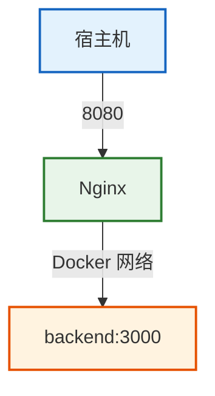

这样可以保证实验请求必须经过 Nginx。

初始 Nginx 配置：

```nginx
server {

    listen 80;

    location / {
        proxy_pass http://backend:3000;
    }

    location /admin {
        proxy_pass http://backend:3000;
    }
}
```

启动：

```bash
docker compose up -d --build
```

检查：

```bash
docker compose ps
```

首先不要急着增加安全配置。

先建立一个基线：

```bash
curl -i http://localhost:8080/admin
```

正常应该返回：

```
HTTP/1.1 200 OK
```

再查看 Backend：

```bash
docker compose logs backend
```

应该能够看到：

```
[backend] GET /admin ...
```

这一步证明原始请求链路本身是正常的。

以后排查安全配置时，这个思路非常重要：

> 先证明原始链路正常，再增加安全规则。

否则出现 403、404 或 502 时，很容易判断错原因。

## 二、allow 和 deny 的工作原理

Nginx 可以通过 `allow`、`deny` 控制客户端是否允许访问某个资源。

例如：

```nginx
location /admin {

    allow 192.168.1.100;
    deny all;

    proxy_pass http://backend:3000;
}
```

意思是：

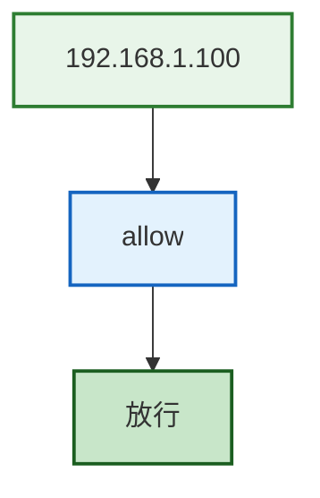

其他客户端：

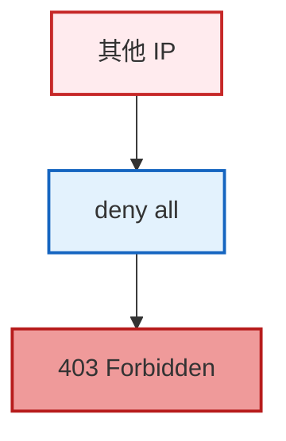

`allow` 和 `deny` 支持单 IP、网段以及 IPv6。

单 IP：

```nginx
allow 192.168.1.100;
```

网段：

```nginx
allow 192.168.1.0/24;
```

IPv6：

```nginx
allow 2001:db8::/32;
```

全部拒绝：

```nginx
deny all;
```

最常见的白名单写法是：

```nginx
allow 192.168.1.0/24;
deny all;
```

这里有一个必须掌握的规则：

> `allow` 和 `deny` 按配置顺序检查，命中后就确定结果。

例如：

```nginx
allow 192.168.1.0/24;
deny all;
```

客户端 `192.168.1.20` 首先匹配 `allow 192.168.1.0/24`，因此被允许访问。

但如果写成：

```nginx
deny all;
allow 192.168.1.0/24;
```

请求首先命中 `deny all;`，直接被拒绝，后面的 `allow` 不会再改变结果。

所以这两个配置：

```nginx
allow 192.168.1.0/24;
deny all;
```

和：

```nginx
deny all;
allow 192.168.1.0/24;
```

结果完全不同。

## 三、实战：限制 /admin 访问

现在修改配置：

```nginx
location /admin {

    deny all;

    proxy_pass http://backend:3000;
}
```

先检查语法：

```bash
docker compose exec nginx nginx -t
```

正常应该看到：

```
syntax is ok
test is successful
```

然后重新加载：

```bash
docker compose exec nginx nginx -s reload
```

再次请求：

```bash
curl -i http://localhost:8080/admin
```

预期返回：

```
HTTP/1.1 403 Forbidden
```

这里的状态码非常重要。

`403 Forbidden` 表示：

> Nginx 理解客户端请求，但拒绝客户端访问。

它和下面两个状态码不是一回事：

- `401 Unauthorized`
- `404 Not Found`

但只看到一个 403，并不能算完整验证。

继续查看 Backend：

```bash
docker compose logs backend
```

如果新的 `/admin` 请求没有出现在日志中，就可以证明：

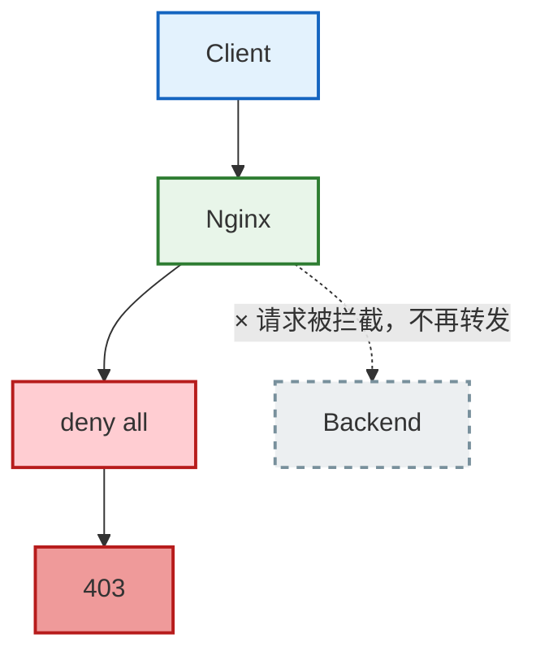

也就是说请求是在 Nginx 层被拦截的。

还可以继续使用：

```bash
docker compose exec nginx nginx -T
```

检查 Nginx 当前实际加载的配置。

应该能够找到：

```nginx
location /admin {

    deny all;

    proxy_pass http://backend:3000;
}
```

这里需要区分两个命令：

- `nginx -t`：主要解决配置语法有没有问题
- `nginx -T`：除了检查配置，还会输出 Nginx 当前加载的完整配置

所以以后遇到"我明明修改了配置，为什么没有生效？"，不要直接猜。

先执行：

```bash
nginx -T
```

确认你修改的配置文件到底有没有被 Nginx 加载。

## 四、最容易踩坑的客户端 IP 问题

现在进行一个故障实验。

把配置改成：

```nginx
location /admin {

    allow 127.0.0.1;
    deny all;

    proxy_pass http://backend:3000;
}
```

很多人的直觉是：

> 我执行的是 `curl http://localhost:8080/admin`，`localhost` 就是 `127.0.0.1`，所以应该返回 200。

这个结论并不可靠。

因为 `localhost` 是你访问的目标地址，不代表 Nginx 看到的客户端来源地址一定是 `127.0.0.1`。

Docker 中可能经过：

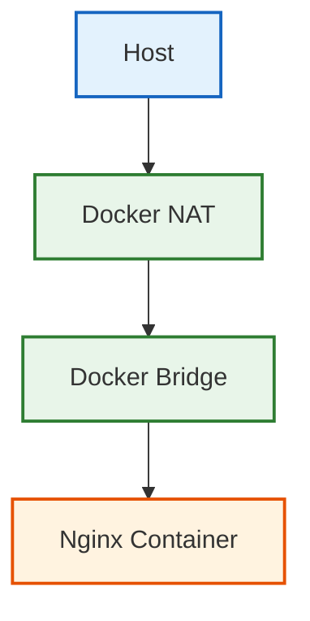

因此 Nginx 看到的客户端地址可能是 `172.18.0.1`，而不是 `127.0.0.1`。

所以即使配置：

```nginx
allow 127.0.0.1;
deny all;
```

请求依然可能返回 `403`。

这时候不能下结论"`allow` 没生效"。

真正的问题可能是：

> 你判断错了 Nginx 实际看到的客户端 IP。

可以通过 access log 验证。

配置：

```nginx
server {

    listen 80;

    access_log /var/log/nginx/access.log;

    location / {
        proxy_pass http://backend:3000;
    }

    location /admin {

        allow 127.0.0.1;
        deny all;

        proxy_pass http://backend:3000;
    }
}
```

重新加载后访问：

```bash
curl -i http://localhost:8080/admin
```

查看日志：

```bash
docker compose exec nginx cat /var/log/nginx/access.log
```

可能看到：

```
172.18.0.1 - - [...]
```

日志中的来源 IP，才是 Nginx 真正看到的客户端地址。

这也是 IP 访问控制最关键的知识点：

> `allow` 和 `deny` 判断的是 Nginx 当前连接看到的客户端 IP，而不是你主观认为的客户端 IP。

## 五、生产环境中的真实 IP 与代理问题

在简单架构中：

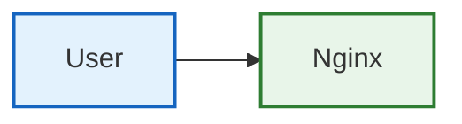

Nginx 的 `$remote_addr` 通常就是用户真实 IP。

但是生产环境往往是：

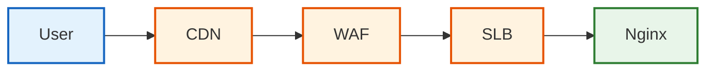

这时候 Nginx 的上一跳可能是 SLB。

因此 `$remote_addr` 可能记录的是 SLB IP，而不是 User IP。

如果没有意识到这一点，就可能出现非常严重的误配置。

例如你以为：

> 我正在限制某个用户 IP

实际上你限制的可能是：

- CDN
- WAF
- SLB

最终导致大量正常用户无法访问。

代理服务器通常会通过 `X-Forwarded-For` 传递原始客户端 IP。

例如：

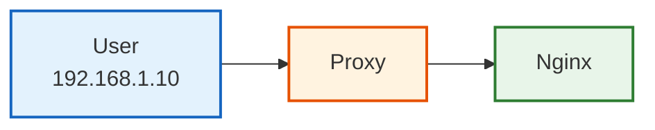

Header 可能是：

```
X-Forwarded-For: 192.168.1.10
```

但这里还有一个安全问题：

> 不能无条件相信 `X-Forwarded-For`。

因为客户端自己也可以伪造 Header：

```bash
curl \
  -H "X-Forwarded-For: 127.0.0.1" \
  http://example.com
```

所以真正的生产环境还需要建立"可信代理边界"。

Nginx 中通常会涉及：

- `set_real_ip_from`
- `real_ip_header`

核心思想是：

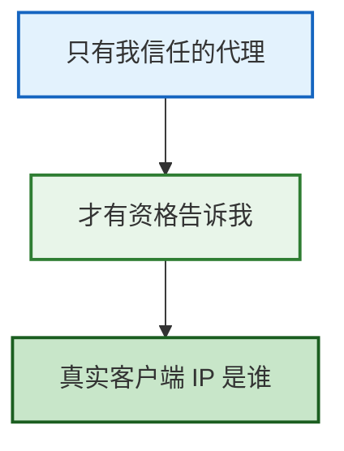

这比简单读取一个 Header 要安全得多。

另外需要明确：

> `allow` / `deny` 并不是防火墙。

它属于 HTTP 层访问控制，请求其实已经到达了 Nginx，只是 Nginx 决定是否继续处理这个 HTTP 请求。

可以理解为：

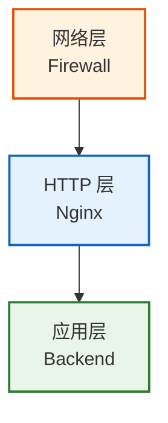

真正的生产安全通常不是依赖单一措施，而是多层防护。

## 六、如何证明安全配置真的生效

这一节最重要的能力，其实不是记住 `allow`、`deny`，而是建立一套固定的验证方法。

以后配置 Nginx 安全规则，可以从三个视角验证。

**客户端视角：**

```bash
curl -i http://localhost:8080/admin
```

观察：

- HTTP 状态码
- 响应头
- 响应内容

**Nginx 视角：**

```bash
nginx -t    # 验证语法
nginx -T    # 验证实际加载的配置
```

再结合 `access.log`、`error.log`，确认 Nginx 是如何处理请求的。

**Backend 视角：**

```bash
docker compose logs backend
```

确认请求有没有最终到达业务服务。

因此一个完整的验证链路应该是：

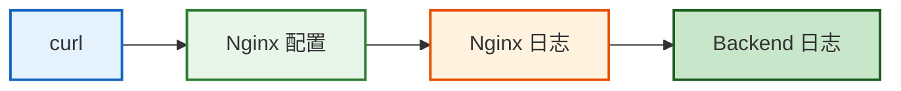

只有这些证据能够互相对应，才能真正证明：

> Nginx 配置按照我们的理解生效了。

最后总结这一节需要掌握的几个核心结论：

1. `allow` / `deny` 用于 Nginx HTTP 层 IP 访问控制。
2. `allow` / `deny` 按配置顺序匹配。
3. `deny` 命中后通常直接返回 403，请求不会继续进入 Backend。
4. `localhost` 不代表 Nginx 一定看到 `127.0.0.1`。
5. Docker、CDN、WAF、SLB 都可能改变 Nginx 看到的来源 IP。
6. `X-Forwarded-For` 不能无条件信任。
7. 配置是否生效，必须通过 `curl`、`nginx -T`、Nginx 日志和 Backend 日志共同验证。

下一步将继续学习 Nginx 的 HTTP Basic Auth，通过用户名和密码保护 `/admin`，并进一步理解 401 与 403 的区别、`.htpasswd` 的作用，以及为什么 Basic Auth 必须和 HTTPS 配合使用。
