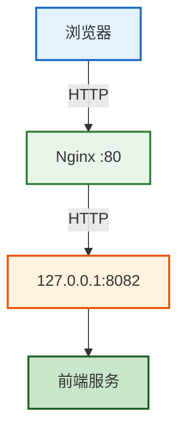
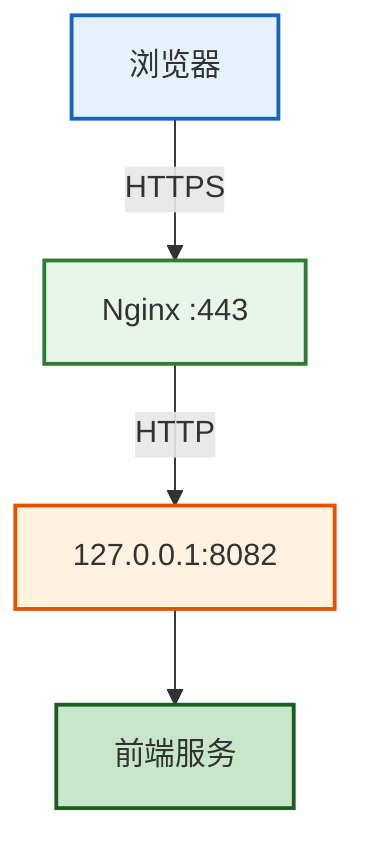
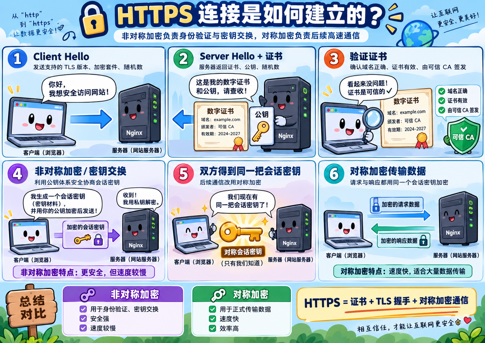
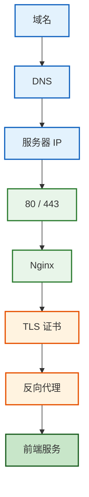
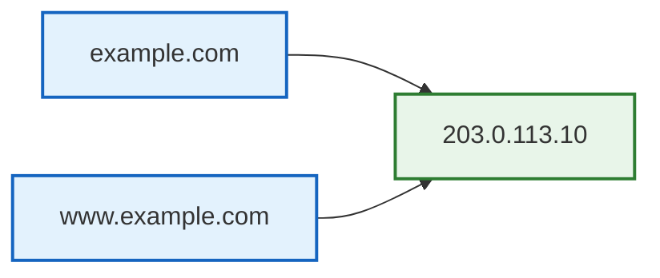
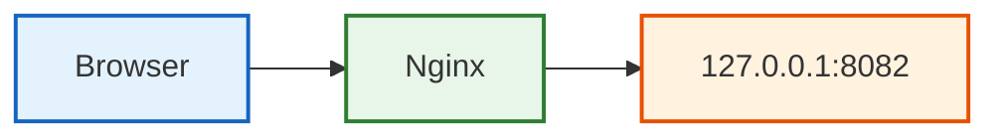
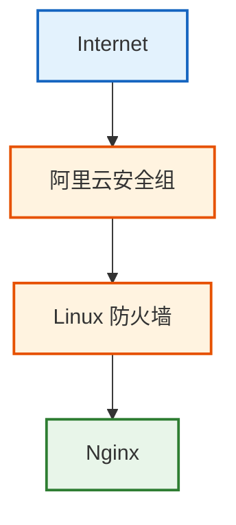
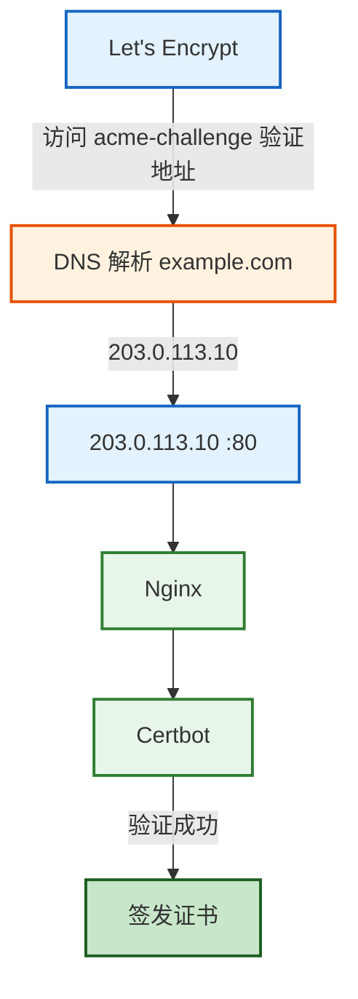
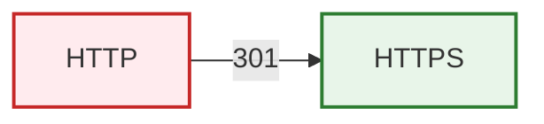
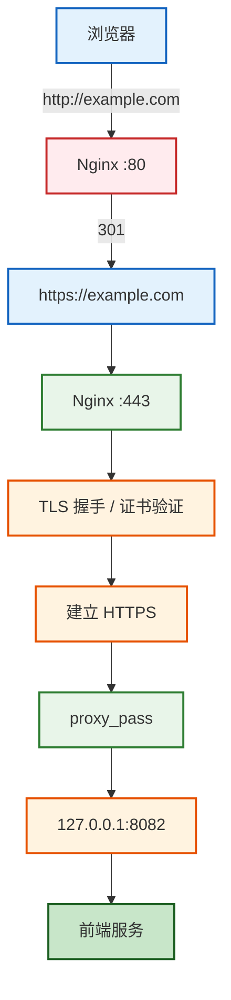

本文记录一次完整的 HTTPS 配置过程：从一个只能通过 HTTP 访问的网站，到使用 Let's Encrypt + Certbot 免费签发证书，最终实现 HTTPS 访问与 HTTP 自动跳转。

当前环境：

| 项目 | 内容 |
|------|------|
| 服务器 | Alibaba Cloud Linux 3 |
| 公网 IP | 203.0.113.10 |
| 域名 | example.com / www.example.com |
| 前端服务 | 127.0.0.1:8082 |
| Web Server | Nginx |

> 本文域名与公网 IP 均为脱敏后的示例值，操作步骤不受影响。

最开始网站只能通过 `http://example.com` 访问，目标是实现：

- `https://example.com`
- `https://www.example.com`

并且让 HTTP 自动跳转 HTTPS。

## 一、先理解整个 HTTPS 架构

原来的请求链路：



配置 HTTPS 后：



这里有一个非常重要的点：

> HTTPS 并不是把 8082 服务改成 HTTPS，而是让 Nginx 负责 TLS 加密。

也就是说：

> 用户 ← HTTPS → Nginx ← HTTP → 前端容器

这叫 **TLS Termination** —— TLS 在 Nginx 这里终止。

那「浏览器 → Nginx」之间的 HTTPS 连接究竟是怎么建立的？核心就是 TLS 握手：非对称加密负责身份验证与密钥交换，对称加密负责后续高速通信。



所以你的前端容器继续监听 `127.0.0.1:8082` 完全没问题。

整个 HTTPS 能工作的前提可以理解成一条链路：



其中任何一层出问题，HTTPS 都可能访问失败。

## 二、先处理 DNS 和 Nginx

### 1、DNS 配置

服务器公网 IP 是 `203.0.113.10`，所以需要给两个域名配置 A 记录：

| 主机记录 | 类型 | 记录值 |
|----------|------|--------|
| @ | A | 203.0.113.10 |
| www | A | 203.0.113.10 |

这里 `@` 代表根域名 `example.com`，`www` 代表 `www.example.com`。

最终关系：



可以使用 `nslookup` 验证：

```bash
nslookup example.com
nslookup www.example.com
```

正常应该都返回 `203.0.113.10`。

我这里一开始遇到的问题就是：`www.example.com` 可以访问，但是 `example.com` 不能访问。

执行：

```bash
nslookup example.com
```

发现没有 IP。而：

```bash
nslookup www.example.com
```

可以得到 `203.0.113.10`。

问题本质不是 Nginx，也不是 HTTPS，而是：

> 根域名没有 DNS A 记录

补上 `@ → 203.0.113.10` 之后问题解决。

### 2、HTTP Nginx 配置

申请证书之前，我的 Nginx 配置：

```nginx
upstream frontend_active {
    server 127.0.0.1:8082;
}

server {
    listen 80;
    listen [::]:80;

    server_name example.com www.example.com;

    location / {
        proxy_pass http://frontend_active;

        proxy_set_header Host $host;
        proxy_set_header X-Real-IP $remote_addr;
        proxy_set_header X-Forwarded-For $proxy_add_x_forwarded_for;
        proxy_set_header X-Forwarded-Proto $scheme;
    }
}
```

这里有几个核心配置。

**upstream**

```nginx
upstream frontend_active {
    server 127.0.0.1:8082;
}
```

相当于给 `127.0.0.1:8082` 起了一个名字 `frontend_active`。

所以：

```nginx
proxy_pass http://frontend_active;
```

实际上就是：

```nginx
proxy_pass http://127.0.0.1:8082;
```

这种方式还有一个好处：如果使用蓝绿部署（`8081 = blue`，`8082 = green`），只需要修改 upstream 里的端口：

```nginx
upstream frontend_active {
    server 127.0.0.1:8081;
}
```

或者：

```nginx
upstream frontend_active {
    server 127.0.0.1:8082;
}
```

不需要修改其他代理配置。

**listen 80**

`listen 80;` 表示监听 IPv4 的 80 端口，而 `listen [::]:80;` 表示监听 IPv6 的 80 端口。

HTTP 默认端口就是 `80`，所以 `http://example.com` 实际上默认访问 `example.com:80`。

**server_name**

```nginx
server_name example.com www.example.com;
```

表示：

> 当请求 Host 是这两个域名时，由这个 server 处理。

例如 `Host: example.com`，Nginx 会找到这个 server 块。

所以正式使用域名时，不建议一直写 `server_name _;`，而应该明确写域名。

**proxy_pass**

`proxy_pass http://frontend_active;` 表示：

> Nginx 接收到请求后，把请求转发给前端服务。

请求链路：



这就是反向代理。

**proxy_set_header**

`proxy_set_header Host $host;` 把用户原始访问域名传给后端。如果访问 `https://example.com`，后端能够收到：

```text
Host: example.com
```

再比如 `proxy_set_header X-Real-IP $remote_addr;` 表示把用户 IP 传递给后端；`proxy_set_header X-Forwarded-For $proxy_add_x_forwarded_for;` 用于记录代理链。

而 `proxy_set_header X-Forwarded-Proto $scheme;` 在 HTTPS 架构里尤其重要。

因为「用户 → Nginx」使用 HTTPS，但是「Nginx → 8082」使用 HTTP，所以 Nginx 通过：

```text
X-Forwarded-Proto: https
```

告诉后端：

> 用户原始访问协议其实是 HTTPS。

修改配置之后，执行 `nginx -t` 检查 Nginx 配置，正常：

```text
syntax is ok
test is successful
```

然后执行 `systemctl reload nginx` 重新加载配置。

这里通常优先 `reload` 而不是 `restart`，因为 reload 一般不会直接终止已有连接。

## 三、安装 Certbot 并申请证书

HTTPS 需要 TLS 证书。这里使用 **Let's Encrypt** 免费签发证书，并使用 **Certbot** 完成自动申请。

它们不是一个东西：

| 名称 | 角色 |
|------|------|
| Let's Encrypt | CA，负责签发证书 |
| Certbot | 客户端，负责申请、安装、续期 |

### 1、端口准备

首先需要保证阿里云安全组开放 `TCP 80` 和 `TCP 443`：

- HTTP 默认端口：`80`
- HTTPS 默认端口：`443`

我还检查了服务器防火墙：

```bash
firewall-cmd --list-ports
```

返回：

```text
FirewallD is not running
```

但是要注意：Linux 防火墙和阿里云安全组不是一个东西。请求实际是：



所以即使 Linux 防火墙没开，阿里云安全组如果没放行 443，HTTPS 仍然访问不了。

### 2、安装 Certbot

执行指令：

```bash
python3.11 -m venv /opt/certbot
```

这里：

- `python3.11` 表示使用 Python 3.11
- `-m venv` 表示调用 Python 自带的虚拟环境模块
- `/opt/certbot` 表示把 Certbot 环境放这里

使用虚拟环境有一个好处：`系统 Python` 和 `Certbot Python` 隔离，避免因为升级 Certbot 依赖而影响 `dnf`、系统脚本、系统管理工具。

然后升级 pip：

```bash
/opt/certbot/bin/pip install --upgrade pip
```

安装 Certbot：

```bash
/opt/certbot/bin/pip install certbot certbot-nginx
```

这里 `certbot` 是核心程序，`certbot-nginx` 是 Nginx 插件。它允许 Certbot 自动读取 Nginx、修改 Nginx、部署证书。

最终执行：

```bash
/opt/certbot/bin/certbot --version
```

得到：

```text
certbot 5.8.0
```

为了以后直接执行 `certbot`，创建软链：

```bash
ln -s /opt/certbot/bin/certbot /usr/local/bin/certbot
```

相当于 `/usr/local/bin/certbot → /opt/certbot/bin/certbot`，所以 `certbot --version` 就能直接执行。

### 3、正式申请证书

执行：

```bash
certbot --nginx -d example.com -d www.example.com
```

这里 `--nginx` 表示使用 Nginx 插件，`-d` 表示 domain。

所以这一条命令表示：

> 给 example.com 和 www.example.com 申请一张证书，并自动部署到 Nginx。

申请过程中，Certbot 会联系 Let's Encrypt。Let's Encrypt 不会直接相信「这个域名是我的」，它需要进行验证。大致过程：



所以申请证书之前，为什么一定要确保 DNS 正确、80 可访问、Nginx 正常，原因就在这里。

最终申请成功：

```text
Successfully received certificate.
```

证书文件：

| 文件 | 说明 |
|------|------|
| `/etc/letsencrypt/live/www.example.com/fullchain.pem` | 服务器证书 + 中间证书链 |
| `/etc/letsencrypt/live/www.example.com/privkey.pem` | 私钥 |

私钥绝对不能：

- 上传 GitHub
- 发送给别人
- 放进前端项目

## 四、最终 Nginx 配置发生了什么

Certbot 自动把 Nginx 修改成了类似：

```nginx
upstream frontend_active {
    server 127.0.0.1:8082;
}

server {
    server_name example.com www.example.com;

    location / {
        proxy_pass http://frontend_active;

        proxy_set_header Host $host;
        proxy_set_header X-Real-IP $remote_addr;
        proxy_set_header X-Forwarded-For $proxy_add_x_forwarded_for;
        proxy_set_header X-Forwarded-Proto $scheme;
    }

    listen 443 ssl;
    listen [::]:443 ssl ipv6only=on;

    ssl_certificate /etc/letsencrypt/live/www.example.com/fullchain.pem;
    ssl_certificate_key /etc/letsencrypt/live/www.example.com/privkey.pem;

    include /etc/letsencrypt/options-ssl-nginx.conf;
    ssl_dhparam /etc/letsencrypt/ssl-dhparams.pem;
}
```

这里真正让 HTTPS 工作的是 `listen 443 ssl;`，表示「监听 443 + 启用 TLS」。

然后 `ssl_certificate ...` 告诉 Nginx TLS 证书在哪里，`ssl_certificate_key ...` 告诉 Nginx 私钥在哪里。

而 `include /etc/letsencrypt/options-ssl-nginx.conf;` 是 Certbot 提供的一组 TLS 安全配置。

同时 Certbot 还生成了 HTTP 配置：

```nginx
server {
    if ($host = www.example.com) {
        return 301 https://$host$request_uri;
    }

    if ($host = example.com) {
        return 301 https://$host$request_uri;
    }

    listen 80;
    listen [::]:80;

    server_name example.com www.example.com;

    return 404;
}
```

作用就是：



例如访问 `http://example.com/article/1`，其中 `$host` 等于 `example.com`，`$request_uri` 等于 `/article/1`。

所以：

```nginx
return 301 https://$host$request_uri;
```

最终生成 `https://example.com/article/1`。

`301`（Moved Permanently）表示永久重定向。

最终整个请求链路就变成：



其中真正需要牢牢记住的是：

> 浏览器 →(HTTPS)→ Nginx →(HTTP)→ Frontend，前端 8082 不需要自己处理 HTTPS。

## 五、验证和自动续期

配置完成后，先检查 Nginx：

```bash
nginx -t
systemctl reload nginx
```

测试 HTTP：

```bash
curl -I http://example.com
```

应该看到类似：

```text
HTTP/1.1 301 Moved Permanently
```

说明 HTTP 正在跳 HTTPS。

再测试：

```bash
curl -I https://example.com
```

正常应该返回：

```text
HTTP/1.1 200 OK
```

或者你的应用本身正常的 HTTP 状态码。

Let's Encrypt 证书并不是永久有效，所以 Certbot 还会负责续期。可以执行：

```bash
certbot renew --dry-run
```

这里 `renew` 表示续期，`--dry-run` 表示模拟执行：不会真的替换当前生产证书，而是检查自动续期链路是否正常。

这一步建议配置完成后一定执行一次。
