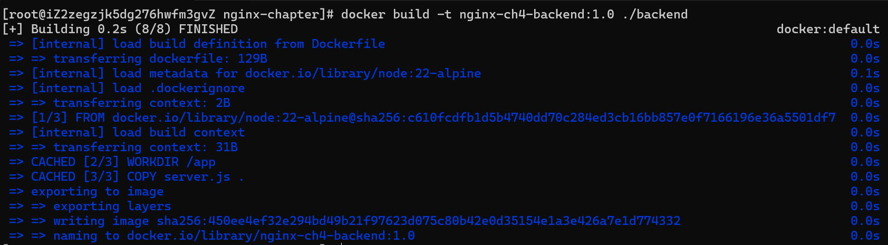
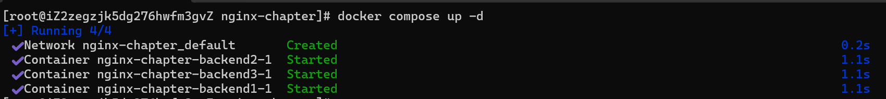
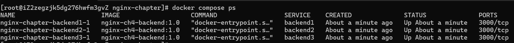
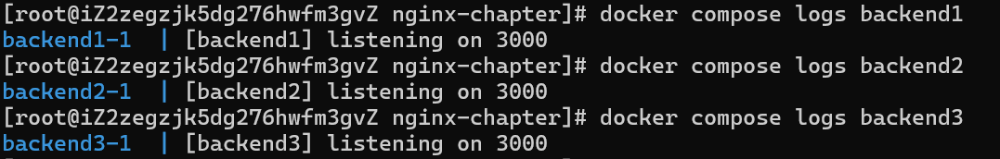

这一章是第三章反向代理的自然升级。
《Nginx反向代理实战》这一章节回答的是：
```text
Nginx
  ↓
一个 Backend
```
本章要解决：
```text
Nginx
  ↓
一组 Backend
  ↓
从这一组里选谁处理当前请求？
```
先不碰 `weight` / `backup` / `max_fails`。第一轮只做到：3 个 Backend 正常运行，并彻底搞懂 Docker 网络。

## 一、先建立正确的 upstream 心智模型
之前的 Nginx 反向代理配置为：
```nginx
location /api/ {
    proxy_pass http://backend:3000;
}
```
请求链路：
```text
curl
 ↓
Nginx
 ↓
backend:3000
 ↓
唯一 Backend
```
现在改成：
```nginx
upstream backend_cluster {
    server backend1:3000;
    server backend2:3000;
    server backend3:3000;
}

location /api/ {
    proxy_pass http://backend_cluster;
}
```
链路变成：
```text
curl
 ↓
Nginx
 ↓
backend_cluster
 ↓
Nginx 选择一个 upstream server
 ↓
backend1 / backend2 / backend3
```
**`backend_cluster` 到底是什么？**

**它只是你在 Nginx 配置里定义的 upstream 组名。**

不是：

- Docker 容器名
- Docker Compose 服务名
- DNS 域名
- 真正的服务器

例如：
```nginx
upstream backend_cluster {}
```
你完全可以写成：
```nginx
upstream my_servers {}
```
然后：
```nginx
proxy_pass http://my_servers;
```
只要名字对应即可。

但：
```nginx
server backend1:3000;
```
这里的：
```text
backend1
```
就完全不同。

它必须能被 Nginx 所在环境解析成一个真实地址。

在我们的 Docker Compose 环境里：
```text
backend1
backend2
backend3
```
会是 **Compose Service Name + Docker DNS 名称**。

这是本章第一个必须分清楚的地方：
```text
backend_cluster
      ↑
Nginx 自己定义的逻辑名称

backend1
      ↑
Docker DNS 可以解析的服务名称
```

## 二、为什么 upstream 必须接在 proxy_pass 后面学？
因为你如果连：
```nginx
proxy_pass http://backend:3000;
```
都没真正理解，就很容易把 upstream 错误理解成某种 Docker 功能。

实际上：
```text
proxy_pass
负责：请求转发到哪里

upstream
负责：当“哪里”有多个 Backend 时，帮你组织和选择 Backend
```
可以把它理解成：
```text
proxy_pass = 我要把请求转出去

upstream = 我有一组候选后端，你从里面选
```
所以：
```nginx
proxy_pass http://backend:3000;
```
是：
> 直接指定一个目标。
而：

```nginx
proxy_pass http://backend_cluster;
```

是：

> 指向一个 upstream 逻辑组，再由 Nginx 选择真正 Backend。

## 三、upstream 到底解决什么问题？
假设只有一个 Backend：
```text
backend1
```
backend1 挂了：
```text
Nginx
 ↓
backend1 ❌
```
没有其他机器可选。

有三个 Backend：
```text
              ┌→ backend1
Nginx → upstream → backend2
              └→ backend3
```
它带来三个最基础的能力：

- 请求分摊
- 故障容忍
- 后端扩展

但注意：
> upstream ≠ 自动让系统高可用。

这是这一章最容易产生的错误理解。

如果：
```text
backend1
backend2
backend3
```
实际上都部署在同一台物理服务器上，而服务器直接断电：
```text
三个 Backend 一起死
```
upstream 救不了你。

所以负载均衡解决的是**后端实例之间的请求分配问题**，不是整个系统所有层面的高可用问题。

## 四、开始实验：创建项目
先只做到：
```text
三个 Backend
+
同一个 Docker 网络
+
Docker DNS 可解析
```
**暂时不创建 upstream。**
这样可以避免你以后请求成功了，却分不清究竟是 Docker 网络生效还是 Nginx upstream 生效。

### 4.1 创建目录
执行：
```bash
mkdir -p nginx-stage1-chapter4/backend
mkdir -p nginx-stage1-chapter4/nginx/conf.d

cd nginx-stage1-chapter4
```
最终：
```text
nginx-stage1-chapter4/
├── docker-compose.yml
├── nginx/
│   └── conf.d/
│       └── default.conf
└── backend/
    ├── Dockerfile
    └── server.js
```

## 五、创建 Backend
创建：
```bash
vim backend/server.js
```
内容：
```js
const http = require('http');

const PORT = 3000;
const SERVER_NAME = process.env.SERVER_NAME || 'unknown';

const server = http.createServer((req, res) => {
  console.log(
    `[${SERVER_NAME}] ${req.method} ${req.url} from ${req.socket.remoteAddress}`
  );

  res.setHeader('Content-Type', 'application/json; charset=utf-8');

  if (req.url === '/server') {
    res.end(
      JSON.stringify({
        server: SERVER_NAME
      })
    );
    return;
  }

  if (req.url === '/health') {
    res.end(
      JSON.stringify({
        status: 'ok',
        server: SERVER_NAME
      })
    );
    return;
  }

  if (req.url === '/request-info') {
    res.end(
      JSON.stringify({
        server: SERVER_NAME,
        method: req.method,
        url: req.url,
        host: req.headers.host,
        xRealIp: req.headers['x-real-ip'],
        xForwardedFor: req.headers['x-forwarded-for'],
        xForwardedProto: req.headers['x-forwarded-proto']
      })
    );
    return;
  }

  res.statusCode = 404;

  res.end(
    JSON.stringify({
      error: 'Not Found',
      server: SERVER_NAME
    })
  );
});

server.listen(PORT, '0.0.0.0', () => {
  console.log(`[${SERVER_NAME}] listening on ${PORT}`);
});
```
这里故意保留：
```text
SERVER_NAME
```
以后三个容器虽然运行的是**完全一样的代码和镜像**，但我们通过：
```text
SERVER_NAME: backend1
```
让响应告诉我们：
```json
{
  "server": "backend1"
}
```
这样才能证明 Nginx 到底选中了谁。

## 六、创建 Backend 镜像
```bash
vim backend/Dockerfile
```
内容：
```dockerfile
FROM node:22-alpine

WORKDIR /app

COPY server.js .

EXPOSE 3000

CMD ["node", "server.js"]
```

现在先别急着 Compose。

直接构建：
```bash
docker build -t nginx-ch4-backend:1.0 ./backend
```
正常应该看到类似：



检查：
```bash
docker images
```


## 七、这里先考你一个问题
Dockerfile 中：
```dockerfile
EXPOSE 3000
```
不是：
> 把宿主机 3000 端口暴露出来。

它只是声明：
```text
这个容器里的应用预计监听 3000
```
真正宿主机端口映射必须是：
```yaml
ports:
  - "3000:3000"
```

## 八、创建三个 Backend
创建：
```bash
vim docker-compose.yml
```
先写：
```yaml
services:

  backend1:
    image: nginx-ch4-backend:1.0
    environment:
      SERVER_NAME: backend1

  backend2:
    image: nginx-ch4-backend:1.0
    environment:
      SERVER_NAME: backend2

  backend3:
    image: nginx-ch4-backend:1.0
    environment:
      SERVER_NAME: backend3
```
启动：
```bash
docker compose up -d
```



检查：
```bash
docker compose ps
```



再看日志：



## 九、一个非常关键的问题
现在有：
```text
backend1 → 3000
backend2 → 3000
backend3 → 3000
```
为什么不会：
```text
port already in use
```
因为：
```text
backend1 容器
自己的 Network Namespace
3000

backend2 容器
自己的 Network Namespace
3000

backend3 容器
自己的 Network Namespace
3000
```
它们不是：
```text
宿主机:3000
宿主机:3000
宿主机:3000
```
而是：
```text
backend1 自己的 IP:3000
backend2 自己的 IP:3000
backend3 自己的 IP:3000
```
例如概念上：
```text
172.20.0.2:3000
172.20.0.3:3000
172.20.0.4:3000
```
所以完全不冲突。

## 十、为什么宿主机不能直接访问它们？
试一下：
```bash
curl http://localhost:3000/server
```
正常情况下应该失败：
```text
Connection refused
```
因为 Compose 中根本没有：
```yaml
ports:
  - "3000:3000"
```
因此没有：
```text
宿主机:3000
    ↓
容器:3000
```
这条映射。

这正是我们希望的架构：

```text
互联网
   ↓

只能访问

Nginx :8080
   ↓

内部 Docker 网络
   ↓

backend:3000
```
而不是：

```text
互联网
 ↓
backend1:3000
backend2:3000
backend3:3000
```

## 十一、验证 Docker 网络
先查看网络：
```bash
docker network ls
```
Compose 默认创建网络：

```text
<项目名>_default
```

执行：
```bash
docker network inspect <项目名>_default
```
重点找：
```text
backend1
backend2
backend3
```
以及它们各自的 IP。

例如：
```text
backend1 → 172.20.0.2
backend2 → 172.20.0.3
backend3 → 172.20.0.4
```
实际 IP 不一定一样。

## 十二、验证 Docker DNS
我们的 Node Alpine 镜像不一定带 curl，所以直接用临时 curl 容器进入同一个 Docker 网络：
```bash
docker run --rm \
  --network <项目名>_default \
  curlimages/curl \
  http://backend1:3000/server
```
正常：
```json
{"server":"backend1"}
```
然后：
```bash
docker run --rm \
  --network <项目名>_default \
  curlimages/curl \
  http://backend2:3000/server
```
得到：
```json
{"server":"backend2"}
```
再请求：
```bash
docker run --rm \
  --network <项目名>_default \
  curlimages/curl \
  http://backend3:3000/server
```
得到：
```json
{"server":"backend3"}
```

这三个实验非常重要。

它证明了：

```text
curl 临时容器
      ↓
backend2:3000
      ↓
Docker DNS
      ↓
backend2 对应容器 IP
      ↓
TCP 3000
      ↓
Node
      ↓
{"server":"backend2"}
```

## 十三、这里必须把 upstream 与 Docker DNS 分开
以后 Nginx 看见：
```nginx
upstream backend_cluster {
    server backend1:3000;
    server backend2:3000;
    server backend3:3000;
}
```
不要脑补成：
> upstream 创建了 backend1。

完全错误。

真正关系是：

```text
Nginx upstream
负责：

backend1
backend2
backend3

到底选谁
```
而：
```text
Docker DNS
负责：

backend1
 ↓
它对应哪个容器网络地址
```
所以整个逻辑是：

```text
upstream 选择：

backend2:3000
      ↓

Docker DNS 解析：

backend2
      ↓

容器 IP
      ↓

TCP 3000
```
**一个负责“选谁”，一个负责“找到谁”。**
