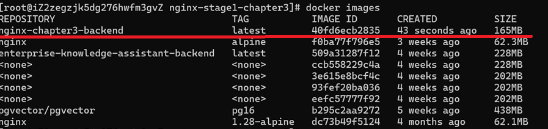
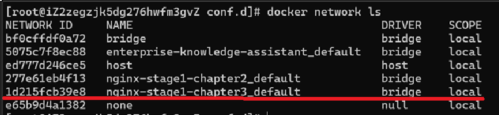
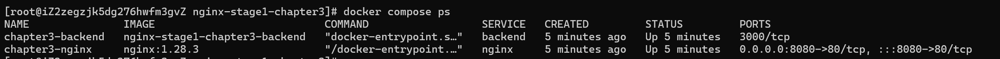
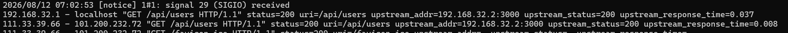

前两章我们已经解决了两个问题：
- 请求进入 Nginx 后，如何通过 location 判断由谁处理
- 如果由 Nginx 自己处理，如何通过 root、alias 将 URI 映射到本地文件

但真实项目中，大量请求并不是去读取静态文件。

例如：
```text
GET /api/users
POST /api/login
GET /api/orders
```
这些请求真正的处理者，往往是 Java、Node.js、Go、Python 等后端服务。

于是就出现了第三个问题：
> 浏览器请求进入 Nginx 后，Nginx 如何把请求交给另一个 HTTP 服务，并把后端响应重新返回给客户端？

这就是本章要学习的核心：
- Nginx 反向代理
- proxy_pass
- 请求 URI 转发
- 代理 Header
- Docker 网络
- 404 / 502 排查

## 一、什么是反向代理
先看没有 Nginx 时的请求链路。
假设 Node.js 服务直接监听：
```text
3000
```
浏览器访问：
```text
http://localhost:3000/users
```
链路非常简单：
```text
浏览器
  ↓
Node.js :3000
  ↓
返回响应
```
这叫客户端直接访问后端。加入 Nginx 后，架构变成：
```text
浏览器
  ↓
localhost:8080
  ↓
Nginx :80
  ↓
backend :3000
  ↓
Node.js
```
浏览器访问：
```text
http://localhost:8080/api/users
```
浏览器实际上并不知道：
```text
backend
3000
Node.js
```
它只知道：
```text
localhost:8080
```
真正的后端地址只由 Nginx 知道。

因此整个链路变成：
```text
浏览器
  ↓
Nginx
  ↓
后端服务
  ↓
Nginx
  ↓
浏览器
```
Nginx 在这里充当的就是：
> 反向代理服务器。

但如果只记住这个定义，理解仍然不够。

真正重要的是：
> Nginx 收到浏览器请求以后，会再次作为 HTTP Client，向后端发送一个新的 HTTP 请求。

也就是说，整个过程实际上包含两段 HTTP 通信：
```text
# 第一段：
浏览器
  ↓
Nginx

# 第二段：
Nginx
  ↓
Backend
```
因此 Nginx 的身份发生了变化：

面对浏览器：
```text
Nginx = HTTP Server
```
而面对后端：
```text
Nginx = HTTP Client
```
这个模型非常重要。

## 二、搭建本章实验环境
这次我们使用两个 Docker 容器：
```text
浏览器 / curl
  ↓
localhost:8080
  ↓
Docker 端口映射
  ↓
Nginx :80
  ↓
Docker Compose 网络
  ↓
Backend :3000
```
项目结构：

```text
nginx-stage1-chapter3/
├── docker-compose.yml
├── nginx/
│   └── conf.d/
│       └── default.conf
└── backend/
    ├── Dockerfile
    └── server.js
```

### 2.1 创建 Backend
这里故意不用 Express，而使用 Node.js 原生 HTTP。

原因很简单：

> 本章研究的是 Nginx、HTTP、URI 和 Header，而不是 Express 路由机制。

```js
// backend/server.js
const http = require('http');

const PORT = 3000;

const server = http.createServer((req, res) => {
  console.log('--------------------------------');
  console.log(`[Backend] ${req.method} ${req.url}`);
  console.log('[Backend] Headers:', req.headers);
  console.log('[Backend] Socket Remote Address:', req.socket.remoteAddress);

  res.setHeader('Content-Type', 'application/json; charset=utf-8');

  if (req.url === '/') {
    res.statusCode = 200;
    return res.end(JSON.stringify({ message: 'backend home', url: req.url }, null, 2));
  }

  if (req.url === '/users') {
    res.statusCode = 200;
    return res.end(JSON.stringify({ message: 'users', url: req.url, users: ['Alice', 'Bob'] }, null, 2));
  }

  if (req.url === '/hello') {
    res.statusCode = 200;
    return res.end(JSON.stringify({ message: 'hello from backend', url: req.url }, null, 2));
  }

  if (req.url === '/request-info') {
    res.statusCode = 200;
    return res.end(
      JSON.stringify(
        {
          uri: req.url,
          host: req.headers.host || null,
          clientIp: req.socket.remoteAddress || null,
          xRealIp: req.headers['x-real-ip'] || null,
          xForwardedFor: req.headers['x-forwarded-for'] || null,
          xForwardedProto: req.headers['x-forwarded-proto'] || null,
        },
        null,
        2
      )
    );
  }

  res.statusCode = 404;
  res.end(JSON.stringify({ error: 'Not Found', url: req.url }, null, 2));
});

server.listen(PORT, '0.0.0.0', () => {
  console.log(`Backend listening on port ${PORT}`);
});
```
其中 /request-info 非常重要。

它专门用于观察：

- URI
- Host 客户端
- IP X-Real-IP
- X-Forwarded-For
- X-Forwarded-Proto

这样我们后面不是靠猜，而是让后端直接告诉我们：
> Nginx 到底发送了什么。

### 2.2 创建 Backend Dockerfile

```dockerfile
# backend/Dockerfile

FROM node:22-alpine

WORKDIR /app

COPY server.js .

EXPOSE 3000

CMD ["node", "server.js"]
```

### 2.3 先单独验证 Backend
在引入 Nginx 之前，应该先验证后端本身没有问题。

否则以后出现 404 或 502 时，你根本不知道：
```text
是 Nginx 有问题
还是 Backend 本身有问题
```
构建：
```bash
docker build -t nginx-chapter3-backend ./backend
```

临时启动：
```bash
docker run --rm --name chapter3-backend-test -p 3000:3000 nginx-chapter3-backend
```
这里临时使用：
```text
3000:3000
```
只是为了建立测试基线。

执行：
```bash
curl -i http://localhost:3000/users
```
正常返回：
```http
HTTP/1.1 200 OK

{
  "message": "users",
  "url": "/users",
  "users": [
    "Alice",
    "Bob"
  ]
}
```
请求不存在的路由：
```bash
curl -i http://localhost:3000/not-found
```
得到：
```http
HTTP/1.1 404 Not Found
```
这里先建立一个重要认识：
```text
404
```
并不代表服务器宕机。

反而说明：
```text
HTTP 服务正常
请求已经到达后端
只是后端没有对应资源
```
测试完成后停止临时容器。
```text
# 拿到容器的container id
docker ps

# 停止容器
docker stop <container id>
```

## 三、Docker 网络和反向代理到底是什么关系
这是这一章非常值得深入理解的一部分。
创建：
```text
# docker-compose.yml
services:
  nginx:
    image: nginx:1.28.3
    container_name: chapter3-nginx
    ports:
      - "8080:80"
    volumes:
      - ./nginx/conf.d:/etc/nginx/conf.d:ro
    depends_on:
      - backend

  backend:
    build:
      context: ./backend
    container_name: chapter3-backend
```
注意 Backend 并没有：
```text
ports:
  - "3000:3000"
```
### 3.1 8080:80 到底是什么意思
Nginx 配置：
```text
ports:
  - "8080:80"
```
表示：
```text
宿主机 8080
  ↓
Nginx 容器 80
```
所以浏览器可以访问：
```text
http://localhost:8080
```
这里的 8080 属于：
```text
宿主机
```
而 80 属于：
```text
Nginx 容器
```
不要把两个端口理解成同一个东西。

### 3.2 Backend 为什么不需要 3000:3000
Backend 内部仍然运行：
```text
0.0.0.0:3000
```
但我们没有把这个端口发布到宿主机。

因此：
```text
宿主机
  ↓
localhost:3000
```
但：
```text
Nginx 容器
  ↓
backend:3000
```
却可以访问。

原因在 **Docker Compose 网络**。

### 3.3 Docker Compose 默认网络
当执行：
```bash
docker compose up -d
```
Compose 通常会自动创建一个项目网络。
例如：
```bash
nginx-stage1-chapter3_default
```
两个容器都会加入这个网络：
```text
Docker Compose Network
```
```text
┌──────────────────────────────┐
│                              │
│   chapter3-nginx             │
│   172.x.x.2                  │
│                              │
│   chapter3-backend           │
│   172.x.x.3                  │
│                              │
└──────────────────────────────┘
```
可以执行：
```bash
docker network ls
```

找到对应网络。

然后：
```bash
docker network inspect nginx-stage1-chapter3_default
```
```json
[
    {
        "Name": "nginx-stage1-chapter3_default",
        "Id": "1d215fcb39e8cb3a0a1737756a30e920eaa1648efb59e46d064c3254b496552e",
        "Created": "2026-08-11T17:13:22.862340897+08:00",
        "Scope": "local",
        "Driver": "bridge",
        "EnableIPv6": false,
        "IPAM": {
            "Driver": "default",
            "Options": null,
            "Config": [
                {
                    "Subnet": "192.168.16.0/20",
                    "Gateway": "192.168.16.1"
                }
            ]
        },
        "Internal": false,
        "Attachable": false,
        "Ingress": false,
        "ConfigFrom": {
            "Network": ""
        },
        "ConfigOnly": false,
        "Containers": {
            "46ddd767d341f00560acdf981cf494c0c76ace988561256e7b5b41636bbbd406": {
                "Name": "chapter3-backend",
                "EndpointID": "2905f10a74393350dab1ed835dcbc13f4e5beabf5fb14aa6a849d992b7d5d8c1",
                "MacAddress": "02:42:c0:a8:10:02",
                "IPv4Address": "192.168.16.2/20",
                "IPv6Address": ""
            },
            "81cfa950ad47793a1c199d2108d8a48d0740b920b97421b653d59b978c8e9357": {
                "Name": "chapter3-nginx",
                "EndpointID": "2a6f4c15f3cdf11850cad2e2789d1c2d7483b0100f94b99cb0885fc89de4a64a",
                "MacAddress": "02:42:c0:a8:10:03",
                "IPv4Address": "192.168.16.3/20",
                "IPv6Address": ""
            }
        },
        "Options": {},
        "Labels": {
            "com.docker.compose.network": "default",
            "com.docker.compose.project": "nginx-stage1-chapter3",
            "com.docker.compose.version": "2.27.0"
        }
    }
]
```

### 3.4 Docker DNS
Docker 网络除了提供容器之间的网络连接，还提供内部 DNS。

所以：
```text
backend
```
不是一个随便写的字符串。

它来自 Compose 服务名：
```text
services:
  backend:
```
当 Nginx 请求：
```text
http://backend:3000
```
Docker 内部实际上做：
```text
backend
  ↓
Docker DNS
  ↓
Backend 容器 IP
  ↓
TCP 3000
```
这就是为什么不能把：
```nginx
proxy_pass http://172.18.0.3:3000;
```
写死

容器重新创建后 IP 可能变化。
而：
```nginx
proxy_pass http://backend:3000;
```
更加稳定。

### 3.5 为什么浏览器不能访问 backend:3000
很多第一次接触 Docker 的人会产生一个疑问：

既然 Nginx 可以：
```text
http://backend:3000
```
为什么浏览器不行？
因为：
> backend 属于 Docker Compose 内部网络的 DNS 名称。你的 Chrome、Edge、curl 如果运行在宿主机：Windows / Linux Host就不属于这个 Compose 网络。因此：浏览器 → backend:3000 通常无法解析。 而：Nginx 容器 → backend:3000可以。

所以可以总结成：
> 宿主机访问容器通常依赖 ports

而：
```text
同一 Docker 网络中的容器互访通常使用 service name + container port
```
```text
浏览器
↓
localhost:8080

然后：

Nginx
↓
backend:3000

这是两套不同的通信方式。
```

## 四、proxy_pass：Nginx 如何把请求交给后端
创建：
```text
# nginx/conf.d/default.conf
server {
    listen 80;

    location / {
        return 200 "nginx is running\n";
    }

    location /api/ {
        proxy_pass http://backend:3000;
    }
}
```
启动：
```bash
docker compose up -d
```
检查：
```bash
docker compose ps
```
你可以看到：

并且只有 Nginx 有宿主机端口映射：
```text
0.0.0.0:8080->80/tcp
```

### 4.1 验证 Nginx 自己处理的请求
执行：
```bash
curl -i http://localhost:8080/
```
```http
HTTP/1.1 200 OK
Server: nginx/1.28.3
Date: Tue, 11 Aug 2026 09:44:14 GMT
Content-Type: application/octet-stream
Content-Length: 17
Connection: keep-alive

nginx is running
```
完整链路：
```bash
curl
  ↓
localhost:8080
  ↓
Docker 8080 → 80
  ↓
Nginx
  ↓
location /
  ↓
return 200
  ↓
客户端
```
Backend 没有参与。
可以查看：
```bash
docker logs chapter3-backend
```
确认没有对应请求。

### 4.2 第一次代理 /api/users
执行：
```bash
curl -i http://localhost:8080/api/users
```
此时会得到：
```http
HTTP/1.1 404 Not Found
Server: nginx/1.28.3
Date: Tue, 11 Aug 2026 09:48:57 GMT
Content-Type: application/json; charset=utf-8
Transfer-Encoding: chunked
Connection: keep-alive

{
  "error": "Not Found",
  "url": "/api/users"
}
```
但不要马上认为：
> 代理失败了。

查看 Backend：
```bash
docker logs chapter3-backend
```
你应该看到：
```text
[Backend] GET /api/users
[Backend] Headers: {
  host: 'backend:3000',
  connection: 'close',
  'user-agent': 'curl/7.61.1',
  accept: '*/*'
}
[Backend] Socket Remote Address: 192.168.32.3
```
而我们的 Backend 只定义：
```text
/users
```
并没有：
```text
/api/users
```
因此：
```text
Nginx 成功连接 Backend
  ↓
Backend 收到 /api/users
  ↓
Backend 找不到路由
  ↓
返回 404
```
这个实验非常重要。
因为它证明：
```nginx
proxy_pass http://backend:3000;
```
对于请求：
```text
/api/users
```
Backend 收到的还是：
```text
/api/users
```

## 五、proxy_pass 末尾 /：本章最重要的实验
现在把：
```nginx
proxy_pass http://backend:3000;
```
修改为：
```nginx
proxy_pass http://backend:3000/;
```
只多了一个 /。

但转发 URI 行为变了。

先检查：
```bash
docker exec chapter3-nginx nginx -t
```
然后：
```bash
docker exec chapter3-nginx nginx -s reload
```
再次请求：
```bash
curl -i http://localhost:8080/api/users
```
现在应该得到：
```http
HTTP/1.1 200 OK
Server: nginx/1.28.3
Date: Tue, 11 Aug 2026 10:19:01 GMT
Content-Type: application/json; charset=utf-8
Transfer-Encoding: chunked
Connection: keep-alive

{
  "message": "users",
  "url": "/users",
  "users": [
    "Alice",
    "Bob"
  ]
}
```
查看日志：
```bash
docker logs chapter3-backend
```
能够看到：
```text
[Backend] GET /users
[Backend] Headers: {
  host: 'backend:3000',
  connection: 'close',
  'user-agent': 'curl/7.61.1',
  accept: '*/*'
}
[Backend] Socket Remote Address: 192.168.32.3
```

### 5.1 为什么加 / 后变成 /users
配置：
```nginx
location /api/ {
  proxy_pass http://backend:3000/;
}
```
请求：
```text
/api/users
```
可以拆成：
location 匹配部分：`/api/`

剩余部分：`users`

proxy_pass 中包含 URI：
```text
/
```
Nginx 会使用这个 URI 替换匹配到的 location 部分。

于是：
```text
/api/users
=
/api/
+
users
```

替换：
```text
/api/
↓
/
```
得到：
```text
/users
```
因此 Backend 收到：
```text
/users
```

### 5.2 两种配置对比
第一种：
```nginx
location /api/ {
  proxy_pass http://backend:3000;
}
```
请求：
```text
/api/users
```
Backend：
```text
/api/users
```
第二种：
```nginx
location /api/ {
  proxy_pass http://backend:3000/;
}
```
Backend：
```text
/users
```
可以总结：

| 配置 | 客户端 URI | Backend URI |
| --- | --- | --- |
| `proxy_pass http://backend:3000;` | `/api/users` | `/api/users` |
| `proxy_pass http://backend:3000/;` | `/api/users` | `/users` |

### 5.3 用三个证据验证 URI
不要只依赖配置推断。

至少使用：

**curl**
```bash
curl -i http://localhost:8080/api/users
```
观察最终状态码和响应内容。

**Backend 日志**
```bash
docker logs chapter3-backend
```
观察：
```text
[Backend] GET /users
```
**Backend 响应**
我们的程序特意返回：
```text
"url": "/users"
```
三个观察结果一致，才能确认：
```text
/api/users
  ↓
/users
```

## 六、代理请求头：为什么 Backend 看不到原始客户端信息
现在请求：
```bash
curl -i http://localhost:8080/api/request-info
```
如果还没有设置代理 Header，你可能会得到类似：
```json
{
  "uri": "/request-info",
  "host": "backend:3000",
  "clientIp": "192.168.32.3",
  "xRealIp": null,
  "xForwardedFor": null,
  "xForwardedProto": null
}
```
为什么会这样？
因为 Backend 和浏览器并没有直接建立 TCP 连接。

真正的连接关系是：
```text
浏览器
↓
Nginx

然后：

Nginx
↓
Backend
```
所以从 Backend 的角度：
```text
和我建立 TCP 连接的人 = Nginx
```
于是，`req.socket.remoteAddress` 看到的是 Nginx 容器地址。这不是异常，而是代理架构的自然结果。

### 6.1 设置代理 Header
修改：
```nginx
location /api/ {
    proxy_pass http://backend:3000/;
    proxy_set_header Host $host;
    proxy_set_header X-Real-IP $remote_addr;
    proxy_set_header X-Forwarded-For $proxy_add_x_forwarded_for;
    proxy_set_header X-Forwarded-Proto $scheme;
}
```
检查并 reload：
```bash
docker exec -it chapter3-nginx nginx -t
docker exec -it chapter3-nginx nginx -s reload
```
重新请求：
```bash
curl -i http://localhost:8080/api/request-info
```
结果可能类似：
```json
{
  "uri": "/request-info",
  "host": "localhost",
  "clientIp": "172.x.x.x",
  "xRealIp": "172.x.x.x",
  "xForwardedFor": "172.x.x.x",
  "xForwardedProto": "http"
}
```

### 6.2 Host
配置：
```nginx
proxy_set_header Host $host;
```
作用：
> 把客户端原本访问的 Host 告诉 Backend。
否则 Backend 看到的可能是：
```text
backend:3000
```
而客户端真正访问的是：
```text
localhost:8080
```
或者真实生产中的：
```text
api.example.com
```
对于依赖域名判断业务逻辑、生成 URL、虚拟主机的后端服务，这个信息非常重要。

### 6.3 X-Real-IP

```nginx
proxy_set_header X-Real-IP $remote_addr;
```

其中：
```text
$remote_addr
```
代表：
> 直接连接当前 Nginx 的客户端地址。

Nginx 把这个地址放进：`X-Real-IP`

发送给 Backend。

### 6.4 X-Forwarded-For

```nginx
proxy_set_header X-Forwarded-For $proxy_add_x_forwarded_for;
```

X-Real-IP 通常只表达一个地址。
而：
```text
X-Forwarded-For
```
更适合描述整个代理链。
例如：
```text
203.0.113.10, 10.0.0.5
```
可能表示：
```text
用户
203.0.113.10
  ↓
代理服务器 10.0.0.5
  ↓
Nginx
  ↓
Backend
```
`$proxy_add_x_forwarded_for` 会在已有 `X-Forwarded-For` 基础上追加当前 `$remote_addr`。所以多层代理时，它比简单覆盖一个 IP 更有意义。

### 6.5 X-Forwarded-Proto

```nginx
proxy_set_header X-Forwarded-Proto $scheme;
```

告诉 Backend：
```text
客户端访问 Nginx 使用的是 http 还是 https
```
当前：
```text
http://localhost:8080
```
所以：
```text
X-Forwarded-Proto: http
```
以后如果 Nginx 负责 HTTPS，而 Nginx 到 Backend 内部使用 HTTP，这个 Header 就非常重要。
Backend 可以知道：
> 用户原始访问实际上是 HTTPS。
本章暂时不展开 HTTPS。

### 6.6 一个必须纠正的误解
经常有人说：
> 配置 X-Real-IP 以后，Backend 就能看到真正客户端 IP。
严格来说不准确。
Backend 的：
```text
req.socket.remoteAddress 仍然是：Nginx 的 IP。因为 TCP 连接本身没有改变。
```
真正发生的是：
```text
Nginx
↓
通过 HTTP Header
↓
告诉 Backend 原始客户端信息

所以：

TCP 连接来源

和：

HTTP Header 中声明的客户端来源

不是一回事。
```

## 七、404 和 502：必须真正区分
这是代理排错中最基础也最重要的能力。

### 7.1 Backend 返回 404
```bash
curl -i http://localhost:8080/api/not-found
```
当前：
```text
/api/not-found
  ↓
proxy_pass
  ↓
/not-found
```
Backend 收到：
```text
/not-found
```
因为没有这个路由，所以 Backend 返回：
```text
404
```
查看：
```bash
docker logs chapter3-backend
```
能看到：
```text
[Backend] GET /not-found
[Backend] Headers: {
  host: '101.200.232.72',
  'x-real-ip': '34.39.10.182',
  'x-forwarded-for': '34.39.10.182',
  'x-forwarded-proto': 'http',
  connection: 'close',
  accept: '*/*',
  'accept-language': 'en, *;q=0.7',
  'user-agent': 'Mozilla/5.0 (Windows NT 10.0; Win64; x64) AppleWebKit/537.36 (KHTML, like Gecko) Chrome/151.0.0.0 Safari/537.36'
}
[Backend] Socket Remote Address: 192.168.32.3
```
这证明：
```text
请求成功到达 Backend
```

只是资源不存在。

所以，`404` 说明：

- Backend 活着
- Nginx 可以连通 Backend
- 请求已经到达应用
- 应用没有对应资源

### 7.2 停止 Backend 制造 502
执行：
```bash
docker stop chapter3-backend
```
然后：
```bash
curl -i http://localhost:8080/api/users
```
应该得到：
```http
HTTP/1.1 502 Bad Gateway
```
此时请求链路：

```text
curl
  ↓
Nginx
  ↓
location /api/
  ↓
proxy_pass
  ↓
尝试连接 Backend
  ↓
连接失败
  ↓
502
```
请求根本没有机会进入 Node 应用。

所以，`502` 表示的是：

> Nginx 作为代理服务器，没有从 upstream 获得正常响应。

### 7.3 查看 Nginx error log
执行：
```bash
docker logs chapter3-nginx
```
可能看到：
```text
connect() failed (111: Connection refused) while connecting to upstream
```
这句话的信息量非常大：

```text
location 匹配已经完成
  ↓
proxy_pass 已经生成 upstream
  ↓
Nginx 已经尝试建立 TCP 连接
  ↓
但目标端口连接失败
```
所以排查范围可以迅速缩小到：
```text
Backend 是否启动
端口是否正确
网络是否正常
服务是否监听
```
而不是再去怀疑 location。

### 7.4 故意把端口改错
将：
```nginx
proxy_pass http://backend:3000/;
```
改成：
```nginx
proxy_pass http://backend:3001/;
```
然后：
```bash
docker exec chapter3-nginx nginx -t
```
大概率仍然：
```bash
nginx: the configuration file /etc/nginx/nginx.conf syntax is ok
nginx: configuration file /etc/nginx/nginx.conf test is successful
```
原因：

`3001` 在语法上完全正确。`nginx -t` 不会帮你判断：

> Backend 到底有没有监听这个端口。

reload：
```bash
docker exec chapter3-nginx nginx -s reload
```
然后：
```bash
curl -i http://localhost:8080/api/users
```
得到：
```text
502
```

这再次证明：
> nginx -t 成功，只能说明配置语法正确，不能证明业务链路正确。

继续排查容器状态：

```bash
docker compose ps
```

如果 Backend 是 Up，再查看后端日志：

```bash
docker logs chapter3-backend
```

Backend 输出：

```text
Backend listening on port 3000
```

再看 Nginx 的完整配置：

```bash
docker exec chapter3-nginx nginx -T
```

发现：

```nginx
proxy_pass http://backend:3001/;
```

问题立刻明确：

```text
Backend 监听 3000
Nginx 请求 3001
```

## 八、日志：如何真正观察代理链路
默认 access log 能告诉我们客户端请求了什么。
但为了排查代理问题，可以增加一些 upstream 信息。

修改：
```nginx
log_format proxy_debug
        '$remote_addr - $host '
        '"$request" '
        'status=$status '
        'uri=$uri '
        'upstream_addr=$upstream_addr '
        'upstream_status=$upstream_status '
        'upstream_response_time=$upstream_response_time';


server {
    listen 80;

    access_log /var/log/nginx/access.log proxy_debug;

    location / {
        return 200 "nginx is running\n";
    }

    location /api/ {
        proxy_pass http://backend:3000/;

        proxy_set_header Host $host;
        proxy_set_header X-Real-IP $remote_addr;
        proxy_set_header X-Forwarded-For $proxy_add_x_forwarded_for;
        proxy_set_header X-Forwarded-Proto $scheme;
    }
}
```
重新加载：
```bash
docker exec chapter3-nginx nginx -t
docker exec chapter3-nginx nginx -s reload
```
请求：
```bash
curl -i http://localhost:8080/api/users
```
查看：
```bash
docker logs chapter3-nginx
```
可以看到结果如下：



这里：

**`$status`**

> Nginx 最终返回客户端的状态码。

**`$upstream_addr`**

> Nginx 实际连接的上游地址。

**`$upstream_status`**

> Backend 返回给 Nginx 的状态码。

**`$upstream_response_time`**

> Backend 响应耗时。

### 8.1 Nginx 日志和 Backend 日志为什么都要看
例如客户端请求：
```text
/api/users
```
Nginx access log 可能看到：
```text
GET /api/users
```
而 Backend：
```text
GET /users
```
这不是矛盾。

因为两份日志站的位置不同：

- Nginx 日志回答：客户端向 Nginx 请求了什么？
- Backend 日志回答：Nginx 最终向 Backend 请求了什么？

因此 URI 转发问题必须至少同时观察：

- `curl`
- Nginx log
- Backend log

## 九、完整请求链路
现在把所有知识串起来。

客户端请求：
```text
http://localhost:8080/api/users
```
Nginx：
```nginx
location /api/ {
  proxy_pass http://backend:3000/;
  proxy_set_header Host $host;
  proxy_set_header X-Real-IP $remote_addr;
  proxy_set_header X-Forwarded-For $proxy_add_x_forwarded_for;
  proxy_set_header X-Forwarded-Proto $scheme;
}
```
```text
完整请求过程：

curl / 浏览器
        ↓
http://localhost:8080/api/users
        ↓
宿主机 localhost:8080
        ↓
Docker port mapping
8080 → chapter3-nginx:80
        ↓
Nginx server
        ↓
location /api/
        ↓
proxy_pass http://backend:3000/
        ↓
匹配 URI /api/ 被替换为 /
        ↓
upstream URI = /users
        ↓
Docker DNS
backend → Backend 容器 IP
        ↓
Backend :3000
        ↓
Node HTTP Server
        ↓
req.url = /users
        ↓
Backend 返回 200 JSON
        ↓
Nginx 收到 upstream response
        ↓
Nginx 返回客户端
        ↓
curl 收到 200
```
这是本章真正应该记住的东西。

不是单独记 `proxy_pass`，而是能够在脑中还原整个请求链路。

## 十、代理问题的标准排查顺序
以后遇到：
- 404
- 502
- 接口不通
- URI 错误
- Header 不对
不要乱改配置。按顺序检查。

```text
客户端是否请求到了 Nginx？
  ↓
命中了哪个 location？
  ↓
proxy_pass 当前到底写了什么？
  ↓
URI 最终应该变成什么？
  ↓
Docker DNS 是否能解析 Backend？
  ↓
目标端口是否正确？
  ↓
Backend 容器是否运行？
  ↓
Backend 是否监听目标端口？
  ↓
Nginx 能否建立 TCP 连接？
  ↓
Backend 实际收到哪个 URI？
  ↓
Backend 返回什么状态码？
  ↓
Nginx 最终返回什么状态码？
```

不同工具解决不同问题。

### 10.1 curl -i

```bash
curl -i http://localhost:8080/api/users
```

重点观察：

- HTTP 状态码
- 响应头
- 响应体

### 10.2 curl -v

```bash
curl -v http://localhost:8080/api/users
```

适合观察：

- 连接过程
- 请求 Header
- 响应 Header

```bash
[root@iZ2zegzjk5dg276hwfm3gvZ conf.d]# curl -v http://localhost:8080/api/users
*   Trying ::1...
* TCP_NODELAY set
* Connected to localhost (::1) port 8080 (#0)
> GET /api/users HTTP/1.1
> Host: localhost:8080
> User-Agent: curl/7.61.1
> Accept: */*
>
< HTTP/1.1 200 OK
< Server: nginx/1.28.3
< Date: Wed, 12 Aug 2026 07:19:17 GMT
< Content-Type: application/json; charset=utf-8
< Transfer-Encoding: chunked
< Connection: keep-alive
<
{
  "message": "users",
  "url": "/users",
  "users": [
    "Alice",
    "Bob"
  ]
* Connection #0 to host localhost left intact
}
```

### 10.3 docker compose ps

```bash
docker compose ps
```

回答：

- 容器是不是 Up
- 哪些端口暴露到了宿主机

### 10.4 Nginx 日志

```bash
docker logs chapter3-nginx
```

重点观察：

- 客户端请求
- upstream 地址
- 502 错误
- 连接失败
- upstream 状态

### 10.5 Backend 日志

```bash
docker logs chapter3-backend
```

重点观察：
- 请求到底有没有进入 Backend
- Backend 实际收到哪个 URI
- Backend 实际收到哪些 Header

### 10.6 nginx -t

```bash
docker exec chapter3-nginx nginx -t
```

只回答：配置语法是否正确。

它不能证明：

- Backend 存在
- 端口正确
- URI 正确
- 业务逻辑正确

### 10.7 nginx -T

```bash
docker exec chapter3-nginx nginx -T
```

适合确认：
- 容器里当前配置文件到底是什么
- include 后的完整配置是什么
- proxy_pass 到底写成了什么
