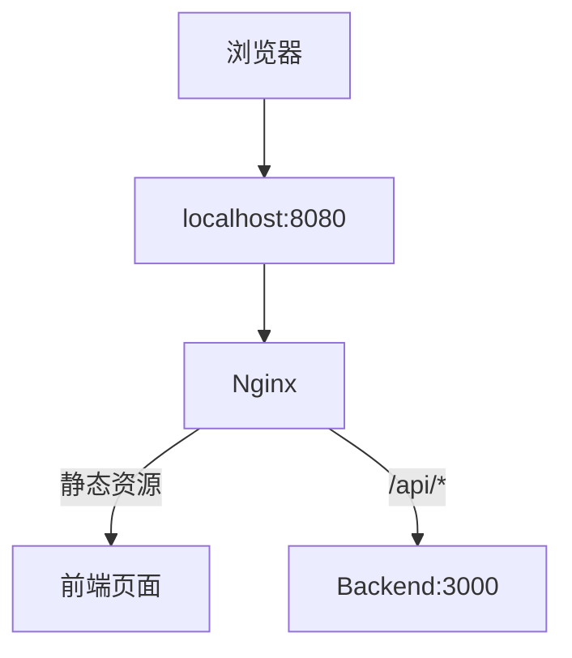
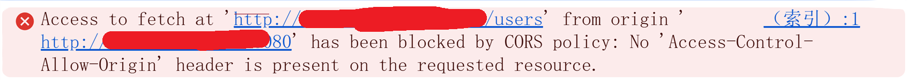

> 核心结论：Nginx 不是关闭了浏览器的同源策略，而是通过反向代理，让浏览器看到的页面地址和接口地址变成同一个源。

这篇文章会先说明跨域到底发生在哪里，再通过一个 Docker + Nginx 的实验，演示反向代理为什么能让前端请求不再触发 CORS 错误。

## 一、先纠正一个容易记错的说法

很多文章会直接说：

> “Nginx 可以解决跨域。”

这句话不够严谨。更准确的说法是：

> Nginx 可以通过反向代理，让浏览器始终请求同一个源，从而避免触发浏览器的跨域限制。

注意，真正发生变化的是：

- 正确理解：`浏览器看到的请求` 变成同源。
- 错误理解：`Nginx 把浏览器的同源策略关闭了`。

这是两个不同的概念。

## 二、到底什么叫跨域

浏览器判断两个地址是否同源，核心看三个部分：

```text
协议 + 主机 + 端口
```

例如前端页面是：

```text
http://localhost:8080
```

它直接请求后端接口：

```text
http://localhost:3000/users
```

对比结果如下：

| 对比项 | 前端页面 | 后端接口 | 是否相同 |
| --- | --- | --- | --- |
| 协议 | `http` | `http` | 相同 |
| 主机 | `localhost` | `localhost` | 相同 |
| 端口 | `8080` | `3000` | 不同 |

只要协议、主机、端口中有一个不同，浏览器就会认为它们是**不同源**。

所以这个例子中的直接请求是跨域请求，浏览器会应用同源策略，并限制页面 JavaScript 读取响应。

## 三、跨域不是“请求发不出去”

这是排查跨域问题时一定要理解的点。

假设前端代码是：

```javascript
fetch('http://localhost:3000/users')
```

浏览器可能真的已经把请求发给了后端：

```text
浏览器 JavaScript
  ↓
Backend
```

Backend 也可能已经正常返回：

```http
HTTP/1.1 200 OK
```

但是，如果 Backend 响应里没有正确的 CORS Header，例如：

```http
Access-Control-Allow-Origin: http://localhost:8080
```

浏览器会拒绝让当前页面的 JavaScript 读取这个响应。于是你在前端看到的就是：

```text
CORS error
```

所以跨域问题主要发生在**浏览器安全策略**这一层，而不是 HTTP 本身不能跨端口通信。

证据非常简单。你直接用 `curl` 请求后端：

```bash
curl http://localhost:3000/users
```

通常可以正常拿到响应。

> `curl` 不执行浏览器同源策略，所以“curl 成功但浏览器失败”是非常典型的跨域现象。

## 四、Nginx 是怎么“解决”这个问题的

先看没有反向代理时的原始架构：

```text
浏览器页面
http://localhost:8080
        │
        │ fetch
        ↓
http://localhost:3000/users
```

浏览器看到的是：

| 类型 | 地址 |
| --- | --- |
| 页面 | `http://localhost:8080` |
| 接口 | `http://localhost:3000/users` |

端口不同，所以产生跨域。

加入 Nginx 后，浏览器不再直接请求 `http://localhost:3000/users`，而是改为请求：

```text
http://localhost:8080/api/users
```

Nginx 配置如下：

```nginx
location /api/ {
    proxy_pass http://backend:3000/;
}
```

链路变成：

```text
浏览器
  │
  │ GET http://localhost:8080/api/users
  ↓
Nginx :8080
  │
  │ proxy_pass
  ↓
backend:3000/users
```

从浏览器角度看，它只看到了：

| 类型 | 地址 |
| --- | --- |
| 页面 | `http://localhost:8080` |
| 接口 | `http://localhost:8080/api/users` |

继续对比同源三要素：

| 对比项 | 页面 | 接口 | 是否相同 |
| --- | --- | --- | --- |
| 协议 | `http` | `http` | 相同 |
| 主机 | `localhost` | `localhost` | 相同 |
| 端口 | `8080` | `8080` | 相同 |

这一次完全同源，浏览器不会把它当成跨域请求。

至于 Nginx 后面请求的 `backend:3000`，浏览器不知道，也不关心。

因为这是服务器之间的 HTTP 通信：

```text
Nginx
  ↓
Backend
```

服务器之间没有浏览器的同源策略限制。

## 五、用一个真实实验体验

新建项目结构如下：

```text
nginx-cross-domain/
├── docker-compose.yml
├── nginx/
│   └── conf.d/
│       └── default.conf
├── frontend/
│   └── index.html
└── backend/
    ├── Dockerfile
    └── server.js
```

最终架构：



## 六、先制造真正的跨域问题

### 6.1 创建 Backend

`backend/server.js`：

```javascript
const http = require('http');

const server = http.createServer((req, res) => {
  if (req.url === '/users') {
    res.setHeader('Content-Type', 'application/json; charset=utf-8');

    return res.end(
      JSON.stringify({
        users: ['Alice', 'Bob']
      })
    );
  }

  res.statusCode = 404;
  res.end('Not Found');
});

server.listen(3000, '0.0.0.0', () => {
  console.log('backend running on 3000');
});
```

`backend/Dockerfile`：

```dockerfile
FROM node:22-alpine

WORKDIR /app

COPY server.js .

EXPOSE 3000

CMD ["node", "server.js"]
```

这里故意没有设置任何 CORS Header。

### 6.2 创建 Frontend

`frontend/index.html`：

```html
<!DOCTYPE html>
<html lang="zh-CN">
<head>
  <meta charset="UTF-8">
  <title>Nginx CORS Demo</title>
</head>
<body>
  <h1>Nginx 跨域实验</h1>

  <button id="btn">获取用户</button>

  <pre id="result"></pre>

  <script>
    document.getElementById('btn').onclick = async () => {
      const result = document.getElementById('result');

      try {
        const response = await fetch('http://localhost:3000/users');
        const data = await response.json();

        result.textContent = JSON.stringify(data, null, 2);
      } catch (error) {
        result.textContent = error.toString();
      }
    };
  </script>
</body>
</html>
```

这里前端页面来自 `http://localhost:8080`，但 JavaScript 直接请求 `http://localhost:3000/users`，所以会触发跨域。

### 6.3 创建 Nginx 配置

`nginx/conf.d/default.conf`：

```nginx
server {
    listen 80;

    location / {
        root /usr/share/nginx/html;
        index index.html;
    }
}
```

此时 Nginx 只负责返回前端静态页面，还没有代理 `/api/` 请求。

### 6.4 创建 Compose 配置

`docker-compose.yml`：

```yaml
services:
  nginx:
    image: nginx:1.28.3
    ports:
      - "8080:80"
    volumes:
      - ./nginx/conf.d:/etc/nginx/conf.d:ro
      - ./frontend:/usr/share/nginx/html:ro

  backend:
    build:
      context: ./backend
    ports:
      - "3000:3000"
```

启动：

```bash
docker compose up -d --build
```

浏览器访问：

```text
http://localhost:8080
```

点击“获取用户”，此时 JavaScript 请求的是：

```text
http://localhost:3000/users
```

浏览器会报 CORS 错误：



## 七、为什么 curl 又是成功的

执行：

```bash
curl -i http://localhost:3000/users
```

应该可以正常得到：

```http
HTTP/1.1 200 OK
```

这时候你应该问自己：

> Backend 明明正常，`curl` 也成功，为什么浏览器失败？

答案是：

| 客户端 | 是否受浏览器同源策略限制 |
| --- | --- |
| `curl` | 不受限制 |
| 浏览器中的 JavaScript | 受限制 |

这就是跨域问题和“服务器不可达”最大的区别。

## 八、现在用反向代理解决

修改 Nginx 配置：

```nginx
server {
    listen 80;

    location / {
        root /usr/share/nginx/html;
        index index.html;
    }

    location /api/ {
        proxy_pass http://backend:3000/;

        proxy_set_header Host $host;
        proxy_set_header X-Real-IP $remote_addr;
        proxy_set_header X-Forwarded-For $proxy_add_x_forwarded_for;
        proxy_set_header X-Forwarded-Proto $scheme;
    }
}
```

现在前端不要再请求后端直连地址：

```javascript
fetch('http://localhost:3000/users')
```

改成同源的相对路径：

```javascript
fetch('/api/users')
```

这一行非常关键。

浏览器会自动把它解析成：

```text
http://localhost:8080/api/users
```

## 九、现在请求链路发生了什么

页面地址：

```text
http://localhost:8080
```

JavaScript 请求：

```javascript
fetch('/api/users')
```

浏览器实际发送：

```http
GET http://localhost:8080/api/users
```

浏览器看到的同源关系：

| 类型 | 地址 |
| --- | --- |
| 页面 Origin | `http://localhost:8080` |
| 请求目标 | `http://localhost:8080/api/users` |

协议、主机、端口完全一致，所以没有跨域。

请求进入 Nginx 后，会命中：

```nginx
location /api/
```

因为配置了：

```nginx
proxy_pass http://backend:3000/;
```

所以 URI 会这样转发：

```text
/api/users
  ↓
/users
```

完整链路如下：

```text
浏览器
  ↓
Nginx
  ↓
backend:3000/users
  ↓
Nginx
  ↓
浏览器
```

Backend 返回：

```json
{
  "users": [
    "Alice",
    "Bob"
  ]
}
```

## 十、这里有一个特别重要的理解

你可能会问：

> Nginx → Backend 明明还是跨了端口，为什么不算跨域？

因为“跨域”这个概念主要针对**浏览器中的 Web 页面**。

浏览器到 Nginx 这一段：

```text
浏览器
  ↓
Nginx
```

必须考虑同源策略。

但是 Nginx 到 Backend 这一段：

```text
Nginx
  ↓
Backend
```

只是普通的服务器端 HTTP 请求，不受浏览器 Same-Origin Policy 限制。

## 十一、反向代理方案和 CORS Header 方案有什么区别

这两个方案不要混为一谈。

### 方案一：Backend 真正允许跨域

前端页面：

```text
http://localhost:8080
```

请求接口：

```text
http://localhost:3000
```

这仍然是跨域请求。

但是 Backend 返回：

```http
Access-Control-Allow-Origin: http://localhost:8080
```

它是在告诉浏览器：

> 我允许这个 Origin 读取我的响应。

这种方案的本质是：

```text
跨域依然存在
  ↓
服务器通过 CORS Header 明确允许
```

### 方案二：Nginx 反向代理

浏览器请求：

```text
http://localhost:8080/api/users
```

此时前端页面和 API 入口本来就是同源的。

所以它不是“允许跨域”，而是：

> 从浏览器视角消除了跨域。

两种方案对比如下：

| 方案 | 浏览器是否看到跨域 | 核心做法 |
| --- | --- | --- |
| CORS Header | 是 | 后端明确允许指定 Origin 读取响应 |
| Nginx 反向代理 | 否 | 前端统一访问同源入口，由 Nginx 转发到后端 |

## 十二、什么时候用哪种

典型前后端部署通常长这样：

```text
https://www.example.com
```

页面和 API 都由同一个入口提供：

```text
/
  ↓
Frontend

/api/
  ↓
Backend
```

这种场景下，Nginx 反向代理非常自然：

```nginx
location /api/ {
    proxy_pass http://backend:3000/;
}
```

前端直接请求：

```javascript
fetch('/api/users')
```

这是很常见的前后端部署架构。

但如果业务本身就是从：

```text
https://www.example.com
```

调用第三方 API：

```text
https://api.other-company.com
```

这种真正的跨域 API，就不能指望简单改一下前端 Nginx 配置自动解决。

通常需要：

- API 服务正确配置 CORS。
- 或者在自己的服务端设计一个代理层。

## 十三、最后总结

一句话总结：

> Nginx 反向代理解决跨域的本质，是让浏览器只访问同一个源，把真正的跨服务请求交给服务器端完成。

需要记住三个判断点：

| 判断点 | 结论 |
| --- | --- |
| 浏览器是否直接访问了另一个源 | 如果是，就可能触发跨域 |
| 后端是否返回正确 CORS Header | 决定浏览器是否允许 JavaScript 读取响应 |
| 是否通过 Nginx 统一入口转发 | 可以让浏览器视角变成同源 |
